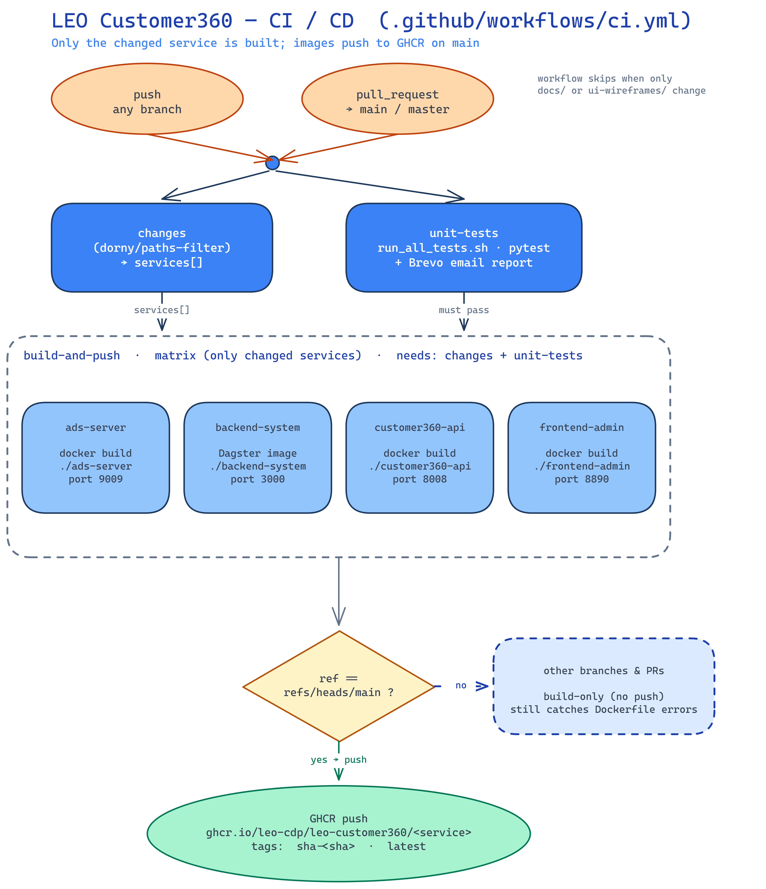

# CI / CD — `leo-customer360`

This folder holds the GitHub Actions automation for the monorepo. The single
workflow ([`workflows/ci.yml`](workflows/ci.yml)) runs, **for each changed
service**, its unit tests and then a Docker build — pushing the image to the
GitHub Container Registry (GHCR) on `main`.



> Diagram source: [`ci-pipeline.excalidraw`](ci-pipeline.excalidraw) — open it at
> [excalidraw.com](https://excalidraw.com) to edit, then re-export `ci-pipeline.png`.

---

## How it works

### 1. Triggers

Runs on **`push`** to any branch and on **`pull_request`** targeting
`main` / `master`. Skipped when a change touches *only* `docs/**` or
`ui-wireframes/**`.

### 2. `changes` — detect what moved

[`dorny/paths-filter`](https://github.com/dorny/paths-filter) compares the diff
against a filter per service and emits a **JSON array of the changed services**
(e.g. `["ads-server","frontend-admin"]`), which drives both matrices below.

### 3. `test` — one job per changed service

A matrix job (`needs: changes`) that runs **once per changed service**, invoking
that service's own test runner(s). Each job writes a **per-service result row**
(Service · Result · Duration) to the run's **Step Summary** and uploads its log.

> **Coverage note:** tests run only for *changed* services. To test all four on
> every run, replace `matrix.service` with a static list — there's a one-line
> comment marking the spot in `ci.yml`.

### 4. `build-and-push` — one image per changed service

A matrix job (`needs: [changes, test]`) — so a service's image builds only after
**its tests pass**. Builds `./<service>/Dockerfile` with Buildx + a per-service
GHA layer cache. **Pushes to GHCR only on `main`** (tags `sha-<sha>` + `latest`);
branches and PRs build-only, still catching Dockerfile breakage.

### 5. `notify` — aggregate summary + email

`needs: [changes, test]`, runs `always()`. Downloads every service's result,
renders **one aggregated table** into the run summary, and sends the Brevo email
(subject carries the overall test result; body includes the per-service table).

---

## Services, tests & images

| Service          | Build context       | Port | Test runner(s)                                          | Image on GHCR                                      |
| ---------------- | ------------------- | ---- | ------------------------------------------------------- | -------------------------------------------------- |
| `ads-server`     | `./ads-server`      | 9009 | `run_unit_tests.sh`                                     | `ghcr.io/leo-cdp/leo-customer360/ads-server`       |
| `backend-system` | `./backend-system`  | 3000 | `identity_resolution/run_tests.sh` + `segmentation/run_tests.sh` | `ghcr.io/leo-cdp/leo-customer360/customer360-dagster` |
| `customer360-api`| `./customer360-api` | 8008 | `run_unit_tests.sh`                                     | `ghcr.io/leo-cdp/leo-customer360/customer360-api`  |
| `frontend-admin` | `./frontend-admin`  | 8890 | *(none — reported as skip)*                             | `ghcr.io/leo-cdp/leo-customer360/frontend-admin`   |

Each image is published with two tags on `main`:

- `sha-<full-git-sha>` — immutable, use this for deploys and rollbacks
- `latest` — the newest build on the default branch

```bash
docker pull ghcr.io/leo-cdp/leo-customer360/customer360-api:sha-<git-sha>
docker pull ghcr.io/leo-cdp/leo-customer360/customer360-api:latest
```

The full local run of every suite still lives in [`../run_all_tests.sh`](../run_all_tests.sh).

---

## Operating notes

- **Registry auth.** Push uses the built-in `GITHUB_TOKEN` with `packages: write`
  (scoped to the build job). No extra secret needed. If a push returns `403`,
  set **Settings → Actions → General → Workflow permissions** to *Read and write*,
  and check the org/package **Packages** access.
- **Lowercase image names.** GHCR requires lowercase paths; `docker/metadata-action`
  lowercases automatically, so the uppercase org (`LEO-CDP`) in
  `${{ github.repository }}` is handled for you.
- **Add a service.** Add one line to the `changes` job's `filters:` and one `case`
  arm in the `test` job's runner map; both matrices pick it up automatically.
- **Test/build gating is all-or-nothing across the matrix:** if any service's
  tests fail, the whole `test` job is red and `build-and-push` is skipped.
- All backend-system code locations, including `identity_resolution`, are
  packaged in the single `backend-system` Dagster image. A change anywhere
  under `backend-system/` rebuilds that image.

---

## Secrets used

| Secret               | Used by | Purpose                          |
| -------------------- | ------- | -------------------------------- |
| `GITHUB_TOKEN`       | build   | GHCR login/push (auto-provided)  |
| `BREVO_SMTP_LOGIN`   | notify  | Email report auth                |
| `BREVO_SMTP_KEY`     | notify  | Email report auth                |
| `BREVO_SENDER_EMAIL` | notify  | Email report `from:` address     |
