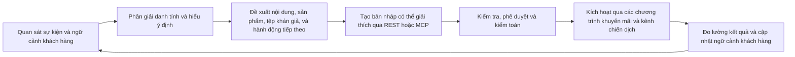
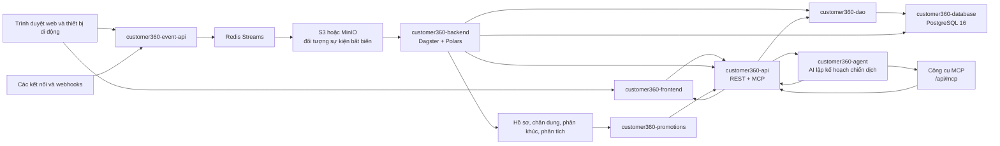

# LEOCDP: Agentic Customer 360 Platform

LEOCDP, Customer 360 là một nền tảng dữ liệu, phân tích thông minh, kích hoạt và trải nghiệm khách hàng đa người thuê (multi-tenant). Nó biến dữ liệu hồ sơ và hành vi thô thành ngữ cảnh khách hàng được quản trị, các phân khúc, đề xuất, chương trình khuyến mãi và các luồng công việc được AI hỗ trợ.

Kho mã nguồn (repository) được tổ chức xung quanh tám thành phần `customer360-*` cấp cao nhất. Chúng là các phần được kết nối của cùng một nền tảng, nhưng có các ranh giới quyền sở hữu khác nhau: SQL định nghĩa bộ nhớ lưu trữ bền vững (persistence), DAO sở hữu các truy cập cơ sở dữ liệu có thể tái sử dụng, các tác vụ backend (jobs) chuyển đổi và phân giải dữ liệu, các API phơi bày các giao kèo (contracts), và frontend cùng với agent sẽ tiêu thụ các giao kèo đó.

## Tầm nhìn Lộ trình: Nền tảng Customer 360 Định hướng Tác nhân (Agentic)

Nền tảng đang chuyển mình từ một nền tảng dữ liệu khách hàng đơn thuần sang một hệ thống ra quyết định dạng tác nhân (agentic) được quản trị: mỗi tương tác trở thành một ngữ cảnh khách hàng đáng tin cậy, mỗi quyết định đều có thể giải thích được, và mỗi lần kích hoạt đều tạo ra phản hồi có thể đo lường. AI sẽ giúp các đội ngũ hiểu rõ tệp khán giả, đề xuất hành động tốt nhất tiếp theo, tạo các bản nháp chiến dịch và vận hành thông qua các công cụ đã được phê duyệt mà không được vượt qua các ranh giới về tenant, sự đồng thuận, bảo mật hoặc sự quản trị của con người.

### Vòng lặp vận hành Agentic



### Các giai đoạn chuyển giao

1. **Nền tảng tin cậy (Trust foundation)** — Hoàn thiện phân giải danh tính an toàn cho tenant, xử lý sự đồng thuận và từ chối nhận tin, tiếp nhận sự kiện bền vững, thực thi RLS (bảo mật cấp dòng), lược đồ có thể kiểm toán, và các giao kèo REST/MCP ổn định. Event API vẫn hoạt động mà không cần cơ sở dữ liệu trên luồng xử lý yêu cầu; PostgreSQL tiếp tục là hệ thống lưu trữ gốc được quản trị cho ngữ cảnh khách hàng.
2. **Lớp phân tích thông minh (Intelligence layer)** — Bổ sung tính năng chấm điểm trên môi trường thực tế, vector nhúng (embeddings), tìm kiếm ngữ nghĩa, tệp khán giả tương tự (lookalike), phân khúc dựa trên đồ thị, và đề xuất theo thời gian thực cho web, di động, khuyến mãi và các tác nhân AI. Các đề xuất phải bao gồm độ mới, độ tin cậy, ngữ cảnh nguồn và phạm vi tenant.
3. **Kích hoạt được quản trị (Governed activation)** — Cho phép `customer360-agent` tạo các bản nháp chiến dịch, nội dung, khuyến mãi, email, Zalo và công nghệ quảng cáo. Việc con người phê duyệt vẫn là yêu cầu bắt buộc trước khi lên lịch, xuất bản, gửi hoặc chi tiêu. `customer360-promotions` phân phối các banner kỹ thuật số tiêu chuẩn, liên kết tiếp thị, nội dung tài trợ tự nhiên và các ứng viên đề xuất thông qua các giao kèo dịch vụ rõ ràng.
4. **Tối ưu hóa vòng lặp kín (Closed-loop optimization)** — Tương quan các lượt hiển thị, nhấp chuột, chuyển đổi, chi tiêu, kết quả phân phối và phản hồi của khách hàng trở lại Customer 360. Bổ sung hỗ trợ thử nghiệm, khả năng truy xuất phiên bản/mô hình, giám sát độ lệch và chất lượng dữ liệu, kích hoạt an toàn khi thử lại (retry-safe), và tối ưu hóa hành động tốt nhất tiếp theo có nhận thức về chính sách.

### Các ranh giới kỹ thuật bất di bất dịch

* Mọi thao tác đọc, ghi, đề xuất, công cụ tác nhân, xuất dữ liệu và kích hoạt đều phải được giới hạn theo tenant và kiểm tra quyền.
* Các tác nhân (Agents) có thể quan sát, giải thích, đề xuất và tạo bản nháp; chỉ con người được ủy quyền mới có thể phê duyệt hoặc kích hoạt các hành động tính phí hoặc hướng tới khách hàng.
* Quá trình tiếp nhận sự kiện phải xác thực và làm sạch dữ liệu payload trước khi xử lý bền vững qua Redis/S3 và không bao giờ ghi trực tiếp vào PostgreSQL trong luồng yêu cầu.
* Kích hoạt phải có tính lũy đẳng (idempotent), nhận thức sự đồng thuận, nhận thức từ chối nhận tin, có thể kiểm toán, an toàn khi thử lại và được bảo vệ bởi các bước kiểm tra trước (preflight checks).
* Câu lệnh nhắc (prompts), mô hình, nhà cung cấp, bằng chứng đề xuất, phê duyệt, bản sửa đổi và kết quả phải được phiên bản hóa để có thể tái tạo.
* Hành vi vận hành có thể quan sát được trên các yêu cầu API, hàng đợi sự kiện, các luồng Dagster, các cuộc gọi tác nhân, các quyết định đề xuất và các đợt kích hoạt.

## Luồng Nền tảng



### Vòng đời dữ liệu cốt lõi

1. Một trình duyệt, ứng dụng di động, trình kết nối hoặc webhook gửi hoạt động tới `customer360-event-api`.
2. Event API xác thực và làm sạch payload, chỉ xác nhận thành công sau khi đã đưa vào Redis Stream bền vững, và ghi các đối tượng NDJSON hàng giờ bất biến vào S3 hoặc MinIO. Luồng yêu cầu không ghi trực tiếp vào PostgreSQL.
3. Các Code Location của Dagster trong `customer360-backend` tiêu thụ dữ liệu thô, phân giải danh tính, tính toán lại phân khúc và tổng hợp phân tích. Các tác vụ (jobs) đang hoạt động bao gồm phân giải danh tính, phân khúc và phân tích; các vị trí mã bổ sung là các bộ khung (scaffolds) có thể chạy để phục vụ công việc kích hoạt và cá nhân hóa.
4. `customer360-dao` cung cấp các mô hình nhận thức theo tenant, repository, CRUD, ngữ cảnh RLS, an toàn SQL và các trình trợ giúp truy vấn event-lake. Nó được cài đặt dưới dạng một gói (package) thay vì import qua cách lách đường dẫn nguồn.
5. `customer360-api` phơi bày các tài nguyên REST đã xác thực cho hồ sơ, CRM, chân dung khách hàng, phân khúc, báo cáo, siêu dữ liệu (metadata) và các truy vấn đọc liên quan đến sự kiện. Ứng dụng phụ MCP của nó cung cấp các công cụ đã được phê duyệt trong phạm vi tenant cho các client AI.
6. `customer360-promotions` đánh giá dữ liệu khuyến mãi như vị trí đặt quảng cáo, chiến dịch, mẫu sáng tạo, banner kỹ thuật số tiêu chuẩn, liên kết tiếp thị, nội dung tài trợ tự nhiên và các ứng viên đề xuất. Các đối tượng PostgreSQL của nó nằm trong schema `leo_ads`.
7. `customer360-frontend` render trải nghiệm trình duyệt và gọi API. Nó không kết nối trực tiếp đến PostgreSQL và không chứa logic nghiệp vụ của khách hàng.
8. `customer360-agent` gọi API và dịch vụ lập kế hoạch chiến dịch qua HTTP; nó sử dụng cấu hình LiteLLM trung lập với nhà cung cấp và một kho prompt (prompt store) được phiên bản hóa trên PostgreSQL.

## Tám Thành phần

| Thành phần | Trách nhiệm | Giao kèo chính | Hình thái Runtime |
| --- | --- | --- | --- |
| [`customer360-database/`](https://www.google.com/search?q=customer360-database&utm_source=gemini) | Lược đồ chuẩn, dữ liệu mẫu, view và các bản migrate tiến | PostgreSQL 16 schema `customer360`, bảng tenant, RLS, graph, CRM, hồ sơ, sự kiện và dữ liệu prompt | Các file SQL được áp dụng bởi PostgreSQL bootstrap và [`deployments/postgres/run-sql.sh`](https://www.google.com/search?q=deployments/postgres/run-sql.sh&utm_source=gemini) |
| [`customer360-dao/`](https://www.google.com/search?q=customer360-dao&utm_source=gemini) | Ranh giới lưu trữ có thể tái sử dụng | Mô hình SQLAlchemy, lược đồ Pydantic, repository theo phạm vi tenant, CRUD, ngữ cảnh RLS, an toàn SQL và truy vấn event-lake | Gói Python có thể cài đặt; không có HTTP server |
| [`customer360-backend/`](https://www.google.com/search?q=customer360-backend&utm_source=gemini) | Xử lý dữ liệu và điều phối | Các job Dagster, sensors, schedules, xử lý Polars, phân giải danh tính, phân khúc, phân tích, và khung kích hoạt | Dagster workspace với 9 Code Locations |
| [`customer360-api/`](https://www.google.com/search?q=customer360-api&utm_source=gemini) | API ứng dụng được xác thực | Hợp đồng JSON REST/MCP và công cụ cho hồ sơ, CRM, chân dung, phân khúc, báo cáo, metadata và tích hợp | FastAPI trên cổng `8008`; REST kèm MCP được gắn tại `/mcp` |
| [`customer360-event-api/`](https://www.google.com/search?q=customer360-event-api&utm_source=gemini) | Thu thập sự kiện hành vi bền vững | `POST /api/v1/tracking/logs`; Hàng đợi Redis Streams; đối tượng sự kiện S3/MinIO bất biến | FastAPI trên cổng `8010`; luồng yêu cầu không cần DB |
| [`customer360-promotions/`](https://www.google.com/search?q=customer360-promotions&utm_source=gemini) | Phân phối khuyến mãi và đề xuất | Vị trí quảng cáo theo tenant, chiến dịch, mẫu quảng cáo, banner, theo dõi tiếp thị, nội dung tài trợ và phản hồi đề xuất | FastAPI trên cổng `9009`; schema `leo_ads` và Redis cache |
| [`customer360-frontend/`](https://www.google.com/search?q=customer360-frontend&utm_source=gemini) | Trải nghiệm trình duyệt cho Admin và Operator | Vỏ SPA tĩnh, giao diện, trạng thái xác thực/phiên, dashboard và các lời gọi API | FastAPI shell trên cổng `8890`; không truy cập DB trực tiếp |
| [`customer360-agent/`](https://www.google.com/search?q=customer360-agent&utm_source=gemini) | Client và dịch vụ lập kế hoạch chiến dịch bằng AI | `/plan/campaign`, `/plan/zalo`, gọi dịch vụ bằng bearer-token, trừu tượng hóa nhà cung cấp LiteLLM, prompt được phiên bản hóa | FastAPI trên cổng `8009`; gói client được tiêu thụ bởi `customer360-api` |

### Thành phần nào thuộc về đâu

* **Quy tắc cơ sở dữ liệu** thuộc về `customer360-database` và các tệp migration của nó.
* **Logic lưu trữ có thể tái sử dụng** thuộc về `customer360-dao`, không nằm trong các router của API hay mã frontend.
* **Biến đổi dữ liệu chạy dài và xử lý theo lịch trình** thuộc về các Dagster Code Location trong `customer360-backend`.
* **Xác thực HTTP, ngữ cảnh tenant, xác thực yêu cầu và giao kèo API** thuộc về `customer360-api` hoặc các dịch vụ sự kiện/khuyến mãi chuyên biệt.
* **Tiếp nhận sự kiện** phải xác thực, làm sạch và đưa vào Redis Streams hoặc object storage. `customer360-event-api` tuyệt đối không kết nối trực tiếp với database trong luồng yêu cầu.
* **Trình bày trên trình duyệt** thuộc về `customer360-frontend`; nó tiêu thụ các phản hồi API và không bao giờ được đi tắt qua các ranh giới API có nhận thức về tenant.
* **Các lệnh gọi nhà cung cấp AI và vòng đời prompt** thuộc về `customer360-agent`; API lõi sử dụng giao kèo client của nó thay vì import trực tiếp logic bên trong của bộ lập kế hoạch.

## Các Giao kèo Runtime

### An toàn về Tenant và Danh tính

Mọi thao tác đọc hoặc ghi hướng tới khách hàng đều phải tuân thủ `tenant_id`. Quá trình xác thực (Authentication) giải quyết caller và ngữ cảnh tenant; các repository và chính sách bảo mật cơ sở dữ liệu cung cấp khả năng phòng thủ đa lớp (defense in depth). Phân giải danh tính bảo tồn các định danh lịch sử trong khi hợp nhất hoạt động vào một hồ sơ chính. Không suy luận phạm vi tenant từ các giá trị tùy ý trong payload yêu cầu hoặc vượt qua ranh giới DAO/API.

### Ranh giới lưu trữ

| Dữ liệu | Hệ thống gốc (System of record) | Ghi chú |
| --- | --- | --- |
| Hồ sơ gốc, CRM, persona, phân khúc, metadata, graph, prompt store | PostgreSQL `customer360` | Lược đồ chuẩn trong `customer360-database`; có áp dụng RLS và khóa ngoại |
| Sự kiện hành vi thô | S3 hoặc MinIO event lake | Đối tượng NDJSON hàng giờ bất biến; các thông báo Redis Stream mang tính bàn giao bền vững |
| Hàng đợi sự kiện, giới hạn rate limit, siêu dữ liệu phiên, ánh xạ API-key, caches | Redis | Redis Streams là bắt buộc để xác nhận sự kiện bền vững; các bộ nhớ đệm tùy chọn có thể fail-open nếu được cấu hình |
| Vị trí quảng cáo, chiến dịch, mẫu sáng tạo, endpoint theo dõi | PostgreSQL `leo_ads` | Thuộc sở hữu của `customer360-promotions`; tiền tố route công khai là `/ads` |
| Tác nhân AI, mô hình chấm điểm, và prompt được phiên bản hóa | PostgreSQL `customer360.cdp_ai_agents` (`system_instructions` + `prompt_versions`) | Được tạo mẫu bởi `customer360-database/init-core-database.sql` và `init-prompt-store-seed.sql` |

### Ranh giới API và Trải nghiệm

* Trình duyệt và client bên ngoài sử dụng `customer360-api` và `customer360-event-api`; chúng không kết nối trực tiếp đến PostgreSQL.
* Client AI sử dụng bề mặt MCP đã được xác thực dưới `customer360-api/mcp`.
* `customer360-agent` là một dịch vụ HTTP nội bộ được gọi bởi API và được bảo vệ bởi `AGENT_API_TOKEN` cho các route lập kế hoạch.
* `customer360-promotions` cung cấp bề mặt nội dung và quyết định khuyến mãi; API lõi và frontend tích hợp với nó thông qua các giao kèo dịch vụ.
* Frontend được cấu hình cho các URL API có thể truy cập được từ trình duyệt. Hostname trong mạng Docker không tự động là URL trình duyệt hợp lệ.

## Cấu trúc Triển khai

### Phát triển Local

Stack phát triển local sử dụng Docker cho hạ tầng và một số API chọn lọc:

* `dev-docker-compose.yml` chạy PostgreSQL, Redis, Keycloak, MinIO, và Event API; các tiến trình trên máy host sẽ chạy API chính và các job Dagster.
* `dev-no-sso-docker-compose.yml` cung cấp cùng một quy trình tương tự nhưng không phụ thuộc vào Keycloak.
* `docker-compose.yml` là stack tất-cả-trong-một mô phỏng môi trường production với PostgreSQL, Redis, Keycloak, Dagster, `customer360-api`, agent, Event API, và hồ sơ dữ liệu mẫu tùy chọn.
* `deployments/` chứa các kịch bản triển khai VM, các overlay Terraform, cấu hình proxy, giám sát, lưu trữ và sơ đồ triển khai.
* `k8s/` chứa các tài nguyên triển khai Dagster và nền tảng hướng Kubernetes.

### Các đường dẫn hướng tới Production

Proxy triển khai thông thường sẽ mở các cổng:

| Đường dẫn công khai | Thành phần | Cổng mặc định |
| --- | --- | --- |
| `/` | `customer360-frontend` | `8890` |
| `/c360api` | `customer360-api` | `8008` |
| `/ads` | `customer360-promotions` | `9009` |
| `/data` | `customer360-event-api` | `8010` |
| `/mcp` | Bề mặt MCP được mount bởi `customer360-api` | `8008` |
| `/ai` | Proxy tìm kiếm vector tài liệu qua frontend | `8001` |

Hạ tầng được cấp phát riêng biệt với mã nguồn ứng dụng. Terraform quản lý các module môi trường và trạng thái từ xa; các kịch bản triển khai sẽ vận chuyển thư mục `customer360-*` thích hợp và cài đặt `customer360-dao` cục bộ tại nơi file requirements của dịch vụ chỉ định gói (package) này.

## Phát triển Local

### Khởi động luồng làm việc phát triển

```bash
cp .env.example .env
./dev-c360.sh

```

`dev-c360.sh` sẽ khởi động stack hạ tầng, đợi kiểm tra sức khỏe (health checks), xây dựng dịch vụ tìm kiếm tài liệu và tạo dữ liệu mẫu nếu database trống. Đây là điểm vào ưu tiên cho quy trình phát triển host-run API và Dagster.

Các biến thể hữu ích:

```bash
./dev-c360.sh no-seed       # bỏ qua việc tạo dữ liệu mẫu phân giải danh tính
./dev-c360.sh seed-new-data # gửi traffic giả lập qua customer360-event-api
./dev-c360.sh restart       # khởi động lại tìm kiếm tài liệu và các dịch vụ chạy trên host
./dev-c360.sh upgrade       # build lại các dịch vụ local hiện tại mà không xóa volume
./dev-c360.sh reset -y      # hành động phá hủy: xóa Docker volume và tạo lại stack

```

Chạy các dịch vụ trên host ở các terminal riêng biệt khi sử dụng quy trình dev Compose:

```bash
cd customer360-api && ./start.sh
cd customer360-backend/identity_resolution && ./run-demo.sh
cd customer360-frontend && ./start.sh

```

Đối với quy trình Docker được đóng gói:

```bash
./manage-c360.sh start
./manage-c360.sh status
./manage-c360.sh logs customer360-api

```

### Cài đặt DAO dùng chung

Đăng ký DAO đã được check-out trước khi cài đặt requirements của dịch vụ có chứa tên gói:

```bash
./customer360-dao/install-local.sh
./customer360-dao/install-local.sh --requirements

```

Cài đặt có mục tiêu rất hữu ích khi làm việc trên một dịch vụ cụ thể:

```bash
./customer360-dao/install-local.sh --service customer360-api --requirements
./customer360-dao/install-local.sh --service customer360-backend/segmentation --requirements
./customer360-agent/install-local.sh --service customer360-api --requirements

```

## Kiểm thử (Testing)

Chạy bộ test cấp độ repository với:

```bash
./run_all_tests.sh

```

Các runner tập trung bao gồm:

```bash
./customer360-api/run_unit_tests.sh
./customer360-event-api/run_unit_tests.sh
./customer360-promotions/run_unit_tests.sh
./customer360-agent/run_unit_tests.sh
bash customer360-dao/run_tests.sh
cd customer360-backend/identity_resolution && ./run_tests.sh

```

Một số bộ test tích hợp yêu cầu có PostgreSQL, Redis, MinIO/S3, Keycloak, hoặc một dịch vụ đang chạy. Các runner unit sẽ báo cáo khi những dependency này không khả dụng; đừng đánh đồng các test tích hợp bị bỏ qua (skipped) là độ phủ end-to-end hoàn chỉnh.

## Bản đồ Tài liệu

* [`customer360-api/README.md`](https://www.google.com/search?q=customer360-api/README.md&utm_source=gemini) - Bề mặt REST/MCP, xác thực, ngữ cảnh tenant và an toàn công cụ MCP.
* [`customer360-backend/README.md`](https://www.google.com/search?q=customer360-backend/README.md&utm_source=gemini) - Code Location của Dagster, các khối lượng công việc được giới hạn, xử lý dữ liệu và điều khiển vận hành.
* [`customer360-dao/README.md`](https://www.google.com/search?q=customer360-dao/README.md&utm_source=gemini) - bố cục gói, cài đặt, repositories, ngữ cảnh RLS và kiểm thử.
* [`customer360-database/README.md`](https://www.google.com/search?q=customer360-database/README.md&utm_source=gemini) - yêu cầu về schema, thứ tự khởi tạo, dữ liệu mẫu, view và migrations.
* [`customer360-event-api/README.md`](https://www.google.com/search?q=customer360-event-api/README.md&utm_source=gemini) - phong bì sự kiện (event envelope), Redis Streams, lưu trữ S3/MinIO, các trường danh tính và giao kèo API.
* [`customer360-promotions/README.md`](https://www.google.com/search?q=customer360-promotions/README.md&utm_source=gemini) - banners, liên kết tiếp thị, nội dung tài trợ, các đề xuất và giao kèo môi trường `c360_PROMOTION_*`.
* [`customer360-frontend/README.md`](https://www.google.com/search?q=customer360-frontend/README.md&utm_source=gemini) - vỏ trình duyệt, luồng xác thực/phiên, giao diện template và tích hợp API.
* [`customer360-agent/README.md`](https://www.google.com/search?q=customer360-agent/README.md&utm_source=gemini) - Nhà cung cấp LiteLLM, prompt store, các endpoint lập kế hoạch và bảo mật bằng bearer-token.
* [`deployments/README.md`](https://www.google.com/search?q=deployments/README.md&utm_source=gemini) - Cấu trúc VM, Terraform, các route proxy, trạng thái từ xa và vận hành production.
* [`k8s/README.md`](https://www.google.com/search?q=k8s/README.md&utm_source=gemini) - Nền tảng Kubernetes và tài liệu triển khai Dagster.

## Tài liệu Tham khảo

* [Trang tài liệu](https://leo-cdp.github.io/leo-customer360/?utm_source=gemini)
* [Dagster](https://dagster.io/?utm_source=gemini)
* [FastAPI](https://fastapi.tiangolo.com/?utm_source=gemini)
* [Model Context Protocol](https://modelcontextprotocol.io/?utm_source=gemini)
* [PostgreSQL](https://www.postgresql.org/?utm_source=gemini)
* [pgvector](https://github.com/pgvector/pgvector?utm_source=gemini)
* [PostGIS](https://postgis.net/?utm_source=gemini)