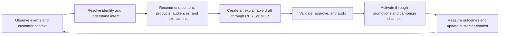
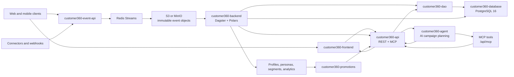

# Customer 360 Platform

Customer 360 is a multi-tenant customer data, intelligence, activation, and experience platform. It turns raw profile and behavioral data into governed customer context, segments, recommendations, promotions, and AI-assisted workflows.

The repository is organized around eight top-level `customer360-*` components. They are connected parts of one platform, but they have different ownership boundaries: SQL defines persistence, the DAO owns reusable database access, backend jobs transform and resolve data, APIs expose contracts, and the frontend and agent consume those contracts.

## Roadmap Vision: Agentic Customer 360 Platform

The platform is moving from a customer data platform into a governed agentic decision system: every interaction becomes trusted customer context, every decision is explainable, and every activation produces measurable feedback. AI should help teams understand audiences, recommend the next best action, create campaign drafts, and operate through approved tools without bypassing tenant, consent, security, or human-governance boundaries.

### Agentic operating loop



### Delivery horizons

1. **Trust foundation** — Complete tenant-safe identity resolution, consent and suppression handling, durable event ingestion, RLS enforcement, auditable schemas, and stable REST/MCP contracts. The event API remains database-free on the request path; PostgreSQL remains the governed system of record for mastered customer context.
2. **Intelligence layer** — Add production scoring, embeddings, semantic search, lookalike audiences, graph-aware segmentation, and real-time recommendations for web, mobile, promotions, and AI agents. Recommendations must include freshness, confidence, source context, and tenant scope.
3. **Governed activation** — Let `customer360-agent` generate campaign, content, promotion, email, Zalo, and ad-tech drafts. Human approval remains mandatory before scheduling, publishing, sending, or spending. `customer360-promotions` delivers standard digital banners, affiliate links, sponsored native content, and recommendation candidates through explicit service contracts.
4. **Closed-loop optimization** — Correlate impressions, clicks, conversions, spend, delivery outcomes, and customer responses back into Customer 360. Add experiment support, model/version traceability, drift and data-quality monitoring, retry-safe activation, and policy-aware next-best-action optimization.

### Non-negotiable technical guardrails

- Every read, write, recommendation, agent tool, export, and activation is tenant-scoped and permission-checked.
- Agents can observe, explain, recommend, and draft; only authorized humans can approve or activate billable or customer-facing actions.
- Event ingestion validates and sanitizes payloads before durable Redis/S3 handling and never performs direct PostgreSQL writes in the request path.
- Activation is idempotent, consent-aware, suppression-aware, auditable, retry-safe, and protected by preflight checks.
- Prompts, models, providers, recommendation evidence, approvals, revisions, and outcomes are versioned for reproducibility.
- Operational behavior is observable across API requests, event queues, Dagster jobs, agent calls, recommendation decisions, and activation runs.

## Platform Flow



### Core data lifecycle

1. A browser, mobile client, connector, or webhook submits activity to `customer360-event-api`.
2. The event API validates and sanitizes the payload, acknowledges only after durable Redis Stream enqueue, and writes immutable hourly NDJSON objects to S3 or MinIO. The request path does not write directly to PostgreSQL.
3. `customer360-backend` Dagster code locations consume raw data, resolve identities, recompute segments, and aggregate analytics. The active jobs are identity resolution, segmentation, and analytics; additional locations are runnable scaffolds for activation and personalization work.
4. `customer360-dao` provides tenant-aware models, repositories, CRUD, RLS context, SQL safety, and event-lake query helpers. It is installed as a package rather than imported through a source-path workaround.
5. `customer360-api` exposes authenticated REST resources for profiles, CRM, personas, segments, reporting, metadata, and event-related reads. Its MCP sub-application exposes approved tenant-scoped tools for AI clients.
6. `customer360-promotions` evaluates promotion data such as placements, campaigns, creatives, standard digital banners, affiliate links, sponsored native content, and recommendation candidates. Its PostgreSQL objects live in the `leo_ads` schema.
7. `customer360-frontend` renders the browser experience and calls the API. It does not connect directly to PostgreSQL or own customer business logic.
8. `customer360-agent` calls the API and campaign-planning service over HTTP; it uses provider-neutral LiteLLM configuration and a versioned PostgreSQL prompt store.

## The Eight Components

| Component | Responsibility | Primary contract | Runtime shape |
|---|---|---|---|
| [`customer360-database/`](customer360-database) | Canonical schema, seeds, views, and forward migrations | PostgreSQL 16 `customer360` schema, tenant tables, RLS, graph, CRM, profile, event, and prompt data | SQL files applied by PostgreSQL bootstrap and [`deployments/postgres/run-sql.sh`](deployments/postgres/run-sql.sh) |
| [`customer360-dao/`](customer360-dao) | Reusable persistence boundary | SQLAlchemy models, Pydantic schemas, tenant-scoped repositories, CRUD, RLS context, SQL safety, and event-lake queries | Installable Python package; no HTTP server |
| [`customer360-backend/`](customer360-backend) | Data processing and orchestration | Dagster jobs, sensors, schedules, Polars transformations, identity resolution, segmentation, analytics, and activation scaffolds | Dagster workspace with nine code locations |
| [`customer360-api/`](customer360-api) | Authenticated application API | REST/MCP JSON and tool contracts for profiles, CRM, personas, segments, reporting, metadata, and integrations | FastAPI on port `8008`; REST plus MCP mounted under `/mcp` |
| [`customer360-event-api/`](customer360-event-api) | Durable behavioral-event ingestion | `POST /api/v1/tracking/logs`; Redis Streams enqueue; immutable S3/MinIO event objects | FastAPI on port `8010`; database-free request path |
| [`customer360-promotions/`](customer360-promotions) | Promotion delivery and recommendations | Tenant-scoped placements, campaigns, creatives, banners, affiliate tracking, sponsored content, and recommendation responses | FastAPI on port `9009`; `leo_ads` schema and Redis cache |
| [`customer360-frontend/`](customer360-frontend) | Admin and operator browser experience | Static SPA shell, templates, auth/session state, dashboards, and API calls | FastAPI shell on port `8890`; no direct database access |
| [`customer360-agent/`](customer360-agent) | AI campaign-planning service and client | `/plan/campaign`, `/plan/zalo`, bearer-token service calls, LiteLLM provider abstraction, versioned prompts | FastAPI on port `8009`; client package consumed by `customer360-api` |

### What belongs where

- **Database rules** belong in `customer360-database` and its migrations.
- **Reusable persistence logic** belongs in `customer360-dao`, not in API routers or frontend code.
- **Long-running transformations and scheduled processing** belong in `customer360-backend` Dagster code locations.
- **HTTP authentication, tenant context, request validation, and API contracts** belong in `customer360-api` or the specialized event/promotions services.
- **Event ingestion** must validate, sanitize, and enqueue to Redis Streams or object storage. `customer360-event-api` must not connect directly to the database on the request path.
- **Browser presentation** belongs in `customer360-frontend`; it consumes API responses and never bypasses tenant-aware API boundaries.
- **AI provider calls and prompt lifecycle** belong in `customer360-agent`; the core API uses its client contract rather than importing planner internals.

## Runtime Contracts

### Tenant and identity safety

Every customer-facing read or write must respect `tenant_id`. Authentication resolves the caller and tenant context; repositories and database policies provide defense in depth. Identity resolution preserves historical identifiers while consolidating activity into a master profile. Do not infer tenant scope from arbitrary request-body values or bypass the DAO/API boundary.

### Storage boundaries

| Data | System of record | Notes |
|---|---|---|
| Master profiles, CRM, personas, segments, metadata, graph, prompt store | PostgreSQL `customer360` | Canonical schema in `customer360-database`; RLS and foreign keys apply |
| Raw behavioral events | S3 or MinIO event lake | Immutable hourly NDJSON objects; Redis Stream messages carry the durable handoff |
| Event queue, rate limits, session metadata, API-key mappings, caches | Redis | Redis Streams are required for durable event acknowledgement; optional caches fail open where configured |
| Promotion placements, campaigns, creatives, tracking endpoints | PostgreSQL `leo_ads` | Owned by `customer360-promotions`; public route prefix is `/ads` |
| Versioned agent prompts | PostgreSQL `customer360.prompt_template` and `prompt_version` | Seeded by `customer360-database/init-prompt-store-seed.sql` |

### API and experience boundaries

- Browser and external clients use `customer360-api` and `customer360-event-api`; they do not connect to PostgreSQL directly.
- AI clients use the authenticated MCP surface under `customer360-api/mcp`.
- `customer360-agent` is an internal HTTP service called by the API and is protected by `AGENT_API_TOKEN` for planning routes.
- `customer360-promotions` provides the promotion decision and content surface; the core API and frontend integrate with it through service contracts.
- The frontend is configured for browser-reachable API URLs. Docker network hostnames are not automatically valid browser URLs.

## Deployment Topology

### Local development

The local development stack uses Docker for infrastructure and selected APIs:

- `dev-docker-compose.yml` runs PostgreSQL, Redis, Keycloak, MinIO, and the event API; host processes run the main API and Dagster jobs.
- `dev-no-sso-docker-compose.yml` provides the same core workflow without the Keycloak dependency.
- `docker-compose.yml` is the production-shaped all-in-one stack with PostgreSQL, Redis, Keycloak, Dagster, `customer360-api`, the agent, the event API, and the optional demo-seed profile.
- `deployments/` contains VM deployment scripts, Terraform overlays, proxy configuration, monitoring, storage, and deployment diagrams.
- `k8s/` contains the Kubernetes-oriented Dagster and platform deployment material.

### Production-facing paths

The deployment proxy normally exposes:

| Public path | Component | Default port |
|---|---|---:|
| `/` | `customer360-frontend` | `8890` |
| `/c360api` | `customer360-api` | `8008` |
| `/ads` | `customer360-promotions` | `9009` |
| `/data` | `customer360-event-api` | `8010` |
| `/mcp` | MCP surface mounted by `customer360-api` | `8008` |
| `/ai` | Docs-vector-search proxy through the frontend | `8001` |

Infrastructure is provisioned separately from application code. Terraform manages the environment modules and remote state; deployment scripts ship the appropriate `customer360-*` directory and locally install `customer360-dao` where a service requirements file refers to the package.

## Local Development

### Start the development workflow

```bash
cp .env.example .env
./dev-c360.sh
```

`dev-c360.sh` starts the infrastructure stack, waits for health checks, builds the docs search service, and seeds demo data when the database is empty. It is the preferred entrypoint for a host-run API and Dagster development workflow.

Useful variants:

```bash
./dev-c360.sh no-seed       # skip the identity-resolution demo seed
./dev-c360.sh seed-new-data # send synthetic traffic through customer360-event-api
./dev-c360.sh restart      # restart docs search and host-run services
./dev-c360.sh upgrade      # rebuild current local services without deleting volumes
./dev-c360.sh reset -y      # destructive: remove Docker volumes and recreate the stack
```

Run host services in separate terminals when using the dev Compose workflow:

```bash
cd customer360-api && ./start.sh
cd customer360-backend/identity_resolution && ./run-demo.sh
cd customer360-frontend && ./start.sh
```

For the packaged Docker workflow:

```bash
./manage-c360.sh start
./manage-c360.sh status
./manage-c360.sh logs customer360-api
```

### Shared DAO installation

Register the checked-out DAO before installing service requirements that contain the package name:

```bash
./customer360-dao/install-local.sh
./customer360-dao/install-local.sh --requirements
```

Targeted setup is useful when working on one service:

```bash
./customer360-dao/install-local.sh --service customer360-api --requirements
./customer360-dao/install-local.sh --service customer360-backend/segmentation --requirements
./customer360-agent/install-local.sh --service customer360-api --requirements
```

## Testing

Run the repository-level suites with:

```bash
./run_all_tests.sh
```

Focused runners include:

```bash
./customer360-api/run_unit_tests.sh
./customer360-event-api/run_unit_tests.sh
./customer360-promotions/run_unit_tests.sh
./customer360-agent/run_unit_tests.sh
bash customer360-dao/run_tests.sh
cd customer360-backend/identity_resolution && ./run_tests.sh
```

Some integration suites require PostgreSQL, Redis, MinIO/S3, Keycloak, or a running service. Unit runners report when those dependencies are unavailable; do not interpret skipped integration tests as full end-to-end coverage.

## Documentation Map

- [`customer360-api/README.md`](customer360-api/README.md) - REST/MCP surfaces, authentication, tenant context, and MCP tool safety.
- [`customer360-backend/README.md`](customer360-backend/README.md) - Dagster code locations, bounded workloads, data processing, and operational controls.
- [`customer360-dao/README.md`](customer360-dao/README.md) - package layout, installation, repositories, RLS context, and tests.
- [`customer360-database/README.md`](customer360-database/README.md) - schema requirements, initialization order, seeds, views, and migrations.
- [`customer360-event-api/README.md`](customer360-event-api/README.md) - event envelope, Redis Streams, S3/MinIO storage, identity fields, and API contract.
- [`customer360-promotions/README.md`](customer360-promotions/README.md) - banners, affiliate links, sponsored content, recommendations, and the `c360_PROMOTION_*` environment contract.
- [`customer360-frontend/README.md`](customer360-frontend/README.md) - browser shell, auth/session flow, templates, and API integration.
- [`customer360-agent/README.md`](customer360-agent/README.md) - LiteLLM providers, prompt store, planning endpoints, and bearer-token security.
- [`deployments/README.md`](deployments/README.md) - VM topology, Terraform, proxy routes, remote state, and production operations.
- [`k8s/README.md`](k8s/README.md) - Kubernetes platform and Dagster deployment material.

## References

- [Documentation site](https://leo-cdp.github.io/leo-customer360/)
- [Dagster](https://dagster.io/)
- [FastAPI](https://fastapi.tiangolo.com/)
- [Model Context Protocol](https://modelcontextprotocol.io/)
- [PostgreSQL](https://www.postgresql.org/)
- [pgvector](https://github.com/pgvector/pgvector)
- [PostGIS](https://postgis.net/)