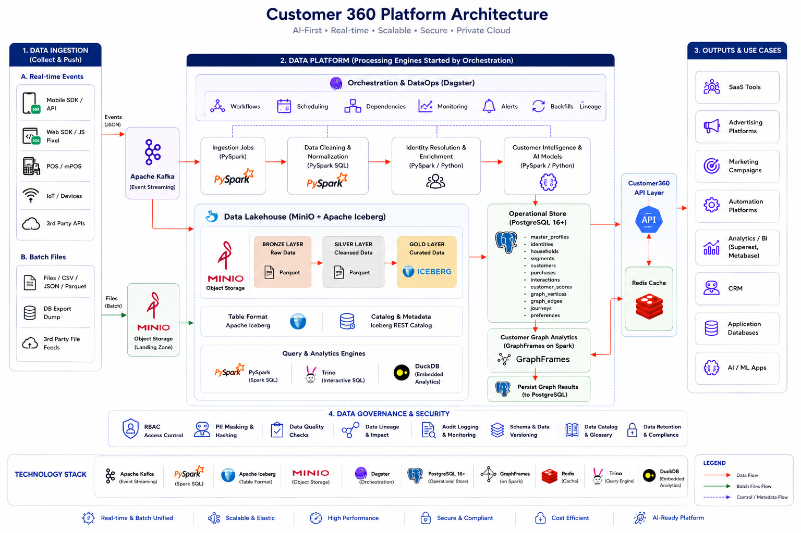

# Customer 360

Customer 360 is the identity-resolution and golden-record layer for the LEO CDP platform. The repository combines a PostgreSQL-backed customer graph, a FastAPI read/write API, a Dagster orchestration workspace, and a thin admin frontend that consumes the API.

The code in this repo is not an abstract demo. It reflects a real platform layout with:

- a PostgreSQL 16 schema for master profiles, raw profiles, links, CRM entities, personas, and segmentation metadata
- a FastAPI API in `customer360-api/` for CRUD, reporting, auth, and tenant-scoped access
- a Dagster workspace in `backend-system/` that runs identity resolution and segmentation jobs
- a browser-based admin UI in `frontend-admin/` that calls the API over HTTP
- local Docker-based startup and demo seeding scripts in the repo root



## What is implemented today

The current repo has two live backend services and a set of placeholder service skeletons.

| Area | Status | Notes |
|---|---|---|
| `backend-system/identity_resolution/` | Implemented | Dagster identity-resolution job; resolves raw profile matches into master profiles |
| `backend-system/segmentation/` | Implemented | Recomputes active segments and syncs member/tag data back to master profiles |
| `customer360-api/` | Implemented | Main REST API for identity, CRM, persona, reporting, and metadata |
| `frontend-admin/` | Implemented | FastAPI shell for the UI, backed by client-side JS and API requests |
| `scoring`, `analytics`, `data_synch`, `email_engine`, `notification_engine`, `campaign_activation`, `personalization` | Placeholder | Minimal Dagster scaffolds ready to be filled in |

## Repository structure

| Path | Purpose |
|---|---|
| [`database-init/`](database-init) | Schema source: `database-schema.sql`, seed/init scripts, and SQL views |
| [`backend-system/`](backend-system) | Dagster workspace with active jobs and placeholder service code locations |
| [`customer360-api/`](customer360-api) | FastAPI service with routers, auth, SQLAlchemy models, and business logic |
| [`frontend-admin/`](frontend-admin) | Thin admin UI served by FastAPI and loaded from static templates |
| [`all-data-simulator/`](all-data-simulator) | Synthetic raw data and optional S3/MinIO upload helpers |
| [`data-tracking-api/`](data-tracking-api) | FastAPI service that stores CDP tracking logs in hourly S3/MinIO objects |
| [`docs/`](docs) | Architecture, operations, and planning material |
| [`postgres/`](postgres), [`redis/`](redis) | Docker image setup for Postgres and Redis |
| [`ui-wireframes/`](ui-wireframes) | UI design references |

## Runtime architecture

The repo runs with the following high-level flow:

1. Postgres stores the canonical `customer360` schema and all operational metadata.
2. `customer360-api` exposes the public API and enforces tenant-aware auth via middleware.
3. The Dagster backend runs jobs such as identity resolution and segmentation in a monitored workflow.
4. The admin frontend calls the API directly, without direct database access.
5. The data-tracking API stores immutable hourly NDJSON batches in per-source S3 buckets; dev uses the in-network MinIO service.
6. Local dev and production scripts bootstrap dockerized infrastructure and run the platform as a coherent stack.

## Local development quick start

### 1) Prepare environment

```bash
cp .env.example .env
```

Then edit the values in `.env` for your local Postgres, Redis, Keycloak, and host ports. The repo includes a full env template and operational notes in the docs.

### 2) Start the dev stack

```bash
./dev-c360.sh
```

This script starts the infra stack and the MinIO-backed data-tracking API in Docker, then automatically seeds demo data if the database is empty. It is meant for the workflow where Postgres and Redis run in Docker while the main API and backend workers run directly on the host.

### 3) Run host services

In a separate terminal, start the API and backend workers:

```bash
cd customer360-api
./start.sh

cd ../backend-system/identity_resolution
./run-demo.sh
```

The admin frontend can also be started separately:

```bash
cd ../frontend-admin
./start.sh
```

## Production-style stack

For the packaged stack using Docker Compose, run:

```bash
./manage-c360.sh start
./manage-c360.sh status
```

This covers the main production service stack in `docker-compose.yml`, including Postgres, Redis, Keycloak, Dagster, the APIs, and the data-tracking service. The script is the recommended entrypoint for production-like local deployment and first-time env bootstrapping.

## Service entrypoints

The repo uses these primary entrypoints:

- `customer360-api/app.py` — FastAPI API entrypoint
- `data-tracking-api/app.py` — CDP tracking-log FastAPI entrypoint (port 8010)
- `backend-system/identity_resolution/worker.py` — legacy local polling helper; production runs the Dagster job
- `frontend-admin/app.py` — admin frontend shell
- `manage-c360.sh` — production-style Docker stack manager
- `dev-c360.sh` — local dev infrastructure bootstrap

## Authentication and tenant context

The API is auth-protected on nearly every route. The current implementation requires a valid bearer token on all non-exempt endpoints, and it resolves tenant/user context from the token or Keycloak-backed auth flow. The code now intentionally rejects header-only login shortcuts, so the runtime behavior matches the current API docs in `customer360-api/customer360-api.md`.

The usual local flow is:

```bash
curl -s -X POST http://localhost:8008/api/v1/auth/login \
  -H 'Content-Type: application/json' \
  -d '{"username":"admin","password":"<password from .env>"}'
```

Then pass the returned `access_token` as a bearer token in subsequent requests.

## Testing

The repo includes a consolidated test runner:

```bash
./run_all_tests.sh
```

This is the current project-level smoke/test entrypoint for the API and identity-resolution logic.

## Key documentation

Start here for deeper context:

- [`docs/TECHNICAL-DOCUMENTATION.md`](docs/TECHNICAL-DOCUMENTATION.md)
- [`docs/DOCKER-COMPOSE-GUIDE.md`](docs/DOCKER-COMPOSE-GUIDE.md)
- [`customer360-api/customer360-api.md`](customer360-api/customer360-api.md)
- [`backend-system/README.md`](backend-system/README.md)
- [`frontend-admin/README.md`](frontend-admin/README.md)

## References

- [LEOCDP.com](https://leocdp.com)
- [Dagster](https://dagster.io)
- [FastAPI](https://fastapi.tiangolo.com/)
- [PostgreSQL](https://www.postgresql.org/)
- [pgvector](https://github.com/pgvector/pgvector)
- [PostGIS](https://postgis.net/)

