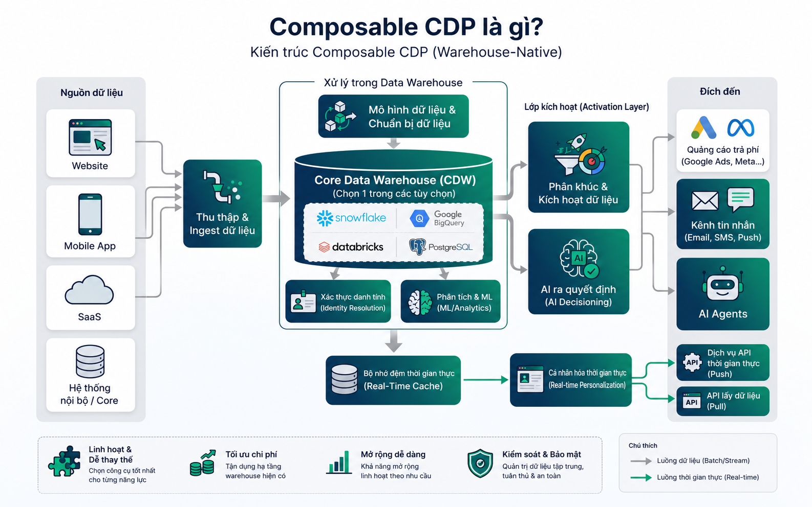
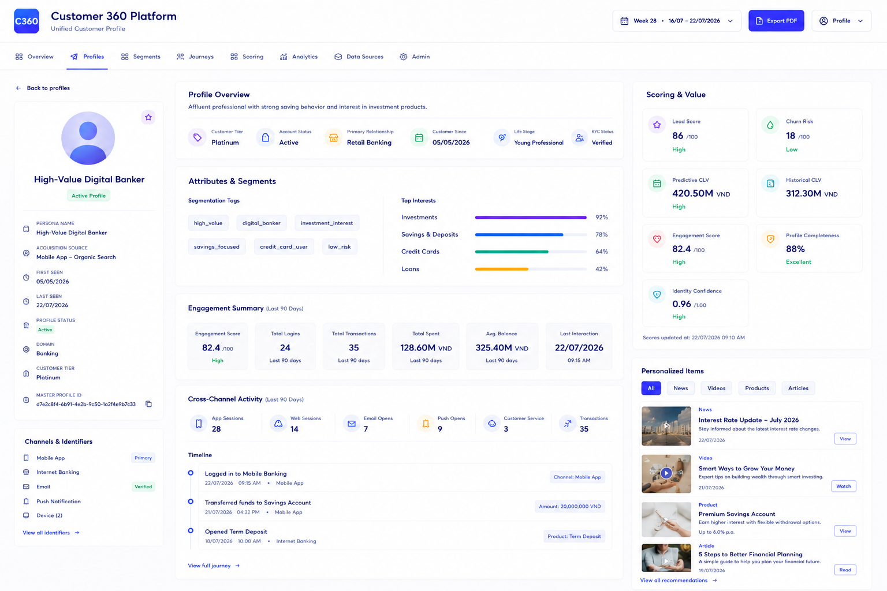
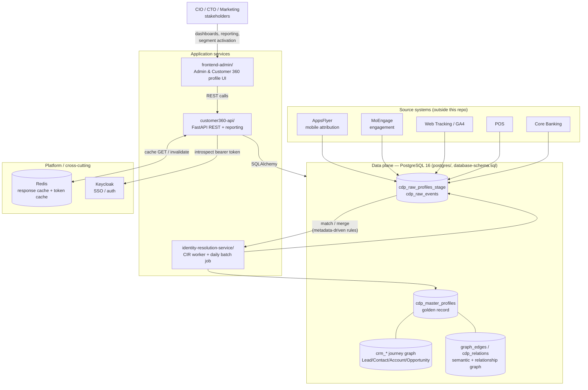
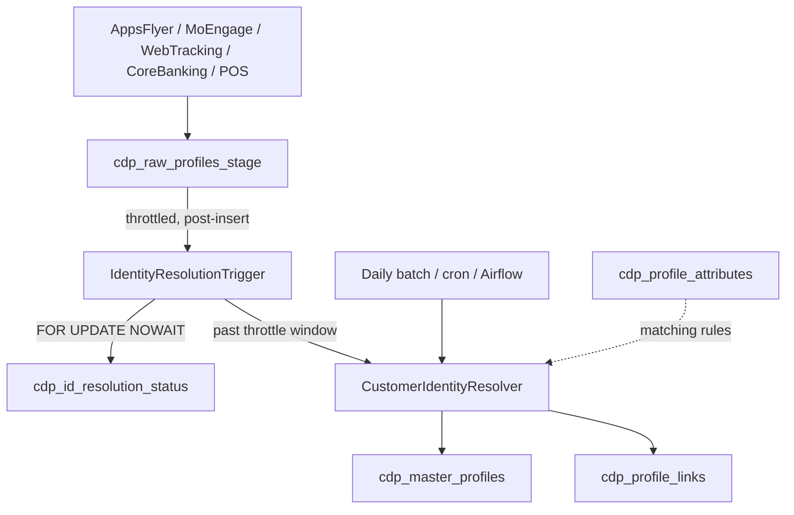

# Customer 360 for Composable CDP

## What is a Composable CDP?

A composable CDP is an approach to building customer data platform capabilities by assembling modular, best-of-breed components — each handling a different stage of the Customer Intelligence Loop (collect → resolve identity → segment → activate) — instead of buying one single, bundled, black-box platform. Most composable CDPs are **warehouse-native**: they run on the cloud data warehouse you already operate (Snowflake, BigQuery, Databricks, or in this case plain PostgreSQL) and add specialized, swappable components on top for identity resolution, segmentation, and activation.

For a **CIO**, that composability is the point: customer data stays inside infrastructure you own and audit, instead of being copied into a third-party SaaS vendor's cloud. For a **CTO**, it means every component — including this one — is inspectable, open-source, and replaceable, so architecture decisions aren't locked in by a vendor's roadmap. For **marketing/growth teams**, it still needs to deliver the same outcome a bundled CDP promises: one trustworthy view of each customer that segmentation and campaign tools can activate against.



## What is Customer 360?

Customer 360 is the **identity-resolution and golden-record component** of that composable stack for LEO CDP: a self-hosted PostgreSQL 16 schema (`customer360`) that consolidates customer identity and behavior across channels — AppsFlyer (mobile attribution), MoEngage (engagement), Web Tracking/GA4, POS, and Core Banking — plus a B2B **CRM journey graph** (Lead → Contact → Opportunity), a partitioned **behavioral event fact table**, and two runnable Python services that operate on the schema. It is the piece that would otherwise be an expensive, closed-source SaaS subscription (Segment/mParticle/Amperity-style identity resolution) — here it's transparent SQL and Python you can read, extend, and run on commodity infrastructure.



It ships as three independently runnable pieces:

| Component | Role | Tech |
|---|---|---|
| [`database-schema.sql`](database-schema.sql) | Single source of truth for the `customer360` schema | PostgreSQL 16, `pgvector`, `postgis`, `uuid-ossp`, `pgcrypto` |
| [`identity-resolution-service/`](identity-resolution-service) | **Customer Identity Resolution (CIR)** engine — links/merges raw profiles into master (golden) profiles | Python + psycopg2 |
| [`customer360-api/`](customer360-api) | REST API (CRUD + reporting) over the whole schema | FastAPI + SQLAlchemy 2 ORM |

## Repository core services (full)

In this Git repository, the end-to-end platform is organized as the following core services:

| Service | Main path | Responsibility |
|---|---|---|
| Database schema | [`database-schema.sql`](database-schema.sql) | Canonical DDL for `customer360` schema: `cdp_*`, `crm_*`, graph, relations, partitions, RLS policies. |
| Customer 360 API | [`customer360-api/`](customer360-api) | FastAPI service exposing CRUD, profile360 analytics, segmentation execution, reporting, auth middleware, and cache integration. |
| Identity Resolution worker | [`identity-resolution-service/`](identity-resolution-service) | CIR engine that matches and merges raw profiles into master profiles; supports batch and continuous worker modes. |
| Frontend admin UI | [`frontend-admin/`](frontend-admin) | Admin and profile UI service for dashboard pages, templates, static assets, and API-driven interaction. |
| PostgreSQL container image | [`postgres/`](postgres) | Local/runtime PostgreSQL image customization and init SQL scripts (`pgvector`, `postgis`, Keycloak DB bootstrap). |
| Redis container image | [`redis/`](redis) | Redis runtime config for API response cache and token/identity cache. |
| Local orchestration | [`docker-compose.yml`](docker-compose.yml), [`dev-docker-compose.yml`](dev-docker-compose.yml), [`dev-start-all.sh`](dev-start-all.sh) | Multi-service local startup for Postgres, Redis, API, CIR worker, and optional SSO/demo flows. |

## `customer360-api/core` module map

The API code is intentionally split into small, focused modules under [`customer360-api/core/`](customer360-api/core):

| Module | Path | Purpose |
|---|---|---|
| Configuration | [`core/config.py`](customer360-api/core/config.py) | Environment-driven settings for DB, cache, API paging, and Keycloak/SSO options. |
| Database session | [`core/database.py`](customer360-api/core/database.py) | SQLAlchemy engine/session factory and per-request tenant/user session context for RLS. |
| Authentication | [`core/auth.py`](customer360-api/core/auth.py) | Keycloak token introspection and user/tenant identity resolution into request context. |
| Cache | [`core/cache.py`](customer360-api/core/cache.py) | Redis-backed read cache decorators and prefix invalidation on writes. |
| Init seed | [`core/init_core_data.py`](customer360-api/core/init_core_data.py) | Startup-time idempotent default segment seeding per tenant. |
| Models (ORM) | [`core/models/`](customer360-api/core/models) | SQLAlchemy models for identity, CRM, events, relations, graph, segmentation, content. |
| Schemas (API) | [`core/schemas/`](customer360-api/core/schemas) | Pydantic request/response models and validation constraints. |
| Generic CRUD | [`core/crud/base.py`](customer360-api/core/crud/base.py) | Reusable CRUD abstraction for simple entities. |
| Profile360 analytics | [`core/crud/profile360.py`](customer360-api/core/crud/profile360.py) | Aggregations for engagement summary, channel activity, interests, and timeline. |
| Routers | [`core/routers/`](customer360-api/core/routers) | Endpoint modules for identity, CRM, events, relations, graph, reporting, segment, and content. |
| SQL safety | [`core/utils/sql_safety.py`](customer360-api/core/utils/sql_safety.py) | Validation guardrails for admin-authored SQL fragments used by segmentation. |

## `identity-resolution-service` core module map

The CIR service logic is split under [`identity-resolution-service/identity_resolution/`](identity-resolution-service/identity_resolution):

| Module | Path | Purpose |
|---|---|---|
| Resolver engine | [`resolver.py`](identity-resolution-service/identity_resolution/resolver.py) | Core matching/merge logic against active matching metadata and per-domain scope. |
| Persona generation | [`persona.py`](identity-resolution-service/identity_resolution/persona.py) | Human-readable persona name generation for hashed PII profiles. |
| Trigger control | [`trigger_controller.py`](identity-resolution-service/identity_resolution/trigger_controller.py) | Throttled near-real-time processing controller. |
| Batch runner | [`daily_job.py`](identity-resolution-service/identity_resolution/daily_job.py) | Batch processing entrypoint (cron/Airflow compatible). |
| Data models/config | [`models.py`](identity-resolution-service/identity_resolution/models.py) | Internal dataclasses/types used by CIR pipelines. |
| Worker loop | [`worker.py`](identity-resolution-service/worker.py) | Long-running polling worker for containerized runtime. |
| Seed/demo scripts | [`scripts/`](identity-resolution-service/scripts) | Sample data initialization and end-to-end demo data generation. |

`dev-start-pgsql.sh` stands up a local Docker container (`pgsql16_vector`, port 5432, db `customer360`) and applies `database-schema.sql`. Deeper docs: [TECHNICAL-DOCUMENTATION.md](TECHNICAL-DOCUMENTATION.md) (as-built architecture), [ROADMAP.md](ROADMAP.md), [identity-resolution.md](identity-resolution.md), and the [CIR tech talk slides](CIR-Tech-Slides-VN.md) (Vietnamese).

---

## Architecture at a glance (CIO/CTO one-pager)

One diagram capturing every runtime service in this repository and how data flows between them — from raw source ingestion through identity resolution to the API/UI surface that marketing, ops, and BI consume:



**How to read this for an executive audience:**
- **One golden record, many sources** — AppsFlyer/MoEngage/Web/POS/Core Banking all land in a single staging table; nothing is siloed per channel.
- **Identity resolution is a separate, swappable worker** ([`identity-resolution-service/`](identity-resolution-service)), not baked into the API — consistent with the composable-CDP principle of replaceable components.
- **One API contract** ([`customer360-api/`](customer360-api)) governs all reads/writes to the schema, backed by Redis for latency and Keycloak for SSO/authorization — no application talks to Postgres directly except the CIR worker and the API itself.
- **Everything here is open-source infrastructure** (PostgreSQL, Redis, Keycloak) — no proprietary/black-box CDP vendor in the data path.

---

## Why it matters, by role

The same schema and pipeline answer a different question depending on who's asking — and each answer reinforces the others:

- **CIO — governance & compliance**: PII (`email`, `phone_number`, `full_name`, `national_id`) is SHA-256 hashed before it's ever matched or stored (see [PII & persona handling](#1-golden-record--identity-resolution-cir) below), aligned with data-protection regulation (e.g. Vietnam's Decree 13/2023/NĐ-CP) and with the hashed-match pattern used by Google/Meta ad platforms. `tenant_id` isolation on every table means the same deployment can safely serve multiple business units or clients without data bleed.
- **CTO — architecture & total cost of ownership**: nothing here requires proprietary infrastructure — just PostgreSQL 16 with three open-source extensions (`pgvector`, `postgis`, `pgcrypto`). Matching logic is **metadata-driven** (`cdp_profile_attributes`), so new identifiers or matching rules are a SQL `UPDATE`, not a code deploy. `cdp_raw_events` is partitioned for horizontal scale, and the FastAPI layer means any team (web, mobile, data science, BI) can integrate through one REST contract instead of querying Postgres directly.
- **Marketing — one activatable customer view**: every install, login, purchase, loan application, or booking — regardless of source system or domain (retail/banking/travel/real estate) — resolves to a single `cdp_master_profiles` record with a readable `persona_name`, so segmentation and campaigns target *people*, not disconnected device IDs or cookies. The ML scoring block (churn, CLV, lead conversion, engagement/NPS) and `persona_embedding`/`graph_edges.embedding` vectors are already on that record, ready for lookalike audiences and natural-language segment building.

---

## Why a graph + golden-record schema?

This identity-resolution layer earns its place in a composable stack by solving two problems on one schema:

1. **Fragmented identity** — a real customer touches AppsFlyer (install), MoEngage (push), Web Tracking (cookie), and Core Banking (KYC) as *separate, disconnected raw records*. **Identity Resolution (CIR)** links and merges these into one `cdp_master_profiles` row per real person.
2. **Multi-stage B2B journey** — the same person can appear as a **Lead**, a **Campaign Member**, later a **Contact**, and eventually be tied to an **Opportunity**. The **CRM journey graph** models that progression so you can query across touchpoints.

Both are multi-tenant (`tenant_id` on every table) and multi-domain (`domain`: `retail` / `banking` / `real_estate` / `travel` — a person is resolved *separately* per domain, e.g. retail shopper vs. bank customer).

---

## Data model

### 1. Golden Record & Identity Resolution (CIR)

| Table | Purpose |
|---|---|
| `cdp_raw_profiles_stage` | Landing zone for every inbound source (AppsFlyer/MoEngage/WebTracking/CoreBanking/POS/...). Carries per-source identity (`external_customer_id`, `device_id`, `advertising_id`, `cookie_id`, `ga_client_id`, `national_id`, ...) plus marketing attribution (`media_source`, `utm_*`) and a processing-queue `status_code` (1 new → 3 processed). |
| `cdp_master_profiles` | The **golden/resolved profile**: demographics, consolidated identity graph (`external_ids` JSONB, `device_ids`/`advertising_ids`/`cookie_ids` arrays, `push_tokens`), retail attrs (`loyalty_id`, `membership_tier`), banking attrs (`national_id`, `cif_number`, `account_numbers`, `kyc_status`, `risk_segment`), marketing/persona fields, lineage (`source_systems`, `first_seen_raw_profile_id`), lifecycle tracking (`customer_since`, `last_activity_at`, `preferred_channel`, `lifecycle_stage`, `persona_summary`), and a full **ML scoring block** (see below). `status_code`: 1 active / 0 inactive / -1 deleted. |
| `cdp_profile_links` | Join table recording every `raw_profile_id → master_profile_id` link with `match_score`/`match_method`; unique per `(tenant_id, raw_profile_id)`. |
| `cdp_profile_attributes` | **Metadata-driven attribute catalog** (61 rows) — one row per `cdp_master_profiles` column plus the raw-stage matching keys, grouped by `attribute_group` (SYSTEM/IDENTITY/IDENTITY_GRAPH/RETAIL/BANKING/MARKETING/LINEAGE/LIFECYCLE/*_SCORING/DATA_QUALITY). Drives CIR matching rules (`is_identity_resolution`, `matching_rule`: `exact`/`fuzzy_trgm`/`fuzzy_dmetaphone`/`none`, `matching_threshold`, `consolidation_rule`) *without hard-coding rules in application code*. |

**ML scoring columns on `cdp_master_profiles`** (schema-ready, filled by external pipelines): Lead & Conversion (`lead_conversion_probability`, `lead_grade`), Churn (`churn_probability`, `churn_risk_tier`), Customer Lifetime Value (`historical_clv`, `predictive_clv`, `clv_segment`), Customer Experience (`engagement_score`, `latest_nps_score`, `average_csat`, `overall_sentiment_score`), and Data Quality (`profile_completeness_score`, `identity_confidence_score`, `model_versions`, `scores_updated_at`).

**Lifecycle & engagement tracking on `cdp_master_profiles`**: `customer_since` (date first converted from lead/prospect to customer — the lead-to-customer journey can span months, so this anchors tenure), `last_activity_at` (updated continuously by the streaming pipeline — freshness signal for reporting/reactivation), `preferred_channel` (e.g. Mobile App / Website / Internet Banking App — drives recommendation/next-best-action), `lifecycle_stage` (`prospect`/`lead`/`customer`/`vip`/`dormant`/`churn_risk`), and `persona_summary` (a longer narrative complementing the short `persona_name` label, usually LLM- or segmentation-pipeline-generated).


**PII & persona handling**: `email`/`phone_number`/`full_name`/`national_id` are matched by CIR as **SHA-256 hashed** values (Google Customer Match / Enhanced Conversions pattern) — see `is_hashed BOOLEAN`. Whenever `is_hashed = TRUE`, a human-readable, non-PII `persona_name` (e.g. *"Savvy Retail Shopper (TikTok Ads) #4f2a9c"*) is auto-generated (optionally via Google GenAI/Gemini, with an offline deterministic fallback) and is **required** by a DB `CHECK` constraint (`chk_cdp_mp_hashed_requires_persona_name`).

### 2. Behavioral events

| Table | Purpose |
|---|---|
| `cdp_raw_events` | High-volume behavioral/transactional fact table, **range-partitioned monthly by `event_time`** (auto-bootstrapped ±3/+12 months via `ensure_cdp_raw_events_partition()`, with a `DEFAULT` catch-all partition). Carries identity columns directly on the row (`device_id`, `advertising_id`, `cookie_id`, `external_customer_id`, `session_id`) so ingestion never blocks on identity resolution; `master_profile_id`/`raw_profile_id` are backfilled asynchronously. Includes `event_category`/`event_name`, `is_conversion`, a generic `entity_type`/`entity_id`, `event_value`/`currency`, transaction linkage, and optional `geo_location` (PostGIS `GEOGRAPHY(POINT)`). |
| `cdp_event_catalog` | Governed vocabulary of `event_category`/`event_name` pairs (50 seeded events) across `GENERAL`, `FEEDBACK`, `COMMERCE` (retail), `FINANCE`/`STOCK_TRADING` (banking), `TRAVEL`, and `REAL_ESTATE` — mirrors `leotech.cdp.domain.schema.BehavioralEvent` in `core-leo-cdp`. Not FK-enforced (so ingestion is never blocked by a missing catalog row); used for discoverability/governance. |

### 3. CRM journey graph (B2B)

8 vertex types and their relationships model the prospect-to-buyer journey. Tables are prefixed `crm_` (this is a **shared schema**: `cdp_*` tables are the identity-resolution/golden-record core, `crm_*` tables are the CRM/journey-graph layer built on top of it):

* **Lead** (`crm_lead`) — a potential buyer not yet tied to an Opportunity, sourced via **LeadSource** (`crm_lead_source`)
* **Campaign** / **CampaignMember** (`crm_campaign` / `crm_campaign_member`) — a marketing initiative and the people who respond to it
* **Contact** (`crm_contact`) — a Lead engaged seriously by sales, belonging to an **Account** (`crm_account`)
* **Account** — an organization, classified by **Industry** (`crm_industry`)
* **Opportunity** (`crm_opportunity`) — a potential sales transaction with a monetary `value`/`stage`/`close_date`

Every entity carries `description`/`keywords`/`embedding vector(1536)` for semantic search/segmentation.

### 4. Relations, interactions, transactions & general graph edges

| Table | Purpose |
|---|---|
| `cdp_relation_types` / `cdp_relations` | Typed relationships between two master profiles (e.g. `friend`, `family`, `customer-contact`). |
| `crm_customer_contacts` | Interaction log (contact type/channel/content/date) per master profile. |
| `crm_transactions` | Source-agnostic transaction fact (retail purchase, banking transfer, travel booking, ...) — `master_profile_id` is nullable and backfilled asynchronously by CIR, the same pattern as `cdp_raw_events`, so ingestion from POS/core-banking/booking systems is never blocked waiting for identity resolution. |
| `graph_edges` | General-purpose graph edge table, **list-partitioned by `relation`** (e.g. `belongs_to`, `converted`, `follows`, `has_role`, `is_connected_to`, ... plus a catch-all `DEFAULT` partition), with its own `embedding vector(1536)` for relationship-aware semantic search. |

---

## Customer Identity Resolution (CIR) — how it works



1. **Ingest** raw events/profiles into `cdp_raw_profiles_stage` (`status_code = 1`).
2. **Resolve** in batches: `CustomerIdentityResolver` reads *active* matching rules from `cdp_profile_attributes` (exact / fuzzy trigram / double metaphone / array-membership for device/ad/cookie ids / JSONB containment for `external_ids`), scoped by `tenant_id` + `domain`.
3. **Match or create**: on match, the master profile is updated (`COALESCE` for scalars, append-distinct for arrays/JSONB) and a `cdp_profile_links` row is written; on no match, a new `cdp_master_profiles` row is created.
4. **Mark processed** (`status_code = 3`) and commit — idempotent/safe to retry via the unique `(tenant_id, raw_profile_id)` constraint.
5. Runs both **throttled real-time** (`IdentityResolutionTrigger`, called explicitly by the ingestion worker, not a real DB trigger) and as a **daily drain-loop batch** (`daily_job.py`) so nothing is missed if real-time was throttled.

Run the end-to-end demo (seeds 1,000 synthetic AppsFlyer-driven raw profiles across 6 ad channels/retail+banking domains with a controlled ~30% duplicate rate, resolves them, then runs [`scripts/seed_full_demo_data.py`](identity-resolution-service/scripts/seed_full_demo_data.py) to populate **every other table and column** in the schema — CRM journey graph, `cdp_relations`, `crm_customer_contacts`, `crm_transactions` (incl. not-yet-resolved rows), `cdp_raw_events` across every event category/domain, `graph_edges`, and the full lifecycle/ML-scoring/retail-banking enrichment on `cdp_master_profiles`):

```bash
cd identity-resolution-service
./run-demo.sh
```

---

## Getting started

```bash
# 1. Start PostgreSQL 16 + pgvector + PostGIS and apply database-schema.sql
./dev-start-pgsql.sh            # first run: creates container + applies schema
./dev-start-pgsql.sh reset -y   # destructive: drop/recreate customer360 DB from scratch (dev only)

# 2. Run the CIR demo (seeds data + resolves identities)
cd identity-resolution-service && ./run-demo.sh

# 3. Run the REST API
cd ../customer360-api && ./start.sh   # docs at http://localhost:8000/docs
```

`customer360-api` exposes CRUD for every table above plus reporting endpoints:
- `GET /api/v1/reporting/summary` — raw vs. master profile counts, merge rate
- `GET /api/v1/reporting/master-profiles/duplicates` — masters resolved from ≥2 raw profiles
- `GET /api/v1/reporting/identity-graph/coverage` — identity-graph coverage (device/email/phone/...)

---

## Example queries

```sql
-- Master profiles by domain (PII shown as a hash; persona_name is the readable label)
SELECT master_profile_id, domain, full_name, email, phone_number, is_hashed, persona_name, source_systems
FROM customer360.cdp_master_profiles
WHERE tenant_id = '11111111-1111-1111-1111-111111111111'
ORDER BY domain;

-- Contacts in the Finance industry sourced from Campaign X
SELECT c.contact_id, c.first_name, c.last_name
FROM customer360.crm_contact c
JOIN customer360.crm_account a ON c.account_id = a.account_id
JOIN customer360.crm_industry i ON a.industry_id = i.industry_id
JOIN customer360.crm_campaign_member cm ON cm.contact_id = c.contact_id
JOIN customer360.crm_campaign ca ON cm.campaign_id = ca.campaign_id
WHERE i.name = 'Finance' AND ca.name = 'Campaign X';

-- Semantic search: contacts similar to a free-text query embedding
SELECT contact_id, first_name, last_name
FROM customer360.crm_contact
ORDER BY embedding <-> '[...]'::vector
LIMIT 10;
```

---

## Roadmap

See [ROADMAP.md](ROADMAP.md) for near/mid/long-term plans: tenant-scoped authorization on top of the existing Keycloak authentication, a real ingestion layer (Kafka/PubSub), a true DB-trigger/event-driven real-time path, ML scoring pipelines for the scoring columns, automated embedding generation, an operational CIR dashboard, real fuzzy matching, and semantic/lookalike segmentation.

## References

* [LEOCDP.com](https://leocdp.com) 
* Salesforce Customer 360 Graph Model (adapted) — inspiration for the Lead/Campaign/Contact/Account/Opportunity journey graph.
* [LEO CDP 1.0](https://github.com/trieu/leo-cdp) (ArangoDB 3.11-based) — the sibling CDP module in this monorepo; `cdp_event_catalog`'s event vocabulary is adapted from its [`TrackingEvent`](https://github.com/trieu/leo-cdp/blob/master/core-leo-cdp/src/main/java/leotech/cdp/model/analytics/TrackingEvent.java) taxonomy so events stay consistent whether they land in ArangoDB or here in Postgres.
* [pgvector](https://github.com/pgvector/pgvector) / [PostGIS](https://postgis.net/)
* Google Customer Match / Enhanced Conversions (hashed-PII matching pattern)

