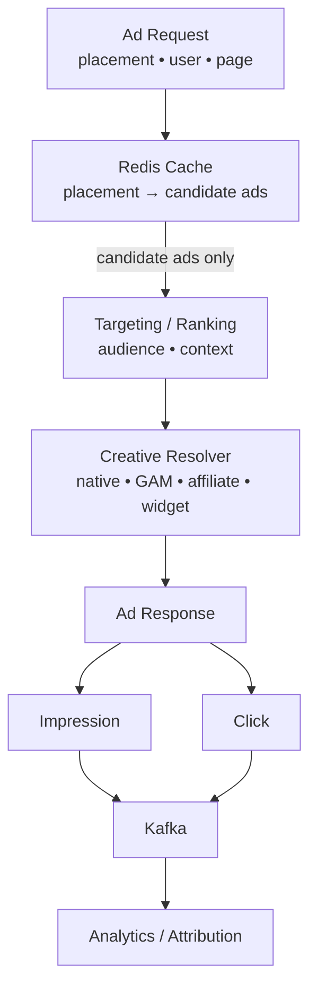
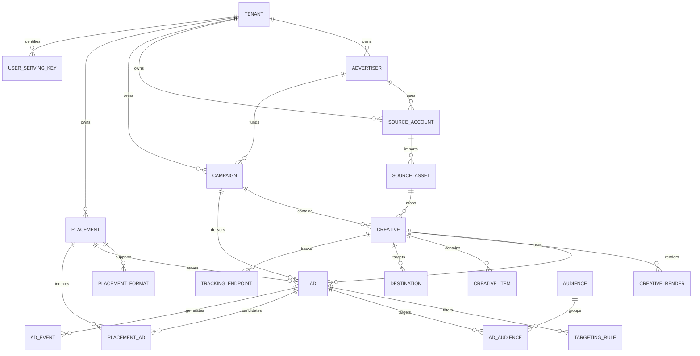

# LEO Ads — High-Scale Ad Server Database Schema

PostgreSQL 16+ schema for a multi-tenant, high-scale advertising platform designed to support approximately **40M users/profiles**, multiple ad supply sources, flexible ad formats, low-latency serving, and high-volume impression/click telemetry.

The schema is intentionally split between the **ad control plane**, the **serving/eligibility layer**, and the **event stream**. PostgreSQL is the source of truth for campaign and creative configuration; Redis is intended for the hot candidate cache; targeting is expected to use precomputed audience/feature data; and Kafka is the preferred high-volume event transport.

## Goals

The schema is designed to:

- support local/internal ads, Google Ad Manager, affiliate networks, JS widgets, native JSON, display, carousel, video, redirects, and future formats
- support multiple providers and source accounts without changing PostgreSQL enum types
- separate advertisers, campaigns, ads, creatives, placements, targeting, and rendering configuration
- keep the ad-serving path relational and index-friendly
- keep provider-specific payloads flexible through carefully scoped `JSONB`
- avoid putting 40M-user membership or event traffic into the core ad catalog
- support precomputed placement-to-ad candidate sets that can be cached in Redis
- retain recent operational telemetry in partitioned PostgreSQL tables while allowing Kafka to be the primary streaming path

## Runtime Architecture



### Responsibilities by component

| Component | Responsibility |
|---|---|
| PostgreSQL | Canonical ad catalog, campaign configuration, creatives, placements, targeting rules, source mappings, and operational metadata |
| Redis | Hot cache of active placement candidates and other serving-time data |
| Targeting / feature layer | Audience membership and user/context signals used to filter and rank candidates |
| Ad API | Low-latency ad request handling and response construction |
| Kafka | High-volume impression, click, conversion, and related event streaming |
| Analytics / attribution | Downstream aggregation, attribution, reporting, and optimization |

The SQL schema does **not** attempt to implement the entire ad-serving engine. It provides the durable data model and the precomputed serving index required by that engine.

## Core Design Principle

The most important architectural separation is:

```text
Control Plane
    tenant
      ↓
    advertiser
      ↓
    source_account / source_asset
      ↓
    campaign
      ↓
    creative
      ↓
    creative_render
      ↓
    destination / tracking / creative_item

Serving Plane
    placement
      ↓
    placement_format
      ↓
    ad
      ↓
    targeting_rule / audience
      ↓
    placement_ad
      ↓
    Redis candidate cache

Telemetry Plane
    ad request
      ↓
    impression / click / conversion
      ↓
    Kafka
      ↓
    analytics / attribution
```

This prevents the operational ad catalog from becoming the runtime event store or a 40M-user identity store.

## Schema

All tables are contained in the `leo_ads` PostgreSQL schema.

### 1. Tenancy

`leo_ads.tenant`

Provides tenant isolation for the ad platform. Most business objects carry a `tenant_id` so queries and indexes can remain tenant-aware.

Key fields:

- `tenant_id`
- `tenant_key`
- `status`
- `settings`

### 2. Provider / Source Dictionaries

The schema deliberately avoids PostgreSQL `ENUM` for provider-facing categories.

Dictionary tables:

- `source_type`
- `render_type`
- `destination_type`

This allows new providers or rendering modes to be introduced without requiring a database enum migration.

Examples already seeded:

```text
source_type:
  local
  ad_network
  affiliate

render_type:
  native_json
  js_tag
  iframe
  html
  video
  redirect

destination_type:
  url
  product
  affiliate_url
  app_deep_link
  custom
```

### 3. Advertisers and Source Accounts

`advertiser` represents the commercial advertiser.

`source_account` represents the account through which an advertiser or tenant receives ads/assets from an external source such as Google, an affiliate network, or an internal provider.

`source_asset` stores provider-specific external objects such as:

- external campaign IDs
- external creative IDs
- ad unit IDs
- provider-specific raw payloads

The provider payload remains available through `raw_payload JSONB` without forcing the relational schema to understand every external API.

### 4. Placements

`placement` represents a stable publisher inventory slot.

Examples:

```text
homepage_top
article_inline_01
sidebar_01
product_recommendation
native_feed
```

A placement defines the available physical/semantic inventory characteristics.

`placement_format` defines which formats a placement can accept.

This is intentionally different from putting one permanent `adFormat` on an ad. A placement may support multiple formats and responsive sizes.

Example:

```text
placement: homepage_top

supported formats:
  display_728x90
  display_970x250
  display_320x100
```

### 5. Campaigns

`campaign` is the business/buying object.

It stores:

- advertiser/source ownership
- campaign key and name
- objective
- buying model
- budget and daily budget
- currency
- start/end time
- lifecycle status

The campaign is intentionally separate from `ad`, because one campaign may contain multiple delivery objects and creative variants.

### 6. Creatives

`creative` is the reusable content object.

Common renderer fields are promoted to relational columns:

- `headline`
- `subheadline`
- `body`
- `cta`
- `image_url`
- `video_url`
- `logo_url`

Provider/template-specific content remains in:

```sql
content_payload JSONB
```

Examples include:

- badges
- product attributes
- native-specific fields
- recommendation metadata
- provider-specific creative values

This avoids creating a new SQL column every time an external ad source adds a field.

### 7. Rendering

`creative_render` separates **content** from **how that content is rendered**.

It supports:

```text
native_json
js_tag
iframe
html
video
redirect
```

It can store:

- template key
- external loader source
- async loading flag
- container ID
- container class
- renderer-specific configuration

For example, a Google Ad Manager creative can use a `js_tag` renderer with a GPT loader and ad-unit configuration, while an internal native ad can use `native_json` and a template such as `native_card_v1`.

### 8. Destinations and Tracking

`destination` stores the click destination separately from creative content.

`tracking_endpoint` supports event types such as:

- impression
- click
- viewable impression
- conversion
- video start
- video complete

This allows different supply providers to have different tracking endpoints without changing the core creative model.

### 9. Creative Items

`creative_item` supports multi-item formats such as:

- product carousel
- product grid
- recommendation cards
- affiliate product lists

It contains normalized common commerce fields such as:

- item name
- price
- currency
- original price
- discount text
- image URL
- destination URL
- highlight text
- sort order

Additional provider-specific attributes can remain in `item_payload JSONB`.

### 10. Ad Delivery Object

`ad` is the thin object intended to participate in serving.

An ad points to:

```text
campaign
creative
placement
```

It also contains serving-oriented attributes such as:

- `status`
- `score_weight`
- `frequency_cap`
- `metadata`

Keeping this object small is important because it sits directly in the serving path.

### 11. Targeting and Audiences

`targeting_rule` stores cheap request-time predicates and audience references.

Supported fields include:

- countries
- regions
- device types
- operating systems
- browsers
- languages
- age range
- gender codes
- context keywords
- custom predicates
- exclusions
- priority

`audience` defines an audience as a reusable logical object.

`ad_audience` defines whether an audience is included or excluded for a specific ad.

### 12. 40M-User Boundary

The schema intentionally does **not** define a massive relational table such as:

```text
40M users × many ads × many audiences
```

inside the primary ad catalog.

Instead:

```text
Customer / CDP profile
        ↓
Audience computation
        ↓
Audience / feature store
        ↓
Ad targeting
        ↓
Placement candidate filtering
```

`user_serving_key` is only a compact serving-side identity table for identifiers/hashes needed by the ad server. It is not intended to replace the Customer 360/CDP profile store.

### 13. Precomputed Serving Index

`placement_ad` is one of the most important tables for high-QPS serving.

It stores the eligible relationship between:

```text
placement → ad
```

plus:

- `rank_score`
- validity window
- active flag

The serving system can periodically materialize this set into Redis:

```text
redis key:
  ads:placement:{placement_id}

value:
  ranked candidate ad IDs
```

The request path can then retrieve a small candidate set rather than scanning the complete `ad` table.

### 14. Event Telemetry

`ad_event` is a range-partitioned event table for operational retention/landing use.

It supports:

```text
impression
click
conversion
video_start
video_complete
...
```

The table is partitioned by `event_time`.

The SQL includes:

- August 2026 partition
- default partition

Production deployments should create future partitions ahead of time with a scheduler or migration process.

For very high traffic, Kafka should remain the primary ingestion path, with PostgreSQL retaining only the operational window or serving as an analytics landing layer.

## Source-Agnostic Ad Model

The schema maps cleanly to different source types without changing the core delivery model.

| Source | Example | Source layer | Rendering |
|---|---|---|---|
| Local | Internal Coolmate campaign | `source_account` / `source_asset` | `native_json` |
| Google Ad Manager | Display banner | `source_account` / `source_asset` | `js_tag` |
| Affiliate | Shopee product | `source_account` / `source_asset` | `native_json` |
| Affiliate | Lazada widget | `source_account` / `source_asset` | `js_tag` |
| Future provider | New network/API | Same model | Add render/source codes as required |

The database therefore models **what the ad is**, **where it came from**, and **how it is rendered** as separate concerns.

## Example Serving Flow

A typical request should conceptually behave like this:

```text
1. Receive:
   placement + user key + page/context + device

2. Redis:
   retrieve candidate ads for the placement

3. Targeting:
   remove excluded/ineligible candidates

4. Ranking:
   apply rank_score + campaign/ad priorities + user/context signals

5. Creative Resolver:
   load the creative + renderer + destination + tracking configuration

6. Response:
   return native JSON, JS tag, widget configuration, etc.

7. Telemetry:
   emit impression/click/conversion events to Kafka
```

The PostgreSQL view `leo_ads.v_active_ads` is intended for administration/debugging, not as the primary low-latency serving path.

## Indexing Strategy

The schema includes indexes for three major access patterns.

### Control-plane queries

Examples:

```sql
campaign by tenant + status
source account by tenant + provider
source asset by external ID
creative by source asset
```

### Hot serving queries

The most important serving indexes are:

```sql
idx_placement_active
idx_ad_active_by_placement
idx_placement_ad_hot
idx_ad_campaign_active
idx_creative_active
```

The key runtime path is:

```text
placement
   ↓
active placement_ad rows
   ↓
rank_score DESC
   ↓
small candidate set
```

### Event queries

Telemetry indexes include:

```sql
idx_ad_event_tenant_time
idx_ad_event_ad_time
idx_ad_event_request
```

## JSONB Strategy

JSONB is intentionally limited to fields where schema flexibility is valuable.

Use JSONB for:

- provider payloads
- renderer configuration
- custom content fields
- targeting predicates that are not yet normalized
- future provider-specific metadata

Do **not** use JSONB as a replacement for high-frequency relational joins such as:

```text
tenant_id
campaign_id
creative_id
placement_id
status
```

Those remain explicit indexed columns.

GIN indexes are provided for the two main provider/content payload areas:

```sql
source_asset.raw_payload
creative.content_payload
```

Add additional JSONB indexes only after query patterns justify them.

## PostgreSQL and Scaling Guidance

### PostgreSQL should be the source of truth

Use PostgreSQL for:

- configuration
- lifecycle state
- campaign metadata
- creative metadata
- placement configuration
- targeting definitions
- source-provider mappings

### Redis should be the hot serving cache

Cache things such as:

```text
placement → active candidate ad IDs
placement → supported formats
ad ID → compact serving metadata
```

Avoid putting large mutable creative payloads into every Redis candidate entry when the renderer can resolve them separately.

### Kafka should absorb telemetry volume

Do not synchronously write every impression/click into the core transactional catalog.

Preferred pattern:

```text
Ad API
  ↓
Kafka
  ├── real-time analytics
  ├── attribution
  ├── fraud / anomaly detection
  ├── campaign reporting
  └── storage / warehouse pipelines
```

## Data Lifecycle

Recommended lifecycle for serving objects:

```text
draft
  ↓
active
  ↓
paused
  ↓
completed / archived
```

The SQL enforces lifecycle values with `CHECK` constraints on the major entities.

`updated_at` is maintained automatically through the shared `leo_ads.set_updated_at()` trigger function.

## Installation

Run the schema against PostgreSQL 16+:

```bash
psql "$DATABASE_URL" \
  -f db-schema-high-scale-ad-server.sql
```

The SQL creates:

```text
schema: leo_ads
extension: pgcrypto
```

The file is wrapped in a transaction with `BEGIN` / `COMMIT`.

## Important Production Considerations

### Event partition management

The SQL contains an initial monthly partition and a default partition. Production should create future partitions before they are needed.

For example:

```text
ad_event_2026_09
ad_event_2026_10
ad_event_2026_11
...
```

### Redis materialization

`placement_ad` should be treated as the durable candidate index. Redis should be a cache/materialized serving layer, not the authoritative source.

### Audience membership

Do not automatically create a PostgreSQL row for every user/ad relationship. For 40M users, audience membership should normally be generated and stored in a dedicated segmentation/feature system optimized for membership tests.

### Tenant isolation

All tenant-owned resources should be queried with `tenant_id` in the application layer. The schema provides tenant foreign keys and tenant-oriented indexes; application/API authorization remains responsible for enforcing the correct tenant context.

### Ad ranking

`rank_score` and `score_weight` are deliberately simple primitives. A production ranking engine can combine them with:

```text
user affinity
context relevance
campaign priority
bid / value
frequency
pacing
conversion probability
business rules
```

The database schema does not prescribe one ranking algorithm.

## Example Data Relationships



## Recommended Repository Layout

A minimal repository can keep the schema and documentation together:

```text
ads-server/
├── db-schema-high-scale-ad-server.sql
├── README.md
├── migrations/
├── seeds/
├── ad-api/
├── targeting/
├── ranking/
├── redis/
├── kafka/
└── docs/
```

## Scope

This SQL file focuses on the database foundation for the ad server.

It does not define:

- a complete bidding/auction protocol
- a full RTB/OpenRTB implementation
- an actual Redis materializer service
- the targeting engine implementation
- machine-learning ranking models
- Kafka consumers
- billing/invoicing
- fraud detection
- consent/privacy workflows

Those services can be built around the same control-plane and serving-plane model without changing the core domain boundaries.

## Reference

Schema file:

- [`db-schema-high-scale-ad-server.sql`](db-schema-high-scale-ad-server.sql)

Namespace:

```text
leo_ads
```

Primary architectural idea:

> PostgreSQL stores the truth, Redis serves the hot candidate set, targeting/ranking decides eligibility, the creative resolver renders the correct source format, and Kafka carries the high-volume event stream.
