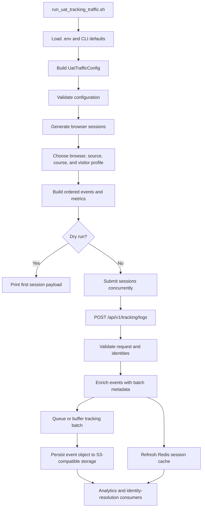

# UAT Tracking Traffic Simulator Flow

## Purpose

`uat_tracking_traffic_simulator.py` generates production-shaped web tracking traffic for the Customer 360 UAT tracking API. It models anonymous visitors reading education content, searching for courses, optionally logging in, and sometimes purchasing an online course.

The simulator sends one JSON batch per simulated browser session. It does not connect directly to PostgreSQL, Redis, or object storage. Persistence and downstream processing belong to `customer360-event-api`.

## End-to-End Flow



## Starting the Simulator

Run the launcher from `all-data-simulator`:

```bash
./run_uat_tracking_traffic.sh
```

Preview one generated session without making an HTTP request:

```bash
UAT_DRY_RUN=true ./run_uat_tracking_traffic.sh
```

The Python entry point can also be called directly:

```bash
python uat_tracking_traffic_simulator.py --sessions 10 --seed 20260921
```

## Default Configuration

| Setting | Environment variable | Default | Meaning |
|---|---|---:|---|
| Tracking endpoint | `UAT_TRACKING_API_URL` | `https://beta.leocdp.com/data/api/v1/tracking/logs` | HTTP endpoint receiving event batches |
| Data source | `UAT_TRACKING_DATA_SOURCE_ID` | `4512a4ab-9fe8-4a1a-9915-521fdaf9925a` | Customer 360 source identifier |
| Sessions | `UAT_SESSIONS` | `25` | Number of simulated browser sessions |
| Events per session | `UAT_MIN_EVENTS`, `UAT_MAX_EVENTS` | `6` to `12` | Random event count for each session |
| Lookback window | `UAT_LOOKBACK_HOURS` | `24` | Maximum age of generated session timestamps |
| Concurrency | `UAT_CONCURRENCY` | `2` | Simultaneous HTTP submissions |
| Request timeout | `UAT_REQUEST_TIMEOUT_SECONDS` | `15` seconds | Timeout for one HTTP request |
| Retries | `UAT_RETRIES` | `2` | Retries after transient failures |
| Random seed | `UAT_RANDOM_SEED` | unset | Enables repeatable journeys when provided |
| Dry run | `UAT_DRY_RUN` | `false` | Prints the first payload and skips HTTP |

The launcher loads `all-data-simulator/.env` when that file exists, then passes these values to the Python script. Command-line options take precedence over launcher defaults.

## Traffic Source and UTM Flow

A session chooses one entry from `TRAFFIC_SOURCES`. The selected source is reused for every event in that session, which models campaign attribution surviving navigation from a landing page to a course purchase.

The current source catalog contains 17 variants:

| Source family | Organic examples | Paid examples | Mediums |
|---|---|---|---|
| Google | Content and course search | Search ads | `organic`, `cpc` |
| Facebook | Organic page post | Carousel ad | `social`, `paid_social` |
| LinkedIn | Thought-leadership post | Sponsored document | `social`, `paid_social` |
| TikTok | Creator video | In-feed video ad | `social`, `paid_social` |
| Instagram | Organic carousel | Story course ad | `social`, `paid_social` |
| YouTube | Channel video | Pre-roll course ad | `video`, `paid_video` |
| Workshop QR | Not applicable | Not applicable | `qr_code` with `offline` traffic type |
| Newsletter | Learning-path email | Not currently defined | `email` |
| Direct | Bookmark or typed URL | Not applicable | `none` |

Every source has these UTM values:

- `utm_source`: platform or origin, such as `google`, `tiktok`, or `workshop_qr`.
- `utm_medium`: acquisition mechanism, such as `organic`, `cpc`, `paid_social`, `paid_video`, or `qr_code`.
- `utm_campaign`: campaign-level grouping.
- `utm_content`: creative, placement, or link variant.
- `utm_term`: search or audience intent.
- `utm_id`: stable synthetic campaign identifier.

The simulator also emits:

- `traffic_source`: same value as `utm_source`.
- `traffic_type`: `organic`, `paid`, `direct`, or `offline`.
- `is_paid`: boolean derived from `traffic_type`.
- `channel`: same value as `utm_medium`.

The first page URL receives the UTM query string. UTM fields are also copied to the event top level and to `event_data.utm`, so downstream analytics can use structured fields without parsing the URL.

### Source distribution

Source selection currently uses `random.choice(TRAFFIC_SOURCES)`. Each of the 17 definitions has equal probability per session. This means the source family distribution is not weighted: Google has three definitions, while YouTube has two and workshop QR has one. To model a specific marketing mix, add weighted selection rather than duplicating source records.

## Session Identity and Timing

Each session receives:

- `session_id`: stable for all events in the session.
- `anonymous_id`: stable anonymous visitor identifier.
- `device_fingerprint`: stable browser/device identifier.
- `event_id`: unique deterministic UUID when a seed is provided, otherwise random UUID.
- `device_type` and matching browser `User-Agent`: desktop, mobile, or tablet.

The batch envelope keeps `user_id` as `null` so the session begins as anonymous. A login event introduces a synthetic learner identity, and subsequent events in that session carry the generated `user_id`.

The session start is placed within the configured lookback window. Events are ordered and separated by a random 2 to 45 seconds. The simulator submits the complete session as one HTTP request; it does not wait between individual events on the network.

## Journey Branching

The generator first chooses the event count, browser profile, traffic source, course, and synthetic visitor profile.

### Buyer journey

A session can become a buyer only when it has at least eight events. Buyer selection currently has a 45% probability. Buyer journeys finish with a purchase and follow this shape:

```text
page-view -> scroll/search -> optional engagement -> page-view
-> user-login -> add_to_cart -> checkout_started -> purchase
```

The eight-event variant removes one optional step. Longer buyer sessions insert extra scroll, click, or course-view events before login and checkout. The purchase remains the final event.

### Non-buyer journey

Non-buyers begin with:

```text
page-view -> scroll -> search -> click -> page-view
```

They may log in with a 55% probability when the event count allows it. Remaining events are randomly selected from scroll, click, course-view, and page-view. These journeys do not emit a purchase event.

## Event Types and Metrics

Every event contains `event_name`, `event_type`, `event_category`, `event_data`, and a non-empty `metrics` object.

| Event name | Event type | Category | Main data |
|---|---|---|---|
| `page-view` | `page_view` | `EDUCATION` | Time on page, scroll depth, content progress |
| `scroll` | `engagement` | `EDUCATION` | Scroll depth and time on page |
| `click` | `engagement` | `EDUCATION` | Target, label, click position, latency |
| `search` | `search` | `EDUCATION` | Query, result count, position, search latency |
| `course_view` | `page_view` | `EDUCATION` | Course, level, price, engagement |
| `user-login` | `identity` | `EDUCATION` | Profile fields and login completion time |
| `add_to_cart` | `commerce` | `COMMERCE` | Cart items, value, item count |
| `checkout_started` | `commerce` | `COMMERCE` | Checkout step and cart value |
| `purchase` | `conversion` | `COMMERCE` | Transaction, revenue, currency, purchased item |

The event envelope also includes `domain: "education"` and `source_system: "web"`. Course events include `course_id`, `product_id`, `course_name`, `course_level`, and `price_vnd`.

## Login and Profile Data

Profiles are synthetic and use `example.test` email addresses. A login event includes:

```json
{
  "event_name": "user-login",
  "event_type": "identity",
  "user_id": "synthetic-user-uuid",
  "profile_data": {
    "user_id": "synthetic-user-uuid",
    "name": "Bao Vo",
    "full_name": "Bao Vo",
    "email": "bao.vo.1@example.test",
    "gender": "male"
  }
}
```

The same profile is not sent as a batch-level identity. This preserves the distinction between anonymous pre-login events and authenticated post-login events within the same session.

## Purchase Data

A purchase event contains both browser-SDK-compatible and analytics-friendly commerce fields:

```json
{
  "event_name": "purchase",
  "event_type": "conversion",
  "event_category": "COMMERCE",
  "transaction_id": "order-123456789012",
  "transaction_value": 2990000,
  "event_value": 2990000,
  "currency_code": "VND",
  "currency": "VND",
  "is_conversion": true,
  "shopping_cart_items": [
    {
      "item_id": "course-generative-ai",
      "item_name": "Generative AI Product Engineering",
      "item_category": "gen-ai",
      "quantity": 1,
      "price_vnd": 2990000
    }
  ]
}
```

The current course catalog covers Big Data, Generative AI, Agentic AI, Martech, and Data Analytics.

## HTTP Submission and Retry Behavior

For each session, the simulator serializes the request envelope as JSON and sends:

```text
POST {UAT_TRACKING_API_URL}
Accept: application/json
Content-Type: application/json
User-Agent: simulated browser user agent
```

Sessions are submitted through `ThreadPoolExecutor` using the configured concurrency. A request is retried for HTTP `408`, `425`, `429`, `500`, `502`, `503`, or `504`, as well as URL, timeout, and JSON decoding failures. Backoff is exponential: 1 second, then 2 seconds, up to the configured retry count.

A response is considered successful only when:

1. The response body is a JSON object.
2. `accepted` is not `false`.
3. `event_count` matches the number of events sent for that session.

The process logs each accepted session and prints a final summary containing accepted events, failed sessions, and total sessions.

## Tracking API Handoff

`customer360-event-api` accepts the dynamic event dictionaries after validating the request envelope and identity fields. The API requires at least one supported identity at the batch or event level. This simulator supplies `session_id`, `anonymous_id`, and `device_fingerprint` on every event.

The tracking service then:

1. Copies batch-level identity and metadata into events where needed.
2. Creates or preserves event IDs.
3. Sends the batch through the configured buffered or Redis-backed tracking storage.
4. Persists the event object to S3-compatible storage.
5. Refreshes the session cache in Redis.
6. Returns an accepted response with event count and storage/queue information.

Downstream analytics and identity-resolution jobs can read the stored event envelope, use top-level UTM and commerce fields, and retain the original dynamic payload for detailed analysis.

## Dry Run and Verification

Dry run prints only the first generated session, so it is useful for inspecting schema and attribution but does not show the aggregate source mix. To inspect all generated sessions locally, import `WebTrafficGenerator` and count the resulting event fields.

The focused regression test is:

```bash
python -m pytest all-data-simulator/test_uat_tracking_traffic_simulator.py -q
```

The complete simulator test suite is:

```bash
python -m pytest all-data-simulator -q
```

A fixed `UAT_RANDOM_SEED` makes UUIDs, source selection, journeys, and metrics repeatable. The event timestamps are still anchored to the current clock unless the generator is constructed directly with a fixed clock in a test.

## Operational Notes

- Use `UAT_DRY_RUN=true` before pointing the simulator at a shared UAT endpoint.
- Use a dedicated data source ID when the generated events must be isolated from another test run.
- The simulator uses synthetic identities, but the generated events still represent customer profile and purchase data. Treat them as test data and avoid sending them to production without approval.
- The source catalog is intentionally explicit. Add a new `TrafficSource` entry when introducing a new campaign, creative, or channel variant.
- Keep UTM values in attribution fields, not identity fields. `utm_source`, `utm_medium`, and campaign IDs describe acquisition context and must not be used as customer identifiers.
