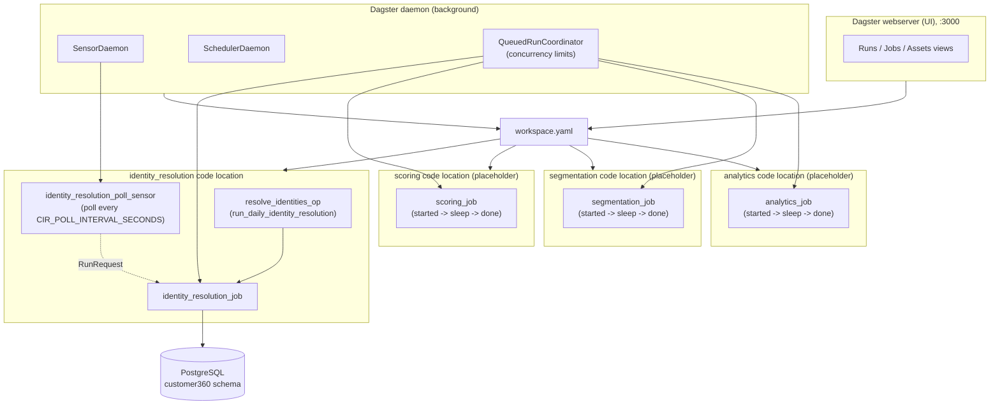

# `backend-system/` — Dagster-orchestrated backend services

This directory hosts the Customer 360 backend **data/ML pipeline services**
(as opposed to `customer360-api/`, which is the request/response REST API).
Each service is an independent, deployable Python codebase, and all of them
are wired into a single [Dagster](https://dagster.io) workspace so they can
be run, scheduled, retried, and monitored from one place.

```
backend-system/
├── workspace.yaml            # Dagster workspace: lists every code location below
├── requirements-dev.txt      # dagster-webserver, only needed for ./start.sh (local UI)
├── start.sh / stop.sh / restart.sh   # local dev: run the Dagster UI + daemon
│
├── identity_resolution/      # CIR: links/merges raw profiles into master profiles (implemented)
│   ├── dagster_defs.py       #   -> identity_resolution_job, identity_resolution_poll_sensor
│   ├── worker.py             #   containerized entrypoint (docker-compose.yml `cir` service)
│   ├── identity_resolution/  #   the actual business-logic package (resolver, persona, ...)
│   ├── requirements.txt
│   └── tests/
│
├── scoring/                  # score every profile for every metric (PLACEHOLDER)
├── segmentation/             # build segments via an AI service (PLACEHOLDER)
└── analytics/                # build reporting & refresh report tables (PLACEHOLDER)
    └── dagster_defs.py       #   each: one op that logs started -> sleep -> done
```

`scoring/`, `segmentation/`, and `analytics/` don't have real business logic
yet — they exist so the Dagster workspace, local scripts, and UI already
have a slot for each service, ready for real code to be dropped in (see
["Adding a new backend service"](#adding-a-new-backend-service) below).

---

## How it works

Every service folder is a **Dagster code location**: a Python module/package
that exposes a `dagster_defs.py` with a module-level `defs = Definitions(...)`
object (jobs, ops, sensors, schedules). `workspace.yaml` at the root of
`backend-system/` lists every service's `dagster_defs.py` as a separate
`python_file` entry — that's the only thing that ties them together:

```yaml
load_from:
  - python_file:
      relative_path: identity_resolution/dagster_defs.py
      location_name: identity_resolution
  - python_file: {relative_path: scoring/dagster_defs.py, location_name: scoring}
  - python_file: {relative_path: segmentation/dagster_defs.py, location_name: segmentation}
  - python_file: {relative_path: analytics/dagster_defs.py, location_name: analytics}
```

Each code location is loaded **in its own process** (a Dagster "user-code
gRPC server"), so a crash or dependency conflict in one service's code
cannot take down another's, or the webserver/daemon itself.

### Flow architecture



- **Local dev** (`./start.sh`): one shared Python venv installs every
  service's `requirements.txt` + `requirements-dev.txt`, then
  `dagster dev -w workspace.yaml` starts the webserver (UI) and daemon
  together — good enough to browse/run/monitor everything from
  `http://localhost:3000`.
- **Containerized production** (today): `identity_resolution` ships its own
  `Dockerfile`/image (`docker-compose.yml`'s `cir` service) and
  `worker.py` runs `identity_resolution_job.execute_in_process()` in a
  timed loop — every cycle is still a real, trackable Dagster run (with
  per-step logs/timing/retries), it's just launched by a simple loop
  instead of a full daemon. `scoring`/`segmentation`/`analytics` don't have
  containers yet since they're placeholders.
- **Containerized production** (target end-state): a `dagster-daemon`
  deployment + one gRPC code-server container per service, all pointed at a
  shared Dagster instance (Postgres-backed run/event storage instead of the
  local-dev SQLite files under `.dagster_home/`). At that point,
  `identity_resolution_poll_sensor` (already defined, just `STOPPED` by
  default) gets turned on instead of `worker.py`'s loop, and the same
  pattern applies to `scoring`/`segmentation`/`analytics` once they have
  real ops.

### Why this scales

- **Independent code locations** — each service is its own process
  (container, in production). A bug, dependency upgrade, or crash in
  `segmentation` can't take down `identity_resolution` or the webserver/UI.
  Each can also get its own venv (`executable_path:` in `workspace.yaml`)
  once dependencies diverge (e.g. `segmentation`'s AI/LLM libraries don't
  need to be installed alongside `identity_resolution`'s `psycopg2`).
- **Ops run as a DAG, not a script** — a job's ops execute in dependency
  order; independent branches can run in parallel. Today's jobs are single
  ops, but adding more ops (e.g. split scoring into
  `fetch_profiles -> score_churn / score_clv / score_engagement -> write_back`)
  lets those parallel branches actually run concurrently by swapping the
  default in-process executor for `multiprocess_executor` (or `k8s_job_executor`
  in a Kubernetes deployment) — no business-logic changes required.
  - **Reliability/scale primitives already wired in**: `resolve_identities_op`
  has a `RetryPolicy` (2 retries, 10s delay); the `QueuedRunCoordinator`
  (default daemon config) enforces run concurrency limits so, e.g., 100
  queued `scoring_job` runs don't all hit Postgres at once.
- **Sensors decouple "when" from "how"** — `identity_resolution_poll_sensor`
  requests a new run every `CIR_POLL_INTERVAL_SECONDS`; the daemon (not a
  single long-lived process) launches each one. That means scaling out is
  "add more run workers", not "rewrite the polling loop".
- **One pane of glass from day one** — even though `scoring`/`segmentation`/
  `analytics` are placeholders, they already show up in the same Dagster UI
  as `identity_resolution`, with the same run history, logs, and retry
  semantics — so when real logic lands, there's no separate monitoring
  story to build.

---

## Running it locally (`./start.sh` / `./stop.sh` / `./restart.sh`)

```bash
cd backend-system
./start.sh      # create/reuse .venv, install all services' requirements,
                 # then launch `dagster dev` (webserver + daemon) in the background
```

Then open **http://localhost:3000** — you should see 4 code locations
(`identity_resolution`, `scoring`, `segmentation`, `analytics`), each with
one job. Click a job → **Launchpad** → **Launch Run** to try one (the
placeholders finish in a couple seconds and log `started` then `done`; try
`identity_resolution_job` too — it will attempt a real Postgres connection,
so have `./dev-start-all.sh` or `docker compose up postgres` running first).

```bash
./stop.sh       # stop the webserver + daemon (and any leftover child processes)
./restart.sh    # stop.sh followed by start.sh
```

Logs: `logs/dagster.log`. PID file: `.dagster.pid`. These scripts are
**local-dev only** — they don't affect `docker-compose.yml` (which still
runs `identity_resolution` as its own `cir` container independently).

Config (see `.env.example`, loaded from the repo-root `.env` if present):

| Variable | Default | Purpose |
|---|---|---|
| `DAGSTER_UI_HOST` | `127.0.0.1` | Bind address for the Dagster webserver |
| `DAGSTER_UI_PORT` | `3000` | Port for the Dagster webserver |
| `DAGSTER_HOME` | `backend-system/.dagster_home` | **Must be an absolute path.** Persistent run/event-log storage so history survives `./restart.sh`; unset it (blank) to fall back to a throwaway ephemeral instance instead. |

---

## Adding a new backend service

Say you're adding a `notification/` service:

1. **Create the folder + business logic** — `backend-system/notification/`,
   with its own `requirements.txt` (start with `dagster>=1.9,<2` plus
   whatever the service needs), and whatever internal package/module
   structure makes sense (mirror `identity_resolution/identity_resolution/`
   for a real service, or keep it flat for something simple).

2. **Add `dagster_defs.py`** exposing at least one `@op`, one `@job`, and a
   module-level `defs`. Copy `scoring/dagster_defs.py` as the simplest
   template:

   ```python
   from dagster import Definitions, OpExecutionContext, job, op

   @op
   def notification_op(context: OpExecutionContext) -> None:
       context.log.info("notification job: started")
       # ... real logic here ...
       context.log.info("notification job: done")

   @job(name="notification_job")
   def notification_job() -> None:
       notification_op()

   defs = Definitions(jobs=[notification_job])
   ```

   If your op needs to import a **local sibling package** (like
   `identity_resolution/dagster_defs.py` imports the nested
   `identity_resolution` package), add this *before* that import — Dagster's
   `python_file` workspace loader does **not** add the file's own directory
   to `sys.path` the way running `python dagster_defs.py` directly does:

   ```python
   import os, sys
   sys.path.insert(0, os.path.dirname(os.path.abspath(__file__)))
   ```

3. **Register it in `workspace.yaml`**:

   ```yaml
     - python_file:
         relative_path: notification/dagster_defs.py
         location_name: notification
   ```

4. **Register it in `start.sh`** — add `notification` to the `SERVICES=(...)`
   array so `./start.sh` installs its `requirements.txt` too.

5. **Restart**: `./restart.sh`, then confirm `notification_job` shows up at
   http://localhost:3000.

6. **Add tests** under `notification/tests/` — see
   `identity_resolution/tests/test_dagster_defs.py` for the pattern
   (`job.execute_in_process()` with the real business-logic call mocked
   out, asserting `result.success` and `result.output_for_node(...)`).

7. **When it's ready for production**, add a `Dockerfile` (mirror
   `identity_resolution/Dockerfile`) and a service block in
   `docker-compose.yml`, following the same shape as the existing `cir`
   service.
