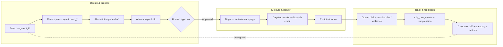
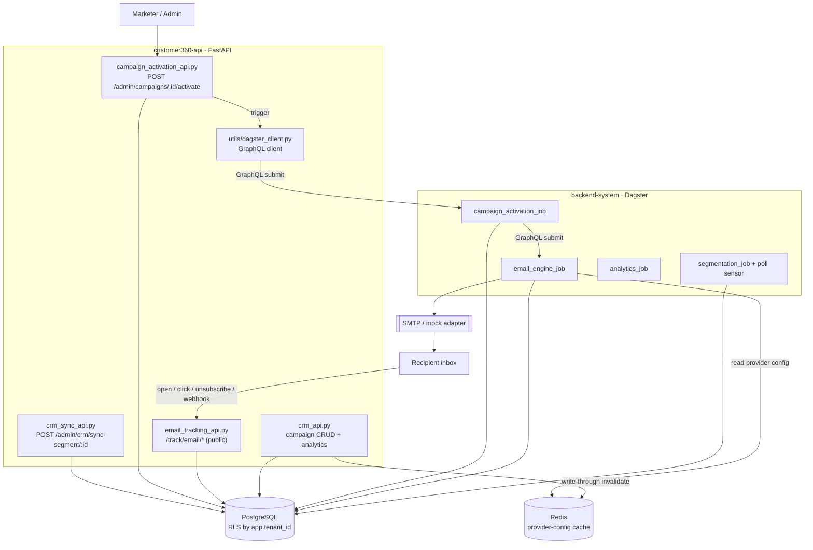
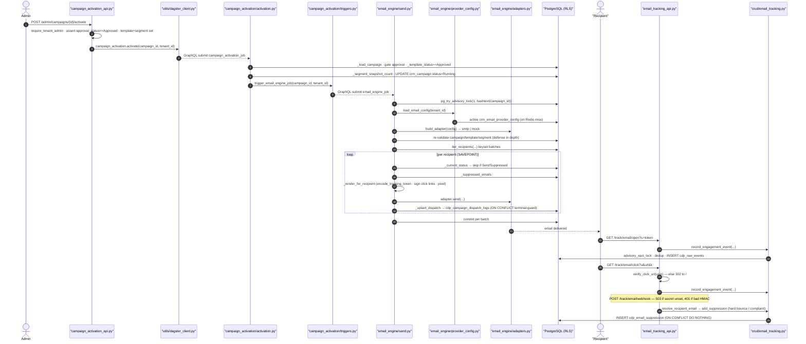
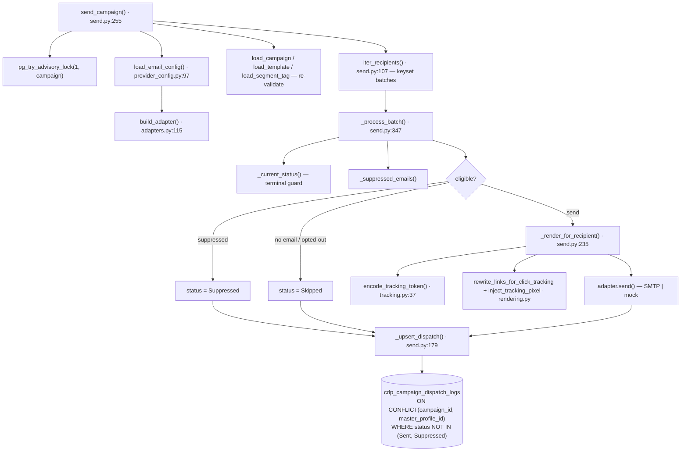
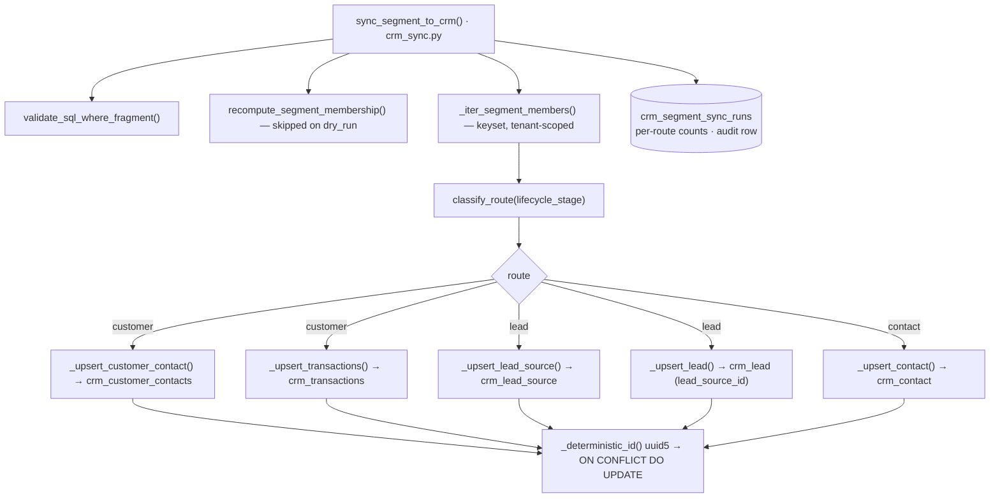
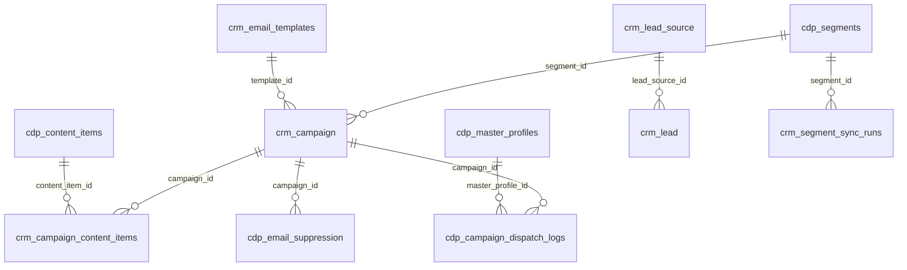

# SCRUM-92 — Agentic Outbound Email Marketing: Full Code-Flow Map

> **Story:** [SCRUM-92 — LEO CDP v2.0 Beta · Agentic Outbound Email Marketing Execution Engine](https://leocdp.atlassian.net/browse/SCRUM-92)
> **Sprint board (artifact):** https://claude.ai/code/artifact/142c8998-b9fd-4abb-9d92-2416c34611a1
> **Branch of record:** `feat/SCRUM-92/subtask-05-06` (commit `807df9f`)
> **Generated:** 2026-09-12 · **Scope:** maps the Jira story + its 8 sub-tasks to the actual code, end to end.

This document is the single reference for how the agentic email-marketing flow is wired across the
repo. It follows the target business sequence and, for every stage, names the **real files,
functions, endpoints, tables and Dagster ops** that implement it — and flags what is still design-only.

---

## 0. Legend — implementation status

Jira status is the ticket state; **Code state** is what actually exists in the branch above.

| Badge | Meaning |
|-------|---------|
| ✅ **Implemented** | Code exists and is exercised (unit and/or E2E tested). |
| 🟡 **Partial** | Some building blocks landed; headline behaviour not complete. |
| 📐 **Designed only** | Tables/models/spec exist; the feature logic is not built yet. |

---

## 1. The story in one picture

**Business outcome (target flow):**

```
Segment → CRM-sync routing → AI template draft → AI campaign draft
        → Human approval → Dispatch → Track → Feedback into Customer 360
```



**Sub-task → stage → code state**

| # | Jira | Sub-task | Jira status | Code state | Owner |
|---|------|----------|-------------|-----------|-------|
| 01 | [SCRUM-93](https://leocdp.atlassian.net/browse/SCRUM-93) | Schema & Migration Foundation | Done | ✅ Implemented | Liêm |
| 02 | [SCRUM-94](https://leocdp.atlassian.net/browse/SCRUM-94) | Segment-ID Driven CRM Sync Engine | Done | ✅ Implemented | Liêm |
| 03 | [SCRUM-95](https://leocdp.atlassian.net/browse/SCRUM-95) | AI Email Template Authoring (Gemini/OpenAI) | To Do | 📐 Designed only | — |
| 04 | [SCRUM-96](https://leocdp.atlassian.net/browse/SCRUM-96) | AI Campaign Strategy & Draft Creation | To Do | 🟡 Partial (CRUD + gate; AI not built) | — |
| 05 | [SCRUM-97](https://leocdp.atlassian.net/browse/SCRUM-97) | Dagster Execution Modernization | In Progress | ✅ Implemented | Liêm |
| 06 | [SCRUM-98](https://leocdp.atlassian.net/browse/SCRUM-98) | Tracking, Webhooks & Compliance Feedback | In Progress | ✅ Implemented | Liêm |
| 07 | [SCRUM-99](https://leocdp.atlassian.net/browse/SCRUM-99) | Customer 360 Feedback & Performance Rollups | To Do | 🟡 Partial (capture only) | — |
| 08 | [SCRUM-100](https://leocdp.atlassian.net/browse/SCRUM-100) | End-to-End Automated Test Suite | In Progress | ✅ Implemented | Liêm |

Dependency order (from the epic): `01 → 02 → 03 → 04 → 05 → 06 → 07 → 08`; `08` is the Beta release gate.

---

## 2. Runtime architecture

Two deployables cooperate over PostgreSQL, Redis and the Dagster GraphQL API.



Key facts:
- **Tenant isolation:** every table is RLS `ENABLE`+`FORCE` with a fail-closed `tenant_policy`
  keyed on `current_setting('app.tenant_id')`. Public tracking routes set that GUC from the **signed
  token**, not a header.
- **Cross-service hand-off is not one job graph.** `campaign_activation` submits a *separate*
  `email_engine_job` run via the Dagster webserver GraphQL API
  (`backend-system/campaign_activation/campaign_activation/triggers.py:29`).
- **Provider config** resolves Redis cache → DB (`crm_email_provider_config`) → `SMTP_*` env → mock,
  with write-through cache invalidation from the API. Both services must share one Redis.

---

## 2A. Detailed code graph — implemented path (activate → dispatch → track)

Function-level call sequence for the **implemented** happy path (SCRUM-97 + SCRUM-98). Every
participant is a real module; every message is a real call/query.



**Send-engine internals** (`backend-system/email_engine/email_engine/send.py`) — the per-recipient
call graph and where each branch lands in the ledger:



**Sync-engine internals** (`customer360-api/core/crud/crm_sync.py`) — the routing + idempotent upsert
graph for Stage 1 (SCRUM-94):



> Line numbers are anchors as of commit `807df9f`; treat them as "near here", not exact forever.

---

## 3. End-to-end code flow (stage by stage)

### Stage 1 — Select & sync the audience — ✅ (SCRUM-94)

**Entry:** `POST /api/v1/admin/crm/sync-segment/{segment_id}?dry_run=` →
`customer360-api/core/routers/crm_sync_api.py:42` `sync_segment_crm` (tenant-admin gated;
`GET /admin/crm/sync-runs[/{id}]` for audit).

**Engine:** `customer360-api/core/crud/crm_sync.py` `sync_segment_to_crm`:
1. Validate `sql_rules` (`core/utils/sql_safety.validate_sql_where_fragment`).
2. `recompute_segment_membership(db, segment)` (reused from `core/crud/segmentation.py`) — unless `dry_run`.
3. `_iter_segment_members(...)` — keyset-paginated read of `cdp_master_profiles` (tenant-scoped, `status_code=1`).
4. `classify_route(lifecycle_stage)` → route + upsert, each member inside a `SAVEPOINT`:
   - **customer** → `_upsert_customer_contact` (`crm_customer_contacts`) + `_upsert_transactions` (`crm_transactions`, facts never fabricated).
   - **lead** → `_upsert_lead_source` (`crm_lead_source`) + `_upsert_lead` (`crm_lead`, sets `lead_source_id`).
   - **contact** (any other stage) → `_upsert_contact` (`crm_contact`).
5. **Idempotency:** every target PK is a deterministic `uuid5` (`_deterministic_id`) so re-runs
   `ON CONFLICT DO UPDATE` the same rows; the run is audited in `crm_segment_sync_runs`.

### Stage 2 — AI email template draft — 📐 (SCRUM-95, design only)

**Exists:** `crm_email_templates` table + `EmailTemplate` model (`core/models/crm.py:250`) and
`EmailTemplate{Base,Create,Update,Read}` schemas (`core/schemas/crm.py:321`), `status` default `Draft`.

**Not built:** no generation endpoint, **no template CRUD/review router** (the generic router factory in
`crm_api.py` deliberately does *not* build one for `EmailTemplate`), no Gemini/OpenAI integration, no
prompt code. `core/config.py` has no LLM settings. Intended contract:
`docs/action-plans/AGENTIC-EMAIL-MARKETING-FLOW.md:172-212`.

**Reference provider-switch code to model the build on** (not wired to this feature):
`all-data-simulator/adjust_faker.py`, `all-data-simulator/web_user_simulator.py`,
`backend-system/identity_resolution/identity_resolution/persona_engine.py:874-911`.

### Stage 3 — AI campaign draft — 🟡 (SCRUM-96)

**Exists (data + human gate):**
- `crm_campaign` columns `segment_id`, `template_id`, `approval_status`, `approved_by/at`,
  `strategy_summary`, `ai_plan` (JSONB) — `core/models/crm.py:23`.
- `crm_campaign_content_items` (content plan; `UNIQUE(campaign_id, content_item_id)`) — `core/models/crm.py:271`.
- Campaign CRUD via `build_crud_router` and analytics sub-router — `core/routers/crm_api.py`.

**Not built:** the AI planning endpoint (`…campaigns:plan`) and a real state-machine. Today
`approval_status` is only **regex-validated** (`APPROVAL_STATUS_PATTERN`, `core/schemas/crm.py:18`);
the single enforced transition is the **activation gate** in Stage 5. Spec:
`AGENTIC-EMAIL-MARKETING-FLOW.md:214-255`, `AGENTIC-MARKETING.md`.

### Stage 4 — Human approval — ✅ gate (part of SCRUM-96/97)

A human sets `approval_status='Approved'` (today via generic `PATCH /api/v1/campaigns/{id}`). The gate
is enforced at activation, below.

### Stage 5 — Dagster: activate the campaign — ✅ (SCRUM-97)

**API entry:** `POST /api/v1/admin/campaigns/{campaign_id}/activate` →
`core/routers/campaign_activation_api.py:44` `activate_campaign` — tenant-admin gated; re-checks
`approval_status == "Approved"` **and** `template_id`+`segment_id` present (else `409`); submits a
Dagster run via `core/utils/dagster_client.py:445` `CampaignActivationDagsterService.activate`
(`503` if Dagster unreachable). Returns `run_id`.

**Job:** `campaign_activation_job` → `activate_campaign_op`
(`backend-system/campaign_activation/dagster_defs.py:52`, `RetryPolicy(max_retries=2, delay=10)`) →
`campaign_activation/activation.py:71` `activate_campaign`:
1. `set_tenant_context` (RLS) → `_load_campaign` (`crm_campaign`).
2. Gate: `approval_status == 'Approved'` + template/segment present (else `CampaignActivationError`).
3. `_template_status` must be `Approved` (`crm_email_templates`).
4. Validate `cdp_segments` row + `segment_tag`; `_segment_snapshot_count` (freeze audience size).
5. `UPDATE crm_campaign SET status='Running'` + commit.
6. `triggers.trigger_email_engine_job(...)` → GraphQL `submit_job_execution("email_engine_job", location="email_engine", …)` (`triggers.py:29`).

### Stage 6 — Dagster: render & dispatch — ✅ (SCRUM-97)

**Job:** `email_engine_job` → `send_campaign_op`
(`backend-system/email_engine/dagster_defs.py:53`, `RetryPolicy(max_retries=2, delay=15)`,
passes `run_id`) → `email_engine/send.py:255` `send_campaign`:
1. **Per-campaign advisory lock** `pg_try_advisory_lock(1, hashtext(campaign_id))` — a concurrent/retry
   run that can't acquire it exits `skipped_locked` (no double-send). Released in `finally`.
2. `build_adapter(load_email_config(tenant_id, conn))` — provider resolution (see §4).
3. **Re-validate approval** (defense in depth) — `load_campaign`/`load_template`/`load_segment_tag`.
4. `iter_recipients(...)` — keyset batches of `cdp_master_profiles` (`status_code=1`, `segment_tag`).
5. `_process_batch` (`send.py:347`), per recipient inside a `SAVEPOINT`:
   - **Terminal-state guard** `_current_status` — skip if already `Sent`/`Suppressed`.
   - Branch: suppressed → `Suppressed`; no-email / opted-out → `Skipped`; else render + dispatch.
   - `_render_for_recipient` — subject/html/text via `rendering.py`, click-links rewritten &
     HMAC-signed, tracking pixel + unsubscribe URL injected; token via `email_engine/tracking.py:37`
     `encode_tracking_token` (HMAC `tenant|campaign|master_profile`).
   - `adapter.send(...)` → `_upsert_dispatch` (`send.py:179`) writes `cdp_campaign_dispatch_logs`.
   - Commit per batch.

**Idempotency of the ledger:** `cdp_campaign_dispatch_logs` has
`UNIQUE (campaign_id, master_profile_id)`; the upsert is
`ON CONFLICT (campaign_id, master_profile_id) DO UPDATE … WHERE status NOT IN ('Sent','Suppressed')`
— terminal rows are never re-sent or downgraded.

### Stage 7 — Track, webhook & suppress — ✅ (SCRUM-98)

**Public router** (`core/routers/email_tracking_api.py:41`, prefix `/api/v1/track/email`, all in
`PUBLIC_PATHS` — `core/apps/http_api_app.py`):

| Method + path | Function | Behaviour |
|---|---|---|
| `GET /track/email/open` | `track_open` (58) | records `email-opened`; always returns 1×1 GIF even on bad token |
| `GET /track/email/click` | `track_click` (69) | 302 **only** if `verify_click_url(url,k)` passes & http/https (anti open-redirect), else 302→`/` |
| `GET /track/email/unsubscribe` | `unsubscribe` (87) | records `email-unsubscribed` + `add_suppression("unsubscribe")` |
| `POST /track/email/webhook` | `email_webhook` (107) | HMAC-verified provider callback; dedup; suppress on hard bounce/complaint |

**Token & auth** — `core/utils/email_tracking.py`: `decode_tracking_token` (87, constant-time compare),
`verify_click_url` (66), `verify_webhook_signature` (76, fail-closed), `WEBHOOK_EVENT_TO_NAME` (36),
`SUPPRESSION_EVENTS` (55). Webhook is **fail-closed**: `503` if `CRM_EMAIL_WEBHOOK_SIGNING_SECRET`
unset, `401` on bad signature.

**Write side** — `core/crud/email_tracking.py` (opens its **own** RLS session from the token, not `get_db`):
- `record_engagement_event` (88): `pg_advisory_xact_lock(2, hashtext(dedup_key))` → existence check →
  insert into `cdp_raw_events` (`source_system='EmailEngine'`, `channel='email'`). Returns
  `inserted | duplicate | skipped_no_raw_profile`. (App-level dedup because `cdp_raw_events` is
  partitioned by `event_time`.)
- `resolve_recipient_email` (62): reads the address from `cdp_campaign_dispatch_logs` (falls back to
  profile email) — suppression is keyed on the **real mailed address**, never the untrusted payload.
- `add_suppression` (141): `INSERT … cdp_email_suppression … ON CONFLICT (tenant_id, lower(email)) DO NOTHING`.

> The separate `data-tracking-api/` service (`POST /tracking/logs`) is **generic web-behaviour**
> ingestion (Redis Streams → S3/MinIO) and is *not* part of this email path.

### Stage 8 — Feedback into Customer 360 — 🟡 (SCRUM-99, capture only)

**Landed:** email events are captured into `cdp_raw_events` and compliance suppression into
`cdp_email_suppression` (Stage 7). A change-gated segmentation sensor exists
(`backend-system/segmentation/dagster_defs.py:136` `segmentation_poll_sensor`, watches
`cdp_master_profiles` via `count_recently_changed_master_profiles`). Campaign performance is exposed
read-only through `vw_campaign_performance_metrics` + `CampaignRepository`
(`core/repositories/campaign_repository.py`).

**Not built (the three headline SCRUM-99 behaviours):**
1. Writing email touchpoints/engagement back to `cdp_master_profiles` — nothing propagates
   `cdp_raw_events` → profile fields. The `scoring` Dagster location that would bridge this is still a
   sleep placeholder (`backend-system/scoring/dagster_defs.py`).
2. Email-event-driven segment refresh — the sensor watches profiles, and email events don't touch
   profiles, so opens/clicks don't trip it.
3. Email-metric rollup into campaign performance — `crm_campaign_performance_daily` has **ad-metric
   columns only** and no email write path (only a demo seeder populates it).

---

## 4. Provider config & dispatch adapter — ✅ (SCRUM-97)

- **Resolution order** — `backend-system/email_engine/email_engine/provider_config.py:97`
  `load_email_config`: Redis (`email_provider_config:{tenant}`, TTL 300s) → active
  `crm_email_provider_config` row → `SMTP_*` env → mock default. All Redis ops fail-open.
- **Write side + cache invalidation** — `customer360-api/core/crud/email_provider.py`:
  `get_active_config`, `upsert_config` (keeps one active row per tenant), `invalidate_config_cache`
  (deletes the same Redis key on every write). Exposed at
  `GET/PUT /api/v1/admin/email-provider-config` (`campaign_activation_api.py`); `smtp_password` is
  write-only (never returned).
- **Adapter selection** — `email_engine/adapters.py:115` `build_adapter`: `provider=='smtp'` →
  `SMTPDispatchAdapter` (real `smtplib`); anything else → `MockDispatchAdapter` (unknown provider logs
  a warning and falls back to mock — a typo never triggers a real send). **SES is not implemented**
  (documented future stub; DB CHECK allows only `('mock','smtp')`).

---

## 5. Data model (SCRUM-93) — ✅

Fresh-cluster DDL: `database-init/database-schema.sql:2914-3218`. Incremental migrations (applied by
`deployments/postgres/run-sql.sh`, which runs forward `*.sql` in name order and **excludes**
`*.down.sql`):

| Table | Migration (fwd / down) | Change | Idempotency / key constraint | RLS |
|-------|------------------------|--------|------------------------------|-----|
| `crm_email_templates` | `002` | **new** | `chk_…_status ∈ {Draft,InReview,Approved,Rejected}` | ✔ |
| `crm_campaign` (+cols) | `002` | **alter**: `segment_id`, `template_id`, `approval_status`, `approved_by/at`, `strategy_summary`, `ai_plan` | FKs → `cdp_segments`, `crm_email_templates` | (base) |
| `crm_campaign_content_items` | `002` | **new** | `UNIQUE(campaign_id, content_item_id)` | ✔ |
| `crm_segment_sync_runs` | `002` | **new** (audit) | status check; `segment_id` FK CASCADE | ✔ |
| `crm_lead.lead_source_id` | `002` | **alter**: FK col | FK → `crm_lead_source` ON DELETE SET NULL | (base) |
| `cdp_campaign_dispatch_logs` | `003` | **new** (send ledger) | **`UNIQUE(campaign_id, master_profile_id)`** | ✔ |
| `crm_email_provider_config` | `003` | **new** | `UNIQUE(tenant_id,name)` + partial-unique one-active-per-tenant | ✔ |
| `cdp_email_suppression` | `004` | **new** | **`UNIQUE(tenant_id, lower(email))`** | ✔ |
| `cdp_event_catalog` (seed) | `004` | **data**: `email-delivered/…/-unsubscribed` | `ON CONFLICT (event_name) DO NOTHING` | n/a |

SQLAlchemy models: `customer360-api/core/models/crm.py` (`Campaign:23`, `EmailTemplate:250`,
`CampaignContentItem:271`, `SegmentSyncRun:290`, `CampaignDispatchLog:315`, `EmailProviderConfig:349`).
Pydantic schemas: `customer360-api/core/schemas/crm.py` (`APPROVAL_STATUS_PATTERN:18`).



---

## 6. Configuration reference (env)

From the epic checklist (SCRUM-92 §D) and the code that reads it:

| Group | Vars | Status |
|-------|------|--------|
| AI provider | `CRM_EMAIL_AI_PROVIDER`, `OPENAI_API_KEY/MODEL` or `GEMINI_API_KEY/MODEL` | 📐 not read yet (SCRUM-95/96) |
| Sender identity | `CRM_EMAIL_FROM_NAME/FROM_ADDRESS/REPLY_TO` | via provider config / env |
| Compliance URLs | `CRM_EMAIL_UNSUBSCRIBE_BASE_URL`, `…TRACKING_BASE_URL`, `EMAIL_PUBLIC_BASE_URL` | ✅ used at render |
| Tracking secret | `EMAIL_TRACKING_SECRET` (must match in both services) | ✅ |
| Webhook secret | `CRM_EMAIL_WEBHOOK_SIGNING_SECRET` (empty ⇒ webhook disabled/503) | ✅ |
| SMTP | `SMTP_HOST/PORT/USERNAME/PASSWORD/USE_TLS` | ✅ fallback config |
| Dispatch | `EMAIL_DISPATCH_ADAPTER` (`mock`/`smtp`), `EMAIL_ENGINE_BATCH_SIZE`, `EMAIL_PROVIDER_CONFIG_TTL_SECONDS` | ✅ |
| Dagster | `DAGSTER_GRAPHQL_HOST/PORT` (default `localhost:3000`) | ✅ |

Template: `.env.example` (§ around `EMAIL_*` / `CRM_EMAIL_*`).

---

## 7. Testing & release gate (SCRUM-100) — ✅

**E2E suite** — `customer360-api/tests/e2e/` (drives live UAT over HTTP; inert unless `E2E_BASE_URL` set):

| File | Ticket | Covers |
|------|--------|--------|
| `test_schema_foundation_e2e.py` | 93 | new columns / `ai_plan` round-trip, approval boundary, FKs, sync-runs queryable |
| `test_crm_sync_e2e.py` | 94 | dry-run, zero-match sync, audit, idempotent replay, guards, cross-tenant isolation |
| `test_routing_e2e.py` | 94 | opt-in write tests (`E2E_ALLOW_DATA_WRITES=1`) asserting routes A/B/C + idempotency |
| `test_campaign_activation_e2e.py` | 97 | approval gate (404/401/409), dispatch-logs, provider-config, opt-in real activation |
| `test_email_tracking_e2e.py` | 98 | pixel/click/redirect-block, forged webhook → 401/403/503 never 200, unsubscribe |

Harness: `conftest.py` (env config, `--case` selection mapped to `TEST_PLAN.md`, GitHub summary,
LIFO cleanup, token/URL signing re-implemented to avoid importing app code), `test.sh` (mints
Keycloak token), `README.md`, `TEST_PLAN.md` (AC → case traceability). Simulator pattern mirrored from
`all-data-simulator/run_tracking_analytics_e2e.sh`.

**CI/CD gate:**
- `.github/workflows/ci.yml` → `e2e` job: `needs [changes, test]`, runs only when `customer360-api`
  changed and after unit tests pass; **self-skips (`exit 0`)** if Keycloak secrets are absent.
- `.github/workflows/cd.yml`: `on workflow_run [CI] completed`; deploys only when the whole CI run
  (incl. `e2e`) concluded success. main→UAT, `vX.Y.Z`→prod (protected environment).
- ⚠️ Because `e2e` self-skips without KC secrets / when customer360-api is untouched, a green CI can
  occur without E2E actually running — the gate blocks on E2E only when it executes.

---

## 8. What remains to reach the story's Definition of Done

| Area | Gap | Where it would land |
|------|-----|---------------------|
| SCRUM-95 | AI template generation (Gemini/OpenAI) + template CRUD + approve/reject/edit APIs | `customer360-api/core` (new `ai/` + template router); model on the reference provider-switch code |
| SCRUM-96 | AI campaign planning endpoint + real Draft→InReview→Approved/Rejected→Scheduled/Running state machine | `customer360-api/core` (planning service + transition validator) |
| SCRUM-97 | (optional) SES adapter | `email_engine/adapters.py` (one subclass + branch); DB CHECK allows `mock/smtp` only today |
| SCRUM-99 | profile touchpoint/engagement writeback; email-driven segment refresh; email-metric rollup into `crm_campaign_performance_daily` | `backend-system/scoring` (currently placeholder) + new perf columns/aggregation |

---

## Appendix — file index

**customer360-api**
- `core/routers/crm_sync_api.py` — segment→CRM sync + audit endpoints
- `core/crud/crm_sync.py` — the sync engine (routing, deterministic upserts, audit)
- `core/routers/campaign_activation_api.py` — approval gate + activation + dispatch-logs + provider-config
- `core/crud/email_provider.py` — provider-config write side + Redis invalidation
- `core/routers/email_tracking_api.py` — public open/click/unsubscribe/webhook
- `core/crud/email_tracking.py` — event capture (dedup) + suppression
- `core/utils/email_tracking.py` — token sign/verify, webhook verify, event maps
- `core/utils/dagster_client.py` — GraphQL clients for the Dagster jobs
- `core/routers/crm_api.py` / `core/repositories/campaign_repository.py` — campaign CRUD + analytics
- `core/models/crm.py`, `core/schemas/crm.py` — ORM + Pydantic
- `core/apps/http_api_app.py` — `PUBLIC_PATHS` allowlist
- `tests/e2e/*` — E2E suite + plan

**backend-system**
- `campaign_activation/dagster_defs.py`, `campaign_activation/{activation,triggers,rls,db}.py`
- `email_engine/dagster_defs.py`, `email_engine/{send,adapters,rendering,provider_config,tracking,rls,db}.py`
- `segmentation/dagster_defs.py` + `segmentation/recompute.py` — recompute + poll sensor
- `scoring/dagster_defs.py` — placeholder (engagement writeback gap)
- `workspace.yaml` — Dagster code-location registration

**database-init**
- `database-schema.sql` (2914-3218), `migrations/002_…`, `003_…`, `004_…` (+ `.down.sql`)
- `deployments/postgres/run-sql.sh` — migration runner

**docs (design specs)**
- `docs/action-plans/AGENTIC-EMAIL-MARKETING-FLOW.md`, `AGENTIC-MARKETING.md`, `AGENTIC-AD-TECH-FLOW.md`
