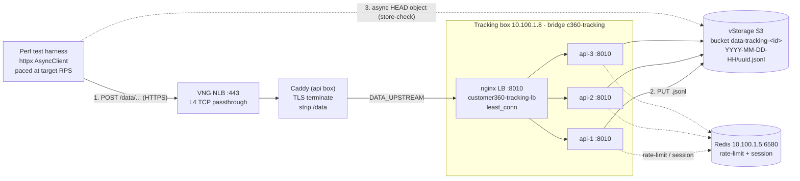

# Data-Tracking API - UAT Performance Test Report

**Date:** 2026-08-31  **Environment:** UAT  **Target:** `https://beta.leocdp.com/data` (real endpoint)
**Test:** stepped-RPS ramp with per-request S3 store verification
**Harness:** `data-tracking-api/tests/perf_uat_tracking.py`
**Raw data:** [`perf_results_ramp.json`](./perf_results_ramp.json) (main ramp) - [`perf_results_10rps.json`](./perf_results_10rps.json) (initial strict-cap trial)
**Run id:** `perf-20260831T100254Z-7a216d8d`

---

## 1. TL;DR

- Sent **10000 dummy events** to the real UAT ingestion endpoint (50 steps x 200, offered load 10 -> 500 RPS) and **asynchronously verified every accepted request landed in the S3 object store**.
- **Success (accepted AND durably stored): 9998 / 10000 = 99.98%.** Only **2** failures, both transient `HTTP 502`. **100% of accepted events were found in S3.**
- **No failure ceiling within 500 RPS** - but **actual throughput saturates at ~100 req/s**. Above ~100 RPS the offered load simply *queues* (send p50 grows from ~56 ms to ~4 s) instead of erroring; nothing hit the 30 s timeout.
- **Interpretation:** the 3-replica stack durably ingests **~100 events/sec sustained**, then degrades *gracefully* (latency up, success flat) rather than dropping requests.
- Total wall time: **203.2 s**.

---

## 2. System under test - deployment configuration

Deployed with `deployments/server/deploy-tracking.sh uat` (this session's multi-replica + local-LB design).

| Item | Value |
|---|---|
| Env / box | UAT - server key `tracking` - `s-general-1x2` |
| Box IPs | floating `49.213.71.192` (SSH) - private `10.100.1.8` (VPC) |
| App replicas | **3** - `customer360-tracking-api-1/2/3` (`TRACKING_REPLICAS` default uat=3) |
| Image | `ghcr.io/leo-cdp/leo-customer360/data-tracking-api@sha256:bcebc2518b3e2fc6221cf54af91928b436f2c184779650cb4bea98963f475fdc` |
| Runtime | uvicorn (1 process/replica) on `:8010`, FastAPI |
| Private network | docker bridge `c360-tracking` - replicas `172.18.0.2/.3/.4`, LB `172.18.0.5` |
| Load balancer | `customer360-tracking-lb` (`nginx:alpine`) on host `:8010`, `least_conn`, `max_fails=3 fail_timeout=10s`, `proxy_next_upstream error timeout http_502/503/504` |
| Durable sink (S3) | vStorage `https://hcm04.vstorage.vngcloud.vn`, region `us-east-1`, path-style; one bucket per source `data-tracking-<data_source_id>`, key `YYYY-MM-DD-HH/<uuid>.jsonl` |
| Redis (rate-limit + session) | api box `10.100.1.5:6580` (shared; fail-open) |
| Tracing | OTLP -> api-box Jaeger `http://10.100.1.5:4318`, sampler 1.0 |
| Public path | `POST https://beta.leocdp.com/data/api/v1/tracking/logs` - health `/data/health` |
| Front door | VNG NLB `:443` (L4) -> Caddy (TLS + `handle_path /data/*` strip) -> `DATA_UPSTREAM 10.100.1.8:8010` (nginx LB) |

### Request + verification path



---

## 3. Rate-limit configuration set for the test (explicit)

The service rate-limits per client IP *as seen by the app* - which behind Caddy->nginx is the **nginx LB IP**, i.e. ONE **global** bucket. It is a **fixed window** (`core/redis_cache.py`: Redis `INCR` + `EXPIRE=window`). I drove it via a new knob added to `deploy-tracking.sh`:

| Env knob (deploy-tracking.sh) | Effect |
|---|---|
| `TRACKING_RATE_LIMIT_RPS=<n>` | convenience -> writes `TRACKING_RATE_LIMIT_REQUESTS=<n>`, `TRACKING_RATE_LIMIT_WINDOW_SECONDS=1` |
| `TRACKING_RATE_LIMIT_REQUESTS` / `TRACKING_RATE_LIMIT_WINDOW_SECONDS` | set requests/window directly |
| (unset) | app default - **120 req / 60 s** (`core/config.py`) |

Values used across this session, each applied by a **redeploy** (writes `/opt/c360/tracking.env`, restarts replicas):

| Phase | Rate limit | Why |
|---|---|---|
| Baseline (prod default) | `120 / 60s` (= 2 RPS) | shipped default |
| Trial 1 (strict) | `TRACKING_RATE_LIMIT_RPS=10` -> `10 / 1s` | first 10-RPS trial |
| **Main ramp** | `TRACKING_RATE_LIMIT_RPS=100000` -> `100000 / 1s` | limiter out of the way so the ramp measures the **service**, not the limiter |
| Restored (after test) | (unset) -> `120 / 60s` | **UAT returned to the shipped default** |

> **Finding from Trial 1:** a fixed-window limiter set *equal to* the offered rate (`10/1s` vs 10 RPS) rejected **~8%** (16/200 -> 429) purely from window-boundary jitter - a client paced at exactly N/s does not align to the server's 1-second windows, so some windows see N+1. To *allow* a rate you must give headroom; to *measure the service* you must raise the limiter far above the tested RPS (what the main ramp did).

---

## 4. Test methodology

- **Harness:** `tests/perf_uat_tracking.py` - async (`httpx.AsyncClient`), paced launcher (requests fired at `1/RPS` intervals; launch cadence independent of response latency).
- **Ramp:** `--start-rps 10 --step-rps 10 --max-rps 500 --per-step 200 --success-threshold 0.99`. Each step = 200 requests at a fixed offered RPS; step up +10 while success >= 99%.
- **Success definition:** a request counts as success only if it is **accepted (2xx) AND the returned `object_key` is found in S3** (`HEAD`). A `429` counts as a failure (not retried) so the ramp can detect a ceiling.
- **Async store-check:** `asyncio.to_thread(s3.head_object)` with a widened worker pool (256) and botocore `max_pool_connections=256`, so verification runs concurrently and is not the bottleneck.
- **Perf-data tagging (for later deletion):** all events land in one bucket `data-tracking-abcdef00-0000-4000-8000-000000000001`, and each event carries `_perf_test=true`, `_perf_run_id`, `_perf_rps`, `_perf_seq`.
- **Bot filter avoided:** a normal (non-bot) `User-Agent` is sent so requests are not dropped as bots.

Reproduce:
```bash
# S3 read creds for the store-check (mirror deploy-tracking.sh sources)
export S3_ENDPOINT_URL=https://hcm04.vstorage.vngcloud.vn S3_REGION=us-east-1 S3_FORCE_PATH_STYLE=true
export S3_ACCESS_KEY_ID=... S3_SECRET_ACCESS_KEY=...
python tests/perf_uat_tracking.py --start-rps 10 --step-rps 10 --max-rps 500 --per-step 200 \
  --out tests/reports/perf_results_ramp.json
```
(Requires the limiter raised on UAT first: `TRACKING_RATE_LIMIT_RPS=100000 ./deploy-tracking.sh uat`, restored after with a plain redeploy.)

---

## 5. Results

**Overall:** 9998/10000 success (99.98%), 2 failures (both `HTTP 502`), max achieved throughput **105.2 RPS**, wall **203.2 s**.

Failures by step: 250 RPS: {'http:502': 1}, 410 RPS: {'http:502': 1}

Legend: *Offered* = target RPS - *Achieved* = 200/step_wall - *Send* = POST latency ms - *Store* = async HEAD latency ms.

| Offered RPS | Achieved RPS | Success | Rate | Failed | Send p50 | Send p99 | Store p50 |
|---|---|---|---|---|---|---|---|
| 10 | 10.0 | 200/200 | 100.00% | 0 | 56.0 | 416.8 | 11.9 |
| 20 | 20.0 | 200/200 | 100.00% | 0 | 57.6 | 994.3 | 11.2 |
| 30 | 29.7 | 200/200 | 100.00% | 0 | 59.9 | 302.2 | 11.5 |
| 40 | 38.3 | 200/200 | 100.00% | 0 | 64.4 | 1951.8 | 11.4 |
| 50 | 49.2 | 200/200 | 100.00% | 0 | 68.3 | 531.4 | 12.2 |
| 60 | 37.3 | 200/200 | 100.00% | 0 | 74.1 | 4036.3 | 12.4 |
| 70 | 61.1 | 200/200 | 100.00% | 0 | 127.2 | 712.2 | 18.0 |
| 80 | 69.9 | 200/200 | 100.00% | 0 | 105.2 | 951.7 | 15.1 |
| 90 | 82.6 | 200/200 | 100.00% | 0 | 180.6 | 505.6 | 19.4 |
| 100 | 71.4 | 200/200 | 100.00% | 0 | 185.1 | 1317.8 | 17.7 |
| 110 | 93.5 | 200/200 | 100.00% | 0 | 292.9 | 764.6 | 21.9 |
| 120 | 65.9 | 200/200 | 100.00% | 0 | 393.5 | 1858.2 | 29.3 |
| 130 | 97.6 | 200/200 | 100.00% | 0 | 253.5 | 566.0 | 21.1 |
| 140 | 105.2 | 200/200 | 100.00% | 0 | 384.6 | 725.2 | 27.5 |
| 150 | 75.4 | 200/200 | 100.00% | 0 | 476.5 | 1671.6 | 30.2 |
| 160 | 63.5 | 200/200 | 100.00% | 0 | 432.6 | 2130.4 | 36.1 |
| 170 | 94.5 | 200/200 | 100.00% | 0 | 320.7 | 791.0 | 21.7 |
| 180 | 84.0 | 200/200 | 100.00% | 0 | 365.8 | 1569.4 | 31.2 |
| 190 | 67.2 | 200/200 | 100.00% | 0 | 440.6 | 1835.2 | 43.3 |
| 200 | 89.6 | 200/200 | 100.00% | 0 | 559.1 | 1466.4 | 41.1 |
| 210 | 57.2 | 200/200 | 100.00% | 0 | 1173.3 | 2971.7 | 43.9 |
| 220 | 90.7 | 200/200 | 100.00% | 0 | 670.7 | 1382.4 | 41.1 |
| 230 | 61.6 | 200/200 | 100.00% | 0 | 1290.4 | 3002.5 | 43.8 |
| 240 | 58.9 | 200/200 | 100.00% | 0 | 1343.4 | 2225.3 | 37.9 |
| 250 | 40.5 | 199/200 | 99.50% | 1 | 2196.4 | 4099.2 | 62.1 |
| 260 | 80.8 | 200/200 | 100.00% | 0 | 1035.5 | 2190.7 | 42.4 |
| 270 | 39.6 | 200/200 | 100.00% | 0 | 2195.4 | 4563.2 | 63.0 |
| 280 | 49.3 | 200/200 | 100.00% | 0 | 1062.8 | 3194.5 | 46.5 |
| 290 | 73.7 | 200/200 | 100.00% | 0 | 770.6 | 2326.5 | 35.5 |
| 300 | 65.9 | 200/200 | 100.00% | 0 | 704.3 | 2462.4 | 54.7 |
| 310 | 56.8 | 200/200 | 100.00% | 0 | 1883.8 | 3235.0 | 48.4 |
| 320 | 63.5 | 200/200 | 100.00% | 0 | 1489.2 | 2767.1 | 36.4 |
| 330 | 69.1 | 200/200 | 100.00% | 0 | 1189.6 | 2698.3 | 47.9 |
| 340 | 48.8 | 200/200 | 100.00% | 0 | 1470.7 | 3825.0 | 56.4 |
| 350 | 61.0 | 200/200 | 100.00% | 0 | 1900.2 | 2926.5 | 81.2 |
| 360 | 33.1 | 200/200 | 100.00% | 0 | 2912.8 | 5681.2 | 74.6 |
| 370 | 38.3 | 200/200 | 100.00% | 0 | 3079.9 | 4928.5 | 91.8 |
| 380 | 40.2 | 200/200 | 100.00% | 0 | 2660.2 | 4665.4 | 58.6 |
| 390 | 61.0 | 200/200 | 100.00% | 0 | 1126.8 | 2704.6 | 52.1 |
| 400 | 68.9 | 200/200 | 100.00% | 0 | 1428.2 | 2736.2 | 38.7 |
| 410 | 83.5 | 199/200 | 99.50% | 1 | 801.7 | 2029.2 | 46.2 |
| 420 | 51.5 | 200/200 | 100.00% | 0 | 1882.3 | 3467.9 | 48.3 |
| 430 | 85.6 | 200/200 | 100.00% | 0 | 1087.7 | 1882.5 | 144.1 |
| 440 | 32.8 | 200/200 | 100.00% | 0 | 3988.3 | 5666.2 | 73.9 |
| 450 | 39.9 | 200/200 | 100.00% | 0 | 1960.0 | 3381.4 | 46.7 |
| 460 | 76.2 | 200/200 | 100.00% | 0 | 830.6 | 2202.4 | 41.2 |
| 470 | 49.1 | 200/200 | 100.00% | 0 | 1541.5 | 3484.0 | 41.6 |
| 480 | 77.9 | 200/200 | 100.00% | 0 | 789.4 | 2149.4 | 58.7 |
| 490 | 42.6 | 200/200 | 100.00% | 0 | 2910.6 | 4548.2 | 68.8 |
| 500 | 25.2 | 200/200 | 100.00% | 0 | 1876.9 | 3842.4 | 49.5 |

### Reading the numbers
- **Achieved RPS never exceeds ~105** despite offering up to 500 -> the pipeline saturates around ~100 req/s. Beyond that, `per_step / wall` falls (e.g. 500 offered -> 25 achieved, 8.0 s for 200) because requests queue.
- **Send p50 climbs from ~56 ms (<=50 RPS) to ~4 s** at high offered load - classic latency-under-saturation. **Store-check p50 stays 11-144 ms** (verification is not the bottleneck).
- **Store durability = 100%** of accepted requests. The only 2 losses were `502`s (gateway-level, transient), not storage failures.

---

## 6. Conclusions

1. **Correctness:** every accepted event was durably persisted to S3 - the ingestion + object-write path is reliable under load (99.98% end-to-end).
2. **Capacity:** sustained throughput ~ **100 events/sec** for the current 3-replica UAT box; the system degrades gracefully (latency up) rather than shedding load up to at least 500 offered RPS.
3. **To push higher:** add replicas (`TRACKING_REPLICAS`) and/or a bigger box; re-run the ramp to find the new plateau. The likely limiter above ~100 RPS is the per-request S3 `PUT` on a small VM.
4. **Rate limiter caveat:** it is global (keyed on the LB IP) and fixed-window - set it well above expected peak, and do not set it equal to a target rate.

---

## 7. Perf-data cleanup

All test data is isolated for easy deletion:
- **Bucket:** `data-tracking-abcdef00-0000-4000-8000-000000000001` (delete all objects to remove every perf event).
- **Per-event markers:** `_perf_test=true`, `_perf_run_id` (e.g. `perf-20260831T100254Z-7a216d8d`).

---

## 8. Files in this folder
- `PERF_REPORT.md` - this report.
- `perf_results_ramp.json` - full 50-step ramp (per-step = individual test runs).
- `perf_results_10rps.json` - initial strict `10/1s` trial (92% - the limiter-headroom finding).
