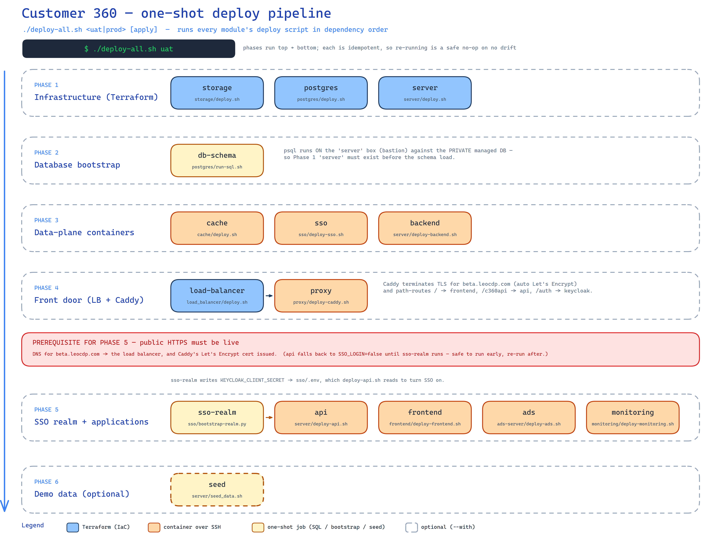
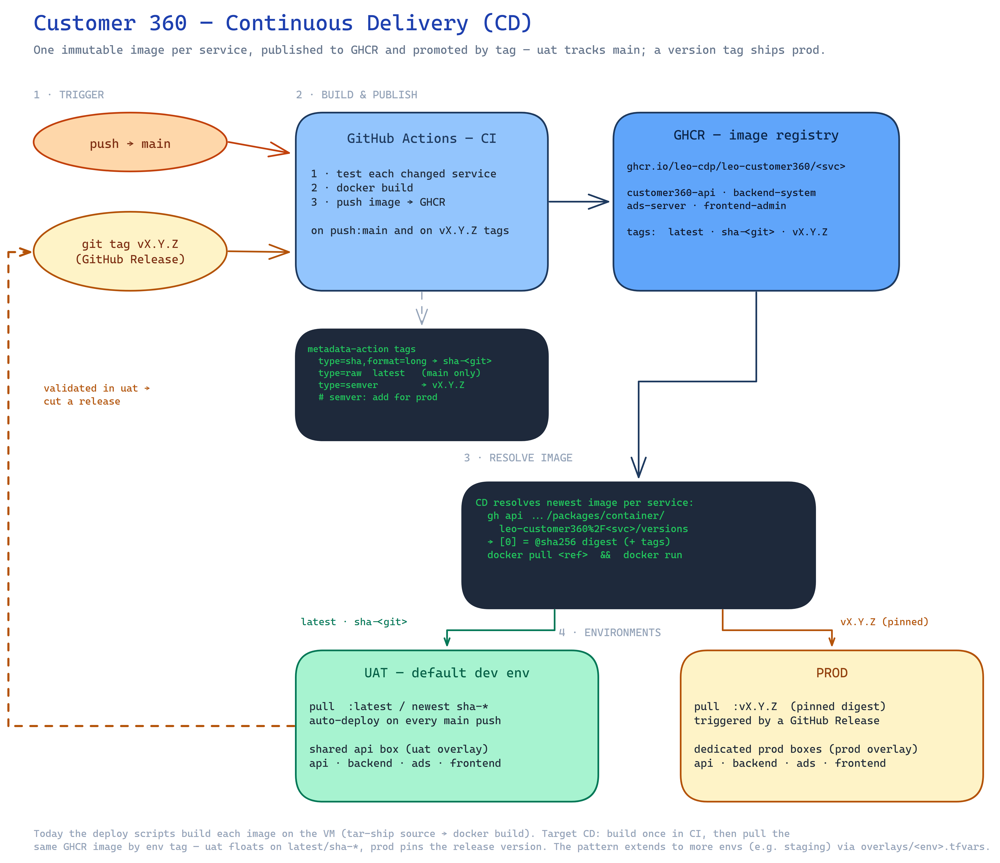
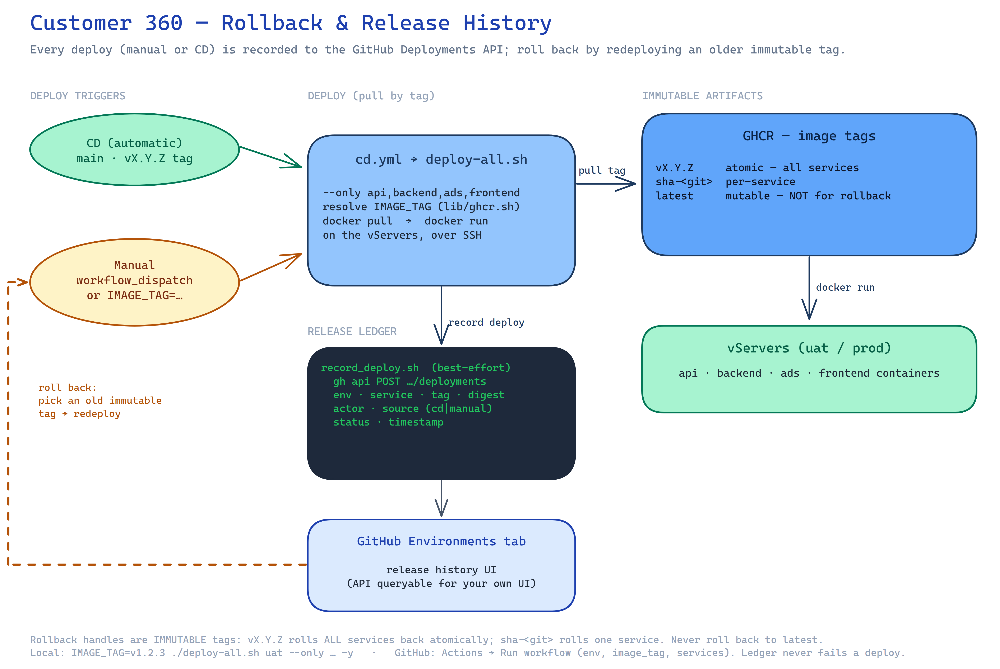
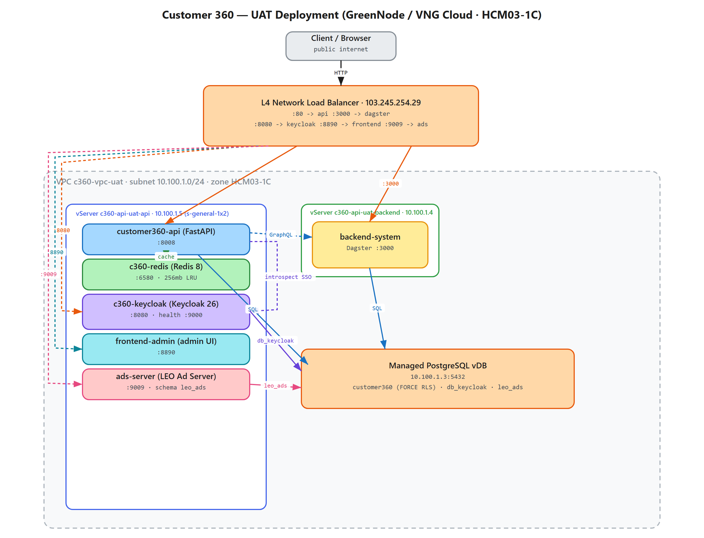
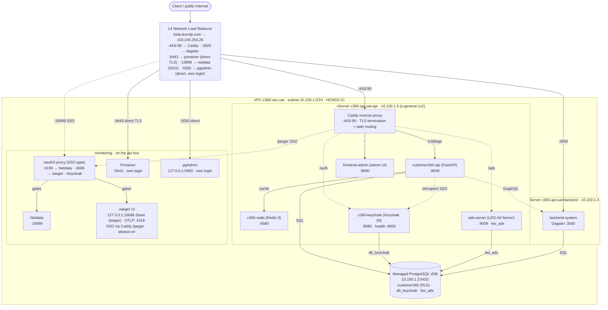
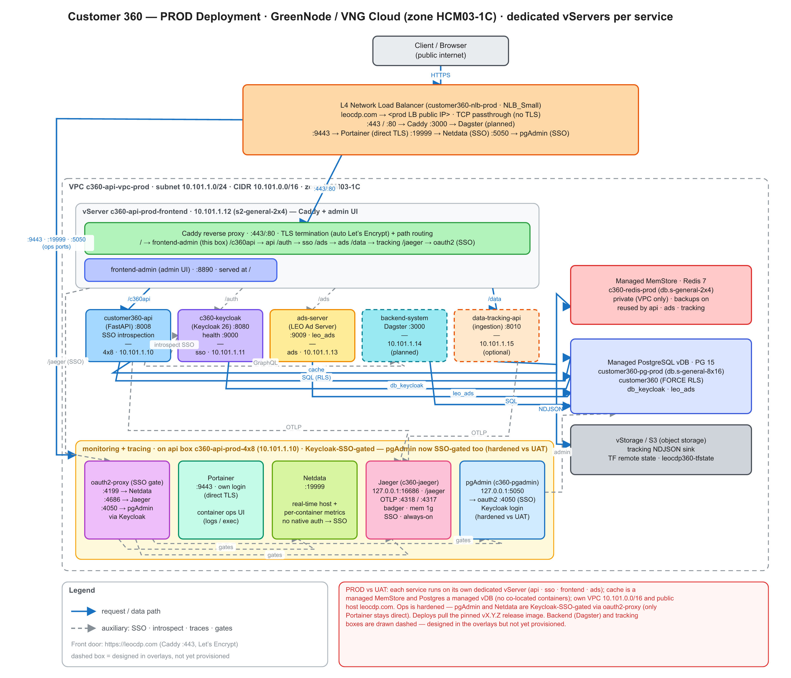

# Customer 360 — Deployments

Infrastructure-as-code + deploy scripts for the Customer 360 platform on
**GreenNode / VNG Cloud** (zone **HCM03-1C**). Each subfolder is a self-contained
deployment with per-env `overlays/<env>.tfvars`, Terraform workspaces, and a
`deploy.sh`-style wrapper.

| Folder | What it provisions |
|--------|--------------------|
| [`postgres`](./postgres) | Managed PostgreSQL vDB (`customer360` + `db_keycloak`), `run-sql.sh` schema/seed bootstrap |
| [`server`](./server) | vServers (VMs): api box + backend box (uat); adds dedicated `sso` + `frontend` + `ads` boxes (prod) |
| [`cache`](./cache) | Redis — uat: container on the api box; prod: managed MemStore |
| [`sso`](./sso) | Keycloak (SSO/OIDC) — uat: container on the api box; prod: dedicated vServer |
| [`frontend`](./frontend) | frontend-admin (admin UI) — uat: container on the api box; prod: dedicated vServer |
| [`ads-server`](./ads-server) | LEO Ad Server (schema `leo_ads`) — uat: container on the api box; prod: dedicated vServer |
| [`monitoring`](./monitoring) | Portainer (direct HTTPS) + Netdata (behind oauth2-proxy / Keycloak SSO) dashboards **+ Jaeger** (OpenTelemetry request-trace UI at `/jaeger`) **+ pgAdmin** (Postgres admin UI, direct on the LB with its own login) — on the api box |
| [`load_balancer`](./load_balancer) | L4 NLB fronting api / dagster / keycloak / frontend / ads / monitoring |
| [`proxy`](./proxy) | **Caddy** reverse proxy — TLS termination (auto Let's Encrypt) + single-host path routing. **Live** at `https://beta.leocdp.com` (fronts frontend `/`, api `/c360api`, keycloak `/auth`, ads `/ads`, jaeger `/jaeger`); [runbook](./proxy/README.md#cutover-runbook-put-the-platform-behind-betaleocdpcom) |
| [`storage`](./storage) | Object storage (vStorage / S3) |

> **Scope:** this table maps to the **UAT** overlay. The prod overlay differs
> (dedicated boxes, managed MemStore, own VPC `10.101.0.0/16`) — see the
> [PROD deployment view](#prod-deployment-view) and the UAT → PROD differences table below.

## One-shot deploy — `deploy-all.sh`

[`deploy-all.sh`](./deploy-all.sh) is a single orchestrator that runs **every module's
deploy script in the correct dependency order** for one environment. Each module keeps
its own script (they are the source of truth); this is a thin, re-runnable wrapper on top.

```bash
./deploy-all.sh uat                 # apply everything, in order (default action)
./deploy-all.sh uat --list          # print the ordered steps and exit (no changes)
./deploy-all.sh uat --dry-run        # show the exact commands that would run
./deploy-all.sh uat --with seed     # also load the CIR demo data
./deploy-all.sh uat plan            # terraform plan for the IaC steps only
./deploy-all.sh uat destroy         # tear everything down (REVERSE order)
```



📐 **Editable sources:** [`deploy-process.excalidraw`](./deploy-process.excalidraw)
(open at [excalidraw.com](https://excalidraw.com) or the Obsidian Excalidraw plugin) ·
[`deploy-process.svg`](./deploy-process.svg) (vector source of the image above).

### Ordered steps

Phases run top → bottom; every step is idempotent/converging, so re-running is a safe
no-op when there is no drift.

| # | Phase | Step | Runs | Depends on |
|---|-------|------|------|------------|
| 1 | Infra (Terraform) | `storage` | `storage/deploy.sh` | — (independent) |
| 2 | Infra (Terraform) | `postgres` | `postgres/deploy.sh` | — |
| 3 | Infra (Terraform) | `server` | `server/deploy.sh` | — |
| 4 | DB bootstrap | `db-schema` | `postgres/run-sql.sh` | `server` (bastion) + `postgres` |
| 5 | Data-plane | `cache` | `cache/deploy.sh` | `server` |
| 6 | Data-plane | `sso` | `sso/deploy-sso.sh` | `server` + `db-schema` (`db_keycloak`) |
| 7 | Data-plane | `backend` | `server/deploy-backend.sh` | `server` + `db-schema` |
| 8 | Front door | `load-balancer` | `load_balancer/deploy.sh` | `server` |
| 9 | Front door | `proxy` (Caddy) | `proxy/deploy-caddy.sh` | `load-balancer` (`:80`/`:443` → box) + **DNS** |
| 10 | SSO + apps | `sso-realm` | `sso/bootstrap-realm.py` | `sso` + public HTTPS (writes `KEYCLOAK_CLIENT_SECRET` → `sso/.env`) |
| 11 | SSO + apps | `api` | `server/deploy-api.sh` | `db-schema`, `cache`, `backend`, `sso-realm` (SSO optional) |
| 12 | SSO + apps | `frontend` | `frontend/deploy-frontend.sh` | `server` |
| 13 | SSO + apps | `ads` | `ads-server/deploy-ads.sh` | `server` + `db-schema` + `cache` |
| 14 | SSO + apps | `monitoring` | `monitoring/deploy-monitoring.sh` | `server`; SSO gate needs `sso-realm` + `load-balancer` |
| 15 | Demo data | `seed` *(optional)* | `server/seed_data.sh` | `api`/`db-schema`; opt-in via `--with seed` |

### Flags

| Flag | Effect |
|------|--------|
| `--list` | Print the ordered steps (with phases) and exit. |
| `--from <step>` | Start at `<step>`, skip everything before it (**resume** after a fix). |
| `--only <a,b,c>` | Run **only** these steps, keeping order. |
| `--skip <a,b,c>` | Run everything **except** these steps. |
| `--with <a,b,c>` | Also run the **optional** steps (e.g. `seed`). |
| `--keep-going` | Don't stop on the first failure; report at the end. |
| `--dry-run` | Print the commands that **would** run; execute nothing. |
| `-y`, `--yes` | Don't prompt for confirmation before executing. |

### First bring-up & the HTTPS prerequisite

Steps 9–14 that need the **public HTTPS entry point** (Caddy's cert, the API's SSO mode,
the monitoring oauth2 gate) require that DNS for `caddy_domain` (`beta.leocdp.com`) points
at the load balancer and Caddy has issued its Let's Encrypt certificate. On a first
bring-up before DNS is live:

```bash
./deploy-all.sh uat --skip proxy,sso-realm,monitoring   # infra + apps (api starts in local-JWT mode)
# → point DNS: beta.leocdp.com (A) → the LB public IP, wait for it to resolve
./deploy-all.sh uat --from proxy                        # Caddy → realm → re-deploy api (SSO on) → monitoring
```

`deploy-api.sh` falls back to `SSO_LOGIN=false` (dev local-JWT) until the realm exists, so
running `api` early is safe — re-run it after `sso-realm` to switch SSO on. Secrets/creds
live in each module's own `.env` / `terraform.tfvars` (see each module's README).

## Continuous Delivery (CD)

`deploy-all.sh` above is the **manual / one-shot** path. The **target CD model** builds each
service's image **once** in CI, publishes it to the GitHub Container Registry (GHCR), and then has
each environment **pull that same immutable image by tag** — instead of rebuilding on the box.
`uat` is the default dev environment and tracks `main`; a version-tagged **release** ships `prod`.



📐 **Editable sources:** [`cd-process.excalidraw`](./cd-process.excalidraw)
(open at [excalidraw.com](https://excalidraw.com) or the Obsidian Excalidraw plugin) ·
[`cd-process.svg`](./cd-process.svg) (vector source of the image above).

> **Status:** the app deploy scripts now **pull the CI-built image from GHCR by default**
> (`server/deploy-api.sh`, `server/deploy-backend.sh`, `ads-server/deploy-ads.sh`,
> `frontend/deploy-frontend.sh`, `server/deploy-tracking.sh` → `docker pull` + `docker run`, via the shared
> [`lib/ghcr.sh`](./lib/ghcr.sh)). Set `BUILD_LOCAL=1` to fall back to shipping source and
> building on the VM. The [`CD`](../.github/workflows/cd.yml) workflow runs these
> automatically after CI succeeds (`main` commit whose title contains `--deploy-uat` → uat;
> a `vX.Y.Z` tag → prod).

### 1 · What CI publishes to GHCR

[`.github/workflows/ci.yml`](../.github/workflows/ci.yml) tests each changed service, builds its
image, and pushes it to:

```
ghcr.io/leo-cdp/leo-customer360/<service>
```

for `<service>` ∈ `customer360-api` · `backend-system` · `ads-server` · `frontend-admin`
· `data-tracking-api` · `postgres` · `redis` (each has its own `Dockerfile`; a change under that folder builds it).
Tags come from `docker/metadata-action`:

| Tag | From | When |
|-----|------|------|
| `sha-<git-sha>` | `type=sha,format=long` | every build — **immutable**, traceable to a commit |
| `latest` | `type=raw,value=latest` | default branch (`main`) only |
| `vX.Y.Z` | `type=semver` | on a release / `v*` tag — the pinned image prod deploys |

> ✅ CI triggers on branch pushes **and** `v*` tags, and pushes images on `main` **or** a release
> tag (`push: … || startsWith(github.ref, 'refs/tags/v')`). A tag build publishes **all** services
> at that version (branch builds only the changed ones).

### 2 · How a deploy resolves the image (the "latest SHA" lookup)

Rather than hard-code a tag, a deploy step asks GHCR for the **newest** version of each service's
package. The GitHub Packages *container versions* API returns versions **newest-first**, so `[0]`
is the last push:

```bash
# newest image for one service — its digest + tags
gh api -H "Accept: application/vnd.github+json" \
  "/orgs/LEO-CDP/packages/container/leo-customer360%2Fcustomer360-api/versions?per_page=1" \
  --jq '.[0] | {digest: .name, tags: .metadata.container.tags}'
# → { "digest": "sha256:…", "tags": ["sha-<git>", "latest"] }
```

- `.[0].name` is the immutable **digest** → deploy `ghcr.io/…/<svc>@sha256:…` for a fully pinned run.
- `.[0].metadata.container.tags` are the human tags (`sha-<git>`, `latest`, `vX.Y.Z`).

The package name is `<repo>/<service>` **URL-encoded** — the `/` becomes `%2F`. Private packages
need a token with `read:packages`, and the VM runs `docker login ghcr.io` before pulling. (The
Registry v2 `/tags/list` endpoint does **not** guarantee chronological order — hence the Packages
API for "newest".)

### 3 · Per-environment tag policy

Each env picks its tag the way the scripts already read config — a value from
`overlays/<env>.tfvars` (via the `tfval` helper), with a sensible default:

| Env | Image tag | Trigger | Boxes |
|-----|-----------|---------|-------|
| **uat** (default dev) | `latest` / newest `sha-*` | a `main` commit whose **title** contains `--deploy-uat` | shared api box (uat overlay) |
| **prod** | `vX.Y.Z` (pinned digest) | a GitHub **Release** (version tag) | dedicated prod boxes (prod overlay) |

Promotion is a **shift of the same artifact**: validate the build in `uat`, then cut a release —
that version tag is exactly what `prod` pulls. The model extends to more envs (e.g. `staging`) by
adding another `overlays/<env>.tfvars`.

### 4 · Wiring it into the deploy scripts

To move a service from build-on-box to pull-from-GHCR, the remote block changes from a
`docker build` to a resolve-and-pull — everything else (env-file assembly, DB/Redis/SSO wiring,
`--network host`) stays the same:

```bash
REGISTRY="ghcr.io/leo-cdp/leo-customer360"
TAG="$(tfval image_tag "overlays/$ENV.tfvars")"; TAG="${TAG:-latest}"   # prod overlay pins vX.Y.Z
sudo docker login ghcr.io -u "$GHCR_USER" -p "$GHCR_TOKEN"    # if the package is private
sudo docker pull  "$REGISTRY/$SERVICE:$TAG"
sudo docker rm -f "$SERVICE" 2>/dev/null || true
sudo docker run -d --name "$SERVICE" --restart unless-stopped --network host \
  --env-file "/opt/c360/$SERVICE.env" "$REGISTRY/$SERVICE:$TAG"
```

### 5 · Remote Terraform state (required for CI/CD)

CD runs on GitHub-hosted runners, which have **no local Terraform state**, so the
`server` / `postgres` / `cache` modules use an **S3 remote backend on VNG vStorage**
(see each module's `backend.tf`) — CI reads the same state operators use locally.
Credentials come from the environment, never the code.

**One-time setup:**

1. Create the state bucket once (any S3 client, pointed at the vStorage endpoint):
   ```bash
   AWS_ACCESS_KEY_ID=<k> AWS_SECRET_ACCESS_KEY=<s> \
     aws --endpoint-url https://hcm04.vstorage.vngcloud.vn s3 mb s3://leocdp360-tfstate
   ```
2. Migrate each module's existing **local** state into it (run locally; Terraform ≥ 1.6):
   ```bash
   export AWS_ACCESS_KEY_ID=<vstorage key> AWS_SECRET_ACCESS_KEY=<vstorage secret>
   for m in server postgres cache; do
     terraform -chdir="deployments/$m" init -migrate-state -force-copy
   done
   ```
3. Add the vStorage S3 creds as GitHub Actions secrets so CD can read state —
   `VSTORAGE_ACCESS_KEY`, `VSTORAGE_SECRET_KEY` (`cd.yml` maps them to
   `AWS_ACCESS_KEY_ID` / `AWS_SECRET_ACCESS_KEY`).

Bucket/endpoint/region live in each `backend.tf` (bucket `leocdp360-tfstate`, endpoint
`hcm04.vstorage.vngcloud.vn`, region `us-east-1` — required by vStorage). Per-module
state lands at `env/<workspace>/<module>/terraform.tfstate`. The `storage` and
`load_balancer` modules can adopt the same backend later; CD only needs these three.

**Local runs stay aligned with remote automatically.** You never sync state down —
a remote backend means Terraform reads/writes it live on every command. `deploy-all.sh`
preflight sources [`lib/tfstate.sh`](./lib/tfstate.sh), which (1) loads the vStorage S3
creds into `AWS_*` from `storage/`'s config and (2) `terraform init`s the remote-backend
modules, so a local `./deploy-all.sh uat …` always uses the **same state as CI** — never a
stale local copy. Running a module script **directly** (not via `deploy-all.sh`) still needs
`AWS_ACCESS_KEY_ID` / `AWS_SECRET_ACCESS_KEY` exported, and a fresh checkout needs a one-time
`terraform init` per module (no `-migrate-state`). Note: vStorage has **no state locking** —
don't run two `apply`s against the same module/workspace at once.

### 6 · Rollback & release history



📐 **Editable sources:** [`rollback-release.excalidraw`](./rollback-release.excalidraw)
(open at [excalidraw.com](https://excalidraw.com) or the Obsidian Excalidraw plugin) ·
[`rollback-release.svg`](./rollback-release.svg) (vector source of the image above).

**Images are pulled by tag, so a rollback is just deploying an older immutable tag.**
Use `sha-<git>` (per-commit, per-service) or `vX.Y.Z` (a release — all services at one
version); **never roll back to `latest`** (mutable).

- **Local:** `IMAGE_TAG` overrides the tag `lib/ghcr.sh` resolves:
  ```bash
  IMAGE_TAG=v1.2.3 ./deploy-all.sh uat --only api,backend,ads,frontend -y   # atomic, all services
  IMAGE_TAG=sha-<oldgitsha> bash server/deploy-api.sh uat                    # one service
  ```
- **From GitHub (UI/API):** the [`CD`](../.github/workflows/cd.yml) workflow has a
  **`workflow_dispatch`** trigger — Actions → *Run workflow* (or `gh workflow run cd.yml
  -f environment=uat -f image_tag=v1.2.3 -f services=api,backend`). A `prod` rollback still
  passes through the `prod` environment's approval gate.

> Keep your GHCR package retention from pruning old **tagged** versions (`sha-*`, `v*`) —
> those are your rollback targets. Prefer a `vX.Y.Z` release as the atomic rollback unit.

**Release ledger (all deploys — manual + CD).** `lib/record_deploy.sh` records every deploy
to the **GitHub Deployments API** (env, service, image tag/digest, actor, `cd`|`manual`,
time, status) — it's sourced by each app deploy script, so both manual runs and CD are
captured. View the history in the repo's **Environments** tab; query the Deployments API for
a custom UI later. Auth: CD sets `GH_TOKEN` + `permissions: deployments: write`; locally it
uses your `gh auth`. It's best-effort — a missing `gh`/token never fails a deploy. (Postgres
was ruled out for the ledger: the managed DB is on a private VPC IP, unreachable from the CI
runner / a laptop where deploys run.)

**Monitor it** two ways: the repo's **Environments** tab (per-env history, zero-setup), or
[`release-log.sh`](./release-log.sh) which reads the same Deployments API into a table:
```bash
./release-log.sh                 # recent history, uat + prod
./release-log.sh uat 50          # uat, last 50
./release-log.sh --current       # latest SUCCESS per (env, service) = what's live now
```
The Environments tab's single "Active" badge is per-environment; for per-**service** "what's
live now", use `release-log.sh --current`.

## UAT deployment view



📐 **Editable sources:** [`deployment-view-uat.excalidraw`](./deployment-view-uat.excalidraw)
(open at [excalidraw.com](https://excalidraw.com) or the Obsidian Excalidraw plugin) ·
[`deployment-view-uat.svg`](./deployment-view-uat.svg) (vector source of the image above).

<details><summary>Same view as a Mermaid diagram (editable text)</summary>



</details>

### Components (UAT)

| Component | Runs on | Port | Notes |
|-----------|---------|------|-------|
| L4 NLB | VNG vLB | 80 / 3000 / 5050 / 8080 / 8890 / 9009 / 9443 / 19999 | public `103.245.254.29`; TCP passthrough (no TLS) |
| customer360-api | api box `10.100.1.5` | 8008 | FastAPI, `--network host`; Redis cache; SSO via Keycloak introspection (`SSO_LOGIN=true`) |
| c360-redis | api box `10.100.1.5` | 6580 | fail-open response cache; `maxmemory 256mb allkeys-lru` |
| c360-keycloak | api box `10.100.1.5` | 8080 | Keycloak 26 `start-dev`; health on mgmt `:9000`; realm `customer360` |
| frontend-admin | api box `10.100.1.5` | 8890 | FastAPI admin UI; browser calls the API/Keycloak via the LB |
| ads-server | api box `10.100.1.5` | 9009 | LEO Ad Server (FastAPI); own schema `leo_ads` (no RLS); reuses the local Redis |
| oauth2-proxy | api box `10.100.1.5` | 4199 (Netdata) · 4686 (Jaeger) | Keycloak SSO gate in front of the no-native-auth dashboards (the L4 LB can't do OIDC); one proxy container per gated dashboard |
| Portainer | api box `10.100.1.5` | 9443 | container ops UI (logs/exec/restart); direct HTTPS on the LB — its own login |
| Netdata | api box `10.100.1.5` | 19999 | real-time host + per-container metrics; no native auth → oauth2-proxy SSO |
| Jaeger | api box `10.100.1.5` | 16686 (UI) · 4318/4317 (OTLP) | OpenTelemetry request-trace UI (`c360-jaeger`); **always-on** (SSO+TLS); badger storage, mem-capped; UI loopback (base path /jaeger) → **oauth2-proxy :4686 → Caddy /jaeger on :443 (Keycloak SSO, TLS)** |
| pgAdmin | api box `10.100.1.5` | 5050 | Postgres admin/monitoring UI (`c360-pgadmin`); its own login, exposed **directly** on the LB (`LB :5050 → pgAdmin :5050`); plain HTTP (cleartext login — see the LB note); `pgadmin_data` volume, mem-capped |
| Dagster | backend box `10.100.1.4` | 3000 | backend-system worker |
| Portainer agent | backend `10.100.1.4` + tracking `10.100.1.8` | 9001 | `c360-portainer-agent`; lets the api-box Portainer manage these boxes too (private VPC, reached from `10.100.1.5`); registered as Portainer environments |
| data-tracking-api | tracking box `10.100.1.8` | 8010 | FastAPI event ingestion on its own dedicated `s-general-1x2` box, run as **N auto-load-balanced replicas** (uat 3 / prod 5, `TRACKING_REPLICAS`) on a private docker bridge behind a local **nginx** LB that owns `:8010` (least_conn round-robin); writes NDJSON to vStorage/S3; reuses the api-box Redis for IP rate-limit + session cache (fail-open); OTLP request traces → api-box Jaeger; exposed at `/data` via Caddy |
| PostgreSQL | managed vDB `10.100.1.3` | 5432 | `customer360` (FORCE RLS) + `db_keycloak` + `leo_ads` |

### Public endpoints — `beta.leocdp.com`

The domain (`beta.leocdp.com`, A record → the LB public IP `103.245.254.29`) is **live**,
fronted by **Caddy** (deployments/proxy), which terminates TLS (Let's Encrypt) and path-routes
the browser-facing apps on `:443`. The ops dashboards stay on their raw LB ports and are reached
via the **LB IP** (see the HSTS note below).

| Service | URL | Served by |
|---------|-----|-----------|
| frontend-admin (UI) | `https://beta.leocdp.com/` | Caddy `/` → frontend :8890 |
| customer360-api | `https://beta.leocdp.com/c360api` (base `…/c360api/api/v1`) | Caddy `/c360api/*` → api :8008 (`root_path=/c360api`) |
| Keycloak | `https://beta.leocdp.com/auth` | Caddy `/auth/*` → keycloak :8080 |
| ads-server (+ `/ads/docs`) | `https://beta.leocdp.com/ads` | Caddy `/ads/*` → ads :9009 (`root_path=/ads`) |
| data-tracking-api (ingest) | `https://beta.leocdp.com/data` (POST `…/data/api/v1/tracking/logs`; health `…/data/health`) | Caddy `/data/*` → tracking :8010 |
| Portainer (own login) | `https://103.245.254.29:9443` | LB direct → Portainer :9443 (self-signed TLS) |
| Netdata (SSO) | `http://103.245.254.29:19999` | LB → oauth2-proxy :4199 → Netdata (Keycloak login) |
| pgAdmin (own login) | `http://103.245.254.29:5050` | LB direct → pgAdmin :5050 (its own login as `admin@leocdp.com`; plain HTTP — cleartext) |
| Dagster | `http://103.245.254.29:3000` | LB direct → dagster :3000 |
| Jaeger (trace UI, SSO) | `https://beta.leocdp.com/jaeger` | Caddy :443 (TLS) → oauth2-proxy :4686 → Jaeger (Keycloak login as `c360admin`); **always-on** (`jaeger_enabled=true`) — see the [monitoring runbook](./monitoring/README.md) |

> ⚠️ **Ops tools use the LB IP, not the `beta.leocdp.com` hostname.** The parent domain
> `leocdp.com` is HSTS-preloaded (`includeSubDomains`), so browsers force HTTPS-with-valid-cert
> on the **entire** `beta.leocdp.com` host, on every port — breaking the plain-HTTP (`:3000`,
> `:19999`, `:5050`) and self-signed (`:9443`) ops ports (an `http://beta…:3000` gets auto-upgraded to
> `https` and fails). The **IP is not HSTS-pinned**, so use `http://103.245.254.29:<port>`
> (or an SSH tunnel to `localhost`). Only the `:443` Caddy front door has a trusted cert.
>
> The cutover was applied via [`proxy/cutover-beta.leocdp.com.patch`](./proxy/cutover-beta.leocdp.com.patch)
> (ordered deploy: the [proxy runbook](./proxy/README.md#cutover-runbook-put-the-platform-behind-betaleocdpcom)).
> To move to a **different domain**, edit one value and run [`set-domain.sh`](./set-domain.sh) (below).

### Tracking feature — bring-up (data-tracking-api)

The web-tracking ingestion service (`data-tracking-api`) runs on its **own** vServer (server key
`tracking`, private `10.100.1.8`) as **N auto-load-balanced replicas** (uat 3 / prod 5) on a
private docker bridge behind a local **nginx** LB that owns `:8010`. It is deliberately minimal —
it uses only what the app needs:
**vStorage/S3** (the durable NDJSON sink); optionally the **api-box Redis** for IP rate-limiting
+ session cache (fail-open if absent); and it exports **OpenTelemetry request traces** over OTLP to
the **api-box Jaeger** (reusing the existing Jaeger — no new one). It is exposed publicly at
`https://beta.leocdp.com/data` via Caddy + the LB. Bring it up on UAT in order (each step is idempotent):

```bash
# 1) INFRA — provision the tracking vServer + open its cross-box secgroup ports
#    (8010 Caddy→tracking · 6580 api-box-Redis←tracking · 4318 api-box-Jaeger←tracking · 9001 Portainer)
cd deployments/server && ./deploy.sh uat apply
terraform output servers          # confirm the tracking box private ip (expected 10.100.1.8)
#    If it differs, fix data_upstream (proxy overlay) + the 6580/4318 cidrs (server extra_ingress), re-apply.

# 2) APP — run data-tracking-api as N replicas behind the local nginx LB (:8010), wired to S3
#    + the api-box Redis (pulls the CI-built image from GHCR; set BUILD_LOCAL=1 to build on the VM).
#    Replica count defaults to uat 3 / prod 5 — override with TRACKING_REPLICAS=<n>.
cd ../server && ./deploy-tracking.sh uat

# 3) FRONT DOOR — add/refresh the beta.leocdp.com/data route in Caddy
cd ../proxy && ./deploy-caddy.sh uat

# 4) MONITORING (optional) — register the Portainer agent on the tracking box for ops visibility
cd ../monitoring && ./deploy-monitoring.sh uat
```

**Endpoint once live**

- Ingestion: `POST https://beta.leocdp.com/data/api/v1/tracking/logs` (Caddy `/data` → tracking `:8010`)
- Health (GET): `https://beta.leocdp.com/data/health`
- Traces: `data-tracking-api` appears in the Jaeger UI at `https://beta.leocdp.com/jaeger` (Keycloak SSO)

**Notes**

- Redis is **optional** — the rate limiter fails open and the session cache no-ops if it's absent.
  The tracking box reuses the existing api-box Redis (no dedicated instance); `deploy-tracking.sh`
  resolves it from `../cache` and opens `6580` api-box←tracking (server `extra_ingress`).
- **Jaeger tracing** reuses the existing api-box Jaeger — the app is OTEL-instrumented and exports
  OTLP to the monitoring box's `:4318` (on/off via `otel_enabled` in `server/overlays/<env>.tfvars`
  or `OTEL_ENABLED`). No Jaeger runs on the tracking box.
- The tracking box is a **dedicated box**: its cross-box hops (Caddy→`:8010`, tracking→api-Redis
  `:6580`) are opened explicitly in `server/overlays/uat.tfvars` (`extra_ingress`) and applied
  out-of-band by step 1 (CD never runs infra Terraform).
- **Scaling / load balancing** — the app runs as `TRACKING_REPLICAS` instances (default uat 3 /
  prod 5) on a private docker bridge (`c360-tracking`), each still listening on `:8010` inside its
  own namespace (built-in HEALTHCHECK intact). A tiny **nginx** container (`customer360-tracking-lb`)
  owns host `:8010` — the single address Caddy's `data_upstream` already targets — and `least_conn`
  round-robins across the replicas, retrying the next one on failure. So scaling is **fully contained
  in `deploy-tracking.sh`**: the Caddy overlays, the NLB, and `data_upstream` are unchanged. Bump/lower
  the count with `TRACKING_REPLICAS=<n> ./deploy-tracking.sh <env>` (re-runnable; a lower count removes
  the surplus replicas). Replicas reach S3/Redis/Jaeger outbound via bridge NAT (source IP unchanged).
- No dedicated LB listener — `/data` rides the existing `:443` Caddy passthrough.

### Changing the public domain

The domain has a **single source of truth** — `caddy_domain` in
[`proxy/overlays/<env>.tfvars`](./proxy/overlays/uat.tfvars). [`set-domain.sh`](./set-domain.sh)
reads it and propagates a change to every env overlay that embeds it — the functional values
in sso/frontend/monitoring plus the comment-only mentions in ads-server/load_balancer —
preserving the `https://` scheme and the `/auth` · `/c360api` · `/ads` suffixes:

```bash
./set-domain.sh --dry-run cdp.example.com uat   # preview every line that would change
./set-domain.sh cdp.example.com uat             # rewrite the overlays (config only, no deploy)
```

It edits config only — then point DNS at the LB IP and redeploy **in order** (the script
prints the exact commands; full detail in the
[proxy runbook](./proxy/README.md#cutover-runbook-put-the-platform-behind-betaleocdpcom)).
Docs and the point-in-time `proxy/cutover-*.patch` are left untouched.

### Data flows

- **Client → LB → Caddy → apps** — the NLB passes `:443`/`:80` through to **Caddy** on the api box, which terminates TLS and path-routes `beta.leocdp.com`: `/`→frontend :8890, `/c360api`→api :8008, `/auth`→keycloak :8080, `/ads`→ads :9009. Ops tools stay on raw LB ports (`:3000`→dagster, `:9443`→Portainer, `:19999`→oauth2-proxy→Netdata).
- **Browser → frontend-admin** — loads the UI (`:8890`); its JS then calls the API + Keycloak from the browser via the LB.
- **api ⇄ keycloak (SSO)** — the API validates Bearer tokens by OIDC **introspection** against realm `customer360` (token needs a `tenant_id` claim + the client in its audience).
- **ads-server → postgres** — its own `leo_ads` schema (no RLS) in the same managed DB; also uses the co-located Redis (`127.0.0.1:6580`).
- **monitoring** — **Portainer** is exposed directly (`LB :9443 → Portainer :9443`, L4 TLS passthrough) and uses its own login. **Netdata** has no native auth, so `oauth2-proxy` gates it via Keycloak: `LB :19999 → oauth2-proxy :4199 → [Keycloak login] → Netdata :19999`. Both read the Docker socket for container discovery; no DB/Redis. **pgAdmin** (Postgres admin UI) is exposed **directly** with its own login, like Portainer: `LB :5050 → pgAdmin :5050`. Unlike Portainer's self-signed HTTPS, pgAdmin is plain HTTP, so the login is cleartext over the TLS-less L4 LB (a deliberate uat tradeoff; harden by gating with oauth2-proxy or fronting with Caddy TLS). It connects to Postgres only for the server connections you add in its UI; its config persists in the `pgadmin_data` volume.
- **api → redis** — `127.0.0.1:6580` (co-located, `--network host`).
- **api → postgres** — private `10.100.1.3:5432`, database `customer360` (tenant-scoped via RLS).
- **api → dagster** — GraphQL at `10.100.1.4:3000`.
- **keycloak → postgres** — database `db_keycloak` on the same managed instance.

> ⚠️ The browser-facing apps are now HTTPS via Caddy (`beta.leocdp.com`, auto Let's Encrypt),
> but the ops dashboards still ride raw HTTP/self-signed ports and the Keycloak admin console
> is publicly reachable — fine for testing, not production. For prod, move the ops tools
> behind the domain (subdomains) too and lock down admin access.

## PROD deployment view

The prod overlay differs from UAT: **each service runs on its own dedicated vServer**
(api · sso · frontend · ads), cache is a **managed MemStore** and Postgres a **managed vDB**
(no co-located containers), it has its **own VPC** (`10.101.0.0/16`) and public host
(`leocdp.com`), deploys pull the **pinned `vX.Y.Z` release** image, and ops is **hardened** —
**pgAdmin and Netdata are both Keycloak-SSO-gated** via oauth2-proxy (only Portainer stays
direct). The backend (Dagster) and tracking boxes are drawn **dashed** — designed in the
overlays but not yet provisioned.



📐 **Editable sources:** [`deployment-view-prod.excalidraw`](./deployment-view-prod.excalidraw)
(open at [excalidraw.com](https://excalidraw.com) or the Obsidian Excalidraw plugin) ·
[`deployment-view-prod.svg`](./deployment-view-prod.svg) (vector source of the image above).

### UAT → PROD differences

| Aspect | UAT | PROD |
|--------|-----|------|
| VPC / subnet | `c360-vpc-uat` · `10.100.1.0/24` | `c360-api-vpc-prod` · `10.101.1.0/24` (CIDR `10.101.0.0/16`) |
| Public host | `beta.leocdp.com` | `leocdp.com` |
| Load balancer | (uat NLB) | `customer360-nlb-prod` (NLB_Small) |
| customer360-api | api box `10.100.1.5` | dedicated `c360-api-prod-4x8` · `10.101.1.10` (s2-general-4x8) |
| Keycloak (SSO) | container on the api box | dedicated `c360-api-prod-sso` · `10.101.1.11` (2x4) |
| frontend-admin + Caddy | on the api box | dedicated `c360-api-prod-frontend` · `10.101.1.12` (2x4) |
| ads-server | container on the api box | dedicated `c360-api-prod-ads` · `10.101.1.13` (4x8) |
| Redis / cache | container on the api box | **managed MemStore** `c360-redis-prod` (Redis 7, db 2x4), private |
| PostgreSQL | managed vDB `10.100.1.3` | managed vDB `customer360-pg-prod` (PG 15, db 8x16) |
| Image tag | `latest` / newest `sha-*` (tracks `main`) | pinned `vX.Y.Z` (a GitHub Release) |
| pgAdmin | direct on the LB (plain HTTP, own login) | **Keycloak-SSO-gated** via oauth2-proxy `:4050` |
| Netdata / Jaeger | SSO via oauth2-proxy | SSO via oauth2-proxy (same) |
| backend (Dagster) · tracking | provisioned | **designed in overlays, not yet provisioned** (dashed) |

> **Scope:** this view reflects the **prod overlays** (`*/overlays/prod.tfvars`). Private IPs
> follow the planned `10.101.1.x` assignment (`proxy/overlays/prod.tfvars` upstreams); the LB
> public IP is assigned at provisioning time. Verify against `terraform output` once prod is live.
