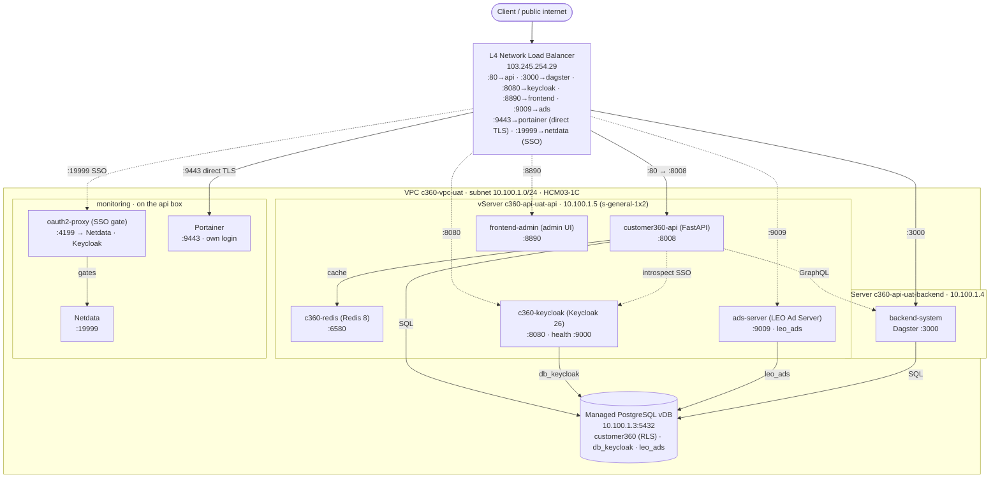

# Customer 360 — Deployments

Infrastructure-as-code + deploy scripts for the Customer 360 platform on
**GreenNode / VNG Cloud** (zone **HCM03-1C**). Each subfolder is a self-contained
deployment with per-env `overlays/<env>.tfvars`, Terraform workspaces, and a
`deploy.sh`-style wrapper.

| Folder | What it provisions |
|--------|--------------------|
| [`postgres`](./postgres) | Managed PostgreSQL vDB (`customer360` + `db_keycloak`), `run-sql.sh` schema/seed bootstrap |
| [`server`](./server) | vServers (VMs): api box + backend box (uat); adds dedicated `sso` + `frontend` + `ads` boxes (prod) |
| [`cache`](./cache) | Redis — uat: container on the api box; prod: managed MemStore |
| [`sso`](./sso) | Keycloak (SSO/OIDC) — uat: container on the api box; prod: dedicated vServer |
| [`frontend`](./frontend) | frontend-admin (admin UI) — uat: container on the api box; prod: dedicated vServer |
| [`ads-server`](./ads-server) | LEO Ad Server (schema `leo_ads`) — uat: container on the api box; prod: dedicated vServer |
| [`monitoring`](./monitoring) | Portainer (direct HTTPS) + Netdata (behind oauth2-proxy / Keycloak SSO) dashboards — on the api box |
| [`load_balancer`](./load_balancer) | L4 NLB fronting api / dagster / keycloak / frontend / ads / monitoring |
| [`proxy`](./proxy) | **Caddy** reverse proxy — TLS termination (auto Let's Encrypt) + single-host path routing (`beta.leocdp.com`). **Staged**: built + validated, not cut over — see its [runbook](./proxy/README.md#cutover-runbook-put-the-platform-behind-betaleocdpcom) |
| [`storage`](./storage) | Object storage (vStorage / S3) |

> **Scope:** this view shows the **UAT** overlay only. The prod overlay differs
> (dedicated boxes, managed MemStore, own VPC `10.101.0.0/16`) and will be added
> here once it is provisioned.

## UAT deployment view

📐 **Editable sources:** [`deployment-view-uat.excalidraw`](./deployment-view-uat.excalidraw)
(open at [excalidraw.com](https://excalidraw.com) or the Obsidian Excalidraw plugin) ·
[`deployment-view-uat.svg`](./deployment-view-uat.svg) (vector source of the image above).

Same view as a Mermaid diagram (editable text)

### Components (UAT)

| Component | Runs on | Port | Notes |
|-----------|---------|------|-------|
| L4 NLB | VNG vLB | 80 / 3000 / 8080 / 8890 / 9009 / 9443 / 19999 | public `103.245.254.29`; TCP passthrough (no TLS) |
| customer360-api | api box `10.100.1.5` | 8008 | FastAPI, `--network host`; Redis cache; SSO via Keycloak introspection (`SSO_LOGIN=true`) |
| c360-redis | api box `10.100.1.5` | 6580 | fail-open response cache; `maxmemory 256mb allkeys-lru` |
| c360-keycloak | api box `10.100.1.5` | 8080 | Keycloak 26 `start-dev`; health on mgmt `:9000`; realm `customer360` |
| frontend-admin | api box `10.100.1.5` | 8890 | FastAPI admin UI; browser calls the API/Keycloak via the LB |
| ads-server | api box `10.100.1.5` | 9009 | LEO Ad Server (FastAPI); own schema `leo_ads` (no RLS); reuses the local Redis |
| oauth2-proxy | api box `10.100.1.5` | 4199 | Keycloak SSO gate in front of Netdata (the L4 LB can't do OIDC) |
| Portainer | api box `10.100.1.5` | 9443 | container ops UI (logs/exec/restart); direct HTTPS on the LB — its own login |
| Netdata | api box `10.100.1.5` | 19999 | real-time host + per-container metrics; no native auth → oauth2-proxy SSO |
| Dagster | backend box `10.100.1.4` | 3000 | backend-system worker |
| PostgreSQL | managed vDB `10.100.1.3` | 5432 | `customer360` (FORCE RLS) + `db_keycloak` + `leo_ads` |

### Public endpoints (via the LB)

| Path | Endpoint |
|------|----------|
| frontend-admin (UI) | `http://103.245.254.29:8890` |
| customer360-api | `http://103.245.254.29:80` |
| ads-server | `http://103.245.254.29:9009` |
| Portainer (direct HTTPS, own login) | `https://103.245.254.29:9443` |
| Netdata (SSO) | `http://103.245.254.29:19999` |
| Dagster | `http://103.245.254.29:3000` |
| Keycloak | `http://103.245.254.29:8080` |

### Data flows

- **Client → LB → services** — the NLB forwards `:80→api:8008`, `:3000→dagster:3000`, `:8080→keycloak:8080`, `:8890→frontend:8890`, `:9009→ads:9009`.
- **Browser → frontend-admin** — loads the UI (`:8890`); its JS then calls the API + Keycloak from the browser via the LB.
- **api ⇄ keycloak (SSO)** — the API validates Bearer tokens by OIDC **introspection** against realm `customer360` (token needs a `tenant_id` claim + the client in its audience).
- **ads-server → postgres** — its own `leo_ads` schema (no RLS) in the same managed DB; also uses the co-located Redis (`127.0.0.1:6580`).
- **monitoring** — **Portainer** is exposed directly (`LB :9443 → Portainer :9443`, L4 TLS passthrough) and uses its own login. **Netdata** has no native auth, so `oauth2-proxy` gates it via Keycloak: `LB :19999 → oauth2-proxy :4199 → [Keycloak login] → Netdata :19999`. Both read the Docker socket for container discovery; no DB/Redis.
- **api → redis** — `127.0.0.1:6580` (co-located, `--network host`).
- **api → postgres** — private `10.100.1.3:5432`, database `customer360` (tenant-scoped via RLS).
- **api → dagster** — GraphQL at `10.100.1.4:3000`.
- **keycloak → postgres** — database `db_keycloak` on the same managed instance.

> ⚠️ UAT is HTTP-only (L4, no TLS) and the Keycloak admin console is publicly
> reachable — fine for testing, not for production. Prod should add a DNS name,
> TLS-terminating L7, and locked-down admin access.
