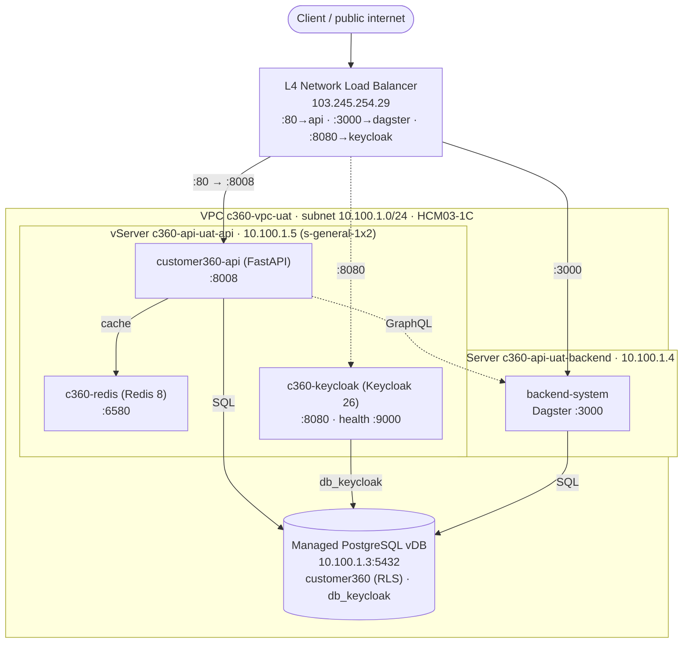

# Customer 360 — Deployments

Infrastructure-as-code + deploy scripts for the Customer 360 platform on
**GreenNode / VNG Cloud** (zone **HCM03-1C**). Each subfolder is a self-contained
deployment with per-env `overlays/<env>.tfvars`, Terraform workspaces, and a
`deploy.sh`-style wrapper.

| Folder | What it provisions |
|--------|--------------------|
| [`postgres`](./postgres) | Managed PostgreSQL vDB (`customer360` + `db_keycloak`), `run-sql.sh` schema/seed bootstrap |
| [`server`](./server) | vServers (VMs): the api box + backend box (uat); adds a dedicated `sso` box (prod) |
| [`cache`](./cache) | Redis — uat: container on the api box; prod: managed MemStore |
| [`sso`](./sso) | Keycloak (SSO/OIDC) — uat: container on the api box; prod: dedicated vServer |
| [`load_balancer`](./load_balancer) | L4 NLB fronting api / dagster / keycloak |
| [`storage`](./storage) | Object storage (vStorage / S3) |

> **Scope:** this view shows the **UAT** overlay only. The prod overlay differs
> (dedicated boxes, managed MemStore, own VPC `10.101.0.0/16`) and will be added
> here once it is provisioned.

## UAT deployment view

📐 **Editable sources:** [`deployment-view-uat.excalidraw`](./deployment-view-uat.excalidraw)
(open at [excalidraw.com](https://excalidraw.com) or the Obsidian Excalidraw plugin) ·
[`deployment-view-uat.svg`](./deployment-view-uat.svg) (vector source of the image above).

Same view as a Mermaid diagram (editable text)

### Components (UAT)

| Component | Runs on | Port | Notes |
|-----------|---------|------|-------|
| L4 NLB | VNG vLB | 80 / 3000 / 8080 | public `103.245.254.29`; TCP passthrough (no TLS) |
| customer360-api | api box `10.100.1.5` | 8008 | FastAPI, `--network host`; cache via Redis; auth dev-JWT (SSO optional) |
| c360-redis | api box `10.100.1.5` | 6580 | fail-open response cache; `maxmemory 256mb allkeys-lru` |
| c360-keycloak | api box `10.100.1.5` | 8080 | Keycloak 26 `start-dev`; health on mgmt `:9000` |
| Dagster | backend box `10.100.1.4` | 3000 | backend-system worker |
| PostgreSQL | managed vDB `10.100.1.3` | 5432 | `customer360` (FORCE RLS) + `db_keycloak` |

### Public endpoints (via the LB)

| Path | Endpoint |
|------|----------|
| customer360-api | `http://103.245.254.29:80` |
| Dagster | `http://103.245.254.29:3000` |
| Keycloak | `http://103.245.254.29:8080` |

### Data flows

- **Client → LB → services** — the NLB forwards `:80→api:8008`, `:3000→dagster:3000`, `:8080→keycloak:8080`.
- **api → redis** — `127.0.0.1:6580` (co-located, `--network host`).
- **api → postgres** — private `10.100.1.3:5432`, database `customer360` (tenant-scoped via RLS).
- **api → dagster** — GraphQL at `10.100.1.4:3000`.
- **keycloak → postgres** — database `db_keycloak` on the same managed instance.

> ⚠️ UAT is HTTP-only (L4, no TLS) and the Keycloak admin console is publicly
> reachable — fine for testing, not for production. Prod should add a DNS name,
> TLS-terminating L7, and locked-down admin access.
