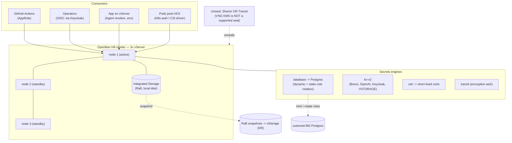
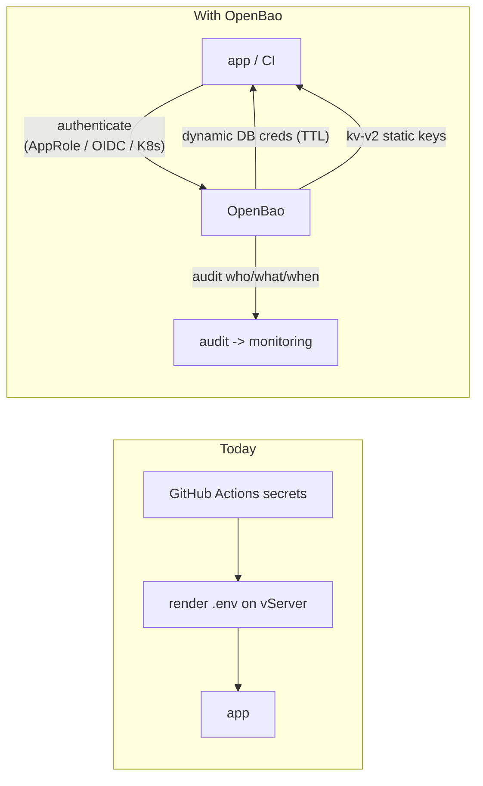
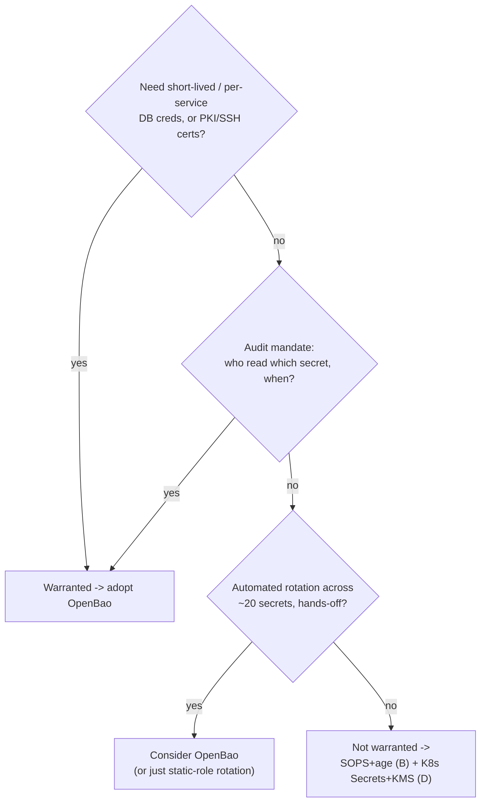

# Self-Hosted Vault / OpenBao for `customer360` — A Deep Investigation

> Deployment note · LEO CDP `leo-customer360` · 2026-09-23
> Expands §6.4 of [`vng-secrets-management.md`](./vng-secrets-management.md)
> ("Vault/OpenBao — only if warranted"). Reads on the assumption that VNG Cloud
> offers **no managed secrets service** (only KMS = keys), established in the
> parent report.
>
> ⚠️ Load-bearing external facts (licensing, supported unseal seals, engine
> support) were verified against multiple sources in Sep 2026 — see **Sources**.
> Product facts move; re-check before committing budget.

## 1. Verdict up front

A self-hosted vault is the only option in the parent report's menu that provides
**dynamic secrets, lease/TTL/revocation, automated rotation, a central read-audit
trail, and encryption/PKI-as-a-service**. SOPS+age (option B) and K8s Secrets +
KMS (option D) only ever protect *static secrets at rest*; they never generate,
lease, or audit them. That is the entire question: **do you need those verbs, or
just encryption at rest?**

For `customer360` **today the answer is "not yet"** — the current secret set is
~20 mostly-static third-party keys, and the higher-value fixes (harden the
vStorage tfstate bucket, SOPS+age, K8s Secrets after VKS) come first. Adopt a
vault when one of the §8 triggers actually fires — most likely **dynamic Postgres
credentials** or an **audit mandate**.

**When you do adopt it, choose OpenBao, not Vault** (§3), and budget for the one
VNG-specific sharp edge: **no native auto-unseal** (§5.2).

---

## 2. The precise gap — what only a vault gives you

| Capability | B · SOPS+age | D · K8s Secrets + KMS | Vault / OpenBao |
|---|---|---|---|
| Encrypt a **static** secret at rest | ✅ | ✅ | ✅ |
| **Dynamic** secrets (unique creds minted per consumer) | ❌ | ❌ | ✅ |
| **Lease / TTL / revocation** (creds expire, can be killed) | ❌ | ❌ | ✅ |
| **Automated rotation** (built-in, scheduled) | ❌ | ⚠️ manual/operator | ✅ |
| **Central read-audit** (who read which secret, when) | ❌ | ❌ | ✅ |
| **Encryption-as-a-service** (Transit — app never holds a key) | ❌ | ❌ | ✅ |
| **PKI / SSH** short-lived certificates | ❌ | ❌ | ✅ |
| Fine-grained **policy per path + identity** | ❌ | ⚠️ RBAC-ish | ✅ |

The four rows B and D can't do — dynamic, lease, audit, PKI — are the whole reason
to take on a vault's operational weight. If none of them is a real requirement, a
vault is ops cost without payoff.

---

## 3. Vault vs OpenBao — which to run

| | HashiCorp Vault | OpenBao |
|---|---|---|
| License | **BUSL-1.1** (since Aug 2023; converts to MPL-2.0 after 4 yrs) | **MPL-2.0** (fully OSI open) |
| Governance | **IBM** product (HashiCorp acquisition completed early 2025) | **Linux Foundation** (IBM engineers among contributors) |
| Origin | — | Fork of Vault **1.14.0** (last MPL release) |
| Compatibility | — | **Drop-in**: same API, CLI, secrets engines, auth methods |
| Current release | Vault 1.x (BUSL) | **2.5.0** (Feb 2026), production-ready |

**BUSL nuance (be precise):** BUSL permits internal production use. Its restriction
only bites if you offer a *competing hosted secrets-management service* — which
`customer360` does not. So Vault BUSL is *legally usable* here. The reason to still
pick **OpenBao** for a fresh self-hosted deployment is governance and freedom, not a
legal blocker: MPL-2.0, Linux-Foundation stewardship, no IBM commercial-licensing
pressure, and it is API-identical so there is no lock-in either way. **Recommendation:
OpenBao.**

**What you forgo without a paid tier (either product):** namespaces, HSM seal, DR/
performance replication, control groups (Enterprise-only). The community/OpenBao
core — kv, database, transit, pki, ssh, AppRole/OIDC/K8s auth, Raft HA, audit — is
sufficient for everything below.

---

## 4. Concrete fit to `customer360`'s real secrets

Mapping the actual inventory (from the parent report) to what a vault would do:

| Secret(s) | Vault/OpenBao treatment | Value |
|---|---|---|
| **`DB_PASSWORD`** (Postgres) | **database engine** — dynamic per-service creds with TTL, or static-role auto-rotation | 🟢 **Headline win.** Short-lived creds shrink blast radius on the golden-record DB |
| `REDIS_PASSWORD` | static-role rotation (kv-v2 + scheduled rotation) | 🟡 rotation + audit |
| `KEYCLOAK_ADMIN_PASSWORD`, `KEYCLOAK_CLIENT_SECRET` | kv-v2 (versioned) + rotation; **and** use Keycloak as an **OIDC auth method** *into* the vault | 🟢 synergy — you already run Keycloak |
| `LEO_OPENAI_API_KEY`, `DOCS_OPENAI_API_KEY`, `AGENT_API_TOKEN`, `BREVO_SMTP_*` | kv-v2 (third-party keys — no dynamic engine, but centralized + audited + versioned) | 🟡 audit + single source |
| `DEPLOY_SSH_KEY` | **ssh engine** — signed **short-lived SSH certs** instead of a static key | 🟢 strong upgrade |
| `VSTORAGE_ACCESS_KEY` / `SECRET_KEY` | kv-v2 — **but** these secure the tfstate bucket the vault may back up to → **bootstrap/circular dependency** (§6) | ⚠️ handle out-of-band |
| Terraform provider creds | Vault Terraform provider can source at apply time | ⚠️ values can still land in tfstate — not a full fix for the parent report's plaintext-state risk |

The single most compelling row is **dynamic Postgres credentials** — that is the
use case that makes a vault *earn* its keep for this platform.

---

## 5. Reference architecture on VNG

### 5.1 Topology

### 5.2 The VNG unseal problem (the sharp edge)

Vault/OpenBao auto-unseal supports only these seals: **AliCloud KMS, AWS KMS, Azure
Key Vault, GCP Cloud KMS, OCI KMS, Transit** (another vault), and **PKCS#11 HSM**
(Enterprise). **VNG KMS is not on that list**, and — unlike vStorage, which is
S3-*API*-compatible — VNG KMS is not AWS-KMS-*API*-compatible, so the `awskms` seal
cannot be pointed at it. Consequences:

- **(a) Shamir (manual):** operators unseal with N-of-M key shares on *every*
  restart. Simplest, but painful for reboots/autoscaling and blocks unattended
  recovery.
- **(b) Transit auto-unseal (recommended for hands-off ops):** a small second
  OpenBao holds a transit key; the main cluster auto-unseals against it. Adds one
  "bootstrap vault" to run and protect.
- **(c) PKCS#11 HSM:** needs a real HSM; not practical on VNG. Skip.

Pick (a) to start/learn (UAT), (b) for unattended prod.

### 5.3 Storage, auth, delivery, audit

- **Storage:** **Integrated Storage (Raft)** on local disk — the standard HA backend.
  Do **not** use vStorage S3 as the storage backend; snapshot Raft *to* vStorage for
  DR instead.
- **Auth methods:** **AppRole** for GitHub Actions CI/CD; **OIDC via Keycloak** for
  humans/services (reuses existing IdP); **Kubernetes auth** once VKS lands (pods
  authenticate with their service-account token).
- **Secret delivery:** **Agent templating** renders `.env` on the vServer (replaces
  the GH-Actions→`.env` render step); post-VKS, the **CSI Secrets Store driver**
  mounts secrets into pods.
- **Audit:** file/socket audit device → ship to the existing monitoring stack; alert
  on seal/policy events via the existing `telegram-cicd-notify` path.
- **TLS/exposure:** front with the existing Caddy LB or the vault's own PKI; never
  expose unsealed on a public interface.

### 5.4 Secret flow — before vs after

---

## 6. The honest downsides

1. **Bootstrap / circular dependency.** Something must unseal the vault and hold its
   root/recovery keys — and the vault may store the very `VSTORAGE_*` creds that back
   up its own state. A vault cannot secure its own bootstrap; you must keep a minimal
   break-glass path (offline unseal shares, or GH Actions) outside it.
2. **Availability coupling.** If the vault is sealed or down, deploys and app
   restarts that fetch secrets fail. HA + auto-unseal mitigate — at the cost of the
   Transit bootstrap vault (§5.2b).
3. **Standing ops burden.** Version upgrades, Raft backup/restore *drills*, unseal-key
   custody, TLS/cert rotation, policy sprawl. This is a permanent **Area**
   responsibility with an owner — not a one-off project. Without a named owner the
   vault becomes an unowned liability *more* dangerous than `.env`.
4. **Latency/complexity in the request path.** Agent/CSI caching is required so a
   vault round-trip isn't on every secret read.

---

## 7. Cost & effort

- **Compute:** 3× small vServers for HA (or 1× to start, accepting restart downtime)
  + 1 tiny node if using Transit auto-unseal.
- **People (the real cost):** ongoing secrets-ops. Compare to the status quo (GH
  Actions + `.env`), which is ~zero standing ops.
- **Licensing:** $0 (OpenBao MPL / Vault BUSL community). Paid tiers only for
  Enterprise features you don't need here.

---

## 8. Decision framework — is it warranted for `customer360`?

**Adopt when any of these is a real, current requirement:**

- **Dynamic / short-lived DB creds** for the Postgres golden record (per-service,
  auto-expiring) — the strongest trigger.
- **Audit mandate**: provable "who accessed which secret, when."
- **Automated rotation** across the ~20 secrets that you will not do reliably by hand.
- **Short-lived SSH/PKI certificates** replacing static keys (`DEPLOY_SSH_KEY`).

**Wait — SOPS+K8s is enough — when:**

- The secret set stays ~20 mostly-static third-party keys with low rotation need.
- No dedicated secrets-ops owner exists (a vault needs one).
- Pre-VKS: without Kubernetes auth, integration is clunkier (AppRole/Agent still
  works, but the ergonomics land after VKS).

**Current recommendation for `customer360`: not yet.** Do parent-report §6.1–6.3
first. Revisit OpenBao when (a) dynamic Postgres creds become a requirement, (b) an
audit mandate lands, or (c) post-VKS, when K8s auth + CSI make integration cheap.

---

## 9. Migration sketch (if/when the trigger fires)

1. **Pilot (UAT):** single-node OpenBao, Shamir unseal, Raft storage. Put 2–3 static
   keys in `kv-v2`; wire **one** GitHub Actions workflow via AppRole. Learn the ops.
2. **First dynamic win:** enable the **database engine** against UAT Postgres; issue
   dynamic creds to one service; watch lease/rotation/audit.
3. **Rotation + audit:** turn on static-role rotation for `REDIS_PASSWORD` /
   Keycloak; ship the audit device to monitoring.
4. **Prod:** 3-node Raft HA + **Transit auto-unseal**; OIDC (Keycloak) for operators;
   Agent-render `.env`. Snapshot Raft → vStorage; run a restore drill.
5. **Post-VKS:** switch workloads to Kubernetes auth + CSI driver; retire on-server
   `.env`.

---

## 10. Conclusion

A self-hosted OpenBao is a *powerful* tool aimed at four verbs — **generate, lease,
audit, rotate** — that neither SOPS nor K8s Secrets can offer. For `customer360`
those verbs aren't required *today*, so the vault would be ops cost without payoff,
exactly as the parent report said. The moment that changes — most plausibly the day
short-lived Postgres credentials or an audit trail becomes a real requirement — the
path is clear: **OpenBao** (MPL, drop-in), **Raft HA on vServers**, **Transit
auto-unseal** (because VNG KMS can't seal it), **AppRole/OIDC/K8s auth**, and a named
owner for the standing operational load. Start in UAT with a single node and the
database engine against one service; let the dynamic-secret win justify the rest.
