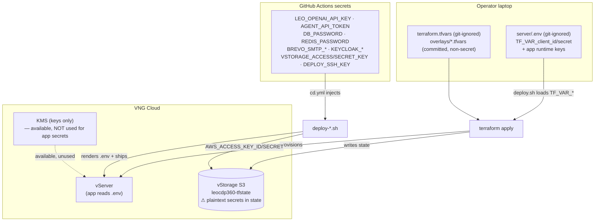
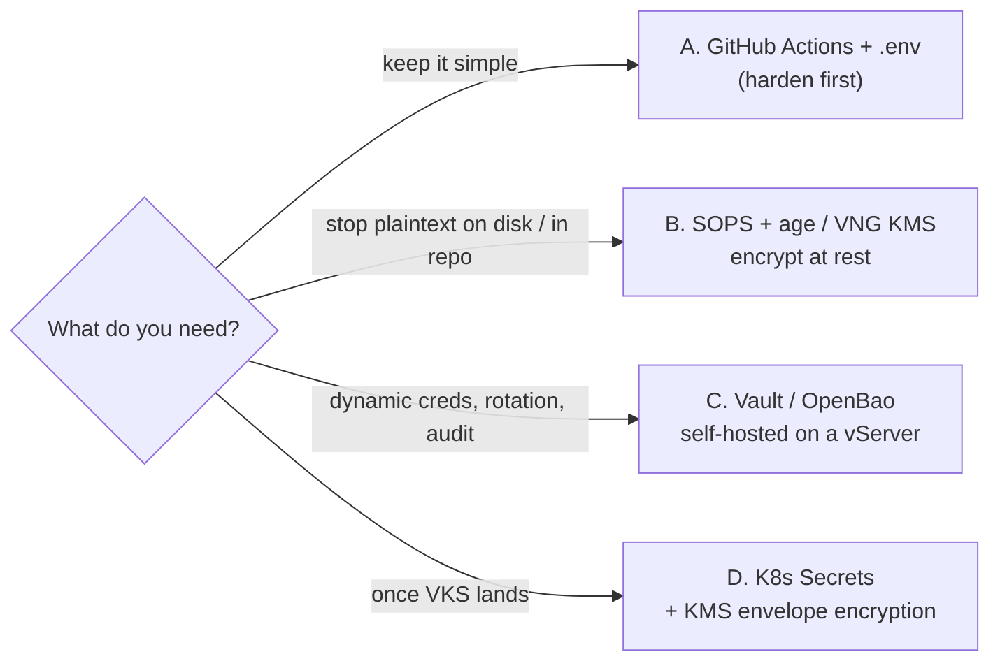

# VNG Cloud Secrets & Configuration Management — Current State and Options

> Deployment note · LEO CDP `leo-customer360` · 2026-09-23
> Scope: how config **variables** and **secrets** are handled across the VNG
> Cloud deployment today, the gaps, and the realistic options — given that VNG
> Cloud offers **no managed secrets/parameter service**.

## 1. TL;DR

- **VNG Cloud has no secrets manager and no parameter store.** Its only related
  managed service is **KMS** (Key Management System), which handles *encryption
  keys* — not arbitrary secrets or config values. (Verified against
  `docs.greennode.ai`; see §2.)
- Today `customer360` spreads config + secrets across **three** places:
  1. gitignored **`.env` files** — Terraform provider auth (`TF_VAR_*`) and app
     runtime keys, on the operator laptop / vServer;
  2. **GitHub Actions secrets** (~20) — the de-facto source of truth for CI/CD;
  3. **Terraform remote state** on VNG **vStorage** — which *may hold secrets in
     plaintext* (the module `.gitignore` says so explicitly).
- **Recommendation:** keep GitHub Actions as the secret source of truth, **harden
  the vStorage tfstate first** (private + encrypted-at-rest), adopt **SOPS + age**
  for any secret that must live on disk or in-repo, and fold secrets into **K8s
  Secrets + KMS envelope encryption** when the VKS migration lands
  (`deployments/docs/vks-migration-technical-analysis.md`). Stand up Vault/OpenBao
  only if you need dynamic/short-lived credentials.

---

## 2. What VNG Cloud offers (and doesn't)

| Capability | AWS analog | GCP analog | VNG Cloud |
|---|---|---|---|
| Store **secrets** (API keys, passwords) | Secrets Manager | Secret Manager | ❌ none |
| Store **config variables** | SSM Parameter Store | Parameter Manager | ❌ none |
| Manage **encryption keys** | KMS | Cloud KMS | ✅ **KMS** (Customer-Managed Keys; symmetric/asymmetric; key import) |
| Instance login keys | EC2 key pairs | OS Login / SSH keys | ✅ vServer SSH key pairs + Security Groups |

KMS gives you the *envelope-encryption primitive* (a key to encrypt/decrypt with);
it does **not** store the secret values themselves. So on VNG you always bring your
own store for the actual values — which is exactly what this project does today.

> Verification caveat: KMS existence is well-corroborated (dedicated docs page +
> search). The *absence* of a secrets/parameter service is "not present in current
> public docs" — confirm in the VNG console before treating it as final.

---

## 3. How `customer360` handles config + secrets today

### 3.1 Terraform provider auth — vIAM service account

`deployments/server/.env` (git-ignored) holds the vIAM **service account**
credentials as `TF_VAR_*` variables; `deploy.sh` auto-loads the file so Terraform
populates the matching inputs used by `provider.tf`:

```
TF_VAR_client_id=...        # vIAM service account
TF_VAR_client_secret=...    # shown ONCE at creation — bus-factor risk
TF_VAR_ssh_public_key=...   # optional
TF_VAR_user_password=...    # optional
```

Platform endpoints (`TF_VAR_token_url`, `*_base_url`) are **non-secret** and default
in `variables.tf`.

### 3.2 Application runtime secrets — `.env` on the vServer

App containers read secrets from `.env` files delivered to the vServer by the
`deploy-*.sh` scripts. SMTP shows the intended split:

- `smtp.uat.env` — **committed, non-secret** (host, port, sender);
- `smtp.*.local.env` — **git-ignored, secret** (SMTP password).

### 3.3 CI/CD — GitHub Actions secrets (de-facto source of truth)

`.github/workflows/cd.yml` (and siblings) inject the real secret values at deploy
time. The current inventory:

```
LEO_OPENAI_API_KEY   AGENT_API_TOKEN        DOCS_OPENAI_API_KEY   DOCS_INTERNAL_AUTH_SECRET
DB_PASSWORD          REDIS_PASSWORD         KEYCLOAK_ADMIN_PASSWORD  KEYCLOAK_CLIENT_SECRET
BREVO_SMTP_LOGIN     BREVO_SMTP_PASSWORD    BREVO_SMTP_KEY        BREVO_SENDER_EMAIL
VSTORAGE_ACCESS_KEY  VSTORAGE_SECRET_KEY    DEPLOY_SSH_KEY        PORTAINER_ADMIN_PASSWORD
KC_TEST_USER_PASSWORD  TELEGRAM_BOT_TOKEN   TELEGRAM_CHAT_ID     GITHUB_TOKEN
```

These are rendered into on-server `.env` files and used to authenticate to vStorage,
the DB, Keycloak, Brevo (SMTP), the LLM provider, GHCR, etc.

### 3.4 Terraform remote state — VNG vStorage (S3-compatible)

State lives in the vStorage bucket **`leocdp360-tfstate`**
(`hcm04.vstorage.vngcloud.vn`), workspace-per-env, reached with
`AWS_ACCESS_KEY_ID` / `AWS_SECRET_ACCESS_KEY` (the `VSTORAGE_*` secrets).
**⚠ Terraform state can contain secrets in plaintext** — the module `.gitignore`
notes this and ignores all local `*.tfstate`. The remote bucket is therefore a
secret-bearing asset and must be treated as one.

### 3.5 `.gitignore` discipline

Ignored (secret): `terraform.tfvars`, `*.auto.tfvars`, `*.tfvars.json`, `.env`,
`smtp.*.local.env`, all `*.tfstate*`.
Committed (non-secret, intentional): `overlays/*.tfvars`.

### 3.6 The picture



---

## 4. Risks & gaps

1. **Plaintext secrets in remote state.** `leocdp360-tfstate` on vStorage holds
   whatever Terraform captured — DB passwords, generated creds. Bucket ACL and
   at-rest encryption are load-bearing security controls, not nice-to-haves.
2. **Secret sprawl / duplication.** The same value can exist in GitHub Actions
   **and** an on-server `.env` **and** tfstate. Three copies, three rotation points.
3. **No rotation or central audit.** GitHub Actions is a store, not a manager — no
   built-in rotation, leasing, versioning history, or per-access audit trail.
4. **Secrets persist on disk.** Rendered `.env` files sit on the vServer for the
   process lifetime; anyone with host access reads them.
5. **Single-shot vIAM secret.** `TF_VAR_client_secret` is shown once at creation —
   losing it means regeneration; storing it only in one laptop `.env` is fragile.

---

## 5. Options (given no managed VNG service)

| Option | What it adds | Effort | When |
|---|---|---|---|
| **A. Status quo** — GitHub Actions + `.env` | Nothing new; centralize in GH | — | Keep as baseline; harden first (§6.1) |
| **B. SOPS + age (or VNG KMS)** | Encrypt secrets **at rest** in-repo / on-disk; git-friendly, reviewable, per-env | Low–Med | To kill plaintext `.env`/local-env sprawl |
| **C. Self-hosted Vault / OpenBao** on a vServer | Full secrets manager: dynamic secrets, leasing, rotation, audit, fine-grained policy | High (ops) | Only if you need dynamic/short-lived creds |
| **D. K8s Secrets + KMS envelope encryption** | Native secret objects, encrypted at rest via a **KMS provider → VNG KMS** | Med | After the **VKS migration** |



Note: options compose. B is a cheap upgrade over A now; D becomes natural after the
VKS migration; C is only worth its ops cost for genuine dynamic-secret needs.

---

## 6. Recommendation (sequenced)

### 6.1 Harden what exists (do first — cheap, high value)
- Make **`leocdp360-tfstate`** private; enable **at-rest encryption** (KMS CMK) on
  the bucket; restrict the `VSTORAGE_*` keys to least privilege on that bucket.
- **Rotate** the vIAM service-account secret and store the canonical copy in GitHub
  Actions (not only a laptop `.env`).
- Audit that **no secret is committed** (CI check: block `.env`, `*.tfvars`,
  `smtp.*.local.env`, `*.tfstate`).

### 6.2 Adopt SOPS + age for at-rest secrets (near term)
Encrypt any secret that must sit on disk or in the repo (SMTP local env, seed
material). Keeps the git-friendly workflow, removes plaintext-on-disk. Optionally
back the SOPS key with **VNG KMS** so key custody is managed.

### 6.3 Fold into the VKS migration (medium term)
When `deployments/docs/vks-migration-technical-analysis.md` proceeds, move runtime
secrets to **Kubernetes Secrets** with **envelope encryption via a KMS provider
pointed at VNG KMS** — the closest VNG-native secret handling available, and it
retires the on-server `.env` files.

### 6.4 Vault/OpenBao — only if warranted
Stand up a self-hosted vault **only** when you need dynamic secrets (short-lived DB
creds), automated rotation, or a central audit trail that B+D can't provide. Until
then it's ops cost without payoff.

---

## 7. Conclusion

VNG Cloud gives you the *key* (KMS) but never the *vault* — there is no managed
place to put secret values, so this project correctly keeps GitHub Actions as the
source of truth and renders `.env` on the vServer. The gaps are concentrated in two
places: **plaintext secrets in remote state** and **secret sprawl across three
stores**. Fixing those needs no new product — harden the vStorage state bucket, add
SOPS+age for at-rest secrets, and let the VKS migration carry runtime secrets into
K8s Secrets + KMS envelope encryption. Reserve a self-hosted Vault for the day
dynamic credentials actually earn its operational cost.
