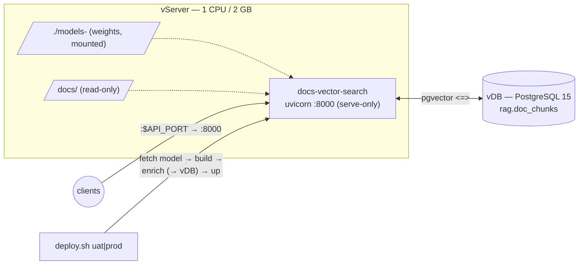

# Document Vector Search — vServer deployment (UAT + PROD)

Runs the [`docs-vector-search`](../../tools/docs-vector-search) service — **local-model**
Graph-RAG (e5 embed + bge rerank + Qwen 0.5B generate) with vectors in **pgvector on
the vDB** — on a vServer via Docker Compose. **1 CPU / 2 GB RAM**, same for UAT and PROD.



## Prerequisites (on the vServer)
- Docker Engine + **Docker Compose v2**; the repo checked out.
- The **vDB** reachable, with the **`vector` extension** available. Apply [`sql/schema.sql`](sql/schema.sql) to each env's vDB once (e.g. via `../postgres/run-sql.sh`), or let `enrich` create it if the DB user may `CREATE EXTENSION`.
- Outbound access to Hugging Face on first deploy (to fetch the Qwen GGUF + fastembed ONNX models).

## Deploy

```bash
cd deployments/docs-vector-search
cp .env.uat.example .env.uat      # set PG_* (the UAT vDB) + tune models
cp .env.prod.example .env.prod    # set PG_* (the PROD vDB)

./deploy.sh uat                   # UAT  → http://<host>:8081
./deploy.sh prod                  # PROD → http://<host>:8080
```

`deploy.sh` copies `.env.<env>` → `.env`, fetches the Qwen model into `./models-<env>`,
builds the image, **builds/refreshes the index** (`docker compose run … python -m src.enrich`
— chunk → embed → upsert into the vDB), then starts a **serve-only** container. Splitting
the index build from serving keeps startup fast and the healthcheck green.

## Endpoints

| Endpoint | Body | Returns |
|----------|------|---------|
| `POST /ask` | `{question, top_n?, top_k?}` | grounded answer + cited sources |
| `POST /search` | `{query, top_n?}` | reranked chunks (no generation) |
| `GET /health` | — | chunk count, models |

## UAT vs PROD

| | UAT | PROD |
|---|-----|------|
| Compose project | `docs-vector-search-uat` | `docs-vector-search-prod` |
| Host port | `8081` | `8080` |
| vDB | UAT PostgreSQL 15 | PROD PostgreSQL 15 |
| Model weights | `./models-uat` | `./models-prod` |
| Resources | 1 CPU / 2 GB | 1 CPU / 2 GB |

## Notes & RAM

- e5 (~500 MB) + reranker (~300 MB) + Qwen 0.5B (~600 MB) ≈ **1.4 GB** resident — tight on 2 GB. Add a **swapfile** on the host, or set `RERANK_ENABLED=false` in `.env.<env>` to shed ~300 MB first. Vectors live in the vDB, off the app box.
- The vDB password is only in `.env.<env>` (gitignored) — mirror it from your secrets manager; never commit it.
- Embedding model change → update `EMBED_DIM` and recreate `rag.doc_chunks` (the `vector(N)` column is fixed-width).
- Refresh the index after `docs/**` changes: re-run `./deploy.sh <env>`.
- Logs: `docker logs -f docs-vector-search-<env>`. Stop: `docker compose -p docs-vector-search-<env> down`.
