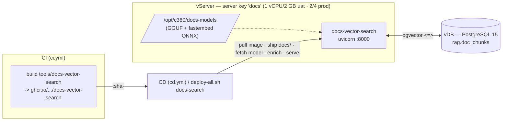

# Document Vector Search — deployment (UAT + PROD)

Runs the [`docs-vector-search`](../../tools/docs-vector-search) service — **local-model**
RAG (e5 embed + bge rerank + Qwen 0.5B generate) with vectors in **pgvector on the vDB**
— on its **own dedicated vServer**, deployed through the **main CI/CD** like every other
service. Vectors live in the shared vDB (schema `rag`), off the app box.



## How it deploys (CI/CD)

- **CI** (`.github/workflows/ci.yml`) builds `tools/docs-vector-search/Dockerfile` and, on
  `main`/tags, pushes `ghcr.io/leo-cdp/leo-customer360/docs-vector-search:sha-<commit>`.
- **CD** (`.github/workflows/cd.yml`) runs `deploy-all.sh <env> --only …,docs-search`, which
  calls [`deploy.sh`](deploy.sh). It resolves the `docs` box from `../server` outputs, pulls
  the image from GHCR, ships `docs/`, fetches the Qwen GGUF onto the box, runs **`enrich`**
  (chunk → embed → upsert into `rag.doc_chunks`; creates the schema + `vector` extension
  idempotently), then starts a **serve-only** container and health-checks `:8000`.
- **Index refresh:** every CD deploy re-runs `enrich` (content-hash idempotent — unchanged
  docs re-embed nothing). A **docs-only** change on `main` (path-ignored by CI) is covered by
  the **Docs Vector Refresh** workflow, which dispatches a `docs-search` CD deploy.

## Prerequisites (one-time, out-of-band)

CD never provisions infra, so before the first deploy:

1. **The `docs` vServer** — add the `docs` server key to [`../server/overlays/<env>.tfvars`](../server)
   (already defined) and `terraform apply` the `server` module. Until it exists, the
   `docs-search` step **skips** (warns, exits 0) so it never reddens CD.
2. **The vDB `vector` extension** must be available to the app DB user (managed Postgres often
   allowlists it) — `enrich` runs `CREATE EXTENSION IF NOT EXISTS vector` on first connect.
3. **Config** lives in [`overlays/<env>.tfvars`](overlays); DB creds resolve from `../postgres`
   outputs + `TF_VAR_db_password`. No `.env` is needed for CD.

## Manual deploy / rollback

```bash
cd deployments/docs-vector-search
../deploy-all.sh uat --only docs-search        # via the orchestrator, or directly:
./deploy.sh uat                                # (re)deploy + re-enrich
./deploy.sh uat destroy                        # remove the container
IMAGE_TAG=sha-<git> ./deploy.sh prod           # pin an immutable tag (rollback)
BUILD_LOCAL=1 ./deploy.sh uat                  # build on the VM instead of pulling GHCR (slow)
```

Or roll back through the CD form: **Actions → CD → Run workflow** with
`environment`, `image_tag` (an immutable `sha-<git>` / `vX.Y.Z`), `services=docs-search`.

## Endpoints

| Endpoint | Body | Returns |
|----------|------|---------|
| `POST /ask` | `{question, top_n?, top_k?}` | grounded answer + cited sources |
| `POST /search` | `{query, top_n?}` | reranked chunks (no generation) |
| `GET /health` | — | chunk count, models |

## UAT vs PROD

| | UAT | PROD |
|---|-----|------|
| Box (server key `docs`) | `s-general-1x2` (1 vCPU / 2 GB) | `s2-general-2x4` (2 vCPU / 4 GB) |
| Image tag | `sha-<commit>` (auto UAT) | `vX.Y.Z` (release) |
| vDB | UAT PostgreSQL 15, schema `rag` | PROD PostgreSQL 15, schema `rag` |
| Reranker | on (drop if 2 GB tight) | on |

## Notes & RAM

- e5 (~500 MB) + reranker (~300 MB) + Qwen 0.5B (~600 MB) ≈ **1.4 GB** resident. UAT's 2 GB is
  tight — `deploy.sh` adds a **2 GB swapfile** on the box; set `docs_rerank_enabled=false` in
  the overlay to shed ~300 MB first. Vectors live in the vDB, off the app box.
- Model weights are fetched once into `/opt/c360/docs-models` and reused across deploys.
- Embedding-model change → update `docs_embed_dim` and recreate `rag.doc_chunks` (the
  `vector(N)` column is fixed-width).
- Logs: `docker logs -f customer360-docs-vector-search`.

## Local development (no vServer)

For a laptop run, use Docker Compose against any pgvector Postgres:

```bash
cp .env.uat.example .env      # set PG_* + model paths
docker compose up             # see docker-compose.yml
```
