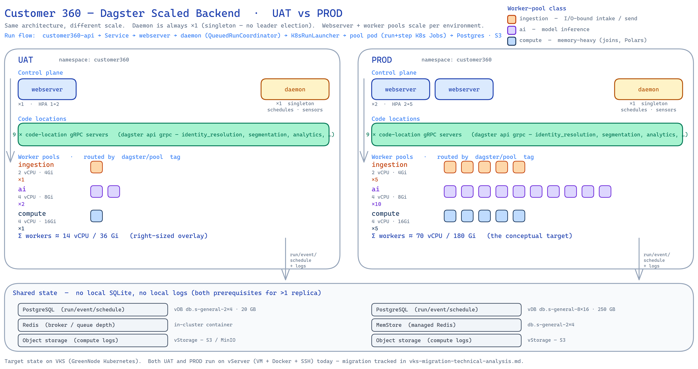

# Customer 360 — Scaling the Dagster Backend (Orchestrator + Worker Pools)

> **Status:** research / decision-support · **Date:** 2026-09-03 · **Scope:** `backend-system/` (Dagster) on VKS, UAT + PROD
> **Platform:** GreenNode / VNG Cloud VKS — see [`vks-target-architecture.svg`](./vks-target-architecture.svg)
> **Companions:** [`vks-migration-technical-analysis.md`](./vks-migration-technical-analysis.md) · [`vks-cost-analysis.md`](./vks-cost-analysis.md)
> **Source of truth for today's shape:** [`../../backend-system/deployment.md`](../../backend-system/deployment.md) · [`../../k8s/base/dagster.yaml`](../../k8s/base/dagster.yaml)

This document turns the conceptual target below into a concrete Dagster production
topology, explains **why the current single-pod `dagster dev` cannot be scaled as-is**,
and gives the component-by-component changes, manifests, capacity/cost footprint, and a
phased rollout.

```yaml
# Conceptual deployment (the ask)
dagster-webserver: { replicas: 2 }
dagster-daemon:    { replicas: 1 }
workers:
  ingestion: { replicas: 5,  cpu: 2, memory: 4Gi }
  ai:        { replicas: 10, cpu: 4, memory: 8Gi }
  compute:   { replicas: 5,  cpu: 4, memory: 16Gi }
```

---

## 1. TL;DR

- **The conceptual model is the standard Dagster production topology**, but three of its
  pieces don't exist yet and one hard prerequisite is missing:
  1. **Storage must move SQLite → PostgreSQL first.** You *cannot* run 2 webserver replicas
     **and** a separate daemon against the current SQLite file on a `ReadWriteOnce` PVC.
     Multiple processes need **shared** run/event/schedule storage. This is blocker #0.
  2. **`dagster dev` must be split** into a `dagster-webserver` Deployment (N replicas,
     stateless) and a `dagster-daemon` Deployment (**exactly 1 replica** — no leader election).
  3. **The "workers" become a run launcher + executor with concurrency queues**, not a magic
     new kind of pod. The fixed pools `ingestion / ai / compute` map cleanly to **either**
     Celery worker Deployments per queue (fixed replicas — matches the ask 1:1) **or**
     ephemeral per-run/per-step K8s Jobs (elastic — the modern default). See §6, the core decision.
- **Compute logs must move to S3/MinIO** (already in the stack). Local-PVC logs break the moment
  there is more than one webserver replica.
- **The daemon is the singleton.** Two daemons = duplicate schedule/sensor ticks = duplicate runs.
  The webserver is stateless and scales freely; the daemon does not.
- **The pools are provisioning *ahead* of real load.** Today only `identity_resolution`,
  `segmentation`, and `analytics` do real work; the other six code locations are runnable
  **placeholders**. The `ai` pool at `10 × 4 vCPU/8Gi = 40 vCPU` is aspirational capacity —
  right-size it to actual queue depth and roll it out in phases (§9).
- **Footprint is large:** the three pools alone request **≈ 70 vCPU / 180 Gi** if always-on
  (vs. today's single ~1 vCPU / 2.5 Gi pod). Prefer **scale-to-floor + KEDA** or **ephemeral
  run pods** so you pay for depth, not for idle replicas (§8, §10).

---

## 2. Current state (baseline)

From [`k8s/base/dagster.yaml`](../../k8s/base/dagster.yaml) and
[`backend-system/deployment.md`](../../backend-system/deployment.md):

| Aspect | Today |
|---|---|
| Process model | **one** `dagster dev -w workspace.yaml` pod = webserver **+** daemon **+** in-process gRPC subprocess per code location |
| Replicas | `1`, `strategy: Recreate` (single-writer volume) |
| Code locations | **9** loaded in-process from `workspace.yaml` (7 gRPC subprocs on the small overlay) |
| Run/event/schedule storage | **SQLite** under `DAGSTER_HOME` on a **1Gi RWO PVC** |
| Run launcher | **`DefaultRunLauncher`** — the whole run executes in a subprocess **on the daemon/code-location pod** |
| Executor | in-process / multiprocess — **no isolation, no per-op scaling** |
| Compute logs | local filesystem under the PVC |
| Resource envelope (local overlay) | `requests 250m/512Mi`, `limits 1 vCPU / 2560Mi` |

Implemented work vs. placeholders (from `deployment.md`):

| Code location | Status | Data engine |
|---|---|---|
| `identity_resolution` | **implemented** — CIR batch-drain job + poll sensor | in-memory join |
| `segmentation` | **implemented** — recompute job + poll sensor | Polars |
| `analytics` | **implemented** — hourly tracking-log aggregation + schedule | Polars |
| `scoring`, `personalization`, `campaign_activation`, `email_engine`, `notification_engine`, `data_synch` | **placeholder** jobs (runnable skeletons) | — |

**Why this cannot just get `replicas: 2`:** SQLite has one writer, the PVC is `ReadWriteOnce`,
and `dagster dev` is explicitly a **development** launcher that co-locates the webserver and
daemon. Bumping replicas would give two daemons fighting over one SQLite file → duplicate
sensor/schedule ticks, DB-lock errors, and split run history.

---

## 3. Target topology

The conceptual pieces map onto real Dagster components as follows:

| Conceptual | Real Dagster component | Cardinality rule |
|---|---|---|
| `dagster-webserver ×2` | `dagster-webserver` Deployment behind a Service | **stateless → N replicas OK**, front with HPA |
| `dagster-daemon ×1` | `dagster-daemon` Deployment | **must be exactly 1** (runs schedules, sensors, run queue, run monitoring) |
| `workers: ingestion/ai/compute` | run launcher + executor **queues** (Celery workers *or* K8s Jobs) | fixed replicas (Celery) **or** elastic per-run pods (K8s) |
| (implicit) | **9 code-location gRPC servers** (`dagster api grpc`) | 1 Deployment per location, independent deploy/scale |
| (implicit) | **PostgreSQL** run/event/schedule storage | shared; the managed vDB already runs |
| (implicit) | **S3/MinIO** compute-log storage | shared; MinIO already in the stack |

The same topology runs in both environments — **only the scale differs** (webserver replicas
and the `ingestion / ai / compute` pool sizes). The daemon is a singleton in both. UAT runs a
right-sized overlay (`1 / 2 / 1`); PROD runs the conceptual target (`5 / 10 / 5`):



📐 **Editable sources:** [`dagster-scaling-topology.excalidraw`](./dagster-scaling-topology.excalidraw)
(open at [excalidraw.com](https://excalidraw.com) or the Obsidian Excalidraw plugin) ·
[`dagster-scaling-topology.svg`](./dagster-scaling-topology.svg) (vector source of the image above).

> The worker pools are drawn as **stacks of pod-squares**, one square per replica, so PROD's
> `5 / 10 / 5` reads as visibly denser than UAT's `1 / 2 / 1` — the whole point of the diagram is
> *same architecture, different scale*. Shared state (Postgres · object storage · Redis/MemStore)
> lives **outside** the cluster and is the hard prerequisite for running more than one replica (§4).

---

## 4. Prerequisite #0 — move storage to PostgreSQL (do this first)

Everything else depends on **shared** storage. Point the Dagster instance
(`$DAGSTER_HOME/dagster.yaml`) at the managed Postgres the platform already runs.

```yaml
# $DAGSTER_HOME/dagster.yaml  (baked into the image or mounted as a ConfigMap)
storage:
  postgres:
    postgres_db:
      username:   { env: DAGSTER_PG_USER }
      password:   { env: DAGSTER_PG_PASSWORD }
      hostname:   { env: DAGSTER_PG_HOST }
      db_name:    { env: DAGSTER_PG_DB }      # e.g. a dedicated `dagster` DB or schema
      port:       5432

# Compute logs off local disk → object storage (MinIO / vStorage S3)
compute_logs:
  module: dagster_aws.s3.compute_log_manager
  class: S3ComputeLogManager
  config:
    bucket:            { env: DAGSTER_LOGS_BUCKET }
    prefix: dagster-compute-logs
    endpoint_url:      { env: S3_ENDPOINT_URL }   # MinIO endpoint
    skip_empty_files:  true
```

Notes:
- Use a **dedicated `dagster` database** (or at least schema) on the vDB — don't co-mingle with
  the `customer360` app tables. Dagster creates/migrates its own tables (`dagster instance migrate`).
- Add `psycopg2-binary` + `dagster-postgres` + `dagster-aws` to the image (psycopg2 is already installed).
- Once storage is Postgres-backed and logs are S3-backed, the `dagster-home` **PVC is no longer
  shared state** — it becomes disposable per pod (or removed entirely).

---

## 5. Split `dagster dev` → webserver (N) + daemon (1)

`dagster dev` is a dev convenience. In production run two commands as two Deployments, both
pointed at the **same** `workspace.yaml` (now referencing gRPC servers, §7) and the **same**
Postgres instance.

```yaml
# webserver — stateless, scale freely
apiVersion: apps/v1
kind: Deployment
metadata: { name: dagster-webserver, labels: { app: dagster, role: webserver } }
spec:
  replicas: 2
  selector: { matchLabels: { app: dagster, role: webserver } }
  template:
    metadata: { labels: { app: dagster, role: webserver } }
    spec:
      containers:
        - name: webserver
          image: customer360-dagster:<tag>
          command: ["dagster-webserver", "-w", "workspace.yaml", "-h", "0.0.0.0", "-p", "3000"]
          ports: [{ containerPort: 3000, name: http }]
          envFrom:
            - configMapRef: { name: c360-config }
            - secretRef:    { name: c360-secrets }
          readinessProbe: { httpGet: { path: /server_info, port: 3000 }, initialDelaySeconds: 15, periodSeconds: 10 }
          resources: { requests: { cpu: 250m, memory: 512Mi }, limits: { cpu: "1", memory: 1Gi } }
---
# daemon — the SINGLETON. schedules, sensors, run queue, run monitoring.
apiVersion: apps/v1
kind: Deployment
metadata: { name: dagster-daemon, labels: { app: dagster, role: daemon } }
spec:
  replicas: 1                 # NEVER >1 — no leader election; duplicates ticks/runs
  strategy: { type: Recreate }
  selector: { matchLabels: { app: dagster, role: daemon } }
  template:
    metadata: { labels: { app: dagster, role: daemon } }
    spec:
      containers:
        - name: daemon
          image: customer360-dagster:<tag>
          command: ["dagster-daemon", "run", "-w", "workspace.yaml"]
          envFrom:
            - configMapRef: { name: c360-config }
            - secretRef:    { name: c360-secrets }
          resources: { requests: { cpu: 250m, memory: 512Mi }, limits: { cpu: "1", memory: 1Gi } }
```

The existing `Service` (port 3000) now selects `role: webserver` only. Front it with an HPA on
CPU/QPS (§8). The daemon has no Service (it opens no inbound port).

---

## 6. The core decision — how "workers" actually execute

The conceptual `workers` block is **execution capacity**. Dagster offers two production shapes;
pick per operability vs. elasticity. **Both** require the `QueuedRunCoordinator` (§6.3) to honor
per-pool concurrency caps.

### 6.1 Option A — Celery worker pools (fixed replicas — matches the ask 1:1)

`celery_k8s_job_executor` with a broker (Redis, already in the stack). Each pool is a long-lived
**Celery worker Deployment** subscribed to a named queue; steps are routed by tag. `replicas` is
a real, literal thing here.

```yaml
# one Deployment per pool; shown: the `ai` pool
apiVersion: apps/v1
kind: Deployment
metadata: { name: dagster-worker-ai, labels: { app: dagster, role: worker, pool: ai } }
spec:
  replicas: 10
  selector: { matchLabels: { pool: ai } }
  template:
    metadata: { labels: { app: dagster, role: worker, pool: ai } }
    spec:
      nodeSelector: { c360.pool: ai }          # land on the ai node pool
      containers:
        - name: worker
          image: customer360-dagster:<tag>
          command: ["dagster-celery", "worker", "start", "-q", "ai", "-A", "dagster_celery_k8s.app"]
          envFrom: [{ configMapRef: { name: c360-config } }, { secretRef: { name: c360-secrets } }]
          resources: { requests: { cpu: "4", memory: 8Gi }, limits: { cpu: "4", memory: 8Gi } }
```

Repeat for `ingestion` (replicas 5, `2 vCPU/4Gi`, `-q ingestion`) and `compute`
(replicas 5, `4 vCPU/16Gi`, `-q compute`). Jobs choose a queue via tag (§7.1).

- **Pros:** fixed, predictable pools; the ask maps literally; warm workers (no per-run pod cold start).
- **Cons:** you run (and pay for) `5+10+5 = 20` always-on pods even when idle; extra moving parts
  (broker + result backend). Mitigate idle cost with **KEDA** scaling each worker Deployment on
  broker queue length (floor 1, ceiling = the numbers above).

### 6.2 Option B — K8s-native ephemeral runs (elastic — modern default) — **recommended**

`K8sRunLauncher` + `k8s_job_executor`: each **run** becomes a K8s Job, each **op/step** becomes a
K8s Job. Pods are created on demand and torn down; the cluster autoscaler grows/shrinks the node
pools. There are **no fixed worker replicas** — the `ingestion/ai/compute` numbers become
**node-pool + concurrency ceilings** instead of standing pods.

- Translate the ask like this:

  | Pool | "replicas × size" (the ask) | K8s-native interpretation |
  |---|---|---|
  | ingestion | 5 × 2 vCPU/4Gi | node pool `ingestion`, autoscale 0→~5 nodes; queue concurrency 5 |
  | ai | 10 × 4 vCPU/8Gi | node pool `ai`, autoscale 0→~10 nodes; queue concurrency 10 |
  | compute | 5 × 4 vCPU/16Gi | node pool `compute`, autoscale 0→~5 nodes; queue concurrency 5 |

- **Pros:** pay for depth not idles (scale-to-zero between runs), full per-run isolation, no broker.
- **Cons:** per-run pod scheduling latency (seconds); more K8s Job churn to observe.

**Recommendation:** start with **Option B** (K8s-native) — it fits the batch/scheduled nature of
these jobs (hourly analytics, poll-driven CIR/segmentation) and avoids paying for 20 idle pods.
Adopt **Option A (Celery)** only for a pool that needs **warm, low-latency** execution (e.g. an
online-ish `ai` scoring path) once such a workload actually exists.

### 6.3 Required either way — `QueuedRunCoordinator`

Gives global + per-tag concurrency limits (so `ai` truly caps at 10, `compute` at 5), priority,
and backpressure. Lives in the same `dagster.yaml` as §4:

```yaml
run_coordinator:
  module: dagster.core.run_coordinator
  class: QueuedRunCoordinator
  config:
    max_concurrent_runs: 25            # 5 + 10 + 5 global ceiling
    tag_concurrency_limits:
      - { key: "dagster/pool", value: "ingestion", limit: 5 }
      - { key: "dagster/pool", value: "ai",        limit: 10 }
      - { key: "dagster/pool", value: "compute",   limit: 5 }

# Option B launcher (K8s-native)
run_launcher:
  module: dagster_k8s
  class: K8sRunLauncher
  config:
    job_namespace: customer360
    image_pull_policy: IfNotPresent
    env_config_maps: [c360-config]
    env_secrets: [c360-secrets]
```

---

## 7. Code locations become gRPC "user code" Deployments

Instead of `dagster dev` spawning nine in-process gRPC subprocesses, run **one gRPC server per
code location** (`dagster api grpc`). The webserver and daemon reference them over the network,
so code deploys, scaling, and dependency sets are **independent per location**.

```yaml
# production workspace.yaml — references servers instead of python_file
load_from:
  - grpc_server: { host: dagster-code-identity-resolution, port: 4000, location_name: identity_resolution }
  - grpc_server: { host: dagster-code-segmentation,        port: 4000, location_name: segmentation }
  - grpc_server: { host: dagster-code-analytics,           port: 4000, location_name: analytics }
  # …6 more
```

```yaml
# one Deployment + Service per location; shown: analytics
apiVersion: apps/v1
kind: Deployment
metadata: { name: dagster-code-analytics, labels: { app: dagster, role: code, location: analytics } }
spec:
  replicas: 1
  template:
    metadata: { labels: { app: dagster, role: code, location: analytics } }
    spec:
      containers:
        - name: grpc
          image: customer360-dagster:<tag>     # or a per-location image later
          command: ["dagster", "api", "grpc", "-m", "analytics.dagster_defs", "-h", "0.0.0.0", "-p", "4000"]
          ports: [{ containerPort: 4000 }]
          envFrom: [{ configMapRef: { name: c360-config } }, { secretRef: { name: c360-secrets } }]
          resources: { requests: { cpu: 100m, memory: 256Mi }, limits: { cpu: 500m, memory: 512Mi } }
```

> **Incremental option:** you may keep the current single `python_file` workspace and *only* split
> webserver/daemon + Postgres + queues first (§4–6), deferring the gRPC-per-location split until a
> location needs its own release cadence. `deployment.md`'s "Future split-image architecture"
> section already frames this as a later decision — the gRPC split is the runtime half of it.

### 7.1 Routing the 9 code locations to the 3 pools

Tag each job with `dagster/pool` **and** the executor's resource config so it lands on the right
pool with the right requests/limits. Profiles below drive the mapping:

| Code location | Workload profile | Pool | Why |
|---|---|---|---|
| `data_synch` | I/O-bound ingest / sync | **ingestion** | network + object-store I/O, modest CPU |
| `event_loader` | Kafka/NDJSON intake | **ingestion** | streaming intake, I/O-bound |
| `campaign_activation` | orchestration / fan-out | **ingestion** | I/O + coordination, light CPU |
| `email_engine` | outbound send fan-out | **ingestion** | network fan-out, light |
| `notification_engine` | push/SMS/in-app dispatch | **ingestion** | network fan-out, light |
| `scoring` | model inference | **ai** | CPU-heavy, model memory |
| `personalization` | next-best-action (Polars + model) | **ai** | CPU + model memory |
| `identity_resolution` | large in-memory join / match | **compute** | memory-hungry joins |
| `segmentation` | full-scan recompute (Polars) | **compute** | large scans, memory-hungry |
| `analytics` | Polars aggregation over JSONL/Parquet | **compute** | memory-hungry columnar |

```python
# per-job tagging (in each dagster_defs.py) — pool + K8s resources
analytics_job = analytics_job.with_tags({
    "dagster/pool": "compute",
    "dagster-k8s/config": {
        "container_config": {"resources": {
            "requests": {"cpu": "4",  "memory": "16Gi"},
            "limits":   {"cpu": "4",  "memory": "16Gi"}}},
        "pod_spec_config": {"node_selector": {"c360.pool": "compute"}},
    },
})
```

> Note: `identity_resolution` and `segmentation` are memory-bound rather than CPU-bound, so they sit
> in **compute** (16Gi) despite modest vCPU. `ai` is sized for future model inference; only `scoring`
> and `personalization` truly need it, and both are **placeholders today** — see §9.

---

## 8. Autoscaling

- **Webserver** → HPA on CPU (or QPS via the metrics adapter). Floor 2, ceiling ~5.
- **Daemon** → **never** autoscale; pinned at 1.
- **Workers:**
  - *Option A (Celery):* **KEDA** `ScaledObject` per pool, trigger = broker (Redis) queue length;
    floor 1 (or 0 with cold-start tolerance), ceiling = `5 / 10 / 5`.
  - *Option B (K8s-native):* **cluster autoscaler** per node pool (`ingestion/ai/compute`),
    min 0, max = the pool size; run-level backpressure comes from the `QueuedRunCoordinator` caps.

```yaml
# HPA for the webserver
apiVersion: autoscaling/v2
kind: HorizontalPodAutoscaler
metadata: { name: dagster-webserver }
spec:
  scaleTargetRef: { apiVersion: apps/v1, kind: Deployment, name: dagster-webserver }
  minReplicas: 2
  maxReplicas: 5
  metrics:
    - type: Resource
      resource: { name: cpu, target: { type: Utilization, averageUtilization: 70 } }
```

---

## 9. Capacity & cost footprint

**If pools are always-on (Option A, no KEDA floor reduction):**

| Tier | Replicas | Per-pod | Pool requests |
|---|---:|---|---|
| ingestion | 5 | 2 vCPU / 4Gi | **10 vCPU / 20Gi** |
| ai | 10 | 4 vCPU / 8Gi | **40 vCPU / 80Gi** |
| compute | 5 | 4 vCPU / 16Gi | **20 vCPU / 80Gi** |
| **workers subtotal** | 20 | — | **70 vCPU / 180Gi** |
| webserver | 2 | 0.5 vCPU / 1Gi | 1 vCPU / 2Gi |
| daemon | 1 | 0.5 vCPU / 1Gi | 0.5 vCPU / 1Gi |
| code locations (gRPC) | 9 | 0.25 vCPU / 0.5Gi | ~2.3 vCPU / 4.5Gi |
| **control-plane subtotal** | 12 | — | **~3.8 vCPU / ~7.5Gi** |
| **TOTAL** | 32 | — | **≈ 74 vCPU / ≈ 188 Gi** |

- That is **~70× the CPU and ~75× the memory** of today's single ~1 vCPU / 2.5Gi pod. On VKS you pay
  per **worker-node VM** (control plane is free — see [`vks-cost-analysis.md`](./vks-cost-analysis.md)),
  so 74 vCPU / 188Gi is roughly a **node pool of ~10× `s2-general-8x16`** (8 vCPU/16Gi) or fewer larger
  flavors. Price it against the published vServer flavor rates in the cost doc before committing.
- **This is why Option B (ephemeral) or KEDA-to-floor is recommended:** the `ai` pool alone reserves
  40 vCPU for jobs that are **placeholders today**. Standing capacity of that size is only justified
  once real `scoring`/`personalization` load exists and you've measured queue depth.
- **Right-sizing rule:** set pool ceilings from *measured* peak concurrent runs per queue over a
  representative window, not from the conceptual numbers. Treat `5/10/5` as **not-to-exceed ceilings**,
  not as a floor to provision on day one.

---

## 10. Phased rollout

1. **Phase 0 — storage (no topology change). ✅ Implemented, adaptive & fail-open.** The instance
   config is **rendered at container start** by `entrypoint.sh` →
   [`scripts/render_dagster_instance.py`](../../backend-system/scripts/render_dagster_instance.py),
   which probes the backends and writes `$DAGSTER_HOME/dagster.yaml`:
   **shared PostgreSQL** run/event/schedule storage (dedicated `dagster` DB, created best-effort) **if
   the DB is reachable, else local SQLite**; **S3/MinIO compute logs** (`S3ComputeLogManager`, path-style)
   **if the bucket answers, else local logs**. Every probe is wrapped, so a Postgres/S3 outage degrades
   durability, never availability — the orchestrator **always boots** on local, UAT and PROD (Docker on
   vServer today), with or without those backends. No baked config, no init container, no PVC, no
   deploy-time psql step. Still one `dagster dev` container. **Reversible.**
   **Existing-data cutover:** the old SQLite run history is operational metadata (business data lives
   in the customer360 DB + S3) and the VM's `DAGSTER_HOME` is ephemeral — `deploy-backend.sh` auto-backs
   it up before redeploy, and a best-effort importer
   ([`backend-system/scripts/migrate_dagster_sqlite_to_postgres.py`](../../backend-system/scripts/migrate_dagster_sqlite_to_postgres.py))
   + runbook in `deployment.md` cover migrating it into Postgres if needed.
2. **Phase 1 — split the control plane.** Replace the `dagster dev` Deployment with
   `dagster-webserver ×2` + `dagster-daemon ×1`; add the webserver HPA. Storage from Phase 0 makes
   this safe. Verify no duplicate sensor/schedule ticks.
3. **Phase 2 — queued execution.** Add `QueuedRunCoordinator` + `K8sRunLauncher` + `k8s_job_executor`;
   tag the three *implemented* jobs (`analytics`→compute, `segmentation`→compute,
   `identity_resolution`→compute) with pool + resources. Create the `compute` node pool first.
4. **Phase 3 — code-location gRPC split.** Move `workspace.yaml` to `grpc_server` entries; stand up
   one gRPC Deployment per location. Enables independent deploy/scale (and later, per-location images).
5. **Phase 4 — scale the pools to real demand.** Create `ingestion` and `ai` node pools; wire pool
   ceilings; add KEDA (or cluster-autoscaler) scaling driven by measured queue depth. Introduce Celery
   pools (Option A) only where warm, low-latency execution is required.

Each phase is independently deployable and reversible; only Phase 0 is a hard prerequisite for all others.

---

## 11. Risks & gotchas

| # | Risk | Mitigation |
|---|---|---|
| 1 | **Two daemons** (autoscaled or during a rollout) → duplicate ticks/runs | daemon `replicas: 1` + `strategy: Recreate`; never HPA it |
| 2 | Webserver replicas over **SQLite/local logs** → lock errors, missing logs on the "other" pod | Phase 0 first: Postgres storage + S3 compute logs are non-negotiable before replicas > 1 |
| 3 | **Postgres connection exhaustion** — webserver + daemon + every run/step pod open connections | size the vDB `max_connections`; consider PgBouncer; cap `max_concurrent_runs` |
| 4 | **Always-on pools** burn budget while placeholders do nothing | Option B ephemeral or KEDA floor; treat `5/10/5` as ceilings (§9) |
| 5 | Job lands on the wrong pool / OOMs | enforce `dagster/pool` tag + `dagster-k8s/config` resources + `nodeSelector` on every job (§7.1) |
| 6 | Per-run pod **cold-start latency** (Option B) surprises schedule-sensitive jobs | pre-warmed node pool min-size, or Celery (Option A) for that pool |
| 7 | `dagster instance migrate` not run after upgrades → schema drift | add a migrate init-container/Job to the webserver rollout |
| 8 | Losing run history on the old PVC during Phase 0 | export/verify after migrate; the SQLite PVC can be retired only once Postgres is authoritative |
| 9 | CI still builds **one** `customer360-dagster` image | fine for gRPC-per-location (same image, different `-m` module); split images later only if a location needs it (`deployment.md` §Future) |

---

## 12. Open decisions

1. **Option A (Celery, fixed pools) vs. Option B (K8s-native, ephemeral)** — recommendation is B to
   start; confirm whether any `ai` path needs warm workers.
2. **Dedicated `dagster` database vs. schema** on the managed vDB — recommend a dedicated DB for clean
   migrations and blast-radius isolation.
3. **Pool ceilings** — adopt `5/10/5` as-is, or right-size from measured queue depth (recommended:
   start `compute` only, grow `ingestion`/`ai` when real jobs land).
4. **UAT vs. PROD sizing** — UAT almost certainly does not need `10 ×` the `ai` pool; define a smaller
   UAT overlay (e.g. `1/2/1`) and reserve the full numbers for PROD.
5. **Broker choice for Option A**, if adopted — reuse the existing Redis, or a dedicated broker.

---

## 13. Node-pool sizing & per-environment overlays

> **Deployment context:** both UAT and PROD run on **vServer (VM + Docker + SSH) today**. This
> scaled topology is the **VKS target** — the pool/HPA/ephemeral-pod model needs an orchestrator.
> §13.1–13.3 size the VKS target; **§13.4 covers scaling on vServer first** if the VKS migration
> (companion [`vks-migration-technical-analysis.md`](./vks-migration-technical-analysis.md)) isn't
> done yet. Rates: `s2-general` bills **linearly at 283,800 VND per (1 vCPU + 2 GB) block**,
> flavors up to `8x16` published; FX ≈ 26,000 VND/USD — all from
> [`vks-cost-analysis.md`](./vks-cost-analysis.md).

### 13.1 The CPU:RAM ratio gotcha (the finding that drives node choice)

VKS `s2-general` flavors are a fixed **1 vCPU : 2 GB** ratio. Compare the pools:

| Pool | Pod request | CPU:RAM | Fits a 1:2 general node? |
|---|---|---|---|
| ingestion | 2 vCPU / 4 Gi | **1:2** | ✅ clean — equals `s2-general-2x4` |
| ai | 4 vCPU / 8 Gi | **1:2** | ✅ clean — equals `s2-general-4x8` |
| compute | 4 vCPU / 16 Gi | **1:4** | ❌ **memory tax** — see below |

> [!WARNING] The `compute` pool pays a memory tax on general flavors
> A `4 vCPU / 16 Gi` pod on a 1:2 flavor forces you to provision **8 vCPU to get 16 GB** — half the
> CPU is stranded. Each compute pod therefore bills as **8 blocks, not 4**. Fixes: (a) put `compute`
> on a **memory-optimized (1:4) node pool** if the account offers one — confirm the flavor/price in
> the console, it is **not** in the published rate card; or (b) accept the tax; or (c) if the real
> jobs turn out CPU-heavier than 1:4, re-request them closer to 1:2 and the tax disappears.

### 13.2 Node-pool design (VKS target)

Assume ~`0.5 vCPU / 1 Gi` per node for kubelet + system + DaemonSets ⇒ usable `≈ 7.5 vCPU / 15 Gi`
on an `s2-general-8x16`. Give each pool its **own node pool** (label `c360.pool=<pool>`, taint so
only Dagster workers land there) so pools scale and bin-pack independently:

| Pool | Recommended node flavor | Pods/node | PROD nodes (5/10/5) | UAT nodes (1/2/1) |
|---|---|---:|---:|---:|
| ingestion | `s2-general-8x16` | 3 | **2** (autoscale 0→2) | 1 |
| ai | `s2-general-8x16` | 1¹ | **10** (0→10) | 1 (holds 2) |
| compute | memory-optimized `8x32` (1:4)² | 2 | **3** (0→3) | 1 |

¹ A `4 vCPU / 8 Gi` ai pod is too big to pack 2-per-node on `8x16` (2×8 Gi + reserve > 15 Gi), so you
get **1 pod/node and strand ~3.5 vCPU**. A **`16x32`-class** general flavor (if enabled) packs **2 ai
pods/node** and halves the node count to 5 — verify availability in HCM03-1C.
² On general `8x16` a compute pod won't even fit (16 Gi > 15 Gi usable). It needs a node with
≥ ~18 Gi usable — a memory-optimized `8x32` holds 2 compute pods with no stranded CPU.

### 13.3 Cost envelope (always-on, PROD)

Billing is linear in provisioned blocks (`1 block = 1 vCPU + 2 GB = 283,800 VND/mo`). Blocks/pod =
`max(vCPU, RAM_GiB / 2)`:

| Pool | Pods | Blocks/pod | Blocks | Note |
|---|---:|---:|---:|---|
| ingestion | 5 | 2 | 10 | 1:2, no waste |
| ai | 10 | 4 | 40 | 1:2, no waste |
| compute | 5 | **8** | **40** | memory tax (4 vCPU billed as 8 blocks) |
| **Pools total (general flavors)** | 20 | — | **90** | **≈ 25.5M VND/mo ≈ $982** |
| compute on memory-optimized 1:4 | 5 | 4 | 20 | tax removed → pools total **70 blocks ≈ 19.9M ≈ $764** |

- Control plane (2 webserver + 1 daemon + 9 gRPC code locations) adds only **~3–4 blocks** and rides
  the shared/system node pool, not the worker pools.
- **UAT always-on** (`1/2/1`) ≈ **18 blocks ≈ 5.1M VND/mo ≈ $196** on general flavors — already **~2.5×
  today's whole UAT bill (~$76)**. Even the "right-sized" overlay is expensive if it never scales down.
- **This is the argument for Option B (ephemeral runs) or a KEDA floor of 0–1** (§6, §8): these figures
  are the *ceiling* you pay only at sustained peak concurrency. Batch/scheduled jobs (hourly analytics,
  poll-driven CIR/segmentation) sit idle most of the hour — pay for depth, not for 20 idle pods.
- Managed **PostgreSQL + MemStore are separate** and already budgeted in the cost doc (>50% of the PROD
  bill); the Dagster storage just needs a `dagster` DB on the existing vDB (§4), not new managed infra.

### 13.4 If you scale on vServer first (before VKS)

On raw vServer there are no node pools, HPA, or ephemeral run pods. The pools become **fixed Docker
containers pinned to sized VMs** — i.e. **Option A (Celery workers)** from §6.1, since the K8s-native
launcher isn't available. Map each pool to whole VMs at the published flavors:

| Pool (PROD) | Container size | Fits per VM | vServer VMs |
|---|---|---|---|
| ingestion ×5 | 2 vCPU / 4 Gi | 3 × `s2-general-8x16` | 2 |
| ai ×10 | 4 vCPU / 8 Gi | 1 × `s2-general-4x8` each (or 2 × `8x16`) | 5× `8x16` |
| compute ×5 | 4 vCPU / 16 Gi | 1 × (needs ≥ `8x16` for RAM) | 5 |

- Same linear cost as §13.3 (VMs and VKS nodes bill identically) **minus the elasticity** — vServer
  containers can't scale to zero, so you pay the always-on figure with no relief. This is a concrete
  reason to **do the VKS migration before, or together with, the Dagster scale-out**.
- Interim reality check: today a **single 1 vCPU / 2 GB backend VM** runs the whole `dagster dev` pod.
  The first meaningful step on vServer is simply a **bigger backend VM** (e.g. `s2-general-4x8`) running
  Postgres-backed storage + split webserver/daemon (Phases 0–1), **before** standing up any worker VMs.

### 13.5 Per-environment overlay (kustomize patch)

Keep one base and two overlays; the only deltas are replica counts, the `nodeSelector`, and the
`QueuedRunCoordinator` caps. PROD overlay (UAT is the same shape with `1 / 2 / 1` and `webserver: 1`):

```yaml
# k8s/overlays/vks-prod/patch-dagster-scale.yaml
- op: replace
  path: /spec/replicas            # dagster-webserver
  value: 2
# worker pools (Celery Option A) — one Deployment per pool
- { name: dagster-worker-ingestion, replicas: 5,  nodeSelector: { c360.pool: ingestion } }
- { name: dagster-worker-ai,        replicas: 10, nodeSelector: { c360.pool: ai } }
- { name: dagster-worker-compute,   replicas: 5,  nodeSelector: { c360.pool: compute } }
```

```yaml
# $DAGSTER_HOME/dagster.yaml — per-env concurrency caps (see §6.3)
run_coordinator:
  config:
    max_concurrent_runs: 25          # PROD 5+10+5   ·   UAT: 4
    tag_concurrency_limits:
      - { key: "dagster/pool", value: "ingestion", limit: 5 }   # UAT: 1
      - { key: "dagster/pool", value: "ai",        limit: 10 }  # UAT: 2
      - { key: "dagster/pool", value: "compute",   limit: 5 }   # UAT: 1
```

> Node labels/taints to create once per env: `kubectl label node <n> c360.pool=ingestion|ai|compute`
> and a matching `NoSchedule` taint, so only pods carrying the `dagster/pool` tag + toleration land on
> worker nodes and the general/system pool stays clear for the control plane.

---

### Appendix — component → command cheat-sheet

| Component | Command |
|---|---|
| webserver | `dagster-webserver -w workspace.yaml -h 0.0.0.0 -p 3000` |
| daemon | `dagster-daemon run -w workspace.yaml` |
| code location (gRPC) | `dagster api grpc -m <location>.dagster_defs -h 0.0.0.0 -p 4000` |
| Celery worker (Option A) | `dagster-celery worker start -q <pool> -A dagster_celery_k8s.app` |
| DB migrate (each upgrade) | `dagster instance migrate` |
| (today, dev only) | `dagster dev -w workspace.yaml -h 0.0.0.0 -p 3000` |
