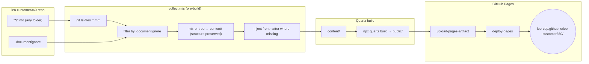

# Implementation Plan — Publish Every `*.md` in the Repo as a Quartz Site via GitHub Actions

**Goal:** Turn **every `*.md` file anywhere in the `leo-customer360` repo** (all subfolders, not just `docs/`) into a browsable, searchable, cross-linked documentation website — the same look & behaviour as the reference Quartz site at `C:\quartz` — built and deployed automatically by GitHub Actions on push to `main`. The published site:

1. **Includes any `*.md` in the repo**, minus what a **`.documentignore`** file excludes.
2. **Preserves the original folder structure** — a file at `customer360-api/README.md` is served at `/customer360-api/README`.
3. **Carries frontmatter + wikilink metadata** on every shown page (injected where missing).

**Reference:** `C:\quartz` — [Quartz v4](https://quartz.jzhao.xyz), a digital-garden static-site generator. `content/` is the markdown source; `npx quartz build` emits `public/`; `.github/workflows/deploy.yml` publishes it to GitHub Pages on push to `main`.

**Live site:** `https://leo-cdp.github.io/leo-customer360/` (GitHub *project* page for `LEO-CDP/leo-customer360`).

---

## 1. Executive summary

| Item | Decision |
|------|----------|
| Content source | **Every `*.md` in the repo**, enumerated from git, filtered by **`.documentignore`** |
| Folder structure | **Preserved** — the repo tree is mirrored into Quartz's `content/`, so URLs match paths |
| Metadata | **Frontmatter injected** where missing (title, source path, tags, dates); **wikilinks + graph** enabled |
| Exclusions | A root **`.documentignore`** (gitignore syntax) — a suggested default list is in [§4](#4-documentignore) |
| Engine | Quartz v4 (pinned tag), theme/config from `C:\quartz` |
| Collector | A small Node script (`docs-site/collect.mjs`) that mirrors + injects, run before `quartz build` |
| Deploy | New `.github/workflows/deploy-docs.yml` → GitHub Pages, on push to `main` |
| Blast radius | **Additive & reversible** — no product code touched; a bad docs build never affects UAT/PROD |

The one architectural change from a docs-only site: because the source is now the **whole repo**, a **collector step** sits in front of Quartz. It decides *which* files show (`.documentignore`), *where* they land (structure-preserving copy into `content/`), and *what metadata* they carry (frontmatter injection). Quartz then builds that assembled `content/` exactly as it builds any vault.

---

## 2. How it works end-to-end



- **Enumerate** with `git ls-files '*.md'` — this already skips `node_modules/`, build output, and anything in `.gitignore`, so the sweep starts clean and only sees tracked files.
- **Filter** each path through `.documentignore` (gitignore-style globs) for the finer, docs-specific exclusions.
- **Mirror** the survivors into `content/<same relative path>` — structure preserved, so `/database/README` etc. resolve naturally and Quartz auto-builds folder-listing pages.
- **Inject** a frontmatter block into any file that lacks one (title, source path, tags), then Quartz's `FrontMatter()` + `ObsidianFlavoredMarkdown()` render it with wikilinks and a graph.

---

## 3. The collector — `docs-site/collect.mjs`

A ~40-line Node script. It never mutates repo files; it only writes into the throwaway `content/` dir.

```js
import { execSync } from "node:child_process";
import { readFileSync, writeFileSync, mkdirSync, existsSync } from "node:fs";
import { dirname, join, basename } from "node:path";
import ignore from "ignore"; // the one dependency; correct gitignore semantics

const arg = (k, d) => { const i = process.argv.indexOf(k); return i > -1 ? process.argv[i + 1] : d; };
const REPO = arg("--repo", ".");
const OUT  = arg("--out", "content");
const INJECT = process.argv.includes("--inject-frontmatter");

// 1. Enumerate tracked markdown (respects .gitignore automatically).
const files = execSync(`git -C "${REPO}" ls-files "*.md"`, { encoding: "utf8" })
  .split("\n").filter(Boolean);

// 2. Build the exclusion matcher from .documentignore + always-exclude site machinery.
const ig = ignore().add(["docs-site/", ".quartz-engine/", "public/", "content/"]);
const difPath = join(REPO, ".documentignore");
if (existsSync(difPath)) ig.add(readFileSync(difPath, "utf8"));

const shown = files.filter((f) => !ig.ignores(f));

// 3. Mirror (structure-preserving) and inject frontmatter where missing.
for (const rel of shown) {
  let text = readFileSync(join(REPO, rel), "utf8");
  if (INJECT && !text.startsWith("---")) {
    const h1 = (text.match(/^#\s+(.+)$/m) || [])[1];
    const title = (h1 || basename(rel).replace(/\.md$/, "")).trim();
    const topDir = rel.includes("/") ? rel.split("/")[0] : "root";
    text =
      `---\ntitle: ${JSON.stringify(title)}\nsource: ${rel}\ntags: [${topDir}]\n---\n\n` + text;
  }
  const dest = join(OUT, rel);
  mkdirSync(dirname(dest), { recursive: true });
  writeFileSync(dest, text);
}

// 4. Ensure a landing page at the site root.
const indexDest = join(OUT, "index.md");
if (!existsSync(indexDest)) {
  const topDirs = [...new Set(shown.filter((f) => f.includes("/")).map((f) => f.split("/")[0]))].sort();
  writeFileSync(
    indexDest,
    `---\ntitle: LEO Customer 360 — Documentation\n---\n\n` +
      `Auto-generated index of ${shown.length} documents.\n\n` +
      topDirs.map((d) => `- [[${d}/index|${d}]]`).join("\n") + "\n",
  );
}
console.log(`Collected ${shown.length}/${files.length} markdown files → ${OUT}`);
```

`docs-site/package.json` declares the single dep:

```json
{ "name": "docs-site-collector", "type": "module", "private": true,
  "dependencies": { "ignore": "^5" } }
```

> **Why `git ls-files` + a separate `.documentignore`:** enumerating from git means the scan never descends into `node_modules/` or build dirs (they're already `.gitignore`d), so `.documentignore` only carries the *docs-specific* opinions (hide agent files, boilerplate, drafts) rather than re-listing every vendor tree. If you'd rather publish untracked files too, swap the enumeration for a filesystem walk — but then `.documentignore` must also exclude the heavy trees itself.

---

## 4. `.documentignore`

A root-level file, gitignore syntax, that the collector reads. **This is the suggested starting list** — tune to taste (a leading `!` re-includes). The plan ships this file at the repo root:

```gitignore
# .documentignore — markdown files/folders excluded from the published docs site.
# gitignore-style globs, one per line; '#' = comment; leading '!' re-includes.

# ── Safety net (git ls-files already skips these; kept for the fs-walk mode) ──
node_modules/
**/node_modules/
dist/
build/
out/
.next/
.venv/
__pycache__/
vendor/
coverage/

# ── Tooling / CI / editor internals ──
.git/
.github/
.idea/
.vscode/
.claude/

# ── Agent & editor instruction files (internal, not documentation) ──
CLAUDE.md
**/CLAUDE.md
AGENTS.md
.cursorrules

# ── Boilerplate that adds noise ──
**/CHANGELOG.md
**/LICENSE.md
**/CODE_OF_CONDUCT.md
# CONTRIBUTING.md          # kept by default — uncomment to hide

# ── Generator scaffolding READMEs (e.g. CRA/Vite per-package) ──
# frontend/**/README.md    # example: hide noisy per-package READMEs
# !frontend/README.md      # ...but keep the top-level one

# ── The planning docs themselves (optional) ──
# deployments/document/**  # uncomment if you don't want to publish these plans

# NOTE: files with `draft: true` in frontmatter are dropped by Quartz's
# RemoveDrafts() filter — use that for per-file opt-out instead of listing here.
```

---

## 5. Metadata: frontmatter + wikilinks

**Frontmatter** — the collector injects a block into every file that lacks one:
```yaml
---
title: "<first H1, else filename>"
source: <original repo-relative path>
tags: [<top-level directory>]
---
```
This powers Quartz's Explorer sorting, tag pages, search, RSS, and OG images. Files that already have frontmatter are left untouched (their own `title`/`tags`/`draft` win).

**Wikilinks** — enabled by `ObsidianFlavoredMarkdown()`. Any page can link with `[[Target]]`, and Quartz builds the **graph view** + **backlinks panel** (both in the layout copied from `C:\quartz`). Dates come from `CreatedModifiedDate` (git history, since the workflow checks out full history).

> ⚠️ **Wikilink-by-title is ambiguous across a whole repo.** Dozens of files are named `README.md`, so `[[README]]` can't resolve uniquely. Two mitigations, both in the config: `CrawlLinks({ markdownLinkResolution: "absolute" })` resolves links by full path, and authors should prefer path-style wikilinks (`[[customer360-api/README]]`) or normal relative links. The graph still populates from crawled links regardless.

---

## 6. Target repo layout

```
leo-customer360/
├─ **/*.md                      ← any markdown, anywhere = potential content
├─ .documentignore              ← NEW (root) — exclusion list (§4)
├─ docs-site/                   ← NEW — collector + Quartz config (Strategy B, no vendored engine)
│  ├─ collect.mjs               ← §3
│  ├─ package.json              ← one dep: `ignore`
│  ├─ quartz.config.ts          ← §7
│  ├─ quartz.layout.ts          ← copied verbatim from C:\quartz
│  └─ README.md
└─ .github/workflows/
   └─ deploy-docs.yml           ← NEW — collect → build → deploy
```

Strategy B (recommended) clones the Quartz engine in CI at a pinned tag — nothing but config + the collector lives in the repo. Strategy A (vendor the full Quartz project under `docs-site/`) still works if the team wants offline builds or engine customization; only the workflow's "fetch engine" steps differ.

---

## 7. `quartz.config.ts` (tailored)

Start from the reference; change site identity, `baseUrl`, and the link-resolution mode (for the README-collision fix). Everything else — theme, plugins — stays identical.

```ts
import { QuartzConfig } from "./quartz/cfg"
import * as Plugin from "./quartz/plugins"

const config: QuartzConfig = {
  configuration: {
    pageTitle: "LEO Customer 360 — Documentation",
    enableSPA: true,
    enablePopovers: true,
    analytics: null,
    locale: "en-US",
    baseUrl: "leo-cdp.github.io/leo-customer360",   // project-page subpath matters for assets
    ignorePatterns: ["private", "templates", ".obsidian", ".git"],  // .documentignore does the real filtering
    defaultDateType: "modified",
    theme: { /* copy verbatim from C:\quartz/quartz.config.ts */ },
  },
  plugins: {
    transformers: [
      Plugin.FrontMatter(),                                   // reads injected + native frontmatter
      Plugin.CreatedModifiedDate({ priority: ["frontmatter", "git", "filesystem"] }),
      Plugin.SyntaxHighlighting({ theme: { light: "github-light", dark: "github-dark" }, keepBackground: false }),
      Plugin.ObsidianFlavoredMarkdown({ enableInHtmlEmbed: false }),  // wikilinks + embeds
      Plugin.GitHubFlavoredMarkdown(),
      Plugin.TableOfContents(),
      Plugin.CrawlLinks({ markdownLinkResolution: "absolute" }),      // ← path-based, avoids README collisions
      Plugin.Description(),
      Plugin.Latex({ renderEngine: "katex" }),
    ],
    filters: [Plugin.RemoveDrafts()],                          // honors `draft: true` frontmatter
    emitters: [
      Plugin.AliasRedirects(), Plugin.ComponentResources(),
      Plugin.ContentPage(), Plugin.FolderPage(), Plugin.TagPage(),   // FolderPage = structure-preserving listings
      Plugin.ContentIndex({ enableSiteMap: true, enableRSS: true }),
      Plugin.Assets(), Plugin.Static(), Plugin.Favicon(), Plugin.NotFoundPage(),
      // Plugin.CustomOgImages(),   // optional; adds build time
    ],
  },
}
export default config
```

`quartz.layout.ts` — copy verbatim from `C:\quartz` (gives the same explorer, search, **graph**, **backlinks**).

---

## 8. The GitHub Actions workflow

The authoritative file is [`.github/workflows/deploy-docs.yml`](../../.github/workflows/deploy-docs.yml) — three jobs, `detect → build → deploy`:

1. **Trigger — any push to any branch** (`on: push:` with no branch/path filter) + `workflow_dispatch`. Every commit starts the workflow.
2. **`detect`** — diffs the pushed range (`github.event.before`…`github.sha`) and sets `changed=true` only when a **`*.md`**, `.documentignore`, `docs-site/**`, or the workflow file itself changed. `workflow_dispatch` and first-push/new-branch (zero base SHA) always count as changed. This replaces trigger-level `paths:` filtering with an in-workflow gate, so the run always appears in checks but only does work when the docs actually change.
3. **`build`** — `needs: detect`, `if: needs.detect.outputs.changed == 'true'`. Runs on **every branch** (validates the docs compile): fetch pinned Quartz → inject config/layout → `collect.mjs` → `npx quartz build` → upload Pages artifact.
4. **`deploy`** — `needs: build`, **guarded to the default branch** (`if: github.ref == format('refs/heads/{0}', github.event.repository.default_branch)`). Feature branches build but never publish.

> **Why deploy is default-branch-only.** GitHub Pages serves a single published version per repo. Building on every branch gives you per-branch validation (a broken docs change fails CI on the PR branch), but only `main` (or whatever the default branch is) is allowed to overwrite the live site. If you want **per-branch published previews** with their own URLs, that needs a preview host — e.g. Cloudflare Pages, as the reference's `deploy-preview.yaml` does — not GitHub Pages.

Action versions mirror your working `C:\quartz/deploy.yml`.

**Local preview** mirrors CI:
```bash
git clone --depth 1 -b v4.5.2 https://github.com/jackyzha0/quartz.git /tmp/quartz
cp docs-site/quartz.config.ts docs-site/quartz.layout.ts /tmp/quartz/
( cd docs-site && npm i && node collect.mjs --repo .. --out /tmp/quartz/content --inject-frontmatter )
( cd /tmp/quartz && npm i && npx quartz build --serve )   # → http://localhost:8080
```

---

## 9. Pre-flight fixes (before first build)

1. **Fix the malformed filename** — `docs/PLAN-EVENTS-API-IMPROVEMENTmd` → `docs/PLAN-EVENTS-API-IMPROVEMENT.md`. Without the `.md` extension `git ls-files '*.md'` never sees it, so it silently won't publish.
   ```bash
   git mv docs/PLAN-EVENTS-API-IMPROVEMENTmd docs/PLAN-EVENTS-API-IMPROVEMENT.md
   ```
2. **Commit `.documentignore`** at the repo root (from §4); review the suggested exclusions for your repo.
3. **Sanity-check `---`-fronted files** — slide decks like `docs/campaign-slide-VN.md` open with `---`; confirm that block is valid YAML frontmatter, not reveal.js/Marp separators. If a deck, mark it `draft: true` or accept it renders as one page.
4. **Assets** (`.png`, `.svg`, `.pdf`) referenced by **relative** links are copied through by Quartz. Binaries not referenced by any shown page won't appear — expected.

---

## 10. Step-by-step checklist

**Prerequisites (GitHub UI, one-time):**
- [ ] Confirm Pages entitlement (public repo → free; private → needs Team/Enterprise) and that the `LEO-CDP` org allows Pages.
- [ ] Settings → **Pages** → Source = **GitHub Actions**.

**Implementation:**
- [ ] Apply the [§9 pre-flight fixes](#9-pre-flight-fixes-before-first-build).
- [ ] Add `.documentignore` (root), `docs-site/{collect.mjs,package.json,quartz.config.ts,quartz.layout.ts,README.md}`, and `.github/workflows/deploy-docs.yml`.
- [ ] Run the local preview; confirm the tree, wikilinks, graph, and search look right.
- [ ] PR → merge to `main`; watch **Actions → Deploy Docs site**; open `https://leo-cdp.github.io/leo-customer360/`.

---

## 11. Decisions to confirm

1. **Tracked-only vs all files** — publish only git-tracked markdown (recommended; `git ls-files`) or also untracked files (filesystem walk; heavier `.documentignore`)?
2. **`.documentignore` contents** — the §4 list is a suggestion; confirm what to hide (agent files, boilerplate, the plans themselves, per-package READMEs).
3. **Frontmatter injection** — on by default (`--inject-frontmatter`). Keep, or only render files that already have frontmatter?
4. **Strategy B vs A** — CI-fetched engine (recommended) vs vendored Quartz.
5. **URL** — default `leo-cdp.github.io/leo-customer360`, or a custom domain?

---

## 12. Risks & mitigations

| Risk | Mitigation |
|------|-----------|
| Whole-repo sweep pulls in noise (vendored/boilerplate READMEs) | `git ls-files` skips `.gitignore`d trees; `.documentignore` handles the rest; `draft: true` for per-file opt-out |
| `README.md` name collisions break `[[wikilinks]]` | `markdownLinkResolution: "absolute"` + prefer path-style links (§5) |
| Private-repo Pages not entitled / org restrictions | Confirm in prerequisites; else host output on Cloudflare Pages |
| Broken asset URLs on the project subpath | Correct `baseUrl` incl. `/leo-customer360`; verify in preview |
| `---` slide decks misparsed as frontmatter | §9 step 3 — mark `draft` or convert |
| Malformed/extensionless filename never publishes | §9 step 1 rename |
| Long build from many PNGs / OG images | OG images off by default; enable once green |

---

## 13. Rollback

Fully reversible — no product impact. Disable via Settings → Pages → Source = *None*, or delete/disable `deploy-docs.yml`. The workflow is path-scoped, so a failed docs build never blocks `ci.yml` / `cd.yml`.

---

## Appendix — source facts (captured 2026-09-05)

- Repo remote `https://github.com/LEO-CDP/leo-customer360.git` → Pages host `leo-cdp.github.io`, project path `/leo-customer360/`.
- Existing workflows: `admin-uat.yml`, `cd.yml`, `ci.yml`; no root `package.json` (repo is not a Node project at root).
- Reference: Quartz `v4.5.2`, Node `>=22` (`.node-version` = `v22.16.0`); content via git submodule symlink; deploy to Pages on push to `main`.
- `docs/` alone holds 35 `*.md` + assets; the whole-repo sweep will additionally surface service READMEs and other markdown across the tree (final count depends on `.documentignore`).
