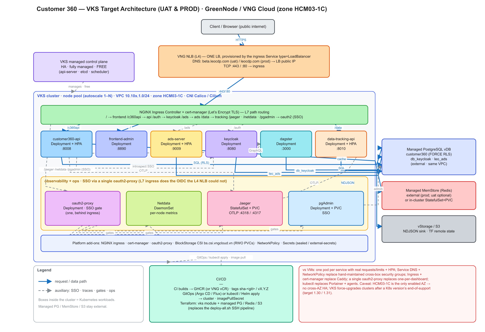

# Customer 360 — vServer → VKS (Managed Kubernetes) Technical Analysis

> **Status:** research / decision-support · **Date:** 2026-08-26 · **Scope:** UAT + PROD
> **Platform:** GreenNode / VNG Cloud, zone **HCM03-1C** (object storage in HCM04)
> **Companion:** [`vks-cost-analysis.md`](./vks-cost-analysis.md)

This document evaluates replacing the current **vServer (VM + Docker + SSH)** deployment
with **VKS — VNG Cloud Kubernetes Service** (rebranded *GreenNode Kubernetes Service*).
It covers the target architecture, a component-by-component migration map, the UAT and PROD
specifics, and the risks/gotchas that are particular to VKS and to this account.

---

## 1. TL;DR

- **Technically a good fit.** Nearly every workload is already a stateless Docker container
  pulled from GHCR and run with `--restart unless-stopped`; those become Kubernetes
  `Deployment`s almost 1:1. Managed PostgreSQL and (in prod) managed MemStore stay **outside**
  the cluster unchanged.
- **The migration mostly *deletes* accidental complexity** that exists only because we are on
  VMs: `--network host` + 127.0.0.1 wiring + non-standard ports, hand-maintained cross-box
  security-group rules, Caddy + a cutover runbook, Portainer + agents, an SSH bash deploy
  pipeline, and DHCP-guessed private IPs. See §7.
- **VKS control plane is free**; you pay only for worker-node VMs, block-storage PVCs, and
  load balancers — the same resource types you already pay for. See the cost doc.
- **Main caveats for *this* account:** only **HCM03-1C** is enabled → **no cross-AZ HA** even
  though VKS supports multi-AZ; VNG **force-upgrades** clusters after a version's end-of-support;
  every `Service type=LoadBalancer` provisions a **billed NLB** (consolidate to one ingress);
  and **data-tracking-api is now built by CI** (✅ done — it publishes to GHCR like the others).

---

## 2. Current state (baseline)

Full inventory in the module READMEs and `*/overlays/{uat,prod}.tfvars`. Condensed:

### 2.1 UAT — everything on tiny VMs
| Box | Flavor | vCPU/RAM | Runs |
|---|---|---|---|
| `c360-api-uat-api` (10.100.1.5) | `s-general-1x2` | 1 / 2 GB | customer360-api, redis, keycloak, frontend-admin, ads-server, **Caddy**, **whole monitoring stack** (Portainer, Netdata, Jaeger, pgAdmin, oauth2-proxy) |
| `c360-api-uat-backend` (10.100.1.4) | `s-general-1x2` | 1 / 2 GB | Dagster (backend-system), Portainer agent |
| `c360-api-uat-tracking` (10.100.1.8) | `s-general-1x2` | 1 / 2 GB | data-tracking-api, Portainer agent |

The api box is explicitly oversubscribed (1 vCPU/2 GB running ~11 containers; a resize to
`s-general-2x4` is deferred in the overlay comment).

### 2.2 PROD — a dedicated VM per service
| Box | Flavor | vCPU/RAM | Runs | Status |
|---|---|---|---|---|
| `c360-api-prod-4x8` (…1.10) | `s2-general-4x8` | 4 / 8 | customer360-api (+ monitoring) | provisioned |
| `c360-api-prod-sso` (…1.11) | `s2-general-2x4` | 2 / 4 | Keycloak | provisioned |
| `c360-api-prod-frontend` (…1.12) | `s2-general-2x4` | 2 / 4 | frontend-admin + Caddy | provisioned |
| `c360-api-prod-ads` (…1.13) | `s2-general-4x8` | 4 / 8 | ads-server | provisioned |
| `c360-api-prod-tracking` (…1.15) | `s2-general-2x4` | 2 / 4 | data-tracking-api | **commented-out** |
| backend/Dagster (…1.14) | — | — | Dagster | **designed, no server key** |

### 2.3 Shared (both envs)
- **PostgreSQL**: managed vDB, PG 15, private — UAT `db.s-general-2x4` / 20 GB; PROD `db.s-general-8x16` / 250 GB. Databases `customer360` (FORCE RLS) + `db_keycloak` + `leo_ads`.
- **Redis**: UAT = container on the api box; PROD = **managed MemStore** (`db.s-general-2x4`, Redis 7).
- **Load balancer**: L4 **NLB** (`NLB_Small`), TCP passthrough; listeners `:443/:80→Caddy`, `:3000→Dagster`, `:9443→Portainer`, `:19999→Netdata(SSO)`, `:5050→pgAdmin`.
- **Reverse proxy**: **Caddy** (`caddy:2-alpine`), auto Let's Encrypt TLS, single-host path routing (`/`, `/c360api`, `/auth`, `/ads`, `/data`, `/jaeger`). Domain `beta.leocdp.com` (uat) / `leocdp.com` (prod).
- **Object storage**: vStorage/S3 (`leo-customer360-{uat,prod}`) for tracking NDJSON; separate `leocdp360-tfstate` bucket for Terraform state (via the `hashicorp/aws` provider against the vStorage endpoint).
- **CI/CD**: CI builds images → GHCR (`ghcr.io/leo-cdp/leo-customer360/<svc>`, tags `sha-<git>`/`latest`/`vX.Y.Z`); `cd.yml` runs `deploy-all.sh <env> --only <svcs>` over SSH (`docker run … --network host`). Terraform state on S3-over-vStorage (**no state locking**).

---

## 3. Target architecture on VKS



📐 **Editable sources:** [`vks-target-architecture.excalidraw`](./vks-target-architecture.excalidraw)
(open at [excalidraw.com](https://excalidraw.com) or the Obsidian Excalidraw plugin) ·
[`vks-target-architecture.svg`](./vks-target-architecture.svg) (vector source of the image above).

<details><summary>Same view as text</summary>

```
Internet
  │  DNS: beta.leocdp.com (uat) / leocdp.com (prod)  → LB public IP
  ▼
VNG NLB/ALB  (ONE load balancer, provisioned by the Ingress)
  ▼
Ingress controller (NGINX + cert-manager/Let's Encrypt)   ← replaces Caddy
  ├── /            → frontend-admin  (Deployment + Service)
  ├── /c360api     → customer360-api (Deployment + Service + HPA)
  ├── /auth        → keycloak        (Deployment/StatefulSet + Service)
  ├── /ads         → ads-server      (Deployment + Service + HPA)
  ├── /data        → data-tracking-api (Deployment + Service + HPA)
  ├── /jaeger      → oauth2-proxy → jaeger-query   (SSO via Keycloak)
  ├── /netdata     → oauth2-proxy → netdata        (SSO)
  └── /pgadmin     → oauth2-proxy → pgadmin         (SSO)     ← prod already SSO-gated

In-cluster (VKS node pool, VPC 10.10x.1.0/24, zone HCM03-1C):
  Deployments:  api · frontend · ads · keycloak · dagster · tracking · oauth2-proxy · pgadmin
  DaemonSet:    netdata (per-node metrics)          StatefulSet+PVC: jaeger (badger) [or in-mem]
  (redis: keep managed MemStore, OR in-cluster StatefulSet+PVC)

Outside the cluster, same VPC (unchanged):
  Managed PostgreSQL vDB (customer360 / db_keycloak / leo_ads)
  Managed MemStore (Redis)                     vStorage / S3 (NDJSON sink, TF state)
```

</details>

**Platform add-ons to install once per cluster (Helm):**
- **Ingress**: NGINX Ingress Controller (fronted by one NLB) **or** VNG's native ALB ingress via the GreenNode LoadBalancer Controller. Recommendation: **NGINX + cert-manager** — it's the documented Let's Encrypt path and is the cleanest 1:1 replacement for Caddy's automatic HTTPS.
- **TLS**: **cert-manager** with staging + production ACME (Let's Encrypt) Issuers — replaces Caddy's cert management.
- **CSI**: GreenNode BlockStorage CSI (`bs.csi.vngcloud.vn`) for PVCs (installed/available in VKS).
- **oauth2-proxy**: a **single** deployment wired into the ingress (via auth annotations) instead of one container per dashboard.

---

## 4. Component-by-component migration map

| Current (VM / Docker) | VKS target | Notes |
|---|---|---|
| customer360-api container (`--network host`, :8008) | `Deployment` + `Service` (ClusterIP) + **HPA** | env-file → `Secret`/`ConfigMap`; `root_path=/c360api` preserved via ingress path |
| ads-server (:9009, high-QPS) | `Deployment` + `Service` + **HPA** | biggest autoscale beneficiary |
| frontend-admin (:8890) | `Deployment` + `Service` | static-ish; browser calls API/Keycloak via ingress |
| keycloak (:8080, mgmt :9000) | `Deployment` (or `StatefulSet`) + `Service` | external DB `db_keycloak`; set `KC_HTTP_RELATIVE_PATH=/auth`; liveness on :9000 |
| dagster / backend-system (:3000) | `Deployment` + `Service` | needs PG; if it needs run storage, add a PVC |
| data-tracking-api (:8010) | `Deployment` + `Service` + **HPA** | ✅ **now built + published to GHCR by CI** (`ci.yml`); `deploy-tracking.sh` pulls it by default (`BUILD_LOCAL=0`). S3 creds + OTLP endpoint via `Secret`/env |
| c360-redis container (uat) / MemStore (prod) | **Keep managed MemStore for both** (recommended) or in-cluster `StatefulSet` + PVC | managed removes stateful-in-cluster risk; RWO block volume only if in-cluster |
| **Caddy** (path routing + TLS) | **Ingress + cert-manager** | deletes `proxy/`, `set-domain.sh`, the cutover runbook |
| **L4 NLB** (manual listeners/backends) | `Service type=LoadBalancer` on the ingress → **one** VNG NLB | annotations pick package/scheme/security-groups; **do not** create one LB per service |
| **Portainer + agents** | remove → `kubectl` / Lens / (optional) K8s dashboard | cross-box agent pattern disappears |
| Netdata (per-host) | `DaemonSet` (`--pid host` equiv via host access) **or** Prometheus + Grafana | keep Netdata for parity, or modernise to Prometheus stack |
| Jaeger (badger, loopback UI, OTLP) | `Deployment`/Operator + `Service`; PVC if persisting badger | OTLP `:4318/:4317` becomes a ClusterIP Service; apps point `OTEL_EXPORTER_OTLP_ENDPOINT` at it |
| pgAdmin (:5050, PVC data) | `Deployment` + PVC + ingress (oauth2 SSO) | prod already SSO-gated; uat can adopt SSO for free here |
| oauth2-proxy (one per dashboard) | **one** `Deployment` behind ingress auth annotations | L7 ingress does what the L4 NLB couldn't |
| `.env` files on box (`/opt/c360/*.env`) | Kubernetes `Secret`s (sealed-secrets / external-secrets recommended) | no more per-box files |
| Cross-box security-group `extra_ingress` (9001/8010/6580/4318) | `NetworkPolicy` (+ intra-cluster DNS) | hand-maintained IP rules vanish |
| Hard-coded private IPs (10.10x.1.x) | Kubernetes `Service` DNS names | no DHCP-guessing / `terraform output` IP juggling |
| `deploy-all.sh` (SSH `docker run`, manual ordering) | Helm/Kustomize manifests + `kubectl apply` **or GitOps (Argo CD/Flux)** | controller reconciliation replaces ordered SSH steps; `--restart unless-stopped` → pod `restartPolicy` |
| Terraform: `server` / `load_balancer` / `proxy` modules | **removed**; add a `vks` module (cluster + node group) | keep TF for VKS, managed PG/MemStore, object storage, VPC |
| PostgreSQL vDB / object storage | **unchanged** (external, in-VPC) | pods get creds via `Secret`; S3 needs no CSI |

---

## 5. Networking, storage, secrets

- **Cluster networking**: create the VKS cluster in the existing VPC/subnet (`10.100.1.0/24` uat, `10.101.1.0/24` prod). **CNI**: Calico Overlay, Cilium Overlay, or Cilium VPC-native routing are offered — Cilium enables richer NetworkPolicy/observability; Calico is the safe default.
- **Public vs Private cluster**: VKS distinguishes them. **Public** = simplest, node↔API over public IPs; **Private** = all-private, needs extra endpoints, costs more and is more complex. **Recommendation:** Public cluster + IP-allowlisted API + private node groups where possible; only go Private if compliance demands it.
- **Persistent volumes**: `bs.csi.vngcloud.vn`, **RWO only** (no shared/RWX block — use FileStorage/NFS if a workload ever needs RWX). Default SC `sc-iops-200-retain`; `allowVolumeExpansion` (grow-only); volume snapshots supported. PVC candidates: Jaeger badger, pgAdmin data, in-cluster Redis (if chosen).
- **Secrets**: standard K8s `Secret`s (no VKS-managed secret store surfaced). Recommend **sealed-secrets** or **external-secrets** so nothing sensitive lands in git. Private-registry pull uses an `imagePullSecret`.
- **Registry**: keep **GHCR** (works from VKS with a pull secret) or move to VNG **vCR** (`vcr.console.vngcloud.vn`, IAM-gated) to keep image pulls in-cloud and cut cross-cloud egress.

---

## 6. Per-environment plan

### 6.1 UAT
- Single small **node pool** (autoscale 1→2) is plenty; UAT tolerates a single node (no HA needed). This is actually an **upgrade** over today's 1 vCPU/2 GB oversubscribed box because pods get real requests/limits and the scheduler bin-packs with headroom.
- Keep it a **Public cluster**; adopt SSO for pgAdmin (free win vs today's cleartext direct exposure).
- Good **first migration target** — low risk, exercises the whole pattern.

### 6.2 PROD
- Node pool of **≥2 nodes** (autoscale) so a node drain/upgrade doesn't take the platform down — but note **single-AZ HCM03-1C means no cross-AZ HA**; a full-AZ outage still takes everything down (same exposure as today).
- Bin-packing collapses the 4–6 dedicated boxes into a shared pool; isolate noisy/high-QPS **ads** via resource requests or a dedicated node pool/labels if needed.
- Keep **managed PostgreSQL + MemStore** external (unchanged).
- Deploy the **same manifests as UAT**, differing only by Helm values / Kustomize overlay (image tag `vX.Y.Z`, replica counts, resource limits, domain) — this replaces the per-module `prod.tfvars` sprawl.

---

## 7. What the migration *removes* (accidental VM complexity)

These exist only because we run on VMs and **disappear** under VKS:
1. Service co-location on one oversubscribed box → one pod per workload with real limits.
2. `--network host` + `127.0.0.1` wiring + port-clash-avoidance ports (6580/4199/4686/4050/5050/9443…) → ClusterIP Services + DNS on normal ports.
3. Cross-box security-group `extra_ingress` rules (9001/8010/6580/4318) → `NetworkPolicy`.
4. **Caddy** + `set-domain.sh` + the cutover runbook → Ingress + cert-manager.
5. oauth2-proxy **one-container-per-dashboard** (because the L4 NLB can't do OIDC/TLS) → one oauth2-proxy behind an L7 ingress.
6. **Portainer + agents** (cross-box container ops) → `kubectl`.
7. **build-on-the-VM** fallback (`BUILD_LOCAL=1`, and tracking's build-on-box default) → always deploy prebuilt images.
8. **SSH bash deploy pipeline** with manual ordering/idempotency → declarative manifests + controller reconciliation (or GitOps).
9. **DHCP-guessed private IPs** baked into overlays → Service DNS.
10. cloud-init SSH-repair boot hackery → container images.

**Also worth fixing during the move** (pre-existing prod placeholders, not VM-inherent): prod VPC name mismatch (`c360-api-vpc-prod` vs `c360-vpc-prod`, both `create_network=true`), prod cache `allowed_ip_prefix=10.100.0.0/16` (should be `10.101…`), prod `mon_server_key="api"` with no matching server key, and `REPLACE_WITH_*` LB/proxy placeholders.

---

## 8. Risks & VKS-specific gotchas

| Risk | Impact | Mitigation |
|---|---|---|
| **Single AZ (HCM03-1C only)** | VKS multi-AZ HA unavailable; AZ outage = full outage | Same exposure as today; run ≥2 nodes for node-level resilience; ask VNG to enable a 2nd AZ if HA matters |
| **Forced K8s upgrades** after End-of-Standard-Support | Surprise version bumps | Track the VKS release schedule; target **1.30/1.31**; test upgrades in UAT first (surge upgrade: MaxSurge 1 / MaxUnavailable 0 by default) |
| **Each `Service type=LoadBalancer` bills an NLB** | Cost creep | Use **one** ingress LB; reuse via `vks.vngcloud.vn/load-balancer-id`; don't expose services individually |
| ~~data-tracking-api not in CI~~ ✅ **resolved** | (was) can't deploy an image | Added to `ci.yml` (built + pushed to GHCR); `deploy-tracking.sh` now defaults to `BUILD_LOCAL=0`, and `cd.yml` deploys `tracking` |
| **RWO block storage only** | No multi-writer volumes | Single-replica stateful pods only; use FileStorage/NFS for RWX if ever needed |
| **HCM03-1C pricing/flavor parity** | Docs only cover HCM03-1A | Confirm flavor availability + prices for 1C with VNG before sizing |
| **Stateful in-cluster (Keycloak/Jaeger/pgAdmin/Redis)** | Data loss on reschedule if not persisted | Keep DB/Redis managed & external; PVC-back Jaeger/pgAdmin or accept ephemeral |
| **TF state, no locking on vStorage** | Concurrent-apply corruption | GitOps for the app layer sidesteps it; keep infra applies serial |
| **Private-registry auth** | Pull failures | `imagePullSecret` for GHCR, or move to vCR |

---

## 9. Recommended phased migration

1. **Prereqs** — ✅ `data-tracking-api` is now in CI (done); move `.env`s into `Secret` manifests (sealed/external-secrets); pick registry (GHCR vs vCR).
2. **Cluster** — Terraform a `vks` module: cluster (Public) + one node group (autoscale) in the VPC/subnet, plus keep managed PG/MemStore/object-storage modules.
3. **Platform** — Helm-install NGINX ingress + cert-manager (Let's Encrypt), oauth2-proxy, CSI StorageClasses; keep Netdata as a DaemonSet (or adopt Prometheus/Grafana).
4. **Stateless apps** — deploy api, frontend, ads, keycloak, dagster, tracking; wire to external PG + MemStore; add HPAs (api, ads, tracking).
5. **Ingress + DNS** — move `beta.leocdp.com` to the ingress LB, cert-manager issues certs, retire Caddy.
6. **Observability** — Jaeger (Operator or Deployment+PVC), Netdata DaemonSet; remove Portainer.
7. **Cut over & decommission** — validate, flip DNS, tear down the vServers + `server`/`load_balancer`/`proxy` TF.
8. **Repeat for PROD** with the same manifests (Helm values differ: `vX.Y.Z` image, replicas, limits, domain, ≥2 nodes).

**Do UAT end-to-end first**, then PROD — the manifests are shared, so PROD becomes a values change, not a rebuild.

---

## 10. Sources

- VKS overview / control-plane-free / CNI / public-vs-private / node groups / release schedule / storage CSI / load balancer / ALB+cert-manager: **docs.greennode.ai/vks/** (VNG docs now redirect here from docs.vngcloud.vn).
- vDB (RDS PostgreSQL, MemStore) + vContainer Registry: **docs.vngcloud.vn** / **vngcloud.vn/product/**.
- Current-state facts: this repo's `deployments/*/overlays/{uat,prod}.tfvars`, module READMEs, `deploy-*.sh`, `lib/ghcr.sh`, `.github/workflows/cd.yml`.

See [`vks-cost-analysis.md`](./vks-cost-analysis.md) for the cost model and the (calculator-only) pricing to confirm with VNG.
