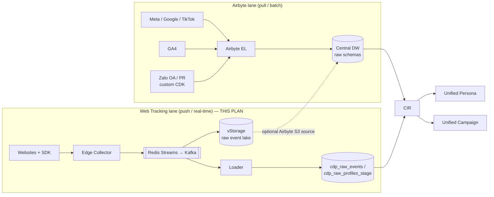
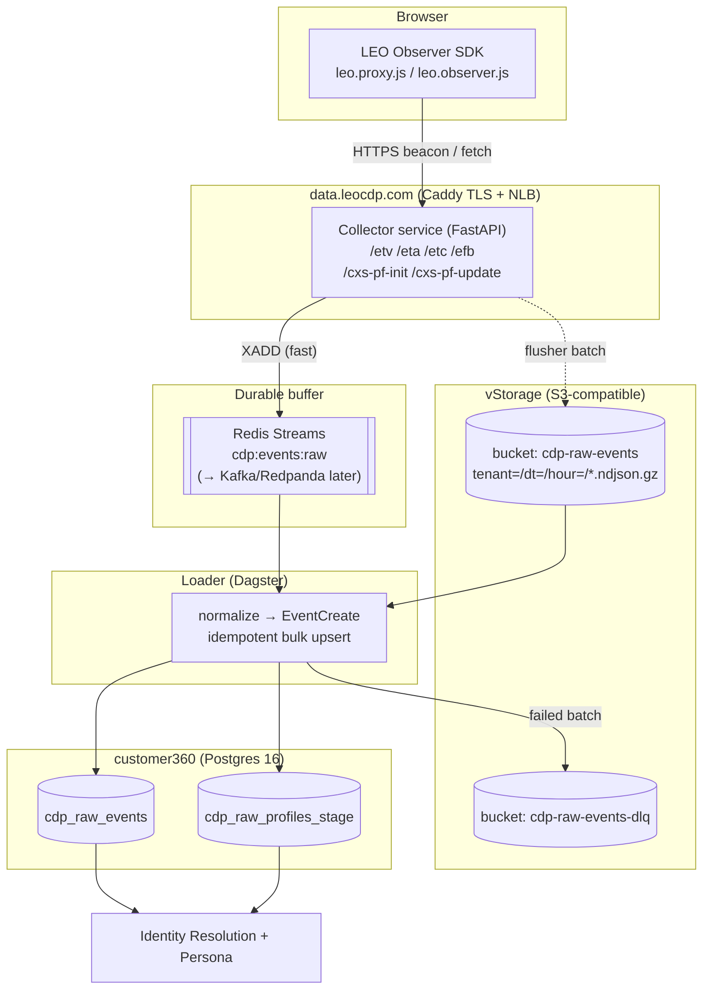
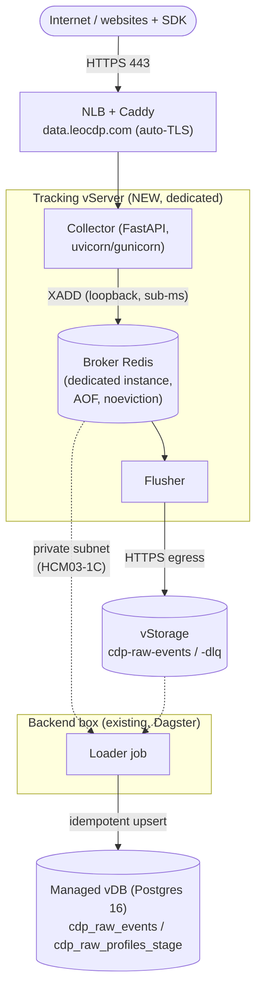

# Web Tracking Implementation Plan (First‑Party Event Collection)

> **Companion to** [`Airbyte Implementation Plan.pdf`](./Airbyte%20Implementation%20Plan.pdf).
> Where the Airbyte plan builds the **pull‑based batch ELT** lane for paid‑media /
> 3rd‑party platforms (Meta, Google, TikTok, GA4, AppsFlyer, Zalo, PR), this plan
> builds the **push‑based, real‑time first‑party** lane: the tracker that collects
> events directly from your own websites over the internet. Both lanes land in one
> **Raw Data Layer** that feeds Customer Identity Resolution (CIR) → Unified Persona
> → Unified Campaign.

- **Status:** proposal / research
- **Author:** Data/Platform Engineering
- **Date:** 2026‑08‑25
- **Object storage:** **VNG Cloud vStorage** (S3‑compatible) — provisioned by
  [`deployments/storage`](../storage/README.md). Dev uses MinIO with the identical S3 API.

---

## 1. TL;DR — the recommendation

Build a small, **stateless edge Collector** that terminates the existing LEO Observer
SDK log endpoints, does the minimum work on the hot path, and **decouples collection
from processing** with a durable buffer. Start lightweight; keep every interface
swappable so it scales without a rewrite.

1. **Collector service** (thin FastAPI app, separate from `customer360-api`) behind
   Caddy on a first‑party subdomain `data.leocdp.com`. It answers `/etv /eta /etc
   /efb /cxs-pf-init /cxs-pf-update`, enriches server‑side, and returns `204` in a
   few milliseconds. It never blocks on Postgres.
2. **Durable buffer = Redis Streams** now (already in the stack) → **Kafka/Redpanda**
   later. The producer contract stays identical, so the swap is a config change.
3. **vStorage raw event lake** — the Collector's flusher writes append‑only,
   gzipped **NDJSON**, partitioned by `tenant/date/hour`. This is the immutable,
   replayable Raw Data Layer for the first‑party lane (mirrors how Airbyte lands raw
   data in the warehouse).
4. **Loader** (Dagster micro‑batch job → streaming consumer later) reads the buffer /
   lake, normalizes to the existing `EventCreate` schema, and upserts into
   `cdp_raw_events` + `cdp_raw_profiles_stage` — **reusing the `POST /events/bulk`
   logic unchanged**, so CIR and segmentation downstream need no changes.
5. **Same code, two endpoints for storage:** dev → MinIO, prod → vStorage. Only the
   S3 endpoint/credentials differ.

This directly delivers the `ROADMAP.md` short‑term item *“Ingestion layer thật
(Kafka/PubSub/RabbitMQ → cdp_raw_profiles_stage)”* for owned web traffic.

---

## 2. Why a new lane (and how it fits the Airbyte plan)

The two ingestion lanes are complementary, not competing:

| Dimension | **Airbyte lane** (existing plan) | **Web Tracking lane** (this plan) |
|---|---|---|
| Pattern | Pull / batch **ELT** on a schedule | Push / real‑time **event stream** |
| Sources | Meta, Google/YouTube, TikTok, GA4, AppsFlyer, Zalo OA, PR/News | Your own websites & web apps (first‑party) |
| Latency | Minutes–hours (sync frequency) | Seconds (near‑real‑time) |
| Ownership of data | 2nd/3rd‑party (platform‑mediated, sampled, quota‑limited) | **1st‑party, unsampled, full fidelity, you own it** |
| Identity keys | `campaign_id`, `fbp/fbc`, `ttclid`, `user_pseudo_id` | `visitorId`, `sessionId`, `fgp`, `email/phone` (+ the same ad click IDs) |
| Lands in | Central DW raw schemas | vStorage raw lake → `cdp_raw_events` / `cdp_raw_profiles_stage` |

**Convergence:** the vStorage raw event lake produced here is itself a valid **Airbyte
S3 source**. So the same Airbyte instance that pulls paid‑media data can (optionally)
load the first‑party lake into the DW for BI — one tool, one warehouse, both lanes.
Downstream, everything meets at CIR and becomes one Unified User / Unified Campaign.



---

## 3. The gap this closes

- The LEO Observer SDK already exists and is documented in
  [`docs/cdp-web-sdk-tracking.md`](../../docs/cdp-web-sdk-tracking.md). The browser
  side batches view/action/conversion/feedback events + profile updates and posts
  them to a **LEO log domain** (`/etv /eta /etc /efb /cxs-pf-init /cxs-pf-update`).
- **That log domain is not implemented in this repo.** Today, events only reach the
  CDP through `POST /events` / `POST /events/bulk` on `customer360-api`, driven by
  scripts. There is no internet‑facing collector, no buffer, and no durable raw log.
- This plan implements exactly that missing tier — as a **lightweight, independently
  scalable service** so a traffic spike (flash sale, ad burst) can never take down
  the admin/CRUD API or the database.

---

## 4. Design principles

1. **Thin hot path.** The Collector validates, enriches cheaply, appends to the
   buffer, and returns `204`/`1×1 gif`. Target **< 5 ms** server time; **no synchronous
   DB writes**, no synchronous identity resolution.
2. **Decouple collection from processing.** A durable buffer absorbs spikes and
   isolates ingest availability from DB/consumer health.
3. **Durable raw lake first.** Every raw hit lands in vStorage before any transform —
   cheap, immutable, replayable, and audit‑friendly. If the DB is down, nothing is lost.
4. **Reuse existing contracts.** The Loader emits the same `EventCreate` objects the
   `/events/bulk` endpoint already accepts, so CIR/segmentation are untouched.
5. **Stateless & horizontal.** No server‑side session state (visitor ID lives in the
   first‑party cookie / SDK). Run N Collector replicas behind the NLB.
6. **Swappable internals.** Buffer (Redis→Kafka), Collector language (Python→Go), and
   Loader (batch→stream) each change **without** touching the SDK contract or the DB schema.
7. **Privacy by default.** PII hashing at the edge (consistent with the Airbyte plan’s
   PII hashing rule), consent gating, IP truncation.

---

## 5. Target architecture



**Flow:** SDK → Collector (`XADD` to Redis Stream, `204`) → flusher writes gzipped
NDJSON batches to vStorage → Loader consumes → idempotent upsert into
`cdp_raw_events` / `cdp_raw_profiles_stage` → CIR merges into one master profile.

---

## 6. Deployment topology — dedicated vServer + Redis broker

Two confirmed constraints shape the physical layout:

- **Redis is the event broker** (Phase‑1 buffer = Redis Streams — see §8).
- **The web‑tracking module runs on its own vServer**, isolated from the api / backend
  boxes.

Both fit the design cleanly: the Collector was already specified as a separate,
independently‑scaled service, and a dedicated vServer makes that isolation physical —
an ingestion spike can never starve the admin/CRUD API or the DB.



### Why the broker Redis is co‑located on the tracking vServer

- The hot‑path `XADD` stays on **loopback** → sub‑millisecond, with no cross‑box network
  dependency in the path that produces the `204`. This is what keeps ingestion *fast*.
- Ingestion becomes **self‑contained**: if the backend box, DB, or any other box is
  down, the Collector + broker + flusher keep accepting traffic and landing to vStorage.

### Keep the broker Redis separate from the API‑cache Redis

The existing Redis (on the api box) backs API response caching, Keycloak token cache,
and brute‑force throttling — all small, latency‑sensitive, and LRU‑evictable. The event
broker has the **opposite** profile: high write throughput, a large/growing stream, must
**not** evict un‑consumed entries, and wants persistence. Sharing one instance risks an
event flood evicting auth tokens or OOM‑ing the cache. Therefore:

- Run a **dedicated Redis instance for the broker** on the tracking vServer — not the
  cache instance. (If you must share short‑term, at minimum use a separate logical DB
  with `maxmemory-policy noeviction` for the stream — but a separate instance is strongly
  preferred.)

### Broker Redis configuration

- `appendonly yes` (AOF, `everysec`) so a Redis restart doesn’t lose buffered‑but‑unflushed
  events. vStorage stays the durable record; AOF only shrinks the crash loss/replay window.
- `maxmemory-policy noeviction` (never silently drop stream entries); cap growth with
  `XADD … MAXLEN ~ <N>` and **alert on stream length + flusher lag**.
- Consumer group `loader`; use `XAUTOCLAIM` to recover pending entries from a dead consumer.

### Memory sizing (rule of thumb)

`stream RAM ≈ peak_eps × buffer_seconds × avg_event_bytes × ~1.5 overhead`. E.g.
`5,000 eps × 120 s × 1 KB × 1.5 ≈ ~0.9 GB`. A **2 vCPU / 4 GB** box comfortably runs the
Collector **+** broker Redis at Phase‑1 volume; grow RAM with the `MAXLEN` window.

### Network & routing checklist

- NLB + Caddy route `data.leocdp.com` (443) → tracking vServer Collector; auto‑TLS
  (Let’s Encrypt), exactly as done for `beta.leocdp.com`.
- Tracking vServer **egress** → vStorage S3 endpoint (HTTPS 443).
- Backend box → broker Redis over the **private subnet** (zone HCM03‑1C) for the Loader.
- Firewall: only **443 inbound** to the Collector; broker Redis and the S3 side stay
  private (Redis bound to the private interface + password, **never** public).

### Where the Loader runs

Keep the tracking box **thin** (pure ingestion). Run the Redis→Postgres Loader as a
Dagster job on the existing **backend box**, connecting to the broker Redis over the
private network. This consolidates DB connections on the backend box and limits the
tracking box’s failure domain to ingestion. *(Phase‑1 alternative: run the Loader on the
tracking box for simplicity — at the cost of added DB coupling on that box.)*

### IaC

Add a `deployments/tracking` module (mirroring [`deployments/server`](../server)): the
tracking vServer + its Caddy route + broker‑Redis provisioning, with
`overlays/uat.tfvars` / `overlays/prod.tfvars`. Wire it into
[`deploy-all.sh`](../deploy-all.sh) **after `server`, before `load-balancer`**, and add a
row to the [`deployments/README.md`](../README.md) module table.

---

## 7. The Collector service

A **separate, minimal FastAPI app** (not part of `customer360-api`) so it deploys,
scales, and fails independently. FastAPI is chosen for a lightweight start because it
matches the team’s existing stack; the service is deliberately small enough to be
rewritten in Go later if per‑core throughput ever demands it (see §11).

### Endpoints (SDK contract — no SDK change required)

| Path | SDK method | Maps to |
|---|---|---|
| `/etv` | `recordViewEvent` | `event_category = view` |
| `/eta` | `recordActionEvent` | `event_category = action` |
| `/etc` | `recordConversionEvent` | `event_category = conversion` (+ `tsid/tsval/tscur/scitems`) |
| `/efb` | `recordFeedbackEvent` | `event_category = feedback` |
| `/cxs-pf-init` | session/profile init | new `cdp_raw_profiles_stage` seed |
| `/cxs-pf-update` | `updateProfileBySession` | profile identity update (`email/phone/loginId/fbUserId`) |
| `/health` `/metrics` | ops | liveness + Prometheus/OTel |

### Hot path (per request)

1. Resolve `tenant_id` from `leoObserverId`; reject unknown observer IDs.
2. Read/set the **first‑party visitor cookie** on `data.leocdp.com`; honor
   `injectedVisitorId` / `leosyn`.
3. Attach server context: server timestamp, **truncated IP** + geo, parsed UA,
   `channel/platform`, touchpoint URL/name.
4. Cheap validation + **consent check**; **hash PII** (SHA‑256) before it leaves the edge.
5. `XADD cdp:events:raw` (one call) → respond **`204 No Content`** (or a `1×1` gif for
   ``‑beacon fallback and `sendBeacon`).

What it explicitly does **not** do on the hot path: DB writes, identity resolution,
enrichment lookups that hit external services, or schema/business validation.

### Sizing (lightweight start)

One modest vServer (2 vCPU / 4 GB), `uvicorn`/`gunicorn` with a few workers, sustains
**~2,000–5,000 events/s** to Redis. That covers substantial early growth on a single
box; add replicas behind the NLB before you outgrow it.

---

## 8. Buffer & durability

**Phase 1 — Redis Streams (confirmed broker).** Redis is the decided event broker; it
runs as a **dedicated instance on the tracking vServer**, separate from the API‑cache
Redis (rationale, persistence, and sizing in §6).
- Stream `cdp:events:raw`, consumer group `loader`. Gives durable buffering (AOF),
  at‑least‑once delivery, replay, and backpressure.
- Bound memory with `MAXLEN ~` capped streams and `noeviction`; the vStorage lake is the
  long‑term record, so a capped stream never means lost data **as long as the flusher keeps
  up** — alert on flusher lag.

**Phase 2 — Kafka / Redpanda (or VNG managed) when volume warrants.**
- Swap the producer from `XADD` to a Kafka produce call; topic `cdp.events.raw`
  partitioned by `visitorId` for ordered per‑visitor processing and multi‑consumer fan‑out.
- Trigger to migrate: sustained **> ~10k events/s**, need for multiple independent
  consumers (real‑time perso, analytics, CIR), or multi‑day replay windows.

The Collector talks to a small `EventSink` interface, so `RedisStreamSink` →
`KafkaSink` is an implementation swap, not a rewrite.

---

## 9. vStorage raw event lake

The durable, immutable source of truth for first‑party events — cheap and replayable.

- **Bucket:** `cdp-raw-events` (+ `cdp-raw-events-dlq` for poison batches), created via
  the existing [`deployments/storage`](../storage/README.md) Terraform module (add the
  names to `bucket_names`). vStorage is S3‑compatible; buckets are plain `aws_s3_bucket`
  resources over the custom endpoint with **path‑style addressing**.
- **Layout:** `s3://cdp-raw-events/tenant=<t>/dt=<YYYY-MM-DD>/hour=<HH>/part-<ts>-<n>.ndjson.gz`
- **Format:** append‑only **NDJSON, gzipped**. One line = one raw event exactly as the
  Collector enriched it. Human‑readable, streamable, trivially replayable, and directly
  readable by Airbyte’s S3 source. (Add a Parquet mirror later for BI if needed — §14.)
- **Batching:** flush on **N events or T seconds** (e.g. 5,000 events / 30 s) to keep
  object count sane and PUT cost low.
- **Config (identical code, two endpoints):**

  | Env | Endpoint | Credentials | Bucket |
  |---|---|---|---|
  | Dev | MinIO (`MINIO_ENDPOINT`, port 9000) | `MINIO_ROOT_USER/PASSWORD` | `customer360-events-dev` |
  | UAT/Prod | **vStorage S3 endpoint** | vStorage S3 key (`access_key/secret_key`) | `cdp-raw-events` |

  Use `boto3`/`minio` with `endpoint_url` + `s3_use_path_style=true`, exactly like the
  existing [`all-data-simulator/s3_data_util.py`](../../all-data-simulator/s3_data_util.py)
  and the `deployments/storage` provider. **No AWS account, region allow‑list, STS, or
  IMDS** — vStorage doesn’t implement those; keep them switched off.
- **Lifecycle & cost:** at the quoted rate (**1 TB ≈ 1,000,000 VND/mo**, bandwidth **1 GB
  ≈ 580 VND**), gzipped NDJSON keeps the lake cheap. Apply retention (e.g. raw hot 90 d,
  then archive/expire) once volume is known.

---

## 10. Loader → CDP tables

- **Phase 1:** a **Dagster micro‑batch job** on a short schedule (1–5 min) — reuses the
  existing Dagster workspace and the `daily_job.py` pattern. Reads new Redis Stream
  entries (or new vStorage objects), normalizes each raw hit into the existing
  `EventCreate` schema, and calls the **same bulk‑ingest logic** behind `POST
  /events/bulk` (`_ingest_one_event` / `_resolve_raw_profile_id` in
  [`events_api.py`](../../customer360-api/core/routers/events_api.py)).
- **Idempotency:** every event carries `event_dedup_key` (visitorId + metric + client
  ts + payload hash); the existing `_find_existing_by_dedup_key` guard makes replays
  and at‑least‑once delivery safe.
- **Identity:** the Loader passes through the same identity hints CIR already keys on
  (`email`, `phone_number`, `external_customer_id`, `device_id`, `advertising_id`,
  `cookie_id`, `session_id`) — plus the ad click IDs (`fbp/fbc/ttclid/gclid`) the SDK
  forwards — so no CIR change is required.
- **Failure handling:** a batch that fails validation/DB write goes to the
  `cdp-raw-events-dlq` bucket with the error, and is retried; the raw lake copy is never
  mutated.
- **Phase 2:** replace the micro‑batch job with a **streaming consumer** (Kafka consumer
  group / Faust / Flink) for second‑level latency; keep the batch job as a reconciliation
  backstop that replays the lake.

---

## 11. Scaling path (explicit)

| Stage | Trigger to move up | Collector | Buffer | Loader | Notes |
|---|---|---|---|---|---|
| **1 — Lightweight (start here)** | any first‑party traffic | 1 FastAPI box | Redis Streams | Dagster micro‑batch | Zero new infra beyond the box + a bucket |
| **2 — Horizontal** | > ~1 box of CPU / HA needed | N FastAPI replicas behind NLB | Redis Streams | micro‑batch (parallel) | Stateless replicas; sticky not required |
| **3 — Streaming** | > ~10k eps, multi‑consumer, long replay | FastAPI or **Go** rewrite | **Kafka/Redpanda** | streaming consumer | Real‑time perso + analytics fan‑out |
| **4 — Edge/global** | international latency | CDN + edge collector | Kafka | streaming | Push SDK JS to CDN (already have a CDN domain) |

Every step reuses the prior contracts; nothing above the buffer or below the Loader has
to change. **Silent‑cap honesty:** Phase‑1 Redis stream is `MAXLEN`‑capped — the vStorage
lake, not Redis, is the durable record, so a capped stream never means lost data as long
as the flusher keeps up (alert on flusher lag).

---

## 12. Security, privacy & consent

- **PII hashing at the edge** (SHA‑256), consistent with the Airbyte plan’s “hash PII at
  the Raw Data layer” rule and the existing demo hashing (`is_hashed`, `persona_name`).
- **Consent gating:** drop or down‑sample events when consent is absent; the SDK carries
  no consent management, so the Collector enforces it server‑side.
- **First‑party cookie** on `data.leocdp.com` (not third‑party) for durability under
  browser tracking‑prevention; **IP truncation/anonymization** before storage.
- **Abuse controls:** per‑observer **rate limiting** (Redis, like the existing
  brute‑force throttle), CORS allow‑list of registered site origins, payload size caps,
  simple bot/spam filtering, and rejecting unknown `leoObserverId`s.
- **Transport:** HTTPS only via Caddy (auto Let’s Encrypt), as already done for
  `beta.leocdp.com`.

---

## 13. Observability & ops

- **Tracing/metrics:** reuse the stack’s **Jaeger / OpenTelemetry** and expose
  `/metrics` — collector RPS, hot‑path latency, buffer depth, **flusher lag**, loader
  batch success rate, DLQ size.
- **Alerting:** email/webhook on sync failure and DLQ growth — mirroring the Airbyte
  plan’s “webhooks alert Data Engineers 24/7”.
- **Replay runbook:** re‑run the Loader over any `tenant/dt/hour` prefix in the vStorage
  lake to rebuild `cdp_raw_events` deterministically (idempotent via `event_dedup_key`).

---

## 14. Convergence with Airbyte & the unified model

- The vStorage `cdp-raw-events` lake is a valid **Airbyte S3 source** — point Airbyte at
  it to load first‑party events into the same central DW as the paid‑media lane, giving
  BI a single warehouse across both lanes.
- Optionally add a **Parquet mirror** (partitioned like the NDJSON) for columnar BI
  queries; NDJSON stays the operational/replay format.
- Both lanes terminate at **CIR → Unified Persona → Unified Campaign**, so attribution
  can join a first‑party conversion (`/etc`) to the originating ad (`fbc/ttclid/gclid`
  from the Airbyte lane) on the same master profile.

---

## 15. Implementation roadmap (4 weeks — mirrors the Airbyte plan cadence)

| Week | Focus | Deliverables |
|---|---|---|
| **1 — Collector MVP** | Terminate the SDK contract | FastAPI Collector (`/etv /eta /etc /efb /cxs-pf-init /cxs-pf-update`), first‑party cookie, `XADD` to Redis Stream, `204`/gif, Caddy route on `data.leocdp.com`, `/health` `/metrics` |
| **2 — Lake + Loader** | Durability + DB path | Flusher → vStorage NDJSON (add `cdp-raw-events` to `deployments/storage`), Dagster micro‑batch Loader → `cdp_raw_events` / `cdp_raw_profiles_stage`, idempotency + DLQ |
| **3 — Privacy + hardening** | Make it internet‑safe | PII hashing, consent gating, rate limiting, CORS allow‑list, IP truncation, OTel/Jaeger wiring, alert webhooks |
| **4 — QA & handoff** | Prove it, document it | Load test to target eps, replay drill from the lake, end‑to‑end check (SDK → CIR master profile), dedup verification, runbook + this doc finalized |

**Later (Phase 2+):** Kafka/Redpanda swap, streaming consumer, Parquet mirror, Airbyte
S3 source over the lake, CDN edge collector.

---

## 16. Decisions made & open questions

**Decisions (confirmed):**
- **Broker = Redis** (Redis Streams for Phase 1 → Kafka later). ✅ confirmed with stakeholder.
- **Deployment = dedicated tracking vServer** for the whole web‑tracking module. ✅ confirmed.
- Broker Redis = **dedicated instance co‑located on the tracking vServer**, separate from the
  API‑cache Redis (AOF + `noeviction`; rationale in §6).

**Decisions (sensible defaults, changeable):**
- Collector = **FastAPI** (reuse stack, ship fast) — Go reserved for Phase 3 throughput.
- Raw lake = **vStorage NDJSON.gz** via the existing `deployments/storage` module.
- Loader = **Dagster micro‑batch now → streaming later**; runs on the backend box; reuses
  `/events/bulk` logic.

**Open questions to confirm before build:**
1. Collector subdomain — is **`data.leocdp.com`** the intended first‑party log host?
2. Expected peak events/s and per‑tenant volume (sets tracking‑vServer size, broker Redis
   RAM / `MAXLEN` window, and batch sizes).
3. Raw‑lake **retention** (e.g. 90 d hot then archive) and whether a Parquet BI mirror
   is wanted in Phase 1.
4. Consent source of truth — does the CMP signal ride on the SDK payload, or does the
   Collector look it up?
5. Multi‑tenant isolation in the lake — one bucket partitioned by `tenant=`, or a bucket
   per tenant?

---

## Appendix A — SDK payload → `EventCreate` mapping (representative)

| SDK / log field | `EventCreate` field | Notes |
|---|---|---|
| `leoObserverId` | `tenant_id` (resolved) | Collector maps observer → tenant |
| metric name (e.g. `pageview`) | `event_name` | Free‑form, application‑defined |
| endpoint (`/etv…/efb`) | `event_category` | view / action / conversion / feedback |
| `visitorId` | `cookie_id` | First‑party visitor identifier |
| `sessionId` | `session_id` | |
| `fgp` | `device_id` (fingerprint) | FingerprintJS2 hash |
| `tsid` | `transaction_id` | `/etc` only |
| `tsval` / `tscur` | `event_value` / `currency` | `/etc` only; conversion sets `is_conversion=true` |
| `scitems` | `event_payload.items` | Shopping cart array |
| `email` / `phone` / `loginId` | `email` / `phone_number` / `external_customer_id` | `/cxs-pf-*`; **hashed at edge** |
| `fbp/fbc/ttclid/gclid` | `event_payload` + `advertising_id` | Ad‑click attribution keys |
| server timestamp | `event_time` | Collector‑assigned |
| touchpoint url/name | `event_payload.src*` | From `srcTouchpointUrl/Name` |

## Appendix B — Collector environment variables (illustrative)

```env
# --- Buffer (dedicated broker Redis, co-located on the tracking vServer) ---
REDIS_HOST=127.0.0.1     # loopback: broker Redis on the same box, NOT the API-cache Redis
REDIS_PASSWORD=...       # bind to private interface + password; never public
EVENT_STREAM=cdp:events:raw
EVENT_STREAM_MAXLEN=5000000   # XADD MAXLEN ~ cap; grow with peak eps × buffer window

# --- vStorage raw lake (S3-compatible) ---
S3_ENDPOINT=<vstorage-s3-endpoint>     # dev: MinIO endpoint
S3_ACCESS_KEY=<vstorage-s3-key>
S3_SECRET_KEY=<vstorage-s3-secret>
S3_BUCKET=cdp-raw-events
S3_DLQ_BUCKET=cdp-raw-events-dlq
S3_USE_PATH_STYLE=true
S3_SECURE=true                          # dev MinIO: false

# --- Flush / batching ---
FLUSH_MAX_EVENTS=5000
FLUSH_MAX_SECONDS=30

# --- Privacy ---
PII_HASH_ALGO=sha256
IP_ANONYMIZE=true
REQUIRE_CONSENT=true
```

## Appendix C — Related repo docs

- [`docs/cdp-web-sdk-tracking.md`](../../docs/cdp-web-sdk-tracking.md) — the browser SDK + log‑domain contract this Collector terminates.
- [`docs/ROADMAP.md`](../../docs/ROADMAP.md) — “Ingestion layer thật … → `cdp_raw_profiles_stage`”, which this plan delivers for the web lane.
- [`deployments/storage/README.md`](../storage/README.md) — vStorage bucket provisioning (S3‑compatible, path‑style).
- [`customer360-api/core/routers/events_api.py`](../../customer360-api/core/routers/events_api.py) — the bulk‑ingest logic the Loader reuses.
- [`Airbyte Implementation Plan.pdf`](./Airbyte%20Implementation%20Plan.pdf) — the paid‑media / 3rd‑party lane this plan complements.
