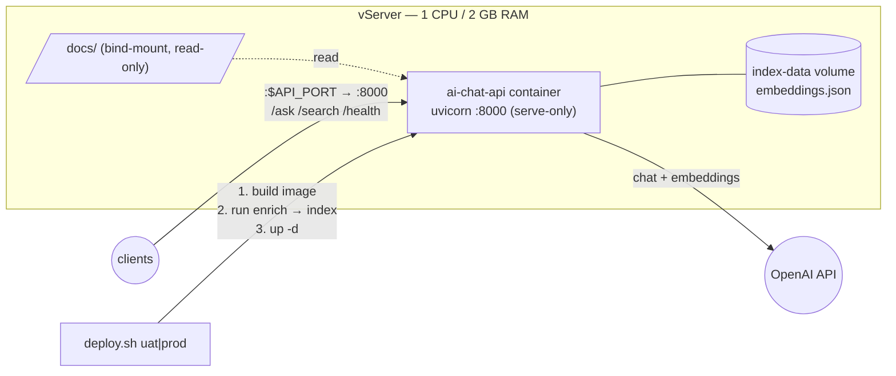

# AI Chat API — vServer deployment (UAT + PROD)

Runs the **docs-vector-search** service ([`tools/docs-vector-search`](../../../tools/docs-vector-search)) — the OpenAI Graph-RAG "AI Chat API" — on a vServer via Docker Compose. **1 CPU / 2 GB RAM**, identical sizing for UAT and PROD.



## Why 1 CPU / 2 GB is enough
The heavy compute (LLM + embeddings) is **offloaded to OpenAI** — the container only parses ~37 markdown docs, holds their vectors in memory (tiny), and runs FastAPI + a numpy cosine rank. Peak local memory is well under 2 GB; 1 vCPU comfortably serves the request rate this internal API sees. The RAM headroom mostly covers the Python + numpy + tiktoken footprint and the index in memory.

## Files

| File | Purpose |
|------|---------|
| `docker-compose.yml` | the service, capped at 1 CPU / 2 GB, serve-only, docs bind-mount + persisted index volume, health + log caps |
| `.env.uat.example` / `.env.prod.example` | per-env config templates — copy to `.env.uat` / `.env.prod` and fill the OpenAI key |
| `deploy.sh` | `./deploy.sh uat|prod` — build → build/refresh index → start |
| `.gitignore` | keeps the real `.env*` (secrets) out of git |

## Prerequisites (on the vServer)
- Docker Engine + **Docker Compose v2** (`docker compose`, not `docker-compose`).
- The repo checked out (the service builds from `tools/docs-vector-search` and mounts `docs/` — both are relative to the repo root, three levels up).
- An OpenAI key (the same `LEO_OPENAI_API_KEY` used in CI).

## Deploy

```bash
cd deployments/document/ai-chat-api

# 1. Configure the environment (once per env)
cp .env.uat.example .env.uat      # then edit: set LEO_OPENAI_API_KEY (+ model/port if needed)
cp .env.prod.example .env.prod

# 2. Deploy
./deploy.sh uat                   # UAT  → http://<host>:8081
./deploy.sh prod                  # PROD → http://<host>:8080
```

`deploy.sh` copies `.env.<env>` → `.env`, then: builds the image → **builds/refreshes the vector index** into the `index-data` volume (`run --rm … python -m src.enrich`, real OpenAI calls, idempotent) → starts a **serve-only** container. Splitting the index build from serving keeps startup fast and the healthcheck green (the full build can take several minutes).

## Endpoints

| Endpoint | Body | Returns |
|----------|------|---------|
| `POST /ask` | `{question, top_k?, hops?}` | grounded answer + cited sources |
| `POST /search` | `{query, top_k?}` | ranked docs (no LLM) |
| `GET /health` | — | readiness, loaded doc count, models |

```bash
curl -s http://localhost:8081/health
curl -s http://localhost:8081/ask -H 'content-type: application/json' -d '{"question":"What is CIR?"}'
```

## UAT vs PROD

| | UAT | PROD |
|---|-----|------|
| Compose project | `ai-chat-api-uat` | `ai-chat-api-prod` |
| Container | `ai-chat-api-uat` | `ai-chat-api-prod` |
| Host port | `8081` | `8080` |
| Resources | 1 CPU / 2 GB | 1 CPU / 2 GB |

Both run on the same box safely (distinct project names, container names, ports, and `index-data` volumes are namespaced per compose project).

## Operations

- **Refresh the index** (after `docs/**` changes): re-run `./deploy.sh <env>` — it rebuilds the index and restarts (the server loads the index once at startup, so a restart is required to pick up a new index).
- **Logs:** `docker logs -f ai-chat-api-<env>` (capped at 3 × 10 MB).
- **Health/restart:** `docker inspect --format '{{.State.Health.Status}}' ai-chat-api-<env>`; `docker compose -p ai-chat-api-<env> restart`.
- **Stop:** `docker compose -p ai-chat-api-<env> down` (add `-v` to also drop the index volume).

## Behind the reverse proxy

Expose it through the repo's existing proxy (`deployments/proxy`) rather than the raw port. Example nginx location:

```nginx
location /ai-chat/ {
    proxy_pass http://127.0.0.1:8080/;   # PROD; 8081 for UAT
    proxy_set_header Host $host;
    proxy_read_timeout 120s;             # /ask can take a while on slower models
}
```

## Notes

- The OpenAI key is **only** in `.env.<env>` on the vServer (gitignored) — mirror it from your secrets manager; don't commit it.
- Model per env: set `LEO_OPENAI_MODEL_NAME` in the env file (chat model); `EMBED_MODEL` for embeddings.
- If first-boot index build cost/latency is a concern, seed the `index-data` volume from the CI `docs-embeddings-index` artifact instead of running enrich on the box.
