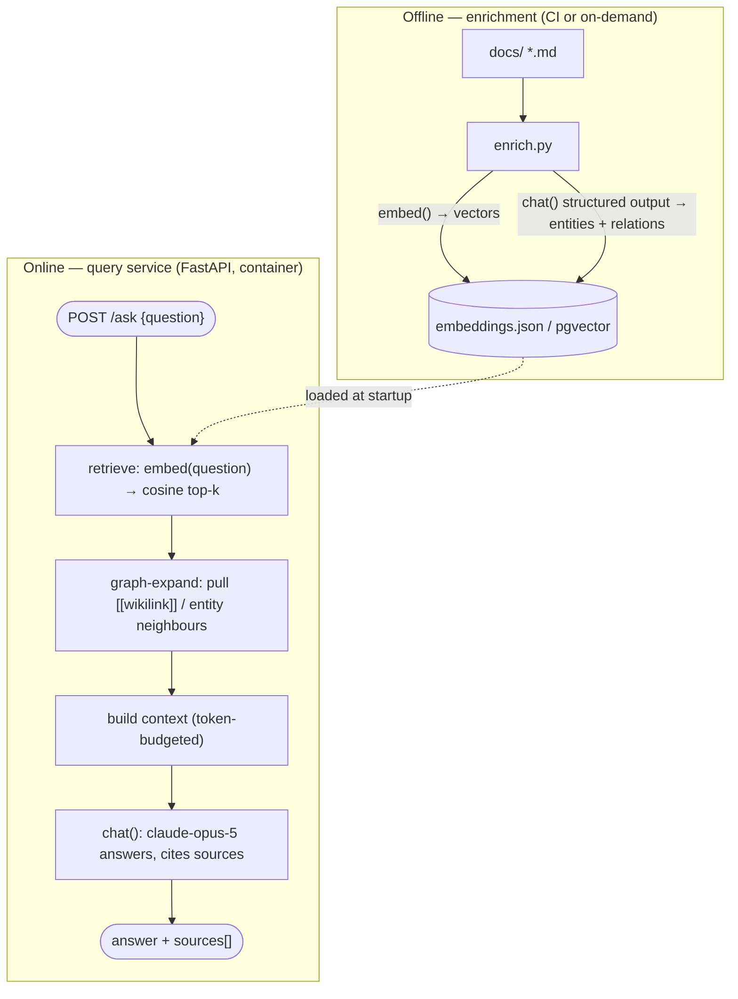

# Implementation Plan — AI-Agent Vector Search over the Docs Corpus

**Goal:** Stand up an **AI agent that answers questions over the LEO Customer 360 knowledge corpus** (`docs/`) with semantic retrieval and cited sources — the same architecture as the reference project at `C:\vault-graph`, adapted to this repo's stack and deployment tooling.

**Reference:** `C:\vault-graph` — a **Graph-RAG** service over an Obsidian vault. Its pipeline:

```
markdown corpus
   │  enrich.py  ── embeds each note (Vertex text-embedding-005, cached as JSON)
   │             ── extracts entities/typed relations via Gemini, writes an %% ai-graph %% block
   ▼
agent.py  ── embed question → cosine-rank notes → expand 1 hop along [[wikilinks]]
             → budget a context prompt → answer with Gemini, cite [[notes]]
   ▼
server.py ── one FastAPI process serves /ask, /v1/chat/completions, /v1/embeddings, /health
             (the graph is loaded once at startup and reused)
```

Retrieval is plain **cosine similarity over an in-memory numpy matrix** (`agent.py::rank`), plus a **graph-expansion** step that pulls in wiki-linked neighbours of the top hits (`agent.py::expand`) so answers can follow links the raw vectors miss. Enrichment is **idempotent** via a content hash over the human text (unchanged notes skip the embedder). Served as one Docker container; deployable to Cloud Run / GKE with workload-identity auth.

**Deliverable of this plan:** a `docs-vector-search` service you can run locally and deploy, answering `POST /ask {"question": "..."}` → grounded answer + source doc list.

---

## 1. Executive summary

| Decision | Choice | Rationale |
|---|---|---|
| Corpus | The repo's `docs/` markdown (same corpus as the [Quartz docs site](quartz-docs-site-plan.md)) | One source of truth; the docs site is the human view, this is the AI/programmatic view |
| Architecture | Mirror vault-graph: **enrich → embed → cosine-retrieve → graph-expand → LLM-answer**, one FastAPI service | Proven, small, easy to operate; graph-expansion measurably improves recall on linked docs |
| Answer/synthesis model | **`claude-opus-5`** via the Anthropic SDK (default); `claude-sonnet-5`/`claude-haiku-4-5` for cost | This environment's default for new AI apps; adaptive thinking + streaming + structured outputs |
| Embeddings | A dedicated embeddings model behind a `embed()` seam — **Voyage AI `voyage-3`** (recommended) *or* Vertex `text-embedding-005` (faithful mirror) *or* a local model | **Anthropic has no first-party embeddings endpoint** — this must be a separate provider |
| Vector store | **Phase 1:** JSON embeddings cache + in-memory cosine (exact mirror). **Phase 2:** `pgvector` in the existing PostgreSQL | Ship fast with zero new infra; graduate to pgvector for scale + tenant scoping |
| Home | New self-contained service `tools/docs-vector-search/` (mirrors `tools/vault-graph/`) | Clean separation; optionally mount `/ask` behind the existing `customer360-api` gateway |
| Deploy | Dockerfile + an entry in `deployments/docker-compose*`, wired via the existing deploy scripts | Reuses this repo's proven CD path |

The design is **provider-neutral at the seams**: `chat()` and `embed()` are the only two functions that touch an external model, so you can start on Claude + Voyage and swap either without touching the retrieval/graph code.

---

## 2. Target architecture



**Two model touch-points, both isolated:**
- `embed(texts) -> list[vector]` — Voyage / Vertex / local. Used for documents (at enrich time) and the query (at ask time).
- `chat(system, messages, schema?) -> text|object` — Claude via the Anthropic SDK. Used for entity/relation extraction (structured) and answer synthesis (streamed).

Everything between them — ranking, graph expansion, context budgeting — is plain Python over your own data, identical in spirit to `agent.py`.

---

## 3. Component design (adapted from vault-graph)

### 3.1 `enrich.py` — build the index
- **Load** every `docs/**/*.md`, strip a machine-managed block (see below) to get the *human text*; hash it. Skip unchanged docs (idempotent, like the reference).
- **Embed** each doc's human text with `embed(..., task="document")`; cache vectors keyed by doc path + content hash.
- **Extract** entities + typed relations with `chat(..., schema=GRAPH_SCHEMA)` (structured output — `output_config.format`, see §4). Write them back into each `.md` under a fenced, machine-managed region, e.g.:
  ```markdown
  <!-- ai-graph:start -->
  entities: [Identity Resolution, tenant_id, RLS, graph_edges]
  relations:
    - tenant_id — scopes — RLS policy
    - resolver.py — implements — Identity over-merge
  <!-- ai-graph:end -->
  ```
  > **Markdown-comment delimiters** (not `%% %%`) so the block is invisible in the rendered Quartz docs site — the two plans share the corpus.
- **Flags:** `--dry-run` (preview), `--no-extract` (embeddings only, no LLM calls), `--vault docs` (source dir), matching the reference's ergonomics.

### 3.2 `retriever.py` — cosine + graph expand
- `rank(qvec, docs, k)` — normalized matrix · normalized query, top-k (verbatim shape of `agent.py::rank`).
- `expand(seeds, docs, hops)` — add neighbours reachable via markdown links **and** shared extracted entities, up to `hops` (default 1). Entity-overlap expansion is the CDP-doc analogue of vault-graph's `[[wikilink]]` graph, since these docs use fewer wiki-links.
- `build_context(docs, char_budget=24000)` — title + entities + relations + body per doc, truncated to a budget (same pattern as the reference).

### 3.3 `agent.py` — answer
- `query(question, top_k=6, hops=1)`: `embed` the question (`task="query"`) → `rank` → `expand` → `build_context` → `chat()` with a grounding system prompt: *answer only from the provided docs, cite the doc titles you used, say so plainly if the docs don't contain the answer.*
- Return `{ "answer": str, "sources": [{"path", "score"}], "used_docs": [...] }`.
- CLI entry (`python -m docs_vector_search.agent "question"`) + interactive REPL, like the reference.

### 3.4 `server.py` — serve
FastAPI + uvicorn; load the index once at startup, reuse per request.

| Endpoint | Purpose |
|---|---|
| `POST /ask` | `{question, top_k?, hops?}` → grounded answer + sources (streams the answer) |
| `POST /search` | `{query, top_k?}` → ranked doc hits **without** an LLM call (cheap semantic search) |
| `GET /health` | readiness + loaded doc count + index build time |

`/search` is a useful, LLM-free addition over the reference — pure vector search for autocomplete / "related docs" widgets.

---

## 4. Models, providers, and the Anthropic SDK

**Answer synthesis & extraction — Claude via the official `anthropic` SDK.** Do **not** use an OpenAI-compatible shim (the reference used one only to reach Gemini).

- Default model **`claude-opus-5`**; expose `CHAT_MODEL` so ops can drop to `claude-sonnet-5` (cheaper, near-Opus quality) or `claude-haiku-4-5` (cheapest — fine for the enrichment/extraction pass).
- **Answer path:** stream it — `client.messages.stream(model=CHAT_MODEL, max_tokens=16000, thinking={"type":"adaptive"}, ...)` and read `get_final_message()`. Streaming avoids HTTP timeouts on long answers.
- **Extraction path:** structured output — `client.messages.parse(..., output_config={"format": {...}})` (or a Pydantic model) so entities/relations validate against a schema and don't need regex parsing.
- **Auth:** the SDK resolves `ANTHROPIC_API_KEY`, then `ANTHROPIC_AUTH_TOKEN`, then an `ant auth login` profile — a bare `anthropic.Anthropic()` works once a profile exists. If LEO-CDP runs on GCP and wants Claude through Vertex, swap the client for `AnthropicVertex(project_id=..., region=...)` — same `messages` surface, no other code change.

**Embeddings — a separate provider (Anthropic has none).** Put it behind `embed()` and pick one:

| Option | Model | When |
|---|---|---|
| **Voyage AI** (recommended) | `voyage-3` / `voyage-3-large` | Anthropic-aligned stack; strong retrieval quality; simple API key |
| Vertex (faithful mirror) | `text-embedding-005` | Already the reference's choice; use if LEO-CDP is on GCP w/ ADC |
| Local / self-hosted | `nomic-embed-text` (Ollama) or `sentence-transformers` | Zero external calls; keeps the corpus fully in-house |

**Consistency rule:** whichever you pick, **documents and queries must be embedded by the same model/version**, and the cache must be invalidated if the embedding model changes (key the cache by model id + content hash).

---

## 5. Storage: JSON now, pgvector later

**Phase 1 — JSON cache + in-memory numpy (exact mirror).** For ~35 docs this is instant and needs no infra. `data/embeddings.json` holds `{path, model, content_hash, vector, entities, relations}`; the service loads it into a numpy matrix at startup.

**Phase 2 — `pgvector` in the existing PostgreSQL.** When the corpus grows or you want SQL-side filtering, add a `doc_embeddings` table with a `vector` column + HNSW index. This also lets the retriever run `ORDER BY embedding <=> :qvec LIMIT k` in the DB instead of in memory.

> **Multi-tenancy carry-over from the code review.** The security review of the Python services found the tenant boundary (Postgres RLS on `app.tenant_id`) bypassable in several ways. **If this search ever indexes tenant-scoped or customer data** (not just public product docs), apply the same lessons *here from day one*: carry a `tenant_id` column on `doc_embeddings`, enable RLS on it, and **never** let the cache/response layer serve one tenant's vectors or answers to another (the review's cache-key leak, `cache.py:140`, is the exact failure to avoid). For a **public docs** corpus this doesn't apply — but decide the corpus's sensitivity explicitly before Phase 2.

---

## 6. Repo layout & integration

```
leo-customer360/
├─ docs/                              ← corpus (shared with the Quartz plan)
└─ tools/docs-vector-search/          ← NEW self-contained service (mirrors tools/vault-graph)
   ├─ src/
   │  ├─ enrich.py      # build/refresh the index
   │  ├─ retriever.py   # cosine + graph expand
   │  ├─ agent.py       # query() + CLI/REPL
   │  ├─ providers.py   # chat() [Anthropic] + embed() [Voyage/Vertex/local]
   │  └─ server.py      # FastAPI: /ask /search /health
   ├─ data/embeddings.json           # Phase 1 cache (gitignored or committed — decide)
   ├─ requirements.txt   # anthropic, fastapi, uvicorn, numpy, python-frontmatter, httpx, (voyageai|google-cloud-aiplatform)
   ├─ Dockerfile
   ├─ .env.example       # CHAT_MODEL, EMBED_PROVIDER, ANTHROPIC_API_KEY, VOYAGE_API_KEY, ...
   └─ README.md
```

**Integration options for `/ask`:**
1. **Standalone service** (recommended MVP) — runs on its own port; call it directly.
2. **Behind the gateway** — proxy `/ask` and `/search` through the existing `customer360-api` so it inherits auth, rate-limiting, and tenant context.

Wire it into `deployments/` the same way other services are: a service block in the compose file + an entry in the deploy script; refresh the index in CI (or a scheduled job) whenever `docs/**` changes — the natural companion trigger to the Quartz docs-site build.

---

## 7. Config & secrets

`.env` (kept out of git), mirroring the reference's `.env` shape:

```
CHAT_MODEL=claude-opus-5
EMBED_PROVIDER=voyage            # voyage | vertex | local
EMBED_MODEL=voyage-3
ANTHROPIC_API_KEY=sk-ant-...     # or use an `ant auth login` profile / Vertex ADC
VOYAGE_API_KEY=...               # if EMBED_PROVIDER=voyage
# VERTEX_PROJECT=... VERTEX_LOCATION=us-central1   # if EMBED_PROVIDER=vertex
TOP_K=6
HOPS=1
CONTEXT_CHAR_BUDGET=24000
```

Never commit keys. In GKE/Cloud Run use workload identity / mounted secrets rather than a baked `.env` (the reference makes the same note).

---

## 8. Phased implementation checklist

**Phase 0 — scaffold (½ day)**
- [ ] Create `tools/docs-vector-search/` with the layout above; `requirements.txt`; `.env.example`.
- [ ] `providers.py`: implement `chat()` (Anthropic SDK) and `embed()` (chosen provider) behind clean signatures.

**Phase 1 — MVP, faithful mirror (1–2 days)**
- [ ] `enrich.py`: load `docs/**/*.md` → embed (cached JSON) → structured entity/relation extraction → write the `<!-- ai-graph -->` block. Support `--dry-run`, `--no-extract`.
- [ ] `retriever.py`: `rank`, `expand` (links + entity overlap), `build_context`.
- [ ] `agent.py`: `query()` + CLI + REPL, grounded-answer prompt with citations.
- [ ] `server.py`: `/ask` (streamed), `/search`, `/health`; load index once at startup.
- [ ] Dockerfile; run locally: `docker compose up` → `curl :PORT/ask -d '{"question":"How does identity resolution merge profiles?"}'`.

**Phase 2 — production hardening (as needed)**
- [ ] Move the store to `pgvector`; add `tenant_id` + RLS **iff** the corpus is sensitive (see §5).
- [ ] Wire into `deployments/` (compose + deploy script); CI job to re-enrich on `docs/**` change.
- [ ] Add eval: a small `questions.jsonl` with expected source docs; assert retrieval hits + answer grounding in CI.
- [ ] Optional: proxy `/ask` behind `customer360-api` for shared auth/rate-limit.

---

## 9. Verification

- `GET /health` returns `loaded_docs == count(docs/**/*.md)` (minus ignored) and a non-null build time.
- `POST /search {"query":"tenant isolation"}` returns the code-review + RLS docs at the top.
- `POST /ask` returns an answer that **cites real doc titles** and declines gracefully when the corpus lacks the answer (test with an out-of-corpus question).
- Re-running `enrich.py` with no doc changes performs **zero** embedding/LLM calls (idempotency holds).

---

## 10. Risks & decisions to confirm

| Risk / decision | Note |
|---|---|
| **Embedding provider** | Anthropic has none — pick Voyage (recommended) / Vertex / local. Blocks Phase 0. |
| **Corpus sensitivity** | Public docs → no tenant scoping needed. Tenant/customer data → apply RLS + tenant-keyed cache from the start (see §5). **Confirm before Phase 2.** |
| **Answer model cost** | `claude-opus-5` for quality vs `claude-sonnet-5`/`haiku` for volume — expose via `CHAT_MODEL`. |
| **Cache-key isolation** | If serving multiple tenants, the response/embedding cache key **must** include `tenant_id` — this is the exact bug (`cache.py:140`) the code review flagged. |
| **Index freshness** | Decide the re-enrich trigger: CI on `docs/**` change, a schedule, or manual. |
| **Graph signal** | These docs have fewer `[[wikilinks]]` than an Obsidian vault; entity-overlap expansion carries the graph — validate it adds recall on this corpus, tune `hops`. |
| **Corpus scope** | Include `research-papers/`, PDFs (needs text extraction), code-review report? PDFs need a text step before embedding. |

---

## Appendix — reference facts (captured 2026-09-05)

- `C:\vault-graph` — Python; `tools/vault-graph/src/{enrich,agent,retriever→rank/expand,server,proxy,vertex_client,gcs_vault}.py`; deps `openai, google-auth, requests, python-dotenv, python-frontmatter, numpy, fastapi, uvicorn, httpx, google-cloud-storage`.
- Reference retrieval: `rank()` = normalized numpy matrix · normalized query vector, `argsort` top-k; `expand()` = 1-hop `[[wikilink]]` neighbours; `build_context()` char-budgeted at 24000.
- Reference models: chat `google/gemini-2.5-flash` (OpenAI-compatible Vertex surface); embeddings `text-embedding-005` (native `:predict`). Embeddings cached in `vault/.vault-graph/embeddings.json` (~21 MB), idempotent via content hash over human text.
- Reference serving: one uvicorn process, graph loaded once; `/ask`, `/v1/chat/completions`, `/v1/embeddings`, `/health`; ADC mounted read-only in Docker; GKE/Cloud Run via workload identity.
- **This build's models (per the `claude-api` skill):** synthesis/extraction via the official `anthropic` SDK, default `claude-opus-5` (adaptive thinking, streaming, `output_config.format` for structured extraction); embeddings via a **separate** provider (Anthropic has no embeddings endpoint).
- Target corpus: `docs/` — 35 markdown files across `data-sources/`, `database/`, `pandoc-notes/`, `release-documents/`, `research-papers/`, `code-review/` (see the [Quartz plan](quartz-docs-site-plan.md) for the full inventory).
