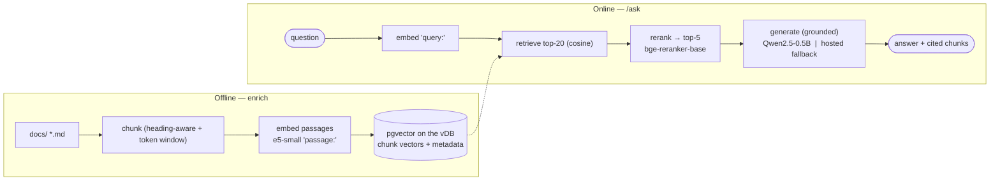

# Implementation Plan — Local-Model RAG on the 1 vCPU / 2 GB vServer

**Goal:** Run the **AI Chat API** ([`tools/docs-vector-search`](../../tools/docs-vector-search)) with **local models** — embedding + reranking + generation in-process on the 1 vCPU / 2 GB box — replacing the hosted OpenAI calls, while keeping a hosted **fallback** for generation when RAM is tight.

**Targets:** the existing service (its `chat()` / `embed()` seams in `providers.py`) and the [`document-agent` vServer deploy](../document-agent/README.md) (1 CPU / 2 GB).

**Corpus reality:** `docs/` has **Vietnamese and English** docs (e.g. `SAE-CIR-VN.md`, `campaign-slide-VN.md`), so the default embedder must be multilingual.

---

## 1. Component choices (for a 1 vCPU / 2 GB box)

| Component | Model | Size | Runtime | Why |
|-----------|-------|------|---------|-----|
| **Embed (default — VN+EN)** | `intfloat/multilingual-e5-small` | ~470 MB | fastembed / ONNX, in-process | trained for retrieval; use `query:` / `passage:` prefixes; 384-dim |
| Embed (EN-only alt) | `BAAI/bge-small-en-v1.5` | ~130 MB | fastembed / ONNX | best English retrieval at this size; 384-dim |
| **Rerank (biggest quality win)** | `BAAI/bge-reranker-base` | ~280 MB | fastembed `TextCrossEncoder` / ONNX | cross-encode top-20 → top-3–5; +100–300 ms on CPU |
| **Generate (default)** | `Qwen2.5-0.5B-Instruct` Q4_K_M (GGUF) | ~400–600 MB | `llama-cpp-python` (CPU) | best tiny model for grounded Q&A + Vietnamese; Apache-2.0 |
| Generate (fallback) | OpenAI / GreenNode MaaS | — | HTTP (existing seam) | when RAM is tight, offload generation and keep embed+rerank local |
| **Vector store** | **pgvector** on the existing VNGCloud **vDB** (PostgreSQL 15) | off-box | managed Postgres | reuses [`deployments/postgres`](../../deployments/postgres); HNSW cosine index; separate UAT/PROD instances; frees the app box's RAM |

**Licensing:** Qwen2.5 (Apache-2.0), bge/e5 (MIT/Apache) — all fine for commercial use.

---

## 2. Why this changes the pipeline (chunking + rerank)

The current service embeds **whole documents** (37 docs) and ranks them with in-memory numpy cosine. A quality local RAG needs two structural additions:

1. **Chunking** — split docs into passages so retrieval and reranking operate on granular, relevant spans (a 15k-token research paper shouldn't be one vector). More vectors (hundreds–thousands of chunks) → store them in **pgvector** on the existing vDB.
2. **Reranking** — a cross-encoder re-scores the top-20 retrieved chunks against the query and keeps the top 3–5. On tiny generators this matters **more than the LLM**: tight, correct context is what keeps a 0.5B model from hallucinating.



---

## 3. Component design (mapped to the existing code)

### 3.1 Chunking — `chunk.py` (new)
- Split each doc into passages: **heading-aware** first (split on `#`/`##`), then a **~400-token window with ~50-token overlap** for long sections.
- Each chunk carries `{doc_path, title, heading_path, ordinal, text}`; the chunk id is `path#ordinal`.
- e5 needs the `passage:` prefix at embed time; the reranker/LLM see the raw chunk text.

### 3.2 Embedding — extend `embed()` (the seam returns)
Re-introduce `EMBED_PROVIDER` (removed in the OpenAI-only pass) with local backends behind the same `embed(texts, task)`:
- `e5-small` (default): fastembed `TextEmbedding("intfloat/multilingual-e5-small")`; prepend `query:` when `task="query"`, `passage:` when `task="document"`.
- `bge-small`: fastembed `TextEmbedding("BAAI/bge-small-en-v1.5")` (no prefixes).
- `openai` (kept): existing `text-embedding-3-small` for a hosted option.

### 3.3 Vector store — `store.py` (new) → pgvector on the vDB
Use **pgvector** in the existing VNGCloud **vDB** (PostgreSQL 15, provisioned by [`deployments/postgres`](../../deployments/postgres)). This moves the index **off** the 2 GB app box and reuses infra we already run — a strong reason to prefer it over an in-process store here.
- **Extension (once per DB):** `CREATE EXTENSION IF NOT EXISTS vector;` — apply via `deployments/postgres/run-sql.sh`.
- **Schema** (dedicated `rag` schema so it never collides with product tables):
  ```sql
  CREATE TABLE rag.doc_chunks (
    id           text PRIMARY KEY,        -- "<path>#<ordinal>"
    path         text NOT NULL,
    title        text,
    heading      text,
    ordinal      int,
    content_hash text,
    text         text NOT NULL,
    embedding    vector(384) NOT NULL     -- e5-small / bge-small dim
  );
  CREATE INDEX ON rag.doc_chunks USING hnsw (embedding vector_cosine_ops);
  ```
- **Retrieve:** `SELECT id, path, title, text FROM rag.doc_chunks ORDER BY embedding <=> :qvec LIMIT :n;` (cosine distance; `n = RETRIEVE_TOP_N = 20`).
- **Client:** `psycopg` + the `pgvector` adapter; connection from env (below). HNSW gives strong recall on a small corpus; switch to IVFFlat only at large scale.
- **Per-env:** UAT app → UAT vDB, PROD app → PROD vDB (the two Terraform-provisioned instances).

### 3.4 Reranker — `reranker.py` (new)
- fastembed `TextCrossEncoder("BAAI/bge-reranker-base")`; `rerank(query, [chunk_texts]) -> scores`; keep top `RERANK_TOP_K` (default 5).
- Gated by `RERANK_ENABLED` (default `true`) so it can be dropped first under RAM pressure.

### 3.5 Generator — extend `chat()` (the seam returns)
`CHAT_PROVIDER` with:
- `qwen-local` (default target): `llama-cpp-python` loads `Qwen2.5-0.5B-Instruct-Q4_K_M.gguf`; **strict grounded system prompt** — *"Answer only from the context below; if it's not there, say you don't know. Cite the source titles."* Low temperature, small `max_tokens`.
- `openai` / `greennode` (fallback): existing HTTP path; GreenNode is OpenAI-compatible, so it reuses the OpenAI client with a `base_url` override.

### 3.6 Serve — `server.py` unchanged in shape
Same `/ask`, `/search`, `/health`; `/ask` now runs retrieve → rerank → generate. Load models **once at startup** (fastembed + llama model are the expensive part) and reuse.

---

## 4. Config (env-driven seams)

```
# Embedding
EMBED_PROVIDER=e5-small          # e5-small | bge-small | openai
EMBED_MODEL=intfloat/multilingual-e5-small

# Reranking
RERANK_ENABLED=true
RERANK_MODEL=BAAI/bge-reranker-base
RETRIEVE_TOP_N=20
RERANK_TOP_K=5

# Generation
CHAT_PROVIDER=qwen-local         # qwen-local | openai | greennode
QWEN_MODEL_PATH=/app/models/Qwen2.5-0.5B-Instruct-Q4_K_M.gguf
# Fallback (hosted): LEO_OPENAI_API_KEY, LEO_OPENAI_MODEL_NAME, OPENAI_BASE_URL (GreenNode)

# Chunking
CHUNK_TOKENS=400
CHUNK_OVERLAP=50

# Vector store — pgvector on the VNGCloud vDB (per-env: UAT vDB / PROD vDB)
PG_HOST=...            # vDB host (from deployments/postgres outputs)
PG_PORT=5432
PG_DATABASE=...
PG_USER=...
PG_PASSWORD=...        # secret — keep in .env only
PG_SCHEMA=rag
RETRIEVE_TOP_N=20

# Model cache (fastembed downloads ONNX here)
FASTEMBED_CACHE_DIR=/app/models/fastembed
```

---

## 5. RAM budget & tiered profiles (the 2 GB constraint)

| Profile | Resident (models) | Fits 2 GB? | Use |
|---------|-------------------|-----------|-----|
| **A — Hybrid (recommended default)** | e5 (~500 MB) + reranker (~300 MB) ≈ **0.8 GB**; generation **hosted** | ✅ comfortable | retrieval + rerank local, LLM on OpenAI/GreenNode |
| **B — Full local** | + Qwen 0.5B (~600 MB) ≈ **1.4 GB** | ⚠️ tight | fully offline; needs **swap**; drop reranker first if OOM |
| C — Minimal local | e5 only (~500 MB); rerank off; generation hosted | ✅ roomy | lowest RAM |

Plus ~200–400 MB for Python + onnxruntime + FastAPI. **The vector index lives in the vDB (pgvector), off the app box** — it no longer competes for the 2 GB. **Recommendation:** ship **Profile A** as the default on 2 GB (safe, and generation quality stays high), and make **Profile B** an opt-in with a **2 GB swapfile** configured on the vServer. If Profile B OOMs, the order to shed is: reranker → then generation to hosted.

> The seams make this a **config change, not a code change** — the same image runs A, B, or C by env.

---

## 6. Dependencies & image

Add to `requirements.txt`:
```
fastembed>=0.4            # ONNX embeddings + TextCrossEncoder reranker (pulls onnxruntime)
llama-cpp-python>=0.3     # CPU GGUF generation (Qwen)  — Profile B only
psycopg[binary]>=3.2      # vDB (PostgreSQL) client
pgvector>=0.3             # pgvector adapter for psycopg
# keep: openai, tiktoken (hosted fallback), fastapi, uvicorn, numpy, python-frontmatter, httpx
```

**Model weights (~1–1.4 GB)** — do **not** bake into the image (keeps it lean, avoids re-pushing on code changes). Instead mount a **`models` volume** and fetch on first boot:
- fastembed auto-downloads its ONNX models to `FASTEMBED_CACHE_DIR`.
- the Qwen GGUF is pulled once (huggingface-cli or curl) into `QWEN_MODEL_PATH`.

`llama-cpp-python` needs a C/C++ toolchain to build in `python:3.12-slim` — either add build deps in a builder stage or use a prebuilt CPU wheel; only needed for Profile B.

---

## 7. Deployment impact (`document-agent/`)

- **Compose:** add a `models` named volume (`/app/models`), set `FASTEMBED_CACHE_DIR` + `QWEN_MODEL_PATH`, keep the **1 CPU / 2 GB** limits. For Profile B, document adding a **2 GB swapfile** on the host (`fallocate`/`swapon`) — container memory limit stays 2 GB but swap gives headroom.
- **deploy.sh:** add a one-time model-fetch step (into the volume) before `up`; the enrich step now chunks + embeds locally (no API cost) and **upserts chunks into the vDB**.
- **vDB (pgvector):** one-time `CREATE EXTENSION vector` + the `rag.doc_chunks` DDL per env via `deployments/postgres/run-sql.sh` (UAT vDB and PROD vDB separately). The app connects with the vDB creds in `.env.<env>`; the index lives in the managed DB, so it **does not count against the app's 2 GB**. **Prerequisite:** confirm the VNGCloud vDB allows the `vector` extension — managed Postgres sometimes gates extensions; if it's unavailable, request it or run a pgvector-enabled Postgres.
- **Latency on 1 vCPU:** embed query ~ms; rerank 20 chunks ~100–300 ms; Qwen 0.5B generation a few tokens/s → answers in a few seconds. Single CPU ⇒ **serialize** requests (low concurrency); acceptable for an internal API. Hosted generation (Profile A) is faster and frees the CPU.

---

## 8. Phased rollout

**Phase 1 — local retrieval (biggest correctness win, safe RAM).**
- [ ] `chunk.py` (heading + token-window chunking).
- [ ] `embed()` → add `e5-small` (fastembed, prefixes); default `EMBED_PROVIDER=e5-small`.
- [ ] Enable pgvector on the vDB (`CREATE EXTENSION vector` + `rag.doc_chunks` DDL via `run-sql.sh`); `store.py` upserts chunks+vectors; `retriever` runs the `<=>` top-N query.
- [ ] Keep generation **hosted** (Profile A). Ship + measure retrieval quality vs the whole-doc baseline.

**Phase 2 — local reranking.**
- [ ] `reranker.py` (bge-reranker-base); wire retrieve-top-20 → rerank → top-5. `RERANK_ENABLED=true`.
- [ ] Measure rerank lift + latency + RAM. Still Profile A.

**Phase 3 — local generation (full local).**
- [ ] `chat()` → add `qwen-local` (llama-cpp-python, GGUF, strict grounded prompt).
- [ ] Configure swap; run Profile B; measure RAM/latency/quality. Keep hosted fallback (`CHAT_PROVIDER=openai|greennode`) one env-flip away.

---

## 9. Verification & eval

- A small `questions.jsonl` (EN **and** VN) with expected source docs.
- Metrics: **recall@5** (retrieval), **rerank lift** (recall@5 before/after), answer **groundedness** (cites real chunks, declines when absent), **p50/p95 latency**, and **peak RSS** per profile.
- Gate each phase on: retrieval recall ≥ baseline, RSS within budget, latency acceptable.

---

## 10. Decisions to confirm

1. **Embedding:** `multilingual-e5-small` (recommended — the corpus has Vietnamese) vs `bge-small-en` (English-only, smaller/faster). 
2. **Default profile:** **A (hybrid)** on 2 GB vs **B (full local)** with swap. Recommend A default, B opt-in.
3. **vDB / pgvector:** confirm the VNGCloud vDB (PG 15) has the `vector` extension available; pick the embedding **dimension** (384 for e5 / bge-small) and index type (HNSW recommended).
4. **Hosted fallback:** keep OpenAI **and** GreenNode MaaS (OpenAI-compatible) selectable? Recommend yes — one `base_url`/key swap.
5. **Model delivery:** `models` volume + first-boot download (recommended) vs baking weights into the image.

---

## Appendix — model sources

- Embed: `intfloat/multilingual-e5-small`, `BAAI/bge-small-en-v1.5` (HF; via fastembed `TextEmbedding`).
- Rerank: `BAAI/bge-reranker-base` (HF; via fastembed `TextCrossEncoder`). *Note:* `bge-reranker-v2-m3` is stronger for Vietnamese but ~600 MB — too big here; `base` is the size/quality compromise.
- Generate: `Qwen2.5-0.5B-Instruct-GGUF` (Q4_K_M) (HF; via `llama-cpp-python`).
- Store: **pgvector** on the VNGCloud vDB (PostgreSQL 15) via `psycopg` + the `pgvector` adapter; DDL applied with `deployments/postgres/run-sql.sh`.
- Fits the [`docs-vector-search`](../../tools/docs-vector-search) seams (`chat()`/`embed()`) and the [`document-agent`](../document-agent/README.md) 1 CPU / 2 GB deploy.
