<!-- _class: lead -->

# Customer Identity Resolution (CIR)
## Trong nền tảng Customer 360

Tài liệu kỹ thuật tập trung vào `backend-system/identity_resolution`<br>
Cập nhật: 2026-08-28

---

## Nội dung

1. Phạm vi và mục tiêu
2. Mô hình dữ liệu và metadata
3. Luồng runtime thực tế
4. Matching, link và hợp nhất
5. Persona resolution
6. Tenant, PII và vận hành
7. Demo, giới hạn và tham chiếu mã nguồn

---

# 1. Phạm vi và mục tiêu

---

## CIR giải quyết vấn đề gì?

Một khách hàng có thể xuất hiện ở nhiều hệ thống và nhiều touchpoint:

- AppsFlyer: mobile attribution và install
- MoEngage: push / engagement
- Web Tracking hoặc GA4-style events: browser và cookie
- Core Banking, KYC, POS và các nguồn khác: tùy integration

Các nguồn này ghi nhận các `raw profile` khác nhau. CIR liên kết các raw
profile có cùng danh tính vào `master_profile_id` trong cùng `tenant_id` và
`domain`.

> Các nguồn ingestion là hệ thống bên ngoài phạm vi của package này. Package
> CIR nhận dữ liệu sau khi integration đã ghi vào staging.

---

## Kết quả của CIR

- `cdp_raw_profiles_stage`: hàng đợi raw profile đầu vào.
- `cdp_master_profiles`: hồ sơ golden/resolved.
- `cdp_profile_links`: lineage từ từng raw profile tới master profile.
- `status_code = 3`: raw profile đã được xử lý; `status_code = 1`: còn mới.
- Persona được tính sau khi master profile được tạo hoặc cập nhật.

Resolver xử lý theo phạm vi `tenant_id + domain`. Đây là phạm vi matching của
code, không phải một bước hợp nhất xuyên domain.

---

# 2. Mô hình dữ liệu và metadata

---

## Các bảng chính

| Bảng | Vai trò trong CIR |
|---|---|
| `cdp_raw_profiles_stage` | Landing zone; chứa identity, device, attribution, event payload và trạng thái xử lý |
| `cdp_master_profiles` | Golden profile; giữ scalar identity, các mảng device/ad/cookie và map external ID |
| `cdp_domain_profiles` | Thuộc tính theo domain trong `domain_attributes` JSONB, ví dụ `national_id`, `kyc_status` |
| `cdp_profile_links` | Quan hệ raw → master, gồm `match_score`, `match_method`, `status` |
| `cdp_profile_attributes` | Catalog và cấu hình matching/consolidation |
| `cdp_id_resolution_status` | Một dòng trạng thái throttle cho helper real-time; không phải bảng queue |

Các bảng persona mở rộng kết quả matching:

- `cdp_persona_archetypes`: archetype dùng chung theo tenant/domain/code.
- `cdp_customer_personas`: bản ghi match persona có version cho từng master.
- `cdp_persona_features`, `cdp_persona_score_details`: explainability.
- `cdp_persona_history`: lịch sử thay đổi persona có ý nghĩa.

---

## Metadata-driven, nhưng cần phân biệt catalog và runtime

Resolver đọc các dòng thỏa điều kiện:

```sql
SELECT attribute_internal_code,
       matching_rule,
       matching_threshold,
       consolidation_rule,
       consolidation_config
FROM customer360.cdp_profile_attributes
WHERE is_identity_resolution = TRUE
  AND status = 'ACTIVE'
  AND matching_rule IS NOT NULL
  AND matching_rule <> 'none';
```

Metadata là nơi cấu hình, nhưng code vẫn quyết định cách map dữ liệu:

- `RAW_PROFILE_COLUMNS` là tập cột mà resolver thực sự đọc từ staging.
- `SCALAR_MERGE_FIELDS` hiện chỉ gồm `full_name`, `email`, `phone_number`.
- `national_id` và `kyc_status` được đọc/ghi trong `cdp_domain_profiles`.
- Device, advertising và cookie ID được tích lũy vào các mảng trên master.
- `external_customer_id` được lưu trong `external_ids` theo `source_system`.

Vì vậy, thêm một dòng metadata không tự động làm mọi cột staging trở thành matching key nếu cột đó chưa được đưa vào projection và logic merge của resolver.

---

## Các rule hiện có trong seed SQL

| Attribute | Rule trong metadata | Lưu ở master / domain |
|---|---|---|
| `email` | `exact` | `cdp_master_profiles.email` |
| `phone_number` | `exact` | `cdp_master_profiles.phone_number` |
| `national_id` | `exact` | `cdp_domain_profiles.domain_attributes` |
| `external_customer_id` | `exact`, khóa theo source | `cdp_master_profiles.external_ids` JSONB |
| `device_id` | `exact`, so với `ANY(device_ids)` | `cdp_master_profiles.device_ids` TEXT[] |
| `advertising_id` | `exact`, so với `ANY(advertising_ids)` | `cdp_master_profiles.advertising_ids` TEXT[] |
| `cookie_id` | `exact`, so với `ANY(cookie_ids)` | `cdp_master_profiles.cookie_ids` TEXT[] |

`full_name` được catalog hóa nhưng `is_identity_resolution = FALSE`, vì tên
chung, đặc biệt tên Việt Nam, không đủ tin cậy để quyết định cùng một người.

### Trạng thái các rule fuzzy

Resolver có code cho `fuzzy_trgm` và `fuzzy_dmetaphone`, đồng thời PostgreSQL được bật `pg_trgm` và `fuzzystrmatch`. Tuy nhiên, các rule fuzzy và address được catalog trong seed hiện không nằm trong tập cột mà `RAW_PROFILE_COLUMNS`
đọc để match. Chúng không nên được trình bày là đường chạy fuzzy mặc định đang hoạt động trong production.

---

# 3. Luồng runtime thực tế

---

## Kiến trúc triển khai hiện tại



### Điểm quan trọng

- `backend-system/Dockerfile` chạy Dagster webserver/daemon và load CIR từ
  `backend-system/workspace.yaml`.
- Sensor phát `RunRequest()` mỗi `CIR_POLL_INTERVAL_SECONDS` (mặc định 30 giây).
  Mỗi op gọi daily drain, xử lý các batch tối đa `CIR_BATCH_SIZE` (mặc định
  5.000) cho đến khi staging hết dữ liệu.
- Dagster retry ở cấp op; resolver rollback transaction khi lỗi.

---

## Entry point thay thế và đường chưa được nối

| Entry point | Trạng thái |
|---|---|
| `dagster_defs.py` → sensor → job/op | Đường chạy chính của image `backend-system` |
| `daily_job.py` | Có thể gọi độc lập từ cron, Airflow hoặc CLI; được Dagster gọi trong runtime hiện tại |
| `worker.py` | Loop in-process thay thế, gọi trực tiếp `execute_in_process()`; không phải command trong Dockerfile hiện tại |
| `IdentityResolutionTrigger.attempt_trigger()` | Helper throttle bằng row lock; hiện không có production caller trong repository |
| PostgreSQL trigger `cdp_trigger_process_new_raw_profiles` | Không có định nghĩa trigger đang chạy trong SQL hiện tại |

Do đó, diagram chính không nối ingestion trực tiếp vào
`IdentityResolutionTrigger`. Nếu integration gọi helper này trong tương lai,
đó sẽ là một đường near-real-time bổ sung, không phải đường mặc định hiện tại.

---

## Một resolution batch làm gì?

```text
1. Đọc active rules từ cdp_profile_attributes
2. Lấy danh sách tenant từ sys_tenant
3. Với từng tenant, SET app.tenant_id
4. Đọc tối đa CIR_BATCH_SIZE raw profile có status_code = 1
5. Với từng raw profile:
   a. Tạo các điều kiện match từ metadata
   b. Tìm master cùng tenant và cùng domain
   c. Có match: insert link + cập nhật master
   d. Không match: tạo master + insert link NewMaster
   e. Tính persona best effort cho master vừa xử lý
   f. Đổi raw profile sang status_code = 3
6. COMMIT toàn bộ batch; lỗi thì ROLLBACK và raise
```

`run_resolution_batch()` dùng `return_details=True`: các điều kiện match được project thành cột `m_0`, `m_1`, ...; ứng viên có số điều kiện đúng cao nhất được chọn. Điều kiện được nối bằng `OR`, không phải yêu cầu mọi identifier
đều phải cùng đúng.

---

# 4. Matching, link và hợp nhất

---

## Quyết định match

Với mỗi raw profile, resolver:

1. Bỏ qua rule nếu raw value rỗng.
2. Tạo điều kiện tương ứng với kiểu field:
   - scalar exact: `master_column = raw_value`;
   - array identity: `raw_value = ANY(master_array)`;
   - external ID: `external_ids` chứa cặp `source_system → value`;
   - domain attribute: `EXISTS` trên `cdp_domain_profiles` của cùng domain.
3. Chỉ tìm trong `WHERE tenant_id = raw.tenant_id AND domain = raw.domain`.
4. Ghi `match_method` dạng `DynamicMatch:email,device_id` và
   `match_score = số điều kiện đúng / số điều kiện có giá trị`.

`match_score` là tín hiệu link theo các rule hiện tại, không phải mô hình xác
suất đã calibration. CIR hiện chưa có Bayesian, Fellegi-Sunter hay global
identity graph scoring. Link `NewMaster` được tạo với `match_score = NULL`.

---

## Cập nhật master profile

Khi match một master hiện có:

- `full_name`, `email`, `phone_number` được xử lý như scalar.
- `device_id`, `advertising_id`, `cookie_id` được append-distinct vào TEXT[].
- `external_customer_id` được ghi vào JSONB `external_ids` dưới key là
  `source_system`.
- `push_token` được ghi vào `push_tokens` theo source.
- `source_systems` được append-distinct.
- `communication_preferences` trong `event_payload` được merge vào JSONB nếu
  có.
- `national_id` và các domain value được upsert vào
  `cdp_domain_profiles.domain_attributes`.

Mọi thao tác link và update nằm trong cùng transaction với việc đổi trạng thái
raw profile.

---

## Consolidation policy: ý định metadata và hành vi hiện tại

Các strategy mà resolver hỗ trợ cho scalar là:

| Strategy | Hành vi |
|---|---|
| `overwrite` | Luôn lấy giá trị mới |
| `non_null` | Giữ giá trị hiện tại nếu đã có |
| `most_recent` | So sánh timestamp, ưu tiên giá trị mới hơn |
| `verified_first` | Ưu tiên giá trị có bằng chứng verified; fallback theo config |
| `verified_then_most_recent` | Verified trước, sau đó most recent |
| `source_priority` | Xếp hạng source không phân biệt hoa thường |
| `append_distinct` | Gộp giá trị/list, loại trùng |

Seed SQL đặt:

- `email`, `phone_number`: `verified_first`, fallback `most_recent`, với
  `kyc_status = verified` hoặc event `kyc-completed`.
- `national_id`: `non_null` trong domain JSONB.
- `external_customer_id`, `device_id`, `advertising_id`, `cookie_id`:   metadata có `source_priority`.
---

## Consolidation policy notes

Lưu ý implementation: các identity graph field nói trên hiện được cập nhật
bằng append-distinct hoặc ghi theo source key trong JSONB; `source_priority`
không được áp dụng để loại bỏ một device/ad/cookie hay thay thế giá trị
`external_ids` cũ trong `_link_and_update()`. Tài liệu không gọi đây là
priority enforcement cho graph cho tới khi code thực sự thực hiện điều đó.

---

## Idempotency và trạng thái queue

- Chỉ `status_code = 1` được resolver lấy vào batch.
- Sau khi link, persona và các cập nhật thành công, raw profile nhận
  `status_code = 3` và `processed_at = NOW()`.
- `cdp_profile_links` có `UNIQUE (tenant_id, raw_profile_id)` và matched link
  dùng `ON CONFLICT DO NOTHING`.
- Resolver không chuyển row sang `status_code = 2` trong code hiện tại, dù
  schema comment mô tả giá trị `2` là in-progress.
- Lỗi trong `run_resolution_batch()` rollback transaction và raise; Dagster
  retry op hoặc vòng gọi tiếp theo sẽ thử lại.

---

# 5. Persona resolution

---

## Persona là lớp hiểu khách hàng sau matching

Persona không quyết định raw profile có phải cùng một người hay không. Sau khi resolver đã có `master_profile_id`, `PersonaResolutionEngine.resolve_persona()` được gọi cho từng master:



Các component score là score heuristic 0-100, cấu hình runtime từ `cdp_persona_config` với cache TTL mặc định 60 giây. `persona_score` có trọng số cho các component tích cực và phần đảo chiều của risk score.

---

## Versioning và archetype dùng chung

- Một archetype dùng chung cho `(tenant_id, domain, persona_code)`.
- Mỗi lần recompute tạo một row mới trong `cdp_customer_personas` với
  `computed_version` tăng dần.
- Chỉ row mới nhất của master là `is_active = TRUE`.
- Database trigger cập nhật `matched_profile_count` trên archetype theo
  `COUNT(DISTINCT master_profile_id)` của các match active.
- `current_persona_id` trên master trỏ tới `persona_id` của match hiện tại,
  không trỏ trực tiếp tới archetype.

`match_score` trong `cdp_customer_personas` hiện là proxy từ
`confidence_score`; embedding/lookalike similarity chuyên dụng chưa được nối
vào computation.

---

## PII-safe persona label

### Input và trách nhiệm

- Resolver không hash PII. Integration phải chuẩn hóa/hash trước khi ghi nếu
  chính sách nguồn yêu cầu; script demo dùng SHA-256 sau trim/lowercase.
- `full_name`, `email`, `phone_number`, `national_id` trong demo là digest,
  không phải plaintext.
- `is_hashed = TRUE` yêu cầu `persona_name IS NOT NULL` bằng CHECK constraint.
- `resolver.py` tạo label deterministic khi raw profile có giá trị trông như
  SHA-256 digest.
- Persona engine tạo lại label cho mọi master bằng các input không phải PII,
  dùng `master_profile_id` làm seed ổn định.

Nếu có `GOOGLE_GENAI_API_KEY` thật, `persona.py` có thể gọi Gemini để tạo phần
label; prompt chỉ gửi domain và acquisition channel. SDK thiếu, key là placeholder, 
network lỗi hoặc timeout đều fallback về generator offline. LLM không được phép làm hỏng CIR batch.

---

# 6. Tenant, PII và vận hành

---

## Multi-tenant và multi-domain

- Resolver lấy tenant từ `sys_tenant`, sau đó gọi `SET app.tenant_id = <tenant>` trước các query tenant-scoped.
- SQL matching luôn thêm tenant và domain; domain là điều kiện bắt buộc của
  master lookup.
- Migration `001_harden_tenant_rls_policies.sql` bật và FORCE RLS cho các bảng
  CIR chính: master, raw stage, links, domain profiles, customer personas và
  persona archetypes.
- Các bảng explainability không tự mang `tenant_id`; chúng đi qua khóa
  `persona_id` của bản ghi persona.
- `cdp_id_resolution_status` là một row lock dùng chung, không có tenant
  column; đây là lý do helper throttle không phải tenant-isolated scheduler.

RLS là lớp bảo vệ bổ sung. Các integration vẫn phải truyền đúng tenant và
không được coi domain filter là thay thế cho authorization.

---

## Retry, lock và failure isolation

### Đường Dagster

- Sensor tạo run theo chu kỳ.
- Op có `RetryPolicy(max_retries=2, delay=10)`.
- Resolver commit sau khi hoàn tất các row trong batch; exception làm rollback.
- `PersonaResolutionEngine.resolve_persona()` bắt exception riêng và trả
  `None`, để lỗi persona không rollback phần matching đang chạy.

### Helper throttle hiện chưa được nối

`IdentityResolutionTrigger` dùng:

```sql
SELECT last_executed_at
FROM customer360.cdp_id_resolution_status
WHERE id = TRUE
FOR UPDATE NOWAIT;
```

Lock bận hoặc chưa đủ `throttle_seconds` (mặc định 5 giây) thì bỏ qua; nếu
được phép, helper cập nhật `last_executed_at` và chạy một batch trên cùng
connection. Đây là path dự phòng cho integration tương lai, chưa được
database trigger gọi tự động.

---

## Cấu hình runtime

| Biến | Mặc định | Dùng ở đâu |
|---|---:|---|
| `DB_HOST` | `localhost` | Kết nối PostgreSQL |
| `DB_NAME` | `cdp` trong `daily_job.py`; `customer360` trong scripts | Tùy entrypoint |
| `DB_USER` | `postgres` | Kết nối PostgreSQL |
| `DB_PASSWORD` | `postgres` trong `daily_job.py`; script fallback `password` | Kết nối PostgreSQL |
| `DB_PORT` | `5432` | Kết nối PostgreSQL |
| `DB_SCHEMA` | `customer360` | Schema CIR |
| `CIR_BATCH_SIZE` | `5000` trong daily job/scripts | Số raw profile mỗi batch |
| `CIR_POLL_INTERVAL_SECONDS` | `30` | Dagster sensor và `worker.py` |
| `DAGSTER_HOME` | `/dagster_home` trong image | Run history; compose mount volume |
| `GOOGLE_GENAI_API_KEY` | unset | Optional persona label generation |
| `GOOGLE_GENAI_MODEL` | `gemini-3.5-flash` | Optional Gemini model |

Khi triển khai cần cấu hình `.env` thống nhất giữa compose và image. Không nên
dựa vào các password fallback trong Python cho môi trường production.

---

# 7. Demo, giới hạn và tham chiếu

---

## Demo reproducible

Compose dev có service one-shot `cir-demo-seed`, dùng cùng image Dagster và
chạy theo thứ tự:

```text
init_sample_data.py
    -> tạo tenant demo, reset dữ liệu của tenant demo,
       hash PII và insert 1.000 raw profiles status_code=1
run_demo_resolution.py
    -> drain CIR và in master/link/status summary
seed_full_demo_data.py
    -> làm giàu dữ liệu CRM, event, relation và demo persona
```

Dataset được sinh deterministic với `seed=42`: khoảng 70% là customer install
đầu tiên và 30% là duplicate touch; domain gồm retail và banking; touch được
phân bổ qua AppsFlyer, MoEngage và WebTracking. Các touch của cùng customer
dùng chung `device_id`, giúp demo kiểm tra việc nối anonymous install với touch
có PII đã hash.

Không ghi một con số master-profile cố định vào kiến trúc nếu chưa chạy seed
trên đúng database/config hiện tại. Kết quả demo phụ thuộc vào dữ liệu đã reset,
metadata seed và trạng thái database.

---

## Giới hạn hiện tại cần nói rõ

- Không có probabilistic/Bayesian matching; matching là OR giữa các active
  conditions và chọn một candidate tốt nhất theo số điều kiện đúng.
- Không có company/account identity resolution riêng; master là person/profile
  resolution với các field hiện có.
- Fuzzy matching được code hỗ trợ nhưng không phải đường mặc định hiệu lực của
  dataset seed hiện tại vì projection và schema mapping chưa đầy đủ.
- `identity_confidence_score` là field trong schema/catalog, nhưng resolver
  không tự ghi một confidence model vào field này.
- `status_code = 2` được mô tả trong schema nhưng không được resolver sử dụng.
- `IdentityResolutionTrigger` và PostgreSQL trigger legacy chưa được nối vào
  ingestion path trong repository.
- Persona matching có archetype/version/history; embedding similarity chuyên
  dụng và lookalike ranking vẫn là phần mở rộng, không phải CIR exact matching.
- Hashing là trách nhiệm của ingestion; chỉ demo script chứng minh bước hash
  trước insert, không phải mọi integration runtime.

---

<!-- _class: source-reference -->

## Tham chiếu mã nguồn và SQL

| Nội dung | File |
|---|---|
| Dagster job, sensor, retry | `backend-system/identity_resolution/dagster_defs.py` |
| Container entrypoint và image | `backend-system/Dockerfile` |
| Batch drain / DB connection | `backend-system/identity_resolution/identity_resolution/daily_job.py` |
| Matching, link, merge, transaction | `backend-system/identity_resolution/identity_resolution/resolver.py` |
| Tenant context | `backend-system/identity_resolution/identity_resolution/rls.py` |
| Optional throttle helper | `backend-system/identity_resolution/identity_resolution/trigger_controller.py` |
| Persona computation/persistence | `backend-system/identity_resolution/identity_resolution/persona_engine.py` |
| PII-safe label | `backend-system/identity_resolution/identity_resolution/persona.py` |
| Schema, indexes, constraints, persona tables | `database-init/database-schema.sql` |
| Attribute catalog và CIR seed | `database-init/init-core-database.sql` |
| FORCE RLS migration | `database-init/migrations/001_harden_tenant_rls_policies.sql` |
| Demo seed và hash PII | `backend-system/identity_resolution/scripts/init_sample_data.py` |
| Demo resolution | `backend-system/identity_resolution/scripts/run_demo_resolution.py` |
| Workspace code locations | `backend-system/workspace.yaml` |

---

<!-- _class: lead -->

## Tổng kết

- **Runtime:** Dagster sensor → job/op → daily drain → resolver
- **Matching:** Metadata-driven; projection và merge logic quyết định dữ liệu
- **Isolation:** Raw → master theo tenant + domain, xử lý trong transaction
- **Persona:** Shared archetype, versioned assignment và explainability
- **Scope:** PII-safe offline fallback; phân biệt running, supported và roadmap