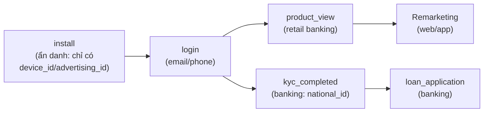
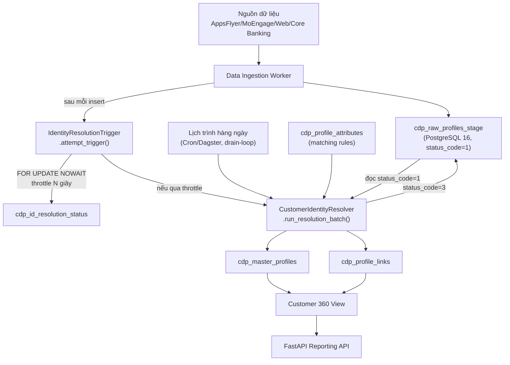

<!-- _class: lead -->

# Customer Identity Resolution (CIR)
## Trong nền tảng Customer 360

Giải pháp hợp nhất danh tính khách hàng đa nguồn
(AppsFlyer · MoEngage · Web Tracking · CRM · Google Analytics · Facebook)

---

## Nội dung

1. Giới thiệu Customer Identity Resolution trong Customer 360
2. Nền tảng dữ liệu: nguồn dữ liệu, hành trình khách hàng, thuộc tính hồ sơ
3. Kiến trúc chi tiết: thiết kế hệ thống, các bước xử lý, phương pháp ghép nối và hợp nhất dữ liệu
4. Demo thực tế

---

# 1. Giới thiệu Customer Identity Resolution

---

## Vấn đề: dữ liệu khách hàng bị phân mảnh

Một khách hàng thực tế "chạm" vào doanh nghiệp qua **nhiều hệ thống độc lập**:

- **AppsFlyer** – attribution quảng cáo mobile (Facebook/TikTok/Google/Grab Ads…)
- **MoEngage** – engagement / marketing automation
- **Web Tracking** – cookie trên website và Google Analytics 4 (GA4)
- **Core Banking / KYC** – hệ thống lõi ngân hàng (retail & banking domain)
- **QR Code & Landing Page** - sự kiện offline (PR event, tại điểm bán…)

➡️ Mỗi hệ thống chỉ biết **một phần** của khách hàng → không có góc nhìn 360°.

---

## Customer Identity Resolution (CIR) là gì?

> **CIR** là quá trình **liên kết (link)** các bản ghi hồ sơ thô (raw profile) từ nhiều nguồn khác nhau, xác định chúng có **cùng thuộc về một khách hàng thực** hay không, và **hợp nhất (merge)** thành **một hồ sơ "vàng" duy nhất** (Golden/Master Profile).

**Mục tiêu trong Customer 360:**
- Một khách hàng = **một `master_profile_id`** duy nhất, xuyên suốt mọi kênh, mọi domain (retail/banking/real_estate/travel)
- Nền tảng cho: personalization, scoring models (lead/churn/CLV), segmentation, analytics

---

## Vì sao Customer Identity Resolution (CIR) rất quan trọng?

- Người dùng VN dùng **nhiều app/thiết bị** (Zalo, app ngân hàng, app bán lẻ, web,...) → danh tính bị tách rời qua `device_id`, `cookie_id`, số điện thoại, email, phone, social media accounts
- Ngân hàng số & bán lẻ đa kênh cần **tuân thủ dữ liệu cá nhân** (Nghị định 13/2023/NĐ-CP về bảo vệ dữ liệu cá nhân) → CIR phải xử lý PII đã **hash/ẩn danh**
- Chiến dịch marketing đa kênh (Facebook/TikTok/Google/Grab Ads) cần đo lường **hiệu quả thực sự trên một khách hàng**, không tính trùng theo từng thiết bị/click

---

# 2. Nền tảng dữ liệu

---

## Nguồn dữ liệu (Data Sources)

| Nguồn | Domain | Định danh mang theo |
|---|---|---|
| **AppsFlyer** | Mobile App | `device_id`, `advertising_id` (IDFA/GAID) |
| **MoEngage** | Mobile App | `external_customer_id`, `email` /  `hashed email`, `phone` /  `hashed phone`, `push_token`, `user_id` |
| **Web Tracking** | Landing Page | `cookie_id`, `email`  /  `hashed email`, , `phone` /  `hashed phone` |
| **Core Banking / KYC** | Core Banking | `phone_number`, `national_id`, `device_id` |

Tất cả đổ về **một bảng staging duy nhất**: `cdp_raw_profiles_stage`
(đa tenant – `tenant_id`, đa domain – `bán lẻ` / `media` /`banking`/`bất động sản`/`du lịch`/`giáo dục`)

---

## Hành trình khách hàng (Customer Journey Mapping)

Một khách hàng thực đi qua nhiều **điểm chạm (touchpoint)**, mỗi điểm chạm sinh ra **một raw profile riêng**:



- Điểm chạm đầu (`install`) **không có PII** — chỉ có định danh thiết bị/quảng cáo -> Anonymous Profile
- Các điểm chạm sau (`login`, `kyc_completed`…) **trên cùng thiết bị** mới có danh tính thật
- CIR phải **liên kết  các Anonymous Profile vào 1 Master Profile** → đây chính là cơ chế tạo ra "duplicate" cần hợp nhất

---

## Thuộc tính hồ sơ chính (Key Profile Attributes)

* **Định danh cá nhân** *(SHA-256, không lưu PII thô)*
  `email`, `phone_number`, `national_id` — **các matching key CIR**
  `full_name` — cũng được hash/lưu để hiển thị, nhưng **không dùng để matching** (tên trùng rất phổ biến → rủi ro merge nhầm 2 người khác nhau)

* **Định danh thiết bị** *(gộp thành mảng)*
  `device_ids[]`, `advertising_ids[]`, `cookie_ids[]`

* **Định danh theo nguồn dữ liệu** *(JSONB theo `source_system`)*
  `external_ids{}`, `push_tokens{}`

* **Metadata thuộc tính** (`cdp_profile_attributes`)
  Quản lý ~70 thuộc tính: **matching rule**, **merge rule**, **PII**, **attribute group**.

* **Seed mặc định**
  Khởi tạo **7 thuộc tính định danh** (`email`/`phone_number`/`national_id`/`external_customer_id`/`device_id`/`advertising_id`/`cookie_id`) cho Identity Resolution cùng **merge policy** mặc định (recency, KYC-first, source priority). `full_name` **không** nằm trong 7 thuộc tính này.


---

# 3. Kiến trúc chi tiết

---

## Sơ đồ kiến trúc hệ thống



---

## Nguyên tắc thiết kế CIR: Metadata-driven

### Mọi quy tắc được cấu hình bằng Metadata

* Không **hard-code** trong source code
* Quy tắc đọc động từ bảng **`cdp_profile_attributes`**
* Mỗi thuộc tính định nghĩa:
  * **Matching Rule**: `matching_rule`, `matching_threshold`
  * **Merge Policy**: `consolidation_rule`, `consolidation_config`
* Thay đổi quy tắc chỉ cần **UPDATE metadata**, không cần deploy
* Resolver chỉ sử dụng các rule **ACTIVE**

```sql
SELECT attribute_internal_code, matching_rule, consolidation_rule
FROM cdp_profile_attributes
WHERE is_identity_resolution = TRUE
  AND status = 'ACTIVE';
```

> **Lợi ích:** Linh hoạt, dễ mở rộng và dễ bảo trì.

---

## Quy trình xử lý Identity Resolution

```text
Raw Profile
      │
      ▼
1. Load Matching & Merge Rules
      │
      ▼
2. Tìm Master Profile phù hợp
      │
 ┌────┴────┐
 │         │
 ▼         ▼
Match   Không Match
 │         │
 ▼         ▼
Merge   Tạo Master mới
 │         │
 └────┬────┘
      ▼
Tạo Profile Link
      ▼
Đánh dấu Processed
      ▼
COMMIT (Idempotent)
```

### Đặc điểm

* **Match** → cập nhật Customer 360 theo **Merge Policy**
* **Không Match** → tạo **Master Profile** mới
* **An toàn khi retry** nhờ **idempotent** và **unique constraint** `(tenant_id, raw_profile_id)`


---

## CIR — Chính sách hợp nhất dữ liệu (Merge Policy)

Khi nhiều nguồn cùng cập nhật một thuộc tính, **CIR** sẽ áp dụng **Merge Policy (`consolidation_rule`)** để chọn giá trị cuối cùng.

| **Merge Policy**      | **Nguyên tắc**                               |
| --------------------- | -------------------------------------------- |
| **Most Recent**       | Ưu tiên dữ liệu mới nhất                     |
| **Verified First**    | Ưu tiên dữ liệu đã xác thực (KYC)            |
| **Verified → Recent** | Ưu tiên KYC, nếu bằng nhau thì chọn mới nhất |
| **Source Priority**   | Ưu tiên theo thứ tự nguồn dữ liệu            |
| **Non-Null**          | Chỉ cập nhật khi giá trị hiện tại rỗng       |
| **Overwrite**         | Luôn ghi đè bằng dữ liệu mới                 |
| **Append Distinct**   | Gộp danh sách, loại bỏ giá trị trùng         |

---

## CIR — Ví dụ áp dụng Merge Policy

| **Thuộc tính**         | **Merge Policy**    |
| ---------------------- | ------------------- |
| `email`                | **Verified First**  |
| `phone_number`         | **Verified First**  |
| `national_id`          | **Verified First**  |
| `external_customer_id` | **Source Priority** |
| `device_id`            | **Source Priority** |
| `advertising_id`       | **Source Priority** |
| `cookie_id`            | **Source Priority** |

> **Lợi ích:** Dữ liệu Customer 360 luôn **chính xác, nhất quán và đáng tin cậy**, dù được đồng bộ từ nhiều hệ thống khác nhau.
>
> **Lưu ý:** bảng trên là **merge policy** (chọn giá trị nào để hiển thị/lưu) — khác với **matching rule** (dùng để xác định 2 raw profile có cùng 1 người hay không). `full_name` không có mặt ở cả 2 bảng: không phải matching key, và cũng không có merge policy riêng (chỉ giữ giá trị non-null đầu tiên, kiểu `COALESCE`) — vì `is_identity_resolution = FALSE` khiến resolver không load bất kỳ config nào cho thuộc tính này.

---

## CIR — Cấu hình Merge Policy (`consolidation_config`)

`consolidation_config` (JSONB) định nghĩa chi tiết cách hợp nhất dữ liệu cho từng thuộc tính.

**Ví dụ cấu hình cho `email`:**

```json
{
  "verified_field": "kyc_status",
  "verified_event_names": ["kyc-completed"],
  "fallback_mode": "most_recent",
  "timestamp_field": "updated_at"
}
```

### Ý nghĩa

* **Verified First:** ưu tiên dữ liệu đã xác thực (KYC).
* Nếu **raw profile** không có `kyc_status`, CIR sử dụng sự kiện `kyc-completed` làm bằng chứng xác thực.
* Nếu chưa xác thực, áp dụng **fallback** (ví dụ: chọn dữ liệu mới nhất).

---

## CIR — Kiểm thử Merge Policy

Hệ thống đã kiểm thử đầy đủ **7 Merge Policy**, bao gồm các trường hợp biên:

* ✅ Sai cấu hình `fallback_mode`
* ✅ Đệ quy vô hạn
* ✅ Timestamp khác múi giờ
* ✅ Khác chữ hoa/thường của `source_system`
* ✅ Thuộc tính tùy biến chưa được SELECT

> **Kết quả:** Merge Policy hoạt động ổn định, nhất quán và an toàn trong quá trình Identity Resolution.


---

## Identity Resolution — Các phương pháp ghép nối

| Phương pháp | Dùng cho | Điều kiện |
| --- | --- | --- |
| **Exact Match** | `email`, `phone`, `national_id`, `external_customer_id` | `col = value` |
| **Fuzzy (Trigram)** | Văn bản thô *(chưa active cho thuộc tính nào trong seed hiện tại)* | `similarity >= threshold` |
| **Double Metaphone** | Họ tên phát âm gần giống *(chưa active cho thuộc tính nào trong seed hiện tại)* | `dmetaphone(col) = dmetaphone(value)` |
| **Array Match** | `device_id`, `advertising_id`, `cookie_id` | `value = ANY(array)` |
| **JSONB Match** | `external_customer_id` theo từng nguồn | `external_ids @> {...}` |

---

## Identity Resolution — Bảo vệ PII & Chuẩn AdTech

### Chuẩn xử lý PII

- PII (`email`, `phone`, `national_id`, `full_name`) được **hash bằng SHA-256** trước khi lưu trữ.
- Chuẩn hóa dữ liệu (lowercase, trim, E.164...) **trước khi hash** để tăng tỷ lệ match.
- Cột `is_hashed BOOLEAN` trên `cdp_master_profiles` đánh dấu hồ sơ có PII đã hash.
- **Ràng buộc:** `is_hashed = TRUE` ⇒ `persona_name` **bắt buộc khác NULL** (CHECK constraint DB + tự sinh ở tầng Python — `persona.py`) — nhãn dễ đọc, không phải PII, thay thế `full_name` (giờ chỉ còn là hash) cho mục đích duyệt/tìm kiếm ngữ nghĩa. Ví dụ: `"Savvy Retail Shopper (TikTok Ads) #4f2a9c"`.

---

## Quy tắc ghép nối

| Loại dữ liệu | Phương pháp |
| --- | --- |
| **PII đã hash** | ✅ Exact Match |
| **Văn bản thô** | ✅ Fuzzy Match (Trigram, Double Metaphone) |

### Tham chiếu chuẩn ngành

- **Google Customer Match**: hỗ trợ upload PII đã hash bằng **SHA-256**.
- **Google Enhanced Conversions**: yêu cầu chuẩn hóa dữ liệu trước khi hash và đối sánh bằng giá trị hash.
- Mô hình này cũng được áp dụng rộng rãi trên các nền tảng AdTech/MarTech như **Meta Customer Match**.

**Reference**

- Google Customer Match  https://support.google.com/displayvideo/answer/9539301
- Google Enhanced Conversions https://support.google.com/adspolicy/answer/9755941

---

## Cơ chế Real-time vs Batch hàng ngày

**Real-time (throttled), không phải DB trigger thật:**
- Ingestion worker gọi `IdentityResolutionTrigger.attempt_trigger()` ngay sau insert
- Dùng `SELECT ... FOR UPDATE NOWAIT` trên `cdp_id_resolution_status` → khoá theo hàng, nhiều worker song song vẫn an toàn
- Nếu đã chạy trong N giây gần nhất → **bỏ qua** (throttle), không chặn luồng ingest
- Lỗi xử lý CIR **không làm crash** worker ingest (bắt exception, rollback)

**Batch hàng ngày (`daily_job.py`):**
- Drain-loop: lặp `run_resolution_batch()` cho đến khi staging hết bản ghi `status_code=1`
- Đảm bảo **không sót** bản ghi nếu real-time bị throttle bỏ qua liên tục

---

## Đa tenant & đa domain (Multi-tenant / Multi-domain)

- Mọi bảng đều có `tenant_id` — cách ly dữ liệu giữa các khách hàng doanh nghiệp (multi-tenant SaaS)
- `domain` phân biệt **retail** vs **banking** trong cùng một tenant → **không hợp nhất** hồ sơ giữa hai domain (một người có thể là khách bán lẻ và khách vay ngân hàng, được resolve **riêng**)
- Mọi câu query ghép nối luôn `WHERE tenant_id = %s AND domain = %s`
- `cdp_profile_links` có unique constraint `(tenant_id, raw_profile_id)`

---

# 4. Demo thực tế

---

## Kịch bản demo

`backend-system/identity_resolution/run-demo.sh` — một lệnh, chạy toàn bộ pipeline:

1. Nạp cấu hình DB từ `.env`, dựng virtualenv, cài `requirements.txt`
2. **`init_sample_data.py`** — sinh **1.000 raw profile** giả lập cho retail/banking, trải trên **cả 3 nguồn** (AppsFlyer/MoEngage/Web Tracking):
   - Điểm chạm đầu (`install`) luôn ẩn danh qua **AppsFlyer**, qua 6 kênh quảng cáo (Facebook/TikTok/Google/Grab/FPT Play Ads, PR offline)
   - Trộn domain retail/banking (40% banking)
   - ~30% là **"duplicate" có chủ đích**: các touch tiếp theo (`login`/`purchase`/`kyc_completed`) round-robin qua **AppsFlyer/MoEngage/Web Tracking** — mỗi touch mang định danh riêng của nguồn (`push_token`, `cookie_id`/`ga_client_id`, `utm_*`…) nhưng luôn **chia sẻ cùng `device_id`** với `install` ban đầu, để CIR ghép đúng vào 1 master profile bất kể thứ tự xử lý (batch bị xáo trộn)
   - PII được **hash SHA-256** trước khi insert (không lưu dữ liệu thật)
3. **`run_demo_resolution.py`** — chạy `CustomerIdentityResolver` cho đến khi hết batch, in kết quả master profile
4. **`seed_full_demo_data.py`** — làm giàu 700 master profile (CRM journey graph, quan hệ, giao dịch, `cdp_raw_events` hành vi, content items…) cho demo Customer 360 đầy đủ, không chỉ riêng CIR

---

## Kết quả demo (đã verify thực tế)

| Chỉ số | Giá trị |
|---|---|
| Raw profiles đầu vào | **1.000** |
| Nguồn raw profile | AppsFlyer 800 · MoEngage 100 · Web Tracking 100 |
| Master profiles tạo ra | **700** |
| Master profile được hợp nhất (≥2 raw) | **234** |
| Tỷ lệ trùng chủ đích | 30% (`duplicate_rate`) |

➡️ Chuỗi `install (device_id, AppsFlyer)` → `login/kyc_completed` trên **bất kỳ nguồn nào trong 3 nguồn** được **CIR nối lại đúng qua `device_id`** dùng chung, dù `install` ban đầu hoàn toàn ẩn danh.

**Lưu ý kỹ thuật đã gặp:**
- Phải đảm bảo `phone_number` sinh ngẫu nhiên **không trùng lặp giữa các khách hàng khác nhau** (rejection-sampling) vì đây là một CIR matching key thật sự — trùng lặp sẽ khiến resolver hợp nhất nhầm 2 người thật thành 1. `full_name` cũng được sinh không trùng lặp cho demo dễ đọc, nhưng **không ảnh hưởng đến kết quả CIR** vì `full_name` không phải là matching key.
- Một touch chỉ chia sẻ **PII** (không chia sẻ `device_id`) với `install` ban đầu có thể bị xử lý **trước** touch AppsFlyer cùng `device_id` (thứ tự batch bị xáo trộn) → resolver tạo nhầm **2 master profile** cho cùng 1 người, rồi va lỗi `UniqueViolation` khi một trong hai sau đó cùng cập nhật một `email`. Khắc phục: mọi touch — kể cả MoEngage/Web Tracking — đều phải mang theo `device_id` dùng chung của khách hàng.

---

## Kiểm tra kết quả bằng SQL

```sql
-- Master profile theo domain (PII hiển thị là hash, persona_name là nhãn dễ đọc thay thế)
SELECT master_profile_id, domain, full_name, email, phone_number, is_hashed, persona_name, source_systems
FROM customer360.cdp_master_profiles
WHERE tenant_id = '11111111-1111-1111-1111-111111111111'
ORDER BY domain;

-- Trạng thái xử lý của từng raw profile
SELECT raw_profile_id, source_system, domain, status_code
FROM customer360.cdp_raw_profiles_stage
WHERE tenant_id = '11111111-1111-1111-1111-111111111111';

-- Liên kết raw -> master
SELECT * FROM customer360.cdp_profile_links
WHERE tenant_id = '11111111-1111-1111-1111-111111111111';
```

---

## Quan sát qua API báo cáo (customer360-api)

FastAPI + SQLAlchemy 2, phản chiếu đúng dữ liệu demo:

- `GET /api/v1/reporting/summary` — tổng số raw/master, tỷ lệ hợp nhất
- `GET /api/v1/reporting/master-profiles/duplicates` — các master được hợp nhất từ ≥2 raw profile
- `GET /api/v1/reporting/identity-graph/coverage` — độ phủ định danh (device/email/phone…) trên master profile

➡️ Cùng một nguồn sự thật (`customer360` schema) phục vụ cả **pipeline CIR** và **API báo cáo/ứng dụng**.

---

<!-- _class: lead -->

## Tổng kết

- CIR biến **N bản ghi rời rạc, đa nguồn, đa kênh** thành **1 hồ sơ khách hàng duy nhất**
- Thiết kế **metadata-driven**, **đa tenant/đa domain**, xử lý **real-time (throttled) + batch hàng ngày**
- PII được **hash trước khi lưu** — tuân thủ bảo vệ dữ liệu cá nhân
- Demo thực tế: **1.000 → 700** hồ sơ, verify end-to-end trên PostgreSQL 16 + pgvector

**Nền tảng cho:** Customer 360 · Segmentation · Personalization · Lead/Churn/CLV Scoring
