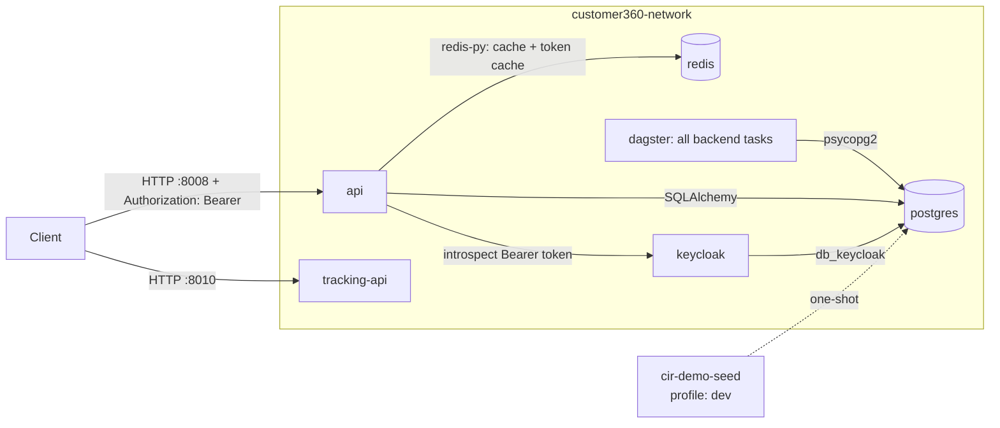

# Customer 360 Platform — Docker Compose Operations Guide

Audience: DevOps engineers deploying/operating the stack, and backend
engineers developing against it locally. Covers
[`docker-compose.yml`](docker-compose.yml) and the host-run development Compose
variants at the root of `core-customer360/`.

For architecture/DB schema background see [README.md](README.md),
[TECHNICAL-DOCUMENTATION.md](TECHNICAL-DOCUMENTATION.md), and
[identity-resolution.md](identity-resolution.md). This guide only covers the
containerized deployment.

---

## 1. What gets deployed

| Service | Image (built locally) | Role | Port (host) |
|---|---|---|---|
| `postgres` | `customer360-postgres:local` (postgis/postgis:16-3.5 + pgvector) | Primary datastore, auto-provisioned with [`database-schema.sql`](database-init/database-schema.sql) | `${POSTGRES_HOST_PORT:-5432}` → 5432 |
| `redis` | `customer360-redis:local` (redis:8-alpine) | Response cache **and Keycloak token cache** for customer360-api (see [`core/cache.py`](customer360-api/core/cache.py) / [`core/auth.py`](customer360-api/core/auth.py)) | `${REDIS_HOST_PORT:-6580}` → 6580 |
| `keycloak-db-init` | reuses `customer360-postgres:local` | **One-shot** job that creates the dedicated `db_keycloak` database on the shared `postgres` instance, then exits | none |
| `keycloak` | `keycloak/keycloak:26.7` | Local SSO/identity provider — issues + introspects the access tokens customer360-api requires on every endpoint except `/health` | `${KEYCLOAK_HOST_PORT:-8080}` → 8080 |
| `dagster` | `customer360-dagster:local` (Python 3.11-slim) | Dagster webserver and daemon for all nine backend-system code locations, including identity resolution | `${DAGSTER_UI_PORT:-3000}` → 3000 |
| `api` | `customer360-api:local` (Python 3.11-slim) | Customer 360 / CIR REST API (FastAPI), Keycloak-secured | `${C360_API_PORT:-8008}` → 8008 |
| `tracking-api` | `customer360-tracking-api:local` (Python 3.11-slim) | CDP tracking-log ingestion; AWS S3 in production, MinIO in dev | `${C360_TRACKING_API_PORT:-8010}` → 8010 |
| `cir-demo-seed` | reuses `customer360-dagster:local` | **Dev only** one-shot job that seeds demo data, then exits | none |

All services share one bridge network, `customer360-network`, and are isolated
from other Docker workloads on the host. The production-shaped Compose file
uses three named volumes: `customer360-pgdata` (Postgres data directory, also
backs `db_keycloak`), `customer360-redisdata` (Redis AOF file), and
`customer360-dagsterdata` (Dagster home). The development Compose file adds
`customer360-miniodata` for MinIO.



---

## 2. Prerequisites

- Docker Engine + Docker Compose v2 (the `docker compose` plugin, not the
  legacy standalone `docker-compose` v1 binary — `depends_on.condition:
  service_healthy` requires the Compose Specification).
- Ports `5432` / `6580` / `8008` / `8010` free on the host, **or** override them (see
  §4) — this matters on dev machines that already run `pgsql16_vector` /
  another Redis via [`dev-start-pgsql.sh`](dev-start-pgsql.sh).

---

## 3. First-time setup

```bash
cd core-customer360
cp .env.example .env
```

Edit `.env` and set real values for at least:

- `DB_PASSWORD` — Postgres password (used both to bootstrap the `postgres`
  container and by `api`/`cir` to connect).
- `REDIS_PASSWORD` — Redis `requirepass`, applied at container start.
- `KEYCLOAK_ADMIN_PASSWORD` — admin console password for the local `keycloak`
  container.
- `KEYCLOAK_CLIENT_SECRET` — secret of the confidential client customer360-api
  uses to introspect tokens (see §9 below to create it).
- `GOOGLE_GENAI_API_KEY` — optional; leave the `YOUR_...` placeholder to keep
  CIR's persona-name generation fully offline/deterministic (see
  [identity-resolution.md](identity-resolution.md)).

`.env` is gitignored (see [`.gitignore`](.gitignore)) — never commit real
credentials. `.env.example` is the committed template.

> **How `.env` is used (important to understand before editing it):**
> 1. `docker-compose.yml` uses `${VAR}` substitution to seed the official
>    Postgres/Redis image bootstrap variables (`POSTGRES_USER`, `--requirepass`, etc.).
> 2. Application services (`api`, Dagster, demo seed, and `tracking-api`) get
>    the whole file injected via `env_file:`, exactly like
>    `customer360-api`/`backend-system` read it for non-Docker local dev
>    (`pydantic-settings` / `python-dotenv`). Infrastructure containers receive
>    only the explicit variables they need.
> 3. **`DB_HOST` / `REDIS_HOST` in `.env` are overridden by `docker-compose.yml`**
>    to the in-network service names (`postgres` / `redis`) for the
>    `api`/`dagster`/`cir-demo-seed`/`tracking-api` containers, regardless of
>    what's in the file.
>    The `localhost` defaults in `.env.example` are only correct when you run
>    `customer360-api`/`backend-system` directly on the host
>    (`./start.sh`, `./run-demo.sh`) against the dockerized Postgres/Redis via
>    their published host ports.

---

## 4. Running the stack

### Production mode

```bash
docker compose up -d --build
docker compose ps
```

Starts `postgres`, `redis`, `keycloak`, `dagster`, `api`, and `tracking-api`. The tracking API writes to configured AWS S3 and does not require a local MinIO container. First boot on a fresh
`customer360-pgdata` volume runs `postgres/init/00-extensions.sql` then the
full `database-schema.sql` automatically (Postgres' standard
`/docker-entrypoint-initdb.d/` mechanism — **only runs once**, on an empty
data directory; see §7 for schema changes afterward).

### Dev mode (core services + demo data)

```bash
docker compose --profile dev up -d --build
```

The same six long-running services, **plus** `cir-demo-seed`, a one-shot job (`restart: "no"`)
that waits for `postgres` to be healthy, then runs, in order:

1. `identity_resolution/scripts/init_sample_data.py` — seeds 1000 synthetic Adjust raw profiles
   (retail + banking, ~30% deliberate duplicates).
2. `identity_resolution/scripts/run_demo_resolution.py` — drains them through identity resolution.
3. `identity_resolution/scripts/seed_full_demo_data.py` — seeds the full CRM journey graph,
   relations, transactions, behavioral events, and master-profile enrichment.

Check it completed successfully:

```bash
docker compose logs -f cir-demo-seed   # tail while running
docker inspect -f '{{.State.ExitCode}}' customer360-cir-demo-seed   # expect 0
```

It's idempotent (see [identity-resolution.md](identity-resolution.md) /
repo notes) — safe to re-run:

```bash
docker compose --profile dev up cir-demo-seed
```

### Host-run application development

For the workflow that runs `customer360-api`, Dagster, and the frontend on the
host, use the development Compose file for Postgres, Redis, Keycloak, MinIO,
and the tracking API:

```bash
docker compose -f dev-docker-compose.yml up -d --build
```

When `SSO_LOGIN=false`, [`dev-c360.sh`](../dev-c360.sh) selects
`dev-no-sso-docker-compose.yml`, which provides the same MinIO-backed tracking
API without starting Keycloak. Both variants publish the tracking API at
`${C360_TRACKING_API_PORT:-8010}` and connect it to the in-network Redis and
MinIO services.

### Overriding host ports (avoid clashing with other local Postgres/Redis)

In `.env`:

```dotenv
POSTGRES_HOST_PORT=15432
REDIS_HOST_PORT=16379
C360_API_PORT=18000
```

Containers still talk to each other over `customer360-network` on the
standard internal ports (5432/6580/8008/8010) — only the host-published mapping
changes.

### Building without starting, or rebuilding a single service

```bash
docker compose build                # all services
docker compose build api            # just customer360-api after a code change
docker compose build tracking-api  # just the CDP tracking service
docker compose up -d --no-deps api  # restart only api, don't touch its deps
```

---

## 5. Day-2 operations

### Health & status

```bash
docker compose ps
docker inspect -f '{{.State.Health.Status}}' customer360-postgres
docker inspect -f '{{.State.Health.Status}}' customer360-redis
docker inspect -f '{{.State.Health.Status}}' customer360-dagster
docker inspect -f '{{.State.Health.Status}}' customer360-api
docker inspect -f '{{.State.Health.Status}}' customer360-tracking-api
curl -s http://localhost:${C360_API_PORT:-8008}/health
curl -s http://localhost:${C360_TRACKING_API_PORT:-8010}/health
```

| Service | Healthcheck mechanism |
|---|---|
| `postgres` | `pg_isready -U $DB_USER -d $DB_NAME` |
| `redis` | `redis-cli -a $REDIS_PASSWORD ping` |
| `keycloak` | `GET /health/ready` (`KC_HEALTH_ENABLED=true`) |
| `dagster` | HTTP readiness on port `3000` |
| `api` | `python -c "urllib.request.urlopen('http://localhost:8008/health')"` |
| `tracking-api` | `python -c "urllib.request.urlopen('http://localhost:8010/health')"` |

All six long-running services use `restart: unless-stopped` — a crashed container (or one killed by
`docker restart`) comes back automatically; a deliberate `docker compose stop`
does not.

### Logs

```bash
docker compose logs -f api
docker compose logs -f tracking-api
docker compose logs -f dagster       # Dagster UI, daemon, and task-run logs
docker compose logs -f postgres redis
```

### Tracking API and object storage

The tracking service accepts JSON batches at
`POST /api/v1/tracking/logs` and writes immutable NDJSON objects to a separate
bucket for each data source:

```text
s3://data-tracking-[data_source_id]/yyyy-mm-dd-hh/[batch-uuid].jsonl
```

Example local upload against the MinIO-backed dev service:

```bash
curl -i -X POST http://localhost:${C360_TRACKING_API_PORT:-8010}/api/v1/tracking/logs \
  -H 'Content-Type: application/json' \
  -H 'User-Agent: c360-debug-client' \
  -d '{
    "data_source_id": "11111111-1111-1111-1111-111111111111",
    "session_id": "debug-session",
    "events": [{"event_name": "page_view", "page_url": "https://example.test/"}]
  }'
```

Check the API access log and MinIO contents separately:

```bash
docker compose -f dev-no-sso-docker-compose.yml logs -f --timestamps tracking-api
docker logs -f --timestamps customer360-minio
```

The default `customer360-events-dev` bucket is not used by this endpoint. Open
the generated `data-tracking-[data_source_id]` bucket in the MinIO console at
`http://localhost:${MINIO_CONSOLE_HOST_PORT:-9001}`. A `422` response means the
JSON body failed validation; a `503` means the tracking service could not reach
S3/MinIO; a `429` means the Redis rate limit was exceeded. The tracking API is
not connected to the Customer 360 Keycloak middleware, so production deployments
must protect its ingress or add an API-key/signature layer before exposing it
publicly.

### Stopping / restarting

```bash
docker compose stop            # stop containers, keep volumes/network
docker compose start           # resume
docker compose restart api     # just one service
docker compose down            # stop + remove containers (volumes kept)
docker compose down -v         # DESTRUCTIVE: also deletes named volumes, including Dagster data
```

### Shelling in / ad-hoc SQL

```bash
docker exec -it -u postgres customer360-postgres psql -d customer360
docker exec -it customer360-redis redis-cli -a "$REDIS_PASSWORD" --no-auth-warning
docker exec -it customer360-api python -c "from core.database import engine; print(engine)"
```

### Scaling the API

`api` is stateless (session state lives in Postgres/Redis), so it can be
scaled horizontally behind a load balancer if needed:

```bash
docker compose up -d --no-deps --scale api=3 api
```
(Note: the fixed `container_name: customer360-api` and static host port
mapping in `docker-compose.yml` must be removed/parameterized first if you
actually intend to run >1 replica — as shipped it's meant for a single
instance per host.)

---

## 6. Configuration reference

All variables live in [`.env.example`](.env.example) — copy to `.env` and
tune per environment (dev/staging/prod). Highlights:

| Variable | Default | Notes |
|---|---|---|
| `DB_PASSWORD` | `change_me_postgres_password` | **Change in every real environment.** Also bootstraps the `postgres` container via `POSTGRES_PASSWORD`. |
| `REDIS_PASSWORD` | `change_me_redis_password` | **Change in every real environment.** Applied via `--requirepass`. |
| `CACHE_ENABLED` | `true` | Kill switch for the whole Redis caching layer in customer360-api (fails open regardless). |
| `CACHE_TTL_SECONDS` | `60` | Max staleness window for cached GET responses. Lower for tighter consistency, raise to cut DB load further. |
| `CIR_POLL_INTERVAL_SECONDS` | `30` | How often the `cir` worker polls `cdp_raw_profiles_stage` for unresolved rows. |
| `CIR_BATCH_SIZE` | `5000` | Rows per resolution batch. |
| `DB_POOL_SIZE` / `DB_MAX_OVERFLOW` | `10` / `20` | customer360-api SQLAlchemy pool sizing — tune with expected concurrent request volume. |
| `SSO_LOGIN` | `false` | Customer 360 API auth mode from `.env.example`; set `true` for Keycloak-protected deployments. The dev no-SSO Compose path is selected when this is `false`. |
| `SSO_LOGIN_URL` | `http://localhost:8080` | Base Keycloak URL. **Overridden to `http://keycloak:8080` for the `api` container** by `docker-compose.yml` (in-network service name), same pattern as `DB_HOST`/`REDIS_HOST`. |
| `KEYCLOAK_REALM` | `leocdp` | Realm customer360-api validates tokens against — must exist in Keycloak (see §9). |
| `KEYCLOAK_CLIENT_ID` / `KEYCLOAK_CLIENT_SECRET` | `leocdp` / placeholder | Confidential client customer360-api uses to call Keycloak's token introspection endpoint. **Change the secret in every real environment.** |
| `KEYCLOAK_VERIFY_SSL` | `false` | Set `true` once Keycloak is behind real TLS (self-signed/dev certs will fail introspection otherwise). |
| `KEYCLOAK_ADMIN` / `KEYCLOAK_ADMIN_PASSWORD` | `admin` / placeholder | Bootstrap admin console credentials for the local `keycloak` container (`start-dev` mode only). **Change in every real environment.** |
| `KEYCLOAK_HOST_PORT` | `8080` | Host-published port for the Keycloak admin console / API. |
| `C360_TRACKING_API_PORT` | `8010` | Host-published port for the CDP tracking-log API. |
| `OBJECT_STORAGE_MODE` | `s3` | `s3` in the production-shaped stack; `minio` is forced by the dev Compose files. |
| `S3_ENDPOINT_URL` | empty | Optional S3-compatible endpoint. Dev Compose overrides it to `http://minio:9000`. |
| `S3_REGION` | `us-east-1` | AWS region used by the tracking API. |
| `S3_AUTO_CREATE_BUCKETS` | `true` | Creates `data-tracking-[data_source_id]` on first write; set `false` when infrastructure provisions buckets. |
| `TRACKING_SESSION_TTL_SECONDS` | `86400` | TTL for non-payload session metadata in Redis. |
| `TRACKING_RATE_LIMIT_REQUESTS` / `TRACKING_RATE_LIMIT_WINDOW_SECONDS` | `120` / `60` | Per-source-IP Redis request window for tracking ingestion. |
| `TRACKING_RATE_LIMIT_FAIL_OPEN` | `true` | Allows ingestion when Redis is unavailable; set `false` for strict production enforcement. |
| `TRACKING_BOT_FILTER_ENABLED` | `true` | Discards configured crawler user agents before storage and rate-limit accounting. |
| `TRACKING_BOT_USER_AGENT_PATTERNS` | `googlebot,...` | Comma-separated, case-insensitive user-agent substrings to filter. |
| `GOOGLE_GENAI_API_KEY` | placeholder | Leave as `YOUR_...` to keep CIR persona-name generation offline (see `identity_resolution/persona.py`). |

---

## 7. Schema changes / upgrades

`/docker-entrypoint-initdb.d/` scripts (extensions + `database-schema.sql`)
**only run once**, when `customer360-pgdata` is first created. This mirrors
the same limitation as [`dev-start-pgsql.sh`](dev-start-pgsql.sh)'s
`SCHEMA_VERSION` gate for non-Docker dev.

- **Fresh environment / OK to lose data (dev, CI):**
  ```bash
  docker compose down -v      # drops customer360-pgdata
  docker compose up -d --build
  ```
- **Existing environment with data to keep (staging/prod):** apply the DDL
  delta by hand against the running container, e.g.:
  ```bash
  docker cp database-init/database-schema.sql customer360-postgres:/tmp/database-schema.sql
  docker exec -u postgres customer360-postgres \
    psql -d customer360 -v ON_ERROR_STOP=1 -f /tmp/database-schema.sql
  ```
  (Only safe if every statement in the delta is `IF NOT EXISTS`/idempotent —
  review the diff first. This is the same caveat called out repeatedly for
  `dev-start-pgsql.sh` in this repo's history: plain `CREATE TABLE`/`ALTER
  TABLE ADD COLUMN` without `IF NOT EXISTS` will error against an
  already-provisioned database.)

After editing `postgres/init/00-extensions.sql` or the Dockerfile itself,
rebuild the image:
```bash
docker compose build postgres
```
(image rebuild alone does **not** re-run init scripts against an existing
volume — see above.)

---

## 8. Troubleshooting

| Symptom | Likely cause / fix |
|---|---|
| `failed to bind host port ... address already in use` | Another process (e.g. `pgsql16_vector`, a host Redis) already owns 5432/6580/8008/8010. Set the corresponding `*_HOST_PORT` variables in `.env` to unused ports. |
| `api`/`cir` stuck "waiting" / never healthy | Check `docker compose logs postgres` — if it never reaches healthy, the DB init script likely failed (bad `.env` values, or a non-idempotent manual schema edit). |
| `psycopg2.errors.UndefinedColumn` after editing `database-schema.sql` | Schema drift — the running volume was provisioned before your edit. See §7. |
| `NOAUTH Authentication required` from Redis | `REDIS_PASSWORD` mismatch between `.env` and what `api`/`redis` were started with — restart both after changing it (`docker compose up -d --force-recreate redis api`). |
| Reporting numbers look stale right after a write | Expected — reporting endpoints are TTL-cached only (no write-invalidation), bounded by `CACHE_TTL_SECONDS`. Also: the `cir` worker writes to Postgres directly (bypasses the API), so its writes never invalidate the API's cache either — same TTL bound applies. |
| Demo data missing after `docker compose up` (no `--profile dev`) | Expected — demo seeding only runs under the `dev` profile. Run `docker compose --profile dev up cir-demo-seed`. |
| `customer360-postgres` logs `FATAL: database "db_keycloak" does not exist` | `keycloak` started before `keycloak-db-init` finished. Confirm `keycloak` depends on `keycloak-db-init: condition: service_completed_successfully` in `docker-compose.yml`, then `docker compose up -d keycloak-db-init keycloak`. |
| Every API call returns `401 {"detail": "Authentication required"}` | No `Authorization: Bearer <token>` header sent, or it's malformed. Only `/health` is exempt — see §9. |
| Every API call returns `401 {"detail": "Invalid or expired token"}` | Token expired, wrong realm/client, or `KEYCLOAK_CLIENT_SECRET` doesn't match the confidential client in Keycloak. Re-fetch a token (§9) and re-check `.env` against the admin console. |
| API container logs `Keycloak introspection request failed` | Inside `docker compose`, `SSO_LOGIN_URL` must be `http://keycloak:8080` (in-network name), not `localhost` — already overridden for the `api` service in `docker-compose.yml`; don't remove that override. |

---

## 9. Keycloak setup (realm, client, first token)

The `keycloak` container runs in `start-dev` mode (dev-friendly, not for
production) against the dedicated `db_keycloak` database. On first start it
only has the built-in `master` realm — create the `leocdp` realm and a
confidential client before `customer360-api` can validate any token.

### 9.1 Create the realm + client

1. Open the admin console at `http://localhost:${KEYCLOAK_HOST_PORT:-8080}`
   and log in with `KEYCLOAK_ADMIN` / `KEYCLOAK_ADMIN_PASSWORD` from `.env`.
2. **Create realm** → name it `leocdp` (must match `KEYCLOAK_REALM`).
3. In the `leocdp` realm, **Clients → Create client**:
   - Client ID: `leocdp` (must match `KEYCLOAK_CLIENT_ID`).
   - Client authentication: **On** — this makes it a confidential client with
     a secret, required for the introspection call in
     [`core/auth.py`](customer360-api/core/auth.py).
   - Enable **Direct access grants** if you want to fetch test tokens via the
     `password` grant.
4. **Clients → leocdp → Credentials** tab → copy the client secret into
   `KEYCLOAK_CLIENT_SECRET` in `.env`, then run
   `docker compose up -d --force-recreate api`.
5. **Users → Add user** → create a test user and set a password under
   **Credentials** (turn off "Temporary").

### 9.2 Get an access token and call the API

```bash
TOKEN=$(curl -s -X POST \
  "http://localhost:${KEYCLOAK_HOST_PORT:-8080}/realms/leocdp/protocol/openid-connect/token" \
  -d "client_id=leocdp" \
  -d "client_secret=$KEYCLOAK_CLIENT_SECRET" \
  -d "grant_type=password" \
  -d "username=<test-user>" \
  -d "password=<test-user-password>" | python3 -c "import sys,json;print(json.load(sys.stdin)['access_token'])")

curl -s http://localhost:${C360_API_PORT:-8008}/api/v1/reporting/summary \
  -H "Authorization: Bearer $TOKEN"
```

`/health` never requires a token; every other route does (see
`EXEMPT_PATHS` in [`core/auth.py`](customer360-api/core/auth.py)). Valid
tokens are cached in Redis under `auth:token:<token>` (TTL = token `exp`), so
repeat calls with the same token skip Keycloak entirely until it expires.

---

## 10. Relationship to the non-Docker local dev workflow

This Compose stack is independent of, and safe to run alongside, the existing
non-Docker dev scripts:

- [`dev-start-pgsql.sh`](dev-start-pgsql.sh) → container `pgsql16_vector`
- `customer360-api/start.sh` / `stop.sh` → runs uvicorn directly on the host
- `backend-system/identity_resolution/run-demo.sh` → runs the CIR scripts directly on the host

They use different container names and (by default) the same host ports, so
only run one Postgres/Redis path at a time on a given port — or remap ports
as shown in §4/§8.
