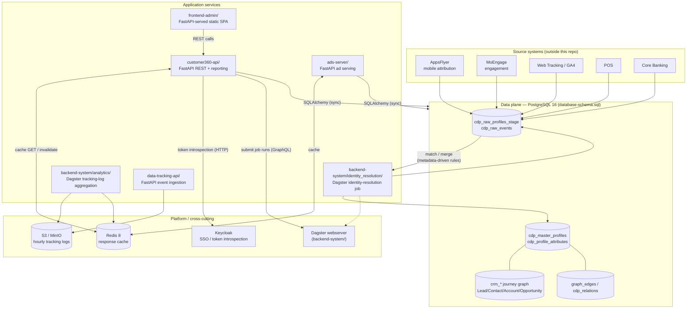

# Technical Documentation — Customer 360 Platform

## 1. Overview

**Customer 360** is the **identity resolution and unified customer profile (golden record)** component of a composable CDP (Customer Data Platform), built on **PostgreSQL 16** and extended with `pgvector` (semantic search / AI embeddings) and `PostGIS` (geospatial queries). It gives retail, banking, and B2B businesses:

- **A single, unified customer identity** across mobile apps, web, POS, core banking, and third-party attribution/engagement tools (AppsFlyer, MoEngage, GA4).
- **Autonomous duplicate resolution** via metadata-driven matching rules (exact and fuzzy, using identity-graph fields where available) — no code deploy needed to add a new identifier.
- **One activatable record** instead of siloed per-channel views, ready for segmentation and campaign tooling.
- **Full lineage/audit** of every golden record: which raw profiles were merged, by which rule, with what confidence.

This document describes the **as-built** architecture, verified directly against the code, Dockerfiles, and compose files in this repository (not aspirational design docs). Where a piece of infrastructure is a placeholder (not yet implemented), it is called out explicitly.

## 2. Concrete Use Cases

### UC1 — Multi-channel ad attribution unification (Retail / Mobile Attribution)
A user installs an app from a Facebook/TikTok/Google ad (AppsFlyer records an `install` event with only an anonymous `device_id`/`advertising_id`). Later they log in or purchase (a `login`/`purchase` event reveals `full_name`/`email`/`phone_number` **on the same `device_id`**). CIR can link these raw records into **one master profile** through the configured identity fields and identity collections, so marketing knows there is exactly **one real customer** behind multiple touchpoints — avoiding double counting and giving accurate CAC/ROAS per channel (`acquisition_source`/`acquisition_campaign`).

### UC2 — Digital banking: linking eKYC profiles across devices
A banking customer interacts through the mobile app (AppsFlyer) then completes KYC through the core banking system (`kyc_completed` event carrying `national_id`). CIR matches configured identifiers such as `device_id`, `phone_number`, and `national_id` to merge both sources, updating `kyc_status`, `cif_number`, `account_numbers`, `risk_segment` on the same golden record — supporting **AML/risk scoring** and digital-banking personalization without manual reconciliation across core systems.

### UC3 — B2B marketing attribution & customer journey
Uses the CRM journey graph to answer questions like: *"All Contacts in the Finance industry touched by Campaign X, which Lead they converted from, and which Opportunity they are currently linked to"* — joining `crm_lead → crm_campaign_member → crm_campaign`, `crm_contact → crm_account → crm_industry`, `crm_contact → crm_opportunity` (example SQL in [README.md](../README.md)).

### UC4 — Identity Resolution operations dashboard (Data/BI team)
Calls `GET /api/v1/reporting/summary` to build a real-time dashboard: how many raw profiles are `pending`, how many have been merged, duplicate rates by `source_system`/`domain` — helping detect pipeline issues early (e.g. raw profiles stuck at `status_code=1` too long) or poor data quality (matching rules too loose/too strict).

### UC5 — Identity graph coverage measurement
Calls `GET /api/v1/reporting/identity-graph/coverage` to see what percentage of customers are reachable through each channel (email vs. push token vs. device ID) — used to decide which identifier type needs more data collection investment (e.g. a low `with_advertising_id` rate signals a need for more mobile data sources).

### UC6 — Audit & lineage tracing of a golden record
From any `master_profile_id`, calls `GET /api/v1/master-profiles/{id}/links` to see **every** raw profile (with `source_system`, `match_method`, `match_score`) that contributed to this record — used to explain data discrepancies to customers or for compliance audits (especially important in the `banking` domain).

### UC7 — Managing matching rules without a code deploy (metadata-driven)
A data operations team adds a new identity attribute (e.g. `zalo_id` from a new source) via `POST /api/v1/profile-attributes` with `is_identity_resolution=true`, `matching_rule='exact'` — the CIR engine **automatically** applies the new rule on its next batch/real-time run, with no change to `resolver.py`.

### UC8 (infrastructure ready, scoring logic not yet implemented) — Customer scoring
The schema already has the necessary columns (`churn_probability`, `predictive_clv`, `lead_conversion_probability`, `engagement_score`, ...) and metadata (`is_scoring_model`, `scoring_model_name/version`, `refresh_frequency`) so an external ML pipeline (planned: a Dagster job in `backend-system/scoring/`, currently a placeholder) can write results via `PATCH /api/v1/master-profiles/{id}` — ready for churn prevention, next-best-offer, and lead-grading use cases once a model is deployed.

### UC9 — Semantic search / lookalike audiences (pgvector)
Using `persona_embedding` (master profile) or `embedding` (CRM/graph_edges), similarity queries via `ORDER BY embedding <-> :query_embedding LIMIT N` find "customers similar to" a target group described in natural language (e.g. *"software company B2B customers with >3 opportunities"*) — the infrastructure is ready; generating the embeddings (via an LLM) is outside the scope of this module.

---

## 3. System Architecture

### 3.1 Core Components



**How to read this diagram:**
- **One golden record, many sources** — AppsFlyer/MoEngage/Web/POS/Core Banking all land in a single staging table; nothing is siloed per channel.
- **Identity resolution is a separate, swappable worker** ([`backend-system/identity_resolution/`](../backend-system/identity_resolution)), not baked into the API — it writes to Postgres directly via `psycopg2`, independent of `customer360-api`.
- **One API contract** ([`customer360-api/`](../customer360-api)) governs all reads/writes to the schema, backed by Redis for latency and Keycloak for SSO/authorization.
- **Backend pipelines are Dagster-orchestrated** ([`backend-system/`](../backend-system)) — `customer360-api` submits Dagster job runs asynchronously through the Dagster GraphQL API (`core/utils/dagster_client.py`) instead of running long batch work inline inside an HTTP request.
- **Tracking ingestion and analytics are separate services** — `data-tracking-api` writes immutable hourly NDJSON objects to S3/MinIO, and the `analytics` Dagster job aggregates those objects into source totals and Redis-backed metrics.
- **Ad serving is a separate API** ([`ads-server/`](../ads-server)) — it serves tenant-scoped placements and creatives and is deployed independently from the core Customer 360 Compose stack.
- **The admin UI is a static single-page app** served by a thin FastAPI process — no server-side rendering of data, no direct database access from the UI tier.

### 3.2 Data Flow: Ingest → Identity Resolution → Activation

1. **Raw profile ingestion** (`cdp_raw_profiles_stage`, `cdp_raw_events`)
   - External services (AppsFlyer, MoEngage, POS, core banking, GA4) send events or profile snapshots.
   - Land in staging tables with `source_system`, `domain` (`retail`/`banking`/`travel`/`real_estate`), and optional PII (email, phone, name).
   - Status tracked via `status_code` / `cdp_id_resolution_status`.

2. **Identity Resolution (CIR)** — [`backend-system/identity_resolution/`](../backend-system/identity_resolution)
   - **Trigger:** the long-running `worker.py` polling loop, which drives `identity_resolution_job` in-process via Dagster's `execute_in_process()`, plus a `daily_job.py` batch entrypoint (cron/Airflow compatible) for scheduled full runs.
   - **Matching engine** (`identity_resolution/resolver.py`): loads active matching rules at runtime from `cdp_profile_attributes` (rows with `is_identity_resolution=true`).
     - **Exact match**: `national_id`, `email`, `phone_number` (SHA-256 hashed), plus `external_customer_id`/`device_id`/`advertising_id`/`cookie_id` (identity-graph fields).
     - **Not a matching key**: `full_name` is hashed/stored like the other PII but has `is_identity_resolution=false` — common/shared names are too collision-prone to safely decide two raw profiles are the same person. Fuzzy matching (`fuzzy_trgm`/`fuzzy_dmetaphone`) is implemented in the resolver but not enabled for any attribute in the current seed.
   - **Persona naming** (`identity_resolution/persona.py`): generates a human-readable `persona_name` for each merged, PII-hashed profile. If `GOOGLE_GENAI_API_KEY` is configured, it calls the Google Gemini API (`google-genai` SDK) to produce a natural-sounding label; otherwise (or if the call fails for any reason) it falls back to a deterministic, offline name generator — the pipeline never blocks on an external LLM call being available.
   - **Merge**: collects matched raw profiles into one `cdp_master_profiles` record.

3. **Golden record ready** (`cdp_master_profiles`)
   - API and segmentation queries read this table (never the raw staging tables directly).
   - Holds ML score placeholders (`churn_probability`, `predictive_clv`, `lead_conversion_probability`, `engagement_score`) populated by an external scoring pipeline once implemented.
   - Holds `persona_embedding` (pgvector) for lookalike-audience/semantic search.

4. **Tracking-log ingestion & analytics** — [`data-tracking-api/`](../data-tracking-api) accepts source events and writes immutable hourly NDJSON objects to S3 (MinIO in dev); the scheduled `analytics_job` reads those objects and updates source totals.

5. **Segmentation & activation** — via `customer360-api` + CRM tables
   - `POST /api/v1/segments/{id}/recompute` (on-demand, synchronous) or the scheduled `segmentation_job` (Dagster, polls for changes every `SEGMENTATION_POLL_INTERVAL_SECONDS`) recompute `cdp_segments` membership.
   - Marketing composes segments via CRM graph joins or `cdp_master_profiles` filters and activates against the resulting list.

6. **Ad delivery** — [`ads-server/`](../ads-server)
    - The standalone ad-serving API reads tenant-scoped campaigns, creatives, and placements and exposes the browser loader for client-side delivery.

### 3.3 Orchestration Architecture (Dagster)

`backend-system/` is a single Dagster workspace ([`backend-system/workspace.yaml`](../backend-system/workspace.yaml)). Every subfolder is an independent, separately-deployable Python codebase (own `requirements.txt`) that registers one `dagster_defs.py` code location:

```
backend-system/
├── workspace.yaml            # lists all 9 code locations below
├── requirements-dev.txt      # dagster-webserver, only needed for ./start.sh (local UI)
├── start.sh / stop.sh / restart.sh   # local dev: dagster dev -w workspace.yaml
│
├── identity_resolution/      # CIR engine — IMPLEMENTED, production pipeline
│   ├── dagster_defs.py       #   identity_resolution_job + identity_resolution_poll_sensor (RUNNING by default)
│   ├── worker.py             #   long-running container entrypoint (drives the job in-process)
│   ├── identity_resolution/  #   resolver.py, persona.py, models.py, trigger_controller.py, daily_job.py
│   ├── Dockerfile            #   background worker image, no HTTP port; healthcheck.py checks DB connectivity
│   └── tests/
│
├── segmentation/              # IMPLEMENTED — recomputes cdp_segments membership
│   ├── dagster_defs.py       #   segmentation_job + segmentation_poll_sensor (RUNNING by default)
│   ├── segmentation/recompute.py  # standalone reimplementation (psycopg2) of the CRUD logic in customer360-api
│   └── tests/
│
├── analytics/                 # IMPLEMENTED — hourly tracking-log aggregation
│   ├── dagster_defs.py       #   analytics_job + analytics_hourly_schedule (RUNNING by default)
│   ├── source_analytics/     #   S3/MinIO log processing and source totals
│   └── tests/

├── scoring/                   # PLACEHOLDER — single op: log started -> sleep -> log done
├── data_synch/                # PLACEHOLDER — same skeleton pattern
├── email_engine/              # PLACEHOLDER — same skeleton pattern
├── notification_engine/       # PLACEHOLDER — same skeleton pattern
├── campaign_activation/       # PLACEHOLDER — same skeleton pattern
└── personalization/           # PLACEHOLDER — same skeleton pattern
```

Each placeholder service exists so `customer360-api/core/utils/dagster_client.py` already has a real job/location/repository name triplet to submit against once real logic is implemented — the wiring (config settings, GraphQL client, workspace registration) is in place ahead of the business logic.

**Why Dagster:**
- One run-history UI (`localhost:3000`) across every backend service.
- Built-in retries (`RetryPolicy`) and sensor-based scheduling instead of ad-hoc cron.
- `customer360-api` can trigger a job run over GraphQL and return immediately (`202`-style pattern) instead of blocking a request thread on a long batch operation.
- Adding a new service is just a new folder with a `dagster_defs.py` exposing `defs = Definitions(...)`, registered in `workspace.yaml`.

## 4. Technology Stack

| Layer | Component | Notes |
|-------|-----------|-------|
| **Database** | PostgreSQL 16 | Built from `postgis/postgis:16-3.5` base image + `postgresql-16-pgvector` (apt package) — not a stock `postgres:16` image. |
| | Extensions | `uuid-ossp`, `pgcrypto`, `vector` (pgvector), `postgis`; `pg_trgm`/`fuzzystrmatch` referenced for fuzzy identity matching. |
| **Cache** | Redis 8 (`redis:8-alpine`) | Custom port **6580** (not the Redis default 6379), configured via `redis/redis.conf`. Password supplied at container start via `--requirepass` (never baked into the image). |
| **Identity Resolution** | Python 3.11, `psycopg2-binary` | Direct DB access, no ORM — `backend-system/identity_resolution/requirements.txt` has no SQLAlchemy dependency. |
| | `google-genai` | Google Gemini SDK, used by `persona.py` for optional LLM-generated persona names (with an offline fallback). |
| | Dagster ≥1.9 | Orchestration: jobs, sensors, run monitoring. |
| **Segmentation** | Python 3.11, `psycopg2` | Standalone recompute logic in `backend-system/segmentation/`, mirroring (not importing) the equivalent CRUD code in `customer360-api`. |
| **Analytics** | Python 3.11, S3-compatible client, Redis | Hourly `analytics_job` reads tracking-log objects from S3/MinIO and updates source totals and analytics state. |
| **API Service** | FastAPI (`>=0.111,<1`) + Uvicorn | `customer360-api/` — synchronous SQLAlchemy 2 ORM (`Session`, not `AsyncSession`). |
| | SQLAlchemy 2, `psycopg2-binary`, `pgvector` (Python binding) | ORM layer + vector column support. |
| | `pydantic`, `pydantic-settings` | Request/response validation and environment-driven settings (`core/config.py`). |
| | `dagster-graphql` | Client library used to submit Dagster job runs from the API without embedding the Dagster core package. |
| | `redis` (Python client) | Used by `core/cache.py` for the response cache. |
| **Tracking API** | FastAPI + Uvicorn | `data-tracking-api/` — accepts event batches and writes immutable hourly per-source NDJSON objects to S3; MinIO is used in dev. |
| **Ad Server** | FastAPI + Uvicorn | `ads-server/` — standalone multi-tenant ad-serving API on port `9009`, with Redis-ready caching and a browser loader. |
| **Authentication** | Keycloak (`keycloak/keycloak:26.7`) | Real SSO service in the compose stack. `core/auth.py` calls its token-introspection endpoint directly via `urllib.request` — no Keycloak client library dependency. |
| **Frontend** | FastAPI + Uvicorn (`frontend-admin/app.py`) | **Not Flask.** A thin FastAPI process serves a static single-page admin UI (`index.html` + `static/`) and renders one Jinja2 template (`base-templates/index.html`) to inject `FRONTEND_API_HOSTNAME`/`FRONTEND_TENANT_ID` into `static/js/config.js` at request time. No database access in this service — all customer data is fetched client-side, live, from `customer360-api`. |
| | Tailwind CSS, jQuery 3, Handlebars | All loaded via CDN in `index.html`; no frontend build step/bundler. |
| | Hand-rolled hash router (`static/js/router.js`) | Small React-Router-style client-side router (path patterns, params, redirects) — not a frontend framework. |
| **Object storage (dev only)** | MinIO | S3-compatible storage in `dev-docker-compose.yml` only, for testing file-based event ingestion locally; production uses a real S3 bucket instead and MinIO is intentionally absent from `docker-compose.yml`. |
| **Testing** | pytest (`>=7.4,<9`), `pytest-cov` | Unit/integration tests in `customer360-api/tests/`, `backend-system/identity_resolution/tests/`, `backend-system/segmentation/tests/`. |
| **Observability** | OpenTelemetry | API, tracking API, ad server, and frontend images launch under `opentelemetry-instrument`; exporters are enabled through deployment environment configuration. |
| **Containerization** | Docker + Docker Compose v2 | `docker-compose.yml` (postgres, redis, keycloak, Dagster, API, tracking API, and optional demo seed) and `dev-docker-compose.yml` / `dev-no-sso-docker-compose.yml` (host-run development infrastructure with MinIO). |

### 4.1 Programming Model

**Synchronous, single-threaded, database-centric — by design, not by omission:**
- All `customer360-api` DB access is **synchronous** SQLAlchemy (`Session` via `core/database.py:get_db`) — there is no `AsyncSession` anywhere in the codebase.
- Auth is a single ASGI middleware (`core/auth.py:auth_middleware`), not a per-endpoint `Depends(get_current_user)` — it stashes the resolved `tenant_id`/`user_id` on `request.state` for every request, which downstream Row-Level Security policies rely on.
- The Redis cache (`core/cache.py`) is a decorator (`cache_response`) that wraps any GET route and fails open — any Redis connectivity issue silently falls back to hitting Postgres directly, so caching is never a hard dependency.
- The identity resolution worker (`worker.py`) runs a single-threaded polling loop, executing `identity_resolution_job` in-process via Dagster on each iteration — it does not fork or use a thread pool.
- Heavy, potentially slow operations (segmentation recompute for all tenants and data-source tracking-log aggregation) are offloaded to Dagster job runs submitted over GraphQL (`core/utils/dagster_client.py`), rather than run inline inside a request.

### 4.2 Extension Mechanism

**Metadata-driven matching rules** — the CIR engine reads `cdp_profile_attributes` at runtime:
- An admin adds a new identity attribute (e.g. `zalo_id`, `wechat_id`) via `POST /api/v1/profile-attributes`.
- Sets `is_identity_resolution=true`, `matching_rule='exact'` (or `'fuzzy'`).
- The next CIR run automatically applies the rule — **no code deploy needed**.

**Scoring & ML integration** — `cdp_master_profiles` has placeholder columns for external ML outputs:
- `churn_probability`, `predictive_clv`, `lead_conversion_probability`, `engagement_score`.
- A future Dagster job in `backend-system/scoring/` (currently a placeholder) would compute these and write them back via `PATCH /api/v1/master-profiles/{id}`.

## 5. Data Model (`database-init/database-schema.sql`)

### 5.1 Core Tables

#### `cdp_raw_profiles_stage` — Raw ingestion
Raw profile snapshots from external sources, not yet merged.
- `tenant_id`, `raw_profile_id` (UUID) — primary key.
- `source_system`: `appsflyer`, `moengage`, `pos`, `banking_core`, `ga4`, ...
- `domain`: validated against the `sys_domain` catalog at the application layer; current seeds include `retail`, `banking`, `travel`, `real_estate`, `media`, and `education`, with additional catalog domains supported.
- `status_code`: tracks pending / processing / resolved / error state, cross-referenced with `cdp_id_resolution_status`.
- PII fields (hashed where applicable): `email_sha256`, `phone_sha256`, plain name fields.
- Identifiers: `device_id`, `advertising_id`, `phone_number`, `national_id`.
- `event_data JSONB`: raw event payload from the source, preserved as-is.

#### `cdp_master_profiles` — Golden record (primary activation table)
The single unified customer record used for activation and reporting.
- `tenant_id`, `master_profile_id` (UUID) — primary key.
- `persona_name`: human-readable label for a PII-hashed profile (LLM-generated via `persona.py` when `GOOGLE_GENAI_API_KEY` is set, otherwise a deterministic offline fallback).
- Unified identity fields: `first_name`, `last_name`, hashed `email`/`phone_number`.
- Identity attribute collections: device IDs, advertising IDs, phone numbers, emails, national IDs associated with this person.
- Aggregated behavior: channel touchpoints, domain scopes (which industries this customer has interacted with).
- ML score placeholders (NULL until an external scoring pipeline populates them): `churn_probability`, `predictive_clv`, `lead_conversion_probability`, `engagement_score`.
- `persona_embedding` (pgvector): used for lookalike-audience / semantic search queries.
- `status`: soft-delete style lifecycle state.

#### `cdp_profile_attributes` — Metadata-driven matching rule catalog
Defines what customer fields exist and how CIR should match on them.
- `attribute_internal_code`: e.g. `email`, `phone_number`, `device_id`, `national_id`, `zalo_id`.
- `source_table` / `master_profile_column`: where this attribute lives.
- `is_identity_resolution`: whether CIR uses this field for matching.
- `matching_rule`: `exact`, `fuzzy`, or a custom SQL-based rule.
- `is_pii`, `is_segmentable`: governs PII handling and whether the field appears in the Audience Builder field picker (`GET /segments/segmentable-profile-attributes`).
- `domain_scope`: `all` or a specific domain, so a rule can be scoped to (e.g.) `banking` only.
- `status`: `ACTIVE`/`DRAFT`/`DEPRECATED` — changing a rule is a data update, not a deploy.

#### `cdp_domain_profiles` — Domain-specific profile attributes
Stores per-tenant, per-master-profile domain data in `domain_attributes JSONB`, keyed by `domain_id`.
- The API exposes generic CRUD under `/api/v1/domain-profiles` plus convenience endpoints for listing a profile's domain profiles and merging one domain attribute without replacing unrelated keys.
- An `AFTER INSERT OR UPDATE OF domain_attributes` trigger automatically catalogs previously unknown JSON keys in `cdp_profile_attributes`, inferring their data type without overwriting curated catalog metadata.

#### `cdp_profile_links` — Raw-to-master lineage links
Maintains the tenant-scoped link from each raw profile to its master profile, including match method/confidence and lifecycle fields such as `ACTIVE`, `HISTORICAL`, `UNLINKED`, and `SUPERSEDED`.
- The API supports paginated CRUD under `/api/v1/profile-links` and a bounded `GET /api/v1/master-profiles/{id}/links` lineage query.

#### `cdp_identity_index` — Flattened identifier lookup
Provides a tenant-scoped, normalized `(identifier_type, identifier_value)` lookup to a `master_profile_id` for O(1)-style identifier resolution and indexed access.

#### `cdp_profile_merge_history` — Master-profile merge audit
Append-only audit records for master-to-master merges, including JSONB snapshots of both sides so a future unmerge/rollback workflow has the required history.

#### `cdp_id_resolution_status` — Identity resolution audit trail
Records which raw profile was merged into which master profile, when, and by what method — the basis for UC6 (audit & lineage tracing).
- `raw_profile_id`, `master_profile_id` (FKs).
- `match_method`, `match_confidence`, matched attributes.
- `matched_at` timestamp.

#### `cdp_raw_events` — Behavioral event fact table (partitioned)
Behavioral events from all sources, partitioned by `event_time` for scale.
- `master_profile_id` (nullable until the owning raw profile is resolved).
- `event_type`: `install`, `login`, `purchase`, `kyc_completed`, ...
- `event_data JSONB`, plus geo context columns (PostGIS) for location-aware domains (real estate, retail, travel).

### 5.2 CRM Journey Graph

```
crm_lead, crm_contact, crm_account, crm_opportunity, crm_campaign,
crm_campaign_member, crm_lead_source, crm_industry
```

Relationship model: **Lead** → **Contact** → **Account** → **Opportunity**, with **Campaign** linked to **Contact** via **CampaignMember**. `crm_customer_contacts` (customer interactions) lives separately in `core/models/relations.py` (router prefix `/customer-contacts`), not in the CRM router group — always check `relations.py` before assuming a CRM-adjacent entity is missing.

Example query (UC3):
```sql
SELECT contact.*, account.*, opp.*
FROM crm_contact contact
JOIN crm_account account ON contact.account_id = account.account_id
JOIN crm_opportunity opp ON account.account_id = opp.account_id
WHERE account.industry_id IN (SELECT industry_id FROM crm_industry WHERE industry_code = 'FINANCE')
  AND opp.stage_name IN ('Qualification', 'Proposal', 'Negotiation')
ORDER BY opp.close_date ASC;
```

### 5.3 Multi-Tenancy & Security

**Row-Level Security (RLS):**
- Every tenant-scoped table has a NOT NULL `tenant_id`, enforced additionally via Postgres RLS policies (see the "ROW LEVEL SECURITY" section at the end of `database-schema.sql`).
- `core/database.py` sets the `app.tenant_id` session variable per request so RLS policies apply automatically.

**Auth middleware (`customer360-api/core/auth.py`):**
- The client sends a Bearer token (Keycloak-issued JWT).
- The middleware calls Keycloak's introspection endpoint directly over HTTP (`urllib.request`, no client library) — `POST {sso_login_url}/realms/{realm}/protocol/openid-connect/token/introspect`.
- Resolves and caches (`IDENTITY_CACHE_TTL_SECONDS = 300`) the identity's `tenant_id`/`user_id` onto `request.state`, independent of the Keycloak token's own TTL.
- A small set of paths are exempt from auth (`EXEMPT_PATHS`): `/health`, `/api/v1/metadata`, `/api/v1/metadata/dagster`.


## 6. Operations & Deployment

### 6.1 Local Development

**One-command startup:**
```bash
./dev-c360.sh            # bring up Docker infrastructure and the tracking API
./dev-c360.sh reset -y   # reset volumes and re-seed demo data
```

For host-run application development, start the API, Dagster backend, and admin
frontend separately after the infrastructure is healthy:

```bash
cd customer360-api && ./start.sh
cd ../backend-system && ./start.sh
cd ../frontend-admin && ./start.sh
```

**Real service ports** (verified from the Compose files; do not assume common defaults):

| Service | Port | Notes |
|---------|------|-------|
| PostgreSQL | `5432` | user `postgres`, db `customer360` (password from `.env`, `DB_PASSWORD`). |
| Redis | `6580` | **not** the Redis default 6379; password required (`REDIS_PASSWORD`). |
| customer360-api | `8008` | health check: `GET /health`. |
| data-tracking-api | `8010` | tracking-log ingestion API; writes to S3 in production and MinIO in dev. |
| ads-server | `9009` | standalone ad-serving API; not part of the core Compose service list. |
| frontend-admin | `8890` | health check: `GET /health`. |
| Keycloak | `8080` | health endpoint served on management port `9000`, not `8080`. |
| Dagster webserver | `3000` | run history, job/sensor status (local dev only, via `backend-system/start.sh`). |
| MinIO (dev only) | `9000` (S3 API) / `9001` (console) | only in `dev-docker-compose.yml`, not in production `docker-compose.yml`. |

**Three Compose variants, different purposes:**
- `docker-compose.yml` — production-shaped stack: `postgres`, `redis`, `keycloak`, unified `dagster`, `api`, and `tracking-api`, plus an optional `--profile dev` one-shot `cir-demo-seed` job. Identity resolution runs inside the unified Dagster image; there is no separate `cir` service.
- `dev-docker-compose.yml` — host-run development infrastructure: `postgres`, `redis`, `keycloak`, `minio`, `minio-init`, and `tracking-api`; run `customer360-api`, Dagster, and the frontend directly on the host.
- `dev-no-sso-docker-compose.yml` — the no-SSO development variant, using the same MinIO-backed tracking flow without starting Keycloak.

The variants intentionally share project names, container names, and volumes where applicable — never run conflicting variants at the same time.

**Common issues & fixes:**

| Problem | Root cause | Fix |
|---------|-----------|-----|
| Port already in use | Another process bound to the same host port | `lsof -i :<port>`, or override via the `*_HOST_PORT` variables in `.env`. |
| Empty tables after `reset` | A DDL error in `database-schema.sql` aborted the init script silently (Postgres init scripts run with `ON_ERROR_STOP=1`, aborting the whole `/docker-entrypoint-initdb.d/` loop on any error) | `docker logs customer360-postgres \| grep -i error`. |
| API returns 401 on every request | Keycloak unreachable, or the request path isn't in `EXEMPT_PATHS` | `curl http://localhost:8008/health` (public, no auth) to confirm the API itself is healthy first. |
| Keycloak container reports unhealthy | Healthcheck targets the wrong port | Keycloak 26 serves `/health/*` on port `9000`, not `8080` — this is already handled in the compose healthcheck, but matters for any custom monitoring. |
| Dagster identity-resolution job appears stuck | DB connectivity lost, a sensor is stopped, or an unhandled error in a batch | `docker logs customer360-dagster`; inspect the Dagster sensor and run history. |

### 6.2 Production Deployment Considerations

**Application and infrastructure images:**
- `customer360-api/Dockerfile` → `opentelemetry-instrument uvicorn app:app --host 0.0.0.0 --port 8008`.
- `data-tracking-api/Dockerfile` → `opentelemetry-instrument uvicorn app:app --host 0.0.0.0 --port 8010`.
- `ads-server/Dockerfile` → `opentelemetry-instrument uvicorn app:app --host 0.0.0.0 --port 9009`.
- `frontend-admin/Dockerfile` → `opentelemetry-instrument uvicorn app:app --host 0.0.0.0 --port 8890`.
- `backend-system/Dockerfile` → unified Dagster webserver and daemon loading all nine
    backend-system code locations on port `3000`; identity resolution runs as a
    Dagster job and sensor in this image.
- `postgres/Dockerfile` → `FROM postgis/postgis:16-3.5` + `postgresql-16-pgvector`; copies `database-schema.sql`/`init-core-database.sql` into `/docker-entrypoint-initdb.d/`, which only run on a first-ever (empty data directory) container start.
- `redis/Dockerfile` → `FROM redis:8-alpine`, custom `redis.conf`, port `6580`.

**Kubernetes deployment:** `k8s/` uses Kustomize with a shared `base`, an
optional `components/in-cluster-data` data tier, and `overlays/local` and
`overlays/vks` environment configurations. The local overlay targets a kind
cluster with locally loaded images and NodePorts; the VKS overlay deploys the
application tier against managed data services and adds Ingress configuration.
Use `k8s/scripts/up.sh` and `k8s/scripts/down.sh` for the local lifecycle.

**Key environment variables** (see `.env.example` for the full list):
```bash
DB_HOST, DB_PORT, DB_USER, DB_PASSWORD, DB_NAME
REDIS_HOST, REDIS_PORT (6580), REDIS_PASSWORD
SSO_LOGIN, SSO_LOGIN_URL, KEYCLOAK_REALM, KEYCLOAK_CLIENT_ID, KEYCLOAK_CLIENT_SECRET
DAGSTER_GRAPHQL_HOST, DAGSTER_GRAPHQL_PORT
GOOGLE_GENAI_API_KEY   # optional; enables LLM-generated persona names in identity_resolution
FRONTEND_API_HOSTNAME, FRONTEND_TENANT_ID   # frontend-admin only
```

**Note on CORS:** `customer360-api/app.py` currently hardcodes `allow_origins=["*"]`, `allow_credentials=False` in `CORSMiddleware` — there is no environment-variable override for this today. Any production hardening of CORS requires an actual code change to `app.py`.

**Scaling notes (based on current architecture, not yet implemented):**
- `customer360-api` is stateless (auth/RLS resolved per-request via middleware) and can run multiple replicas behind a load balancer.
- The identity-resolution job currently runs through one Dagster sensor and daemon — there is no fan-out/parallelism across multiple runs today.
- `segmentation_job` recomputes all active segments in one pass by default; `customer360-api` can scope a run to one tenant by passing `tenant_id` through Dagster run config (see `RecomputeSegmentsConfig` in `segmentation/dagster_defs.py`).

### 6.3 Monitoring & Health Checks

Container and Compose health monitoring covers:
- `customer360-api`, `data-tracking-api`, `ads-server`, `frontend-admin`: HTTP GET to `/health` when deployed.
- `postgres`: `pg_isready`.
- `redis`: `redis-cli ping` with the configured password.
- `keycloak`: raw TCP probe of `GET /health/ready` on management port `9000`.
- `dagster`: HTTP readiness on port `3000`; individual backend jobs are monitored through Dagster run status, sensors, logs, and the Dagster webserver.

`GET /api/v1/metadata/` (public, in `EXEMPT_PATHS`) reports overall API health plus per-dependency status (Postgres, Redis, Dagster webserver reachability). `GET /api/v1/metadata/dagster` reports Dagster connectivity plus the configured job/location/repository names for every backend-system service.

### 6.4 Troubleshooting Guide

**CIR not resolving profiles:**
1. Check the worker container is running and its healthcheck is passing.
2. `SELECT COUNT(*) FROM cdp_raw_profiles_stage WHERE status_code = 1;` to confirm there is pending work.
3. `SELECT COUNT(*) FROM cdp_profile_attributes WHERE is_identity_resolution=true AND status='ACTIVE';` to confirm matching rules are loaded.
4. Persona generation failures (e.g. `GOOGLE_GENAI_API_KEY` invalid) should not block merges — verify the offline fallback path in `persona.py` is being used if the Gemini API is unreachable.

**API route returns 422 on a seemingly valid literal path (e.g. a new custom GET route under a `build_crud_router()`-based router):**
- This is a known routing-order pitfall: a literal-path GET route added *after* `build_crud_router()` builds `GET /segments/{item_id}` can be silently shadowed by it, since Starlette matches path shape + method in registration order. Fix is to reorder the route (see `core/routers/segment.py` for the applied pattern) — always smoke-test a new literal route against a running (restarted) server, not just a fresh `TestClient`.

**Database connection pool exhausted:**
- Increase `db_pool_size`/`db_max_overflow` in `core/config.py`/environment, and check `pg_stat_activity` for long-running queries.

**Dagster sensor not triggering:**
- Check sensor status in the Dagster UI (`localhost:3000/sensors`) — both `identity_resolution_poll_sensor` and `segmentation_poll_sensor` run by default in the unified Dagster deployment. The legacy `worker.py` remains available for local compatibility, but is not a separate production container.
- A sensor's cursor (last-seen timestamp) can go stale after a long outage; reset via the UI if needed.

## 7. Current Limitations & Next Steps

### 7.1 Known Limitations

| Limitation | Impact | Notes |
|------------|--------|-------|
| Synchronous API only | Long-running admin operations (e.g. recompute-all) run inline unless explicitly offloaded to Dagster | Segment recompute already has both a synchronous per-segment endpoint and a scheduled Dagster job; not every future admin operation will get this treatment automatically. |
| Identity-resolution job has no fan-out | One Dagster sensor submits runs for all tenants/domains | Scaling beyond one run would require partitioning work (e.g. by tenant or domain) across multiple Dagster runs/ops. |
| `scoring`, `data_synch`, `email_engine`, `notification_engine`, `campaign_activation`, `personalization` are placeholders | Their Dagster jobs exist and are wired into `customer360-api`'s Dagster client config, but contain no real business logic yet (each just logs "started" → sleeps → logs "done") | The wiring (job names, workspace registration) is ready for real implementations to be dropped in. |
| CORS is hardcoded, not configurable | `allow_origins=["*"]` in `app.py` has no environment override | Any production CORS hardening requires a code change. |
| Persona naming depends on an optional external LLM call | If `GOOGLE_GENAI_API_KEY` is unset or the Gemini API is unreachable, persona names fall back to a deterministic offline generator | This is intentional graceful degradation, not a bug — but persona name "quality" will vary based on whether the key is configured. |
| No phonetic/graph-based matching in the live CIR resolver | Only exact and Levenshtein-style fuzzy matching are implemented today | A device-ID graph walk (e.g. AppsFlyer `advertising_id` → login → purchase all on one device) is described conceptually (UC1/UC2) but not yet a distinct `matching_rule='graph'` implementation in `resolver.py` — verify against current `resolver.py` before relying on this in a specific deployment. |
| MinIO is dev-only | MinIO (S3-compatible) is wired into the development Compose variants for local file-based event ingestion | Production `tracking-api` uses a real S3 bucket; MinIO is intentionally absent from `docker-compose.yml`. |

### 7.2 Suggested Next Steps

1. **Implement real logic for the placeholder Dagster services** (`scoring`, `data_synch`, `email_engine`, `notification_engine`, `campaign_activation`, `personalization`), following the pattern already established by `identity_resolution`/`segmentation`/`analytics` (a `<service>/<service>/...` business-logic package, plus `dagster_defs.py` wiring).
2. **Make CORS configurable** via an environment variable instead of the current hardcoded `allow_origins=["*"]`.
3. **Document and/or implement graph-based identity matching** (`matching_rule='graph'`) in `resolver.py` if the device-ID-chain use cases (UC1/UC2) need to move from staging-time exact/fuzzy matching to an explicit graph walk.
4. **Add integration and scale tests** for S3/MinIO tracking ingestion, hourly analytics aggregation, ad serving, and the Kubernetes overlays.

---

## References

- [README.md](../README.md) — high-level overview, composable CDP rationale, architecture diagram.
- [backend-system/README.md](../backend-system/README.md) — Dagster architecture notes (verify against `workspace.yaml` for the current full list of services).
- [identity-resolution.md](identity-resolution.md) — CIR engine deep dive.
- [PLAN-CRM-PROFILES-API-IMPROVEMENT.md](PLAN-CRM-PROFILES-API-IMPROVEMENT.md), [PLAN-SEGMENTS-API-IMPROVEMENT.md](PLAN-SEGMENTS-API-IMPROVEMENT.md), [PLAN-EVENTS-API-IMPROVEMENTmd](PLAN-EVENTS-API-IMPROVEMENTmd) — in-progress improvement plans.
- [CIR-Tech-Slides-VN.md](CIR-Tech-Slides-VN.md) — tech talk slides (Vietnamese).
- [DOCKER-COMPOSE-GUIDE.md](DOCKER-COMPOSE-GUIDE.md) — detailed compose stack usage.