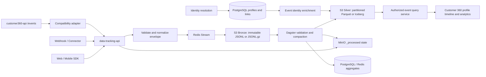

# Full Analytics With S3

> **Status:** implementation plan · **Owner:** analytics/platform team · **Date:** 2026-09-15
>
> **Goal:** make S3 the durable system of record for high-volume behavioral events and remove the 1B-row growth path from PostgreSQL without breaking identity resolution, profile analytics, or replay.

## 1. Decision Summary

`cdp_raw_events` should not remain the primary store for an event stream that may reach one billion rows. The target split is:

- **S3:** immutable event history and queryable event lake.
- **PostgreSQL:** identities, raw-profile staging, CRM data, and operational aggregates. The public tracking API does not connect to PostgreSQL.
- **Redis:** bounded handoff, rate limiting, short-lived counters, and locks. Redis is not the durable event ledger.
- **Dagster:** validation, compaction, backfill, aggregation, replay, and reconciliation.
- **Query service:** authorized event reads from the S3 silver layer. S3 must not be exposed directly to tenants.

Do not drop `cdp_raw_events` until all writers and readers are cut over, historical data is reconciled in S3, replay has passed, and the rollback window has expired.

## 2. Current Repository Reality

There are currently two event paths. They must converge before the PostgreSQL table can be retired.

| Path | Current behavior | Source of truth today | Migration impact |
|---|---|---|---|
| Public tracking ingestion | `data-tracking-api` validates batches, publishes to Redis Streams, then writes immutable gzip JSONL to S3 | S3 object plus `_processed/` marker | Extend envelope, compaction, quarantine, and durable processing state |
| Direct event API | `customer360-api` `/events` and `/events/bulk` write `CdpRawEvent` rows | PostgreSQL `cdp_raw_events` | Route writes through the S3 ingestion contract; preserve raw-profile resolution |
| Profile analytics | `profile360.py` queries `cdp_raw_events` for login counts, channels, interests, and timeline | PostgreSQL | Replace with an S3-backed query/projection layer |
| Dagster analytics | Scans S3 JSONL and updates Redis plus `sys_data_source` totals | S3 + Redis + PostgreSQL aggregates | Add state-marker discovery, compaction, validation, replay, and reconciliation |
| Identity resolution | Primarily consumes `cdp_raw_profiles_stage`; event rows are not the main CIR input | PostgreSQL profile staging | Keep profile staging in PostgreSQL; enrich events asynchronously |

Relevant current implementation:

- [data-tracking-api/core/storage.py](../../data-tracking-api/core/storage.py) writes S3 objects.
- [data-tracking-api/core/redis_queue.py](../../data-tracking-api/core/redis_queue.py) provides the durable Redis-to-S3 handoff.
- [customer360-api/core/routers/events_api.py](../../customer360-api/core/routers/events_api.py) writes PostgreSQL events directly.
- [customer360-api/core/crud/profile360.py](../../customer360-api/core/crud/profile360.py) reads PostgreSQL events directly.
- [backend-system/analytics/source_analytics/tracking_log_aggregation.py](../../backend-system/analytics/source_analytics/tracking_log_aggregation.py) scans S3 and updates source metrics.
- [database-init/database-schema.sql](../../database-init/database-schema.sql) creates the current partitioned `cdp_raw_events` table.

## 3. Target Impact Flow



### Data ownership after cutover

| Data | Storage | Mutability |
|---|---|---|
| Raw event envelope | S3 Bronze | Append-only; corrections are new records |
| Validated/queryable event data | S3 Silver | Rebuilt or versioned by partition |
| Event object status/checksum | MinIO `_processed/` marker | Immutable completion state |
| Raw identities and profile staging | PostgreSQL | Mutable, tenant-scoped |
| Resolved master profiles and links | PostgreSQL | Mutable, audited |
| Timeline and KPI projections | PostgreSQL or cache | Rebuildable serving data |

## 4. Storage Contract

### 4.1 Object layout

Use one environment-level event bucket, not one bucket per source. Keep the current per-source bucket behavior during migration if needed, but make the logical key layout stable:

```text
s3://c360-events-prod/
  bronze/events/tenant_id=<uuid>/source_id=<uuid>/event_date=YYYY-MM-DD/hour=HH/batch-<uuid>.jsonl.gz
  silver/events/v1/tenant_id=<uuid>/event_date=YYYY-MM-DD/hour=HH/part-<uuid>.parquet
  quarantine/events/tenant_id=<uuid>/event_date=YYYY-MM-DD/reason=<code>/batch-<uuid>.jsonl
  _processed/<object-id>.json
```

During migration, the tracking API keeps its existing per-source bucket
compatibility layout: `s3://data-tracking-<source-id>/events/<UTC-hour>/<batch>.jsonl.gz`
and `_processed/<object-id>.json`. The environment-level bucket and
`bronze/events/tenant_id=.../source_id=...` layout is a later storage cutover;
the logical envelope and state-marker contract must remain compatible across
both layouts.

Required properties:

- UTC event and receive timestamps.
- Tenant and source partition keys.
- Bronze objects immutable after successful upload.
- Parquet compression with Snappy or ZSTD.
- Target silver file size of roughly 256 MB to 1 GB.
- Lifecycle rules for bronze retention, silver retention, and archive retention.
- Versioning or object lock where compliance requires it.
- No tenant-facing direct bucket credentials.

The existing hourly JSONL batches are a valid landing format, but one object per request will create a small-file problem at scale. Compaction is a release requirement, not an optimization.

### 4.2 Canonical event envelope

```json
{
  "schema_version": 1,
  "event_id": "uuid",
  "tenant_id": "uuid",
  "source_id": "uuid",
  "source_system": "web",
  "event_time": "2026-09-15T14:22:11.123Z",
  "received_at": "2026-09-15T14:22:12.001Z",
  "event_name": "page-view",
  "event_category": "GENERAL",
  "event_dedup_key": "stable-key-or-null",
  "identity": {
    "user_id": "opaque-id-or-null",
    "session_id": "opaque-id-or-null",
    "device_id": "opaque-id-or-null",
    "anonymous_id": "opaque-id-or-null"
  },
  "master_profile_id": null,
  "payload": {}
}
```

Contract rules:

- Generate `event_id` before enqueueing the batch.
- Preserve an upstream event ID when present; otherwise generate a UUID.
- Define and document deterministic deduplication precedence: `event_id`, then source-provided dedup key, then a documented fallback hash.
- Store `schema_version` and `ingestion_version`.
- Never update Bronze objects in place.
- Represent corrections, deletes, and enrichment as new records or versioned Silver replacements.
- Reject or quarantine records with invalid tenant, source, timestamp, or envelope shape.

### 4.3 Durable processed state

Keep the public tracking API database-free. Store one small state marker in the
same MinIO/S3 source bucket for each successfully stored raw object. It must
never contain one row per event.

```text
_processed/<object-id>.json
- object_id
- bucket
- object_key
- data_source_id
- event_count
- content_sha256
- status: stored
```

The marker is the durable raw-ingestion ledger. Redis idempotency keys are
bounded caches that suppress duplicate queue publication; they may expire and
must never be the only recovery authority. Compaction may add separate Silver
state later without reconnecting the public tracking API to PostgreSQL.

## 5. Vibe-Coding Agent Checklist

An agent must complete each phase in order. Do not delete PostgreSQL event infrastructure while any earlier phase is incomplete.

### Phase 0: Baseline and contract

- [X] Confirm current writers, readers, S3 buckets, Redis stream names, Dagster jobs, and deployment environment variables. See the current-reality section and [FULL-ANALYTICS-WITH-S3-BASELINE.md](FULL-ANALYTICS-WITH-S3-BASELINE.md).
- [X] Record a baseline count and time range for PostgreSQL `cdp_raw_events`. Local baseline: 7,706 rows from 2025-09-14 through 2026-09-14..
- [X] Decide Bronze format (`jsonl.gz` recommended for the first cutover) and Silver format (`Parquet` first; `Iceberg` only if snapshot/schema-evolution requirements justify it). The decision is documented in [FULL-ANALYTICS-WITH-S3-BASELINE.md](FULL-ANALYTICS-WITH-S3-BASELINE.md).
- [X] Approve the event envelope and deduplication contract. The versioned envelope, event-ID precedence, fallback hash, and retry behavior are documented in [FULL-ANALYTICS-WITH-S3-BASELINE.md](FULL-ANALYTICS-WITH-S3-BASELINE.md).

**Gate status:** contract and format decisions are documented; retention, query-engine selection, rollback ownership, and tenant-isolation test evidence remain open.

### Phase 1: Durable S3 ingestion

- [X] Add event ID generation, schema versioning, normalized timestamps, and deterministic deduplication to the S3 ingestion path.
- [X] Add a MinIO `_processed/<object-id>.json` state-marker path with idempotent raw-object handling. Redis idempotency keys suppress duplicate publication, while MinIO state remains durable across Redis expiry and worker restarts; the public tracking API does not connect to PostgreSQL.
- [X] Keep Redis Streams acknowledged only after the S3 write succeeds.
- [X] Bound request, batch, object, and queue sizes; expose queue depth and oldest-pending age metrics. Request-body limits, event/batch limits, object-byte limits, stream/in-process queue bounds, `/queue-status`, and Prometheus-compatible `/metrics` are implemented. Alerting and scrape configuration remain an operations follow-up.
- [X] Add upload checksum and event-count metadata.
- [X] Make retries safe: the same Redis message or HTTP retry must not create a second logical event. Event IDs and batch keys are deterministic, Redis remains at-least-once, and focused retry/acknowledgement tests pass.

**Gate status:** unit-level retry and acknowledgement evidence is green; a real worker kill/restart integration proof and quarantine evidence remain open.

### Phase 2: Route the legacy event API to S3

- [ ] Define the compatibility adapter boundary: `customer360-api` may use PostgreSQL for authenticated tenant/source lookup and `cdp_raw_profiles_stage` resolution, but the public `data-tracking-api` must remain database-free.
- [ ] Authorize `tenant_id` and `data_source_id` from the authenticated caller and server-side source configuration; never trust a client-supplied tenant to choose an S3 prefix.
- [ ] Preserve `cdp_raw_profiles_stage` resolution and validation in `customer360-api`, including same-tenant and same-domain checks, without blocking the S3/Redis handoff on CIR completion.
- [ ] Replace direct `CdpRawEvent` insertion in `/events` and `/events/bulk` with the canonical S3 envelope and Redis handoff. Generate or preserve `event_id` before enqueueing, rather than relying on a PostgreSQL default.
- [ ] Return `202 Accepted` with stable event/batch/object identifiers only after the canonical batch is durably accepted by the Redis/S3 handoff; return a retryable error when the handoff is unavailable.
- [ ] Keep a compatibility response shape until clients migrate, but do not claim PostgreSQL insertion or expose internal storage credentials/keys beyond the intended acknowledgement fields.
- [ ] Add explicit feature flags for `EVENT_WRITE_BACKEND=postgres|dual|s3`, with an environment-specific default, startup validation, and a visible current-mode metric.
- [ ] During dual-write, compare event IDs, counts, timestamps, tenant/source IDs, dedup keys, payload hashes, and failure outcomes; make the comparison idempotent and alert on unexplained divergence.
- [ ] Add tests for cross-tenant source authorization, duplicate HTTP retries, queue/S3 failure responses, batch-size/body-size limits, raw-profile resolution, and compatibility responses.

**Gate:** every supported writer can send the same canonical envelope to S3; tenant/source authorization tests pass; duplicate and failure behavior is proven; and dual-write discrepancy rate is zero or explicitly explained for the agreed comparison window.

### Phase 3: Silver compaction and query service

- [ ] Add a Dagster compaction job that discovers `events/` Bronze objects and verifies the corresponding `_processed/<object-id>.json` raw-ingestion marker before processing.
- [ ] Validate the canonical envelope before compaction: schema/ingestion version, UUID event ID, UTC timestamps, source ID, allowed tenant/source binding, event count, and required payload shape.
- [ ] Deduplicate with documented precedence: `event_id`, then source `event_dedup_key`, then the canonical fallback hash; record duplicate counts without deleting Bronze data.
- [ ] Write partitioned Silver Parquet under `silver/events/v1/tenant_id=<uuid>/event_date=YYYY-MM-DD/hour=HH/` using Snappy or ZSTD and a target file size of roughly 256 MB to 1 GB.
- [ ] Verify Silver row count, schema, partition, and checksum before writing a versioned Silver completion marker under the MinIO state prefix; do not overload the raw `_processed` marker to imply compaction success.
- [ ] Quarantine malformed, unauthorized, checksum-mismatched, or schema-incompatible objects under a tenant-safe `quarantine/` prefix and write a failure marker without blocking unrelated tenants or hours.
- [ ] Choose and implement the query engine: DuckDB/Polars for low-concurrency service reads, or Trino/ClickHouse/dedicated query service for higher concurrency. Record the decision and supported SQL/schema subset.
- [ ] Enforce tenant and bounded time-range predicates before querying S3; reject requests that omit either predicate and never construct a query from an untrusted S3 key.
- [ ] Use stable cursor pagination ordered by `(event_time, event_id)`; never use unbounded `OFFSET` on event history.
- [ ] Return only the fields needed by the Customer 360 UI and redact sensitive payload fields by default.
- [ ] Add query latency, scanned-byte, object-count, compaction lag, quarantine count, checksum failure, and error metrics with tenant-safe low-cardinality labels.
- [ ] Add cross-tenant object-prefix and query-result tests, malformed-object quarantine tests, duplicate-event tests, partial-write recovery tests, and Silver schema/partition tests.

**Gate:** Silver output is reproducible and checksum-verified; quarantine is isolated; query predicates and cursor pagination are enforced; and profile timeline/aggregate endpoints return equivalent results from S3 Silver and PostgreSQL for the agreed comparison window with no tenant-isolation finding.

### Phase 4: Identity enrichment and backfill

- [ ] Keep CIR based on `cdp_raw_profiles_stage`, `cdp_profile_links`, and master profiles unless a measured requirement proves otherwise; do not make S3 event reads a hidden identity-resolution input.
- [ ] Do not mutate Bronze when a `master_profile_id` becomes known. Corrections/enrichment must be new versioned Silver records, mapping objects, or rebuildable projections.
- [ ] Choose one enrichment strategy and document its version semantics: versioned Silver rewrite, event identity mapping in S3, or a small recent-event projection in PostgreSQL. Define how readers select the authoritative version.
- [ ] Export existing PostgreSQL events month-by-month and map each row into the canonical envelope, preserving original event IDs/dedup keys, tenant/source ownership, event time, payload, and lineage to the source partition.
- [ ] Register every backfill object with an immutable MinIO raw-state marker and a resumable backfill checkpoint; do not reintroduce a PostgreSQL manifest dependency into the public tracking API.
- [ ] Compare source/destination counts, compressed-object and Silver checksums, min/max timestamps, tenant/source coverage, event IDs, deduplication results, and quarantine counts.
- [ ] Make backfill resumable by partition and object, with dry-run, rate limits, bounded memory, retry-safe deterministic keys, and an explicit partial-failure report.
- [ ] Test replay of a backfilled partition into a disposable Silver/projection environment and verify that rerunning it does not duplicate logical events.
- [ ] Define retention and privacy handling for copied payloads, including deletion/correction requests and access-log requirements.

**Gate:** every selected PostgreSQL event partition has a reconciled canonical S3 representation, verified tenant/source coverage, no unexplained checksum/count discrepancy, a tested replay path, and a documented identity-enrichment version.

### Phase 5: Read and write cutover

- [ ] Enable S3 shadow reads behind an explicit flag; shadow reads must be non-authoritative, bounded, tenant-scoped, sampled, and must not mutate caches or projections.
- [ ] Compare shadow responses with PostgreSQL using normalized event IDs, ordering, timestamps, fields, aggregate values, error behavior, latency, and scanned bytes; classify expected differences before cutover.
- [ ] Switch analytics reads to S3 Silver only after compaction lag, quarantine rate, query latency, and discrepancy SLOs pass for the comparison window.
- [ ] Switch profile timeline and event reads to the authorized query service; preserve CRM/profile data reads from PostgreSQL and verify cache invalidation semantics.
- [ ] Switch writers in stages: new tracking writers, legacy `/events` compatibility adapter, then S3-only. Keep an emergency dual-write path until the rollback window expires.
- [ ] Keep PostgreSQL `cdp_raw_events` read-only during the rollback window and block new direct inserts through application flags and database permissions where practical.
- [ ] Monitor event acceptance, Redis depth/oldest age, raw `_processed` lag, Silver compaction lag, query latency/scanned bytes, discrepancy counts, duplicate counts, and failed/quarantined objects.
- [ ] Document the exact rollback switch, data interval affected, operator permissions, and replay/reconciliation steps; rehearse it with a failure-injection test.
- [ ] Freeze schema/envelope changes during the cutover window or require a compatibility/versioning review for every change.

**Gate:** one complete retention window passes with no unexplained data loss, unacceptable query regression, unresolved duplicate/quarantine backlog, or tenant-isolation finding; rollback and replay have been rehearsed successfully.

### Phase 6: Remove PostgreSQL event storage

- [ ] Run a production/static dependency scan and runtime tracing review proving no writer, reader, report, test, scheduled job, cache path, or E2E assertion depends on `cdp_raw_events`; distinguish allowed `cdp_raw_profiles_stage` usage from event storage.
- [ ] Confirm all supported writers use the canonical versioned S3 envelope and that no public tracking container has PostgreSQL drivers, credentials, routes, or network permission.
- [ ] Archive the PostgreSQL table or final partitions according to the approved retention policy, including a restorable immutable backup and a recorded checksum/catalog.
- [ ] Reconcile the archive against S3 Bronze/Silver by tenant, source, event ID, date range, counts, checksums, duplicates, quarantines, and known late events.
- [ ] Add a forward migration that drops the old table only after archive restore, S3 replay, reconciliation, rollback approval, and the retention window are complete. The migration must be separately reviewed and reversible only through the documented replay path.
- [ ] Remove the ORM model, direct event CRUD, raw-event SQL, partition function, indexes, and RLS list entry only after the dependency scan is clean; keep raw-profile staging and identity tables intact.
- [ ] Convert `/events` and `/events/bulk` to the S3 compatibility/query contract or remove them through a versioned API deprecation; do not leave an endpoint that appears operational but writes nowhere.
- [ ] Remove or rewrite PostgreSQL event tests, fixtures, seed data, operational checks, and E2E assertions; add post-drop bootstrap and replay tests.
- [ ] Update operational checks, schema documentation, architecture diagrams, backup/restore runbooks, alert rules, and data-source documentation.
- [ ] Verify production rollback no longer requires the dropped table and that S3 replay can rebuild the required serving projections in the documented recovery objective.

**Gate:** archive restore, S3 reconciliation, replay, tenant-isolation, dependency-scan, and post-drop bootstrap tests all pass; production rollback uses the documented S3 replay/projection recovery path rather than `cdp_raw_events`.

## 6. Updated Code and Document File Plan

### 6.1 Files to modify

| File | Planned change | Phase |
|---|---|---:|
| [data-tracking-api/core/storage.py](../../data-tracking-api/core/storage.py) | Canonical envelope, event IDs, compression, checksums, stable key layout, object metadata | 1 |
| [data-tracking-api/core/service.py](../../data-tracking-api/core/service.py) | Normalize event identity and deduplication inputs before storage | 1 |
| [data-tracking-api/core/redis_queue.py](../../data-tracking-api/core/redis_queue.py) | Preserve at-least-once behavior; carry envelope/version/checksum metadata; expose retry metrics | 1 |
| [data-tracking-api/core/buffered_storage.py](../../data-tracking-api/core/buffered_storage.py) | Align local buffered mode with the same durable envelope and retry semantics | 1 |
| [data-tracking-api/core/routers/tracking.py](../../data-tracking-api/core/routers/tracking.py) | Return durable batch/object identifiers and expose bounded queue status | 1 |
| [customer360-api/core/routers/events_api.py](../../customer360-api/core/routers/events_api.py) | Replace direct PostgreSQL event writes with the S3 compatibility adapter; retain profile staging | 2 |
| [customer360-api/core/models/events.py](../../customer360-api/core/models/events.py) | Temporary dual-write compatibility only; remove in Phase 6 | 2, 6 |
| [customer360-api/core/schemas/events.py](../../customer360-api/core/schemas/events.py) | Add event/batch acknowledgement fields and preserve client compatibility | 2 |
| [customer360-api/core/crud/profile360.py](../../customer360-api/core/crud/profile360.py) | Replace direct `cdp_raw_events` SQL with query-service/projection calls | 3 |
| [customer360-api/core/routers/identity_api.py](../../customer360-api/core/routers/identity_api.py) | Update timeline/engagement dependencies if the router exposes those profile analytics | 3 |
| [backend-system/analytics/source_analytics/tracking_log_aggregation.py](../../backend-system/analytics/source_analytics/tracking_log_aggregation.py) | Process MinIO `events/` and `_processed/` state, compact Silver data, reconcile counts, and retain Redis as cache only | 1, 3 |
| [backend-system/analytics/dagster_defs.py](../../backend-system/analytics/dagster_defs.py) | Register compaction, reconciliation, backfill, and replay jobs/schedules | 3, 4 |
| [database-init/database-schema.sql](../../database-init/database-schema.sql) | Keep tracking state out of the public API database; remove raw-event table only in Phase 6 | 1, 6 |
| [database-init/migrations/001_harden_tenant_rls_policies.sql](../../database-init/migrations/001_harden_tenant_rls_policies.sql) | Keep the public tracking service outside PostgreSQL tenant-control paths | 1 |
| [customer360-api/core/config.py](../../customer360-api/core/config.py) | Add event backend, query engine, time-range, bucket, and feature-flag settings | 2, 3, 5 |
| [data-tracking-api/core/config.py](../../data-tracking-api/core/config.py) | Add envelope, bucket, compression, request-limit, Redis idempotency, and processed-state settings | 1 |
| [backend-system/analytics/source_analytics/](../../backend-system/analytics/source_analytics/) | Add state-marker handling, compaction, quarantine, reconciliation, and backfill modules | 3, 4 |
| [deployments/server/deploy-tracking.sh](../../deployments/server/deploy-tracking.sh) | Inject production S3 prefixes, Redis idempotency, and observability settings without PostgreSQL credentials | 1, 5 |
| [deployments/server/deploy-backend.sh](../../deployments/server/deploy-backend.sh) | Inject Dagster compaction/backfill settings and S3 permissions | 3, 4 |
| [deployments/storage/variables.tf](../../deployments/storage/variables.tf) | Add event-bucket lifecycle/versioning/retention inputs | 1 |
| [deployments/storage/main.tf](../../deployments/storage/main.tf) | Provision event bucket/prefix policy or lifecycle configuration | 1 |

### 6.2 New files to add

| File | Purpose |
|---|---|
| `customer360-api/core/event_storage.py` or shared equivalent | Common event envelope and S3 enqueue adapter used by legacy API and tracking API |
| `backend-system/analytics/source_analytics/event_state.py` | MinIO `_processed/` state reads, versioned status transitions, checksum validation, and idempotency |
| `backend-system/analytics/source_analytics/event_compaction.py` | Bronze validation, deduplication, Parquet/Iceberg writes, and quarantine |
| `backend-system/analytics/source_analytics/event_reconciliation.py` | Count, checksum, range, tenant, and replay verification |
| `backend-system/analytics/source_analytics/event_backfill.py` | Partitioned PostgreSQL export to canonical S3 RAW objects with resumable checkpoints and state markers |
| `customer360-api/core/repositories/event_query_repository.py` | Tenant-safe event queries against Silver data or a dedicated query engine |
| `customer360-api/tests/test_event_storage.py` | Envelope, deduplication, retry, and S3 acknowledgement tests |
| `backend-system/analytics/tests/test_event_compaction.py` | Validation, compaction, quarantine, state-marker, and reconciliation tests |
| `backend-system/analytics/tests/test_event_backfill.py` | Resumable backfill and partition checksum tests |

The exact module names may change after the implementation agent inspects local package boundaries. The responsibilities must not disappear.

### 6.3 Files to update for documentation and operations

| File | Required update |
|---|---|
| [docs/data-sources/4-s3-files-synch.md](../data-sources/4-s3-files-synch.md) | Make S3 Bronze/Silver the event source of truth; remove the implication that S3 always loads every event into `cdp_raw_events` |
| [docs/data-sources/1-web-sdk-tracking.md](../data-sources/1-web-sdk-tracking.md) | Update the flow from SDK to S3-backed ingestion and query projections |
| [docs/data-sources/3-web-hook-api.md](../data-sources/3-web-hook-api.md) | Replace direct PostgreSQL event-storage wording with the S3 ingestion contract |
| [docs/data-sources/5-mobile-sdk-tracking.md](../data-sources/5-mobile-sdk-tracking.md) | Document the same envelope, retry, and replay behavior as web tracking |
| [docs/architecture/TECHNICAL-DOCUMENTATION.md](../architecture/TECHNICAL-DOCUMENTATION.md) | Update the architecture diagram and storage ownership model |
| [docs/operations/database/check-db-data.sql](../operations/database/check-db-data.sql) | Replace raw-event row checks with aggregate checks; pair with S3 state, lag, quarantine, and reconciliation checks |
| [all-data-simulator/README.md](../../all-data-simulator/README.md) | Verify S3 RAW objects, `_processed/` state, compaction output, and query results rather than requiring a matching PostgreSQL event row |
| [all-data-simulator/run_tracking_analytics_e2e.sh](../../all-data-simulator/run_tracking_analytics_e2e.sh) | Change E2E validation to assert Bronze upload, raw/Silver state markers, Silver materialization, and aggregate correctness |
| [backend-system/deployment.md](../../backend-system/deployment.md) | Add compaction/backfill/replay jobs and S3 readiness requirements |
| [docs/code-review/README.md](../code-review/README.md) | Update raw-event storage/security review checklist after the design is implemented |

## 7. Tests and Acceptance Evidence

The implementation agent must provide evidence for each item below.

### Unit and contract tests

- [ ] Envelope serialization is deterministic and preserves nested payloads.
- [ ] Event IDs and deduplication are stable across retries.
- [ ] Redis messages remain pending when S3 fails and are acknowledged only after S3 succeeds.
- [ ] MinIO raw and Silver state-marker transitions are idempotent and do not regress completed objects.
- [ ] Invalid, unauthorized, checksum-mismatched, and schema-incompatible records are quarantined with tenant-safe paths.
- [ ] Compaction produces the expected Parquet schema, compression, partition layout, row counts, and checksums.
- [ ] Backfill resumes after interruption without skipping or duplicating a partition.
- [ ] Query filters always include tenant scope and a bounded time predicate, and cursor pagination is stable.

### Integration and E2E tests

- [ ] Submit events through `data-tracking-api`; verify S3 Bronze objects.
- [ ] Submit events through legacy `customer360-api`; verify they use the same S3 contract.
- [ ] Run Dagster compaction; verify Silver object, state-marker status, checksums, partitions, and counts.
- [ ] Run the event query path; compare timeline and aggregate results with the PostgreSQL baseline.
- [ ] Run a retry/restart scenario with Redis and S3 failures.
- [ ] Run a cross-tenant access test and confirm no object or query result escapes tenant scope.
- [ ] Run the full tracking analytics E2E script in UAT.
- [ ] Run a replay from S3 into a disposable environment and compare checksums/counts.

### Production readiness checks

- [ ] S3 bucket versioning/lifecycle/retention is applied and verified.
- [ ] S3 credentials are least-privilege and cannot list or read another tenant's prefix.
- [ ] Raw `_processed` lag, Silver state lag, queue depth, oldest pending message, quarantine count, compaction lag, and query latency are monitored.
- [ ] Alert thresholds and on-call runbooks exist.
- [ ] Backfill throughput and monthly storage cost have been measured before the 1B-row migration.
- [ ] Rollback has been rehearsed before disabling PostgreSQL event writes.

## 8. Rollout and Rollback

Use feature flags or environment settings:

```text
EVENT_WRITE_BACKEND=postgres|dual|s3
EVENT_READ_BACKEND=postgres|shadow_s3|s3
EVENT_QUERY_ENGINE=duckdb|polars|trino|clickhouse
EVENT_QUERY_MAX_DAYS=90
EVENT_S3_BUCKET=<environment-event-bucket>
EVENT_RAW_PREFIX=events
EVENT_BRONZE_PREFIX=bronze/events
EVENT_SILVER_PREFIX=silver/events/v1
TRACKING_PROCESSED_PREFIX=_processed
EVENT_STATE_PREFIX=_processed/silver
EVENT_QUARANTINE_PREFIX=quarantine/events
EVENT_SHADOW_READS=false
EVENT_DUAL_WRITE_COMPARE=false
```

Rollout order:

1. Deploy the canonical envelope and MinIO raw-state markers without changing existing reads.
2. Enable legacy-writer shadow/dual writes and reconcile event IDs, payload hashes, counts, timestamps, and tenant/source ownership.
3. Enable Bronze validation, quarantine, Silver compaction, and query shadow reads.
4. Switch analytics reads to S3 Silver and verify aggregate equivalence.
5. Switch profile timeline and event reads to the authorized query service and verify tenant/time predicates.
6. Switch all event writers to S3-only after the dual-write discrepancy gate passes.
7. Keep PostgreSQL event partitions read-only for one complete retention window while retaining the rollback switch.
8. Archive and drop PostgreSQL event storage in a separate, independently approved release.

Rollback before the drop:

1. Freeze the affected writer/read flags and record the cutover interval.
2. Set `EVENT_WRITE_BACKEND=dual` or `postgres` only for the legacy compatibility path; the public tracking API remains Redis/S3-only.
3. Set `EVENT_READ_BACKEND=postgres` for the affected serving path, if the table still exists.
4. Pause only the failing compaction/query component; retain immutable Bronze objects and raw state markers.
5. Reconcile the cutover interval from S3, quarantine unexplained objects, and replay the corrected Silver/projection partition before resuming.

After `cdp_raw_events` is dropped, rollback means replaying S3 into a disposable or replacement projection. It is no longer a simple feature-flag switch.

## 9. Final Removal Gate

Remove PostgreSQL raw-event infrastructure only when every statement is true:

- [ ] No writer imports `CdpRawEvent` or inserts `cdp_raw_events`.
- [ ] No API, repository, report, test, script, or E2E check queries `cdp_raw_events`.
- [ ] All supported ingestion modes use the canonical S3 envelope.
- [ ] Bronze objects, raw/Silver state markers, Silver partitions, quarantine handling, and replay jobs are operational.
- [ ] Historical PostgreSQL events have reconciled S3 copies.
- [ ] Profile timelines and analytics meet agreed latency/error SLOs.
- [ ] Tenant-isolation tests pass for direct API access, query service access, and S3 paths.
- [ ] The retention and rollback windows have expired.

Only then:

- [ ] Remove `CdpRawEvent` and its event-storage schemas/routes or convert the route to the S3 query contract; retain `cdp_raw_profiles_stage` and identity-resolution APIs.
- [ ] Remove raw-event SQL and PostgreSQL event tests.
- [ ] Remove `cdp_raw_events`, its partitions, partition function, indexes, and RLS entries from the canonical schema and forward migrations.
- [ ] Run the complete bootstrap and migration test against a disposable PostgreSQL database.
- [ ] Run the full S3 tracking/analytics E2E test.

**Principle:** S3 is the immutable event lake; PostgreSQL is the identity and operational database; aggregates and serving projections stay small, rebuildable, and intentional.