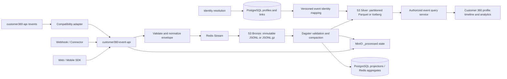

# Full Analytics With S3

> **Status:** living implementation plan · **Owner:** analytics/platform team · **Last reviewed:** 2026-09-16
>
> **Goal:** make S3 the durable system of record for high-volume behavioral events and remove the 1B-row growth path from PostgreSQL without breaking identity resolution, profile analytics, or replay. Phase 1 RAW ingestion and an interim read-only S3 query path are implemented; Silver compaction and serving-projection cutover remain open. **No analytics job or S3 onboarding job may write the retired PostgreSQL event ledger.**

## 1. Decision Summary

The PostgreSQL event ledger must not be used for an event stream that may reach one billion rows. The target split is:

- **S3:** immutable event history and queryable event lake.
- **PostgreSQL:** identities, raw-profile staging, CRM data, and small rebuildable analytics projections/aggregates. It is not an event ledger, and the public tracking API does not connect to PostgreSQL.
- **Redis:** bounded handoff, rate limiting, short-lived counters, and locks. Redis is not the durable event ledger.
- **Dagster:** validation, compaction, backfill, aggregation, replay, and reconciliation.
- **Query service:** authorized event reads from the S3 Silver layer. S3 must not be exposed directly to tenants.
- **Legacy PostgreSQL event ledger:** removed by the forward migration after archive/replay approval. It receives no new data from S3, analytics, APIs, or background jobs.

Do not remove the legacy event-storage migration until all writers and readers are cut over, historical data is reconciled in S3, replay has passed, and the rollback window has expired.


### Universal analytics job contract

Every analytics job and every S3-to-PostgreSQL onboarding job must execute this
sequence, regardless of whether it is a Dagster asset, scheduled script, replay,
or backfill:

1. Discover only immutable Bronze/Silver objects with a tenant-safe prefix and a
  durable state marker.
2. Validate each record against the versioned JSON Schema before parsing business
  fields; quarantine invalid records without changing the source object.
3. Verify the PostgreSQL source mapping for `tenant_id` and `data_source_id`, then
  apply a bounded UTC time window.
4. Deduplicate using `event_id`, then `event_dedup_key`, then the documented
  fallback hash; record counts and checksums for the run.
5. Write only the explicitly approved profile staging, aggregate, or rebuildable
  projection output. Never write an event row to a PostgreSQL event ledger.
6. Commit an idempotent checkpoint containing input object keys, schema version,
  tenant/source scope, output version, counts, checksums, quarantine count, and
  replay key.

If a job cannot satisfy this contract, it must stop before any PostgreSQL write.
### Non-negotiable write boundary

S3 Bronze and Silver are the authoritative event stores. S3-to-PostgreSQL onboarding
is allowed only for data that is explicitly needed by a bounded operational workflow:

| Destination | Allowed S3-to-PostgreSQL use | Event-row rule |
|---|---|---|
| `cdp_raw_profiles_stage` | Upsert identity-bearing profile staging records for CIR | May contain profile identity inputs, never the event ledger or full event history |
| `sys_data_source` | Update source totals and bounded health statistics | Aggregate counters only; no event payloads |
| Rebuildable analytics/projection tables | Store small tenant-scoped KPIs, timeline projections, or serving summaries when a job explicitly owns that projection | Must be versioned, rebuildable from S3, and documented with its source interval/checksum |
| Legacy PostgreSQL event ledger | None | **No INSERT, UPDATE, UPSERT, COPY, trigger, backfill, or delete-on-ingest path** |

Every analytics job must declare its S3 input prefix, JSON Schema version, tenant/time
scope, output table or cache, and replay key. A PostgreSQL write is invalid if it is
used to mirror one S3 event per row into a PostgreSQL event ledger or any undocumented event
ledger. PostgreSQL may contain derived operational results; S3 remains the source from
which those results are rebuilt.

## 2. Current Repository Reality

There are currently two event paths. They must converge before the PostgreSQL table can be retired.

| Path | Current behavior | Source of truth today | Migration impact |
|---|---|---|---|
| Public tracking ingestion | `customer360-event-api` validates batches, publishes to Redis Streams, then writes immutable gzip JSONL to S3 | S3 object plus `_processed/` marker | Extend envelope, compaction, quarantine, and durable processing state |
| Customer event query API | `customer360-api` `/api/v1/events/` is a read-only compatibility query over per-source S3/MinIO RAW objects; it validates tenant-owned active sources, normalizes with Polars, and caches responses in Redis | S3 RAW objects, with PostgreSQL used for active source lookup | Replace interim RAW queries with bounded Silver queries and preserve tenant/time predicates |
| Profile analytics | `profile360.py` queries S3 for login counts, channels, interests, and timeline | S3 plus PostgreSQL CRM data | Keep the S3-backed query/projection layer authoritative |
| Dagster analytics | Scans S3 JSONL, validates the JSON contract, and updates Redis plus bounded PostgreSQL aggregates/profile staging | S3 + Redis + approved PostgreSQL projections | Add state-marker discovery, compaction, validation, replay, and reconciliation; never create an event ledger in PostgreSQL |
| Identity resolution | Primarily consumes `cdp_raw_profiles_stage`; event rows are not the main CIR input | PostgreSQL profile staging | Keep profile staging in PostgreSQL; enrich events asynchronously |

Relevant current implementation:

- [customer360-event-api/core/storage.py](../../customer360-event-api/core/storage.py) writes S3 objects.
- [customer360-event-api/core/redis_queue.py](../../customer360-event-api/core/redis_queue.py) provides the durable Redis-to-S3 handoff.
- [customer360-event-api/core/routers/tracking.py](../../customer360-event-api/core/routers/tracking.py) exposes the `202 Accepted` tracking ingestion route and queue-status endpoint.
- [customer360-api/core/routers/events_s3_api.py](../../customer360-api/core/routers/events_s3_api.py) exposes the read-only `/api/v1/events/` compatibility query.
- [customer360-api/core/repositories/event_query_repository.py](../../customer360-api/core/repositories/event_query_repository.py) validates active tenant-owned sources, derives `data-tracking-<data_source_id>` buckets, reads RAW JSONL, and processes rows with Polars.
- [customer360-api/core/cache.py](../../customer360-api/core/cache.py) provides fail-open Redis response caching; the events route includes tenant, datetime, source, filter, and pagination parameters in its cache key.
- [customer360-api/core/crud/profile360.py](../../customer360-api/core/crud/profile360.py) reads behavioral events through the tenant-scoped S3 event repository.
- [customer360-backend/analytics/source_analytics/tracking_log_aggregation.py](../../customer360-backend/analytics/source_analytics/tracking_log_aggregation.py) scans S3 and updates source metrics.
- [customer360-database/database-schema.sql](../../customer360-database/database-schema.sql) defines S3/MinIO as the behavioral-event system of record.

The current implementation has an intentional split: the public tracking API is
database-free, while the customer API's read-only compatibility route may use
PostgreSQL for tenant/source authorization and S3/MinIO for event data. The
route defaults to `EVENT_QUERY_MAX_DAYS=180`, returns `404` for an invalid,
inactive, or cross-tenant requested source, and returns `503` for event-lake
failures. A missing per-source bucket is treated as an empty source; it does
not cause repeated date-by-date `ListObjectsV2` failures.

## 3. Target Impact Flow



### Data ownership after cutover

| Data | Storage | Mutability |
|---|---|---|
| Raw event envelope | S3 Bronze | Append-only; corrections are new records |
| Validated/queryable event data | S3 Silver | Rebuilt or versioned by partition |
| Event object status/checksum | MinIO `_processed/` marker | Immutable completion state |
| Raw identities and profile staging | PostgreSQL | Mutable, tenant-scoped |
| Resolved master profiles and links | PostgreSQL | Mutable, audited |
| Timeline and KPI projections | PostgreSQL or cache | Rebuildable serving data; never the event ledger |

## 4. Storage Contract

### 4.1 Object layout

Use one environment-level event bucket, not one bucket per source. Keep the current per-source bucket behavior during migration if needed, but make the logical key layout stable:

```text
s3://c360-events-prod/
  bronze/events/tenant_id=<uuid>/data_source_id=<uuid>/event_date=YYYY-MM-DD/hour=HH/batch-<uuid>.jsonl.gz
  silver/events/v1/tenant_id=<uuid>/event_date=YYYY-MM-DD/hour=HH/part-<uuid>.parquet
  quarantine/events/tenant_id=<uuid>/event_date=YYYY-MM-DD/reason=<code>/batch-<uuid>.jsonl
  _processed/<object-id>.json
```

During migration, the tracking API keeps its existing per-source bucket
compatibility layout: `s3://data-tracking-<source-id>/events/<UTC-hour>/<batch>.jsonl.gz`
and `_processed/<object-id>.json`. The environment-level bucket and
`bronze/events/tenant_id=.../source_id=...` layout is a later storage cutover;
the logical envelope and state-marker contract must remain compatible across
both layouts.

Required properties:

- UTC event and receive timestamps.
- Tenant and source partition keys.
- Bronze objects immutable after successful upload.
- Parquet compression with Snappy or ZSTD.
- Target silver file size of roughly 256 MB to 1 GB.
- Lifecycle rules for bronze retention, silver retention, and archive retention.
- Versioning or object lock where compliance requires it.
- No tenant-facing direct bucket credentials.

The existing hourly JSONL batches are a valid landing format, but one object per request will create a small-file problem at scale. Compaction is a release requirement, not an optimization.

### 4.2 Canonical event envelope

```json
{
  "schema_version": 1,
  "event_id": "uuid",
  "tenant_id": "uuid",
  "data_source_id": "uuid",
  "source_system": "web",
  "domain": "retail",
  "event_time": "2026-09-15T14:22:11.123Z",
  "received_at": "2026-09-15T14:22:12.001Z",
  "event_name": "page-view",
  "event_category": "GENERAL",
  "event_dedup_key": "stable-key-or-null",
  "identity": {
    "user_id": "opaque-id-or-null",
    "session_id": "opaque-id-or-null",
    "device_id": "opaque-id-or-null",
    "anonymous_id": "opaque-id-or-null"
  },
  "master_profile_id": null,
  "payload": {}
}
```

Contract rules:

- Generate `event_id` before enqueueing the batch.
- Preserve an upstream event ID when present; otherwise generate a UUID.
- Define and document deterministic deduplication precedence: `event_id`, then source-provided dedup key, then a documented fallback hash.
- Store `schema_version` and `ingestion_version`.
- Never update Bronze objects in place.
- Represent corrections, deletes, and enrichment as new records or versioned Silver replacements.
- Reject or quarantine records with invalid tenant, source, timestamp, or envelope shape.

### 4.2.1 Canonical JSON Schema for S3 events

The following Draft 2020-12 schema is the versioned contract for every event
record in Bronze JSONL and the logical row produced by Silver compaction. It is
the replacement for the PostgreSQL table shape. `payload` retains source-specific
fields; governed fields formerly represented as relational event columns are promoted to the
envelope so every analytics job can use the same names without querying a row
store. Nullable fields remain present when the source has no value.

```json
{
  "$schema": "https://json-schema.org/draft/2020-12/schema",
  "$id": "https://schemas.leo-customer360.local/events/v1/event.json",
  "title": "Customer 360 canonical event",
  "type": "object",
  "additionalProperties": false,
  "required": [
    "schema_version",
    "ingestion_version",
    "event_id",
    "tenant_id",
    "data_source_id",
    "source_system",
    "domain",
    "event_time",
    "received_at",
    "event_name",
    "event_category",
    "event_dedup_key",
    "identity",
    "payload"
  ],
  "properties": {
    "schema_version": { "const": 1 },
    "ingestion_version": { "type": "string", "minLength": 1 },
    "event_id": { "type": "string", "format": "uuid" },
    "tenant_id": { "type": "string", "format": "uuid" },
    "data_source_id": { "type": "string", "format": "uuid" },
    "user_id": { "type": ["string", "null"], "format": "uuid" },
    "source_system": { "type": "string", "minLength": 1, "maxLength": 100 },
    "domain": { "type": "string", "minLength": 1, "maxLength": 50 },
    "master_profile_id": { "type": ["string", "null"], "format": "uuid" },
    "raw_profile_id": { "type": ["string", "null"], "format": "uuid" },
    "event_time": { "type": "string", "format": "date-time" },
    "received_at": { "type": "string", "format": "date-time" },
    "event_name": { "type": "string", "minLength": 1, "maxLength": 200 },
    "event_category": {
      "type": "string",
      "enum": [
        "GENERAL",
        "EDUCATION",
        "COMMERCE",
        "FEEDBACK",
        "FINANCE",
        "STOCK_TRADING",
        "TRAVEL",
        "REAL_ESTATE",
        "SERVICE_INDUSTRY"
      ]
    },
    "event_dedup_key": { "type": ["string", "null"], "maxLength": 500 },
    "identity": {
      "type": "object",
      "additionalProperties": false,
      "properties": {
        "user_id": { "type": ["string", "null"] },
        "session_id": { "type": ["string", "null"] },
        "device_id": { "type": ["string", "null"] },
        "device_fingerprint": { "type": ["string", "null"] },
        "anonymous_id": { "type": ["string", "null"] },
        "advertising_id": { "type": ["string", "null"] },
        "cookie_id": { "type": ["string", "null"] },
        "external_customer_id": { "type": ["string", "null"] },
        "email": { "type": ["string", "null"] },
        "phone_number": { "type": ["string", "null"] }
      }
    },
    "channel": { "type": ["string", "null"], "maxLength": 100 },
    "platform": { "type": ["string", "null"], "maxLength": 50 },
    "ip_address": { "type": ["string", "null"], "maxLength": 100 },
    "user_agent": { "type": ["string", "null"] },
    "media_source": { "type": ["string", "null"], "maxLength": 200 },
    "campaign": { "type": ["string", "null"], "maxLength": 500 },
    "is_conversion": { "type": "boolean", "default": false },
    "entity_type": { "type": ["string", "null"], "maxLength": 100 },
    "entity_id": { "type": ["string", "null"], "maxLength": 255 },
    "event_value": { "type": ["number", "null"] },
    "currency": {
      "type": ["string", "null"],
      "pattern": "^[A-Z]{3}$"
    },
    "transaction_id": { "type": ["string", "null"], "maxLength": 255 },
    "transaction_status": { "type": ["string", "null"], "maxLength": 50 },
    "location_code": { "type": ["string", "null"], "maxLength": 255 },
    "location_name": { "type": ["string", "null"], "maxLength": 500 },
    "geo_location": {
      "oneOf": [
        { "type": "null" },
        {
          "type": "object",
          "properties": {
            "type": { "const": "Point" },
            "coordinates": {
              "type": "array",
              "prefixItems": [
                { "type": "number", "minimum": -180, "maximum": 180 },
                { "type": "number", "minimum": -90, "maximum": 90 }
              ],
              "minItems": 2,
              "maxItems": 2
            }
          },
          "required": ["type", "coordinates"],
          "additionalProperties": false
        }
      ]
    },
    "payload": { "type": "object" }
  }
}
```

Relational-to-JSON conversion is deterministic: `event_payload` becomes
`payload`; `created_at` becomes the ingestion timestamp represented by
`received_at`; identity columns become `identity.*`; and the remaining governed
columns retain their names at the envelope root. `source_id` is not a second
name for the source: the canonical field is `data_source_id`. Silver may flatten
these fields for columnar query performance, but it must validate the envelope
before flattening it.

Schema validation rules for all analytics jobs:

- Validate every record before aggregation, projection, or PostgreSQL onboarding.
- Treat `tenant_id` and `data_source_id` as authoritative only after checking the
  source-to-tenant mapping from PostgreSQL; quarantine mismatches.
- Use UTC `event_time` for event windows and `received_at` for ingestion lag.
- Preserve `payload` byte-for-byte at the logical JSON value level; never discard
  source fields merely because they are not promoted columns.
- Quarantine schema failures and continue processing unrelated tenants and
  partitions; never repair an invalid Bronze object in place.

### 4.3 Durable processed state

Keep the public tracking API database-free. Store one small state marker in the
same MinIO/S3 source bucket for each successfully stored raw object. It must
never contain one row per event.

```text
_processed/<object-id>.json
- object_id
- bucket
- object_key
- data_source_id
- event_count
- content_sha256
- status: stored
```

The marker is the durable raw-ingestion ledger. Redis idempotency keys are
bounded caches that suppress duplicate queue publication; they may expire and
must never be the only recovery authority. Compaction may add separate Silver
state later without reconnecting the public tracking API to PostgreSQL.

## 5. Vibe-Coding Agent Checklist

An agent must complete each phase in order. Do not delete PostgreSQL event infrastructure while any earlier phase is incomplete.

### Phase 0: Baseline and contract

- [X] Confirm current writers, readers, S3 buckets, Redis stream names, Dagster jobs, and deployment environment variables. See the current-reality section and [FULL-ANALYTICS-WITH-S3-BASELINE.md](FULL-ANALYTICS-WITH-S3-BASELINE.md).
- [X] Record the pre-cutover event count and time range. Historical baseline: 7,706 rows from 2025-09-14 through 2026-09-14.
- [X] Decide Bronze format (`jsonl.gz` recommended for the first cutover) and Silver format (`Parquet` first; `Iceberg` only if snapshot/schema-evolution requirements justify it). The decision is documented in [FULL-ANALYTICS-WITH-S3-BASELINE.md](FULL-ANALYTICS-WITH-S3-BASELINE.md).
- [X] Approve the event envelope and deduplication contract. The versioned envelope, event-ID precedence, fallback hash, and retry behavior are documented in [FULL-ANALYTICS-WITH-S3-BASELINE.md](FULL-ANALYTICS-WITH-S3-BASELINE.md).

**Gate status:** contract and format decisions are documented; retention, query-engine selection, rollback ownership, and tenant-isolation test evidence remain open.

### Phase 1: Durable S3 ingestion

- [X] Add event ID generation, schema versioning, normalized timestamps, and deterministic deduplication to the S3 ingestion path.
- [X] Add a MinIO `_processed/<object-id>.json` state-marker path with idempotent raw-object handling. Redis idempotency keys suppress duplicate publication, while MinIO state remains durable across Redis expiry and worker restarts; the public tracking API does not connect to PostgreSQL.
- [X] Keep Redis Streams acknowledged only after the S3 write succeeds.
- [X] Bound request, batch, object, and queue sizes; expose queue depth and oldest-pending age metrics. Request-body limits, event/batch limits, object-byte limits, stream/in-process queue bounds, `/queue-status`, and Prometheus-compatible `/metrics` are implemented. Alerting and scrape configuration remain an operations follow-up.
- [X] Add upload checksum and event-count metadata.
- [X] Make retries safe: the same Redis message or HTTP retry must not create a second logical event. Event IDs and batch keys are deterministic, Redis remains at-least-once, and focused retry/acknowledgement tests pass.

**Gate status:** unit-level retry and acknowledgement evidence is green; a real worker kill/restart integration proof and quarantine evidence remain open.

### Phase 2: Route the legacy event API to S3

- [X] Define the compatibility adapter boundary: `customer360-api` may use PostgreSQL for authenticated tenant/source lookup and `cdp_raw_profiles_stage` resolution, but the public `customer360-event-api` remains database-free. Neither service writes a PostgreSQL event ledger.
- [X] Authorize the read-only `/api/v1/events/` path with the authenticated tenant context and active tenant-owned `sys_data_source` rows; a requested inactive, missing, malformed, or cross-tenant source is rejected before S3/Polars processing. The write-side compatibility adapter is still open.
- [ ] Preserve `cdp_raw_profiles_stage` resolution and validation in `customer360-api`, including same-tenant and same-domain checks, without blocking the S3/Redis handoff on CIR completion.
- [X] Remove direct legacy event-table insertion in the retired `/events` and `/events/bulk` endpoints. Generate or preserve `event_id` in every remaining writer before canonical S3/Redis enqueueing.
- [X] Add the interim read-only `/api/v1/events/` query over per-source RAW JSONL/JSONL.GZ objects, with bounded time filtering, event filters, stable `(event_time, event_id)` ordering, and API pagination limits.
- [X] Add fail-open Redis response caching for `/api/v1/events/`; cache keys include tenant, datetime range, source, filters, and pagination values. Cache invalidation/cutover behavior remains part of the Silver migration work.
- [ ] Return `202 Accepted` with stable event/batch/object identifiers only after the canonical batch is durably accepted by the Redis/S3 handoff; return a retryable error when the handoff is unavailable.
- [ ] Keep a compatibility response shape until clients migrate, but do not claim PostgreSQL insertion or expose internal storage credentials/keys beyond the intended acknowledgement fields.
- [X] Add an explicit `EVENT_WRITE_BACKEND=s3` feature flag with startup validation and a visible current-mode metric. `postgres` and `dual` are forbidden values because no new event may be written to PostgreSQL.
- [ ] During the migration comparison window, compare S3 event IDs, counts, timestamps, tenant/source IDs, dedup keys, payload hashes, and failure outcomes with the archived PostgreSQL baseline; do not dual-write new events to PostgreSQL.
- [ ] Add tests for cross-tenant source authorization, duplicate HTTP retries, queue/S3 failure responses, batch-size/body-size limits, raw-profile resolution, and compatibility responses.

**Gate:** every supported writer can send the same canonical envelope to S3; tenant/source authorization tests pass; duplicate and failure behavior is proven; and the S3-versus-legacy-archive discrepancy rate is zero or explicitly explained for the agreed comparison window.

### Phase 3: Silver compaction and query service

The repository currently has an interim RAW query implementation: it reads
`events/<UTC-hour>/*.jsonl.gz` from `data-tracking-<data_source_id>` buckets,
validates the active source mapping in PostgreSQL, and normalizes records with
Polars. This is not Silver compaction and does not satisfy the final query
service gate below.

- [ ] Add a Dagster compaction job that discovers `events/` Bronze objects and verifies the corresponding `_processed/<object-id>.json` raw-ingestion marker before processing.
- [ ] Validate the canonical envelope before compaction: schema/ingestion version, UUID event ID, UTC timestamps, source ID, allowed tenant/source binding, event count, and required payload shape.
- [ ] Deduplicate with documented precedence: `event_id`, then source `event_dedup_key`, then the canonical fallback hash; record duplicate counts without deleting Bronze data.
- [ ] Write partitioned Silver Parquet under `silver/events/v1/tenant_id=<uuid>/event_date=YYYY-MM-DD/hour=HH/` using Snappy or ZSTD and a target file size of roughly 256 MB to 1 GB.
- [ ] Verify Silver row count, schema, partition, and checksum before writing a versioned Silver completion marker under the MinIO state prefix; do not overload the raw `_processed` marker to imply compaction success.
- [ ] Quarantine malformed, unauthorized, checksum-mismatched, or schema-incompatible objects under a tenant-safe `quarantine/` prefix and write a failure marker without blocking unrelated tenants or hours.
- [ ] Choose and implement the query engine: DuckDB/Polars for low-concurrency service reads, or Trino/ClickHouse/dedicated query service for higher concurrency. Record the decision and supported SQL/schema subset.
- [ ] Enforce tenant and bounded time-range predicates before querying S3; reject requests that omit either predicate and never construct a query from an untrusted S3 key.
- [ ] Use stable cursor pagination ordered by `(event_time, event_id)`; never use unbounded `OFFSET` on event history.
- [ ] Return only the fields needed by the Customer 360 UI and redact sensitive payload fields by default.
- [ ] Add query latency, scanned-byte, object-count, compaction lag, quarantine count, checksum failure, and error metrics with tenant-safe low-cardinality labels.
- [ ] Add cross-tenant object-prefix and query-result tests, malformed-object quarantine tests, duplicate-event tests, partial-write recovery tests, and Silver schema/partition tests.

**Gate:** Silver output is reproducible and checksum-verified; quarantine is isolated; query predicates and cursor pagination are enforced; and profile timeline/aggregate endpoints return equivalent results from S3 Silver and PostgreSQL for the agreed comparison window with no tenant-isolation finding.

### Phase 4: Identity enrichment and backfill

- [ ] Keep CIR based on `cdp_raw_profiles_stage`, `cdp_profile_links`, and master profiles unless a measured requirement proves otherwise; do not make S3 event reads a hidden identity-resolution input.
- [ ] Do not mutate Bronze when a `master_profile_id` becomes known. Corrections/enrichment must be new versioned Silver records, mapping objects, or rebuildable projections.
- [ ] Choose one enrichment strategy and document its version semantics: versioned Silver rewrite, event identity mapping in S3, or a small recent-event projection in PostgreSQL. Define how readers select the authoritative version.
- [ ] Export existing PostgreSQL events month-by-month and map each row into the canonical envelope, preserving original event IDs/dedup keys, tenant/source ownership, event time, payload, and lineage to the source partition.
- [ ] Register every backfill object with an immutable MinIO raw-state marker and a resumable backfill checkpoint; do not reintroduce a PostgreSQL manifest dependency into the public tracking API.
- [ ] Compare source/destination counts, compressed-object and Silver checksums, min/max timestamps, tenant/source coverage, event IDs, deduplication results, and quarantine counts.
- [ ] Make backfill resumable by partition and object, with dry-run, rate limits, bounded memory, retry-safe deterministic keys, and an explicit partial-failure report.
- [ ] Test replay of a backfilled partition into a disposable Silver/projection environment and verify that rerunning it does not duplicate logical events.
- [ ] Define retention and privacy handling for copied payloads, including deletion/correction requests and access-log requirements.

**Gate:** every selected PostgreSQL event partition has a reconciled canonical S3 representation, verified tenant/source coverage, no unexplained checksum/count discrepancy, a tested replay path, and a documented identity-enrichment version.

### Phase 5: Read and write cutover

- [ ] Enable S3 shadow reads behind an explicit flag; shadow reads must be non-authoritative, bounded, tenant-scoped, sampled, and must not mutate caches or projections.
- [ ] Compare shadow responses with PostgreSQL using normalized event IDs, ordering, timestamps, fields, aggregate values, error behavior, latency, and scanned bytes; classify expected differences before cutover.
- [ ] Switch analytics reads to S3 Silver only after compaction lag, quarantine rate, query latency, and discrepancy SLOs pass for the comparison window.
- [ ] Switch profile timeline and event reads to the authorized query service; preserve CRM/profile data reads from PostgreSQL and verify cache invalidation semantics.
- [ ] Switch writers in stages: new tracking writers, legacy `/events` compatibility adapter, then S3-only. Keep an emergency S3 replay/projection path until the rollback window expires; never restore event writes to PostgreSQL.
- [X] Remove PostgreSQL event storage and block direct event inserts through the schema migration; rollback uses S3 replay and rebuildable projections.
- [ ] Monitor event acceptance, Redis depth/oldest age, raw `_processed` lag, Silver compaction lag, query latency/scanned bytes, discrepancy counts, duplicate counts, and failed/quarantined objects.
- [ ] Document the exact rollback switch, data interval affected, operator permissions, and replay/reconciliation steps; rehearse it with a failure-injection test.
- [ ] Freeze schema/envelope changes during the cutover window or require a compatibility/versioning review for every change.

**Gate:** one complete retention window passes with no unexplained data loss, unacceptable query regression, unresolved duplicate/quarantine backlog, or tenant-isolation finding; rollback and replay have been rehearsed successfully.

### Phase 6: Remove PostgreSQL event storage

- [X] Run a production/static dependency scan and runtime tracing review proving no writer, reader, report, test, scheduled job, cache path, or E2E assertion depends on the retired PostgreSQL event ledger; distinguish allowed `cdp_raw_profiles_stage` usage from event storage.
- [ ] Confirm all supported writers use the canonical versioned S3 envelope and that no public tracking container has PostgreSQL drivers, credentials, routes, or network permission.
- [ ] Archive the PostgreSQL table or final partitions according to the approved retention policy, including a restorable immutable backup and a recorded checksum/catalog.
- [ ] Reconcile the archive against S3 Bronze/Silver by tenant, source, event ID, date range, counts, checksums, duplicates, quarantines, and known late events.
- [ ] Add a forward migration that drops the old table only after archive restore, S3 replay, reconciliation, rollback approval, and the retention window are complete. The migration must be separately reviewed and reversible only through the documented replay path.
- [ ] Remove the ORM model, direct event CRUD, raw-event SQL, partition function, indexes, and RLS list entry only after the dependency scan is clean; keep raw-profile staging and identity tables intact.
- [ ] Convert `/events` and `/events/bulk` to the S3 compatibility/query contract or remove them through a versioned API deprecation; do not leave an endpoint that appears operational but writes nowhere.
- [ ] Remove or rewrite PostgreSQL event tests, fixtures, seed data, operational checks, and E2E assertions; add post-drop bootstrap and replay tests.
- [ ] Update operational checks, schema documentation, architecture diagrams, backup/restore runbooks, alert rules, and data-source documentation.
- [ ] Verify production rollback no longer requires the dropped table and that S3 replay can rebuild the required serving projections in the documented recovery objective.

**Gate:** archive restore, S3 reconciliation, replay, tenant-isolation, dependency-scan, and post-removal bootstrap tests all pass; production rollback uses the documented S3 replay/projection recovery path.

## 6. Updated Code and Document File Plan

### 6.1 Files to modify

| File | Planned change | Phase |
|---|---|---:|
| [customer360-event-api/core/storage.py](../../customer360-event-api/core/storage.py) | Canonical envelope, event IDs, compression, checksums, stable key layout, object metadata | 1 |
| [customer360-event-api/core/service.py](../../customer360-event-api/core/service.py) | Normalize event identity and deduplication inputs before storage | 1 |
| [customer360-event-api/core/redis_queue.py](../../customer360-event-api/core/redis_queue.py) | Preserve at-least-once behavior; carry envelope/version/checksum metadata; expose retry metrics | 1 |
| [customer360-event-api/core/buffered_storage.py](../../customer360-event-api/core/buffered_storage.py) | Align local buffered mode with the same durable envelope and retry semantics | 1 |
| [customer360-event-api/core/routers/tracking.py](../../customer360-event-api/core/routers/tracking.py) | Return durable batch/object identifiers and expose bounded queue status | 1 |
| [customer360-api/core/routers/events_s3_api.py](../../customer360-api/core/routers/events_s3_api.py) | Implemented read-only `/api/v1/events/` compatibility reads from per-source S3/MinIO RAW objects, with active source validation and Redis response caching | 2, 3 |
| [customer360-api/core/repositories/event_query_repository.py](../../customer360-api/core/repositories/event_query_repository.py) | Implemented interim Polars RAW query path; replace/extend it for Silver reads, cursor pagination, quarantine-aware errors, and query metrics | 2, 3 |
| [customer360-api/core/cache.py](../../customer360-api/core/cache.py) | Shared fail-open Redis response cache; datetime-aware keys now support event time filters | 2, 3 |
| [customer360-api/core/crud/profile360.py](../../customer360-api/core/crud/profile360.py) | Read behavioral events through the S3 query repository and keep CRM aggregates in PostgreSQL | 3 |
| [customer360-api/core/routers/identity_api.py](../../customer360-api/core/routers/identity_api.py) | Update timeline/engagement dependencies if the router exposes those profile analytics | 3 |
| [customer360-backend/analytics/source_analytics/tracking_log_aggregation.py](../../customer360-backend/analytics/source_analytics/tracking_log_aggregation.py) | Process MinIO `events/` and `_processed/` state, compact Silver data, reconcile counts, and retain Redis as cache only | 1, 3 |
| [customer360-backend/analytics/dagster_defs.py](../../customer360-backend/analytics/dagster_defs.py) | Register compaction, reconciliation, backfill, and replay jobs/schedules | 3, 4 |
| [customer360-database/database-schema.sql](../../customer360-database/database-schema.sql) | Keep tracking state out of the public API database; remove raw-event table only in Phase 6 | 1, 6 |
| [customer360-database/migrations/001_harden_tenant_rls_policies.sql](../../customer360-database/migrations/001_harden_tenant_rls_policies.sql) | Keep the public tracking service outside PostgreSQL tenant-control paths | 1 |
| [customer360-api/core/config.py](../../customer360-api/core/config.py) | Add event backend, query engine, time-range, bucket, and feature-flag settings | 2, 3, 5 |
| [customer360-event-api/core/config.py](../../customer360-event-api/core/config.py) | Add envelope, bucket, compression, request-limit, Redis idempotency, and processed-state settings | 1 |
| [customer360-backend/analytics/source_analytics/](../../customer360-backend/analytics/source_analytics/) | Add state-marker handling, compaction, quarantine, reconciliation, and backfill modules | 3, 4 |
| [deployments/server/deploy-tracking.sh](../../deployments/server/deploy-tracking.sh) | Inject production S3 prefixes, Redis idempotency, and observability settings without PostgreSQL credentials | 1, 5 |
| [deployments/server/deploy-backend.sh](../../deployments/server/deploy-backend.sh) | Inject Dagster compaction/backfill settings and S3 permissions | 3, 4 |
| [deployments/storage/variables.tf](../../deployments/storage/variables.tf) | Add event-bucket lifecycle/versioning/retention inputs | 1 |
| [deployments/storage/main.tf](../../deployments/storage/main.tf) | Provision event bucket/prefix policy or lifecycle configuration | 1 |

### 6.2 New files to add

| File | Purpose |
|---|---|
| `customer360-api/core/event_storage.py` or shared equivalent | Common event envelope and S3 enqueue adapter used by legacy API and tracking API |
| `customer360-backend/analytics/source_analytics/event_state.py` | MinIO `_processed/` state reads, versioned status transitions, checksum validation, and idempotency |
| `customer360-backend/analytics/source_analytics/event_compaction.py` | Bronze validation, deduplication, Parquet/Iceberg writes, and quarantine |
| `customer360-backend/analytics/source_analytics/event_reconciliation.py` | Count, checksum, range, tenant, and replay verification |
| `customer360-backend/analytics/source_analytics/event_backfill.py` | Partitioned PostgreSQL export to canonical S3 RAW objects with resumable checkpoints and state markers |
| `customer360-api/core/repositories/event_query_repository.py` | Tenant-safe event queries against Silver data or a dedicated query engine |
| `customer360-api/tests/test_event_storage.py` | Envelope, deduplication, retry, and S3 acknowledgement tests |
| `customer360-backend/analytics/tests/test_event_compaction.py` | Validation, compaction, quarantine, state-marker, and reconciliation tests |
| `customer360-backend/analytics/tests/test_event_backfill.py` | Resumable backfill and partition checksum tests |

The exact module names may change after the implementation agent inspects local package boundaries. The responsibilities must not disappear.

### 6.3 Files to update for documentation and operations

| File | Required update |
|---|---|
| [docs/data-sources/4-s3-files-synch.md](../data-sources/4-s3-files-synch.md) | Make S3 Bronze/Silver the event source of truth and remove PostgreSQL event-ledger assumptions |
| [docs/data-sources/1-web-sdk-tracking.md](../data-sources/1-web-sdk-tracking.md) | Update the flow from SDK to S3-backed ingestion and query projections |
| [docs/data-sources/3-web-hook-api.md](../data-sources/3-web-hook-api.md) | Replace direct PostgreSQL event-storage wording with the S3 ingestion contract |
| [docs/data-sources/5-mobile-sdk-tracking.md](../data-sources/5-mobile-sdk-tracking.md) | Document the same envelope, retry, and replay behavior as web tracking |
| [docs/architecture/TECHNICAL-DOCUMENTATION.md](../architecture/TECHNICAL-DOCUMENTATION.md) | Update the architecture diagram and storage ownership model |
| [docs/operations/database/check-db-data.sql](../operations/database/check-db-data.sql) | Replace raw-event row checks with aggregate checks; pair with S3 state, lag, quarantine, and reconciliation checks |
| [all-data-simulator/README.md](../../all-data-simulator/README.md) | Verify S3 RAW objects, `_processed/` state, compaction output, and query results rather than requiring a matching PostgreSQL event row |
| [all-data-simulator/run_tracking_analytics_e2e.sh](../../all-data-simulator/run_tracking_analytics_e2e.sh) | Change E2E validation to assert Bronze upload, raw/Silver state markers, Silver materialization, and aggregate correctness |
| [customer360-backend/deployment.md](../../customer360-backend/deployment.md) | Add compaction/backfill/replay jobs and S3 readiness requirements |
| [docs/code-review/README.md](../code-review/README.md) | Update raw-event storage/security review checklist after the design is implemented |

## 7. Tests and Acceptance Evidence

The implementation agent must provide evidence for each item below.

### Unit and contract tests

- [ ] Envelope serialization is deterministic and preserves nested payloads.
- [ ] Event IDs and deduplication are stable across retries.
- [ ] Redis messages remain pending when S3 fails and are acknowledged only after S3 succeeds.
- [ ] MinIO raw and Silver state-marker transitions are idempotent and do not regress completed objects.
- [ ] Invalid, unauthorized, checksum-mismatched, and schema-incompatible records are quarantined with tenant-safe paths.
- [ ] Compaction produces the expected Parquet schema, compression, partition layout, row counts, and checksums.
- [ ] Backfill resumes after interruption without skipping or duplicating a partition.
- [ ] Query filters always include tenant scope and a bounded time predicate, and cursor pagination is stable.

### Integration and E2E tests

- [ ] Submit events through `customer360-event-api`; verify S3 Bronze objects.
- [ ] Submit events through legacy `customer360-api`; verify they use the same S3 contract.
- [ ] Run Dagster compaction; verify Silver object, state-marker status, checksums, partitions, and counts.
- [ ] Run the event query path; compare timeline and aggregate results with the PostgreSQL baseline.
- [ ] Run a retry/restart scenario with Redis and S3 failures.
- [ ] Run a cross-tenant access test and confirm no object or query result escapes tenant scope.
- [ ] Run the full tracking analytics E2E script in UAT.
- [ ] Run a replay from S3 into a disposable environment and compare checksums/counts.

### Production readiness checks

- [ ] S3 bucket versioning/lifecycle/retention is applied and verified.
- [ ] S3 credentials are least-privilege and cannot list or read another tenant's prefix.
- [ ] Raw `_processed` lag, Silver state lag, queue depth, oldest pending message, quarantine count, compaction lag, and query latency are monitored.
- [ ] Alert thresholds and on-call runbooks exist.
- [ ] Backfill throughput and monthly storage cost have been measured before the 1B-row migration.
- [ ] Rollback has been rehearsed before disabling PostgreSQL event writes.

## 8. Rollout and Rollback

Use feature flags or environment settings:

```text
EVENT_WRITE_BACKEND=s3
EVENT_READ_BACKEND=postgres|shadow_s3|s3
EVENT_QUERY_ENGINE=duckdb|polars|trino|clickhouse
EVENT_QUERY_MAX_DAYS=180
EVENT_S3_BUCKET=<environment-event-bucket>
EVENT_RAW_PREFIX=events
EVENT_BRONZE_PREFIX=bronze/events
EVENT_SILVER_PREFIX=silver/events/v1
TRACKING_PROCESSED_PREFIX=_processed
EVENT_STATE_PREFIX=_processed/silver
EVENT_QUARANTINE_PREFIX=quarantine/events
EVENT_SHADOW_READS=false
EVENT_S3_ARCHIVE_COMPARE=false
```

Rollout order:

1. Deploy the canonical envelope and MinIO raw-state markers without changing existing reads.
2. Enable the legacy writer's S3 handoff and compare event IDs, payload hashes, counts, timestamps, and tenant/source ownership with the read-only PostgreSQL archive.
3. Enable Bronze validation, quarantine, Silver compaction, and query shadow reads.
4. Switch analytics reads to S3 Silver and verify aggregate equivalence.
5. Switch profile timeline and event reads to the authorized query service and verify tenant/time predicates.
6. Switch all event writers to S3-only after the S3-versus-archive comparison gate passes.
7. Keep PostgreSQL event partitions read-only for one complete retention window while retaining the rollback switch.
8. Archive and drop PostgreSQL event storage in a separate, independently approved release.

Rollback before the drop:

1. Freeze the affected writer/read flags and record the cutover interval.
2. Keep `EVENT_WRITE_BACKEND=s3`; no rollback mode writes event rows to PostgreSQL.
3. Set `EVENT_READ_BACKEND=postgres` for the affected serving path only if the read-only table still exists and the issue is limited to S3 serving.
4. Pause only the failing compaction/query component; retain immutable Bronze objects and raw state markers.
5. Reconcile the cutover interval from S3, quarantine unexplained objects, and replay the corrected Silver/projection partition before resuming.

After the PostgreSQL event ledger is removed, rollback means replaying S3 into a disposable or replacement projection. It is no longer a simple feature-flag switch.

## 9. Final Removal Gate

Remove PostgreSQL raw-event infrastructure only when every statement is true:

- [X] No writer imports the retired event model or inserts into a PostgreSQL event ledger.
- [X] No API, repository, report, test, script, or E2E check queries PostgreSQL for behavioral event history.
- [ ] All supported ingestion modes use the canonical S3 envelope.
- [ ] Bronze objects, raw/Silver state markers, Silver partitions, quarantine handling, and replay jobs are operational.
- [ ] Historical PostgreSQL events have reconciled S3 copies.
- [ ] Profile timelines and analytics meet agreed latency/error SLOs.
- [ ] Tenant-isolation tests pass for direct API access, query service access, and S3 paths.
- [ ] The retention and rollback windows have expired.

Only then:

- [X] Remove the retired event model and event-storage schemas/routes; retain `cdp_raw_profiles_stage` and identity-resolution APIs.
- [ ] Remove raw-event SQL and PostgreSQL event tests.
- [X] Remove the PostgreSQL event ledger, its partitions, partition function, indexes, and RLS entries from the canonical schema and forward migrations.
- [ ] Run the complete bootstrap and migration test against a disposable PostgreSQL database.
- [ ] Run the full S3 tracking/analytics E2E test.

**Principle:** S3 is the immutable event lake; PostgreSQL is the identity and operational database; aggregates and serving projections stay small, rebuildable, and intentional.

## Current Five-Folder Event Flow

The repository implementation now follows this contract:

1. `customer360-event-api` validates external batches and writes canonical gzip
  JSONL RAW objects plus `_processed/` state markers to S3/MinIO. It never
  connects to PostgreSQL.
2. `customer360-backend/analytics` scans active-source `events/` objects with
  resumable Redis cursors, counts each immutable object once, normalizes
  governed fields against the versioned JSON Schema, optionally upserts
  identity-bearing `cdp_raw_profiles_stage` records, and updates bounded source
  statistics/projections. It never inserts into or updates a PostgreSQL event ledger.
3. `customer360-api` serves read-only `/api/v1/events/` compatibility queries
  directly from per-source S3/MinIO RAW objects with Polars, using PostgreSQL
  only to resolve the caller's active tenant-owned data sources. Responses are
  cached in Redis with fail-open behavior. Silver Parquet querying is not yet
  implemented.
4. `customer360-backend/identity_resolution/scripts/init_sample_data.py` seeds raw
  profile staging and identity-resolution inputs, not behavioral events.
5. `all-data-simulator/test_web_user_simulator.py` verifies the gzip canonical
  envelope in MinIO, analytics statistics, and the customer API S3 query.

The retired PostgreSQL event ledger has been removed from the canonical schema.
Historical event data and future analytics inputs are owned by S3 Bronze/Silver;
PostgreSQL stores only identity, CRM, and rebuildable serving projections.