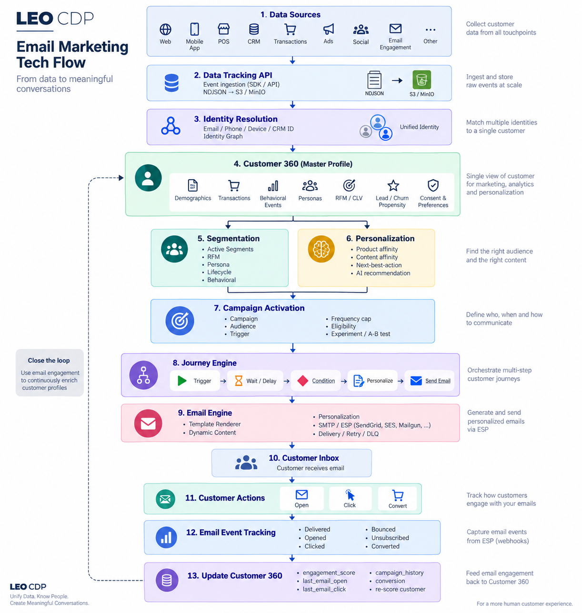
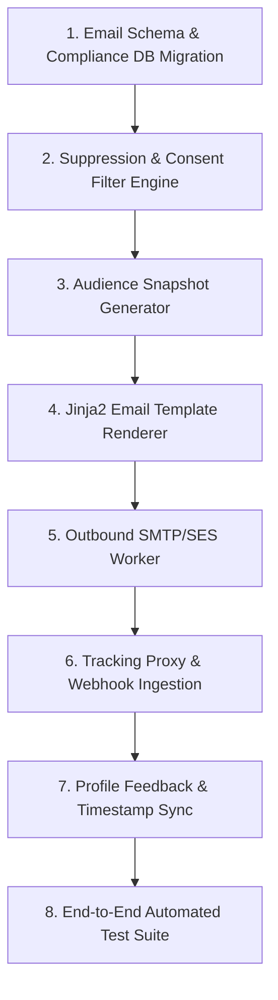

# LEO CDP v2.0 Beta — Email Marketing Tech Flow & PO Readiness Checklist



## Document Control & Executive Overview

* **Product**: LEO Customer 360 & CDP Platform
* **Release Milestone**: v2.0 Beta — Email Marketing & Automation
* **Target Audience**: Product Owner (PO), Technical Leadership, Engineering Team
* **Assessment Date**: 2026-09-06
* **Review Scope**: `backend-system/`, `customer360-api/`, `data-tracking-api/`, `frontend-admin/`, and `database-init/`

> **Assessment note:** Percentages below are directional product-readiness estimates, not measured test coverage. A capability is marked **DONE** only when the repository contains the relevant implementation and supporting verification; generic CDP or CRM infrastructure is marked **PARTIAL** when the email-specific behavior is still absent.

### Status Legend

| Status Indicator | Definition | Operational Criteria |
| :--- | :--- | :--- |
| ✅ **READY / DONE** | Implemented & verified | Production-ready code, models, APIs, and passing unit tests exist in codebase. |
| 🟡 **IN PROGRESS / SCAFFOLD** | Scaffolded / partial | Schema, models, or placeholder Dagster jobs exist, but core business logic is incomplete. |
| 🔴 **BLOCKER (P0 / Must Have)** | Hard Beta Blocker | Required functionality missing; without this, Email Marketing v2.0 Beta cannot ship. |
| ⚪ **BACKLOG (P1 / Post-Beta)** | Post-Beta Enhancement | Value-add or optimization items deferred to v2.1+ without compromising Beta launch. |

---

## Executive Summary: Scorecard & Readiness Gate

```text
LEO CDP v2.0 Beta — Capability Audit
─────────────────────────────────────────────────────────────────────────────
1. Customer Data Foundation (CIR & Storage)    [██████████]  95%   🟢 PROD-READY
2. Audience Segmentation & Rules Engine        [████████░░]  85%   🟢 PROD-READY
3. Tracking & Ingestion Foundation             [████████░░]  80%   🟢 PROD-READY
4. Email Consent & Compliance Governance       [███░░░░░░░]  25%   🔴 BETA BLOCKER
5. Campaign Management & Activation Engine     [███░░░░░░░]  30%   🔴 BETA BLOCKER
6. Email Templates & Content Personalization   [█░░░░░░░░░]  10%   🔴 BETA BLOCKER
7. Email Dispatch Engine (SMTP / SES)          [█░░░░░░░░░]  10%   🔴 BETA BLOCKER
8. Webhook Ingestion & Engagement Tracking     [██░░░░░░░░]  20%   🔴 BETA BLOCKER
9. Campaign Performance & Feedback Loop (C360) [██░░░░░░░░]  25%   🔴 BETA BLOCKER
─────────────────────────────────────────────────────────────────────────────
Core Customer 360 Data Lake & Ingestion        🟢 READY FOR ACTIVATION
Outbound Email Marketing Execution Flow        🔴 NOT READY (ENGINEERING SPRINT REQUIRED)
```

---

## 1. Customer Data Foundation & Identity Resolution

Evaluates the master customer records, identity resolution (CIR), and storage infrastructure feeding outbound email marketing.

| # | Feature / User Story | Codebase Evidence & Verification | PO Priority | Status | Acceptance Criteria / Gap Analysis |
| :--- | :--- | :--- | :--- | :--- | :--- |
| **1.1** | **Data Tracking API** | `data-tracking-api/core/routers/tracking.py` | P0 | ✅ DONE | FastAPI tracking endpoint persists hourly NDJSON batches to S3/MinIO with Redis bot & rate-limiting protection. |
| **1.2** | **Raw Event Storage** | `data-tracking-api/core/storage.py`, `database-init/database-schema.sql` | P0 | ✅ DONE | Hourly partitioned NDJSON objects in object storage + monthly partitioned `customer360.cdp_raw_events` table. |
| **1.3** | **Identity Resolution (CIR)** | `backend-system/identity_resolution/identity_resolution/resolver.py` | P0 | ✅ DONE | Deterministic matching (email, phone, national ID, external IDs) and fuzzy matching consolidate raw profiles into golden master profiles. |
| **1.4** | **Identity Graph & Links** | `customer360.cdp_profile_links`, `customer360.cdp_identity_index` | P0 | ✅ DONE | Bi-directional identity links maintained with confidence scores and merge history audit trails. |
| **1.5** | **Customer 360 Golden Record** | `database-schema.sql` (`cdp_master_profiles`) | P0 | ✅ DONE | Serves single customer view with primary email, secondary emails JSONB, unified attributes, and lineage tracking. |
| **1.6** | **Multi-Tenant Context Enforcement** | `customer360-api/core/auth.py`, PostgreSQL RLS | P0 | ✅ DONE | Tenant isolation enforced via JWT claims and session variable `app.tenant_id` across PostgreSQL RLS policies. |
| **1.7** | **Behavioral Feature Aggregation** | `backend-system/analytics/source_analytics/tracking_log_aggregation.py` | P1 | 🟡 PARTIAL | Hourly source volume/event metrics aggregated; customer-level RFM Parquet aggregation pipeline remains in development. |
| **1.8** | **Customer Propensity & Engagement Scoring** | `backend-system/scoring/dagster_defs.py` | P1 | 🟡 PARTIAL | Schema columns (`engagement_score`, `churn_probability`, `lead_grade`) exist, but Dagster scoring job is a sleep placeholder. |

---

## 2. Audience Segmentation & Eligibility Selection

Evaluates segment rule evaluation and audience materialization for email dispatch.

| # | Feature / User Story | Codebase Evidence & Verification | PO Priority | Status | Acceptance Criteria / Gap Analysis |
| :--- | :--- | :--- | :--- | :--- | :--- |
| **2.1** | **Segment Definition & Rule Builder** | `customer360-api/core/routers/segment_api.py`, `CdpSegment` | P0 | ✅ DONE | CRUD API with SQL validation (`validate_sql_where_fragment`) and relative time-interval normalization (`now() - INTERVAL`). |
| **2.2** | **Segment Membership Recomputation** | `backend-system/segmentation/segmentation/recompute.py` | P0 | ✅ DONE | Dagster job evaluates active segment queries and updates `segmentation_tags` array on `cdp_master_profiles`. |
| **2.3** | **Current Segment Matched Profiles Query** | `GET /api/v1/segments/{segment_id}/matched-profiles` | P0 | ✅ DONE | Executes validated segment rules directly against `cdp_master_profiles` with tenant isolation and pagination; this is a live query, not an immutable campaign snapshot. |
| **2.4** | **Audience Activation Snapshot** | Database schema lacks `cdp_campaign_audience_snapshot` | P0 | 🔴 BLOCKER | Campaign audience must be frozen at launch time to guarantee deterministic delivery and tracking. |
| **2.5** | **Suppression List Query Integration** | Missing suppression evaluation in query generator | P0 | 🔴 BLOCKER | Segmentation queries must exclude unsubscribed, hard-bounced, and opted-out profiles before audience compilation. |
| **2.6** | **Segment Size & Overlap Estimation** | `CdpSegment.member_count` in API | P1 | 🟡 PARTIAL | Pre-calculated member count available; multi-segment union/intersection estimation API not yet exposed. |

---

## 3. Email Consent & Compliance Governance (Legal / Deliverability Gate)

> ⚠️ **CRITICAL COMPLIANCE GATE**: Emails must never be dispatched directly from raw segment queries. The regulatory funnel (`Segment → Audience → Consent Filter → Suppression Filter → Frequency Capping → Eligible Audience`) must be enforced.

| # | Feature / User Story | Codebase Evidence & Verification | PO Priority | Status | Acceptance Criteria / Gap Analysis |
| :--- | :--- | :--- | :--- | :--- | :--- |
| **3.1** | **Master Email Profile Attribute** | `cdp_master_profiles.email`, `secondary_emails` | P0 | ✅ DONE | Primary email column and tenant-scoped unique partial index exist; secondary emails are stored in JSONB. The schema does not itself enforce lowercase email values. |
| **3.2** | **Channel Consent Flags** | `cdp_master_profiles.communication_preferences` | P0 | 🟡 PARTIAL | JSONB field stores `{"email_opt_in": true}`, but lacks explicit event audit log, timestamp, and IP capture. |
| **3.3** | **Global Unsubscribe Registry** | Missing dedicated `cdp_email_suppression` table | P0 | 🔴 BLOCKER | System must maintain tenant-scoped table of unsubscribed emails that overrides any campaign selection. |
| **3.4** | **One-Click Unsubscribe (RFC 8058)** | Missing unsubscribe handler & headers | P0 | 🔴 BLOCKER | Webhook/HTTP handler to process unsubscribe tokens and inject `List-Unsubscribe` / `List-Unsubscribe-Post` headers. |
| **3.5** | **Hard Bounce & Complaint Suppression** | Missing automated suppression updater | P0 | 🔴 BLOCKER | ISP complaint (FBL) and hard bounce webhooks must immediately lock profile's email delivery status. |
| **3.6** | **Fatigue & Frequency Capping** | Missing campaign send frequency checks | P1 | 🔴 BLOCKER | Rule-based cap (e.g., max 2 marketing emails per customer per 7 rolling days) before dispatch. |
| **3.7** | **Double Opt-In Workflow** | Not implemented | P2 | ⚪ BACKLOG | Confirmation email workflow with verification token; can follow post-Beta. |

---

## 4. Campaign Management & Orchestration

Evaluates campaign setup, scheduling, and activation coordination.

| # | Feature / User Story | Codebase Evidence & Verification | PO Priority | Status | Acceptance Criteria / Gap Analysis |
| :--- | :--- | :--- | :--- | :--- | :--- |
| **4.1** | **CRM Campaign Entity Model** | `customer360-api/core/models/crm.py` (`Campaign`) | P0 | ✅ DONE | `crm_campaign` table has name, code, status, channel, platform, budget, start/end dates, and metadata JSONB. |
| **4.2** | **Campaign CRUD API** | `customer360-api/core/routers/crm_api.py` | P0 | ✅ DONE | Standard CRUD endpoints under `/campaigns` with multi-tenant filtering. |
| **4.3** | **Email Campaign Execution Spec** | Missing email-specific campaign attributes | P0 | 🔴 BLOCKER | Need linkage from `crm_campaign` to `template_id`, `segment_id`, `sender_identity`, and send schedule. |
| **4.4** | **Campaign Activation Engine** | `backend-system/campaign_activation/dagster_defs.py` | P0 | 🔴 BLOCKER | `campaign_activation_job` is currently a sleep placeholder (`time.sleep(2)`). Must load audience and trigger send. |
| **4.5** | **Campaign Lifecycle Controls** | Only static `status` string field | P0 | 🔴 BLOCKER | Need state-machine transitions: `Draft → Scheduled → Running → Paused → Completed / Canceled`. |
| **4.6** | **Generic Campaign Performance Dashboard** | `customer360-api/core/routers/crm_api.py`, `customer360-api/core/repositories/campaign_repository.py` | P1 | 🟡 PARTIAL | Generic CRM campaign analytics endpoints aggregate spend, impressions, clicks, conversions, CTR, CVR, and ROAS; email send/delivery/open/click metrics are not implemented. |

---

## 5. Email Templates & Content Personalization

Evaluates template authoring, variable replacement, and dynamic profile personalization.

| # | Feature / User Story | Codebase Evidence & Verification | PO Priority | Status | Acceptance Criteria / Gap Analysis |
| :--- | :--- | :--- | :--- | :--- | :--- |
| **5.1** | **Email Template Data Entity** | Missing `cdp_email_templates` table | P0 | 🔴 BLOCKER | Entity required for HTML body, plain text alternative, subject line, sender name/email, and Jinja2 variables. |
| **5.2** | **Jinja2 / Handlebars Rendering Engine** | Not implemented in `backend-system` | P0 | 🔴 BLOCKER | Template engine to merge `first_name`, `persona_name`, `attributes`, and custom CDP tags into outbound HTML. |
| **5.3** | **Tracking Pixel & Click Wrap Injection** | Not implemented | P0 | 🔴 BLOCKER | Automated injection of 1x1 open tracking pixel and redirect wrappers around template hyperlinks (`/r/{link_id}`). |
| **5.4** | **Mandatory Legal Footer Injection** | Not implemented | P0 | 🔴 BLOCKER | Automated injection of physical postal address and dynamic `{{ unsubscribe_url }}` into every outgoing email. |
| **5.5** | **Rule-Based Dynamic Content** | `backend-system/personalization/dagster_defs.py` | P1 | 🟡 PARTIAL | Persona models exist in database (`cdp_customer_personas`); runtime content block selector is a scaffold. |
| **5.6** | **AI Product Recommendations** | Vector embedding schemas exist (`Vector(1536)`) | P2 | ⚪ BACKLOG | Next-best-product recommendation via pgvector; deferred to v2.1. |

---

## 6. Email Dispatch & Transmission Engine

Evaluates physical transmission of outbound emails through SMTP relays or cloud ESPs (SES / SendGrid / Brevo).

| # | Feature / User Story | Codebase Evidence & Verification | PO Priority | Status | Acceptance Criteria / Gap Analysis |
| :--- | :--- | :--- | :--- | :--- | :--- |
| **6.1** | **Email Service Dispatch Pipeline** | `backend-system/email_engine/dagster_defs.py` | P0 | 🔴 BLOCKER | `email_engine_job` is currently an empty placeholder (`context.log.info("email_engine job: started")`). |
| **6.2** | **SMTP Provider Adapter** | CI workflows test Brevo SMTP; no app adapter | P0 | 🔴 BLOCKER | Native Python `aiosmtplib` / `smtplib` connection pool with SSL/TLS and authentication retry logic. |
| **6.3** | **Amazon SES API Adapter** | No SES client or provider configuration found | P1 | 🔴 BLOCKER | S3/MinIO usage does not provide an SES adapter; implement provider configuration, `SendRawEmail` or equivalent dispatch, retries, and delivery identifiers. |
| **6.4** | **Batching & Rate Limiting** | Missing rate-limiter in `email_engine` | P0 | 🔴 BLOCKER | Controlled throughput (e.g. 50-100 emails/sec) with backoff to respect ESP provider quotas. |
| **6.5** | **Idempotent Dispatch & Deduplication** | Missing dispatch log with idempotency keys | P0 | 🔴 BLOCKER | Prevent double sends using unique `campaign_id:master_profile_id:run_id` idempotency constraints. |
| **6.6** | **Dead Letter Queue (DLQ) & Error Handling** | Not implemented | P1 | 🔴 BLOCKER | Failed deliveries after max retries routed to DLQ table with provider error code for inspection. |

---

## 7. Email Event Tracking & Webhook Ingestion

Evaluates capturing opens, clicks, deliveries, bounces, and complaints back into the CDP.

| # | Feature / User Story | Codebase Evidence & Verification | PO Priority | Status | Acceptance Criteria / Gap Analysis |
| :--- | :--- | :--- | :--- | :--- | :--- |
| **7.1** | **Event Catalog Registration** | `database-init/init-core-database.sql` | P0 | 🟡 PARTIAL | `cdp_event_catalog` has commerce/finance/general events; needs standard `email-sent`, `email-delivered`, `email-open`, `email-click`, `email-bounce`, `email-unsubscribe`. |
| **7.2** | **ESP Inbound Webhook Endpoint** | Missing router in `customer360-api` | P0 | 🔴 BLOCKER | Inbound webhook endpoint (`POST /webhooks/email/{provider}`) to ingest raw bounce, complaint, open, and click webhooks. |
| **7.3** | **Open Pixel & Click Tracker Endpoint** | Missing redirect proxy router | P0 | 🔴 BLOCKER | Public tracking proxy (`GET /t/pixel.png`, `GET /t/click?url=...`) logging events to `cdp_raw_events` before redirecting. |
| **7.4** | **Generic Event Stream Ingestion Bridge** | `customer360-api/core/routers/events_api.py` (`POST /api/v1/events/`) | P0 | 🟡 PARTIAL | Generic event ingestion supports deduplication and `cdp_raw_events`; it requires a raw profile or identity hint and is not an ESP webhook or email tracking endpoint. |
| **7.5** | **Event Correlation to Campaign & Profile** | `database-init/database-schema.sql` (`cdp_raw_events`) | P0 | 🔴 BLOCKER | The event table has tenant/profile linkage and generic `campaign` attribution text, but no `campaign_id` foreign key or email send/delivery correlation model. |

---

## 8. Customer 360 Feedback Loop & Closed-Loop Analytics

Evaluates how recipient behavior updates the customer profile and refines segmentation.

| # | Feature / User Story | Codebase Evidence & Verification | PO Priority | Status | Acceptance Criteria / Gap Analysis |
| :--- | :--- | :--- | :--- | :--- | :--- |
| **8.1** | **Customer Touchpoint Timestamps** | `cdp_master_profiles.last_activity_at` | P0 | 🟡 PARTIAL | General `last_activity_at` exists; need explicit `last_email_sent_at`, `last_email_opened_at`, `last_email_clicked_at`. |
| **8.2** | **Engagement Score Refresh** | `database-schema.sql` (`engagement_score`) | P1 | 🟡 PARTIAL | Schema field exists; persona engine calculates baseline score; needs hook triggering on email engagement events. |
| **8.3** | **Continuous Re-Segmentation** | `backend-system/segmentation/dagster_defs.py` | P0 | 🟡 PARTIAL | A polling sensor re-evaluates active segment rules after profile changes; email events do not currently update profiles, so the email feedback loop is not complete. |
| **8.4** | **Generic Campaign Performance Rollup** | `customer360.crm_campaign_performance_daily`, `customer360-api/core/repositories/campaign_repository.py` | P1 | 🟡 PARTIAL | The table, view, repository, and demo seed path exist for generic campaign metrics; no email send/event pipeline populates email delivery, open, click, bounce, or unsubscribe metrics. |
| **8.5** | **Closed-Loop Conversion Attribution** | `cdp_raw_events.is_conversion`, `crm_transactions` | P1 | 🟡 PARTIAL | Transaction ingestion links to `master_profile_id`; multi-touch attribution model deferred to post-Beta. |

---

## 9. Non-Functional, Reliability & Security Requirements

| # | Requirement | Implementation Target | Verification Status | PO Sign-off |
| :--- | :--- | :--- | :--- | :--- |
| **9.1** | **Tenant Data Isolation** | PostgreSQL RLS + tenant-scoped APIs | ✅ Verified in `test_multi_tenant_isolation.py` | Approved |
| **9.2** | **SQL Injection Safety** | SQL rule fragment validation and tenant scoping | ✅ Covered by `test_sql_safety.py` | Approved |
| **9.3** | **Audit Logging** | `customer360.sys_audit_log` schema exists | 🟡 Table exists; write integration for these email workflows is not verified | Required for Beta |
| **9.4** | **Worker Scalability** | Dagster workspace containerized deployment | 🟡 Workspace is deployable, but email and campaign workers are placeholders | Required for Beta |
| **9.5** | **Secrets Management** | ESP credentials in tenant settings / env | 🟡 Environment-based; needs tenant ESP credential vault | Required for Beta |
| **9.6** | **Deliverability Protection** | Automated bounce rate threshold shutoff (>5%) | 🔴 Missing circuit-breaker in campaign sender | Required for Beta |

---

## Product Owner Action Plan: The 8 Beta Blockers (P0 Sprint)

To reach **v2.0 Beta Launch**, engineering should focus strictly on these 8 epics:



1. **Epic 1 — Email Marketing Schema Migration** (`database-init/migrations/`):
   * Create `cdp_email_templates`, `cdp_email_suppression`, `cdp_campaign_dispatch_logs`.
   * Add email event catalog types to `cdp_event_catalog` (`email-delivered`, `email-opened`, `email-clicked`, `email-bounced`, `email-unsubscribed`).
2. **Epic 2 — Consent & Suppression Enforcement** (`customer360-api/core/`):
   * Add suppression check logic to exclude opted-out emails, hard bounces, and global unsubscribes before audience export.
3. **Epic 3 — Audience Snapshot Freeze** (`customer360-api` & `backend-system/segmentation`):
   * Snapshot segment members into an immutable list for the campaign run with audit metadata.
4. **Epic 4 — Email Template Engine** (`backend-system/email_engine`):
   * Jinja2 renderer supporting `{{ full_name }}`, `{{ first_name }}`, `{{ unsubscribe_url }}`, and profile attributes.
   * Auto-inject standard `List-Unsubscribe` headers and tracking pixel.
5. **Epic 5 — Dispatch Worker Implementation** (`backend-system/email_engine/dagster_defs.py`):
   * Replace `email_engine_placeholder_op` with asynchronous batch sender connecting to SMTP relay / AWS SES.
   * Enforce rate limiting and write dispatch results to `cdp_campaign_dispatch_logs`.
6. **Epic 6 — Webhook & Tracking Ingestion** (`customer360-api/core/routers/`):
   * Create `/tracking/email/open` (1x1 gif) and `/tracking/email/click` (HTTP 302 redirector).
   * Ingest standard events into `cdp_raw_events` linked to `campaign_id` and `master_profile_id`.
7. **Epic 7 — Customer 360 Feedback Loop**:
   * Update profile timestamps (`last_activity_at`) upon email interactions to trigger re-segmentation.
8. **Epic 8 — End-to-End Integration Test Suite**:
   * Automated verification test covering: `Create Segment → Freeze Audience → Render Template → Mock Send → Simulate Open/Click Webhook → Verify C360 Profile Updated`.
