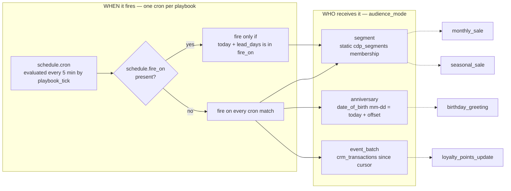
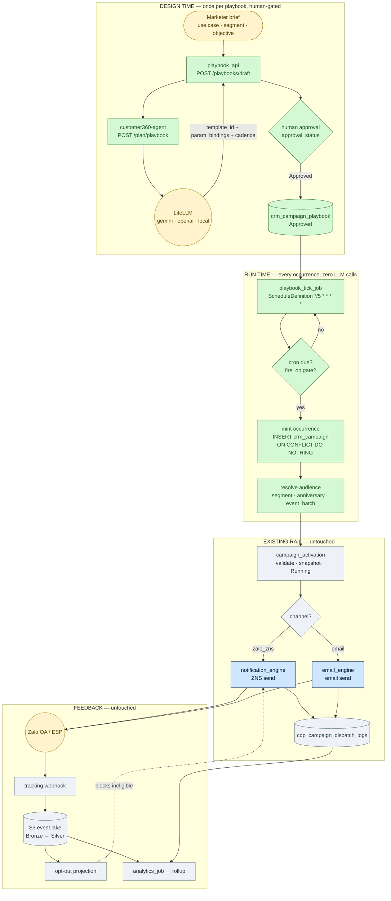
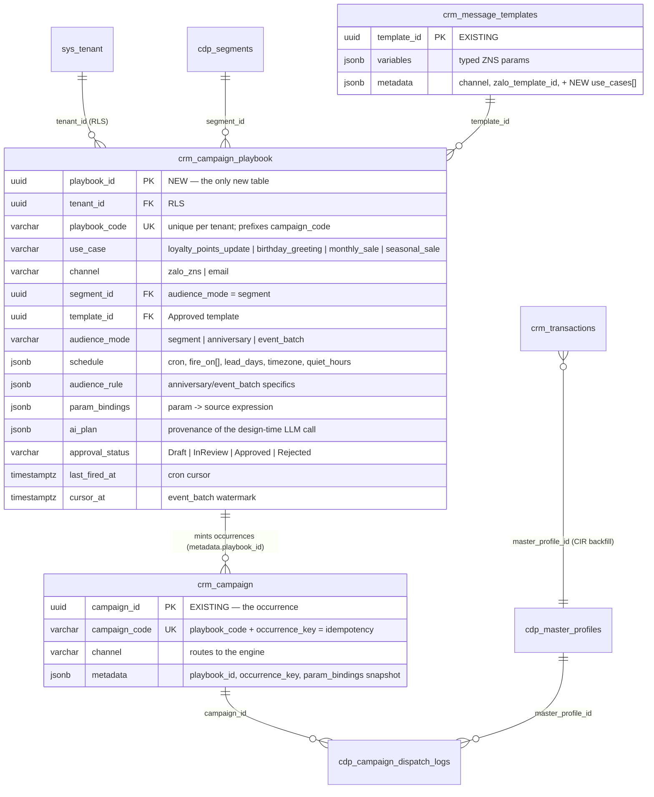
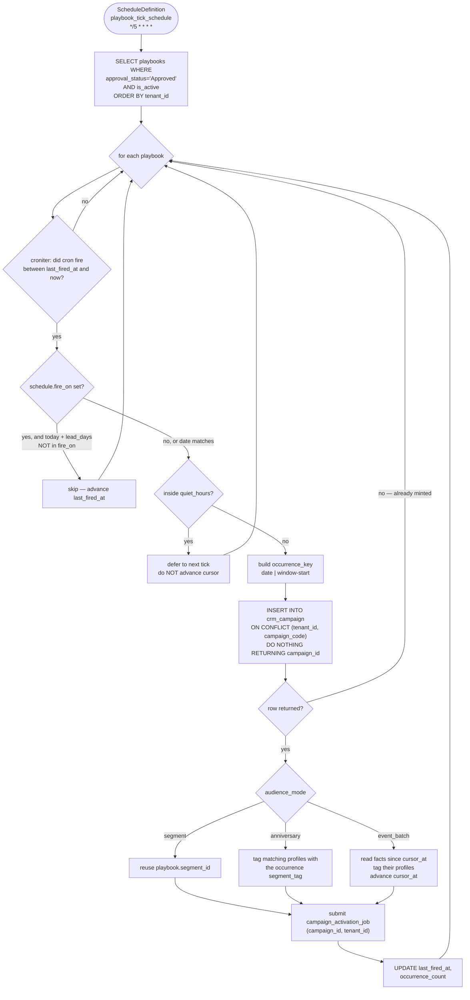
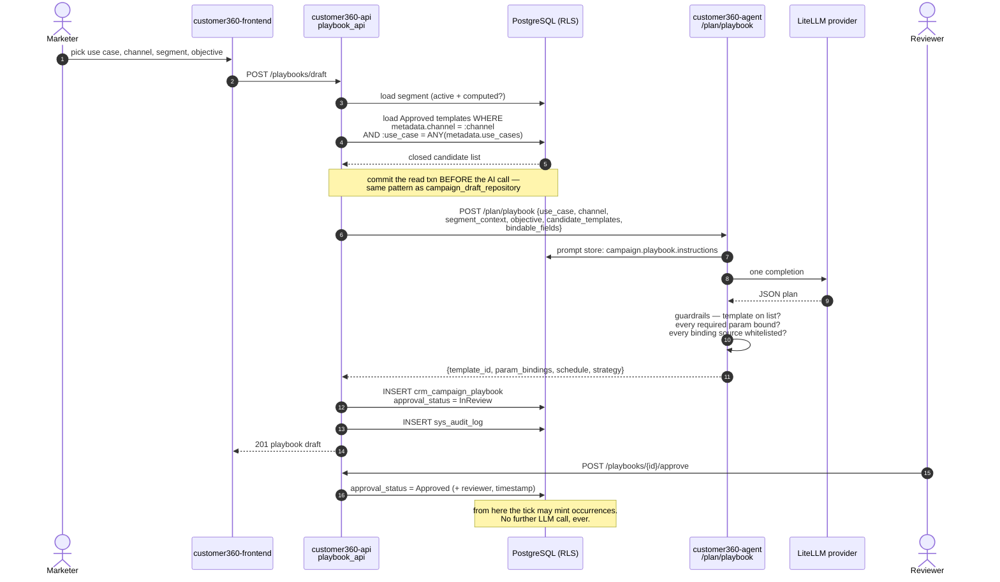
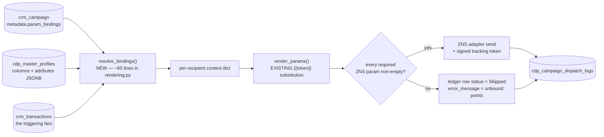

# Agentic Marketing Playbooks — Recurring & Triggered Campaigns

> **Scope.** Extend the existing AI Agent + campaign rail so one marketer can author **reusable, recurring, and event-triggered** marketing programs instead of one-shot campaigns. Four named use cases, **Zalo OA (ZNS) first, Email second**.
>
> **Status.** Design of record. Supersedes nothing — it *sits on top of* [`PLAN-ZALO-ZNS-OPTIMIZED.md`](PLAN-ZALO-ZNS-OPTIMIZED.md) (the canonical channel plan) and [`AGENTIC-EMAIL-MARKETING-FLOW.md`](AGENTIC-EMAIL-MARKETING-FLOW.md). Both remain valid; this plan adds the *recurrence* layer they don't have.

---

## 1. TL;DR

The repo already ships a complete **one-shot** agentic outbound rail:

`segment → AI draft → human approval → activation → engine dispatch → signed webhook → S3 event lake → opt-out projection → analytics rollup`

…for **email** (`email_engine`) and **Zalo ZNS** (`notification_engine`), routed by `crm_campaign.channel` in `campaign_activation/triggers.py`.

All four requested use cases are **recurring or event-triggered**. Nothing in the repo can express *"fire this again next month / on their birthday / when they buy something"*. That is the entire gap.

**The design in one sentence:**

> A **Playbook** is an approved campaign *recipe* with a trigger; every time it fires it **mints an ordinary `crm_campaign` row** — so the whole existing rail downstream stays untouched.

### The one architectural principle

> **AI runs at design time. Run time is deterministic.**

The LLM is called **once**, when the marketer authors the playbook: it selects the approved ZNS template, proposes the **parameter bindings** (not values), the cadence, and the strategy. A human approves that plan once. Every subsequent firing is pure SQL + string substitution — no LLM call per occurrence, none per recipient.

Why this is non-negotiable:

| Reason | Consequence if violated |
| --- | --- |
| **Cost** | 1 LLM call × 200k profiles × 12 occurrences/year = unbounded spend for zero added value |
| **Latency** | A birthday blast must finish inside its send window; an LLM in the per-recipient loop cannot |
| **Governance** | A human approved *this* plan. Regenerating copy per occurrence ships unreviewed text to real customers and silently voids the approval gate |
| **Reproducibility** | A deterministic runtime is replayable and testable; a stochastic one is neither |

The one sanctioned exception is `regenerate_per_occurrence` (seasonal email copy) — and it deliberately lands the occurrence in `InReview`, **not** `Approved`, so the human gate is preserved rather than bypassed.

### Cost of the change

| New | Count |
| --- | --- |
| New database tables | **1** (`crm_campaign_playbook`) |
| New Dagster jobs | **1** (`playbook_tick_job` + one `ScheduleDefinition`) |
| New agent endpoints | **1** (`POST /plan/playbook`, a clone of `/plan/zalo`) |
| New AI agent rows / prompts | **1** (`playbook_planner` / `campaign.playbook.instructions`) |
| New API routers | **1** (`playbook_api.py`, a clone of `campaign_draft_api.py`) |
| Modified engine files | **2** (`notification_engine/rendering.py`, `send.py`) |
| **Changes to the activation / dispatch / webhook / analytics rail** | **0** |

---

## 2. The four use cases → one trigger taxonomy

| # | Use case (VN) | Use case (EN) | `use_case` code | Trigger nature | Channel priority |
| --- | --- | --- | --- | --- | --- |
| 1 | Cập nhật điểm tích luỹ khi mua hàng | Loyalty points updated after purchase | `loyalty_points_update` | **Event** — a `purchase` / `made-payment` fact lands | ZNS (transactional) |
| 2 | Chúc mừng sinh nhật | Birthday greeting | `birthday_greeting` | **Anniversary** — `date_of_birth` month/day matches | ZNS → Email |
| 3 | Sales giảm giá cuối tháng / ngày cố định trong tháng | Month-end or fixed-day-of-month sale | `monthly_sale` | **Calendar** — recurring cron | ZNS → Email |
| 4 | Sales theo mùa mua sắm (Trung Thu, tựu trường, Christmas, Phục Sinh, Tết…) | Seasonal shopping campaign | `seasonal_sale` | **Calendar** — an explicit, mostly-lunar date list minus lead time | Email → ZNS |

These four collapse into **three audience modes** and **two date sources** — not four bespoke pipelines:



| Use case | `schedule.cron` | `schedule.fire_on` | `audience_mode` | Occurrence key |
| --- | --- | --- | --- | --- |
| `loyalty_points_update` | `*/15 * * * *` | — | `event_batch` | window start `2026-09-25T14:00` |
| `birthday_greeting` | `0 9 * * *` | — | `anniversary` | fire date `2026-09-25` |
| `monthly_sale` | `0 9 28 * *` | — | `segment` | fire date `2026-09-28` |
| `seasonal_sale` | `0 9 * * *` | `["2026-09-25","2026-12-25", …]` | `segment` | target date `2026-12-25` |

Three fields (`cron`, `fire_on`, `audience_mode`) cover all four. A fifth use case is a row, not a release.

---

## 3. Verified ground truth (repo audit)

Everything below was read out of the working tree, not assumed.

### 3.1 What already exists and is reused unchanged

| Capability | Where | Status |
| --- | --- | --- |
| Campaign entity with `channel` / `segment_id` / `template_id` / `approval_status` / `ai_plan` / `campaign_code UNIQUE(tenant_id, campaign_code)` | `customer360.crm_campaign` | ✅ reuse |
| AI draft + state machine `Draft → InReview → Approved/Rejected` + audit | `customer360-api/core/routers/campaign_draft_api.py`, `repositories/campaign_draft_repository.py`, `crm_campaign_reviews`, `sys_audit_log` | ✅ reuse |
| Closed-candidate guardrail (AI may only pick from a supplied list; off-list selection raises `AIProviderError`) | `campaign_planner/email.py`, `campaign_planner/zalo.py` | ✅ reuse |
| Provider-agnostic LLM via LiteLLM + State pattern | `customer360-agent/src/ai_providers/` | ✅ reuse |
| Versioned prompt store addressable by key | `cdp_ai_agents` + `customer360-agent/src/prompts/` + `init-prompt-store-seed.sql` | ✅ reuse |
| Activation: validate Approved, snapshot segment, mark Running, submit engine run | `customer360-backend/campaign_activation/activation.py` | ✅ reuse |
| Channel routing to the right engine | `campaign_activation/triggers.py` (`trigger_email_engine_job` / `trigger_notification_engine_job`) | ✅ reuse |
| ZNS dispatch, typed-param binding, per-recipient ledger, advisory lock, idempotent upsert | `customer360-backend/notification_engine/` | 🟦 extend (params only) |
| Email dispatch | `customer360-backend/email_engine/` | 🟦 extend (Phase 5) |
| Dagster `ScheduleDefinition` (proves the pattern exists) | `notification_engine/dagster_defs.py` — `zalo_token_refresh_schedule`, `zalo_optout_projection_schedule` | ✅ reuse |
| Webhook → S3 event lake → opt-out projection → consent | `customer360-event-api/.../zalo_tracking.py`, `notification_engine/optout_projection.py` | ✅ reuse |
| Analytics rollup from S3 | `customer360-backend/analytics` | ✅ reuse |
| Send ledger idempotency `UNIQUE(campaign_id, master_profile_id)`, never downgrades a terminal row | `cdp_campaign_dispatch_logs` | ✅ reuse |
| Purchase event vocabulary | `cdp_event_catalog` seeds: `purchase`, `first-purchase`, `made-payment`, `order-checkout`, `subscribe` | ✅ reuse |
| Transaction fact with `amount` / `transaction_time` / nullable `master_profile_id` (async CIR backfill) | `crm_transactions` | ✅ reuse |
| Birthday source | `cdp_master_profiles.date_of_birth DATE` | ✅ reuse |
| Omnichannel suppression | `crm_suppression_list` (`channel IN ('EMAIL','SMS','PUSH','WHATSAPP','ZALO','VOICE','GLOBAL')`) | ✅ reuse |

### 3.2 What is genuinely missing

| # | Gap | Evidence | Consequence today |
| --- | --- | --- | --- |
| **G1** | **No recurrence or trigger concept.** A `grep -riE "recurring\|cron_expression\|schedule_type\|playbook"` over `customer360-api/core`, `customer360-backend` and `database-schema.sql` returns zero domain hits | a campaign is a single row that runs once | a marketer re-creates the birthday campaign by hand, every day |
| **G2** | **Per-recipient params are limited to name and phone.** `notification_engine/rendering.py` builds its `{{token}}` context from `first_name / last_name / name / phone` only | `{{points}}` renders as the literal `{{points}}` | use case 1 is impossible |
| **G3** | **No marketing calendar.** Tết and Trung Thu are **lunar**; Easter is **movable** | nothing in the schema knows when Tết 2027 is | use case 4 is impossible |
| **G4** | **No way to say "this template is the birthday one".** `crm_message_templates.metadata` carries `channel` but no use-case tag | the AI must guess from free text at every draft | brittle template selection |
| **G5** | **Template params are bound campaign-wide, not per recipient.** `send.py::_base_template_data` returns one dict for the whole campaign | everyone receives the same `points` value | use cases 1 and 2 are wrong by construction |

---

## 4. Core concepts

| Concept | Definition | Physical form | Lifetime |
| --- | --- | --- | --- |
| **Playbook** | An approved, reusable campaign recipe: channel + use case + template + audience rule + trigger + parameter bindings | one `crm_campaign_playbook` row | months–years |
| **Occurrence** | One firing of a playbook on a specific date/window | an ordinary `crm_campaign` row with `metadata.playbook_id` and `campaign_code = <playbook_code>-<occurrence_key>` | one send cycle |
| **Binding** | A declarative rule mapping a ZNS/email parameter to a *source*, resolved per recipient at send time | a JSON entry in `playbook.param_bindings` | with the playbook |
| **Marketing calendar** | The list of resolved ISO dates a seasonal playbook targets | `playbook.schedule.fire_on[]` | edited yearly |
| **Occurrence key** | The idempotency token for one firing | a string embedded in `campaign_code` | forever (audit) |

### 4.1 Why an Occurrence is a real `crm_campaign` row

It buys, for free:

- **Idempotency** — `UNIQUE (tenant_id, campaign_code)` + `ON CONFLICT DO NOTHING` means a double tick cannot double-send. No new machinery.
- **The entire downstream rail** — activation, channel routing, engine dispatch, the ledger, webhooks, opt-out projection, analytics rollups, the campaign performance dashboard — all keyed on `campaign_id`, all unchanged.
- **Per-occurrence analytics** — "Trung Thu 2026 vs Trung Thu 2027" is a normal two-row comparison in `vw_campaign_performance_metrics`.
- **Auditability** — `sys_audit_log` and `crm_campaign_reviews` already anchor on `campaign_id`.

The alternative — one long-lived campaign that sends repeatedly — collides head-on with `cdp_campaign_dispatch_logs UNIQUE (campaign_id, master_profile_id)`: a customer would be messaged on their birthday **once, ever**.

---

## 5. Architecture

### 5.1 At a glance

🟩 green = new · ⬜ grey = existing, unchanged · 🟦 blue = existing, extended · 🟨 yellow = external



**Read it by band.** The top band runs **once** and is the only place the LLM lives. The middle band is a 5-minute heartbeat that turns approved recipes into ordinary campaigns. The bottom two bands are the rail that already exists and does not change. Every green node is new work; there are eight of them and three are a single function each.


> The Excalidraw source is [`diagrams/marketing-playbooks-architecture.excalidraw`](diagrams/marketing-playbooks-architecture.excalidraw) and can be opened/edited at [excalidraw.com](https://excalidraw.com).

### 5.2 Service ownership

| Band | Service | Deployable | New code |
| --- | --- | --- | --- |
| Design time — API | `customer360-api` | FastAPI, port 8000 | `core/routers/playbook_api.py`, `core/repositories/playbook_repository.py` |
| Design time — AI | `customer360-agent` | FastAPI, port 8009 | `src/campaign_planner/playbook.py`, `src/models/playbook.py`, one route in `app.py` |
| Design time — prompts | `customer360-database` | Postgres seed | one `cdp_ai_agents` row |
| Run time — scheduler | `customer360-backend/campaign_activation` | Dagster code location | `campaign_activation/playbook_tick.py` + defs |
| Run time — dispatch | `customer360-backend/notification_engine` | Dagster code location | binding resolver in `rendering.py`, widened SELECT in `send.py` |
| Run time — dispatch (Phase 5) | `customer360-backend/email_engine` | Dagster code location | same resolver, imported |

---

## 6. Data model

### 6.1 One new table, everything else reused



> `crm_message_templates.metadata` gains a `use_cases: ["birthday_greeting"]` array (JSONB — **no DDL**). It closes gap **G4**: the AI's candidate list is pre-filtered to templates the tenant tagged for that use case, instead of the AI inferring intent from a template name.

### 6.2 DDL — `crm_campaign_playbook`

```sql
CREATE TABLE IF NOT EXISTS customer360.crm_campaign_playbook (
    playbook_id     UUID PRIMARY KEY DEFAULT gen_random_uuid(),
    tenant_id       UUID NOT NULL REFERENCES customer360.sys_tenant(tenant_id) ON DELETE CASCADE,
    user_id         UUID REFERENCES customer360.sys_user(user_id) ON DELETE SET NULL,

    -- Identity. playbook_code prefixes every minted campaign_code, which is
    -- what makes occurrence creation idempotent for free.
    playbook_code   VARCHAR(80)  NOT NULL,
    name            TEXT         NOT NULL,
    description     TEXT,

    -- What kind of program this is, and where it goes.
    use_case        VARCHAR(50)  NOT NULL,
    channel         VARCHAR(50)  NOT NULL,

    -- What it sends and to whom.
    template_id     UUID REFERENCES customer360.crm_message_templates(template_id) ON DELETE RESTRICT,
    segment_id      UUID REFERENCES customer360.cdp_segments(segment_id)           ON DELETE RESTRICT,
    audience_mode   VARCHAR(30)  NOT NULL DEFAULT 'segment',

    -- When it fires:  {cron, timezone, fire_on[], lead_days, quiet_hours, max_per_profile_per_period}
    schedule        JSONB        NOT NULL DEFAULT '{}'::jsonb,
    -- Mode-specific audience detail: anniversary offsets, event filters, batch caps.
    audience_rule   JSONB        NOT NULL DEFAULT '{}'::jsonb,
    -- param name -> source expression, resolved per recipient at send time.
    param_bindings  JSONB        NOT NULL DEFAULT '{}'::jsonb,

    -- Design-time AI provenance (model, prompt version, rationale) + the human gate.
    ai_plan         JSONB,
    strategy_summary TEXT,
    approval_status VARCHAR(50)  NOT NULL DEFAULT 'Draft',
    approved_by     UUID REFERENCES customer360.sys_user(user_id),
    approved_at     TIMESTAMPTZ,

    -- Runtime state owned by playbook_tick.
    is_active       BOOLEAN      NOT NULL DEFAULT TRUE,
    last_fired_at   TIMESTAMPTZ,              -- cron cursor
    cursor_at       TIMESTAMPTZ,              -- event_batch high-water mark
    last_error      TEXT,
    occurrence_count INTEGER     NOT NULL DEFAULT 0,

    metadata        JSONB        NOT NULL DEFAULT '{}'::jsonb,
    created_at      TIMESTAMPTZ  NOT NULL DEFAULT now(),
    updated_at      TIMESTAMPTZ  NOT NULL DEFAULT now(),

    CONSTRAINT uq_crm_campaign_playbook_code UNIQUE (tenant_id, playbook_code),
    CONSTRAINT chk_playbook_use_case CHECK (use_case IN (
        'loyalty_points_update', 'birthday_greeting', 'monthly_sale', 'seasonal_sale')),
    CONSTRAINT chk_playbook_channel CHECK (channel IN ('zalo_zns', 'email')),
    CONSTRAINT chk_playbook_audience_mode CHECK (audience_mode IN (
        'segment', 'anniversary', 'event_batch')),
    CONSTRAINT chk_playbook_approval CHECK (approval_status IN (
        'Draft', 'InReview', 'Approved', 'Rejected')),
    -- A segment-mode playbook without a segment would silently send to nobody.
    CONSTRAINT chk_playbook_segment_required CHECK (
        audience_mode <> 'segment' OR segment_id IS NOT NULL),
    CONSTRAINT chk_playbook_schedule_object      CHECK (jsonb_typeof(schedule) = 'object'),
    CONSTRAINT chk_playbook_audience_rule_object CHECK (jsonb_typeof(audience_rule) = 'object'),
    CONSTRAINT chk_playbook_bindings_object      CHECK (jsonb_typeof(param_bindings) = 'object')
);

CREATE INDEX IF NOT EXISTS idx_crm_campaign_playbook_tenant
    ON customer360.crm_campaign_playbook (tenant_id);
-- The tick's hot path: "which approved, active playbooks might be due?"
CREATE INDEX IF NOT EXISTS idx_crm_campaign_playbook_due
    ON customer360.crm_campaign_playbook (tenant_id, approval_status, is_active, last_fired_at);

ALTER TABLE customer360.crm_campaign_playbook ENABLE ROW LEVEL SECURITY;
-- Mirror the tenant policy shape used by every other tenant-scoped table
-- (see migrations/001_harden_tenant_rls_policies.sql).
```

### 6.3 `schedule` JSONB contract

| Key | Type | Applies to | Meaning | Example |
| --- | --- | --- | --- | --- |
| `cron` | string | all | 5-field cron; when the tick evaluates this playbook | `"0 9 * * *"` |
| `timezone` | string | all | IANA zone the cron is interpreted in | `"Asia/Ho_Chi_Minh"` |
| `fire_on` | string[] | `seasonal_sale` | ISO dates the playbook targets; absent = fire on every cron match | `["2026-12-25"]` |
| `lead_days` | int | `seasonal_sale` | send this many days *before* each `fire_on` date | `14` |
| `quiet_hours` | `[from,to]` | all | local-hour window in which sending is deferred to the next tick | `[22, 7]` |
| `max_per_profile_per_period` | int | all | cap on messages from *this playbook* per profile per period | `1` |
| `period_days` | int | all | the period the cap is measured over | `30` |

### 6.4 `audience_rule` JSONB contract

| `audience_mode` | Key | Meaning | Example |
| --- | --- | --- | --- |
| `anniversary` | `date_field` | profile column holding the anniversary | `"date_of_birth"` |
| `anniversary` | `offset_days` | send N days before (negative) / after (positive) the date | `0` |
| `anniversary` | `require_segment` | additionally restrict to `segment_id` | `true` |
| `event_batch` | `event_names` | `cdp_event_catalog` names that qualify | `["purchase","made-payment"]` |
| `event_batch` | `source_table` | fact table scanned by the cursor | `"crm_transactions"` |
| `event_batch` | `min_amount` | ignore facts below this value | `100000` |
| `event_batch` | `max_batch` | hard cap on recipients per occurrence | `5000` |
| `segment` | *(none)* | membership comes from `segment_id` | — |

### 6.5 Occurrence contract — what `playbook_tick` writes to `crm_campaign`

| `crm_campaign` column | Value | Why |
| --- | --- | --- |
| `campaign_code` | `<playbook_code>-<occurrence_key>` | **the idempotency key** — `UNIQUE (tenant_id, campaign_code)` already exists |
| `name` | `<playbook.name> — <occurrence_key>` | readable in the dashboard |
| `channel` | `playbook.channel` | routes to the right engine in `triggers.py` |
| `segment_id` | `playbook.segment_id`, or the synthetic occurrence segment | see §7.3 |
| `template_id` | `playbook.template_id` | activation revalidates it is still `Approved` |
| `status` | `Draft` → set `Running` by activation | unchanged rail semantics |
| `approval_status` | `Approved` (inherited) or `InReview` (`regenerate_per_occurrence`) | see §9.2 |
| `approved_by` / `approved_at` | copied from the playbook | traceable to the human who approved the recipe |
| `objective`, `strategy_summary` | copied from the playbook | dashboard parity with hand-made campaigns |
| `ai_plan` | `{ template_data: {…bindings…}, source: "playbook", playbook_id, prompt_version }` | `send.py::_base_template_data` already reads `ai_plan.template_data` |
| `metadata` | `{ playbook_id, occurrence_key, use_case, param_bindings, audience_mode, fired_at }` | the resolver reads bindings from here |
| `start_date` / `end_date` | occurrence date … + `send_window_days` | analytics date filters work unchanged |

---

## 7. Runtime flows

### 7.1 The tick — one job, all four use cases



**Failure containment.** One playbook's failure writes `last_error` and continues the loop — it never aborts the tick for other tenants. The op carries the same `RetryPolicy(max_retries=2, delay=15)` the other backend ops use.

### 7.2 Design time — the single LLM call



### 7.3 Audience resolution per mode

The dispatch engines resolve recipients by **segment tag** (`segment_tag = ANY(p.segmentation_tags)`). Rather than teach them three new audience languages, each non-segment mode **materialises a per-occurrence segment** and hands the engine the thing it already understands.

| Mode | How the occurrence audience is produced | Engine sees |
| --- | --- | --- |
| `segment` | nothing to do — reuse `playbook.segment_id` | the existing segment |
| `anniversary` | `UPDATE cdp_master_profiles SET segmentation_tags = array_append(...)` for profiles where `to_char(date_of_birth,'MM-DD') = to_char(CURRENT_DATE + offset,'MM-DD')`; insert a short-lived `cdp_segments` row `<playbook_code>_2026_09_25` | a normal segment |
| `event_batch` | select distinct `master_profile_id` from `crm_transactions` where `transaction_time > cursor_at` and filters match, capped by `max_batch`; tag them the same way | a normal segment |

Occurrence segments are `is_active = false` after the send and reaped by a retention job (`metadata.ephemeral = true`, TTL 30 days) so `cdp_segments` doesn't grow without bound.

> **Why not add an audience adapter to the engines?** Because the engine's recipient query, keyset pagination, eligibility filter, advisory lock and ledger upsert are all already correct and tested. Materialising a tag is ~20 lines in the tick; a second audience path in two engines is a permanent maintenance cost in the send loop — the worst place in the system to carry one.

### 7.4 Send time — where bindings are resolved



**The critical safety rule:** an unresolved binding produces a `Skipped` ledger row, never a send with a blank or wrong value. A ZNS message reading *"Quý khách vừa tích lũy điểm. Tổng điểm: "* is worse than no message at all — and for a points/balance message it is a customer-trust and potentially a financial-accuracy issue. The check is cheap and belongs in the send path, not in review.

---

## 8. Parameter bindings

### 8.1 Binding source grammar

A binding is `"<param_name>": "<source expression>"`. Five prefixes, one resolver function, all whitelisted — an unknown prefix is a hard error at **design time** (agent guardrail) and at **approval time** (API validation), not a silent blank at send time.

| Prefix | Resolves from | Available in | Example |
| --- | --- | --- | --- |
| `profile.<column>` | a `cdp_master_profiles` column | all modes | `profile.first_name` |
| `profile.attributes.<key>` | `cdp_master_profiles.attributes` JSONB | all modes | `profile.attributes.loyalty_points` |
| `fact.<field>` | the triggering `crm_transactions` row | `event_batch` only | `fact.amount` |
| `campaign.<field>` | the occurrence row / its metadata | all modes | `campaign.metadata.season_name` |
| `const:<literal>` | a literal string baked into the playbook | all modes | `const:31/12/2026` |

Optional formatting suffixes keep number/date presentation out of the template and out of the LLM: `| number:vi-VN`, `| date:dd/MM/yyyy`, `| currency:VND`, `| truncate:20`.

### 8.2 Worked bindings per use case

| Use case | ZNS param | Binding | Renders as |
| --- | --- | --- | --- |
| `loyalty_points_update` | `customer_name` | `profile.first_name` | `Linh` |
| | `order_amount` | `fact.amount \| currency:VND` | `1.250.000 ₫` |
| | `earned_points` | `fact.attributes.points_earned \| number:vi-VN` | `125` |
| | `total_points` | `profile.attributes.loyalty_points \| number:vi-VN` | `3.480` |
| | `order_code` | `fact.source_transaction_id` | `HD-20260925-0417` |
| `birthday_greeting` | `customer_name` | `profile.first_name` | `Linh` |
| | `voucher_code` | `campaign.metadata.voucher_code` | `HBD2026` |
| | `voucher_value` | `const:100.000đ` | `100.000đ` |
| | `expiry_date` | `campaign.metadata.voucher_expiry \| date:dd/MM/yyyy` | `25/10/2026` |
| `monthly_sale` | `customer_name` | `profile.first_name` | `Linh` |
| | `discount_percent` | `campaign.metadata.discount_percent` | `30` |
| | `end_date` | `campaign.end_date \| date:dd/MM/yyyy` | `30/09/2026` |
| `seasonal_sale` | `customer_name` | `profile.first_name` | `Linh` |
| | `season_name` | `campaign.metadata.season_name` | `Trung Thu` |
| | `offer_headline` | `campaign.metadata.offer_headline` | `Giảm đến 40% bánh trung thu` |
| | `end_date` | `campaign.end_date \| date:dd/MM/yyyy` | `25/09/2026` |

### 8.3 Where loyalty points come from

`cdp_master_profiles` has no `loyalty_points` column and **this design does not add one**. The canonical read is `attributes->>'loyalty_points'`, written by whichever system owns the loyalty balance (POS, core loyalty platform) through the existing profile-update path.

| Option | Verdict |
| --- | --- |
| New `loyalty_points` column on `cdp_master_profiles` | ❌ a domain-specific column on the platform's widest, hottest table; every non-retail tenant carries it |
| `attributes->>'loyalty_points'`, source-of-truth stays upstream | ✅ **chosen** — zero DDL, already indexed-able with a GIN index if needed, and honest that the CDP mirrors rather than owns the balance |
| Derive by summing `crm_transactions` | ❌ the CDP does not know the earn/burn/expiry rules; a wrong balance in a customer-facing message is worse than no message |

> **Contract, not a guess.** A `loyalty_points_update` playbook is only approvable when `attributes.loyalty_points` is present on a sample of the target audience. The API's preflight asserts this and refuses approval otherwise, so the failure surfaces to a human at design time rather than as 5,000 `Skipped` ledger rows at 09:00.

---

## 9. AI Agent extension

### 9.1 What changes in `customer360-agent`

| File | Change | Size |
| --- | --- | --- |
| `src/campaign_planner/playbook.py` | **new** — clone of `zalo.py`; selects a template from the closed list and emits **bindings**, not values | ~90 lines |
| `src/models/playbook.py` | **new** — `PlaybookPlanRequest` / `PlaybookPlanResponse` | ~35 lines |
| `src/campaign_planner/base.py` | add `CAMPAIGN_PLAYBOOK_INSTRUCTIONS = "campaign.playbook.instructions"` | 1 line |
| `src/campaign_planner/__init__.py`, `src/models/__init__.py` | re-export | 4 lines |
| `src/app.py` | `POST /plan/playbook`, same `Depends(require_token)` gate | ~8 lines |
| `leo_customer360_agent/client.py` | `generate_playbook_plan()` | ~40 lines |
| `customer360-database/init-prompt-store-seed.sql` | one `cdp_ai_agents` row: `playbook_planner` | 1 row |

Everything else — provider resolution, LiteLLM, prompt versioning, JSON fence stripping, `AIProviderError → 502` — is reused verbatim.

### 9.2 Request / response contract

**Request** — `POST /plan/playbook` (`Authorization: Bearer $AGENT_API_TOKEN`)

| Field | Type | Notes |
| --- | --- | --- |
| `use_case` | string | one of the four codes; selects the rule block in the prompt |
| `channel` | string | `zalo_zns` \| `email` |
| `segment_context` | object | `{segment_id, segment_name, member_count, top_tags}` |
| `objective` | string | the marketer's words |
| `budget_time_constraints` | string? | free text |
| `candidate_templates` | object[] | **closed list** — Approved, channel-matched, use-case-tagged; each carries `template_id`, `name`, `params[]` |
| `bindable_fields` | object | **closed list** of legal binding sources the tenant actually has, e.g. `{"profile":[…], "fact":[…], "campaign":[…]}` |
| `model`, `extra_config` | string?/object? | per-request provider override (existing mechanism) |

**Response**

| Field | Type | Notes |
| --- | --- | --- |
| `name`, `objective`, `strategy_summary`, `action_plan[]` | | inherited from `BasePlanResponse` |
| `template_id` | string | **must** be on `candidate_templates` |
| `param_bindings` | object | `{param: source_expression}` — **every** required param of the chosen template, every source on `bindable_fields` |
| `schedule` | object | `{cron, timezone, fire_on[], lead_days, quiet_hours}` |
| `audience_mode` | string | the mode the agent recommends |
| `audience_rule` | object | mode-specific detail |
| `rationale` | string | shown to the reviewer next to the brief |

### 9.3 Guardrails — enforced in code, not in the prompt

Same defence-in-depth shape as `campaign_planner/zalo.py::generate_zalo_campaign_plan`, which already raises on an off-list `template_id` and on a missing required param.

| # | Check | On violation |
| --- | --- | --- |
| 1 | `template_id ∈ candidate_templates` | `AIProviderError` — nothing persisted |
| 2 | every required param of that template appears in `param_bindings` | `AIProviderError` |
| 3 | every binding's prefix is one of the five, and its path is in `bindable_fields` | `AIProviderError` |
| 4 | `fact.*` bindings only when `audience_mode == 'event_batch'` | `AIProviderError` |
| 5 | `cron` parses (croniter) and fires ≤ 24×/day unless `use_case == 'loyalty_points_update'` | `AIProviderError` — blocks an accidental spam cadence |
| 6 | every `fire_on` entry is a valid ISO date, and not in the past | `AIProviderError` |
| 7 | the persisted playbook is `InReview` — never `Approved` | state machine in `playbook_repository` |

Checks 1–6 live in the agent (they are contract validation on the model's output). Check 7 lives in the API, mirroring `campaign_draft_repository`: **the agent can draft; only a human can approve.**

### 9.4 Prompt registration

One row in `cdp_ai_agents`, following the ten seeded agents:

| Column | Value |
| --- | --- |
| `agent_code` | `playbook_planner` |
| `display_name` | `Marketing Playbook Planning Agent` |
| `description` | Designs a recurring or event-triggered marketing playbook: selects an approved template, binds its parameters to profile/fact sources, and proposes cadence. |
| `model_type` | `generative_llm` |
| `model_name` | `openai/gpt-5.6-luna` (matches the three existing LLM agents) |
| `prompt_key` | `campaign.playbook.instructions` |
| `prompt_engine` | `none` (`$name` substitution — literal JSON braces survive) |
| `required_variables` | `use_case, channel, segment_context, objective, candidate_templates, bindable_fields` |
| `hyperparameters` | `{"temperature": 0.2, "max_output_tokens": 1400}` |

The prompt body carries a rule block per use case. A fifth use case is a `publish()` of a new version through `PgPromptStore` — with full history and one-call rollback — not a code change.

| `use_case` | Rules the prompt enforces |
| --- | --- |
| `loyalty_points_update` | Transactional tone. **No promotional language** (ZNS category and Zalo policy differ for promo vs transaction). Bind the balance and the order, never invent a number. Cadence is per-batch, not per-day. |
| `birthday_greeting` | Warm, ≤ 1 offer. Exactly one send per profile per year. Prefer a 09:00 local send, never inside quiet hours. |
| `monthly_sale` | Recurring promo. Must bind an end date. Respect `max_per_profile_per_period`. |
| `seasonal_sale` | Ask for `lead_days` appropriate to the season (gifting seasons need more). Copy references the season by name. Must not overlap another seasonal occurrence within 7 days. |

---

## 10. The marketing calendar

Tết and Trung Thu are **lunar**; Easter is **movable**; Black Friday is the last Friday of November. Computing these in the platform means a lunar-calendar dependency plus per-market rules — for a value that changes **once a year** and that marketing wants to override anyway (a brand's "Tết campaign" starts when the brand says so, not on the almanac date).

**Decision: the calendar is data, not code.** Seasonal dates live in `playbook.schedule.fire_on[]`, seeded per tenant and editable in the UI.

```
# ponytail: explicit date list, not a lunar-calendar library.
# Upgrade path: if >5 years unattended is needed, add `lunardate` and
# generate fire_on[] server-side — the playbook contract does not change.
```

### 10.1 Seed calendar — Vietnam retail (⚠️ verify against an almanac before loading)

| Season | VN name | Type | 2026 | 2027 | 2028 | Suggested `lead_days` |
| --- | --- | --- | --- | --- | --- | --- |
| New Year | Tết Dương lịch | fixed | 01-01 | 01-01 | 01-01 | 7 |
| **Lunar New Year** | **Tết Nguyên Đán** | **lunar** ⚠️ | 2026-02-17 | 2027-02-06 | 2028-01-26 | 21 |
| God of Wealth day | Ngày Vía Thần Tài | lunar ⚠️ | 2026-02-26 | 2027-02-15 | 2028-02-04 | 3 |
| International Women's Day | Quốc tế Phụ nữ 8/3 | fixed | 03-08 | 03-08 | 03-08 | 7 |
| **Easter** | **Phục Sinh** | **movable** ⚠️ | 2026-04-05 | 2027-03-28 | 2028-04-16 | 14 |
| Reunification + Labour | 30/4 – 1/5 | fixed | 04-30 | 04-30 | 04-30 | 10 |
| Children's Day | Quốc tế Thiếu nhi 1/6 | fixed | 06-01 | 06-01 | 06-01 | 7 |
| **Back to school** | **Tựu trường** | window | 2026-09-05 | 2027-09-05 | 2028-09-05 | 30 |
| **Mid-Autumn** | **Tết Trung Thu** | **lunar** ⚠️ | 2026-09-25 | 2027-09-15 | 2028-10-03 | 14 |
| Vietnamese Women's Day | Phụ nữ Việt Nam 20/10 | fixed | 10-20 | 10-20 | 10-20 | 7 |
| Single's Day | 11/11 | fixed | 11-11 | 11-11 | 11-11 | 5 |
| Black Friday | Black Friday | movable ⚠️ | 2026-11-27 | 2027-11-26 | 2028-11-24 | 7 |
| Double 12 | 12/12 | fixed | 12-12 | 12-12 | 12-12 | 5 |
| **Christmas** | **Giáng Sinh** | fixed | 12-25 | 12-25 | 12-25 | 21 |

⚠️ **Do not code these from memory.** Lunar and movable dates must be confirmed against an authoritative Vietnamese almanac before they are seeded, and re-confirmed each year. This is the same "verify before coding" posture `PLAN-ZALO-ZNS-OPTIMIZED.md` §8 takes with the Zalo Open API.

### 10.2 Worked example — Trung Thu 2026

```json
{
  "playbook_code": "trungthu",
  "use_case": "seasonal_sale",
  "channel": "zalo_zns",
  "audience_mode": "segment",
  "schedule": {
    "cron": "0 9 * * *",
    "timezone": "Asia/Ho_Chi_Minh",
    "fire_on": ["2026-09-25", "2027-09-15", "2028-10-03"],
    "lead_days": 14,
    "quiet_hours": [22, 7]
  },
  "param_bindings": {
    "customer_name": "profile.first_name",
    "season_name": "campaign.metadata.season_name",
    "offer_headline": "campaign.metadata.offer_headline",
    "end_date": "campaign.end_date | date:dd/MM/yyyy"
  }
}
```

The tick fires on **2026-09-11** (`2026-09-25` − 14 days), mints `campaign_code = trungthu-2026-09-25`, and stops. Any later tick that day hits the unique constraint and does nothing. In 2027 the same row fires on `2027-09-01`, minting `trungthu-2027-09-15` — a second campaign, cleanly comparable to the first in the existing analytics view.

---

## 11. Channel strategy — Zalo OA first, Email second

Both channels run the **same** playbook table, tick, occurrence model and approval gate. Only the leaf differs, and `campaign_activation/triggers.py` already branches on `crm_campaign.channel`.

| Dimension | Zalo ZNS | Email |
| --- | --- | --- |
| Who authors the content | Zalo OA — templates are pre-approved **outside** the CDP and synced in read-only | the CDP — AI may author subject and HTML |
| AI's job | select template + **bind** its typed params | select/author content + bind merge variables |
| Template store | `crm_message_templates`, `metadata.channel='zalo_zns'` | `crm_message_templates`, `message_type='EMAIL'` |
| Recipient key | `phone_number` | `email` |
| Consent | `communication_preferences.zalo_opt_in` (projected from S3 opt-out events) | `communication_preferences.email_opt_in` + `crm_suppression_list` |
| Engine | `notification_engine_job` | `email_engine_job` |
| Ledger | `cdp_campaign_dispatch_logs` (phone in `recipient_email`) | `cdp_campaign_dispatch_logs` |
| Feedback events | `zalo-delivered / seen / clicked / failed / opt-out` | `open / click / bounce / complaint` |
| Category rules | OTP > transaction > promotion; per-OA quota | ESP reputation, unsubscribe link mandatory |
| Cost per message | metered per ZNS send | ~free at volume |

**Why Zalo first, despite being the harder channel:** the ZNS rail is already the more finished of the two in this repo (token refresh, dispatch adapter, tracking webhook, S3 opt-out projection and the advisory-lock send loop all exist and are tested), and the fixed-template model makes `param_bindings` the *only* new degree of freedom. Email adds content authoring on top and is strictly the larger surface. Prove the recurrence layer where the content is fixed, then extend.

### 11.1 Use-case → channel fit

| Use case | Zalo ZNS | Email | Recommended |
| --- | --- | --- | --- |
| `loyalty_points_update` | ✅ transactional category, high open rate, instant | ⚠️ feels like a receipt; low urgency | **ZNS only** |
| `birthday_greeting` | ✅ personal, high read rate | ✅ richer creative | **ZNS primary, email fallback when no phone** |
| `monthly_sale` | ⚠️ promo category is metered and quota-limited | ✅ cheap at volume | **Email primary, ZNS for the high-value segment** |
| `seasonal_sale` | ⚠️ same cost/quota consideration | ✅ rich creative suits gifting seasons | **Email primary, ZNS for the high-value segment** |

That fit table is *guidance for the marketer*, not a constraint in the schema — a playbook's `channel` is a plain field.

---

## 12. Governance, safety and idempotency

### 12.1 Approval model

| Object | Who approves | When | Gate |
| --- | --- | --- | --- |
| ZNS template | Zalo OA platform, then a CDP reviewer | once | `crm_message_templates.status = 'Approved'` |
| **Playbook** | tenant admin (`require_tenant_admin`) | once, at authoring | `approval_status = 'Approved'` |
| Occurrence | **inherits** the playbook approval | per firing | `approval_status` copied |
| Occurrence with regenerated copy | tenant admin, again | per firing | minted `InReview` — **not sent until approved** |

An occurrence can never be *more* approved than its playbook. Activation independently revalidates that the template is still `Approved` (`activation.py::_template_status`) — so revoking a template stops every future occurrence of every playbook that uses it, with no playbook edit needed.

**Material edit invalidates approval.** Editing `template_id`, `param_bindings`, `audience_mode`, `audience_rule` or `channel` on an Approved playbook reverts it to `InReview` — the same rule `campaign_draft_repository.edit_draft` already applies to campaigns. Editing `name`, `description` or `is_active` does not.

### 12.2 Idempotency and concurrency — all reused

| Risk | Existing mechanism | New code |
| --- | --- | --- |
| Two ticks overlapping | `pg_try_advisory_lock` per playbook, the pattern `send.py` already uses per campaign | 3 lines |
| Same occurrence minted twice | `UNIQUE (tenant_id, campaign_code)` + `ON CONFLICT DO NOTHING RETURNING` | 0 |
| Same recipient sent twice | `cdp_campaign_dispatch_logs UNIQUE (campaign_id, master_profile_id)`; terminal rows never downgraded | 0 |
| Two dispatch runs for one campaign | `pg_try_advisory_lock(2, hashtext(campaign_id))` in `send.py` | 0 |
| Duplicate provider callbacks | `event_dedup_key` in the tracking envelope | 0 |
| Cursor lost / event replayed | `cursor_at` advances **only** after the occurrence row is committed | 0 |

### 12.3 Frequency capping

Three independent brakes; a message must pass all three:

| Level | Mechanism | Scope |
| --- | --- | --- |
| Per playbook | `schedule.max_per_profile_per_period` / `period_days` — checked against `cdp_campaign_dispatch_logs` for occurrences of this playbook | one program |
| Per channel per tenant | a global cap checked in the tick before minting | all programs |
| Per profile consent | `communication_preferences` + `crm_suppression_list` | the customer's own choice, always wins |

### 12.4 Multi-tenancy

`crm_campaign_playbook` is `tenant_id`-scoped with RLS enabled, following `migrations/001_harden_tenant_rls_policies.sql`. The tick sets `app.tenant_id` per playbook via the existing `rls.set_tenant_context` before every statement — the same discipline `optout_projection.py` and `send.py` use. Cross-tenant leakage would require both an RLS policy bug **and** a missing explicit `tenant_id` predicate; every query carries both.

### 12.5 Known ceilings — deliberate simplifications

| Ceiling | Impact | Upgrade path |
| --- | --- | --- |
| `event_batch` latency is the tick interval (≈ 5–15 min), not real time | a points message arrives minutes after checkout, not seconds | a Dagster sensor on the S3 event stream, or a webhook-driven mint — the playbook contract is unchanged |
| One message per profile per `event_batch` window | two purchases inside one window produce one message | add a `dispatch_key` column to the ledger and widen the unique constraint |
| `fire_on` dates are hand-seeded | someone must refresh the calendar yearly | add `lunardate` and generate `fire_on[]` server-side |
| Occurrence segments are materialised as tags on `cdp_master_profiles` | a write to the widest table per anniversary/batch occurrence | a dedicated `cdp_segment_members` table, if tag churn shows up in write latency |
| The tick is a single op looping all tenants | fine to ~10³ playbooks; a slow tenant delays later ones in the same tick | fan out with a Dagster dynamic partition per tenant |

Each is a named, bounded trade — not an unknown.

---

## 13. Phased delivery

Each phase is independently demoable and ships behind the existing approval gate.

| Phase | Goal | Deliverable | Exit criterion |
| --- | --- | --- | --- |
| **P0** | Foundation | `crm_campaign_playbook` table + RLS + DAO model/schema; `use_cases[]` tagging on template metadata | migration applies and rolls back; a playbook row can be written and read under RLS |
| **P1** | Authoring | `playbook_api.py` CRUD + approval state machine; `/plan/playbook` in the agent; `playbook_planner` prompt seed | a marketer drafts a `seasonal_sale` playbook via AI and an admin approves it; the agent refuses an off-list template and an unbound param |
| **P2** | Calendar firing | `playbook_tick_job` + schedule; occurrence minting; `segment` audience mode | an approved `monthly_sale` and `seasonal_sale` mint exactly one occurrence each and send through the untouched ZNS rail |
| **P3** | Per-recipient bindings | `resolve_bindings()` in `notification_engine/rendering.py`; widened recipient SELECT; `Skipped`-on-unbound | `birthday_greeting` sends with the right name and voucher; a profile missing a bound field is `Skipped`, not sent blank |
| **P4** | Event trigger | `event_batch` mode + `cursor_at`; `anniversary` mode | `loyalty_points_update` fires within one tick of a `purchase` and renders the correct balance |
| **P5** | Email channel | the same resolver imported into `email_engine`; email templates tagged by use case | `birthday_greeting` and `seasonal_sale` run on email with no change to the playbook table, tick or API |
| **P6** | Operations | playbook list/detail/occurrence-history UI; pause/resume; dry run | a marketer can see the next fire time, the last 12 occurrences and their funnels, and can pause a playbook without deleting it |

**Sequencing note.** P3 is the only phase that touches the send loop — the highest-risk file in the system. Land P2 first so occurrence minting is proven against the *existing*, unmodified send path; then change the send path with only one variable in play.

### 13.1 File-level manifest

`[new]` create · `[edit]` modify · `[reuse]` untouched

**`customer360-database/`**
- `[edit] database-schema.sql` — `crm_campaign_playbook` (§6.2) + RLS policy
- `[new] migrations/002_campaign_playbook.sql` — forward + rollback
- `[edit] init-prompt-store-seed.sql` — `playbook_planner` agent row (§9.4)

**`customer360-dao/`**
- `[edit] models/crm.py` — `CampaignPlaybook` ORM
- `[edit] schemas/crm.py` — `PlaybookCreate/Read/Update`, `PlaybookApprovalRequest`

**`customer360-agent/`**
- `[new] src/models/playbook.py` · `[new] src/campaign_planner/playbook.py`
- `[edit] src/campaign_planner/base.py` — one prompt-key constant
- `[edit] src/campaign_planner/__init__.py`, `src/models/__init__.py` — re-export
- `[edit] src/app.py` — `POST /plan/playbook`
- `[edit] src/leo_customer360_agent/client.py` — `generate_playbook_plan()`
- `[reuse]` `ai_providers/`, `prompts/`, `db.py`, `config.py`

**`customer360-api/`**
- `[new] core/routers/playbook_api.py` — draft / list / get / edit / approve / reject / occurrences / dry-run / pause
- `[new] core/repositories/playbook_repository.py` — state machine + binding validation + preflight
- `[edit] core/apps/http_api_app.py` — include `all_playbook_routers`
- `[reuse]` `core/auth.py` (`require_tenant`, `require_tenant_admin`), `core/cache.py`, `core/database.py`

**`customer360-backend/`**
- `[new] campaign_activation/campaign_activation/playbook_tick.py` — due evaluation, minting, audience materialisation
- `[edit] campaign_activation/dagster_defs.py` — `playbook_tick_job` + `ScheduleDefinition("*/5 * * * *")`
- `[edit] campaign_activation/requirements.txt` — pin `croniter` explicitly (already transitive via Dagster)
- `[edit] notification_engine/notification_engine/rendering.py` — `resolve_bindings()` + format suffixes
- `[edit] notification_engine/notification_engine/send.py` — widened recipient SELECT, per-recipient binding, `Skipped`-on-unbound
- `[edit] email_engine/email_engine/rendering.py` — import the same resolver (P5)
- `[reuse]` `campaign_activation/activation.py`, `triggers.py`, `optout_projection.py`, `token_refresh.py`, `analytics/`

**`customer360-frontend/`** (P6)
- `[new]` playbook list / composer / occurrence-history views, following the `campaign-analytics-view.js` module pattern

**`all-data-simulator/`**
- `[edit]` extend the campaign E2E with a playbook scenario per use case

---

## 14. Test plan

Follows the repo's established patterns: dual verification (API result **and** a direct PostgreSQL query), bounded polling, deterministic fixtures, mock channel adapters.

| Level | Test | Asserts |
| --- | --- | --- |
| Unit — agent | off-list `template_id` | `AIProviderError`, nothing persisted |
| Unit — agent | required param missing from `param_bindings` | `AIProviderError` |
| Unit — agent | binding source not in `bindable_fields` | `AIProviderError` |
| Unit — agent | `fact.*` binding with `audience_mode='segment'` | `AIProviderError` |
| Unit — tick | cron due-evaluation across a DST-free `Asia/Ho_Chi_Minh` boundary | fires exactly once |
| Unit — tick | `fire_on` + `lead_days` arithmetic | fires on target − lead, not on target |
| Unit — tick | quiet hours | deferred, `last_fired_at` **not** advanced |
| Unit — tick | second tick, same occurrence | `ON CONFLICT` → zero new campaigns |
| Unit — resolver | all five prefixes + all four format suffixes | exact rendered strings |
| Unit — resolver | binding resolves to `None` / empty | `Skipped`, send adapter **never called** |
| Integration | approved playbook → occurrence → mock ZNS adapter → ledger | one ledger row per eligible recipient, correct rendered params |
| Integration | opted-out profile in the audience | `Suppressed`, never dispatched |
| Integration | material edit on an Approved playbook | reverts to `InReview`; the tick stops minting |
| Integration | `event_batch` cursor | a replayed tick does not re-message the previous window |
| Multi-tenant | tenant B ticks while tenant A has due playbooks | no cross-tenant occurrence, ledger row or segment tag |
| E2E per use case | the four scenarios below | — |

### 14.1 E2E scenarios

| # | Scenario | Sequence | Key assertion |
| --- | --- | --- | --- |
| 1 | Loyalty points | seed profile with `attributes.loyalty_points=3480` → insert `crm_transactions` purchase → tick → mock ZNS → webhook | the rendered `total_points` is `3.480` and `earned_points` comes from the fact, not the profile |
| 2 | Birthday | seed 3 profiles, one with `date_of_birth` = today → tick → mock ZNS | exactly 1 recipient; re-running the tick the same day adds zero rows |
| 3 | Monthly sale | playbook `cron = 0 9 28 * *` → advance the clock across the 28th → tick | one occurrence, `campaign_code = <code>-2026-09-28` |
| 4 | Seasonal | `fire_on=["2026-09-25"]`, `lead_days=14` → tick on 09-10 (no fire), 09-11 (fire), 09-12 (no fire) | exactly one occurrence, minted on 09-11 |

**CI gate.** Scenarios 1–4 run in the nightly profile; the unit and integration tiers run on every PR, matching the existing split.

> ⚠️ **`customer360-api` HTTP tests must force `SSO_LOGIN=true` and inject `request.state.user`** — otherwise the admin-guarded playbook routes return 401 in CI while passing locally. Same trap the existing admin-router tests document.

---

## 15. Open items — verify before coding

1. **Lunar and movable dates** (§10.1) — confirm every ⚠️ row against an authoritative Vietnamese almanac. Do not ship dates from memory.
2. **ZNS template category per use case** — Zalo prices and rate-limits transactional vs promotional templates differently, and applies different content rules. Confirm which category `loyalty_points_update` and `birthday_greeting` fall under before tagging templates.
3. **Per-OA ZNS quota** — the daily send quota determines whether a birthday or seasonal blast needs windowing across multiple ticks. Read the current OA quota from the connector config and enforce it in the tick.
4. **Loyalty balance freshness** — how stale may `attributes.loyalty_points` be at send time? If the upstream sync is nightly, a points message sent minutes after a purchase may show yesterday's balance. Either bind `fact.attributes.balance_after` (if the POS supplies it) or delay the occurrence until after the sync.
5. **`croniter` version pin** — confirm the version Dagster resolves and pin it explicitly rather than relying on the transitive dependency.
6. **Quiet hours vs ZNS transactional messages** — a transactional points notification may legitimately be exempt from quiet hours. Confirm the policy per tenant before defaulting.

---

## 16. Out of scope (next version)

- Multi-step journeys (wait / branch / re-entry). A playbook fires once per occurrence; it is not a journey orchestrator.
- Send-time optimisation per profile (ML-chosen send hour).
- A/B testing of template variants within one occurrence.
- Cross-channel fallback chains ("ZNS, then email if unread in 24h").
- Autonomous budget reallocation across playbooks.
- SMS, push and WhatsApp channels — the `channel` field and `crm_connector_config` already anticipate them; only the engine leaf is missing.

---

## 17. Related documents

| Document | Relationship |
| --- | --- |
| [`PLAN-ZALO-ZNS-OPTIMIZED.md`](PLAN-ZALO-ZNS-OPTIMIZED.md) | The canonical Zalo channel plan. This design consumes its rail; it does not modify it. |
| [`AGENTIC-EMAIL-MARKETING-FLOW.md`](AGENTIC-EMAIL-MARKETING-FLOW.md) | The email rail this design extends in P5. |
| [`AGENTIC-MARKETING.md`](AGENTIC-MARKETING.md) | Frontend delivery checklist; P6 adds the playbook views to it. |
| [`PLAN-CAMPAIGNS-DEV.md`](PLAN-CAMPAIGNS-DEV.md) | The campaign analytics dashboard occurrences show up in, unchanged. |
| [`../architecture/TECHNICAL-DOCUMENTATION.md`](../architecture/TECHNICAL-DOCUMENTATION.md) | §3 data flow and §5.1 S3 event lake, which the feedback loop relies on. |
| [`../research-papers/the-customer360-model-layer.md`](../research-papers/the-customer360-model-layer.md) | The shared-model thesis `playbook_planner` joins. |
