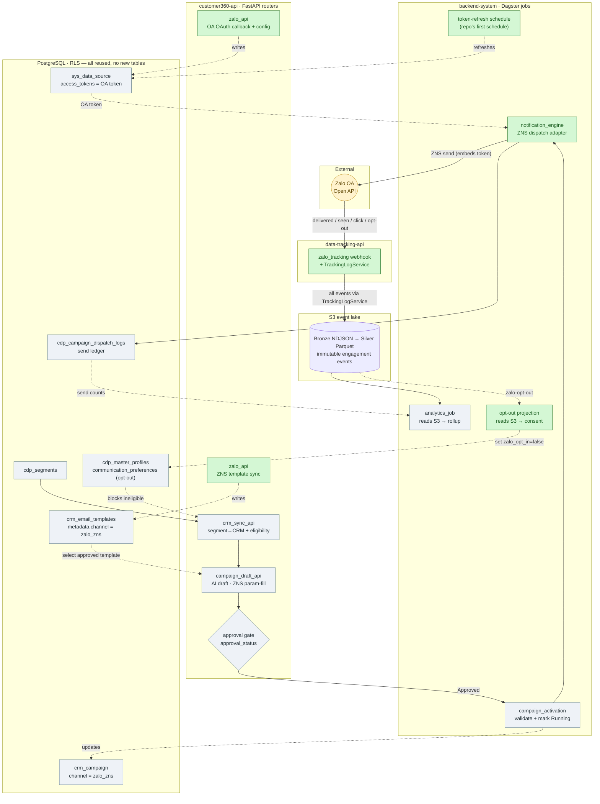
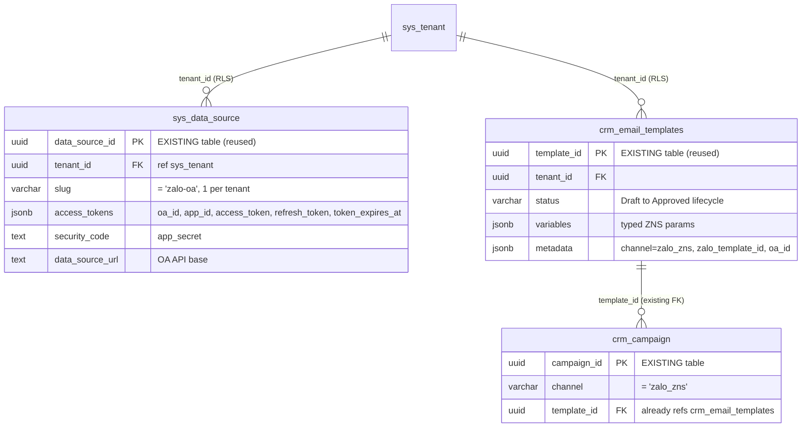
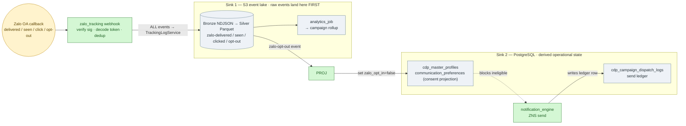

# Optimized Zalo (ZNS) Integration Plan

> **Single unified plan — canonical.** This is the one Zalo (ZNS) integration plan of record; it **fully supersedes** `AGENTIC-ZALO-MARKETING-FLOW.md` (v1), which can be archived. Everything is self-contained here: scope, schema + EER, phased delivery, config, tests, and the file-level implementation manifest with illustrative code.
> Core thesis: **Zalo is a second channel on the outbound rail that already exists for email.** Don't rebuild the rail — add the Zalo-specific track.

## 1. TL;DR

The repo already ships a complete agentic outbound pipeline for **email**: segment sync → AI campaign draft → human approval → orchestrated activation → engine dispatch → signed webhook → suppression → analytics rollup. `crm_campaign` already carries `channel`, `segment_id`, `template_id`, `approval_status`, `ai_plan`, etc.

So Zalo needs **only channel-specific code** and **zero new tables** — it reuses `sys_data_source`, `crm_email_templates`, `cdp_campaign_dispatch_logs`, and the profile consent field. vs v1's 7 new tables + 8 P0 subtasks:

1. **OAuth + OA credential lifecycle** (the one thing email doesn't have — an access/refresh token that rotates), stored in the existing **`sys_data_source.access_tokens`** JSONB (no new table).
2. **ZNS template *sync*** (read-only pull of pre-approved templates from Zalo into **`crm_email_templates`**) — **not AI free-text authoring**.
3. **A Zalo dispatch adapter** (fill the `notification_engine` placeholder, reusing the `email_engine` package shape).
4. **A Zalo webhook router** (clone `email_tracking.py`); opt-out sets the profile consent field — **no suppression table**.
5. **AI *param-fill*** on the existing campaign-draft path (channel=`zalo_zns` selects an Approved template and fills typed params).

Everything else is reuse.

### Two corrections to the v1 plan

- **ZNS is template-based.** Per the official guide (`cdp.gitbook.io/guide/tich-hop/tich-hop-zalo-tren-cdp`), ZNS templates are created and **approved inside the Zalo OA platform**, then **listed/synced** into the CDP by `template_id`. Campaign messaging fills *typed parameters* of an approved template; it does not author arbitrary message text. v1's "AI Zalo Template Authoring (free text)" is the wrong mental model for ZNS. (Free-form OA text is only allowed inside the post-interaction customer-care window — out of scope for campaign blasts.)
- **`campaign_activation` is already real**, not a placeholder. `CampaignActivationDagsterService` validates an Approved campaign, snapshots its segment, marks it Running, and submits the engine run. v1's "SUBTASK-05: modernize campaign_activation" is already done for the shared path.

## 1a. Architecture at a glance

Each horizontal band is a **service** (the process/deployable that owns those components). **Color = work type:** 🟩 green = new Zalo-specific, ⬜ grey = existing email rail reused unchanged, 🟨 yellow = external. The Zalo track just plugs into the rail.



**Read it by lane:** **customer360-api** authors (OA connect + template sync + segment sync + AI draft + approval gate). **backend-system/Dagster** runs the async jobs (token refresh, activation, the `notification_engine` ZNS dispatch, analytics). **data-tracking-api** owns the inbound webhook. **PostgreSQL** and the **S3 event lake** are the two datastores. Note the green nodes cluster into just the new work — most of every lane is grey reuse. **Two sinks, exactly like email:** send ledger + suppression live in Postgres; every engagement callback is written to the **S3 event lake** via the shared `TrackingLogService` (that S3 stream, not Postgres, is what `analytics_job` reads). See `docs/architecture/TECHNICAL-DOCUMENTATION.md` §3 (Data Flow) and §5.1 (S3/MinIO event lake).

## 3. What's genuinely NEW (the whole scope)

### 3.1 Zalo OA credential + OAuth lifecycle — *reuses `sys_data_source`, no new table*

Schema (EER) — OA credentials reuse `sys_data_source` (the connector table `data_synch`'s Zalo OA connector already fills); ZNS templates reuse `crm_email_templates`. **Zero new tables, zero DDL.**



<sub>**Every table is existing/reused — zero DDL.** Per-tenant separation is automatic (`tenant_id` + RLS on all three). OA config = one `sys_data_source` row per tenant (`slug='zalo-oa'`, tokens in `access_tokens` JSONB); ZNS templates live in `crm_email_templates`, which `crm_campaign.template_id` already FKs — so a `channel='zalo_zns'` campaign links a template with no schema change. Full field mapping in Appendix A.2.</sub>

- **OA config → `sys_data_source`** (no new table): one row per tenant, `slug='zalo-oa'` (unique per tenant via `uq_sys_data_source_slug`). Store `oa_id/app_id/access_token/refresh_token/token_expires_at` in `access_tokens` JSONB, `app_secret` in `security_code`, OA API base in `data_source_url`, `source_type=2`. Reuse the same row `data_synch`'s Zalo connector fills, so inbound-pull + outbound-ZNS share one token (no drift).
- **OAuth grant endpoint** in customer360-api `auth_api.py`: a `/auth/zalo-redirect` callback that exchanges the `oa_code` for access+refresh tokens and **upserts the tenant's `sys_data_source` row** (`access_tokens` JSONB). (Teko hosts this at `uns.teko.vn/auth/zalo-redirect`; self-hosted LEO owns it.)
- **Token-refresh job**: a small Dagster op on an interval **schedule** that refreshes tokens before expiry and writes the rotated token back into `access_tokens` JSONB (parse `token_expires_at` in code — JSONB is untyped). Note **no Dagster schedules exist in the repo today**, so this is the first one (wire a `ScheduleDefinition` in `notification_engine/dagster_defs.py`).
- ⚠️ **Verify before coding**: exact Zalo OAuth v4 token endpoint, access-token TTL, and whether the refresh token is single-use/rotating. Do not hardcode TTLs from memory — read the current Zalo OA Open API docs.

### 3.2 ZNS template sync (read-only) → reuse `crm_email_templates`

- **No new table** — ZNS templates live in `crm_email_templates` (per-tenant; already has the Draft→InReview→Approved→Rejected lifecycle + `variables`/`metadata` JSONB + approver columns, and `crm_campaign.template_id` already FKs it). Store Zalo's `zalo_template_id`/`oa_id`/`category`/`quality` and `channel:"zalo_zns"` in `metadata`, the typed ZNS param schema in `variables`; leave `subject`/`html_body`/`text_body` NULL. Filter with `metadata->>'channel' = 'zalo_zns'`.
- **Sync endpoint** `POST /api/v1/admin/zalo/templates/sync` → calls Zalo `template/all`, upserts rows into `crm_email_templates` (match on `metadata->>'zalo_template_id'`). Requires `require_tenant_admin` + OA-admin authorization (per the guide, the caller must be OA admin).
- **List/detail endpoints** for the UI, filtered to `channel=zalo_zns` (name, created time, quality, status, id + "view content").

### 3.3 Zalo dispatch adapter (fill `notification_engine`)

- Implement the `notification_engine` job by cloning the `email_engine` package layout: reuse `db.py`, `rls.py`, `send.py` loop, and the eligibility query; swap `adapters.py` for a **ZNS send adapter** and `rendering.py` for **typed-param binding** against `crm_email_templates.variables` (rows where `metadata->>'channel'='zalo_zns'`).
- Resolve the OA token from the tenant's `sys_data_source` row (`slug='zalo-oa'`, `access_tokens` JSONB; Redis-cached, refresh on expiry) — no dedicated provider-config table.
- Write one row per recipient to the **existing** `cdp_campaign_dispatch_logs` (`provider_message_id` = ZNS message id). Idempotent re-runs come free from the existing UNIQUE constraint.
- Respect ZNS priority category (OTP > transaction > promotion) and per-OA rate limits/quota; use the existing retry/backoff env pattern.

### 3.4 Zalo webhook + suppression + S3 event lake

Zalo engagement is a first-class **behavioral event source**, so it follows the same two-sink split the email channel already uses (`data-tracking-api/core/routers/email_tracking.py`; architecture in `TECHNICAL-DOCUMENTATION.md` §3/§5.1):



<sub>🟩 green = new Zalo-specific · ⬜ grey = reused infra · 🟨 yellow = external. **Sink 1** = durable event history in S3 (what analytics reads); **Sink 2** = operational state in Postgres.</sub>

- **Sink 1 — S3 event lake (durable source of truth).** The webhook normalizes each callback and writes it through the **shared `TrackingLogService`** (`build_tracking_request` → `ingest_tracking_request`), exactly like email opens/clicks and the web SDK. Events land as immutable hourly Bronze NDJSON (per-`data_source_id` bucket `data-tracking-{id}`), compacted to Silver Parquet by `event_time`; the `analytics_job` reads S3 — **not** Postgres — for campaign rollups. Envelope mirrors email's: `properties = { tracking_channel: "zalo", tenant_id, campaign_id, master_profile_id, event_dedup_key, ... }`, `event = { event_name: "zalo-delivered|zalo-seen|zalo-clicked|zalo-failed|zalo-opt-out", properties }`.
- **Sink 2 — Postgres (derived operational state).** The **send ledger** (`cdp_campaign_dispatch_logs`, written by the engine at send time) and the **consent projection** in `cdp_master_profiles.communication_preferences` (`zalo_opt_in`). **S3-first principle:** the webhook never writes consent directly — every raw event (incl. `zalo-opt-out`) lands in S3 (Sink 1) first; a **downstream domain action** (a Dagster projection op reading S3, mirroring how email suppression is materialized from S3) then sets `zalo_opt_in=false`. That flag is a **rebuildable projection** of the S3 opt-out stream — the same field the engine's eligibility query reads — so no suppression table is needed. Postgres holds identity, CRM, and rebuildable projections — never the raw event history.
- **Correlation token.** Mail clients/webhooks can't authenticate, so email embeds a **signed tracking token** the provider echoes back (`decode_tracking_token` → tenant/campaign/master_profile). ZNS is the same shape: the dispatch adapter (§3.3) must embed a `tracking_id`/token at send time that the webhook decodes to recover `(tenant_id, campaign_id, master_profile_id)`.
- **Router (shared handler, max reuse).** Refactor the email webhook into a reusable `make_webhook_router(prefix, secret_attr, event_map, suppress_reasons, channel)` factory; `email_tracking.py` and a new `zalo_tracking.py` each become a few lines that call it with their own event-map. Zalo: `POST /api/v1/track/zalo/webhook`, signature-verified with `CRM_ZALO_WEBHOOK_SIGNING_SECRET`, map event → dedup → `_record_event` writes **every** event (incl. opt-out, with `suppression_reason` in the payload) **only to S3** — no DB write in the request path. `data_source_id` follows email's `_source_id(tenant_id)`. ⚠️ Confirm Zalo's signature scheme (HMAC vs `mac`/appsecret) before wiring `verify_webhook_signature` (§8).
- **Opt-out projection (domain action).** A downstream Dagster op reads new `zalo-opt-out`/`zalo-failed` events from S3 and sets `cdp_master_profiles.communication_preferences->>'zalo_opt_in'=false` — the only place consent is written. Rebuildable by replaying the S3 opt-out stream.

### 3.5 AI param-fill (extend, don't add)

- On the existing `campaign_draft_api` path, for `channel=zalo_zns` the AI: (a) **selects** an Approved `crm_email_templates` row (`metadata.channel=zalo_zns`) that fits the objective, (b) **fills its typed params** (`variables`) from segment/profile context, (c) drafts strategy + schedule. Output stays `Draft` behind the existing human-approval gate. No new endpoint, no free-text authoring.

## 4. Phased delivery (lean)

- **Phase 0 — Connect (1 track):** reuse `sys_data_source` (`slug='zalo-oa'`) for OA config + `/auth/zalo-redirect` OAuth exchange + token-refresh job. *Exit:* a tenant can authorize an OA and we hold a live, auto-refreshing token. **(This is the real long pole — do it first and verify against Zalo docs.)**
- **Phase 1 — Templates:** ZNS template sync into `crm_email_templates` (`metadata.channel=zalo_zns`) + list/detail endpoints. *Exit:* approved ZNS templates visible in CDP.
- **Phase 2 — Dispatch:** `notification_engine` ZNS adapter + eligibility filter (valid phone + `zalo_opt_in` consent) + write to `cdp_campaign_dispatch_logs`; wire `campaign_activation` to route `zalo_zns` campaigns here. *Exit:* an approved zalo campaign sends real ZNS to an eligible audience.
- **Phase 3 — Close the loop:** `zalo_tracking.py` webhook + opt-out into profile consent + analytics rollup (reuse). *Exit:* delivery/seen/opt-out update profiles, consent, and campaign metrics.
- **Phase 4 — AI param-fill:** extend `campaign_draft_api` for `zalo_zns`. *Exit:* AI proposes a template+params+schedule draft behind the existing approval gate.

## 6. Config (env)

Reuse existing AI keys (`CRM_EMAIL_AI_PROVIDER`/`OPENAI_API_KEY`/`GEMINI_API_KEY`) — or rename the selector to `CRM_AI_PROVIDER` if you want it channel-neutral. New Zalo keys (mirror the email set):

```
CRM_ZALO_OA_APP_ID=
CRM_ZALO_OA_APP_SECRET=
CRM_ZALO_OA_API_BASE_URL=            # verify current Zalo OA Open API base
CRM_ZALO_OAUTH_REDIRECT_URI=        # our /auth/zalo-redirect
CRM_ZALO_WEBHOOK_SIGNING_SECRET=    # empty disables the webhook, like email
CRM_ZALO_BATCH_SIZE=                 # mirror EMAIL_ENGINE_BATCH_SIZE
CRM_ZALO_RATE_LIMIT_PER_SEC=        # Zalo-specific OA send quota
```

Retries are handled by the Dagster `RetryPolicy(max_retries=2, delay=15)` on the op, exactly like `email_engine` — no per-channel retry/backoff env knobs. Tokens (access/refresh) live in the tenant's `sys_data_source.access_tokens` JSONB (DB + RLS), **not** in env.

## 7. Testing (reuse the harness)

Follow the email channel's E2E and the simulator patterns (`all-data-simulator`): dual verification (API + direct Postgres), bounded polling, idempotency asserts. Zalo-specific additions: mock OA adapter, token-refresh unit test, webhook signature + suppression test (clone `test_email_tracking.py`), and a param-binding test that a template's typed params are all satisfied before send.

## 8. Open items to verify (do not code from memory)

1. Zalo OAuth v4 token endpoint + access-token TTL + refresh-token rotation semantics.
2. Current ZNS send + `template/all` Open API endpoints, payload shape, and per-category quota/pricing.
3. Whether the webhook signature scheme is HMAC (assumed, mirroring email) or Zalo's own `mac`/`appsecret` scheme — adjust `verify_webhook_signature` accordingly.

*(Items 1–3 are marked unverified because the GitBook guide describes the Teko-hosted flow, not the raw Open API. Confirm against Zalo's official developer docs before implementation.)*

---

## Appendix A — Implementation manifest (what I will build)

Concrete, file-level task list mapped to the phases in §5. `[new]` = create, `[edit]` = modify existing, `[reuse]` = touched by config only / not modified. Paths are repo-relative and verified against the current tree.

### Phase 0 — Connect (OA OAuth + token lifecycle)

**Schema** (`database-init/`)
- `[none]` **no DDL, no migration, no RLS-array change** — OA config reuses the existing `sys_data_source` table (already RLS-registered). One row per tenant: `slug='zalo-oa'`, `source_type=2`, tokens in `access_tokens` JSONB, `app_secret` in `security_code`.

**customer360-api** (`customer360-api/core/`)
- `[new] routers/zalo_api.py` — `all_zalo_routers`; endpoints `GET/PUT /admin/zalo/oa-config` (read/write the tenant's `sys_data_source` `zalo-oa` row), `GET /admin/zalo/oauth-url` (build consent URL). Guard every route with `require_tenant` + `require_tenant_admin`.
- `[edit] routers/auth_api.py` — add `GET /auth/zalo-redirect` callback: exchange `oa_code` → access+refresh tokens, upsert the tenant's `sys_data_source.access_tokens`.
- `[edit] apps/http_api_app.py` — import `all_zalo_routers`, append one `include_router` loop in `_include_api_routers()`.
- `[reuse] models/crm.py` + `schemas/crm.py` — reuse the existing `sys_data_source` model/schema (no new ORM); optionally add a thin `ZaloOaConfig` Pydantic view over its `access_tokens` JSONB.
- `[edit] config.py` — add `crm_zalo_oa_app_id/secret`, `crm_zalo_oa_api_base_url`, `crm_zalo_oauth_redirect_uri` (reuse existing `dagster_notification_engine_*`).

**backend-system** (`backend-system/notification_engine/`)
- `[new] notification_engine/token_refresh.py` — refresh-before-expiry op; persist rotated refresh_token (DB only, RLS-scoped).
- `[edit] dagster_defs.py` — replace the placeholder with a real job + **the repo's first `ScheduleDefinition`** (interval token refresh).

**Config** — `[edit] .env.example` add the `CRM_ZALO_OA_*` keys (docker-compose already `env_file: .env`).

*Exit: a tenant authorizes an OA and we hold a live, auto-refreshing token.* ⚠️ Verify token endpoint/TTL/rotation first (§8).

### Phase 1 — Templates (read-only ZNS sync)
- `[none]` **no DDL** — ZNS templates reuse the existing `crm_email_templates` table (`metadata->>'channel'='zalo_zns'`).
- `[reuse] models/crm.py` + `schemas/crm.py` — reuse the existing `EmailTemplate` ORM / `EmailTemplateRead`; add a ZNS read view only if the UI needs distinct fields.
- `[edit] routers/zalo_api.py` — `POST /admin/zalo/templates/sync` (calls Zalo `template/all`, upsert into `crm_email_templates` matching `metadata->>'zalo_template_id'`), `GET /admin/zalo/templates`, `GET /admin/zalo/templates/{id}` (filtered to `channel=zalo_zns`).

*Exit: approved ZNS templates visible in the CDP.*

### Phase 2 — Dispatch (fill notification_engine)
- Clone the `email_engine` package shape into `backend-system/notification_engine/notification_engine/`:
  - `[new] adapters.py` — `ZNSDispatchAdapter(DispatchAdapter)` + `MockZNSAdapter` + `build_adapter()`; returns `DispatchResult(ok, provider_message_id, error)`.
  - `[new] provider_config.py` — resolve OA token from the tenant's `sys_data_source` row (`slug='zalo-oa'`, `access_tokens` JSONB; Redis-cached, refresh on expiry).
  - `[new] rendering.py` — bind typed params against `crm_email_templates.variables` for the `zalo_zns` template (assert all required params satisfied before send).
  - `[new] send.py` — batch send loop (reuse email's structure): eligibility query (valid phone + `communication_preferences->>'zalo_opt_in'` = true), rate-limit/retry from env, **embed a signed tracking token/`tracking_id` in the ZNS request** (so the Phase-3 webhook can decode `tenant/campaign/master_profile`), write one row per recipient to the existing `cdp_campaign_dispatch_logs`.
  - `[new] db.py`, `[new] rls.py` — copied from email_engine (set `app.tenant_id` per connection).
  - `[edit] dagster_defs.py` — add `send_zalo_campaign` job (Config: `campaign_id`+`tenant_id`).
- `[none]` **no suppression table** — opt-out sets `cdp_master_profiles.communication_preferences->>'zalo_opt_in'=false`, which the eligibility query already reads.
- `[edit] campaign_activation/.../triggers.py` — branch on `crm_campaign.channel`: `zalo_zns` → submit `notification_engine` run instead of `email_engine`.
- `[edit] customer360-api/core/utils/dagster_client.py` — give `NotificationEngineDagsterService.dispatch(campaign_id, tenant_id)` a real `run_config` (mirror `CampaignActivationDagsterService.activate()`).
- `[edit] config.py` + `.env.example` — `CRM_ZALO_BATCH_SIZE` (mirror `EMAIL_ENGINE_BATCH_SIZE`) + `CRM_ZALO_RATE_LIMIT_PER_SEC` (OA quota). Retries via Dagster `RetryPolicy` like email — no retry env knobs.

*Exit: an approved `zalo_zns` campaign sends real ZNS to an eligible audience, idempotently.*

### Phase 3 — Close the loop (webhook + feedback)
- `[edit] data-tracking-api/core/routers/` — extract a shared `make_webhook_router(prefix, secret_attr, event_map, suppress_reasons, channel)` factory and refactor `email_tracking.py` onto it (email regression-tested); then `[new] zalo_tracking.py` = a few-line call with the `zalo-*` event-map. The webhook records **every** event (incl. opt-out, `suppression_reason` in the payload) to **S3 via `TrackingLogService`** (`tracking_channel="zalo"`, `data_source_id=_source_id(tenant_id)`) — **no DB write in the request path**. ⚠️ Confirm Zalo's signature scheme (HMAC vs `mac`/appsecret) before wiring `verify_webhook_signature` (§8).
- `[new] backend-system/notification_engine/…` **opt-out projection op** — reads new `zalo-opt-out`/`zalo-failed` events from S3 and sets `cdp_master_profiles.communication_preferences->>'zalo_opt_in'=false` (the *only* place consent is written; rebuildable by replay; mirrors how email suppression is materialized from S3). Schedule it or fold into `analytics_job`.
- `[edit] data-tracking-api/core/app.py` — mount the router (twice, under `/api/v1` and `/data/api/v1`, like email).
- `[edit] data-tracking-api/core/config.py` + `.env.example` — `CRM_ZALO_WEBHOOK_SIGNING_SECRET` (empty disables the webhook, like email).
- `[reuse]` `TrackingLogService` / `storage.py` (S3 writer) / `redis_queue.py` / `analytics_job` — **no change**; Zalo events ride the exact same ingest→Redis-Stream→S3(NDJSON/Parquet)→analytics path as web + email tracking. This is the sink the user flagged: Zalo tracking persists to S3, not Postgres.

*Exit: delivery/seen/opt-out update profiles, consent, and campaign metrics.*

### Phase 4 — AI param-fill
- `[edit] customer360-api/core/ai_providers/campaign_planner.py` — add a `zalo_zns` output contract: select an Approved `crm_email_templates` row (`channel=zalo_zns`) from a closed candidate list + fill typed params (reuse the existing provider abstraction + JSON-contract prompt; no new provider code). Output stays `Draft` behind the existing approval gate.
- `[edit] schemas/crm.py` — extend `CampaignDraftRequest/Response` for the ZNS template+params shape.

*Exit: AI proposes a template+params+schedule draft behind the existing human-approval gate.*

### Tests (per phase, reuse the harness)
- `[new] data-tracking-api/tests/test_zalo_tracking.py` — clone `test_email_tracking.py` (signature accept/reject, suppression on opt-out, dedup).
- `[new] backend-system/notification_engine/tests/` — token-refresh unit test, param-binding test (all required params satisfied), mock-adapter send + idempotent re-run.
- `[edit] all-data-simulator` E2E — extend the email E2E: select segment → sync → AI draft → approve → activate (mock ZNS adapter) → simulate webhook → assert `cdp_campaign_dispatch_logs` + suppression + campaign metrics (dual API + Postgres verification).

### Will NOT touch (reuse verbatim)
`crm_campaign` (has channel/segment/template/approval/ai_plan), `cdp_campaign_dispatch_logs`, `crm_segment_sync_runs`, `crm_campaign_content_items`, `crm_sync_api.py`, `campaign_draft_api.py` approval flow, `campaign_activation` core logic, the RLS/tenant loop mechanism, `analytics` job, `require_tenant_admin`.

### Rough sequencing
Phase 0 is the long pole (external OAuth, first schedule, verify-against-docs) — do it first and alone. Phases 1→2→3 are linear. Phase 4 can start once Phase 1 templates exist and land any time before GA. Each phase is independently demoable.

---

## Appendix A.1 — Key code (illustrative)

Grounded in the existing email-channel patterns (`email_engine`, `email_tracking.py`, `crm_email_provider_config`, dagster defs). Zalo Open API endpoints/payloads are marked ⚠️ — confirm against current Zalo OA docs (plan §8) before shipping.

### Phase 0 · OA config store — reuse `sys_data_source` (no DDL)

```python
# No CREATE TABLE. OA config = one sys_data_source row per tenant (slug='zalo-oa');
# the rotating OAuth token lives in the access_tokens JSONB, app_secret in security_code.
# sys_data_source is already RLS-registered — nothing to add to the policy array.
def upsert_oa_config(conn, tenant_id, oa_id, *, access_token, refresh_token, expires_in):
    set_tenant_context(conn, tenant_id)                      # RLS: SET app.tenant_id
    tokens = {"oa_id": oa_id, "app_id": settings.crm_zalo_oa_app_id,
              "access_token": access_token, "refresh_token": refresh_token,
              "token_expires_at": _iso(now_utc() + timedelta(seconds=expires_in))}
    conn.execute("""
        INSERT INTO customer360.sys_data_source
               (tenant_id, name, slug, source_type, status, data_source_url, access_tokens, security_code)
        VALUES (%s, 'Zalo OA', 'zalo-oa', 2, 1, %s, %s::jsonb, %s)
        ON CONFLICT (tenant_id, slug) DO UPDATE          -- uq_sys_data_source_slug
           SET access_tokens = customer360.sys_data_source.access_tokens || EXCLUDED.access_tokens,
               updated_at = now()""",
        (tenant_id, settings.crm_zalo_oa_api_base_url, json.dumps(tokens), settings.crm_zalo_oa_app_secret))
```

### Phase 0 · OAuth callback — `customer360-api/core/routers/auth_api.py`

```python
# GET /auth/zalo-redirect  — exchange oa_code for tokens, upsert into sys_data_source.
import time, json, urllib.request, urllib.parse
from fastapi import Request
from core.config import settings

@router.get("/zalo-redirect")
async def zalo_redirect(request: Request, oa_id: str, code: str, state: str):
    tenant_id = verify_state_token(state)              # CSRF: state == signed tenant token
    # ⚠️ endpoint/params per current Zalo OA OAuth v4 docs
    body = urllib.parse.urlencode({"code": code, "app_id": settings.crm_zalo_oa_app_id,
                                   "grant_type": "authorization_code"}).encode()
    req = urllib.request.Request("https://oauth.zaloapp.com/v4/oa/access_token", data=body,
                                 headers={"secret_key": settings.crm_zalo_oa_app_secret,
                                          "Content-Type": "application/x-www-form-urlencoded"})
    tok = json.loads(urllib.request.urlopen(req, timeout=15).read())
    with db_conn() as conn:                                # store into sys_data_source.access_tokens
        upsert_oa_config(conn, tenant_id, oa_id,
                         access_token=tok["access_token"], refresh_token=tok["refresh_token"],
                         expires_in=int(tok["expires_in"]))
    return {"status": "connected", "oa_id": oa_id}
```

### Phase 0 · token-refresh op + first schedule — `backend-system/notification_engine/…/token_refresh.py` + `dagster_defs.py`

```python
# token_refresh.py
def refresh_due_tokens(conn, skew_seconds=300) -> int:
    # OA config lives in sys_data_source; token fields are inside access_tokens JSONB.
    with conn.cursor() as cur:
        cur.execute("""SELECT tenant_id, data_source_id, access_tokens
                         FROM customer360.sys_data_source
                        WHERE slug='zalo-oa' AND status=1
                          AND (access_tokens->>'token_expires_at')::timestamptz
                              < now() + (%s || ' seconds')::interval""",
                    (skew_seconds,))
        rows = cur.fetchall()
    for tenant_id, ds_id, tokens in rows:
        set_tenant_context(conn, tenant_id)                # RLS: SET app.tenant_id
        tok = _zalo_refresh(settings.crm_zalo_oa_app_id, settings.crm_zalo_oa_app_secret,
                            tokens["refresh_token"])       # ⚠️ POST v4/oa/access_token grant=refresh_token
        _persist_rotated_jsonb(conn, ds_id, tok)           # merge new token fields into access_tokens
    return len(rows)

# dagster_defs.py  — replaces the log+sleep placeholder; repo's FIRST schedule
from dagster import Definitions, ScheduleDefinition, job, op, RetryPolicy

@op(retry_policy=RetryPolicy(max_retries=2, delay=15))
def refresh_zalo_tokens_op(context):
    with db_conn() as conn:
        context.log.info("refreshed %d Zalo OA tokens", refresh_due_tokens(conn))

@job(name="zalo_token_refresh_job")
def zalo_token_refresh_job(): refresh_zalo_tokens_op()

defs = Definitions(
    jobs=[zalo_token_refresh_job, send_zalo_campaign_job],           # send job added in Phase 2
    schedules=[ScheduleDefinition(job=zalo_token_refresh_job, cron_schedule="*/30 * * * *")],
)
```

### Phase 1 · template sync endpoint — `customer360-api/core/routers/zalo_api.py`

```python
@router.post("/admin/zalo/templates/sync")
async def sync_zns_templates(request: Request):
    tenant_id = require_tenant(request)
    require_tenant_admin(request, "zalo template sync")             # OA-admin action
    cfg = get_oa_config(tenant_id)                                 # sys_data_source 'zalo-oa' row (auto-refreshed)
    templates = zalo_list_templates(cfg["access_token"])          # ⚠️ GET business.openapi/template/all
    # upsert into crm_email_templates: metadata.channel='zalo_zns', match on metadata->>'zalo_template_id'
    upserted = upsert_zns_templates(tenant_id, cfg["oa_id"], templates)
    return {"synced": upserted}
```

### Phase 2 · ZNS dispatch adapter — `backend-system/notification_engine/…/adapters.py`

```python
# Mirrors email_engine.adapters: DispatchAdapter base + DispatchResult(ok, provider_message_id, error).
from dataclasses import dataclass

@dataclass
class DispatchResult:
    ok: bool
    provider_message_id: str | None = None
    error: str | None = None

class ZNSDispatchAdapter:
    def __init__(self, access_token: str): self.token = access_token
    def send(self, *, phone: str, template_id: str, template_data: dict, tracking_id: str) -> DispatchResult:
        # ⚠️ POST https://business.openapi.zalo.me/message/template  header: access_token
        payload = {"phone": phone, "template_id": template_id,
                   "template_data": template_data, "tracking_id": tracking_id}
        try:
            resp = _post_json("https://business.openapi.zalo.me/message/template", payload,
                              headers={"access_token": self.token})
            if resp.get("error") == 0:
                return DispatchResult(True, provider_message_id=resp["data"]["msg_id"])
            return DispatchResult(False, error=f'{resp.get("error")}:{resp.get("message")}')
        except Exception as e:
            return DispatchResult(False, error=str(e))

class MockZNSAdapter(ZNSDispatchAdapter):
    def send(self, **kw): return DispatchResult(True, provider_message_id="mock-" + kw["tracking_id"])

def build_adapter(cfg, env_override=None):                          # provider switch, like email
    if (env_override or cfg.provider) == "mock": return MockZNSAdapter(cfg.access_token)
    return ZNSDispatchAdapter(cfg.access_token)
```

### Phase 2 · send loop (eligibility + tracking token + ledger) — `…/send.py`

```python
ELIGIBLE_SQL = """
  SELECT p.master_profile_id, p.phone_number
    FROM customer360.cdp_master_profiles p
   WHERE p.tenant_id = %(tenant)s
     AND p.phone_number IS NOT NULL
     -- consent AND opt-out in one field: opt-out flips zalo_opt_in=false (no suppression table)
     AND COALESCE((p.communication_preferences->>'zalo_opt_in')::bool, false)
     AND p.master_profile_id = ANY(%(audience)s)"""

def run_send(conn, campaign, cfg):
    adapter = build_adapter(cfg)
    set_tenant_context(conn, campaign.tenant_id)                    # RLS
    for pid, phone in eligible_recipients(conn, campaign):
        token = sign_tracking_token(campaign.tenant_id, campaign.campaign_id, pid)  # webhook correlation
        r = adapter.send(phone=phone, template_id=campaign.zns_template_id,   # crm_email_templates.metadata.zalo_template_id
                         template_data=render_params(campaign, pid), tracking_id=token)
        # write to the EXISTING generic ledger; UNIQUE(campaign_id, master_profile_id) → idempotent
        conn.execute("""INSERT INTO customer360.cdp_campaign_dispatch_logs
                          (tenant_id, campaign_id, master_profile_id, provider, provider_message_id, status, dispatched_at)
                        VALUES (%s,%s,%s,'zalo_zns',%s,%s, now())
                        ON CONFLICT (campaign_id, master_profile_id) DO UPDATE
                          SET status=EXCLUDED.status, provider_message_id=EXCLUDED.provider_message_id""",
                     (campaign.tenant_id, campaign.campaign_id, pid, r.provider_message_id,
                      'Sent' if r.ok else 'Failed'))
```

### Phase 2 · opt-out (no table) + activation branch + dagster_client

```python
# No suppression table. Opt-out / permanent-failure flips the profile consent field
# the eligibility query already reads — a suppressed profile is simply not eligible.
def suppress_profile(conn, tenant_id, master_profile_id, reason):
    set_tenant_context(conn, tenant_id)                                # RLS
    conn.execute("""UPDATE customer360.cdp_master_profiles
                       SET communication_preferences =
                             COALESCE(communication_preferences, '{}'::jsonb)
                             || jsonb_build_object('zalo_opt_in', false,
                                                   'zalo_opt_out_reason', %s),
                           updated_at = now()
                     WHERE tenant_id=%s AND master_profile_id=%s""",
                 (reason, tenant_id, master_profile_id))
```

```python
# campaign_activation/…/triggers.py — route by channel
def trigger_dispatch(campaign):
    if campaign.channel == "zalo_zns":
        return dagster_client.notification_engine.dispatch(campaign.campaign_id, campaign.tenant_id)
    return dagster_client.email_engine.send_campaign(...)             # existing path unchanged

# customer360-api/core/utils/dagster_client.py — give the wired placeholder a real run_config
class NotificationEngineDagsterService(DagsterService):
    def dispatch(self, campaign_id: str, tenant_id: str) -> str:
        run_config = {"ops": {"send_zalo_campaign_op": {"config":
                      {"campaign_id": campaign_id, "tenant_id": tenant_id}}}}
        return self.submit(run_config=run_config, tags={"campaign_id": campaign_id, "tenant_id": tenant_id})
```

### Phase 3 · webhook → S3 (all events) + downstream opt-out projection

```python
# S3-FIRST: the webhook writes ONLY to the S3 event lake (every event, incl. opt-out,
# carries suppression_reason in the payload). A separate downstream op projects opt-out
# onto the profile consent field. No DB write in the request path.
# data-tracking-api/core/routers/channel_webhook.py  (email_tracking.py refactored onto this)
def make_webhook_router(*, prefix, secret_attr, event_map, suppress_reasons, channel, sig_alias):
    router = APIRouter(prefix=prefix)
    @router.post("/webhook")
    async def hook(request: Request, service = Depends(get_tracking_service),
                   sig: str | None = Header(None, alias=sig_alias)):
        secret = getattr(settings, secret_attr)
        if not secret:                 return JSONResponse({"status": "disabled"}, 503)
        raw = await request.body()
        if not verify_webhook_signature(raw, sig, secret):           # ⚠️ HMAC vs Zalo 'mac' — confirm
            return JSONResponse({"status": "rejected"}, 401)
        evt = json.loads(raw)
        name = event_map.get(evt.get("event_name"))
        decoded = decode_tracking_token(evt.get("tracking_id") or evt.get("token"))
        if not (name and decoded):     return {"status": "ignored"}
        _record_event(decoded, name, service, dedup_key=f'{channel}:{evt.get("msg_id")}:{name}',
                      payload={"tracking_channel": channel, "provider_message_id": evt.get("msg_id"),
                               "suppression_reason": suppress_reasons.get(name)})   # → S3 ONLY
        return {"status": "ok", "event": name}
    return router

# data-tracking-api/core/routers/zalo_tracking.py — the whole module (no DB writer):
ZNS_EVENTS = {"delivered": "zalo-delivered", "user_received_message": "zalo-delivered",
              "user_seen_message": "zalo-seen", "user_click": "zalo-clicked",
              "failed": "zalo-failed", "user_unfollow": "zalo-opt-out"}
router = make_webhook_router(prefix="/track/zalo", secret_attr="zalo_webhook_signing_secret",
                             event_map=ZNS_EVENTS, channel="zalo", sig_alias="X-ZEvent-Signature",
                             suppress_reasons={"zalo-opt-out": "opt_out", "zalo-failed": "permanent_failure"})

# ── downstream DOMAIN ACTION (Dagster op, reads S3) — the ONLY place consent is written:
def project_zalo_optouts(conn, s3_events):       # new zalo-opt-out / zalo-failed events from S3
    for e in s3_events:
        p = e["properties"]
        if not p.get("suppression_reason"):      continue
        suppress_profile(conn, p["tenant_id"], p["master_profile_id"], p["suppression_reason"])
```

### Phase 4 · AI param-fill — `customer360-api/core/ai_providers/campaign_planner.py`

```python
# Extend the existing planner: for zalo_zns the AI selects an Approved template
# from a CLOSED candidate list and fills its typed params — no free text.
ZNS_CONTRACT = """Return JSON: {"template_id": "<one of the candidate ids>",
  "template_data": {<param>: <value> for every required param>},
  "strategy_summary": "...", "start_date": "YYYY-MM-DD", "end_date": "YYYY-MM-DD"}"""

def generate_zalo_campaign_plan(segment_ctx, candidate_templates, objective):
    provider = get_provider(settings.crm_email_ai_provider)          # reuse gemini/openai abstraction
    plan = provider.parse_json_object(provider.complete(
        build_prompt(ZNS_CONTRACT, segment_ctx, candidate_templates, objective)))
    assert plan["template_id"] in {t.template_id for t in candidate_templates}   # guardrail
    assert_all_required_params_present(plan, candidate_templates)    # every typed param filled
    return plan   # persisted as Draft; human approval gate unchanged
```

---

## Appendix A.2 — Reuse spectrum: minimum vs maximum reuse

The zero-new-table decisions (OA config, ZNS templates, opt-out) and the shared webhook / AI-planner reuse are settled in the main plan (§3–§4, Appendix A/A.1). The one build choice still worth calling out is the **dispatch engine** — clone vs shared core:

- **MAX reuse** = least new code; extend/generalize the existing email code so both channels share it. Downside: touches working email paths (bigger blast radius, regression risk).
- **MIN reuse** = self-contained clone; new code only, email untouched. Matches the repo's convention that each Dagster code location is self-contained (`email_engine` and `campaign_activation` each carry their own `db.py`/`rls.py`). Downside: more files, parallel maintenance.

| Area | MAX reuse | MIN reuse | Recommended |
|---|---|---|---|
| Dispatch engine (db/rls/send loop) | Extract channel-agnostic core to `backend-system/shared/`, inject adapter+renderer | Clone `email_engine` package, swap `adapters.py`+`rendering.py` | **MIN** — matches repo convention, no email regression |

### Dispatch engine

```python
# ── MAX reuse ── backend-system/shared/dispatch_core.py  (email + zalo both call this)
def run_dispatch(conn, campaign, adapter, render, eligible_sql):
    set_tenant_context(conn, campaign.tenant_id)
    for pid, addr in query(conn, eligible_sql, campaign):
        r = adapter.send(to=addr, **render(campaign, pid))
        write_dispatch_log(conn, campaign, pid, r)        # shared ledger writer
# zalo: run_dispatch(conn, c, ZNSDispatchAdapter(tok), render_zns, ZALO_ELIGIBLE_SQL)
# email refactored to call the same core.  ← touches working email code.

# ── MIN reuse ── backend-system/notification_engine/.../send.py  (email untouched)
def run_send(conn, campaign, cfg):                         # cloned from email_engine.send
    adapter = build_adapter(cfg); set_tenant_context(conn, campaign.tenant_id)
    for pid, phone in eligible_recipients(conn, campaign):
        r = adapter.send(phone=phone, template_id=campaign.zalo_template_id,
                         template_data=render_params(campaign, pid), tracking_id=sign(...))
        upsert_dispatch_log(conn, campaign, pid, r)        # own copy of the writer
```

**Bottom line (adopted):** **zero new tables** — OA config → `sys_data_source`, templates → `crm_email_templates`, opt-out → profile consent — plus shared `make_webhook_router` / `campaign_planner` reuse. The only genuinely new *code* is the ZNS dispatch adapter, the OAuth callback, the token-refresh schedule, and a thin zalo webhook module over the shared `make_webhook_router`; the dispatch engine is a self-contained `notification_engine` package clone (matching the repo's Dagster-code-location convention). If untyped JSONB or the shared template table ever chafes, dedicated `crm_zalo_*` tables (per §3.1) are the drop-in upgrade.
