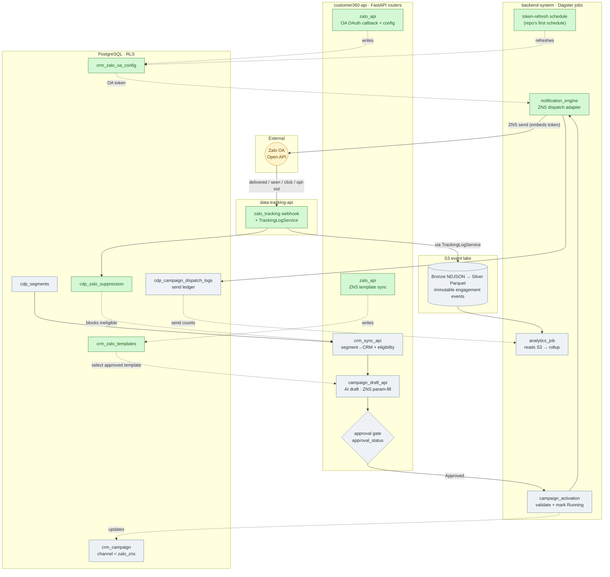
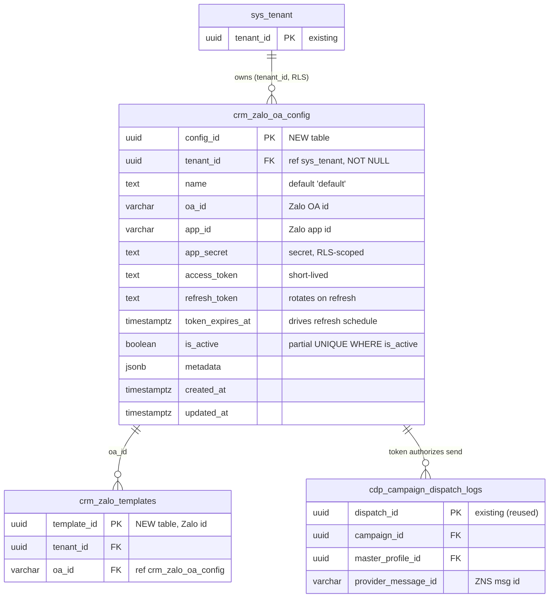
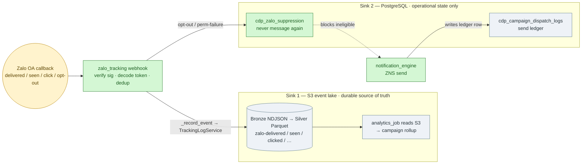

# Optimized Zalo (ZNS) Integration Plan

> **Single unified plan — canonical.** This is the one Zalo (ZNS) integration plan of record; it **fully supersedes** `AGENTIC-ZALO-MARKETING-FLOW.md` (v1), which can be archived. Everything is self-contained here: scope, schema + EER, phased delivery, config, tests, and the file-level implementation manifest with illustrative code.
> Core thesis: **Zalo is a second channel on the outbound rail that already exists for email.** Don't rebuild the rail — add the Zalo-specific track.

## 1. TL;DR

The repo already ships a complete agentic outbound pipeline for **email**: segment sync → AI campaign draft → human approval → orchestrated activation → engine dispatch → signed webhook → suppression → analytics rollup. `crm_campaign` already carries `channel`, `segment_id`, `template_id`, `approval_status`, `ai_plan`, etc.

So Zalo needs **only the channel-specific pieces**, not the 7 new tables + 8 P0 subtasks in v1:

1. **OAuth + OA credential lifecycle** (the one thing email doesn't have — email uses static SMTP creds; Zalo needs an access/refresh token that rotates).
2. **ZNS template *sync*** (read-only pull of pre-approved templates from Zalo) — **not AI free-text authoring**.
3. **A Zalo dispatch adapter** (fill the `notification_engine` placeholder, reusing the `email_engine` package shape).
4. **A Zalo webhook router** (clone `email_tracking.py`) + a phone-keyed suppression table.
5. **AI *param-fill*** on the existing campaign-draft path (channel=`zalo_zns` selects an Approved template and fills typed params).

Everything else is reuse.

### Two corrections to the v1 plan

- **ZNS is template-based.** Per the official guide (`cdp.gitbook.io/guide/tich-hop/tich-hop-zalo-tren-cdp`), ZNS templates are created and **approved inside the Zalo OA platform**, then **listed/synced** into the CDP by `template_id`. Campaign messaging fills *typed parameters* of an approved template; it does not author arbitrary message text. v1's "AI Zalo Template Authoring (free text)" is the wrong mental model for ZNS. (Free-form OA text is only allowed inside the post-interaction customer-care window — out of scope for campaign blasts.)
- **`campaign_activation` is already real**, not a placeholder. `CampaignActivationDagsterService` validates an Approved campaign, snapshots its segment, marks it Running, and submits the engine run. v1's "SUBTASK-05: modernize campaign_activation" is already done for the shared path.

## 1a. Architecture at a glance

Each horizontal band is a **service** (the process/deployable that owns those components). **Color = work type:** 🟩 green = new Zalo-specific, ⬜ grey = existing email rail reused unchanged, 🟨 yellow = external. The Zalo track just plugs into the rail.



**Read it by lane:** **customer360-api** authors (OA connect + template sync + segment sync + AI draft + approval gate). **backend-system/Dagster** runs the async jobs (token refresh, activation, the `notification_engine` ZNS dispatch, analytics). **data-tracking-api** owns the inbound webhook. **PostgreSQL** and the **S3 event lake** are the two datastores. Note the green nodes cluster into just the new work — most of every lane is grey reuse. **Two sinks, exactly like email:** send ledger + suppression live in Postgres; every engagement callback is written to the **S3 event lake** via the shared `TrackingLogService` (that S3 stream, not Postgres, is what `analytics_job` reads). See `docs/architecture/TECHNICAL-DOCUMENTATION.md` §3 (Data Flow) and §5.1 (S3/MinIO event lake).

## 3. What's genuinely NEW (the whole scope)

### 3.1 Zalo OA credential + OAuth lifecycle  — *the only structurally new part*

Schema (EER) — the new credential table and how it anchors templates and dispatch:



<sub>**Legend** (Mermaid ER can't portably color entities, so new/existing is tagged in each table's `PK` comment): 🟩 *NEW* = `crm_zalo_oa_config`, `crm_zalo_templates` · ⬜ *existing (reused)* = `sys_tenant`, `cdp_campaign_dispatch_logs`. The two neighbours are abbreviated (full detail in §3.2 / reused as-is). The OA config is the credential anchor: templates belong to an `oa_id`, and its token authorizes every ZNS send landing in the dispatch ledger.</sub>

- **Table** `crm_zalo_oa_config` (mirror of `crm_email_provider_config`, one active row per tenant):
  `config_id, tenant_id, name, oa_id, app_id, app_secret, access_token, refresh_token, token_expires_at, is_active, metadata, created_at, updated_at`. Add partial unique index `WHERE is_active` and RLS, exactly like the email config table.
- **OAuth grant endpoint** in customer360-api `auth_api.py`: a `/auth/zalo-redirect` callback that exchanges the `oa_code` for access+refresh tokens and upserts `crm_zalo_oa_config`. (Teko hosts this at `uns.teko.vn/auth/zalo-redirect`; self-hosted LEO owns it.)
- **Token-refresh job**: a small Dagster op on an interval **schedule** that refreshes tokens before expiry and persists the rotated refresh_token. This is the piece email never needed — and note **no Dagster schedules exist in the repo today**, so this is the first one (wire a `ScheduleDefinition` in `notification_engine/dagster_defs.py`).
- **Credential-store decision:** `backend-system/data_synch` already defines a **Zalo OA v3.0 inbound pull connector** that stores tokens in `sys_data_source.access_tokens` (JSONB). Decide up front: either (a) a dedicated `crm_zalo_oa_config` (cleaner mirror of the email config, recommended for outbound), or (b) reuse `sys_data_source.access_tokens` so inbound-pull and outbound-ZNS share one OA credential. Don't end up with two token copies drifting apart.
- ⚠️ **Verify before coding**: exact Zalo OAuth v4 token endpoint, access-token TTL, and whether the refresh token is single-use/rotating. Do not hardcode TTLs from memory — read the current Zalo OA Open API docs.

### 3.2 ZNS template sync (read-only)

- **Table** `crm_zalo_templates` (a *synced cache*, not an authoring surface):
  `template_id (Zalo's id), tenant_id, oa_id, name, status, params JSONB (typed param schema from Zalo), synced_at, metadata`. Distinct from `crm_email_templates` because content lives in Zalo, not here. (Add `quality/category/preview` only when the template UI actually needs them — don't sync fields nothing reads yet.)
- **Sync endpoint** `POST /api/v1/admin/zalo/templates/sync` → calls Zalo `template/all`, upserts by `template_id`. Requires `require_tenant_admin` + OA-admin authorization (per the guide, the caller must be OA admin).
- **List/detail endpoints** for the UI (name, created time, quality, status, id + "view content").

### 3.3 Zalo dispatch adapter (fill `notification_engine`)

- Implement the `notification_engine` job by cloning the `email_engine` package layout: reuse `db.py`, `rls.py`, `send.py` loop, and the eligibility query; swap `adapters.py` for a **ZNS send adapter** and `rendering.py` for **typed-param binding** against `crm_zalo_templates.params`.
- Resolve OA token via a `zalo` `provider_config.py` analog (DB source of truth, Redis-cached, same as email).
- Write one row per recipient to the **existing** `cdp_campaign_dispatch_logs` (`provider_message_id` = ZNS message id). Idempotent re-runs come free from the existing UNIQUE constraint.
- Respect ZNS priority category (OTP > transaction > promotion) and per-OA rate limits/quota; use the existing retry/backoff env pattern.

### 3.4 Zalo webhook + suppression + S3 event lake

Zalo engagement is a first-class **behavioral event source**, so it follows the same two-sink split the email channel already uses (`data-tracking-api/core/routers/email_tracking.py`; architecture in `TECHNICAL-DOCUMENTATION.md` §3/§5.1):



<sub>🟩 green = new Zalo-specific · ⬜ grey = reused infra · 🟨 yellow = external. **Sink 1** = durable event history in S3 (what analytics reads); **Sink 2** = operational state in Postgres.</sub>

- **Sink 1 — S3 event lake (durable source of truth).** The webhook normalizes each callback and writes it through the **shared `TrackingLogService`** (`build_tracking_request` → `ingest_tracking_request`), exactly like email opens/clicks and the web SDK. Events land as immutable hourly Bronze NDJSON (per-`data_source_id` bucket `data-tracking-{id}`), compacted to Silver Parquet by `event_time`; the `analytics_job` reads S3 — **not** Postgres — for campaign rollups. Envelope mirrors email's: `properties = { tracking_channel: "zalo", tenant_id, campaign_id, master_profile_id, event_dedup_key, ... }`, `event = { event_name: "zalo-delivered|zalo-seen|zalo-clicked|zalo-failed|zalo-opt-out", properties }`.
- **Sink 2 — Postgres (operational state only).** The **send ledger** (`cdp_campaign_dispatch_logs`) and the **suppression list** `cdp_zalo_suppression` (mirror `cdp_email_suppression`, keyed by phone / `zalo_user_id`; suppressed recipients are never messaged again, enforced by the engine eligibility query). Postgres holds identity, CRM, suppression, and rebuildable projections — never the raw event history.
- **Correlation token.** Mail clients/webhooks can't authenticate, so email embeds a **signed tracking token** the provider echoes back (`decode_tracking_token` → tenant/campaign/master_profile). ZNS is the same shape: the dispatch adapter (§3.3) must embed a `tracking_id`/token at send time that the webhook decodes to recover `(tenant_id, campaign_id, master_profile_id)`.
- **Router.** `data-tracking-api/core/routers/zalo_tracking.py`, cloned from `email_tracking.py`: `POST /api/v1/track/zalo/webhook`, signature-verified with `CRM_ZALO_WEBHOOK_SIGNING_SECRET`, map event → dedup → `_record_event` (→ S3) → suppress on opt-out/permanent-failure. `data_source_id` follows email's `_source_id(tenant_id)` (tenant UUID as the S3 partition). ⚠️ Confirm Zalo's signature scheme (HMAC vs `mac`/appsecret) before reusing `verify_webhook_signature` (§8).

### 3.5 AI param-fill (extend, don't add)

- On the existing `campaign_draft_api` path, for `channel=zalo_zns` the AI: (a) **selects** an Approved `crm_zalo_templates` row that fits the objective, (b) **fills its typed params** from segment/profile context, (c) drafts strategy + schedule. Output stays `Draft` behind the existing human-approval gate. No new endpoint, no free-text authoring.

## 4. Cut from the v1 plan (explicit deletions)

- ❌ `crm_zalo_oa_accounts` — folded into `crm_zalo_oa_config` (§3.1).
- ❌ `crm_zalo_dispatch_logs` — reuse generic `cdp_campaign_dispatch_logs`.
- ❌ `crm_zalo_sync_runs` — reuse generic `crm_segment_sync_runs`.
- ❌ `crm_campaign_content_items` "if not present" — it's present.
- ❌ ALTER `crm_campaign` (segment_id/template_id/approval/ai_plan) — already present.
- ❌ "Convert `campaign_activation` from placeholder" — already real.
- ❌ AI free-text Zalo template authoring — replaced by template *sync* + param-fill.
- **Net schema delta: 3 new tables** (`crm_zalo_oa_config`, `crm_zalo_templates`, `cdp_zalo_suppression`) vs. v1's 7 + a `crm_campaign` migration.

## 5. Phased delivery (lean)

- **Phase 0 — Connect (1 track):** `crm_zalo_oa_config` + `/auth/zalo-redirect` OAuth exchange + token-refresh job. *Exit:* a tenant can authorize an OA and we hold a live, auto-refreshing token. **(This is the real long pole — do it first and verify against Zalo docs.)**
- **Phase 1 — Templates:** `crm_zalo_templates` + sync/list/detail endpoints. *Exit:* approved ZNS templates visible in CDP.
- **Phase 2 — Dispatch:** `notification_engine` ZNS adapter + eligibility filter (phone + consent + `cdp_zalo_suppression`) + write to `cdp_campaign_dispatch_logs`; wire `campaign_activation` to route `zalo_zns` campaigns here. *Exit:* an approved zalo campaign sends real ZNS to an eligible audience.
- **Phase 3 — Close the loop:** `zalo_tracking.py` webhook + suppression + analytics rollup (reuse). *Exit:* delivery/seen/opt-out update profiles, suppression, and campaign metrics.
- **Phase 4 — AI param-fill:** extend `campaign_draft_api` for `zalo_zns`. *Exit:* AI proposes a template+params+schedule draft behind the existing approval gate.

## 6. Config (env)

Reuse existing AI keys (`CRM_EMAIL_AI_PROVIDER`/`OPENAI_API_KEY`/`GEMINI_API_KEY`) — or rename the selector to `CRM_AI_PROVIDER` if you want it channel-neutral. New Zalo keys (mirror the email set):

```
CRM_ZALO_OA_APP_ID=
CRM_ZALO_OA_APP_SECRET=
CRM_ZALO_OA_API_BASE_URL=            # verify current Zalo OA Open API base
CRM_ZALO_OAUTH_REDIRECT_URI=        # our /auth/zalo-redirect
CRM_ZALO_WEBHOOK_SIGNING_SECRET=    # empty disables the webhook, like email
CRM_ZALO_BATCH_SIZE=                 # mirror EMAIL_ENGINE_BATCH_SIZE
CRM_ZALO_RATE_LIMIT_PER_SEC=        # Zalo-specific OA send quota
```

Retries are handled by the Dagster `RetryPolicy(max_retries=2, delay=15)` on the op, exactly like `email_engine` — no per-channel retry/backoff env knobs. Tokens (access/refresh) live in `crm_zalo_oa_config` (DB + RLS), **not** in env.

## 7. Testing (reuse the harness)

Follow the email channel's E2E and the simulator patterns (`all-data-simulator`): dual verification (API + direct Postgres), bounded polling, idempotency asserts. Zalo-specific additions: mock OA adapter, token-refresh unit test, webhook signature + suppression test (clone `test_email_tracking.py`), and a param-binding test that a template's typed params are all satisfied before send.

## 8. Open items to verify (do not code from memory)

1. Zalo OAuth v4 token endpoint + access-token TTL + refresh-token rotation semantics.
2. Current ZNS send + `template/all` Open API endpoints, payload shape, and per-category quota/pricing.
3. Whether the webhook signature scheme is HMAC (assumed, mirroring email) or Zalo's own `mac`/`appsecret` scheme — adjust `verify_webhook_signature` accordingly.

*(Items 1–3 are marked unverified because the GitBook guide describes the Teko-hosted flow, not the raw Open API. Confirm against Zalo's official developer docs before implementation.)*

---

## Appendix A — Implementation manifest (what I will build)

Concrete, file-level task list mapped to the phases in §5. `[new]` = create, `[edit]` = modify existing, `[reuse]` = touched by config only / not modified. Paths are repo-relative and verified against the current tree.

### Phase 0 — Connect (OA OAuth + token lifecycle)

**Schema** (`database-init/`)
- `[edit] database-schema.sql` — add table `crm_zalo_oa_config` (cols per §3.1) with partial unique index `WHERE is_active` + tenant FK; **add `'crm_zalo_oa_config'` to the RLS policy `DO $$` loop array** (the one that `ENABLE`+`FORCE`s RLS) — a new tenant table silently loses isolation if omitted.
- `[new] migrations/003_zalo_oa_config.sql` — same table + append the name to the migration's RLS array (mirrors `001_harden_tenant_rls_policies.sql`), with forward + rollback.

**customer360-api** (`customer360-api/core/`)
- `[new] routers/zalo_api.py` — `all_zalo_routers`; endpoints `GET/PUT /admin/zalo/oa-config`, `GET /admin/zalo/oauth-url` (build consent URL). Guard every route with `require_tenant` + `require_tenant_admin`.
- `[edit] routers/auth_api.py` — add `GET /auth/zalo-redirect` callback: exchange `oa_code` → access+refresh tokens, upsert `crm_zalo_oa_config`.
- `[edit] apps/http_api_app.py` — import `all_zalo_routers`, append one `include_router` loop in `_include_api_routers()`.
- `[edit] schemas/crm.py` — `ZaloOaConfigUpsert/Read` (token fields write-only, mirror `EmailProviderConfigUpsert/Read`).
- `[edit] models/crm.py` — ORM `ZaloOaConfig` (table `crm_zalo_oa_config`).
- `[edit] config.py` — add `crm_zalo_oa_app_id/secret`, `crm_zalo_oa_api_base_url`, `crm_zalo_oauth_redirect_uri` (reuse existing `dagster_notification_engine_*`).

**backend-system** (`backend-system/notification_engine/`)
- `[new] notification_engine/token_refresh.py` — refresh-before-expiry op; persist rotated refresh_token (DB only, RLS-scoped).
- `[edit] dagster_defs.py` — replace the placeholder with a real job + **the repo's first `ScheduleDefinition`** (interval token refresh).

**Config** — `[edit] .env.example` add the `CRM_ZALO_OA_*` keys (docker-compose already `env_file: .env`).

*Exit: a tenant authorizes an OA and we hold a live, auto-refreshing token.* ⚠️ Verify token endpoint/TTL/rotation first (§8).

### Phase 1 — Templates (read-only ZNS sync)
- `[edit] database-schema.sql` + `[new] migrations/004_zalo_templates.sql` — table `crm_zalo_templates` (§3.2) + RLS-array registration.
- `[edit] models/crm.py` + `schemas/crm.py` — `ZaloTemplate` ORM + `ZaloTemplateRead`.
- `[edit] routers/zalo_api.py` — `POST /admin/zalo/templates/sync` (calls Zalo `template/all`, upsert by `template_id`), `GET /admin/zalo/templates`, `GET /admin/zalo/templates/{id}`.

*Exit: approved ZNS templates visible in the CDP.*

### Phase 2 — Dispatch (fill notification_engine)
- Clone the `email_engine` package shape into `backend-system/notification_engine/notification_engine/`:
  - `[new] adapters.py` — `ZNSDispatchAdapter(DispatchAdapter)` + `MockZNSAdapter` + `build_adapter()`; returns `DispatchResult(ok, provider_message_id, error)`.
  - `[new] provider_config.py` — resolve OA token from `crm_zalo_oa_config` (DB source of truth, Redis-cached, refresh on expiry).
  - `[new] rendering.py` — bind typed params against `crm_zalo_templates.params` (assert all required params satisfied before send).
  - `[new] send.py` — batch send loop (reuse email's structure): eligibility query (valid phone + consent + not in `cdp_zalo_suppression`), rate-limit/retry from env, **embed a signed tracking token/`tracking_id` in the ZNS request** (so the Phase-3 webhook can decode `tenant/campaign/master_profile`), write one row per recipient to the existing `cdp_campaign_dispatch_logs`.
  - `[new] db.py`, `[new] rls.py` — copied from email_engine (set `app.tenant_id` per connection).
  - `[edit] dagster_defs.py` — add `send_zalo_campaign` job (Config: `campaign_id`+`tenant_id`).
- `[edit] database-schema.sql` + `[new] migrations/005_zalo_suppression.sql` — table `cdp_zalo_suppression` (phone/`zalo_user_id`-keyed, mirror `cdp_email_suppression`) + RLS-array registration.
- `[edit] campaign_activation/.../triggers.py` — branch on `crm_campaign.channel`: `zalo_zns` → submit `notification_engine` run instead of `email_engine`.
- `[edit] customer360-api/core/utils/dagster_client.py` — give `NotificationEngineDagsterService.dispatch(campaign_id, tenant_id)` a real `run_config` (mirror `CampaignActivationDagsterService.activate()`).
- `[edit] config.py` + `.env.example` — `CRM_ZALO_BATCH_SIZE` (mirror `EMAIL_ENGINE_BATCH_SIZE`) + `CRM_ZALO_RATE_LIMIT_PER_SEC` (OA quota). Retries via Dagster `RetryPolicy` like email — no retry env knobs.

*Exit: an approved `zalo_zns` campaign sends real ZNS to an eligible audience, idempotently.*

### Phase 3 — Close the loop (webhook + feedback)
- `[new] data-tracking-api/core/routers/zalo_tracking.py` — clone `email_tracking.py`; `POST /api/v1/track/zalo/webhook`; `decode_tracking_token` → map delivered/seen/click/opt-out → canonical `zalo-*` events + suppression reasons; dedup; `_record_event` → **`TrackingLogService` → S3 event lake** (same envelope as email, `tracking_channel="zalo"`, `data_source_id = _source_id(tenant_id)`); suppress on opt-out/permanent-failure. ⚠️ Confirm Zalo's signature scheme (HMAC vs `mac`/appsecret) before reusing `verify_webhook_signature` verbatim (§8).
- `[edit] data-tracking-api/core/app.py` — mount the router (twice, under `/api/v1` and `/data/api/v1`, like email).
- `[edit] data-tracking-api/core/config.py` + `.env.example` — `CRM_ZALO_WEBHOOK_SIGNING_SECRET` (empty disables the webhook, like email).
- `[reuse]` `TrackingLogService` / `storage.py` (S3 writer) / `redis_queue.py` / `analytics_job` — **no change**; Zalo events ride the exact same ingest→Redis-Stream→S3(NDJSON/Parquet)→analytics path as web + email tracking. This is the sink the user flagged: Zalo tracking persists to S3, not Postgres.

*Exit: delivery/seen/opt-out update profiles, suppression, and campaign metrics.*

### Phase 4 — AI param-fill
- `[edit] customer360-api/core/ai_providers/campaign_planner.py` — add a `zalo_zns` output contract: select an Approved `crm_zalo_templates` row from a closed candidate list + fill typed params (reuse the existing provider abstraction + JSON-contract prompt; no new provider code). Output stays `Draft` behind the existing approval gate.
- `[edit] schemas/crm.py` — extend `CampaignDraftRequest/Response` for the ZNS template+params shape.

*Exit: AI proposes a template+params+schedule draft behind the existing human-approval gate.*

### Tests (per phase, reuse the harness)
- `[new] data-tracking-api/tests/test_zalo_tracking.py` — clone `test_email_tracking.py` (signature accept/reject, suppression on opt-out, dedup).
- `[new] backend-system/notification_engine/tests/` — token-refresh unit test, param-binding test (all required params satisfied), mock-adapter send + idempotent re-run.
- `[edit] all-data-simulator` E2E — extend the email E2E: select segment → sync → AI draft → approve → activate (mock ZNS adapter) → simulate webhook → assert `cdp_campaign_dispatch_logs` + suppression + campaign metrics (dual API + Postgres verification).

### Will NOT touch (reuse verbatim)
`crm_campaign` (has channel/segment/template/approval/ai_plan), `cdp_campaign_dispatch_logs`, `crm_segment_sync_runs`, `crm_campaign_content_items`, `crm_sync_api.py`, `campaign_draft_api.py` approval flow, `campaign_activation` core logic, the RLS/tenant loop mechanism, `analytics` job, `require_tenant_admin`.

### Rough sequencing
Phase 0 is the long pole (external OAuth, first schedule, verify-against-docs) — do it first and alone. Phases 1→2→3 are linear. Phase 4 can start once Phase 1 templates exist and land any time before GA. Each phase is independently demoable.

---

## Appendix A.1 — Key code (illustrative)

Grounded in the existing email-channel patterns (`email_engine`, `email_tracking.py`, `crm_email_provider_config`, dagster defs). Zalo Open API endpoints/payloads are marked ⚠️ — confirm against current Zalo OA docs (plan §8) before shipping.

### Phase 0 · schema — `crm_zalo_oa_config` + RLS registration

```sql
-- database-init/database-schema.sql  (+ migrations/003_zalo_oa_config.sql)
CREATE TABLE IF NOT EXISTS customer360.crm_zalo_oa_config (
    config_id         UUID PRIMARY KEY DEFAULT gen_random_uuid(),
    tenant_id         UUID NOT NULL REFERENCES customer360.sys_tenant(tenant_id),
    name              TEXT NOT NULL DEFAULT 'default',
    oa_id             VARCHAR(64),                 -- Zalo Official Account id
    app_id            VARCHAR(64),
    app_secret        TEXT,                        -- secret; RLS-scoped, never in env
    access_token      TEXT,                        -- short-lived OAuth token
    refresh_token     TEXT,                        -- rotates on each refresh
    token_expires_at  TIMESTAMPTZ,                 -- drives the refresh schedule
    is_active         BOOLEAN NOT NULL DEFAULT TRUE,
    metadata          JSONB,
    created_at        TIMESTAMPTZ NOT NULL DEFAULT now(),
    updated_at        TIMESTAMPTZ NOT NULL DEFAULT now(),
    CONSTRAINT uq_crm_zalo_oa_config_name UNIQUE (tenant_id, name)
);
CREATE INDEX IF NOT EXISTS idx_crm_zalo_oa_config_tenant ON customer360.crm_zalo_oa_config (tenant_id);
-- at most one active OA config per tenant (mirrors crm_email_provider_config)
CREATE UNIQUE INDEX IF NOT EXISTS uq_crm_zalo_oa_config_active
    ON customer360.crm_zalo_oa_config (tenant_id) WHERE is_active;

-- CRITICAL: add the table name to the RLS policy DO$$ loop array at the end of
-- database-schema.sql (and migration 001-style array) or it silently loses
-- tenant isolation:
--   FOR t IN SELECT unnest(ARRAY[ ..., 'crm_zalo_oa_config' ]) LOOP ...
```

### Phase 0 · OAuth callback — `customer360-api/core/routers/auth_api.py`

```python
# GET /auth/zalo-redirect  — exchange oa_code for tokens, upsert config.
import time, json, urllib.request, urllib.parse
from fastapi import Request
from core.config import settings

@router.get("/zalo-redirect")
async def zalo_redirect(request: Request, oa_id: str, code: str, state: str):
    tenant_id = verify_state_token(state)              # CSRF: state == signed tenant token
    # ⚠️ endpoint/params per current Zalo OA OAuth v4 docs
    body = urllib.parse.urlencode({"code": code, "app_id": settings.crm_zalo_oa_app_id,
                                   "grant_type": "authorization_code"}).encode()
    req = urllib.request.Request("https://oauth.zaloapp.com/v4/oa/access_token", data=body,
                                 headers={"secret_key": settings.crm_zalo_oa_app_secret,
                                          "Content-Type": "application/x-www-form-urlencoded"})
    tok = json.loads(urllib.request.urlopen(req, timeout=15).read())
    _upsert_oa_config(tenant_id, oa_id,
                      access_token=tok["access_token"], refresh_token=tok["refresh_token"],
                      expires_in=int(tok["expires_in"]))   # sets token_expires_at = now + expires_in
    return {"status": "connected", "oa_id": oa_id}
```

### Phase 0 · token-refresh op + first schedule — `backend-system/notification_engine/…/token_refresh.py` + `dagster_defs.py`

```python
# token_refresh.py
def refresh_due_tokens(conn, skew_seconds=300) -> int:
    with conn.cursor() as cur:
        cur.execute("""SELECT tenant_id, config_id, app_id, app_secret, refresh_token
                         FROM customer360.crm_zalo_oa_config
                        WHERE is_active AND token_expires_at < now() + (%s || ' seconds')::interval""",
                    (skew_seconds,))
        rows = cur.fetchall()
    for tenant_id, config_id, app_id, secret, refresh in rows:
        set_tenant_context(conn, tenant_id)                # RLS: SET app.tenant_id
        tok = _zalo_refresh(app_id, secret, refresh)       # ⚠️ POST v4/oa/access_token grant=refresh_token
        _persist_rotated(conn, config_id, tok)             # store new access+refresh, bump token_expires_at
    return len(rows)

# dagster_defs.py  — replaces the log+sleep placeholder; repo's FIRST schedule
from dagster import Definitions, ScheduleDefinition, job, op, RetryPolicy

@op(retry_policy=RetryPolicy(max_retries=2, delay=15))
def refresh_zalo_tokens_op(context):
    with db_conn() as conn:
        context.log.info("refreshed %d Zalo OA tokens", refresh_due_tokens(conn))

@job(name="zalo_token_refresh_job")
def zalo_token_refresh_job(): refresh_zalo_tokens_op()

defs = Definitions(
    jobs=[zalo_token_refresh_job, send_zalo_campaign_job],           # send job added in Phase 2
    schedules=[ScheduleDefinition(job=zalo_token_refresh_job, cron_schedule="*/30 * * * *")],
)
```

### Phase 1 · template sync endpoint — `customer360-api/core/routers/zalo_api.py`

```python
@router.post("/admin/zalo/templates/sync")
async def sync_zns_templates(request: Request):
    tenant_id = require_tenant(request)
    require_tenant_admin(request, "zalo template sync")             # OA-admin action
    cfg = get_active_oa_config(tenant_id)                           # access_token (auto-refreshed)
    templates = zalo_list_templates(cfg.access_token)              # ⚠️ GET business.openapi/template/all
    upserted = upsert_templates(tenant_id, cfg.oa_id, templates)   # ON CONFLICT (template_id) DO UPDATE
    return {"synced": upserted}
```

### Phase 2 · ZNS dispatch adapter — `backend-system/notification_engine/…/adapters.py`

```python
# Mirrors email_engine.adapters: DispatchAdapter base + DispatchResult(ok, provider_message_id, error).
from dataclasses import dataclass

@dataclass
class DispatchResult:
    ok: bool
    provider_message_id: str | None = None
    error: str | None = None

class ZNSDispatchAdapter:
    def __init__(self, access_token: str): self.token = access_token
    def send(self, *, phone: str, template_id: str, template_data: dict, tracking_id: str) -> DispatchResult:
        # ⚠️ POST https://business.openapi.zalo.me/message/template  header: access_token
        payload = {"phone": phone, "template_id": template_id,
                   "template_data": template_data, "tracking_id": tracking_id}
        try:
            resp = _post_json("https://business.openapi.zalo.me/message/template", payload,
                              headers={"access_token": self.token})
            if resp.get("error") == 0:
                return DispatchResult(True, provider_message_id=resp["data"]["msg_id"])
            return DispatchResult(False, error=f'{resp.get("error")}:{resp.get("message")}')
        except Exception as e:
            return DispatchResult(False, error=str(e))

class MockZNSAdapter(ZNSDispatchAdapter):
    def send(self, **kw): return DispatchResult(True, provider_message_id="mock-" + kw["tracking_id"])

def build_adapter(cfg, env_override=None):                          # provider switch, like email
    if (env_override or cfg.provider) == "mock": return MockZNSAdapter(cfg.access_token)
    return ZNSDispatchAdapter(cfg.access_token)
```

### Phase 2 · send loop (eligibility + tracking token + ledger) — `…/send.py`

```python
ELIGIBLE_SQL = """
  SELECT p.master_profile_id, p.phone_number
    FROM customer360.cdp_master_profiles p
   WHERE p.tenant_id = %(tenant)s
     AND p.phone_number IS NOT NULL
     AND COALESCE((p.communication_preferences->>'zalo_opt_in')::bool, false)   -- consent
     AND NOT EXISTS (SELECT 1 FROM customer360.cdp_zalo_suppression s
                      WHERE s.tenant_id = p.tenant_id AND s.phone = p.phone_number)
     AND p.master_profile_id = ANY(%(audience)s)"""

def run_send(conn, campaign, cfg):
    adapter = build_adapter(cfg)
    set_tenant_context(conn, campaign.tenant_id)                    # RLS
    for pid, phone in eligible_recipients(conn, campaign):
        token = sign_tracking_token(campaign.tenant_id, campaign.campaign_id, pid)  # webhook correlation
        r = adapter.send(phone=phone, template_id=campaign.zalo_template_id,
                         template_data=render_params(campaign, pid), tracking_id=token)
        # write to the EXISTING generic ledger; UNIQUE(campaign_id, master_profile_id) → idempotent
        conn.execute("""INSERT INTO customer360.cdp_campaign_dispatch_logs
                          (tenant_id, campaign_id, master_profile_id, provider, provider_message_id, status, dispatched_at)
                        VALUES (%s,%s,%s,'zalo_zns',%s,%s, now())
                        ON CONFLICT (campaign_id, master_profile_id) DO UPDATE
                          SET status=EXCLUDED.status, provider_message_id=EXCLUDED.provider_message_id""",
                     (campaign.tenant_id, campaign.campaign_id, pid, r.provider_message_id,
                      'Sent' if r.ok else 'Failed'))
```

### Phase 2 · suppression table + activation branch + dagster_client

```sql
CREATE TABLE IF NOT EXISTS customer360.cdp_zalo_suppression (           -- mirrors cdp_email_suppression
    suppression_id UUID PRIMARY KEY DEFAULT gen_random_uuid(),
    tenant_id UUID NOT NULL REFERENCES customer360.sys_tenant(tenant_id),
    phone TEXT NOT NULL,                                                -- or zalo_user_id
    reason VARCHAR(50) NOT NULL,
    campaign_id UUID REFERENCES customer360.crm_campaign(campaign_id) ON DELETE SET NULL,
    created_at TIMESTAMPTZ NOT NULL DEFAULT now(),
    CONSTRAINT chk_cdp_zalo_suppression_reason CHECK (reason IN ('opt_out','permanent_failure','manual'))
);
CREATE UNIQUE INDEX IF NOT EXISTS uq_cdp_zalo_suppression_phone
    ON customer360.cdp_zalo_suppression (tenant_id, phone);            -- + add to RLS array
```

```python
# campaign_activation/…/triggers.py — route by channel
def trigger_dispatch(campaign):
    if campaign.channel == "zalo_zns":
        return dagster_client.notification_engine.dispatch(campaign.campaign_id, campaign.tenant_id)
    return dagster_client.email_engine.send_campaign(...)             # existing path unchanged

# customer360-api/core/utils/dagster_client.py — give the wired placeholder a real run_config
class NotificationEngineDagsterService(DagsterService):
    def dispatch(self, campaign_id: str, tenant_id: str) -> str:
        run_config = {"ops": {"send_zalo_campaign_op": {"config":
                      {"campaign_id": campaign_id, "tenant_id": tenant_id}}}}
        return self.submit(run_config=run_config, tags={"campaign_id": campaign_id, "tenant_id": tenant_id})
```

### Phase 3 · webhook → S3 + suppression — `data-tracking-api/core/routers/zalo_tracking.py`

```python
# Clone of email_tracking.py. Engagement events go to the S3 event lake via
# TrackingLogService; suppression state goes to Postgres.
from core.routers.tracking import build_tracking_request, get_tracking_service, ingest_tracking_request

WEBHOOK_EVENT_TO_NAME = {"delivered": "zalo-delivered", "user_received_message": "zalo-delivered",
                         "user_seen_message": "zalo-seen", "user_click": "zalo-clicked",
                         "failed": "zalo-failed", "user_unfollow": "zalo-opt-out"}
SUPPRESSION_EVENTS = {"zalo-opt-out": "opt_out", "zalo-failed": "permanent_failure"}

@router.post("/webhook")
async def zalo_webhook(request: Request, service = Depends(get_tracking_service),
                       x_zevent_signature: str | None = Header(None)):
    if not settings.zalo_webhook_signing_secret:
        return JSONResponse({"status": "disabled"}, status_code=503)
    raw = await request.body()
    if not verify_webhook_signature(raw, x_zevent_signature):        # ⚠️ HMAC vs Zalo 'mac' scheme — confirm
        return JSONResponse({"status": "rejected"}, status_code=401)
    evt = json.loads(raw)
    name = WEBHOOK_EVENT_TO_NAME.get(evt.get("event_name"))
    decoded = decode_tracking_token(evt.get("tracking_id"))          # → tenant/campaign/master_profile
    if not (name and decoded):
        return {"status": "ignored"}
    _record_event(decoded, name, service, dedup_key=f'zalo:{evt.get("msg_id")}:{name}',
                  payload={"tracking_channel": "zalo", "provider_message_id": evt.get("msg_id")})
    if (reason := SUPPRESSION_EVENTS.get(name)):
        suppress_phone(decoded["tenant_id"], evt.get("user_id"), reason, decoded["campaign_id"])
    return {"status": "ok", "event": name}
```

### Phase 4 · AI param-fill — `customer360-api/core/ai_providers/campaign_planner.py`

```python
# Extend the existing planner: for zalo_zns the AI selects an Approved template
# from a CLOSED candidate list and fills its typed params — no free text.
ZNS_CONTRACT = """Return JSON: {"template_id": "<one of the candidate ids>",
  "template_data": {<param>: <value> for every required param>},
  "strategy_summary": "...", "start_date": "YYYY-MM-DD", "end_date": "YYYY-MM-DD"}"""

def generate_zalo_campaign_plan(segment_ctx, candidate_templates, objective):
    provider = get_provider(settings.crm_email_ai_provider)          # reuse gemini/openai abstraction
    plan = provider.parse_json_object(provider.complete(
        build_prompt(ZNS_CONTRACT, segment_ctx, candidate_templates, objective)))
    assert plan["template_id"] in {t.template_id for t in candidate_templates}   # guardrail
    assert_all_required_params_present(plan, candidate_templates)    # every typed param filled
    return plan   # persisted as Draft; human approval gate unchanged
```

---

## Appendix A.2 — Reuse spectrum: minimum vs maximum reuse

A.1 above is written at the **recommended middle**. Each build area can be dialled to either end:

- **MAX reuse** = least new code; extend/generalize the existing email code so both channels share it. Downside: touches working email paths (bigger blast radius, regression risk).
- **MIN reuse** = self-contained clone; new code only, email untouched. Matches the repo's convention that each Dagster code location is self-contained (`email_engine` and `campaign_activation` each carry their own `db.py`/`rls.py`). Downside: more files, parallel maintenance.

| Area | MAX reuse | MIN reuse | Recommended |
|---|---|---|---|
| Dispatch engine (db/rls/send loop) | Extract channel-agnostic core to `backend-system/shared/`, inject adapter+renderer | Clone `email_engine` package, swap `adapters.py`+`rendering.py` | **MIN** — matches repo convention, no email regression |
| OA credential store | Reuse `sys_data_source.access_tokens` (JSONB) that `data_synch` already fills | New typed `crm_zalo_oa_config` table | **MIN** — typed + RLS isolation for a rotating secret |
| Suppression | One generic `cdp_channel_suppression(channel, identifier, …)`; migrate email onto it | Parallel `cdp_zalo_suppression` (mirror email) | **MIN** — avoids migrating a working compliance table |
| Webhook handler | Parametrize one handler by (event-map, suppression-writer) | Clone `email_tracking.py` → `zalo_tracking.py` | **MAX** — the handler body is identical; only the maps differ |
| Template store | Generalize `crm_email_templates` to `channel` + `params` | Separate `crm_zalo_templates` cache | **MIN** — ZNS content lives in Zalo; different shape |
| AI planner | Extend `campaign_planner` with a `channel` branch | Separate `zalo_planner.py` | **MAX** — already one provider abstraction + JSON contract |

### Dispatch engine

```python
# ── MAX reuse ── backend-system/shared/dispatch_core.py  (email + zalo both call this)
def run_dispatch(conn, campaign, adapter, render, eligible_sql):
    set_tenant_context(conn, campaign.tenant_id)
    for pid, addr in query(conn, eligible_sql, campaign):
        r = adapter.send(to=addr, **render(campaign, pid))
        write_dispatch_log(conn, campaign, pid, r)        # shared ledger writer
# zalo: run_dispatch(conn, c, ZNSDispatchAdapter(tok), render_zns, ZALO_ELIGIBLE_SQL)
# email refactored to call the same core.  ← touches working email code.

# ── MIN reuse ── backend-system/notification_engine/.../send.py  (email untouched)
def run_send(conn, campaign, cfg):                         # cloned from email_engine.send
    adapter = build_adapter(cfg); set_tenant_context(conn, campaign.tenant_id)
    for pid, phone in eligible_recipients(conn, campaign):
        r = adapter.send(phone=phone, template_id=campaign.zalo_template_id,
                         template_data=render_params(campaign, pid), tracking_id=sign(...))
        upsert_dispatch_log(conn, campaign, pid, r)        # own copy of the writer
```

### OA credential store

```python
# ── MAX reuse ── no new table; reuse the row data_synch already keeps.
def get_oa_token(conn, tenant_id):
    row = query1(conn, """SELECT access_tokens FROM customer360.sys_data_source
                           WHERE tenant_id=%s AND source_type='zalo_oa' AND is_active""", tenant_id)
    return row["access_tokens"]["access_token"]            # JSONB blob, shared with inbound pull

# ── MIN reuse ── dedicated typed table (see §3.1 EER); one active row per tenant.
def get_oa_token(conn, tenant_id):
    row = query1(conn, """SELECT access_token FROM customer360.crm_zalo_oa_config
                           WHERE tenant_id=%s AND is_active""", tenant_id)
    return row["access_token"]
```

### Suppression

```sql
-- ── MAX reuse ── one table for every channel; email migrates onto it.
CREATE TABLE customer360.cdp_channel_suppression (
    suppression_id UUID PRIMARY KEY DEFAULT gen_random_uuid(),
    tenant_id UUID NOT NULL REFERENCES customer360.sys_tenant(tenant_id),
    channel    VARCHAR(20) NOT NULL,             -- 'email' | 'zalo_zns'
    identifier TEXT NOT NULL,                    -- email OR phone/zalo_user_id
    reason VARCHAR(50) NOT NULL,
    UNIQUE (tenant_id, channel, lower(identifier))
);  -- requires backfilling cdp_email_suppression + editing email_engine's eligibility query

-- ── MIN reuse ── parallel table, email's cdp_email_suppression untouched (see A.1).
CREATE TABLE customer360.cdp_zalo_suppression ( ... phone TEXT ... );
```

### Webhook handler (MAX recommended — body is identical)

```python
# ── MAX reuse ── data-tracking-api/core/routers/channel_webhook.py
def make_webhook_router(*, prefix, secret_attr, event_map, suppress_reasons, channel):
    router = APIRouter(prefix=prefix)
    @router.post("/webhook")
    async def hook(request: Request, sig: str | None = Header(None),
                   service = Depends(get_tracking_service)):
        secret = getattr(settings, secret_attr)
        if not secret: return JSONResponse({"status":"disabled"}, 503)
        raw = await request.body()
        if not verify(raw, sig, secret): return JSONResponse({"status":"rejected"}, 401)
        evt = json.loads(raw); name = event_map.get(evt.get("event"))
        decoded = decode_tracking_token(evt.get("token") or evt.get("tracking_id"))
        if not (name and decoded): return {"status":"ignored"}
        _record_event(decoded, name, service, payload={"tracking_channel": channel, ...})
        if (reason := suppress_reasons.get(name)): suppress(decoded, evt, reason, channel)
        return {"status":"ok"}
    return router
# email_tracking.py and zalo_tracking.py each become ~4 lines: call make_webhook_router(...).

# ── MIN reuse ── clone email_tracking.py → zalo_tracking.py verbatim, edit the two maps (A.1 §Phase 3).
```

**Bottom line:** default to the A.1 (MIN-reuse) build for the engine, credential store, suppression, and templates — it matches the repo grain and keeps email regression-free — and take the MAX-reuse path only for the webhook and AI planner, where the shared code is genuinely identical and the refactor is cheap.
