# CDP Web SDK Tracking

The LEO Web SDK collects browser events and profile updates for Customer Data
Platform (CDP). The public integration is the proxy script in
[leo.proxy.js](../frontend-admin/static/cdp-sdk/observer/leo.proxy.js). It
creates a hidden cross-origin iframe, which loads the observer implementation
and sends data to the configured LEO log domain.

## Unified User & Unified Campaign Data Flow

The SDK is the *acquisition* layer of the platform. On its own it only knows
about one browser/device; it becomes a "unified user" (a single
[cdp_master_profiles](../database-init/database-schema.sql) record spanning
web, app, POS, and CRM touchpoints) once its events reach the server-side
pipeline documented in [CIR-improvement.md](CIR-improvement.md) and
[TECHNICAL-DOCUMENTATION.md](TECHNICAL-DOCUMENTATION.md). At a high level:

```mermaid
flowchart LR
    subgraph Browser
        SDK["LEO Observer SDK\n(leo.proxy.js / leo.observer.js)"]
        GTM["Google Tag Manager\n(optional wrapper)"]
        FB["Meta Pixel / FB SDK"]
        TT["TikTok Pixel"]
    end

    subgraph Ingestion
        LOG["LEO log domain\n/etv /eta /etc /efb\n/cxs-pf-init /cxs-pf-update"]
        API["customer360-api\nPOST /events, /events/bulk"]
    end

    subgraph Staging["Staging (customer360 schema)"]
        RAW["cdp_raw_profiles_stage\n(per-source identity + attribution)"]
        EVT["cdp_raw_events\n(behavioral/transactional facts)"]
    end

    subgraph Resolution["Identity & Understanding"]
        CIR["Customer Identity Resolution\n(backend-system/identity_resolution)"]
        MP["cdp_master_profiles\n= the Unified User"]
        PERSONA["Persona Resolution Engine\n(cdp_customer_personas)"]
    end

    subgraph Activation["Unified Campaign Activation"]
        SEG["cdp_segments\n(Audience Builder)"]
        CRM["crm_campaign / crm_campaign_member"]
        ORCH["backend-system/campaign_orchestration\n(Dagster job)"]
        CHAN["Ads / Email / Push / Web personalization"]
    end

    GTM --> SDK
    FB -.identity hints.-> SDK
    TT -.identity hints.-> SDK
    SDK -->|"visitor/session events"| LOG
    SDK -->|"updateProfileBySession()"| LOG
    LOG -->|"bridge / ETL (integration point,\nnot yet implemented in this repo)"| RAW
    LOG --> EVT
    API --> RAW
    API --> EVT
    RAW --> CIR
    EVT --> CIR
    CIR --> MP
    MP --> PERSONA
    MP --> SEG
    PERSONA --> SEG
    SEG --> CRM
    CRM --> ORCH
    ORCH --> CHAN
    CHAN -.re-targeting / personalization.-> Browser
```



| Stage | Where it happens | What it produces |
| --- | --- | --- |
| Collection | `leo.proxy.js` / `leo.observer.js` in the browser | Batched view/action/conversion/feedback events and profile updates, keyed by visitor ID, session ID, and fingerprint. |
| Landing | LEO log domain (`/etv`, `/eta`, `/etc`, `/efb`, `/cxs-pf-init`, `/cxs-pf-update`) | Raw hits at the observer's origin. **The log domain is a separate ingestion tier from `customer360-api`** — connecting it to the tables below is an integration task (a small ETL/bridge service or a direct write from the log service), not something already wired in this repository. |
| Direct API ingestion | `customer360-api` `POST /events`, `POST /events/bulk` (see [core/routers/events_api.py](../customer360-api/core/routers/events_api.py)) | Upserts into `cdp_raw_profiles_stage` (per-source identity/attribution) and `cdp_raw_events` (behavioral facts), using the same identity hints the SDK collects (`email`, `phone_number`, `external_customer_id`, `device_id`, `advertising_id`, `cookie_id`, `session_id`). Use this endpoint (directly, or behind your own bridge from the log domain) to actually connect SDK data to the CDP. |
| Identity resolution (CIR) | `backend-system/identity_resolution` (`resolver.py`, run via `daily_job.py` or the Dagster job) | Matches `cdp_raw_profiles_stage` rows onto a single `cdp_master_profiles` row per real person — the **unified user** — using the dynamic matching rules in `cdp_profile_attributes` (exact match on email/phone/device_id/advertising_id/cookie_id/external_customer_id, fuzzy match on name/address). |
| Understanding | Persona Resolution Engine (`identity_resolution/persona_engine.py`) | Computes behavior/engagement/financial/loyalty/relationship/risk scores and a persona per unified user, stored on `cdp_customer_personas`. |
| Activation ("unified campaign") | `cdp_segments` (Audience Builder), `crm_campaign`/`crm_campaign_member`, `backend-system/campaign_orchestration` | Segments query master profiles (and their personas/domain attributes) across every source system to build one audience; a campaign then targets that single, deduplicated audience instead of one list per channel. **Note:** `campaign_orchestration`'s Dagster job is currently a placeholder (log → sleep → log) — real per-channel activation (email/push/ads) still needs to be implemented against it, see [PLAN-CAMPAIGNS-DEV.md](PLAN-CAMPAIGNS-DEV.md). |

In short: the SDK never talks to identity resolution directly. It only needs
to consistently send the same identity fields (`loginId`/`email`/`phone` via
`updateProfileBySession`, plus the ad-network click IDs described below) so
that, once events land in `cdp_raw_profiles_stage`/`cdp_raw_events`, CIR can
merge them into one `cdp_master_profiles` row that every downstream segment
and campaign can target.

## SDK Files

| File | Purpose |
| --- | --- |
| `observer/leo.proxy.js` | Public page-side API, tag audit, iframe creation, and `postMessage` bridge. |
| `html/cdp-event-proxy.html` | Hidden iframe bridge. It loads FingerprintJS2 and the observer implementation. |
| `observer/leo.observer.js` | Observer implementation: fingerprinting, visitor/session state, network requests, and batching. |
| `observer/hash.js` | Fingerprint hashing/cache library source. The current iframe HTML loads FingerprintJS2 2.1.5 from CDN instead of this file directly. |
| `observer/leo.newsletter.modal.js` | Optional standalone newsletter subscription modal. It dispatches browser events but does not send CDP events by itself. |

The checked-in proxy source is version `0.9.5`. The checked-in observer source
is version `0.9.3`; the iframe currently loads the published minified observer
build from the `v0.9.5` jsDelivr package.

## Installation

Set the configuration globals before loading the proxy script:

```html
<script>
	window.leoObserverId = "YOUR_OBSERVER_ID";
	window.leoObserverLogDomain = "data.example.com";

	// Optional. Defaults to 10. Use 1 to send events individually.
	window.leoObserverBatchSize = 10;

	// Optional touchpoint metadata. Use unencoded values; the proxy encodes them.
	window.srcTouchpointName = document.title;
	window.srcTouchpointUrl = window.location.href;

	// The callback is invoked after the iframe has initialized its context session.
	window.leoObserverProxyReady = function () {
		console.log("LEO observer ready");
	};
</script>
<script src="https://YOUR_CDN_DOMAIN/js/leo-observer/leo.proxy.min.js"></script>
```

`leoObserverId` and `leoObserverLogDomain` are required. The CDN domain is the
host serving `leo.proxy.min.js`; it is not read by the proxy as a runtime
configuration value. The page must be served over HTTPS when using the normal
HTTPS log and CDN endpoints.

Do not send events immediately from the proxy script tag. Calls made before the
hidden iframe is attached can be dropped. Register
`leoObserverProxyReady` first and start application tracking from that callback
or after the integration has otherwise confirmed readiness.

## Event API

All methods are available on `window.LeoObserverProxy` and accept a metric name
plus an event data object. Event data is application-defined JSON; the SDK does
not validate a business schema.

### View events

```js
LeoObserverProxy.recordViewEvent("pageview", {
	pageType: "product",
	contentId: "SKU-1001",
});
```

View events are sent to `/etv`.

### Action events

```js
LeoObserverProxy.recordActionEvent("click", {
	component: "recommendation",
	contentId: "SKU-1001",
});
```

Action events are sent to `/eta`.

### Conversion events

```js
LeoObserverProxy.recordConversionEvent(
	"checkout",
	{ orderStatus: "paid" },
	"ORDER-1001",
	[{ productId: "SKU-1001", quantity: 1, price: 29.99 }],
	29.99,
	"USD",
);
```

Conversion events are sent to `/etc`. The optional transaction arguments map to
the following payload fields:

| Argument | Payload field | Default |
| --- | --- | --- |
| `transactionId` | `tsid` | Empty string unless it is a string. |
| `shoppingCartItems` | `scitems` | The cart is included only when this argument is an object. |
| `transactionValue` | `tsval` | `0` unless it is a number. |
| `currencyCode` | `tscur` | `USD` unless it is a string. |

### Feedback events

```js
LeoObserverProxy.recordFeedbackEvent("submit-csat-form", {
	score: 5,
	surveyId: "post-purchase",
});
```

Feedback events are sent to `/efb`.

The proxy identifies the event type separately from the metric name. Common
metric names in the source comments include `pageview`, `screenview`, `click`,
`play`, `add_to_cart`, `submit_form`, `checkout`, `join`, and survey form names,
but integrations may use their own metric names.

## Profile Updates

Use `updateProfileBySession` for contact data collected by an embedded form or
another authenticated interaction:

```js
LeoObserverProxy.updateProfileBySession(
	{
		email: "customer@example.com",
		loginId: "customer-1001",
		phone: "+1 555 0100",
		facebookUserId: "fb-1001",
	},
	{
		source: "checkout",
	},
);
```

The first object is serialized as profile data and the second as extension
data. The request includes the current visitor ID and cached session key and is
sent to `/cxs-pf-update`.

Only include fields that the application is permitted to collect. The SDK does
not provide consent management, field-level validation, or profile-schema
validation.

## Visitor ID Synchronization

The iframe creates a visitor ID and stores it in iframe-origin local storage.
The ID is reused on later pages served through the same observer origin:

```js
LeoObserverProxy.synchLeoVisitorId(function (visitorId) {
	console.log("LEO visitor ID:", visitorId);
});
```

An application or server may provide an ID before the proxy loads with
`window.injectedVisitorId`. The proxy also supports a `leosyn` query parameter
and forwards it to the iframe when present. The supplied ID must be treated as
an identifier, not as a secret.

The observer separately computes a browser fingerprint using FingerprintJS2.
The fingerprint is cached as `leocdp_fgp` and sent as `fgp` when available. It
is an implementation detail and should not be used by page code as the visitor
ID.

## Tag Audit

The proxy exposes a read-only check for common third-party tags:

```js
const tags = LeoTagAudit.checkTrackingTags();
// { ga4, gtm, metaPixel, tiktokPixel, checkedAt, dataLayer }
```

The check looks for known global functions and script URLs. It does not verify
that a tag has successfully sent data or that its configuration is correct.

## Extending with Facebook (Meta) Pixel and TikTok Pixel Data

`LeoTagAudit.checkTrackingTags()` only detects that a third-party pixel is
present; it does not read data out of it. To enrich the CDP's identity graph
and attribution with Meta/TikTok data, forward the same click IDs and cookies
those pixels already use as extra event/profile fields — the SDK itself has
no built-in Meta/TikTok connector, so this is application code that sits next
to your existing `LeoObserverProxy` calls.

Meta and TikTok store their own first-party identifiers in cookies once their
pixel scripts run: `_fbp`/`_fbc` (Meta) and `_ttp` (TikTok), plus the
`fbclid`/`ttclid` URL query parameters on ad-click landing pages. Read them
and attach them to LEO events so identity resolution can use them as
additional exact-match keys (`cookie_id`/`advertising_id`-style values) and so
attribution reports can tie a conversion back to the originating ad:

```js
function readCookie(name) {
	const match = document.cookie.match(new RegExp(`(?:^|; )${name}=([^;]*)`));
	return match ? decodeURIComponent(match[1]) : undefined;
}

function getAdAttributionContext() {
	const params = new URLSearchParams(window.location.search);
	return {
		fbp: readCookie("_fbp"),
		fbc: readCookie("_fbc") || (params.get("fbclid") ? `fb.1.${Date.now()}.${params.get("fbclid")}` : undefined),
		ttp: readCookie("_ttp"),
		ttclid: params.get("ttclid") || undefined,
		gclid: params.get("gclid") || undefined,
	};
}

// Include on every event so the raw source stage carries the ad-click context.
LeoObserverProxy.recordConversionEvent(
	"checkout",
	{ orderStatus: "paid", ...getAdAttributionContext() },
	"ORDER-1001",
	[{ productId: "SKU-1001", quantity: 1, price: 29.99 }],
	29.99,
	"USD",
);

// Also attach on profile updates so it lands on cdp_raw_profiles_stage's
// media_source/campaign/utm_* style attribution fields via your ingestion
// mapping, alongside identity fields.
LeoObserverProxy.updateProfileBySession(
	{ email: "customer@example.com", loginId: "customer-1001" },
	{ source: "checkout", ...getAdAttributionContext() },
);
```

Guidance for wiring this into the CDP's own identity model:

- Treat `fbp`/`fbc`/`ttp` like `cookie_id` (an anonymous, first-party,
  browser-scoped identifier) and `fbclid`/`ttclid`/`gclid` like `campaign`/
  `utm_campaign` attribution metadata, not as identity-resolution matching
  keys on their own — `cdp_profile_attributes` only treats `email`,
  `phone_number`, `device_id`, `advertising_id`, `cookie_id`, and
  `external_customer_id` as active CIR matching rules (see
  `database-init/init-core-database.sql`); adding a new matching key requires
  a corresponding schema/resolver change, not just sending the field.
- If you also use the Meta/TikTok **server-side** Conversions API (to recover
  events blocked by browser tracking prevention), send the same `fbp`/`fbc`/
  `ttp`/click-ID values from your backend so both the ad platform and the CDP
  see a consistent identifier for the same visitor.
- Never forward Meta/TikTok's own hashed PII (e.g. their `em`/`ph` hashed
  parameters) into LEO profile updates unless your privacy/consent review has
  explicitly approved that data source and hashing scheme — the CDP's own
  hashing (see `hash_pii()` conventions in
  `backend-system/identity_resolution/scripts/init_sample_data.py`) expects
  plain values in, and hashing an already-hashed value is not equivalent to
  hashing the original.

## Google Tag Manager Integration

The SDK is a plain script, so it can be deployed as a **Custom HTML tag** in
Google Tag Manager (GTM) instead of a hardcoded `<script>` tag on the page.
This lets marketing/analytics teams manage the observer ID and log domain
from the GTM UI and fire LEO events from GTM triggers alongside GA4/Ads tags.

1. **Base tag** — a Custom HTML tag that sets the config globals and loads the
   proxy script, firing on **All Pages** (or **Initialization - All Pages** if
   your container uses a consent-gated trigger group):

   ```html
   <script>
   	window.leoObserverId = "{{LEO Observer ID}}"; // GTM variable
   	window.leoObserverLogDomain = "{{LEO Log Domain}}"; // GTM variable
   	window.leoObserverProxyReady = function () {
   		window.dataLayer.push({ event: "leo_observer_ready" });
   	};
   </script>
   <script src="https://YOUR_CDN_DOMAIN/js/leo-observer/leo.proxy.min.js"></script>
   ```

   Define `LEO Observer ID` / `LEO Log Domain` as GTM constant or environment
   variables so staging/production containers can point at different
   observer IDs without editing tag HTML.

2. **Event tags** — additional Custom HTML tags triggered by the
   `leo_observer_ready` custom event (so they never fire before the iframe is
   attached) and by your normal GTM triggers (page view, click, form submit,
   `dataLayer` custom events pushed by the site's own code):

   ```html
   <script>
   	LeoObserverProxy.recordViewEvent("pageview", {
   		pageType: "{{Page Type}}",
   		contentId: "{{Content ID}}",
   	});
   </script>
   ```

   ```html
   <script>
   	LeoObserverProxy.recordActionEvent("{{Click Text}}", {
   		component: "{{Click Element}}",
   	});
   </script>
   ```

3. **Ecommerce/conversion tags** — read from GTM's built-in Ecommerce
   variables (`{{Ecommerce Transaction ID}}`, `{{Ecommerce Value}}`,
   `{{Ecommerce Currency Code}}`, `{{Ecommerce Items}}`) so a single
   `purchase` dataLayer event drives both GA4/Ads and LEO without duplicating
   the checkout page's own tracking code:

   ```html
   <script>
   	LeoObserverProxy.recordConversionEvent(
   		"checkout",
   		{ orderStatus: "paid" },
   		{{Ecommerce Transaction ID}},
   		{{Ecommerce Items}},
   		{{Ecommerce Value}},
   		{{Ecommerce Currency Code}}
   	);
   </script>
   ```

Trigger ordering matters: set tag **priority** so the base tag fires before
any event tag on the same page, and gate all LEO tags behind your consent
management trigger (e.g. GTM's built-in Consent Mode checks) the same way you
would gate GA4/Ads tags, since the SDK itself performs no consent checks (see
[Security and Deployment Requirements](#security-and-deployment-requirements)).

## Using with React.js

The SDK is framework-agnostic vanilla JS; wrap it in a small provider/hook so
React components can call `LeoObserverProxy` without re-injecting the script
on every render or race against `leoObserverProxyReady`.

```tsx
// leo-observer-provider.tsx
import { createContext, useContext, useEffect, useRef, useState, type ReactNode } from "react";

type LeoObserverProxy = {
	recordViewEvent: (metric: string, data: Record<string, unknown>) => void;
	recordActionEvent: (metric: string, data: Record<string, unknown>) => void;
	recordConversionEvent: (
		metric: string,
		data: Record<string, unknown>,
		transactionId?: string,
		shoppingCartItems?: unknown,
		transactionValue?: number,
		currencyCode?: string,
	) => void;
	recordFeedbackEvent: (metric: string, data: Record<string, unknown>) => void;
	updateProfileBySession: (profile: Record<string, unknown>, extension?: Record<string, unknown>) => void;
	synchLeoVisitorId: (callback: (visitorId: string) => void) => void;
};

declare global {
	interface Window {
		LeoObserverProxy?: LeoObserverProxy;
		leoObserverId?: string;
		leoObserverLogDomain?: string;
		leoObserverProxyReady?: () => void;
	}
}

const LeoObserverContext = createContext<LeoObserverProxy | null>(null);

export function LeoObserverProvider({
	observerId,
	logDomain,
	cdnDomain,
	children,
}: {
	observerId: string;
	logDomain: string;
	cdnDomain: string;
	children: ReactNode;
}) {
	const [proxy, setProxy] = useState<LeoObserverProxy | null>(null);
	const loadedRef = useRef(false);

	useEffect(() => {
		if (loadedRef.current) return;
		loadedRef.current = true;

		window.leoObserverId = observerId;
		window.leoObserverLogDomain = logDomain;
		window.leoObserverProxyReady = () => setProxy(window.LeoObserverProxy ?? null);

		const script = document.createElement("script");
		script.src = `https://${cdnDomain}/js/leo-observer/leo.proxy.min.js`;
		script.async = true;
		document.body.appendChild(script);

		return () => {
			// Intentionally not removing the script/iframe on unmount: the
			// observer is a page-lifetime singleton, matching the SDK's own
			// "load once" design (re-injecting it on route changes creates
			// duplicate iframes/visitor IDs).
		};
	}, [observerId, logDomain, cdnDomain]);

	return <LeoObserverContext.Provider value={proxy}>{children}</LeoObserverContext.Provider>;
}

// Returns null until leoObserverProxyReady has fired -- callers must check
// for null (e.g. queue calls, or disable a "submit" button) rather than
// assume the proxy is always available immediately after mount.
export function useLeoObserver(): LeoObserverProxy | null {
	return useContext(LeoObserverContext);
}
```

Usage in the app root (mount once, e.g. in `App.tsx` or a root layout) and in
a page/component that needs to send events:

```tsx
// App.tsx
export default function App() {
	return (
		<LeoObserverProvider
			observerId={import.meta.env.VITE_LEO_OBSERVER_ID}
			logDomain={import.meta.env.VITE_LEO_LOG_DOMAIN}
			cdnDomain={import.meta.env.VITE_LEO_CDN_DOMAIN}
		>
			<ProductPage />
		</LeoObserverProvider>
	);
}

// ProductPage.tsx
function ProductPage({ sku }: { sku: string }) {
	const leo = useLeoObserver();

	useEffect(() => {
		leo?.recordViewEvent("pageview", { pageType: "product", contentId: sku });
		// Re-fire on route/param changes in an SPA -- the SDK has no
		// automatic route-change listener, unlike a traditional server-rendered
		// page-load model.
	}, [leo, sku]);

	function handleAddToCart() {
		leo?.recordActionEvent("add_to_cart", { contentId: sku });
	}

	return <button onClick={handleAddToCart}>Add to cart</button>;
}
```

Notes specific to React/SPA usage:

- Because `leo` is `null` until the hidden iframe reports ready, guard every
  call with `leo?.` (as above) instead of calling `window.LeoObserverProxy`
  directly — the object may not exist yet on first render, especially on a
  fast client-side navigation right after the app boots.
- In an SPA, `pageview`-equivalent events must be sent manually on each route
  change (e.g. from a router's `useLocation`/`useEffect`), since there is no
  full page load per navigation for the SDK to observe.
- Call `LeoObserverProvider` exactly once near the app root. Mounting it
  per-page (e.g. inside a route component that unmounts/remounts) reloads the
  proxy script and iframe repeatedly, which is unnecessary and can churn the
  visitor ID.

## Optional Newsletter Modal

`leo.newsletter.modal.js` is independent of event tracking and exposes
`window.LeoNewsletterModal`:

```html
<script src="https://YOUR_CDN_DOMAIN/js/leo-newsletter-modal.js"></script>
<button type="button" data-leo-newsletter="footer">Subscribe</button>
<script>
	const newsletter = new LeoNewsletterModal({
		collectPhone: true,
		theme: "auto",
		triggerSelector: "[data-leo-newsletter]",
	});

	document.addEventListener("leo.newsletter.success", function (event) {
		const profile = event.detail;
		LeoObserverProxy.updateProfileBySession({
			email: profile.email,
			phone: profile.phone,
			name: profile.name,
		}, { source: "newsletter" });
	});
</script>
```

The modal supports `open(source)`, `close()`, `locale`, `theme`, `collectPhone`,
`autoCloseDelay`, `triggerSelector`, and localized text through `i18n`. It
dispatches `leo.newsletter.open`, `leo.newsletter.close`,
`leo.newsletter.submit`, and `leo.newsletter.success` document events. Phone
validation accepts digits, spaces, plus signs, and dashes, with 7 to 15 digits.

## Request Lifecycle

1. The proxy waits approximately 500 ms, then appends a hidden iframe at
	 `https://<log-domain>/cdp-sdk/html/cdp-event-proxy.html`.
2. The iframe reads the log domain and parent origin from its URL hash, loads
	 FingerprintJS2 2.1.5, and loads the observer implementation.
3. The iframe initializes a context session with `GET /cxs-pf-init` when no
	 cached session key exists. The server response can update the session key.
4. The iframe notifies the parent that the observer is ready. Calls from the
	 page are serialized and sent to the iframe with `postMessage`.
5. The observer sends profile updates immediately. Tracking events are queued
	 per endpoint and flushed when the configured batch size is reached, every
	 5555 ms, and during `pagehide` or `beforeunload`.

The observer uses form-encoded requests with `XMLHttpRequest` and enables
`withCredentials`. Batches contain an encoded `events` JSON value and may
include a session key; the event count is provided as the `evc` query
parameter. When a session key is not yet available, the observer uses XHR so it
can read the session response. Once a session key exists, supported browsers
may use `navigator.sendBeacon` for tracking batches. Beacon delivery is queued
by the browser and does not expose a response to page JavaScript.

## Security and Deployment Requirements

- Serve the page, proxy script, iframe, and log endpoint over HTTPS.
- Allow the CDN in `script-src` and the log domain in the relevant `frame-src`,
	`connect-src`, and CORS policies.
- The log service must allow credentialed cross-origin requests from the page
	origin. Do not use a wildcard `Access-Control-Allow-Origin` together with
	credentials.
- Keep observer IDs and visitor IDs out of secrets-management assumptions;
	they are necessarily visible to browser code.
- Review consent and privacy requirements before enabling fingerprinting or
	sending profile fields.
- The proxy validates incoming `postMessage` events against the configured log
	origin. Do not alter the iframe URL hash format unless the proxy and iframe
	implementations are updated together.

## Troubleshooting

| Symptom | Checks |
| --- | --- |
| `LeoObserverProxy` is undefined | Confirm the proxy script loaded, `leoObserverId` is a string, and the globals were assigned before the script tag. |
| Ready callback never runs | Inspect the hidden iframe, CDN loading errors, `/cxs-pf-init`, CORS headers, and browser console errors. |
| Events disappear | Wait for `leoObserverProxyReady`, verify `leoObserverBatchSize`, and keep the page open long enough for the batch timer or unload flush. |
| Profile update has no effect | Confirm the profile object is a plain object, the log domain is reachable, and the request to `/cxs-pf-update` is accepted by the server. |
| Visitor ID changes unexpectedly | Check iframe-origin local storage, injected visitor ID configuration, and whether the observer log domain changed between environments. |