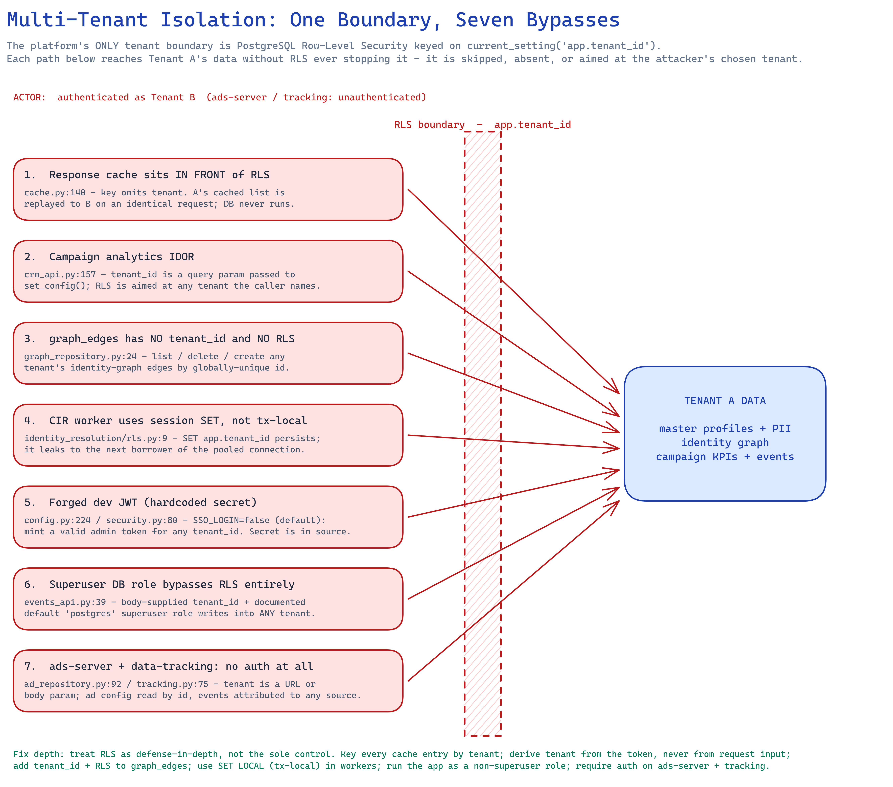
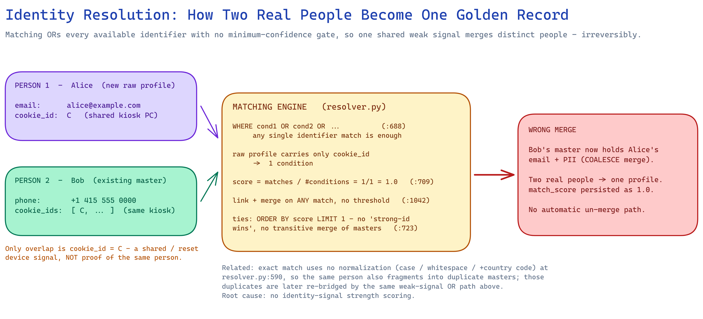
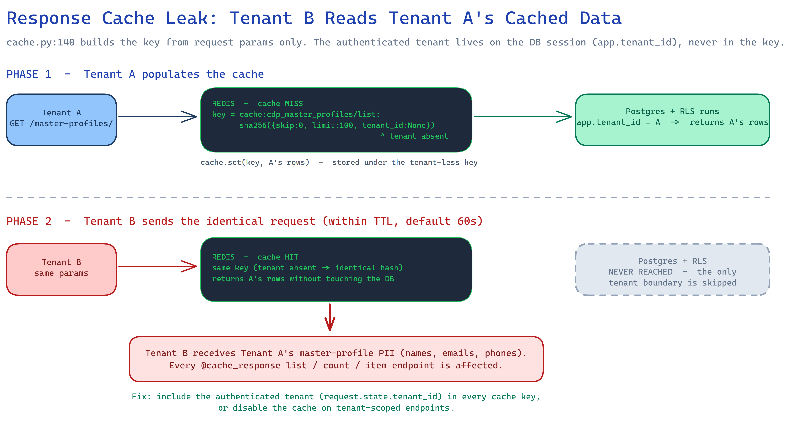

# Python Services Code Review — LEO Customer 360

**Date:** 2026-09-05
**Scope:** All Python code services in this repository (~37,000 lines across 7 services)
**Method:** Maximum-recall, multi-angle review (10 finder angles per service, run in parallel, then per-finding verification against the source and DB schema). See [Methodology](#methodology--scope).

> This review prioritizes **recall** — surfacing every real bug. Findings are grouped by
> severity and each carries a file/line, a concrete failure scenario, and a fix. The three
> Excalidraw diagrams under [`diagrams/`](diagrams) explain the most important systemic problems visually.

---

## 1. Executive summary

The platform is a **multi-tenant** Customer Data Platform. Its README states tenant isolation
is a core guarantee ("strict `tenant_id` filtering on all operations"), and the database
implements this with **PostgreSQL Row-Level Security (RLS)** keyed on
`current_setting('app.tenant_id')`.

**The single most important finding of this review is that this one tenant boundary is
bypassable in at least seven independent ways.** Because RLS is the *only* enforced boundary,
each bypass is a direct cross-tenant data breach — of PII, the identity graph, campaign
analytics, or event streams. On top of that, the identity-resolution engine (the heart of a
CDP) can merge two different real people into one "golden record" irreversibly.

| Severity | Count | Examples |
|---|---:|---|
| 🔴 **Critical** | 6 | Response cache leaks PII across tenants; `graph_edges` has no tenant isolation; campaign-analytics IDOR; forged dev-JWT auth bypass; identity over-merge; CIR worker RLS leak across pooled connections |
| 🟠 **High** | 13 | Keycloak TLS verification off by default; admin authz disabled when SSO off; unauthenticated event ingestion; ingestion OOM; analytics permanent undercount; segment-rule SQL tautology |
| 🟡 **Medium** | 25 | Ads served past flight/budget; timing-unsafe root password; privilege escalation on user CRUD; pipeline runaway recompute; persona/centroid drift; non-idempotent event writes |
| ⚪ **Low** | 18 | Wildcard CORS; non-atomic lockout counter; naive datetimes; misnamed Dagster job; unbounded Redis keys |
| **Total** | **62** | |

**Dominant themes** (see [Cross-cutting themes](#4-cross-cutting-themes)):
1. RLS is treated as the *sole* control instead of defense-in-depth — and it is bypassed everywhere.
2. Tenant identity is repeatedly taken from **caller input** (query param, body, header) instead of the authenticated token.
3. "Dev mode" (`SSO_LOGIN=false`, the **default**) silently disables authentication and authorization.
4. Identity resolution has no confidence gating or identifier normalization, corrupting the golden record.
5. Caches and pipelines sit *in front of* the security/consistency boundary and skip it on the hot path.

---

## 2. Priority remediation roadmap

Fix in this order — the first five are exploitable cross-tenant data breaches that need no special access.

| # | Action | Findings |
|---|---|---|
| 1 | Add the authenticated tenant to **every** response-cache key (or disable caching on tenant-scoped routes). | [C1](#c1) |
| 2 | Add `tenant_id` + RLS to `graph_edges`; scope every `GraphRepository` query. | [C2](#c2) |
| 3 | Derive tenant from the **token**, never from a query param/body/header; reject requests where they disagree. | [C3](#c3), [H4](#h4), [M4](#medium-findings), [M6](#medium-findings) |
| 4 | Remove the hardcoded dev-JWT secret; refuse to boot with a default secret; make `SSO_LOGIN=false` fail-closed for authz. | [C4](#c4), [H2](#h2), [H3](#h3) |
| 5 | In the CIR worker, use transaction-local `SET LOCAL` / `set_config(...,true)`; run the app as a **non-superuser** DB role and rely on `FORCE RLS`. | [C6](#c6), [M7](#medium-findings) |
| 6 | Rework identity matching: gate merges on an identifier-strength confidence score, normalize email/phone, add transitive-merge + deterministic tie-breaks. | [C5](#c5), [H1](#h1), [H10](#h10), [H11](#h11), [M13](#medium-findings) |
| 7 | Make ingestion + analytics idempotent and bounded; add auth to `data-tracking-api` and `ads-server`. | [H5](#h5), [H6](#h6), [H7](#h7), [H8](#h8), [M21](#medium-findings) |

---

## 3. Visual explanations

### 3.1 One tenant boundary, seven bypasses  🔴

The platform's only tenant boundary (PostgreSQL RLS) is skipped, absent, or aimed at the
attacker's chosen tenant in seven independent code paths.

### 3.2 Identity resolution: how two real people become one golden record  🔴

Matching ORs every available identifier with **no minimum-confidence gate**, so a single
shared weak signal (a kiosk cookie) merges distinct people — irreversibly.

### 3.3 Response cache cross-tenant leak (sequence)  🔴

The cache key is built from request params only; the authenticated tenant lives on the DB
session and is never in the key, so Tenant B replays Tenant A's cached PII.

> The `.excalidraw` sources are in [`diagrams/`](diagrams) and can be opened/edited at excalidraw.com.

---

## 4. Cross-cutting themes

- **RLS as a single point of failure.** `app.tenant_id` RLS is correct at the DB layer (FORCE
  RLS + `WITH CHECK`), but every layer above it either bypasses it (cache), disables it
  (superuser role), points it at the wrong tenant (caller-supplied `tenant_id`), or forgets it
  (`graph_edges` has no `tenant_id`). Isolation must be enforced independently at the
  application layer too.
- **Trusting caller-supplied identity.** `crm_api` (query param), `events_api`/create routes
  (body), and the auth middleware (X-Tenant-Id header, dev mode) all take the tenant from the
  request instead of the verified token.
- **Dev defaults that fail open.** `SSO_LOGIN=false` is the default and it early-returns from
  `require_admin`, the analytics permission check, and segment-seed checks; the dev-JWT secret
  is hardcoded in source; Keycloak TLS verification defaults off. Any of these turns a demo
  default into a production breach.
- **Hot paths that skip the boundary.** The response cache returns before RLS runs; the
  analytics job commits Redis counters before the durable Postgres total; ingestion validates
  size after the whole body is parsed. Each optimizes latency at the cost of correctness/safety.
- **IP-based rate limiting behind a proxy.** Three services key limits on
  `request.client.host`, which is the load-balancer IP in production — collapsing all clients
  into one bucket (DoS) and defeating per-client throttling.

---

## 5. Detailed findings

### 🔴 Critical

#### C1 — Response cache leaks data across tenants
- **Where:** `customer360-api/core/cache.py:140`, wired by `customer360-api/core/routers/_generic.py:44-51`
- **What:** `cache_response` builds the Redis key only from primitive request kwargs
  (`_CACHEABLE_PARAM_TYPES`). The `Session` (which carries the token's tenant via
  `app.tenant_id`) is excluded, and the optional `tenant_id` query param defaults to `None`.
  The cache sits *in front of* the DB, so on a hit RLS never runs.
- **Scenario:** Tenant A calls `GET /api/v1/master-profiles/` → RLS returns A's rows → cached
  under `hash({skip:0, limit:100, tenant_id:None})`. Tenant B issues the identical request →
  same key → **cache HIT → B receives A's master-profile PII**. Affects every
  `@cache_response` list/count endpoint (identity, crm, events, relations, content, persona,
  reporting) and item-by-UUID endpoints. *(Independently reported by two review passes.)*
- **Fix:** Include `request.state.tenant_id` in every cache key; or disable caching on
  tenant-scoped routes. Namespace `invalidate_prefix` per tenant too.

#### C2 — `graph_edges` has no tenant column and no RLS
- **Where:** `customer360-api/core/repositories/graph_repository.py:24`; schema
  `database-init/database-schema.sql:2533` (verified: only `from_id`/`to_id`, no `tenant_id`;
  absent from every RLS migration).
- **What:** The identity-graph edge table is not tenant-scoped at the DB layer, and
  `GraphRepository` list/get/delete/create issue no tenant filter.
- **Scenario:** Any authenticated user of any tenant calls `GET /api/v1/graph-edges/` and
  receives **every tenant's** edges (`from_id`/`to_id`/keywords/metadata/embedding), or
  `DELETE /api/v1/graph-edges/{id}` to destroy another tenant's relationship, or POSTs
  unscoped edges. Cross-tenant read, enumeration, and tampering of the identity graph.
- **Fix:** Add `tenant_id UUID NOT NULL` to `graph_edges` (+ partitions), enable/force RLS with
  the standard `tenant_policy`, and scope all `GraphRepository` queries.

#### C3 — Campaign-analytics IDOR (tenant from query param)
- **Where:** `customer360-api/core/routers/crm_api.py:157` →
  `customer360-api/core/repositories/campaign_repository.py:38-43`
- **What:** `get_campaign_summary`/`list_campaign_metrics`/`get_spend_trend`/`get_top_campaigns`
  take `tenant_id: uuid.UUID = Query(...)` and pass it to `CampaignRepository`, whose
  `_set_tenant_context()` runs `set_config('app.tenant_id', :tid, true)` with that
  caller-supplied value — overriding the token tenant. There is no check that the query
  `tenant_id` equals `request.state.tenant_id`.
- **Scenario:** A user from Tenant A calls
  `GET /api/v1/campaigns/analytics/summary?tenant_id=<Tenant B UUID>` and receives **Tenant B's**
  spend/revenue/campaign metrics. Works even with a correctly hardened RLS role, because the
  app itself aims RLS at the attacker's tenant.
- **Fix:** Ignore any body/query tenant for scoping; derive it from the token.

#### C4 — Hardcoded dev-JWT secret → full auth bypass in default mode
- **Where:** `customer360-api/core/config.py:224` (`dev_jwt_secret` default
  `"dev-insecure-secret-change-me-please-32b"`), `customer360-api/core/utils/security.py:80`
  (`jwt.decode(token, settings.dev_jwt_secret, ...)`).
- **What:** When `SSO_LOGIN=false` (the **default**), the middleware accepts any HS256 token
  signed with `dev_jwt_secret`, trusting its `tenant_id`/`user_id`/`roles` verbatim. The
  fallback secret is in source and there is no refusal-to-boot on the default.
- **Scenario:** Attacker forges `{"tenant_id":"<victim>","user_id":"x","roles":["admin"]}`
  signed with the known default → authenticated as any tenant with admin rights, no
  credentials. *(Independently reported by two review passes.)*
- **Fix:** No hardcoded default; fail startup if `SSO_LOGIN=false` and the secret is unset or
  equals the sample. Prefer disabling dev tokens outside dev entirely.

#### C5 — Identity resolution over-merges distinct people
- **Where:** `backend-system/identity_resolution/identity_resolution/resolver.py:688` (OR of all
  conditions) and `:1042-1050` (link + merge on any match, no threshold).
- **What:** `_find_master_profile` ORs every identifier the raw profile happens to carry
  (email, phone, **and weak signals like `device_id`/`advertising_id`/`cookie_id`**, all seeded
  as active exact rules). A match on any single one links + COALESCE-merges PII, with no
  minimum-confidence gate.
- **Scenario:** A raw profile whose only identifier is `cookie_id=C` (a shared kiosk/family
  browser, or a reset+reissued cookie) equal to Bob's master is linked to Bob and its PII
  merged in. **Two different real people become one golden record.** No automatic un-merge.
- **Fix:** Score matches by identifier strength and require a minimum confidence for auto-merge;
  route weak-signal-only matches to review. See diagram 3.2.

#### C6 — CIR worker sets RLS tenant with session `SET`, leaking across pooled connections
- **Where:** `backend-system/identity_resolution/identity_resolution/rls.py:9`
  (`cursor.execute("SET app.tenant_id = %s", (value,))`); same pattern in
  `backend-system/analytics/source_analytics/tracking_log_aggregation.py:65` and
  `backend-system/segmentation/segmentation/rls.py:9`.
- **What:** `SET` is **session-scoped**, not transaction-local. The schema explicitly prescribes
  tx-local `set_config('app.tenant_id', t, true)` (`database-schema.sql:2925`), which
  `customer360-api` correctly uses. `run_resolution_batch` commits leaving `app.tenant_id`
  pinned to the last tenant processed.
- **Scenario:** With a connection pool (the resolver's docstring allows a "pool checkout"), the
  next borrower that relies on RLS reads/writes the **previous tenant's** rows → cross-tenant
  identity leak/corruption.
- **Fix:** Use `SET LOCAL` / `set_config(..., true)` and reset context on connection return.

---

### 🟠 High

**H1 — Wrong-master merge + no transitive merge.** `resolver.py:723` — when a raw profile
bridges two masters, `ORDER BY score DESC LIMIT 1` breaks exact ties arbitrarily (no
"strong-identifier wins"), so PII can be written to the wrong master; the two pre-existing
masters are never merged, leaving identities fragmented even in the correct case.

**H2 — Keycloak introspection disables TLS verification by default.** `auth.py:91` uses
`ssl._create_unverified_context()` when `keycloak_verify_ssl` is false (the config default). An
on-path attacker returns `{"active":true, ...}` for any bearer token → auth bypass / identity
spoofing in SSO/prod.

**H3 — Admin authorization disabled when `SSO_LOGIN=false`.** `auth.py:436` — `require_admin`
returns immediately (no role check) in the default non-SSO mode; same early-return in
`analytics_api.py:50` (`_enforce_analytics_permissions`) and segment seed/recompute checks. Any
valid dev token can perform admin-only actions (delete data sources, trigger recompute, run
cross-tenant analytics).

**H4 — Unauthenticated event ingestion, tenant from body.** `data-tracking-api/core/routers/tracking.py:75`
— `POST /tracking/logs` has no auth dependency and trusts `data_source_id` from the body to
select the tenant bucket + session cache. Any caller writes fabricated events into a victim
tenant's `data-tracking-<uuid>` bucket → cross-tenant event mis-attribution / poisoning.

**H5 — Ingestion OOM (size guard runs after full body parse).** `tracking.py:48` — the
`max_events_per_request`/413 check runs *inside* the handler, after FastAPI/Pydantic has already
materialized the entire `events` list into RAM; no request-body cap is configured. A single huge
POST balloons worker RSS and OOM-kills it, dropping all in-flight requests.

**H6 — Empty-string identity 422-drops the whole batch.** `data-tracking-api/core/schemas.py:12-13`
— `session_id`/`user_id` are `str | None` with `min_length=1`, so a very common empty-string
value (before a session is established) is **not** `None`, fails validation, and rejects the
entire batch of events. Use `min_length=1` only via a validator that treats `""` as `None`.

**H7 — ads-server read endpoints have no auth and no tenant scope.** `ads-server`: `GET /ads/{ad_id}`
→ `ad_repository.py:92` filters only `ad_id` + `status`; `GET /placements/{placement_key}` →
`placement_repository.get_active_by_key` defaults `tenant_id=None` (no filter). No auth exists on
the service. Any client enumerates sequential `ad_id`s to read every tenant's ad config
(campaign/creative/targeting/`metadata_`), and reads any tenant's placement by key.

**H8 — Analytics permanently undercounts on retry.** `tracking_log_aggregation.py:394` — per-object
Redis checkpoints + `HINCRBY` commit immediately, but the durable
`sys_data_source.total_tracked_event` is written **once after the loop**. A transient failure +
`RetryPolicy` retry resumes after the saved cursor, so already-checkpointed objects are never
re-listed and their counts never reach Postgres → the durable per-source total is silently wrong
forever.

**H9 — Segment-rule denylist allows a SQL tautology.** `segmentation/segmentation/recompute.py:111`
— `_is_safe_where_fragment` blocks `;`, comments, and DML/DDL keywords but **not parentheses**. A
stored `sql_rules` value like `email IS NOT NULL) OR (1=1` yields
`... AND (email IS NOT NULL) OR (1=1)`; since `AND` binds tighter than `OR`, it matches every row,
defeating both the `status_code` and `tenant_id` filters (and, without FORCE RLS, enumerates other
tenants' profile IDs). Use an allowlist parser, not a denylist.

**H10 — `match_score` is normalized by the number of conditions present.** `resolver.py:709` —
`score = matches / len(conditions)` where `conditions` depends on which fields the raw profile
happens to have. A lone `cookie_id` match scores `1/1 = 1.0` — a "perfect" match with zero
corroboration — so `match_score` can't distinguish a 1-of-1 weak hit from a 3-of-3 strong hit and
is useless as a confidence gate.

**H11 — Configured matching columns are silently dropped (or crash if added).** `resolver.py:77` —
`RAW_PROFILE_COLUMNS` omits `address_line1`/`city`/`postal_code`/`country`/`company_name`, which
`init-core-database.sql` marks as active identity-resolution rules (the only fuzzy rules). They
never fire, so configured keys are ignored and admins see no effect. If a maintainer "fixes" it by
selecting them, `_build_match_condition` emits `similarity(city, ...)`/`city = %s` against
`cdp_master_profiles` where those are **not** columns (address is JSONB) → every batch throws.

**H12 — Concurrent CIR runs double-process staging rows.** `resolver.py:998` fetches
`status_code=1` rows with no `FOR UPDATE SKIP LOCKED`, and `_create_master_and_link` inserts the
link with no `ON CONFLICT`; the Dagster sensor (`identity_resolution/dagster_defs.py:103`) yields
`RunRequest()` every 30s with no `run_key`/in-flight guard. If a drain exceeds the interval, two
runs process the same rows → duplicate masters, then a `UNIQUE(tenant_id, raw_profile_id)`
violation rolls back the **entire** multi-tenant batch.

**H13 — IP rate limiting ignores `X-Forwarded-For`.** `customer360-api/core/auth.py:60` &
`auth_api.py:50`, and `data-tracking-api/core/redis_cache.py:96` all key on
`request.client.host`. Behind an ingress/LB that is the proxy IP for everyone: one abuser trips
the shared counter and 429/401s all legitimate users (DoS), while real per-client throttling never
engages. Parse a trusted `X-Forwarded-For`.

---

### 🟡 Medium findings

| ID | Location | Issue | Impact |
|---|---|---|---|
| M1 | `ads-server/repository/ad_repository.py:258` | Serving query checks only `a.status='active'`; no campaign/creative status, flight window (`starts_at`/`ends_at`), or budget | Serves paused/expired/out-of-flight ads |
| M2 | `ads-server/repository/ad_repository.py:267` | No-ad fallback selects tenant's top ads across **all** placements, ignoring `placement_id` | Wrong-placement creative served into the slot |
| M3 | `customer360-api/core/routers/auth_api.py:143` | Root-admin password compared with `==` (not `hmac.compare_digest`) | Timing side-channel on the highest-value account |
| M4 | `customer360-api/core/routers/metadata_api.py:63` | `GET /metadata/domains` filters by caller `tenant_id`; `sys_tenant_domain` has no RLS | Cross-tenant enumeration of enabled domains |
| M5 | `customer360-api/core/routers/user_api.py:232` | `create/update/delete_user` require only an ACTIVE user, no admin role | Intra-tenant privilege escalation / hard-delete of other users |
| M6 | `customer360-api/core/routers/events_api.py:39` | Create routes take `tenant_id` from body, no check vs token | Cross-tenant writes if DB role bypasses RLS (default `postgres` superuser) |
| M7 | `backend-system/analytics/.../tracking_log_aggregation.py:128` | `fetch_data_sources` has no explicit `tenant_id` predicate, relies solely on RLS | One misconfigured GRANT → cross-tenant enumeration / duplicate processing |
| M8 | `.../tracking_log_aggregation.py:139` | Single global `LIMIT` across all tenants (default 10) | Only the 10 lexicographically-smallest sources are ever aggregated; tenants starved |
| M9 | `.../tracking_log_aggregation.py:286` | Per-object checkpoint keys created with SETNX, **no TTL** | Unbounded Redis growth; eviction re-enables double-counting |
| M10 | `backend-system/segmentation/dagster_defs.py:133` | Recompute bumps `updated_at`; the sensor triggers on `updated_at` changes | Self-retriggering → runaway back-to-back full recomputes (esp. time-relative rules) |
| M11 | `backend-system/identity_resolution/.../persona_engine.py:1045` | Centroid running-mean assumes +1 member per upsert, but masters are re-resolved every batch | Centroids drift toward frequently-active profiles |
| M12 | `.../persona_engine.py:555` | `compute_financial_score(clv_reference=GLOBAL_DEFAULT)` binds the global as a default arg at import | Runtime `cdp_persona_config` override of CLV reference silently no-ops |
| M13 | `.../resolver.py:590` | Email/phone matched with no normalization (case/whitespace/`+country`) | Duplicate masters for the same person; later re-bridged by weak signals |
| M14 | `.../trigger_controller.py:105` | Zero-profile run returns before `commit()`, leaving the throttle UPDATE + `FOR UPDATE` lock open | Every other worker's `FOR UPDATE NOWAIT` fails → throttle starvation |
| M15 | `.../resolver.py:1067` | Whole multi-tenant batch is one transaction, committed once at the end | One poison-pill profile rolls back all tenants' work; re-fails next run → platform stall |
| M16 | `customer360-api/core/repositories/user_repository.py:203` | User-cache eviction happens on flush, **before** the router's `db.commit()` | Concurrent read repopulates cache with stale/uncommitted data for the TTL (~120s) |
| M17 | `customer360-api/core/cache.py:93` | `json.loads(raw)` is outside the `RedisError` try/except | A corrupt/poisoned cache value raises → 500 on every hit, defeating fail-open |
| M18 | `data-tracking-api/core/redis_cache.py:100` | Two synchronous Redis calls per ingest with 0.5s timeouts; fail-open still pays the timeout | Redis outage adds ~1s/req in the sync threadpool → saturation, dropped events |
| M19 | `data-tracking-api/core/service.py:59` | Batch `session_id` overrides per-event id for **counting**, but storage keeps per-event id | Session counters permanently diverge from durable event data |
| M20 | `data-tracking-api/core/storage.py:106` | `_ensure_bucket` does a `head_bucket` every request; any non-404 (e.g. 403) is fatal | Doubles S3 latency; spurious 503 → whole batch dropped when PutObject would succeed |
| M21 | `data-tracking-api/core/storage.py:38` | Object key is `uuid4()`; no idempotency key | Client retry after a 503 writes a duplicate object → double-counted events |
| M22 | `backend-system/personalization/dagster_defs.py:33` | Copy-paste: job defined as `@job(name="scoring_job")` | No `personalization_job` exists; submissions fail; two identical `scoring_job`s in Dagit |
| M23 | `frontend-admin/app.py:135` | `tenant_id = TENANT_ID or cookie or header`, but `TENANT_ID` always defaults to a hardcoded UUID | Per-request cookie/header tenant switching silently never works |
| M24 | `backend-system/scripts/migrate_dagster_sqlite_to_postgres.py:99` | Drops the `id` column, `fetchall()`s whole tables, one transaction, no per-table try/except | Re-numbered event-log ids break sensor cursors; OOM / all-or-nothing abort on large history |
| M25 | `ads-server/repository/ad_repository.py:397` | Tracking rows collapsed into `{f"{event_type}Url": ...}` | Multiple endpoints per event type → all but the last silently dropped (missing pixels) |

### ⚪ Low findings

| ID | Location | Issue |
|---|---|---|
| L1 | `customer360-api/core/routers/_generic.py:53` | Pagination `skip`/`limit` lack `ge=` bounds → negative values reach OFFSET/LIMIT → 500 (repeated across routers) |
| L2 | `customer360-api/core/utils/sql_safety.py:96` | `validate_sql_where_fragment` is a denylist; permits expensive built-ins (e.g. `repeat(md5(...))`) → CPU-bound DoS per scanned row |
| L3 | `customer360-api/core/utils/rate_limiter.py:50` | `INCR` then separate `EXPIRE` (only when count==1); a crash between them leaves a no-TTL key → permanent lockout (fails closed) |
| L4 | `customer360-api/core/auth.py:113` | Introspection cache TTL floored at 60s and never re-checks `exp`/`active` → token honored up to ~60s past expiry / revocation |
| L5 | `ads-server/repository/ad_repository.py:65` | `_session()` builds a new `sessionmaker` (and re-imports it) on every call → per-request overhead on the serving path |
| L6 | `ads-server/repository/ad_repository.py:322` | `_placement_dimensions`: `max_width_px or 300` treats a legitimate 0 as missing; fixed branch omits the `responsive` key |
| L7 | `ads-server/core/application.py:291` | `get_ad`/`get_placement` return `None` on miss → HTTP 200 `null` instead of 404 |
| L8 | `ads-server/core/application.py:176` | CORS `allow_origins=["*"]` (amplifies the un-scoped read endpoints H7) |
| L9 | `ads-server/repository/ad_repository.py:228` | Placement resolution `... LIMIT 1` with no `ORDER BY` → non-deterministic which placement wins |
| L10 | `ads-server/repository/ad_repository.py:227` | Serving joins tenant on `tenant_key` only; no `tenant.status` check → suspended tenants keep serving |
| L11 | `ads-server/repository/ad_cache_utils.py:1` | File is only TODO comments — the documented Redis caching/TTLs don't exist; config TTLs unused and mismatched (60 vs 300/3600) |
| L12 | `data-tracking-api/core/routers/tracking.py:20` | `get_storage`/`get_protection` lazily assign module singletons with no lock → cold-start race leaks a client |
| L13 | `data-tracking-api/app.py:47` | `cdp-event-proxy.html` route registered unconditionally (unlike guarded static mounts) → 500 if the file is absent |
| L14 | `all-data-simulator/google_analytics_faker.py:20` | `event_time` from naive `datetime.now()` emitted tz-less → mis-bucketed by host offset downstream |
| L15 | `all-data-simulator/adjust_faker.py:401` | `MEDIA_SOURCE_CONFIG[campaign.media_source]` bare subscript on LLM output → `KeyError` crashes the run (also `:365`, `:459`) |
| L16 | `backend-system/scripts/render_dagster_instance.py:68` | `s3_ready()` probes with `MINIO_ROOT_*`, but the rendered `S3ComputeLogManager` relies on `AWS_*` → probe passes, runtime upload fails |
| L17 | `deployments/sso/bootstrap-realm.py:67` | One admin token fetched once, reused across 20+ calls whose statuses are unchecked → silent partial realm provisioning on token expiry |
| L18 | `.../persona_engine.py:194` | `apply_persona_config` mutates ~40 module-level globals shared across instances → not thread-safe if resolutions run concurrently in-process |

---

## 6. Per-service coverage

| Service | Files | ~LOC | Findings (C/H/M/L) |
|---|---:|---:|---|
| `customer360-api` | 91 | ~9,700* | C1–C4 · H2,H3,H13 · M3–M6,M16,M17 · L1–L4 |
| `backend-system/identity_resolution` | — | 8,411 | C5,C6 · H1,H10,H11,H12 · M11–M15 · L18 |
| `ads-server` | 22 | 3,809 | H7 · M1,M2,M25 · L5–L11 |
| `data-tracking-api` | 12 | 1,334 | H4,H5,H6 · M18–M21 · L12,L13 |
| `backend-system/analytics` | — | 732 | H8 · M7–M9 |
| `backend-system/segmentation` | — | 627 | H9 · M10 |
| `backend-system` (other Dagster + scripts) | — | ~475 | M22,M24 · L16 |
| `all-data-simulator` | 5 | 1,376 | L14,L15 |
| `deployments` + `frontend-admin` | 4 | 653 | M23 · L17 |

\* excludes the vendored `.venv`.

---

## 7. Methodology & scope

- **Scope:** every `*.py` under `ads-server/`, `all-data-simulator/`, `backend-system/`,
  `customer360-api/` (excluding `.venv`), `data-tracking-api/`, `deployments/`, `frontend-admin/`.
  Tests were read for context but are not the review target.
- **Approach:** the code was partitioned across six parallel reviewers, each applying ten
  finder angles (line-by-line, removed-behavior, cross-file caller/callee, language pitfalls,
  wrapper/proxy correctness, reuse, simplification, efficiency, altitude, conventions) with an
  explicit focus on this platform's risk profile: **tenant isolation, SQL safety, auth, async
  correctness, and identity-matching correctness**.
- **Verification:** headline findings were confirmed directly against the source and the DB
  schema (RLS policies, `graph_edges` definition, `set_config` call sites). Findings are reported
  in recall mode — a plausible, mechanism-grounded issue is surfaced rather than dropped on
  uncertainty.
- **Not covered:** runtime/dynamic testing, dependency-vulnerability scanning, the SQL/DDL
  itself (beyond what bears on the Python), and non-Python code (JS widgets, shell, YAML).
- **No repository-level `CLAUDE.md`** governs the changed code, so no convention-specific
  findings are raised.

### A note on severity
Severity reflects exploitability + blast radius for a multi-tenant CDP holding PII. Cross-tenant
data exposure and irreversible golden-record corruption are treated as the most severe. Several
issues are gated behind deployment choices (`SSO_LOGIN`, DB role, proxy config); where the
**default** is unsafe, the finding is rated as if that default ships.
