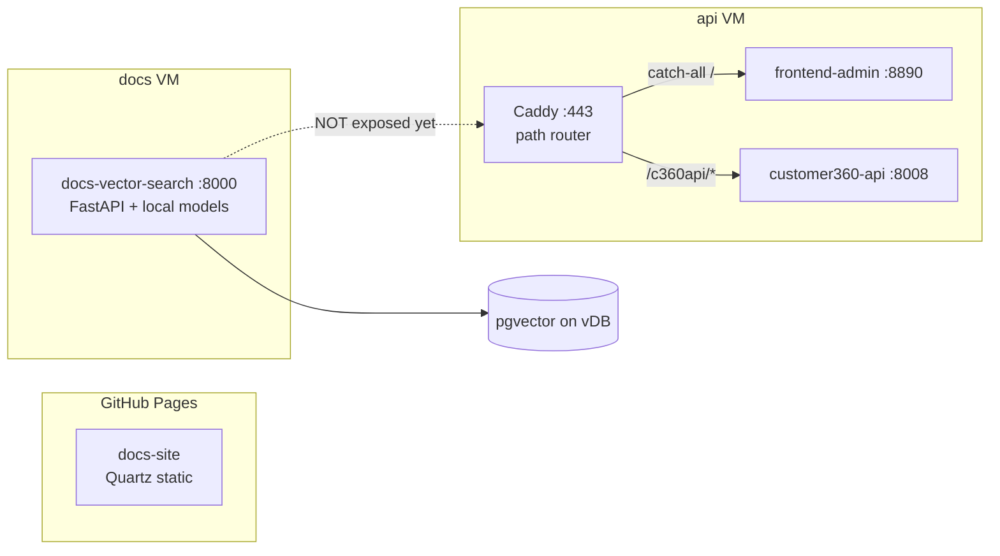
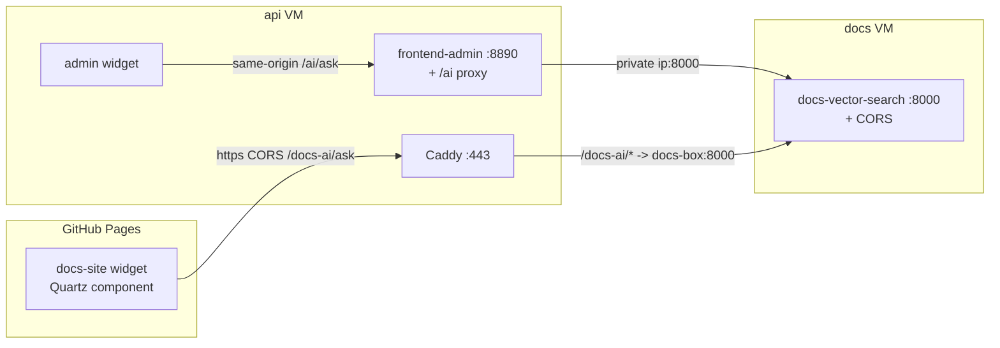

# Docs Chatbot Agent — Implementation Plan

**Date:** 2026-09-06
**Author:** Implementation planning pass
**Scope:** Add a documentation chat-bot ("Ask the Docs") agent to **`docs-site`** (public Quartz site) and **`frontend-admin`** (Customer 360 admin SPA), both consuming the RAG API served by **`tools/docs-vector-search`**.
**Status:** Plan / design — no code written yet.

> This is a build plan, not a review. It specifies the exact files to add/change in each of the
> three components, the request/response contract, the two integration paths (public vs. proxied),
> and the deployment + testing steps. Code snippets are illustrative and match the existing idioms
> of each codebase.

---

## 1. Objective

Give end users a conversational way to query the LEO Customer 360 documentation corpus, embedded in
two places:

1. **`docs-site`** — a floating "Ask the Docs" widget on every documentation page (public, GitHub Pages).
2. **`frontend-admin`** — an in-app "Docs Assistant" available across all admin tabs.

Both widgets talk to the **already-built** local-RAG service in `tools/docs-vector-search` (semantic
search + grounded question answering, fully local models, pgvector on the vDB). No new model or
retrieval code is required — this plan is about **API exposure + two front-end integrations**.

---

## 2. Current state (what already exists)

### 2.1 The search service — `tools/docs-vector-search`

FastAPI app (`src/server.py`), served by `uvicorn src.server:app --port 8000`. Models load once at
startup (warm-up in the lifespan hook); one DB connection per request.

**Endpoints (the contract we consume):**

| Method | Path | Request body | Response |
|--------|------|--------------|----------|
| `GET`  | `/health` | — | `{status, loaded_chunks, embed_model, rerank_model, generator}` |
| `POST` | `/search` | `{query: str, top_n?: int=20}` | `{hits: [{path, title, heading, score}]}` |
| `POST` | `/ask`    | `{question: str, top_n?: int=20, top_k?: int=5}` | `{answer, contexts: [str], sources: [{path, title, heading}]}` |

- `/search` — semantic retrieve + rerank, **no LLM generation** (fast).
- `/ask` — full RAG: retrieve → rerank → generate a grounded answer with cited `sources` (slower;
  Qwen2.5-0.5B on 1 vCPU).
- `answer` is model-generated text; `sources[].path` is the citation. `contexts` are the raw chunk
  texts the generator saw (useful for debugging / "show evidence", not usually rendered).

**The `path` field is relative to the corpus root (`docs/`), _not_ the repo root.** In the container
`CORPUS_DIR=/app/corpus` is bind-mounted from the repo's `docs/` directory
(`docker-compose.yml`: `../../docs:/app/corpus:ro`; the deploy script renames the shipped `docs/` to
`corpus/`), and `corpus.py` computes `path = file.relative_to(CORPUS_DIR)`. So a repo file
`docs/architecture/identity.md` is returned as `path = "architecture/identity.md"`. **Every
source-link mapping below must prepend `docs/`.** (See §7 for the mapping table.)

**Three gaps that drive this plan:**

1. **No CORS.** `grep -rn cors src/` → nothing; `server.py` adds no middleware. A browser on any other
   origin (GitHub Pages, or the admin app on a different host) cannot call it directly.
2. **No auth / no rate limiting.** `/ask` is an unauthenticated, CPU-bound LLM call on a 1 vCPU /
   2 GB box — a DoS foot-gun if exposed publicly as-is.
3. **No streaming.** `/ask` blocks until the full answer is generated. UX must assume a multi-second
   wait and design around it (spinner, two-phase render — see §6.4).

**Deployment:** runs on its own **"docs" VM** (`deployments/server/deploy-docs-search.sh <uat|prod>`),
pulls the CI image from GHCR, runs `enrich` on the box, serves `:8000`. **It is not publicly exposed
by default** — the deploy script ends with: *"Expose via the LB (add a 'docs' backend) if it needs
public access."* Public routing is done in Caddy (`deployments/proxy/Caddyfile`).

### 2.2 `frontend-admin` — Customer 360 admin SPA

- **Server:** FastAPI (`app.py`) that serves a **static single-page app** (`base-templates/index.html`
  + `static/`). Tailwind, jQuery, Handlebars via CDN. Server injects runtime config into the page via
  a frozen `window.C360_SERVER_CONFIG` object and Jinja placeholders (`api_base`, `tenant_id`,
  `static_base`, `cache_bust`, …).
- **JS architecture** (`static/js/`):
  - `common/config.js` → `window.C360.config`: the API client `api(path, params, method)` (hardwired
    to `customer360-api`, injects `X-Tenant-Id`/`Authorization`), plus `saveConfig`, theming, auth.
  - `common/router.js` → `window.C360.router`: a hash router. Views self-register with
    `C360.router.define(pattern, {section, tab, mount})`; **adding a view touches only that view's
    files**, never `main.js`/`router.js`.
  - `common/templates.js` → `window.C360.templates`: loads Handlebars partials from
    `static/templates/**` and exposes `render(name, ctx)` / `html(name)`.
  - `main.js`: bootstrap — loads templates, injects section shells, binds events, starts the router.
  - View modules (`profile-list-view.js`, `segments-view.js`, `placeholder-view.js`, …) — one file
    per feature, each an IIFE that attaches to `window.C360`.
- **Reverse-proxy shape:** behind Caddy the admin app is the **catch-all** (`handle { reverse_proxy
  {$FRONTEND_UPSTREAM} }`, must stay last). `FRONTEND_ROOT_PATH` defaults to `/c360`; static is mounted
  at both `/static` and `${FRONTEND_ROOT_PATH}/static`. **Because it's a real server, it can proxy the
  docs API server-side** — the recommended path for this app (no CORS, docs box stays private).

### 2.3 `docs-site` — Quartz documentation site

- **Static** site built by **Quartz v4** (`quartz.config.ts` + `quartz.layout.ts`), deployed to
  **GitHub Pages** at `https://leo-cdp.github.io/leo-customer360` by `.github/workflows/deploy-docs.yml`.
- **The Quartz engine is not vendored** — CI clones it fresh at the pinned tag (`QUARTZ_REF=v4.5.2`)
  and injects only the two `.ts` files, then runs `docs-site/collect.mjs` to mirror every repo `*.md`
  into `content/` (structure-preserving) and `npx quartz build`.
- **Consequences for us:**
  - The widget must be a **Quartz component** (or static asset) injected into the cloned engine by CI.
  - Being on GitHub Pages, it is a **different origin** from the docs API box → **CORS is mandatory**
    and **there is no server to proxy through**. The site must call the docs API's public URL directly.

### 2.4 Topology today



---

## 3. Target architecture

Two integration paths that share a common widget behaviour spec (§6.5) but differ in how they reach
the API:

- **`frontend-admin` → server-side proxy** (recommended for this app). The admin FastAPI app gains a
  thin `/ai/*` proxy that forwards to the docs service over the private network. The browser calls
  **same-origin** `/ai/ask` — no CORS, and the docs box never needs a public route. Optionally gate on
  the existing session.
- **`docs-site` → direct public call**. The docs service gets CORS + a public Caddy route
  (`/docs-ai/*`); the static site calls it directly. Protect with rate limiting (§5.3).



**Why two paths?** `frontend-admin` is a server we control end-to-end, so proxying is strictly better
(no CORS surface, no public exposure of the LLM box, reuse of session/rate-limit). `docs-site` is
static with no backend, so it must call a public endpoint — which forces CORS + rate limiting on the
service. The service changes in §5 support *both* (CORS is harmless for the proxied path).

---

## 4. API contract we build against (reference)

```jsonc
// POST /ask
// → request
{ "question": "How does identity resolution merge two profiles?", "top_n": 20, "top_k": 5 }
// → response
{
  "answer": "Identity resolution merges profiles when … [Identity Resolution]",
  "contexts": ["## Identity Resolution — Merge rules\n…", "…"],
  "sources": [
    { "path": "architecture/identity-resolution.md", "title": "Identity Resolution", "heading": "Merge rules" }
  ]
}

// POST /search
// → request
{ "query": "tenant isolation", "top_n": 8 }
// → response
{ "hits": [ { "path": "…", "title": "…", "heading": "…", "score": 0.83 } ] }

// GET /health → { "status": "ok", "loaded_chunks": 1234, "embed_model": "...", "rerank_model": "...", "generator": "..." }
```

Client assumptions:
- Treat `answer` as **untrusted text** → escape before inserting into the DOM (§6.5, security).
- `sources` may be empty or repeat the same file across headings → **de-dupe by `path`** in the UI.
- Requests can take several seconds → always send with a **timeout + AbortController**, single-inflight.

---

## 5. Service changes — `tools/docs-vector-search`

These are the smallest changes that unblock both front-ends. All are additive and backward-compatible.

### 5.1 Add CORS (required for `docs-site`)

`src/config.py` — add:

```python
# --- HTTP / CORS (browser access from the docs site / admin app) ---
# Comma-separated allowed origins. Default: the public GitHub Pages site.
CORS_ORIGINS = [
    o.strip()
    for o in os.getenv("CORS_ORIGINS", "https://leo-cdp.github.io").split(",")
    if o.strip()
]
```

`src/server.py` — add after `app = FastAPI(...)`:

```python
from fastapi.middleware.cors import CORSMiddleware
from .config import CORS_ORIGINS

app.add_middleware(
    CORSMiddleware,
    allow_origins=CORS_ORIGINS,          # exact origins; no wildcard when credentials aren't used
    allow_methods=["GET", "POST", "OPTIONS"],
    allow_headers=["content-type"],
    allow_credentials=False,             # no cookies; keeps us off the wildcard-with-credentials trap
    max_age=600,
)
```

> The frontend-admin proxy path (§6.1) is same-origin and does **not** need CORS; this is purely for
> the static docs-site. Keep `allow_origins` an explicit list — never `["*"]` on a public,
> unauthenticated, CPU-heavy endpoint.

### 5.2 Expose a public route via Caddy (required for `docs-site`)

`deployments/proxy/Caddyfile` — add a block **before** the catch-all `handle { … }`:

```caddy
  # --- docs RAG chatbot under /docs-ai. STRIPPED (handle_path): the service has no root_path
  #     of its own; the browser posts to https://{$CADDY_DOMAIN}/docs-ai/ask -> app sees /ask.
  #     $DOCS_UPSTREAM is the docs box PRIVATE ip:8000. Rate-limited (see README) — it fronts a
  #     1 vCPU LLM. ---
  handle_path /docs-ai/* {
    reverse_proxy {$DOCS_UPSTREAM}
  }
```

`deployments/proxy/deploy-caddy.sh` — resolve `DOCS_UPSTREAM` from the overlay (mirror the existing
`DATA_UP` line, e.g. `DOCS_UP="$(tfval docs_upstream "$ovl")"; DOCS_UP="${DOCS_UP:-10.100.1.X:8000}"`)
and pass it through as `DOCS_UPSTREAM` env like the other upstreams. Add `docs_upstream = "<docs-box-private-ip>:8000"` to `overlays/uat.tfvars` and `overlays/prod.tfvars`.

Public URL becomes: `https://<caddy_domain>/docs-ai/{ask,search,health}`.

### 5.3 Rate limiting / abuse protection (required before public exposure)

`/ask` runs an LLM on 1 vCPU. Pick one (or both):

- **Caddy** `rate_limit` (needs the `caddy-ratelimit` plugin in the image) — per-IP cap on `/docs-ai/*`,
  e.g. a few requests/min. Simplest operationally; documented in the proxy README.
- **In-app** — a module-level `asyncio.Semaphore(1–2)` around generation so concurrent `/ask` calls
  queue instead of thrashing, plus a small per-IP token bucket. Add `GEN_MAX_TOKENS` is already capped
  in config; keep it modest.

Also confirm the compose/deploy healthcheck still passes (it hits `/health`, unaffected).

### 5.4 Wire the new env into the deploy script

`deployments/server/deploy-docs-search.sh` — add `CORS_ORIGINS` to the base64 env file it ships
(default `https://leo-cdp.github.io`; overridable via a `DOCS_CORS_ORIGINS` env like the other
`DOCS_*` knobs).

### 5.5 (Optional, future) Streaming `/ask`

To make the wait feel shorter, add a streaming variant later: `POST /ask/stream` returning
`text/event-stream` (SSE) that yields tokens as `llama_cpp` produces them, then a final `sources`
event. Not required for v1 — the two-phase UX in §6.4 covers the latency acceptably. Note if added,
CORS must allow the SSE request and Caddy must not buffer it (`flush_interval -1`).

---

## 6. `frontend-admin` implementation

**Integration style:** server-side proxy + a **floating widget** (available on every tab), not a routed
nav tab. A floating launcher is less intrusive and keeps the docs assistant one click away everywhere.
(If a full-tab experience is later desired, the same view module can also `C360.router.define("/docs-ai", …)`.)

### 6.1 Backend proxy — `app.py`

Add an async proxy so the browser stays same-origin and the docs box stays private. Add `httpx` to
`requirements.txt`.

```python
# --- Docs RAG proxy -------------------------------------------------------------
# The browser calls same-origin /ai/*; we forward to the docs-vector-search service
# over the private network. Keeps the docs box unexposed and sidesteps CORS.
import httpx
from fastapi import Body, HTTPException

DOCS_SEARCH_URL = os.getenv("DOCS_SEARCH_URL", "http://127.0.0.1:8001").rstrip("/")
DOCS_TIMEOUT = float(os.getenv("DOCS_SEARCH_TIMEOUT", "60"))   # /ask can be slow on 1 vCPU
MAX_Q_LEN = 2000

async def _docs_post(path: str, payload: dict):
    try:
        async with httpx.AsyncClient(timeout=DOCS_TIMEOUT) as client:
            r = await client.post(f"{DOCS_SEARCH_URL}{path}", json=payload)
            r.raise_for_status()
            return r.json()
    except httpx.HTTPStatusError as e:
        raise HTTPException(status_code=e.response.status_code, detail="Docs service error")
    except httpx.HTTPError:
        raise HTTPException(status_code=502, detail="Docs service unreachable")

@app.post("/ai/ask", include_in_schema=False)
async def ai_ask(payload: dict = Body(...)):
    q = str(payload.get("question", "")).strip()
    if not q:
        raise HTTPException(status_code=422, detail="question is required")
    body = {"question": q[:MAX_Q_LEN]}
    if isinstance(payload.get("top_n"), int): body["top_n"] = payload["top_n"]
    if isinstance(payload.get("top_k"), int): body["top_k"] = payload["top_k"]
    return await _docs_post("/ask", body)

@app.post("/ai/search", include_in_schema=False)
async def ai_search(payload: dict = Body(...)):
    q = str(payload.get("query", "")).strip()
    if not q:
        raise HTTPException(status_code=422, detail="query is required")
    body = {"query": q[:MAX_Q_LEN]}
    if isinstance(payload.get("top_n"), int): body["top_n"] = payload["top_n"]
    return await _docs_post("/search", body)

@app.get("/ai/health", include_in_schema=False)
async def ai_health():
    return await _docs_post("/search", {"query": "ping", "top_n": 1}) and {"status": "ok"}
```

Register the routes under the reverse-proxy prefix too, so they resolve both standalone and behind
Caddy (mirror the existing static-mount pattern):

- Because these are `@app.post` routes (not mounts), also expose them under `FRONTEND_ROOT_PATH` by
  setting the app's `root_path` (Starlette strips it for routing) **or** by adding duplicate decorators
  `@app.post(f"{FRONTEND_ROOT_PATH}/ai/ask")`. Prefer whichever matches how the app is already run
  behind Caddy (the frontend is the catch-all, so requests arrive with the full path). **Decision
  needed** — see §12.

Inject the widget's base path into the template context in the `index` handler:

```python
"docs_ai_base": f"{FRONTEND_ROOT_PATH}/ai" if FRONTEND_ROOT_PATH else "/ai",
"docs_site_base": os.getenv("DOCS_SITE_BASE", "https://leo-cdp.github.io/leo-customer360"),
```

**Auth (optional but recommended):** the docs corpus is internal. If the admin app is behind SSO,
gate `/ai/*` on the same session dependency the other authenticated routes use (fail-closed). At
minimum the proxy already hides the docs box from the public internet.

### 6.2 Config client — `static/js/common/config.js`

Add the two server-injected values to `DEFAULTS` and `getConfig()` (read from `C360_SERVER_CONFIG`),
and expose a **separate** tiny docs client (do **not** reuse `api()` — that injects tenant/auth headers
the docs proxy doesn't want and points at `apiBase`):

```javascript
// in DEFAULTS
docsAiBase: "/ai",
docsSiteBase: "https://leo-cdp.github.io/leo-customer360",

// in getConfig() return object
docsAiBase: serverConfig.docsAiBase || DEFAULTS.docsAiBase,
docsSiteBase: serverConfig.docsSiteBase || DEFAULTS.docsSiteBase,

// a minimal docs client using the browser fetch API (AbortController-friendly)
function docsAsk(question, signal) {
  return fetch(CONFIG.docsAiBase + "/ask", {
    method: "POST",
    headers: { "content-type": "application/json" },
    body: JSON.stringify({ question: question }),
    signal: signal,
  }).then(function (r) { if (!r.ok) throw new Error("HTTP " + r.status); return r.json(); });
}
// (docsSearch(query, signal) is the same shape against /search — used for the fast first-paint)

// export on C360.config
docsAsk: docsAsk,
docsSearch: docsSearch,
```

And add `docsAiBase`/`docsSiteBase` to `C360_SERVER_CONFIG` in `base-templates/index.html`:

```html
docsAiBase: "{{ docs_ai_base }}",
docsSiteBase: "{{ docs_site_base }}",
```

### 6.3 Widget module — `static/js/docs-chatbot-view.js` (new)

An IIFE matching the existing view pattern. Responsibilities: render the launcher + panel, bind events,
manage conversation state, call `C360.config.docsAsk`, render answers + de-duped clickable sources.

```javascript
/* Customer 360 Admin — Docs Assistant (RAG chatbot).
 * Floating widget available on every tab. Calls the same-origin /ai proxy
 * (app.py) which forwards to tools/docs-vector-search. */
window.C360 = window.C360 || {};
(function (C360) {
  "use strict";
  var inflight = null;   // single AbortController — one question at a time

  function sourceUrl(path) {                 // path is relative to docs/  →  see §7
    var slug = String(path).replace(/\.md$/i, "").replace(/\/README$/i, "/");
    return C360.config.current.docsSiteBase + "/docs/" + slug;
  }
  function esc(s) { return $("<div>").text(String(s == null ? "" : s)).html(); }

  function dedupeSources(sources) {
    var seen = {}, out = [];
    (sources || []).forEach(function (s) {
      if (s && s.path && !seen[s.path]) { seen[s.path] = 1; out.push(s); }
    });
    return out;
  }

  function ask(question) {
    if (inflight) inflight.abort();
    inflight = new AbortController();
    renderPending(question);
    C360.config.docsAsk(question, inflight.signal)
      .then(function (res) { renderAnswer(res); })
      .catch(function (err) {
        if (err.name === "AbortError") return;
        renderError(err);
      })
      .finally(function () { inflight = null; });
  }

  // renderPending / renderAnswer / renderError update #docs-chat-log; answer text is
  // inserted via esc() (never raw .html()); sources rendered as <a target="_blank" rel="noopener">.

  function bindEvents() { /* launcher toggle, form submit, Esc to close, Enter to send */ }

  C360.docsChatbot = { bindEvents: bindEvents, ask: ask };
})(window.C360);
```

### 6.4 UX — two-phase render (recommended)

Because `/ask` is slow, fire `/search` first for an **instant** source list, then `/ask` for the
answer:

1. On submit → show the user's question + a "Searching…" state; call `C360.config.docsSearch(q)`.
2. Render the top hits as clickable sources immediately (sub-second).
3. Swap the state to "Generating answer…"; call `C360.config.docsAsk(q)`.
4. Replace with the grounded `answer`; reconcile `sources` (they'll match the search hits).

This makes the wait feel productive and gives value even if generation is slow or times out.

### 6.5 Shared widget behaviour spec (applies to both front-ends)

- **States:** idle · searching · generating · answered · error · offline (health check failed).
- **Single-inflight:** abort the previous request on a new question; never overlap LLM calls.
- **Timeout:** `AbortController` at ~60 s; show a retry affordance on timeout.
- **Sources:** de-dupe by `path`, render as links (§7), open in a new tab (`rel="noopener"`).
- **Security (XSS):** `answer`, `title`, `heading`, `path` are all inserted as **escaped text**. If
  markdown rendering of the answer is wanted, run it through a sanitizer (e.g. DOMPurify) — do **not**
  `innerHTML` raw model output.
- **Empty / "I don't know":** the agent is prompted to say it doesn't know when the corpus lacks the
  answer — render that verbatim; don't treat it as an error.
- **Accessibility:** launcher is a `<button aria-expanded>`; panel is `role="dialog"` with focus trap;
  Esc closes; the log is an `aria-live="polite"` region so answers are announced.
- **Persistence:** keep the in-session transcript in memory (optionally `sessionStorage`); no PII is
  involved but keep it client-side only.

### 6.6 Wiring into `frontend-admin` (file checklist)

| File | Change |
|------|--------|
| `requirements.txt` | add `httpx>=0.27,<1` |
| `app.py` | add `/ai/ask`, `/ai/search`, `/ai/health` proxy routes; inject `docs_ai_base` + `docs_site_base` into the index context; (optional) prefix registration |
| `base-templates/index.html` | add `docsAiBase`/`docsSiteBase` to `C360_SERVER_CONFIG`; add `<script src="{{ static_base }}/js/docs-chatbot-view.js?cb={{ cache_bust }}">` (before `main.js`); add `<div id="docs-chatbot-root"></div>` before `</body>` |
| `static/js/common/config.js` | add `docsAiBase`/`docsSiteBase` + `docsAsk`/`docsSearch` |
| `static/js/docs-chatbot-view.js` | **new** — the widget module |
| `static/templates/common/docs-chatbot.html` | **new** — Handlebars/HTML for launcher + panel |
| `static/js/common/templates.js` | register `docs-chatbot` in `SOURCE_PATHS` + `STATIC_HTML` |
| `static/js/main.js` | in `loadAll().done`: `$("#docs-chatbot-root").html(C360.templates.html("docs-chatbot"))` then `C360.docsChatbot.bindEvents()` |
| `static/css/app.css` | launcher + panel styles (Tailwind utility classes can live in the template; add any custom bits here) |

---

## 7. Source-link mapping (both front-ends)

`sources[].path` is **relative to `docs/`**. Map it to a clickable URL:

| Target | Formula | Example (`path = "architecture/identity.md"`) |
|--------|---------|-----------------------------------------------|
| **docs-site (Quartz)** | `docsSiteBase + "/docs/" + path.replace(/\.md$/, "")` | `https://leo-cdp.github.io/leo-customer360/docs/architecture/identity` |
| **GitHub source** | `https://github.com/LEO-CDP/leo-customer360/blob/main/docs/" + path` | `…/blob/main/docs/architecture/identity.md` |

Notes / edge cases:
- Quartz **slugifies** paths (transliteration, spaces → dashes, case). Repo paths under `docs/` are
  already URL-safe, so the formula is effectively identity — but **verify against a handful of real
  pages** after the docs-site builds. If mismatches appear, prefer the exact **GitHub source** link.
- `README.md` inside a folder becomes that folder's index in Quartz → map `.../README.md` → `.../`.
- The docs-site widget links **within its own site** (nice in-page navigation); the admin widget links
  **out** to the public docs-site (or GitHub) since it's a different app.

---

## 8. `docs-site` implementation

**Integration style:** a Quartz **custom component** rendered in `afterBody` on every page, calling the
public `/docs-ai/*` route directly (CORS). CI copies the component into the freshly-cloned engine.

### 8.1 Component files (new, under `docs-site/quartz-components/`)

Quartz components attach an inline script (`.beforeDOMLoaded`/`.afterDOMLoaded`, bundled by esbuild)
and scss (`.css`). Ship three files:

```
docs-site/quartz-components/
  DocsChatbot.tsx                      # the component
  scripts/docs-chatbot.inline.ts       # widget logic (fetch + DOM)
  styles/docs-chatbot.scss             # styles
```

`DocsChatbot.tsx`:

```tsx
import { QuartzComponent, QuartzComponentConstructor } from "./types"
import script from "./scripts/docs-chatbot.inline"
// @ts-ignore — scss import handled by Quartz's esbuild loader
import style from "./styles/docs-chatbot.scss"

const DocsChatbot: QuartzComponentConstructor = () => {
  const Chatbot: QuartzComponent = () => (
    <div id="docs-chatbot-root" data-api="https://leo-cdp.github.io/PLACEHOLDER"></div>
  )
  Chatbot.afterDOMLoaded = script
  Chatbot.css = style
  return Chatbot
}
export default DocsChatbot
```

`scripts/docs-chatbot.inline.ts` — vanilla TS (no jQuery on the docs site). Reads the public API base
from a constant (or the `data-api` attribute), renders the launcher + panel, does the two-phase
search→ask flow, escapes output, and maps sources to same-site links via the §7 formula:

```ts
const API_BASE = "https://<caddy_domain>/docs-ai"   // set at build; the one value to configure
// same behaviour spec as §6.5: single-inflight AbortController, timeout, escape, de-dupe sources.
```

`styles/docs-chatbot.scss` — theme-aware using Quartz's CSS variables (`--secondary`, `--light`,
`--dark`, …) so the widget matches light/dark mode automatically.

### 8.2 Register the component in the layout — `docs-site/quartz.layout.ts`

Import it directly (avoids editing the engine's `components/index.ts` barrel) and add to `afterBody`:

```ts
import DocsChatbot from "./quartz/components/DocsChatbot"

export const sharedPageComponents: SharedLayout = {
  head: Component.Head(),
  header: [],
  afterBody: [DocsChatbot()],          // was []
  footer: Component.Footer({ links: { GitHub: "https://github.com/LEO-CDP/leo-customer360" } }),
}
```

### 8.3 CI — copy the component into the cloned engine — `.github/workflows/deploy-docs.yml`

In the **"Inject project config"** step, also copy the component tree into the cloned engine so the
build sees it (the layout imports `./quartz/components/DocsChatbot`):

```yaml
- name: Inject project config
  run: |
    cp docs-site/quartz.config.ts .quartz-engine/quartz.config.ts
    cp docs-site/quartz.layout.ts  .quartz-engine/quartz.layout.ts
    # Docs chatbot component (+ its inline script and styles)
    mkdir -p .quartz-engine/quartz/components/scripts .quartz-engine/quartz/components/styles
    cp docs-site/quartz-components/DocsChatbot.tsx              .quartz-engine/quartz/components/
    cp docs-site/quartz-components/scripts/docs-chatbot.inline.ts .quartz-engine/quartz/components/scripts/
    cp docs-site/quartz-components/styles/docs-chatbot.scss     .quartz-engine/quartz/components/styles/
```

> Update `docs-site/README.md`'s **Local preview** steps with the same copy so local builds match CI.

### 8.4 Config for the public API base

The API base is baked at build time. Simplest: a constant at the top of the inline script (documented
as the single value to change per environment). If per-env is needed, have CI `sed`-replace a
placeholder using a repo/environment variable (e.g. `DOCS_AI_PUBLIC_URL`). Keep it to one knob.

### 8.5 Wiring into `docs-site` (file checklist)

| File | Change |
|------|--------|
| `docs-site/quartz-components/DocsChatbot.tsx` | **new** — component |
| `docs-site/quartz-components/scripts/docs-chatbot.inline.ts` | **new** — widget logic |
| `docs-site/quartz-components/styles/docs-chatbot.scss` | **new** — styles (theme vars) |
| `docs-site/quartz.layout.ts` | import + add `DocsChatbot()` to `afterBody` |
| `.github/workflows/deploy-docs.yml` | copy the component tree into `.quartz-engine` before build |
| `docs-site/README.md` | document the extra copy step + the API-base knob |

Prerequisite: **§5.1 CORS** (allow `https://leo-cdp.github.io`) and **§5.2 public Caddy route** must be
live, else every call fails a preflight / is unreachable.

---

## 9. Configuration matrix

| Variable | Where | Purpose | Default |
|----------|-------|---------|---------|
| `CORS_ORIGINS` | docs-vector-search (`config.py`) | Allowed browser origins | `https://leo-cdp.github.io` |
| `DOCS_CORS_ORIGINS` | `deploy-docs-search.sh` | Ships `CORS_ORIGINS` to the box | same |
| `docs_upstream` | `overlays/*.tfvars` + `deploy-caddy.sh` | Docs box private ip:8000 | — |
| `DOCS_SEARCH_URL` | frontend-admin (`app.py`) | Where the proxy forwards locally | `http://127.0.0.1:8001` |
| `DOCS_SEARCH_TIMEOUT` | frontend-admin | Proxy timeout (s) | `60` |
| `DOCS_SITE_BASE` | frontend-admin | For out-links to docs-site | `https://leo-cdp.github.io/leo-customer360` |
| `docs_ai_base` (derived) | frontend-admin index | Widget → same-origin proxy base | `${FRONTEND_ROOT_PATH}/ai` |
| `DOCS_AI_PUBLIC_URL` | docs-site CI (optional) | Public API base baked into the static widget | `https://<caddy_domain>/docs-ai` |

---

## 10. Testing plan

**Service (`docs-vector-search`):**
- Unit: CORS middleware present; preflight `OPTIONS /ask` from an allowed origin returns the right
  `Access-Control-Allow-Origin`; a disallowed origin is rejected. `/health` unchanged.
- Manual: `curl -s <box>:8000/ask -H 'content-type: application/json' -d '{"question":"What is CIR?"}'`.

**frontend-admin:**
- Unit (pytest + httpx mock): `/ai/ask` forwards body, trims/validates `question`, maps upstream 5xx →
  502, empty question → 422.
- Manual: run `uvicorn app:app`; open the app; ask a question; verify same-origin `POST /ai/ask` in the
  network tab (no CORS), two-phase render, source links resolve, error state on docs box down.

**docs-site:**
- Build: `deploy-docs.yml` build job stays green with the component injected (`npx quartz build`).
- Cross-origin: from the built site, `POST https://<caddy_domain>/docs-ai/ask` succeeds (preflight OK).
- Manual: widget appears on a page, light/dark theming matches, source links stay within the site,
  slugified paths resolve (spot-check a nested doc + a folder `README`).

**Shared behaviour:** timeout/abort path, single-inflight (rapid double-ask cancels the first), XSS
(ask nothing renders raw HTML — inject a doc chunk containing `` and confirm it's escaped),
"I don't know" passthrough.

---

## 11. Rollout sequence

1. **Service:** add CORS (§5.1) + rate limiting (§5.3); redeploy docs-vector-search
   (`deploy-docs-search.sh uat`). Verify `/health` + a manual `/ask`.
2. **frontend-admin:** ship the proxy + widget (§6). This path needs **no** public docs exposure — it
   can go out first and independently. Deploy, smoke-test in UAT.
3. **Public route:** add the Caddy `/docs-ai/*` block (§5.2) + `docs_upstream`; redeploy Caddy. Confirm
   the public URL + preflight from `leo-cdp.github.io`.
4. **docs-site:** merge the component + CI change (§8); the docs workflow builds & deploys to Pages.
   Verify the widget end-to-end.
5. Enable rate limiting monitoring; watch the docs box CPU/RAM (1 vCPU/2 GB — see the perf record in
   `deployments/docs/` / the git history) under real `/ask` load.

Steps 2 and 3–4 are independent; do 1 first (both depend on it).

---

## 12. Decisions needed (before/during build)

1. **Admin widget: floating vs. nav tab** — plan assumes floating (every tab). Confirm, or also add a
   `/docs-ai` route + "Docs" tab.
2. **Auth on `/ai/*`** — gate the admin proxy on the existing session, or leave open (it's already
   private via the proxy)? Recommend gating when SSO is on.
3. **Reverse-proxy path for `/ai/*`** — register at root, under `FRONTEND_ROOT_PATH`, or via
   `root_path`? Match however the frontend is currently mounted behind Caddy (§6.1).
4. **Public exposure of the LLM** — accept the DoS surface with rate limiting, or require a lightweight
   shared token/Turnstile on `/docs-ai/*` for the public site?
5. **Answer rendering** — plain escaped text (safe, ship first) vs. sanitized markdown (nicer, needs
   DOMPurify). Recommend text for v1.
6. **Streaming** — ship the two-phase blocking UX now (§6.4) and add SSE (§5.5) later, or invest in
   streaming up front? Recommend later.

---

## 13. Risks & mitigations

| Risk | Impact | Mitigation |
|------|--------|-----------|
| Public unauth `/ask` on 1 vCPU LLM | DoS / cost | Rate limit at Caddy + in-app semaphore (§5.3); consider a token for the public site |
| `/ask` latency (seconds, no streaming) | Poor UX | Two-phase search→ask render (§6.4); spinner; timeout+retry; SSE later |
| CORS misconfig | Docs-site calls fail | Exact-origin allow-list; test preflight in CI/manual (§10) |
| Quartz slug ≠ repo path | Broken source links | Verify against real pages; fall back to GitHub source links (§7) |
| Engine cloned fresh each CI run | Component missing at build | CI copies the component tree explicitly (§8.3); keep README preview steps in sync |
| XSS via model/answer/source text | Script injection | Escape all inserted text; sanitize if rendering markdown (§6.5) |
| Docs box not publicly routed | Docs-site widget dead | Caddy route + `docs_upstream` are a hard prerequisite (§5.2, §11) |

---

## 14. Effort estimate (rough)

| Workstream | Est. |
|------------|------|
| Service: CORS + rate limit + deploy wiring | 0.5 day |
| Caddy public route + overlays | 0.5 day |
| frontend-admin: proxy + config + widget + template + CSS | 1.5–2 days |
| docs-site: component + inline script + scss + CI + README | 1.5–2 days |
| Testing (unit + cross-origin + manual) & polish | 1 day |
| **Total** | **~5–6 days** |

The two front-ends are independent once the service change (§5.1) lands, so they can be built in
parallel.
