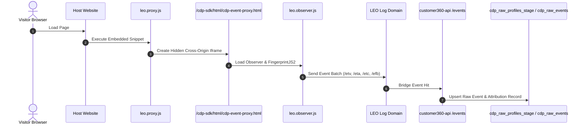

# Data Source Type 1: Web JavaScript Code (Web SDK)

## 1. Overview & Architectural Role

Data Source Type 1 represents client-side website tracking using the LEO Observer JavaScript SDK. It captures anonymous visitor behavior, browser fingerprints, navigation paths, form submissions, and identity-link events directly from user browsers.



---

## 2. Complete LeoCDP v1.0 Tracking Script

The tracking code below represents the production-standard integration snippet for LeoCDP v1.0. It initializes the observer proxy, handles UTM campaign attribution, exposes standard event tracking wrappers on `LeoObserver`, synchronizes visitor IDs across outbound cross-domain links (`&leosyn=`), and integrates with Google Analytics 4 (GA4):

```html
<script>
// (1) CDP_EVENT_OBSERVER: load JavaScript code for [Data Touchpoint]
(function() { 	
    // C360 Source ID (from sys_data_source.data_source_id)
    window.leoC360SourceId = "{{dataSourceId}}";
    
    // Default batch size of Event Tracking (10 events per flush)
    window.leoObserverBatchSize = 10;
    
    // Ingestion Log Domain and Endpoint Configuration
    window.leoObserverLogDomain = "{{leoObserverLogDomain}}"; // e.g. "beta.leocdp.com"
    window.leoObserverTrackingUri = "/data/api/v1/tracking/logs";
    window.leoObserverTrackingEndpoint = "https://" + window.leoObserverLogDomain + window.leoObserverTrackingUri;
    
    // CDN of JS
    window.leoObserverCdnDomain = "{{leoObserverCdnDomain}}";
    
    // Data Touchpoint Metadata 
    window.srcTouchpointName = encodeURIComponent(document.title);
    window.srcTouchpointUrl = encodeURIComponent(location.href);

    // Dynamic Loader for the Main Proxy CDP JS
    var leoproxyJsPath = '/data-tracking-api/static/c360-web-sdk/observer/leo.proxy.js';
    var src = location.protocol + '//' + window.leoObserverCdnDomain + leoproxyJsPath;
    var jsNode = document.createElement('script');
    jsNode.async = true; 
    jsNode.defer = true; 
    jsNode.src = src;
    var s = document.getElementsByTagName('script')[0];
    s.parentNode.insertBefore(jsNode, s);
})();

// Utility function to extract UTM query parameters from the landing URL
var parseDataUTM = window.parseDataUTM || function () {
    if (location.search.indexOf('utm_') > 0) {
        var search = location.search.substring(1);
        var json = decodeURI(search).replace(/"/g, '\\"').replace(/&/g, '","').replace(/=/g, '":"');
        return JSON.parse('{"' + json + '"}');
    }
    return {};
};
    
// (2) CDP EVENT OBSERVER: set-up all event tracking functions
var LeoObserver = window.LeoObserver || {};

// (2.1) function to track View Event "PageView"
LeoObserver.recordEventPageView = function(eventData) {
    eventData = eventData ? eventData : {};
    LeoObserverProxy.recordViewEvent("page-view", eventData);
};

// (2.2) function to track View Event "ContentView"
LeoObserver.recordEventContentView = function(eventData) {
    eventData = eventData ? eventData : {};
    LeoObserverProxy.recordViewEvent("content-view", eventData);
};

// (2.3) function to track Action Event "Logout"
LeoObserver.recordEventLogout = function(eventData) {
    eventData = eventData ? eventData : {};
    LeoObserverProxy.recordActionEvent("logout", eventData);
};

// (2.4) function to track Action Event "Search"
LeoObserver.recordEventSearch = function(eventData) {
    eventData = eventData ? eventData : {};
    LeoObserverProxy.recordActionEvent("search", eventData);
};

// (2.5) function to track View Event "ItemView"
LeoObserver.recordEventItemView = function(eventData) {
    eventData = eventData ? eventData : {};
    LeoObserverProxy.recordViewEvent("item-view", eventData);
};

// (2.6) function to track Action Event "ClickDetails"
LeoObserver.recordEventClickDetails = function(eventData) {
    eventData = eventData ? eventData : {};
    LeoObserverProxy.recordActionEvent("click-details", eventData);
};

// (2.7) function to track Action Event "SubmitContact"
LeoObserver.recordEventSubmitContact = function(eventData) {
    eventData = eventData ? eventData : {};
    LeoObserverProxy.recordActionEvent("submit-contact", eventData);
};

// (2.8) function to track Action Event "RegisterAccount"
LeoObserver.recordEventRegisterAccount = function(eventData) {
    eventData = eventData ? eventData : {};
    LeoObserverProxy.recordActionEvent("register-account", eventData);
};

// (2.9) function to track Action Event "UserLogin"
LeoObserver.recordEventUserLogin = function(eventData) {
    eventData = eventData ? eventData : {};
    LeoObserverProxy.recordActionEvent("user-login", eventData);
};

// (2.10) function to track Action Event "ShortLinkClick"
LeoObserver.recordEventShortLinkClick = function(eventData) {
    eventData = eventData ? eventData : {};
    LeoObserverProxy.recordActionEvent("short-link-click", eventData);
};

// (2.11) function to track View Event "Login"
LeoObserver.recordEventLogin = function(eventData) {
    eventData = eventData ? eventData : {};
    LeoObserverProxy.recordViewEvent("login-success", eventData);
};

// (2.12) function to track Action Event "AskQuestion"
LeoObserver.recordEventAskQuestion = function(eventData) {
    eventData = eventData ? eventData : {};
    LeoObserverProxy.recordActionEvent("ask-question", eventData);
};

// (2.13) function to track Conversion / Purchase Event
LeoObserver.recordEventConversion = function(transactionId, transactionValue, currencyCode, items, eventData) {
    eventData = eventData ? eventData : {};
    items = items ? items : [];
    LeoObserverProxy.recordConversionEvent("purchase", eventData, transactionId, items, transactionValue, currencyCode || "USD");
};

// (2.14) function to track Customer Feedback (CSAT, NPS, Survey)
LeoObserver.recordEventFeedback = function(feedbackType, feedbackData) {
    feedbackData = feedbackData ? feedbackData : {};
    LeoObserverProxy.recordFeedbackEvent(feedbackType || "submit-survey", feedbackData);
};

// (2.15) function to update customer profile identity (for CIR & Personalization)
LeoObserver.updateProfileBySession = function(profileData, extData) {
    profileData = profileData ? profileData : {};
    LeoObserverProxy.updateProfileBySession(profileData, extData);
};

// (2.16) function to get customer personalization recommendations
LeoObserver.getPersonalization = function(slotId, callback) {
    LeoObserverProxy.getPersonalization(slotId, callback);
};

// (3) CDP EVENT OBSERVER is ready callback
function leoObserverProxyReady(session) {
    // Auto-track initial page-view with marketing UTM campaign parameters
    LeoObserver.recordEventPageView(parseDataUTM());
    
    // Set tracking CDP web visitor ID (vid) into outbound cross-domain a[href] links
    LeoObserverProxy.synchLeoVisitorId(function(vid) {
        var aNodes = document.querySelectorAll('a');
        [].forEach.call(aNodes, function(aNode) {
            var hrefUrl = aNode.href || "";
            var check = hrefUrl.indexOf('http') >= 0 && hrefUrl.indexOf(location.host) < 0;
            if (check) {
                if (hrefUrl.indexOf('?') > 0) hrefUrl += ("&leosyn=" + vid);
                else hrefUrl += ("?leosyn=" + vid);
                aNode.href = hrefUrl;
            }
        });
        // Synchronize Visitor ID to Google Analytics 4 if GA4 connector hook is present
        if (typeof window.synchLeoCdpToGA4 === "function") {
            window.synchLeoCdpToGA4(vid);
        }
    });
}
                else hrefUrl += ("?leosyn=" + vid);
                aNode.href = hrefUrl;
            }
        });
        // Synchronize Visitor ID to Google Analytics 4 if GA4 connector hook is present
        if (typeof window.synchLeoCdpToGA4 === "function") {
            window.synchLeoCdpToGA4(vid);
        }
    });
}

// Track users when they click any link in the web-page
LeoObserver.addTrackingAllLinks = function() {
    setTimeout(function() {
        document.querySelectorAll('a').forEach(function(e) {
            e.addEventListener('click', function() {
                var url = e.getAttribute('href') || "";
                var data = { 'url': url, 'link-text': e.innerText };
                LeoObserver.recordEventClickDetails(data);
            });
        });
    }, 1500);
};

// Track users when they click any button in the web-page
LeoObserver.addTrackingAllButtons = function() {
    setTimeout(function() {
        document.querySelectorAll('button').forEach(function(e) {
            e.addEventListener('click', function() {
                var data = { 'button-text': e.innerText };
                LeoObserver.recordEventClickDetails(data);
            });
        });
    }, 1600);
};
</script>
```

---

## 3. Detailed Component Breakdown

### 3.1 Script Loader & Environment Globals

The self-invoking function `(function() { ... })()` configures the execution environment before asynchronously injecting `leo.proxy.min.js`:

| Configuration Variable | Default Value | Description |
| :--- | :--- | :--- |
| `window.leoC360SourceId` | `sys_data_source.data_source_id` | Unique UUID matching the target `sys_data_source` connector record. |
| `window.leoObserverBatchSize` | `10` | Buffer capacity before flushing events over HTTP. Use `1` for immediate transmission. |
| `window.leoObserverLogDomain` | `beta.leocdp.com` | Domain handling event ingestion endpoints (`/data/api/v1/tracking/logs`). |
| `window.leoObserverTrackingUri` | `/data/api/v1/tracking/logs` | Canonical ingestion URI path for tracking logs. |
| `window.leoObserverTrackingEndpoint` | `https://beta.leocdp.com/data/api/v1/tracking/logs` | Full absolute URL endpoint for event ingestion. |
| `window.leoObserverCdnDomain` | CDN Host | Origin hosting observer proxy scripts and event iframe. |
| `window.srcTouchpointName` | `document.title` | URL-encoded human-readable touchpoint name. |
| `window.srcTouchpointUrl` | `location.href` | URL-encoded current document URL. |

### 3.2 UTM Marketing Attribution (`parseDataUTM`)
Parses `utm_source`, `utm_medium`, `utm_campaign`, `utm_term`, and `utm_content` from `location.search` and passes them as JSON payload to `recordEventPageView(...)`, establishing campaign attribution for the visitor session.

### 3.3 Event Facade Methods (`LeoObserver`)
Provides high-level semantic wrappers around lower-level proxy methods:

* **View Events (`LeoObserverProxy.recordViewEvent`)**:
  - `page-view`: Standard page navigation view hit.
  - `content-view`: Article, blog post, or editorial view.
  - `item-view`: E-commerce product catalog detail view.
  - `login-success`: User authentication screen or success confirmation.
* **Action Events (`LeoObserverProxy.recordActionEvent`)**:
  - `click-details`: Interactive link, card, or button interaction.
  - `search`: Internal site search keywords.
  - `submit-contact`: Lead generation or contact form submission.
  - `register-account`: New user registration.
  - `user-login`: Login button or credentials submit.
  - `logout`: User sign-out session termination.
  - `short-link-click`: Promotional shortened URL navigation.
  - `ask-question`: Chatbot, AI assistant, or FAQ interaction.
* **Conversion Events (`LeoObserver.recordEventConversion`)**:
  - `purchase`: Complete order checkout with transaction ID, monetary value, tax, currency, and line items.
* **Feedback Events (`LeoObserver.recordEventFeedback`)**:
  - `submit-survey` / `submit-nps` / `submit-csat`: Customer sentiment and satisfaction feedback.
* **Personalization & Profile Linkage**:
  - `updateProfileBySession`: Sends customer identities (email, phone, name, loginId) for Customer Identity Resolution (CIR).
  - `getPersonalization(slotId, callback)`: Queries real-time personalized recommendations for the active visitor.

### 3.4 Lifecycle Callback (`leoObserverProxyReady`)
When the observer proxy iframe successfully initialises and resolves the visitor fingerprint:
1. It immediately invokes `window.leoObserverProxyReady(session)`.
2. Triggers initial PageView tracking enriched with UTM campaign parameters.
3. Automatically decorates cross-domain outbound links with `&leosyn=<visitorId>` to preserve customer identity across subdomains and affiliated properties.
4. Executes `window.synchLeoCdpToGA4(vid)` if Google Analytics 4 integration is defined on the page.

---

## 4. Testing & Verification Tool

An interactive browser-based testing console is available at:
👉 **[`tracking-logs-ajax-tester.html`](tracking-logs-ajax-tester.html)**

It allows you to:
1. **Send Direct Ingestion Requests**: Test `POST https://beta.leocdp.com/data/api/v1/tracking/logs` with instant schema presets for all event types.
2. **Run Live Web SDK Simulation**: Initialize the observer proxy live in-browser, track events, inspect visitor ID (`leocdp_vid`) resolution, and verify cross-domain `&leosyn=` link decoration in real time.
3. **Inspect S3 Staging Acknowledgements**: View transport latency, HTTP status codes, and durable storage partition metadata.

---

## 5. Identity Linking & Customer Resolution

To link the anonymous browser visitor with a known customer profile (e.g., upon login, order submission, or email signup), invoke `updateProfileBySession`:

```javascript
// Send identity hints to the CDP
LeoObserverProxy.updateProfileBySession({
    loginId: "USR-99281",
    email: "customer@example.com",
    phone: "+15550199",
    firstName: "Sarah",
    lastName: "Connor"
});
```

Downstream, Customer Identity Resolution (CIR) merges the temporary `cookie_id` and browser `fingerprint_hash` into the unified `cdp_master_profiles` row.

---

## 6. Deployment Instructions

### 6.1 Direct HTML Embed
Place the complete `<script>` tag directly in your website master template immediately before the closing `</head>` tag or before `</body>`.

### 6.2 Google Tag Manager (GTM)
1. In GTM, navigate to **Tags** $\rightarrow$ **New**.
2. Select **Custom HTML** as the tag type.
3. Paste the complete script from Section 2 into the HTML editor.
4. Set the trigger to **All Pages (Page View)**.
5. Save and publish the GTM container.

### 6.3 Single Page Applications (SPA: React, Vue, Next.js)
In single page applications, URL route changes do not trigger a browser page reload. Listen to router navigation events to trigger page views manually:

```javascript
// Example in Next.js router / React:
router.events.on('routeChangeComplete', (url) => {
    if (typeof LeoObserver !== 'undefined' && typeof LeoObserver.recordEventPageView === 'function') {
        LeoObserver.recordEventPageView({ 'path': url, 'title': document.title });
    }
});
```

---

## 7. Offline-to-Online QR Code Bridging

For physical retail, print collateral, packaging, and in-store signage, Type 1 sources can generate dynamic QR tracking codes stored in `sys_data_source.qr_code_data`:

```json
{
  "target_url": "https://brand.com/store/chicago",
  "tracking_url": "https://brand.com/store/chicago?utm_source=qr_retail&utm_medium=offline_touchpoint&utm_campaign=summer2026",
  "qr_code_url": "https://api.qrserver.com/v1/create-qr-code/?size=300x300&data=https%3A%2F%2Fbrand.com...",
  "generated_at": "2026-08-15T10:00:00Z"
}
```

When scanned by a mobile device, the tracking URL initiates a session with predefined campaign and touchpoint metadata, bridging offline foot traffic into the unified digital customer journey.

---

## 8. Security & Domain Controls

- **Origin Whitelisting (`data_source_hosts`)**: Enforces strict origin validation. Only domains declared in `data_source_hosts` (e.g. `["brand.com", "shop.brand.com"]`) are permitted to transmit telemetry for this `data_source_id`.
- **First-Party Cookies (`first_party_data: true`)**: The SDK operates via a first-party partitioned cookie (`_leo_vid`) on the host domain, ensuring compliance with browser tracking prevention (ITP, Privacy Sandbox).
- **Bot & Crawler Filtering**: Automatic filtering of headless browsers, bots, and crawlers via User-Agent inspection in the ingestion tier.

