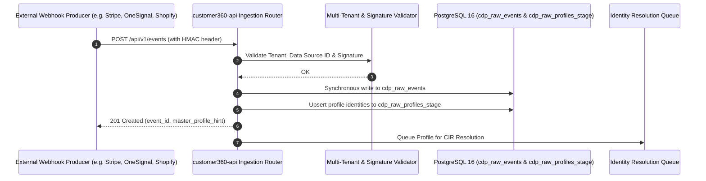

# Data Source Type 3: Data Webhook API (Server-side Push)

## 1. Overview & Architectural Role

Data Source Type 3 provides real-time, event-driven HTTP push ingestion. External platforms (e-commerce platforms, payment gateways, push notification providers, CRM systems) send HTTP POST webhook payloads directly to the Customer 360 Ingestion API as events occur.



---

## 2. HTTP Ingestion Contract

### Endpoints
- **Single Event**: `POST /api/v1/events`
- **Bulk Batch**: `POST /api/v1/events/bulk`

### Mandatory Headers

| Header | Type | Required | Description |
| :--- | :--- | :---: | :--- |
| `Content-Type` | String | **Yes** | `application/json` |
| `X-Tenant-Id` | UUID | **Yes** | Target tenant UUID matching `sys_data_source.tenant_id`. |
| `X-Data-Source-Id` | UUID | **Yes** | Target data source identifier matching `sys_data_source.data_source_id`. |
| `Authorization` | String | Conditional | `Bearer <access_token>` when SSO/JWT enforcement is enabled. |
| `X-Signature-SHA256` | String | Optional | Hex-encoded HMAC-SHA256 signature for payload verification. |

---

## 3. Payload Schema Specification

### Single Event Request Body (`POST /api/v1/events`)
```json
{
  "event_name": "order_completed",
  "event_time": "2026-09-04T12:30:00Z",
  "profile_identities": {
    "email": "customer@example.com",
    "phone_number": "+15550199",
    "external_customer_id": "CUST-84920",
    "device_id": "d-82910-fa",
    "advertising_id": "ad-38491-idfa"
  },
  "event_data": {
    "order_id": "ORD-2026-9921",
    "currency": "USD",
    "order_value": 349.50,
    "tax_amount": 27.96,
    "payment_method": "credit_card",
    "item_count": 3,
    "items": [
      { "sku": "SKU-1001", "name": "Wireless Keyboard", "price": 99.50 },
      { "sku": "SKU-1002", "name": "Ergonomic Mouse", "price": 250.00 }
    ]
  },
  "touchpoint_metadata": {
    "channel": "online_store",
    "source_url": "https://shop.brand.com/checkout/success",
    "ip_address": "198.51.100.42",
    "user_agent": "Mozilla/5.0 (Macintosh; Intel Mac OS X 10_15_7)..."
  }
}
```

### Bulk Batch Ingestion (`POST /api/v1/events/bulk`)
Accepts an array of up to 500 event objects in a single transactional request:
```json
[
  { "event_name": "email_delivered", "profile_identities": { "email": "user1@example.com" }, "event_data": { "campaign_id": "camp_01" } },
  { "event_name": "email_opened", "profile_identities": { "email": "user1@example.com" }, "event_data": { "campaign_id": "camp_01" } }
]
```

---

## 4. Webhook Security & Verification

1. **HMAC Signature Validation**:
   When `access_tokens.webhook_secret` is configured, the server computes:
   $$\text{Signature} = \text{HMAC-SHA256}(\text{Raw Payload Body}, \text{Secret})$$
   If the signature header does not match, the request is rejected with `401 Unauthorized`.
2. **Host & Source Whitelisting**:
   The ingestion router inspects the incoming producer origin against `sys_data_source.data_source_hosts`.
3. **Idempotency**:
   Clients can supply an `idempotency_key` or `transaction_id` within `event_data`. Repeated webhooks with the same key within 24 hours are safely deduplicated.

---

## 5. Implementation Examples

### cURL Example
```bash
curl -X POST "https://api.c360.example.com/api/v1/events" \
  -H "Content-Type: application/json" \
  -H "X-Tenant-Id: 11111111-1111-1111-1111-111111111111" \
  -H "X-Data-Source-Id: a3333333-3333-3333-3333-333333333333" \
  -d '{
    "event_name": "push_notification_opened",
    "profile_identities": {
      "email": "sarah.connor@example.com",
      "external_customer_id": "USR-4421"
    },
    "event_data": {
      "notification_id": "notif-991",
      "campaign": "autumn_promotion",
      "action_button": "view_deal"
    }
  }'
```
