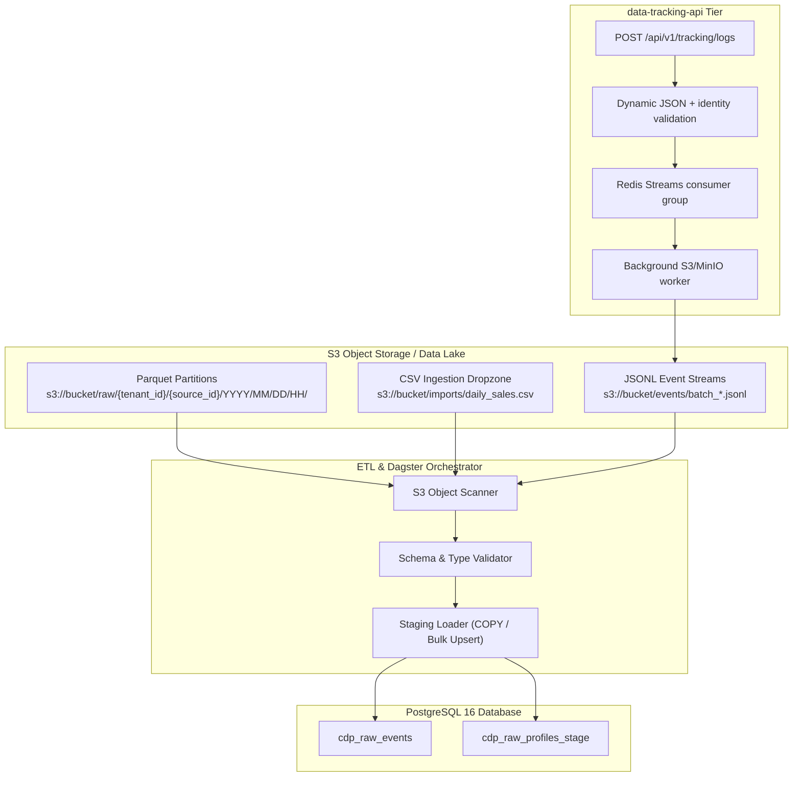

# Data Source Type 4: S3 File Connector (Batch File Processing)

## 1. Overview & Architectural Role

Data Source Type 4 provides high-throughput, file-based batch synchronization between S3-compatible cloud object storage (Amazon S3, MinIO, Google Cloud Storage, Cloudflare R2) and the Customer 360 database. It is designed for massive historical migrations, hourly transactional dumps from POS/ERP systems, and offline data lake synchronization.



---

## 2. Storage Partitioning & Path Conventions

Files ingested or staged via Type 4 connectors follow a multi-tenant, chronological partition hierarchy:

$$\text{s3://}\langle\text{bucket}\rangle\text{/raw/}\langle\text{tenant\_id}\rangle\text{/}\langle\text{data\_source\_id}\rangle\text{/YYYY/MM/DD/HH/}\langle\text{filename}\rangle$$

### Example Partition Paths
- **Parquet stream**: `s3://c360-lake/raw/11111111-1111-1111-1111-111111111111/44444444-4444-4444-4444-444444444444/2026/09/04/14/events_001.parquet`
- **CSV batch upload**: `s3://c360-lake/inbound/retail-pos/sales_20260904.csv`
- **JSONL event dump**: `s3://c360-lake/inbound/web-logs/access_20260904_1200.jsonl`

---

## 3. Supported File Formats & Schemas

### 1) Apache Parquet (`.parquet`) — Recommended
- **Compression**: Snappy or ZSTD.
- **Benefits**: Columnar compression, embedded data types, fast partition pruning, and optimal I/O for analytics.
- **Required Columns**: `event_name`, `event_time`, `email`, `phone_number`, `external_customer_id`, `event_data` (JSON/string).

### 2) CSV (`.csv`)
- **Encoding**: UTF-8 without BOM.
- **Header**: First row must specify column headers matching target staging attributes.
- **Delimiter**: Comma (`,`), quote character (`"`).

### 3) JSON Lines (`.jsonl`)
- Single JSON object per line conforming to the standard Customer 360 event payload.

---

## 4. Ingestion Tier Integration (`data-tracking-api`)

For extreme ingress spikes (e.g. 50,000+ events/sec during flash sales), client events route to `data-tracking-api`:
- **Endpoint**: `POST /api/v1/tracking/logs` (also exposed under `/data/api/v1/tracking/logs` behind the public proxy)
- **Mechanism**: The tracking API validates dynamic JSON and supported customer identifiers, then returns `202 Accepted` after publishing the immutable batch to a Redis Stream. A consumer-group worker writes the batch to an S3-compatible object store without blocking the frontend on S3 latency.
- **Object format**: Each batch is an immutable NDJSON object at `s3://data-tracking-<data_source_id>/YYYY-MM-DD-HH/<uuid>.jsonl`. Each line contains `data_source_id`, UTC `received_at`, and the original event, including normalized identity fields such as `session_id`, `anonymous_id`, `device_id`, `device_fingerprint`, and `user_id`.
- **Delivery guarantees**: The worker acknowledges and removes a Redis Stream entry only after the S3/MinIO write succeeds. Failed or abandoned entries remain pending and can be reclaimed by another tracking-api replica.
- **Downstream processing**: Scheduled Dagster analytics reads the immutable JSONL objects in bulk. The retained identity fields make the records available to downstream identity-resolution ingestion workflows without adding PostgreSQL work to the hot path.

---

## 5. Configuration & Credentials

Stored in `sys_data_source.access_tokens`:
```json
{
  "storage_provider": "s3",
  "aws_region": "us-east-1",
  "aws_bucket": "customer360-lake",
  "endpoint_url": "https://s3.us-east-1.amazonaws.com",
  "access_key_id": "AKIA...",
  "secret_access_key": "sec_...",
  "prefix_pattern": "inbound/pos_sales/*.csv",
  "archive_processed_files": true,
  "archive_prefix": "processed/pos_sales/"
}
```
