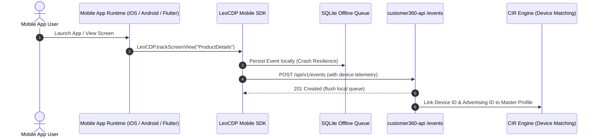

# Data Source Type 5: Mobile SDK Code (iOS, Android, Flutter)

## 1. Overview & Architectural Role

Data Source Type 5 represents native mobile application tracking. It captures in-app telemetry, screen navigation, user lifecycle events, and mobile identifiers (IDFA, GAID, IDFV, device tokens) from iOS, Android, and cross-platform mobile frameworks.



---

## 2. Supported Platforms & Initialization

### iOS (Swift)
```swift
import LeoCDPSDK

@main
class AppDelegate: UIResponder, UIApplicationDelegate {
    func application(
        _ application: UIApplication,
        didFinishLaunchingWithOptions launchOptions: [UIApplication.LaunchOptionsKey: Any]?
    ) -> Bool {
        // Initialize Customer 360 Mobile SDK
        LeoCDP.initialize(
            dataSourceId: "{{dataSourceId}}",
            endpoint: "https://api.c360.example.com",
            options: LeoOptions(
                trackAppLifecycle: true,
                batchSize: 15,
                flushIntervalSeconds: 30
            )
        )
        return true
    }
}
```

### Android (Kotlin)
```kotlin
package com.example.mybrand

import android.app.Application
import com.leocdp.sdk.LeoCDP
import com.leocdp.sdk.LeoOptions

class MainApplication : Application() {
    override fun onCreate() {
        super.onCreate()
        
        LeoCDP.initialize(
            context = this,
            dataSourceId = "{{dataSourceId}}",
            endpoint = "https://api.c360.example.com",
            options = LeoOptions(
                trackAppLifecycle = true,
                autoCollectAdvertisingId = true
            )
        )
    }
}
```

### Flutter (Dart)
```dart
import 'package:flutter/material.dart';
import 'package:leocdp_flutter_sdk/leocdp.dart';

void main() async {
  WidgetsFlutterBinding.ensureInitialized();
  
  await LeoCDP.initialize(
    dataSourceId: '{{dataSourceId}}',
    endpoint: 'https://api.c360.example.com',
    options: LeoOptions(
      trackAppLifecycle: true,
    ),
  );

  runApp(const MyApp());
}
```

---

## 3. Mobile Telemetry & Identity Capture

Mobile touchpoints supply distinct device identifiers utilized by the Customer Identity Resolution (CIR) engine to merge mobile activity into the consolidated Master Profile:

| Identifier | Platform | CIR Field Name | Purpose |
| :--- | :--- | :--- | :--- |
| **IDFA** | iOS | `advertising_id` | Cross-app advertising tracking (subject to ATT user consent). |
| **IDFV** | iOS | `device_id` | Vendor-scoped persistent device identifier. |
| **GAID (`gps_adid`)** | Android | `advertising_id` | Google Advertising ID for ad network attribution. |
| **Android ID** | Android | `device_id` | Hardware-scoped fallback identifier. |
| **APNs / FCM Token** | iOS / Android | `push_notification_token` | Push notification messaging dispatch token. |
| **Customer User ID** | All | `external_customer_id` | Logged-in profile identifier assigned by host backend. |

---

## 4. Mobile Event Tracking APIs

### Screen View Tracking
```swift
LeoCDP.trackScreenView(
    screenName: "ProductDetailsView",
    category: "Catalog",
    properties: ["sku": "SKU-9021", "brand": "AudioTech"]
)
```

### In-App Action Event
```swift
LeoCDP.recordAction(
    eventName: "add_to_wishlist",
    properties: ["item_id": "SKU-9021", "price": 149.99]
)
```

### In-App Purchase Tracking
```swift
LeoCDP.recordConversion(
    eventName: "in_app_purchase",
    transactionId: "TX-99820-APP",
    revenue: 149.99,
    currency: "USD",
    properties: ["payment_provider": "Apple In-App Purchase"]
)
```

### Profile Identity Linking (`loginProfile`)
```swift
LeoCDP.loginProfile(
    userId: "USR-882190",
    email: "customer@example.com",
    phone: "+15550188"
)
```

---

## 5. Mobile Measurement Partner (MMP) Integration

Type 5 data sources coordinate with external Mobile Attribution providers (Adjust, AppsFlyer, Branch):
- **Raw Export Ingestion**: Pre-configured pipelines pull or ingest MMP raw attribution postbacks (e.g. Adjust Pull API format).
- **Attribution Stitching**: Connects upstream ad network impressions and clicks (Meta, Google Ads, TikTok, Apple Search Ads) with in-app post-install conversion journeys.
- **Deep Link Resolution**: Resolves universal and deferred deep links on app first-launch, linking marketing campaigns to the acquired raw customer profile.
