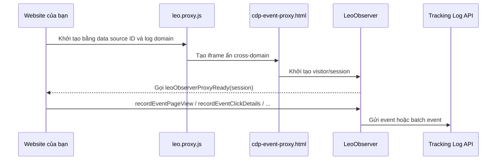

# Hướng dẫn tích hợp Leo C360 Web SDK

Tài liệu này giải thích luồng hoạt động của [c360-web-sdk-demo.html](c360-web-sdk-demo.html) và hướng dẫn lập trình viên web tích hợp Leo C360 Web SDK vào website thực tế.

Demo sử dụng website kết quả xổ số để minh họa các tình huống phổ biến:

- Tải SDK và khởi tạo tracking proxy.
- Ghi nhận page view ban đầu.
- Theo dõi điều hướng nội bộ bằng hash mà không tạo page view trùng.
- Nhận diện người dùng khi login hoặc đăng ký.
- Theo dõi click, submit form và conversion.
- Theo dõi ad impression và ad click.
- Kiểm tra cấu hình SDK bằng `console.log`.

> Demo sử dụng dữ liệu xổ số ngẫu nhiên và quảng cáo minh họa. Khi tích hợp thực tế, hãy thay các dữ liệu này bằng dữ liệu nghiệp vụ của website.

### Demo trực tiếp

Mở bản demo tương tác trong trình duyệt để quan sát luồng navigation, tracking event, cấu hình SDK và log debug trong DevTools:

[Mở demo Leo C360 Web SDK](https://raw.githack.com/LEO-CDP/leo-customer360/main/docs/data-sources/c360-web-sdk-demo.html)

> Liên kết sử dụng `raw.githack.com` để chạy trực tiếp file HTML từ nhánh `main`. Nếu cần kiểm tra phiên bản code trong workspace hiện tại, hãy mở [file demo local](c360-web-sdk-demo.html) thay vì link trực tiếp.

## 1. Kiến trúc tổng quan



Luồng có hai phần:

1. **Bootstrap**: website cấu hình các biến `window.*`, sau đó tải `leo.proxy.js`.
2. **Event tracking**: website gọi các hàm trên `LeoObserver` sau khi proxy đã được tải hoặc đã sẵn sàng.

`leo.proxy.js` chịu trách nhiệm kết nối visitor/session, xếp hàng event khi cần và gửi event về tracking log domain. Website không nên tự gọi trực tiếp các endpoint nội bộ của proxy.

## 2. Cấu hình bootstrap

Đây là cấu hình tối thiểu cần có trước khi tải proxy:

```html
<script>
(function () {
    window.leoC360DataSourceId = "YOUR_DATA_SOURCE_ID";
    window.leoTrackingBatchSize = 10;

    window.leoObserverLogDomain = "c360.example.com";
    window.leoTrackingEndpoint =
        "https://" + window.leoObserverLogDomain +
        "/data/api/v1/tracking/logs";

    window.leoCdpProxyPath = "/data/cdp-sdk/html/cdp-event-proxy.html";

    window.srcTouchpointName = encodeURIComponent(document.title);
    window.srcTouchpointUrl = encodeURIComponent(location.href);

    var script = document.createElement("script");
    script.async = true;
    script.defer = true;
    script.src =
        "https://gcore.jsdelivr.net/gh/LEO-CDP/leo-customer360@main/" +
        "data-tracking-api/static/c360-web-sdk/observer/leo.proxy.js";

    script.onload = function () {
        console.log("[C360 SDK] Leo Observer proxy loaded");
    };

    script.onerror = function (error) {
        console.error("[C360 SDK] Leo Observer proxy failed", error);
    };

    document.head.appendChild(script);
})();
</script>
```

### Ý nghĩa các biến

| Biến | Ý nghĩa |
| --- | --- |
| `leoC360DataSourceId` | ID của data source trong Customer 360. Mỗi website hoặc touchpoint nên dùng ID đã được cấp riêng. |
| `leoTrackingBatchSize` | Số event tối đa trong một batch trước khi flush. Demo dùng `10`. |
| `leoObserverLogDomain` | Host tiếp nhận tracking và cung cấp proxy iframe. Chỉ lưu hostname, không thêm `https://` hoặc dấu `/` cuối. |
| `leoTrackingEndpoint` | Endpoint nhận event log. Với cấu hình chuẩn là `/data/api/v1/tracking/logs`. |
| `leoCdpProxyPath` | Đường dẫn iframe dùng để giữ visitor/session cross-domain. |
| `srcTouchpointName` | Tên trang hoặc touchpoint, nên encode trước khi truyền. |
| `srcTouchpointUrl` | URL hiện tại của touchpoint, nên encode trước khi truyền. |

### Cấu hình từ localStorage trong demo

Demo cho phép admin thay đổi data source ID và log domain tại nút **SDK settings** cuối trang. Hai key đang dùng là:

```text
c360.demo.leoC360DataSourceId
c360.demo.leoObserverLogDomain
```

Quy tắc đọc cấu hình:

1. Đọc từ `localStorage`.
2. Nếu key không tồn tại, giá trị là `null` hoặc chuỗi rỗng, dùng default trong code.
3. Log domain được chuẩn hóa bằng cách bỏ `http://`, `https://` và dấu `/` cuối.
4. Sau khi lưu, demo reload trang để proxy được khởi tạo lại từ đầu.

Trong website thật, có thể lấy cấu hình từ server-side template hoặc biến môi trường được inject an toàn. Không nên cho người dùng thông thường sửa `dataSourceId`.

## 3. Proxy ready và tránh page view trùng

Proxy gọi callback global sau khi visitor/session proxy sẵn sàng:

```javascript
window.leoObserverProxyReady = function (session) {
    console.log("[C360 SDK] Proxy ready", session);
};
```

Trong demo, callback này **không gửi thêm page view**. Page view ban đầu được sở hữu bởi luồng render trang:

```javascript
loadLotteryInformation("home", { trackPageView: true });
```

Nếu proxy chưa sẵn sàng, page view được đưa vào queue:

```javascript
if (!window.LeoObserver ||
    typeof window.LeoObserver.recordEventPageView !== "function") {
    pendingPageViews.push(pageView);
    return;
}
```

Khi proxy ready, queue được flush đúng một lần.

Điểm quan trọng:

- Không gọi `recordEventPageView()` vừa trong `document.ready` vừa trong `leoObserverProxyReady()` cho cùng một page load.
- Nếu website là SPA, chỉ gửi page view khi thực sự chuyển logical page.
- Nếu chỉ đổi `location.hash` để lọc hoặc đổi nội dung trong cùng trang, nên gửi interaction event thay vì page view.

## 4. Các API event chính

### 4.1 Page view

```javascript
LeoObserver.recordEventPageView({
    page_name: "Product detail",
    page_url: location.href,
    title: document.title
});
```

Dùng cho lần tải trang hoặc khi SPA chuyển sang một logical page mới.

### 4.2 Content view

```javascript
LeoObserver.recordEventContentView({
    content_id: "article-123",
    content_type: "article",
    title: "Hướng dẫn sử dụng"
});
```

Dùng khi người dùng xem một nội dung cụ thể, ví dụ article, video, product detail hoặc ad creative.

### 4.3 Click hoặc interaction

```javascript
LeoObserver.recordEventClickDetails({
    target: "navigation",
    label: "XSMN",
    navigation_type: "hash-change",
    hash: "#xsmn"
});
```

Demo dùng event này khi user click menu. Hash navigation chỉ cập nhật nội dung và gửi `ui_click`, không gửi thêm `page_view`.

### 4.4 Login

```javascript
LeoObserver.recordEventUserLogin({
    user_id: "customer-123",
    method: "password"
});
```

Chỉ gửi event sau khi login thành công. Không gửi mật khẩu, access token hoặc thông tin nhạy cảm trong payload.

### 4.5 Signup và nhận diện profile

```javascript
LeoObserver.updateProfileBySession({
    user_id: "customer-123",
    email: "user@example.com"
});

LeoObserver.recordEventRegisterAccount({
    user_id: "customer-123",
    method: "email"
});
```

`updateProfileBySession` dùng để liên kết visitor/session ẩn danh với profile đã biết. Chỉ gửi các thuộc tính được phép theo chính sách dữ liệu của hệ thống.

### 4.6 Form submit

```javascript
LeoObserver.recordEventSubmitContact({
    form_id: "contact-form",
    form_name: "Contact us",
    fields: {
        email: "user@example.com"
    }
});
```

Nên gửi event sau khi server xác nhận submit thành công. Với dữ liệu nhạy cảm, chỉ gửi field cần cho mục đích phân tích.

### 4.7 Conversion hoặc purchase

Conversion có signature khác các event thông thường:

```javascript
LeoObserver.recordEventConversion(
    "order-10001",             // transaction ID
    499000,                     // value
    "VND",                     // currency
    [
        {
            item_id: "product-01",
            quantity: 1,
            price: 499000
        }
    ],
    {
        conversion_type: "purchase",
        channel: "web"
    }
);
```

Trong demo, form đăng ký nhận thông báo tạo một conversion minh họa với `value: 0`. Website thật nên chỉ gửi purchase khi giao dịch đã đạt trạng thái thành công theo nghiệp vụ.

## 5. Facade trong demo

Demo không gọi `LeoObserver` rải rác ở mọi event listener. Thay vào đó, các thao tác đi qua `C360DemoSDK`:

```javascript
C360DemoSDK.trackClick("navigation", {
    menu_key: "xsmn",
    label: "XSMN"
});

C360DemoSDK.trackFormSubmit("lottery-alert", {
    email: email
});

C360DemoSDK.identifyUser({
    user_id: "demo-subscriber",
    email: email
}, "signup");

C360DemoSDK.trackConversion({
    transaction_id: "order-10001",
    value: 499000,
    currency: "VND",
    items: [{ item_id: "product-01", quantity: 1 }]
});
```

Facade có ba vai trò:

1. Chuẩn hóa metadata chung như `page_url` và `occurred_at`.
2. Chọn đúng method của `LeoObserver`.
3. Ghi log debug và phát `c360:sdk-event` để test hoặc quan sát cục bộ.

Trong production, có thể giữ facade này để giảm coupling giữa business code và SDK. Khi SDK thay đổi method hoặc payload, chỉ cần sửa facade.

## 6. Điều hướng trong website nhiều trang và SPA

### Website nhiều trang

Mỗi page load mới có thể gửi một page view sau khi SDK bootstrap:

```javascript
C360DemoSDK.trackPageView({
    pageName: "Home",
    menuKey: "home",
    title: document.title
});
```

### SPA hoặc hash routing

Với SPA, cần phân biệt hai trường hợp:

- Chuyển sang logical page mới: gửi `page_view`.
- Chỉ đổi filter, tab hoặc hash trong cùng logical page: gửi `ui_click` hoặc event nghiệp vụ phù hợp.

Ví dụ theo demo:

```javascript
C360DemoSDK.trackClick("navigation", {
    menu_key: menuKey,
    navigation_type: "hash-change",
    hash: "#" + menuKey
});

loadLotteryInformation(menuKey, { trackPageView: false });
```

Không nên tự động bắt mọi `hashchange` rồi gửi page view, vì dễ tạo event trùng hoặc làm sai số lượng page view.

## 7. Ad impression và ad click

Demo render ad bằng JSON + Handlebars. Payload ad có các nhóm chính:

```javascript
const adData = {
    adId: "campaign-creative-01",
    campaign: { id: "campaign-2026" },
    placement: { id: "sidebar-300x250", width: 300, height: 250 },
    creative: { id: "creative-01", cta: "Xem ưu đãi" },
    destination: { url: "https://example.com" }
};
```

Impression chỉ được ghi nhận khi:

- Ad đạt ít nhất 50% visibility.
- Trạng thái đó kéo dài ít nhất 1 giây.
- Impression chưa từng được ghi nhận trong lifecycle hiện tại.

Click được bắt bằng delegated listener trên ad container. Hai event demo là:

```javascript
C360DemoSDK.send("ad_impression", {
    ad_id: adData.adId,
    campaign_id: adData.campaign.id,
    creative_id: adData.creative.id,
    placement_id: adData.placement.id
});

C360DemoSDK.send("ad_clicked", {
    ad_id: adData.adId,
    destination_url: adData.destination.url,
    link_text: adData.creative.cta
});
```

Trong hệ thống thật, cần đảm bảo `ad_id`, `campaign_id`, `creative_id` và `placement_id` ổn định để đối soát performance.

## 8. CORS và Private Network Access

Nếu website chạy khác origin với tracking log domain, server phải xử lý CORS preflight. Với browser gửi header:

```http
Access-Control-Request-Private-Network: true
```

Preflight response phải chứa:

```http
Access-Control-Allow-Private-Network: true
```

Tracking API trong repository đã thêm header này cho request `OPTIONS` tương ứng. Nếu deploy một tracking gateway hoặc reverse proxy riêng, gateway đó cũng phải giữ lại header.

Checklist response tối thiểu:

```http
Access-Control-Allow-Origin: https://your-site.example
Access-Control-Allow-Methods: POST, OPTIONS
Access-Control-Allow-Headers: content-type
Access-Control-Allow-Private-Network: true
```

Không dùng wildcard origin cùng credential nếu website cần gửi credential.

## 9. Debug và kiểm tra tích hợp

Mở DevTools Console và kiểm tra các log sau:

```text
[C360 SDK] Loading Leo Observer proxy
[C360 SDK] Leo Observer proxy script loaded
[C360 SDK] Leo Observer proxy ready
[C360 SDK] Event page_view
[C360 SDK] Event ui_click
[C360 SDK] Event form_submit
[C360 SDK] Event sign_up
[C360 SDK] Event purchase
```

Mỗi event có trường debug:

```javascript
{
    sentToLeoObserver: true,
    payload: {
        event: "ui_click",
        page_url: "...",
        occurred_at: "..."
    }
}
```

Nếu thấy:

```text
[C360 SDK] Queued page_view until Leo Observer is ready
```

thì event chưa bị mất; nó đang chờ callback `leoObserverProxyReady`.

Nếu thấy:

```text
[C360 SDK] Proxy is ready but LeoObserver.recordEventPageView is unavailable
```

hãy kiểm tra version của `leo.proxy.js` hoặc thứ tự tải script.

Có thể nghe event debug cục bộ:

```javascript
window.addEventListener("c360:sdk-event", function (event) {
    console.log("SDK debug event", event.detail);
});

window.addEventListener("c360:ad-event", function (event) {
    console.log("Ad debug event", event.detail);
});
```

## 10. Checklist trước khi production

- [ ] Dùng đúng `leoC360DataSourceId` do Customer 360 cấp.
- [ ] Dùng đúng log domain của môi trường hiện tại.
- [ ] Không hard-code data source ID production trong source public nếu quy trình deploy yêu cầu server-side injection.
- [ ] `leo.proxy.js` tải thành công và không bị CSP chặn.
- [ ] `cdp-event-proxy.html` trả về status 200.
- [ ] Tracking endpoint xử lý được `OPTIONS` preflight.
- [ ] Có `Access-Control-Allow-Private-Network: true` khi browser yêu cầu PNA.
- [ ] Page load chỉ tạo một page view.
- [ ] Hash navigation không tạo page view nếu chỉ là filter/tab trong cùng page.
- [ ] Login/signup chỉ gửi sau khi thao tác thành công.
- [ ] Không gửi password, token hoặc dữ liệu nhạy cảm trong event payload.
- [ ] Purchase/conversion chỉ gửi sau khi giao dịch thành công.
- [ ] Ad impression có visibility threshold và không ghi nhận lặp.
- [ ] Có debug log ở staging nhưng cân nhắc giảm log ở production.

## 11. Các file tham khảo

- Demo đầy đủ: [c360-web-sdk-demo.html](c360-web-sdk-demo.html)
- Tài liệu Web SDK tổng quát: [1-web-sdk-tracking.md](1-web-sdk-tracking.md)
- Proxy SDK local: [leo.proxy.js](../../data-tracking-api/static/c360-web-sdk/observer/leo.proxy.js)
- Tracking API entrypoint: [data-tracking-api/app.py](../../data-tracking-api/app.py)

## 12. Tóm tắt tích hợp tối thiểu

Nếu chỉ cần một luồng cơ bản, thứ tự triển khai nên là:

1. Inject data source ID và log domain.
2. Tải `leo.proxy.js`.
3. Định nghĩa `leoObserverProxyReady` để biết proxy đã sẵn sàng.
4. Gửi page view một lần cho page load.
5. Gọi các wrapper event tương ứng sau các hành vi thành công.
6. Kiểm tra Console và Network tab.
7. Kiểm tra CORS, PNA và event payload ở môi trường staging.

Mẫu ngắn:

```javascript
window.leoObserverProxyReady = function () {
    LeoObserver.recordEventPageView({
        page_name: document.title,
        page_url: location.href
    });
};

function onSuccessfulSignup(user) {
    LeoObserver.updateProfileBySession(user);
    LeoObserver.recordEventRegisterAccount({
        user_id: user.user_id,
        method: "email"
    });
}
```

Trong demo hiện tại, page view được queue để tránh race condition khi SDK tải bất đồng bộ. Đây là pattern nên giữ lại nếu website của bạn tải proxy bằng `async` hoặc `defer`.
