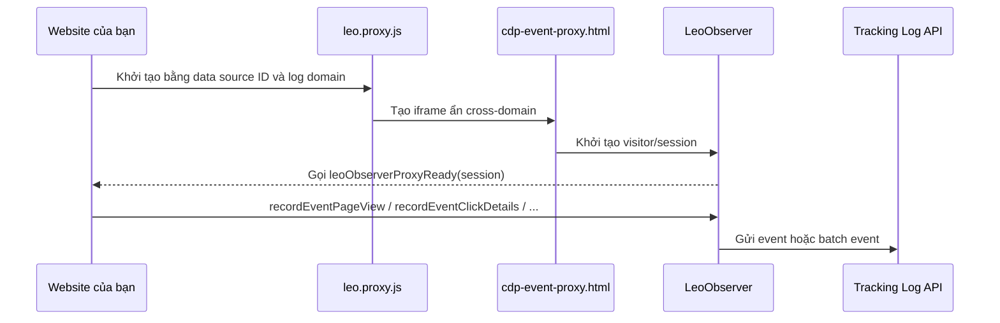

# Hướng dẫn kiểm thử Leo C360 Web SDK

Tài liệu này hướng dẫn QA và lập trình viên kiểm thử luồng tracking từ [c360-web-sdk-demo.html](c360-web-sdk-demo.html) qua Leo Observer đến Tracking Log API. Các ví dụ cũng là mẫu tham khảo khi tích hợp SDK vào website thực tế.

Demo sử dụng website kết quả xổ số để minh họa các tình huống phổ biến:

- Tải SDK và khởi tạo tracking proxy.
- Ghi nhận page view ban đầu.
- Theo dõi điều hướng nội bộ bằng hash mà không tạo page view trùng.
- Nhận diện người dùng khi login hoặc đăng ký.
- Theo dõi click, submit form và conversion.
- Theo dõi ad impression và ad click.
- Kiểm tra cấu hình SDK bằng `console.log`.

> Demo sử dụng dữ liệu xổ số ngẫu nhiên và quảng cáo minh họa. Khi tích hợp thực tế, hãy thay các dữ liệu này bằng dữ liệu nghiệp vụ của website.

## Mục tiêu và tiêu chí đạt

Một lượt kiểm thử đạt khi proxy khởi tạo thành công, thao tác tạo đúng event dự kiến, Tracking Log API chấp nhận batch và payload lưu giữ đúng định danh cùng attribution. Log trong Console chỉ xác nhận SDK đã tạo event; cần kiểm tra thêm request và response trong Network để xác nhận API đã nhận dữ liệu.

### Mô phỏng UTM, campaign và A/B experiment

Demo đọc các tham số UTM `utm_source`, `utm_medium`, `utm_campaign`, `utm_term` và `utm_content` từ URL, sau đó tự thêm chúng vào mỗi event được gửi qua `C360DemoSDK`.

Để gắn campaign và biến thể thử nghiệm, dùng hai tham số UUID rút gọn:

| Tham số URL | Trường event API |
| --- | --- |
| `leocpid` | `campaign_id` |
| `leoexvrid` | `experiment_variant_id` |

Ví dụ:

```text
c360-web-sdk-demo.html?utm_source=newsletter&utm_medium=email&utm_campaign=spring-launch&utm_term=family-plan&utm_content=hero&leocpid=<CAMPAIGN_UUID>&leoexvrid=<VARIANT_UUID>
```

Thay các giá trị UUID bằng campaign và variant có thật trong môi trường cần kiểm tra. Tải lại trang với UUID của từng variant để mô phỏng các nhánh A/B khác nhau. SDK bỏ qua UUID sai định dạng; event API chuẩn hóa các alias về tên trường canonical trong payload.

### Demo trực tiếp

Mở bản demo tương tác để quan sát luồng navigation, tracking event, cấu hình SDK và log debug trong DevTools:

[Mở demo Leo C360 Web SDK](https://raw.githack.com/LEO-CDP/leo-customer360/main/docs/data-sources/c360-web-sdk-demo.html)

Liên kết trên chạy phiên bản từ nhánh `main`. Để kiểm tra code trong workspace hiện tại, chạy static server từ thư mục repository:

```bash
python3 -m http.server 8000 --directory docs/data-sources
```

Sau đó mở `http://localhost:8000/c360-web-sdk-demo.html`. Không nên mở bằng `file://`: trình duyệt có thể chặn các request cross-origin. Nếu tracking domain không cho phép origin `http://localhost:8000`, cần cấu hình CORS cho môi trường kiểm thử.

## 1. Kiến trúc tổng quan


```mermaid
sequenceDiagram
    participant Browser as Website của bạn
    participant Loader as leo.proxy.js
    participant Iframe as cdp-event-proxy.html
    participant SDK as LeoObserver
    participant API as Tracking Log API

    Browser->>Loader: Khởi tạo bằng data source ID và log domain
    Loader->>Iframe: Tạo iframe ẩn cross-domain
    Iframe->>SDK: Khởi tạo visitor/session
    SDK-->>Browser: Gọi leoObserverProxyReady(session)
    Browser->>SDK: recordEventPageView / recordEventClickDetails / ...
    SDK->>API: Gửi event hoặc batch event
```

Luồng có hai phần:

1. **Bootstrap**: website cấu hình các biến `window.*`, sau đó tải `leo.proxy.js`.
2. **Event tracking**: website gọi các hàm trên `LeoObserver` sau khi proxy đã được tải hoặc đã sẵn sàng.

`leo.proxy.js` chịu trách nhiệm kết nối visitor/session, xếp hàng event khi cần và gửi event về tracking log domain. Website không nên tự gọi trực tiếp các endpoint nội bộ của proxy.

## 2. Cấu hình bootstrap

Đây là cấu hình tối thiểu cần có trước khi tải proxy:

```html
<script>
(function () {
    window.leoC360DataSourceId = "YOUR_DATA_SOURCE_ID";
    window.leoTrackingBatchSize = 10;

    window.leoObserverLogDomain = "c360.example.com";
    window.leoTrackingEndpoint =
        "https://" + window.leoObserverLogDomain +
        "/data/api/v1/tracking/logs";

    window.leoCdpProxyPath = "/data/cdp-sdk/html/cdp-event-proxy.html";

    window.srcTouchpointName = encodeURIComponent(document.title);
    window.srcTouchpointUrl = encodeURIComponent(location.href);

    var script = document.createElement("script");
    script.async = true;
    script.defer = true;
    script.src =
        "https://gcore.jsdelivr.net/gh/LEO-CDP/leo-customer360@main/" +
        "customer360-event-api/static/c360-web-sdk/observer/leo.proxy.js";

    script.onload = function () {
        console.log("[C360 SDK] Leo Observer proxy loaded");
    };

    script.onerror = function (error) {
        console.error("[C360 SDK] Leo Observer proxy failed", error);
    };

    document.head.appendChild(script);
})();
</script>
```

### Ý nghĩa các biến

| Biến | Ý nghĩa |
| --- | --- |
| `leoC360DataSourceId` | ID của data source trong Customer 360. Mỗi website hoặc touchpoint nên dùng ID đã được cấp riêng. |
| `leoTrackingBatchSize` | Số event tối đa trong một batch trước khi flush. Demo dùng `10`. |
| `leoObserverLogDomain` | Host tiếp nhận tracking và cung cấp proxy iframe. Chỉ lưu hostname, không thêm `https://` hoặc dấu `/` cuối. |
| `leoTrackingEndpoint` | Endpoint nhận event log. Với cấu hình chuẩn là `/data/api/v1/tracking/logs`. |
| `leoCdpProxyPath` | Đường dẫn iframe dùng để giữ visitor/session cross-domain. |
| `srcTouchpointName` | Tên trang hoặc touchpoint, nên encode trước khi truyền. |
| `srcTouchpointUrl` | URL hiện tại của touchpoint, nên encode trước khi truyền. |

### Cấu hình từ localStorage trong demo

Demo cho phép admin thay đổi data source ID và log domain tại nút **SDK settings** cuối trang. Hai key đang dùng là:

```text
c360.demo.leoC360DataSourceId
c360.demo.leoObserverLogDomain
```

Quy tắc đọc cấu hình:

1. Đọc từ `localStorage`.
2. Nếu key không tồn tại, giá trị là `null` hoặc chuỗi rỗng, dùng default trong code.
3. Log domain được chuẩn hóa bằng cách bỏ `http://`, `https://` và dấu `/` cuối.
4. Sau khi lưu, demo reload trang để proxy được khởi tạo lại từ đầu.

Trong website thật, có thể lấy cấu hình từ server-side template hoặc biến môi trường được inject an toàn. Không nên cho người dùng thông thường sửa `dataSourceId`.

## 3. Proxy ready và tránh page view trùng

Proxy gọi callback global sau khi visitor/session proxy sẵn sàng:

```javascript
window.leoObserverProxyReady = function (session) {
    console.log("[C360 SDK] Proxy ready", session);
};
```

Trong demo, callback này **không gửi thêm page view**. Page view ban đầu được sở hữu bởi luồng render trang:

```javascript
loadLotteryInformation("home", { trackPageView: true });
```

Nếu proxy chưa sẵn sàng, page view được đưa vào queue:

```javascript
if (!window.LeoObserver ||
    typeof window.LeoObserver.recordEventPageView !== "function") {
    pendingPageViews.push(pageView);
    return;
}
```

Khi proxy ready, queue được flush đúng một lần.

Điểm quan trọng:

- Không gọi `recordEventPageView()` vừa trong `document.ready` vừa trong `leoObserverProxyReady()` cho cùng một page load.
- Nếu website là SPA, chỉ gửi page view khi thực sự chuyển logical page.
- Nếu chỉ đổi `location.hash` để lọc hoặc đổi nội dung trong cùng trang, nên gửi interaction event thay vì page view.

## 4. Các API event chính

### 4.1 Page view

```javascript
LeoObserver.recordEventPageView({
    page_name: "Product detail",
    page_url: location.href,
    title: document.title
});
```

Dùng cho lần tải trang hoặc khi SPA chuyển sang một logical page mới.

### 4.2 Content view

```javascript
LeoObserver.recordEventContentView({
    content_id: "article-123",
    content_type: "article",
    title: "Hướng dẫn sử dụng"
});
```

Dùng khi người dùng xem một nội dung cụ thể, ví dụ article, video, product detail hoặc ad creative.

### 4.3 Click hoặc interaction

```javascript
LeoObserver.recordEventClickDetails({
    target: "navigation",
    label: "XSMN",
    navigation_type: "hash-change",
    hash: "#xsmn"
});
```

Demo dùng event này khi user click menu. Hash navigation chỉ cập nhật nội dung và gửi `ui_click`, không gửi thêm `page_view`.

### 4.4 Login

```javascript
LeoObserver.recordEventUserLogin({
    user_id: "customer-123",
    method: "password"
});
```

Chỉ gửi event sau khi login thành công. Không gửi mật khẩu, access token hoặc thông tin nhạy cảm trong payload.

### 4.5 Signup và nhận diện profile

```javascript
LeoObserver.updateProfileBySession({
    user_id: "customer-123",
    email: "user@example.com"
});

LeoObserver.recordEventRegisterAccount({
    user_id: "customer-123",
    method: "email"
});
```

`updateProfileBySession` dùng để liên kết visitor/session ẩn danh với profile đã biết. Chỉ gửi các thuộc tính được phép theo chính sách dữ liệu của hệ thống.

### 4.6 Form submit

```javascript
LeoObserver.recordEventSubmitContact({
    form_id: "contact-form",
    form_name: "Contact us",
    fields: {
        email: "user@example.com"
    }
});
```

Nên gửi event sau khi server xác nhận submit thành công. Với dữ liệu nhạy cảm, chỉ gửi field cần cho mục đích phân tích.

### 4.7 Conversion hoặc purchase

Conversion có signature khác các event thông thường:

```javascript
LeoObserver.recordEventConversion(
    "order-10001",             // transaction ID
    499000,                     // value
    "VND",                     // currency
    [
        {
            item_id: "product-01",
            quantity: 1,
            price: 499000
        }
    ],
    {
        conversion_type: "purchase",
        channel: "web"
    }
);
```

Trong demo, form đăng ký nhận thông báo tạo một conversion minh họa với `value: 0`. Website thật nên chỉ gửi purchase khi giao dịch đã đạt trạng thái thành công theo nghiệp vụ.

## 5. Facade trong demo

Demo không gọi `LeoObserver` rải rác ở mọi event listener. Thay vào đó, các thao tác đi qua `C360DemoSDK`:

```javascript
C360DemoSDK.trackClick("navigation", {
    menu_key: "xsmn",
    label: "XSMN"
});

C360DemoSDK.trackFormSubmit("lottery-alert", {
    email: email
});

C360DemoSDK.identifyUser({
    user_id: "demo-subscriber",
    email: email
}, "signup");

C360DemoSDK.trackConversion({
    transaction_id: "order-10001",
    value: 499000,
    currency: "VND",
    items: [{ item_id: "product-01", quantity: 1 }]
});
```

Facade có ba vai trò:

1. Chuẩn hóa metadata chung như `page_url` và `occurred_at`.
2. Chọn đúng method của `LeoObserver`.
3. Ghi log debug và phát `c360:sdk-event` để test hoặc quan sát cục bộ.

Trong production, có thể giữ facade này để giảm coupling giữa business code và SDK. Khi SDK thay đổi method hoặc payload, chỉ cần sửa facade.

## 6. Điều hướng trong website nhiều trang và SPA

### Website nhiều trang

Mỗi page load mới có thể gửi một page view sau khi SDK bootstrap:

```javascript
C360DemoSDK.trackPageView({
    pageName: "Home",
    menuKey: "home",
    title: document.title
});
```

### SPA hoặc hash routing

Với SPA, cần phân biệt hai trường hợp:

- Chuyển sang logical page mới: gửi `page_view`.
- Chỉ đổi filter, tab hoặc hash trong cùng logical page: gửi `ui_click` hoặc event nghiệp vụ phù hợp.

Ví dụ theo demo:

```javascript
C360DemoSDK.trackClick("navigation", {
    menu_key: menuKey,
    navigation_type: "hash-change",
    hash: "#" + menuKey
});

loadLotteryInformation(menuKey, { trackPageView: false });
```

Không nên tự động bắt mọi `hashchange` rồi gửi page view, vì dễ tạo event trùng hoặc làm sai số lượng page view.

## 7. Ad impression và ad click

Demo render ad bằng JSON + Handlebars. Payload ad có các nhóm chính:

```javascript
const adData = {
    adId: "campaign-creative-01",
    campaign: { name: "Campaign 2026" },
    placement: { id: "sidebar-300x250", width: 300, height: 250 },
    creative: { id: "creative-01", cta: "Xem ưu đãi" },
    destination: { url: "https://example.com" }
};
```

Impression chỉ được ghi nhận khi:

- Ad đạt ít nhất 50% visibility.
- Trạng thái đó kéo dài ít nhất 1 giây.
- Impression chưa từng được ghi nhận trong lifecycle hiện tại.

Click được bắt bằng delegated listener trên ad container. Hai event demo là:

```javascript
C360DemoSDK.send("ad_impression", {
    ad_id: adData.adId,
    campaign: adData.campaign.name,
    creative_id: adData.creative.id,
    placement_id: adData.placement.id
});

C360DemoSDK.send("ad_clicked", {
    ad_id: adData.adId,
    campaign: adData.campaign.name,
    destination_url: adData.destination.url,
    link_text: adData.creative.cta
});
```

Trong hệ thống thật, cần đảm bảo `ad_id`, `campaign_id`, `creative_id` và `placement_id` ổn định để đối soát performance.

## 8. CORS và Private Network Access

Nếu website chạy khác origin với tracking log domain, server phải xử lý CORS preflight. Với browser gửi header:

```http
Access-Control-Request-Private-Network: true
```

Preflight response phải chứa:

```http
Access-Control-Allow-Private-Network: true
```

Tracking API trong repository đã thêm header này cho request `OPTIONS` tương ứng. Nếu deploy một tracking gateway hoặc reverse proxy riêng, gateway đó cũng phải giữ lại header.

Checklist response tối thiểu:

```http
Access-Control-Allow-Origin: https://your-site.example
Access-Control-Allow-Methods: POST, OPTIONS
Access-Control-Allow-Headers: content-type
Access-Control-Allow-Private-Network: true
```

Không dùng wildcard origin cùng credential nếu website cần gửi credential.

## 9. Debug và kiểm tra tích hợp

Mở DevTools Console và kiểm tra các log sau:

```text
[C360 SDK] Loading Leo Observer proxy
[C360 SDK] Leo Observer proxy script loaded
[C360 SDK] Leo Observer proxy ready
[C360 SDK] Event page_view
[C360 SDK] Event ui_click
[C360 SDK] Event form_submit
[C360 SDK] Event sign_up
[C360 SDK] Event purchase
```

Mỗi event có trường debug:

```javascript
{
    sentToLeoObserver: true,
    payload: {
        event: "ui_click",
        page_url: "...",
        occurred_at: "..."
    }
}
```

Nếu thấy:

```text
[C360 SDK] Queued page_view until Leo Observer is ready
```

thì page view đang chờ callback `leoObserverProxyReady`; sau callback, kiểm tra Console và Network để xác nhận queue đã được flush.

Nếu thấy:

```text
[C360 SDK] Cannot flush page_views; Leo Observer is unavailable
```

hãy kiểm tra proxy có tải thành công không, callback `leoObserverProxyReady` có được gọi không và method tương ứng có sẵn trên `window.LeoObserver` không.

`sentToLeoObserver: true` chỉ có nghĩa method Observer đã được gọi ở phía browser; đây không phải xác nhận server đã nhận event. Cũng vậy, event `c360:sdk-event` được phát cục bộ trước khi có kết quả từ API.

Ví dụ log SDK:

```javascript
{
    sentToLeoObserver: true,
    payload: {
        page_url: "https://example.test/",
        occurred_at: "2026-10-01T10:00:00.000Z"
    }
}
```

Event name xuất hiện riêng trong log `[C360 SDK] Event <event_name>`. Với listener `c360:sdk-event`, `event.detail.event` là event name; payload không có trường `event` vì facade xóa trường này trước khi gọi Observer.

Có thể nghe event debug cục bộ:

```javascript
window.addEventListener("c360:sdk-event", function (event) {
    console.log("SDK debug event", event.detail);
});

window.addEventListener("c360:ad-event", function (event) {
    console.log("Ad debug event", event.detail);
});
```

## 10. Quy trình kiểm thử chấp nhận

### 10.1 Chuẩn bị

1. Dùng một `data source ID` đang hoạt động và một tracking domain có thể truy cập từ trình duyệt.
2. Mở **SDK settings**, nhập data source ID và hostname của tracking domain. Chỉ nhập hostname, không thêm `https://` hoặc dấu `/` cuối; lưu cấu hình để trang reload.
3. Mở DevTools trước khi thao tác. Bật **Preserve log** trong Console và Network để không mất log khi trang reload.
4. Dùng dữ liệu định danh tổng hợp. Không nhập thông tin cá nhân thật hoặc token production vào form demo.
5. Nếu kiểm thử campaign reporting, dùng campaign UUID và experiment variant UUID thực trong cùng tenant; variant phải thuộc campaign đó. UUID đúng định dạng nhưng không tồn tại vẫn có thể được ghi nhận ở tầng ingestion, song không đủ để tạo số liệu campaign theo variant.

Để kiểm tra URL attribution, thêm các tham số sau vào URL trước khi tải trang:

```text
?utm_source=qa&utm_medium=manual&utm_campaign=sdk-smoke&utm_term=lottery&utm_content=hero&leocpid=<CAMPAIGN_UUID>&leoexvrid=<VARIANT_UUID>
```

SDK đọc UTM và hai alias UUID khi khởi tạo trang, rồi thêm chúng vào từng event. API chuẩn hóa `leocpid` thành `campaign_id` và `leoexvrid` thành `experiment_variant_id`. Để so sánh hai nhánh A/B, dùng cùng campaign và mỗi variant UUID trong một browser profile riêng; tải lại trang sau khi đổi URL.

### 10.2 Ma trận kiểm thử

| ID | Thao tác | Kết quả mong đợi |
| --- | --- | --- |
| WEB-01 | Tải trang lần đầu | `leo.proxy.js` tải được; proxy ready; có một page view. Nếu proxy chưa sẵn sàng, page view được queue và flush sau callback. |
| WEB-02 | Chọn menu như XSMN | Có một click event với `menu_key: "xsmn"`; hash navigation không tạo thêm page view. |
| WEB-03 | Chọn Đăng nhập và Đăng ký | Tương ứng có event login và signup; demo dùng profile giả lập, không xác thực tài khoản thật. |
| WEB-04 | Điền form nhận thông báo bằng dữ liệu tổng hợp rồi submit | Có `form_submit`, signup và conversion demo; trạng thái form báo đăng ký thành công. |
| WEB-05 | Đưa quảng cáo vào vùng nhìn thấy ít nhất 50% trong 1 giây, sau đó click | Có tối đa một impression cho lifecycle hiện tại và một click; `c360:ad-event` hiển thị loại ad event. |
| ATTR-01 | Tải trang có đủ UTM, `leocpid` và `leoexvrid` | Event debug và request chứa UTM cùng canonical `campaign_id`/`experiment_variant_id`; alias URL không thay đổi tên trường canonical trong event đã chuẩn hóa. |
| ATTR-02 | Truyền UUID sai định dạng qua URL alias | SDK ghi warning và bỏ qua UUID sai; event còn lại vẫn có thể được gửi. API từ chối UUID sai nếu client gửi trực tiếp. |

Observer gom event theo batch. Trong cấu hình hiện tại, chờ khoảng 6 giây sau thao tác cuối để batch được flush; request cũng có thể được gửi sớm hơn khi đạt batch size.

### 10.3 Xác nhận tại Network và API

Trong DevTools → **Network**, lọc theo `tracking/logs` và mở request `POST` tới `/data/api/v1/tracking/logs`. Xác nhận:

- Request có `data_source_id` đúng và `events` không rỗng.
- Event có các trường attribution mong đợi. UTM được giữ nguyên; campaign và variant được gửi dưới tên canonical `campaign_id` và `experiment_variant_id`.
- Response thành công là `202 Accepted`; `event_count` bằng số event trong batch. Response có thể kèm `bucket`, `object_key` và `queue_message_id`.

`202` xác nhận batch được Tracking API nhận vào storage/queue, không nhất thiết có nghĩa worker đã upload object lên S3 xong. Nếu cần xác nhận durable storage, kiểm tra queue status tại `/data/api/v1/tracking/queue-status` và sau đó kiểm tra object trong bucket `data-tracking-<data_source_id>`. Object là gzip-compressed NDJSON dưới prefix `events/<UTC-hour>/`; mỗi dòng có campaign/variant canonical ở envelope và event gốc trong `payload`.

Các mã phản hồi thường gặp:

| HTTP | Ý nghĩa khi kiểm thử |
| --- | --- |
| `202` | Batch được chấp nhận; kiểm tra `accepted`, `event_count` và thông tin queue/storage trong response. |
| `413` | Batch vượt giới hạn số event hoặc giới hạn kích thước request. |
| `422` | Request không hợp lệ, thiếu identity cần thiết hoặc UUID attribution sai định dạng. |
| `429` | Rate limit; kiểm tra `Retry-After` và dùng nguồn kiểm thử được phép. |
| `503` | Queue hoặc storage tạm thời không khả dụng; kiểm tra trạng thái dịch vụ rồi retry có kiểm soát. |

Tracking API ghi dữ liệu bất đồng bộ vào object storage; không dùng việc một event xuất hiện ngay trong database làm tiêu chí duy nhất cho kiểm thử ingestion.

### 10.4 An toàn dữ liệu kiểm thử

- Chỉ dùng email, user ID, transaction ID và giá trị giao dịch giả lập.
- Không đưa access token, mật khẩu, dữ liệu thanh toán hoặc thông tin cá nhân production vào query string hay event payload.
- URL query có thể được lưu trong browser history, proxy log và analytics; chỉ đặt UUID campaign/variant và giá trị UTM không nhạy cảm ở đó.
- Không dùng UUID campaign/variant thuộc tenant khác. Giữ phạm vi dữ liệu trong đúng data source và tenant kiểm thử.

## 11. Xử lý lỗi thường gặp

| Triệu chứng | Kiểm tra và hướng xử lý |
| --- | --- |
| Không có request `tracking/logs` | Kiểm tra Console, `leo.proxy.js`, endpoint trong SDK settings, ad blocker và CORS. Chờ batch flush khoảng 6 giây. |
| Page view nằm trong queue | Xác nhận callback `leoObserverProxyReady` được gọi; kiểm tra `LeoObserver.recordEventPageView` tồn tại sau khi proxy ready. |
| `sentToLeoObserver` là `true` nhưng API không nhận | Đây chỉ là xác nhận local. Tìm request trong Network; kiểm tra URL, trạng thái HTTP, response body và CORS. |
| API trả `422` cho attribution | Dùng UUID hợp lệ. Campaign và variant phải là UUID; khi cần campaign metrics, variant phải liên kết với campaign trong cùng tenant. |
| API trả `429` | Tuân thủ `Retry-After`; kiểm tra rate limit và whitelist môi trường dev nếu được quản trị cấu hình. |
| API trả `503` hoặc queue depth tăng | Kiểm tra Redis/S3 worker và queue status. Không gửi vòng lặp retry nhanh từ browser. |
| Event có trong Console nhưng chưa thấy object S3 | `202` là xác nhận nhận batch; chờ worker flush rồi kiểm tra bucket, object key và queue depth. |

## 12. Checklist trước khi production

- [ ] Dùng đúng `leoC360DataSourceId` do Customer 360 cấp.
- [ ] Dùng đúng log domain của môi trường hiện tại.
- [ ] Không hard-code data source ID production trong source public nếu quy trình deploy yêu cầu server-side injection.
- [ ] `leo.proxy.js` tải thành công và không bị CSP chặn.
- [ ] `cdp-event-proxy.html` trả về status 200.
- [ ] Tracking endpoint xử lý được `OPTIONS` preflight.
- [ ] Có `Access-Control-Allow-Private-Network: true` khi browser yêu cầu PNA.
- [ ] Page load chỉ tạo một page view.
- [ ] Hash navigation không tạo page view nếu chỉ là filter/tab trong cùng page.
- [ ] Login/signup chỉ gửi sau khi thao tác thành công.
- [ ] Không gửi password, token hoặc dữ liệu nhạy cảm trong event payload.
- [ ] Purchase/conversion chỉ gửi sau khi giao dịch thành công.
- [ ] Ad impression có visibility threshold và không ghi nhận lặp.
- [ ] Có debug log ở staging nhưng cân nhắc giảm log ở production.

## 13. Các file tham khảo

- Demo đầy đủ: [c360-web-sdk-demo.html](c360-web-sdk-demo.html)
- Tài liệu Web SDK tổng quát: [1-web-sdk-tracking.md](1-web-sdk-tracking.md)
- Proxy SDK local: [leo.proxy.js](../../customer360-event-api/static/c360-web-sdk/observer/leo.proxy.js)
- Tracking API entrypoint: [customer360-event-api/app.py](../../customer360-event-api/app.py)

## 14. Tóm tắt tích hợp tối thiểu

Nếu chỉ cần một luồng cơ bản, thứ tự triển khai nên là:

1. Inject data source ID và log domain.
2. Tải `leo.proxy.js`.
3. Định nghĩa `leoObserverProxyReady` để biết proxy đã sẵn sàng.
4. Gửi page view một lần cho page load.
5. Gọi các wrapper event tương ứng sau các hành vi thành công.
6. Kiểm tra Console và Network tab.
7. Kiểm tra CORS, PNA và event payload ở môi trường staging.

Mẫu ngắn:

```javascript
window.leoObserverProxyReady = function () {
    LeoObserver.recordEventPageView({
        page_name: document.title,
        page_url: location.href
    });
};

function onSuccessfulSignup(user) {
    LeoObserver.updateProfileBySession(user);
    LeoObserver.recordEventRegisterAccount({
        user_id: user.user_id,
        method: "email"
    });
}
```

Trong demo hiện tại, page view được queue để tránh race condition khi SDK tải bất đồng bộ. Đây là pattern nên giữ lại nếu website của bạn tải proxy bằng `async` hoặc `defer`.
