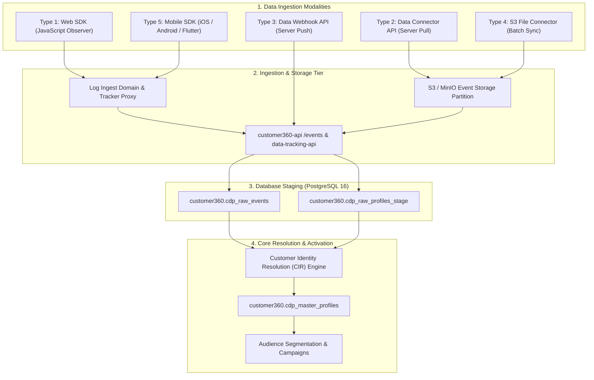

# Customer 360 Data Source Types Specification

## Overview

The Customer 360 (CDP) platform supports five distinct data source ingestion modalities, codified by `source_type` in `customer360.sys_data_source`. Each source type corresponds to a specific data collection architecture, network protocol, security model, and downstream ingestion lifecycle.



---

## Ingestion Modalities Matrix

| `source_type` | Modality Name | Direction / Trigger | Latency | Target Payload Format | Typical Use Cases |
| :---: | :--- | :--- | :--- | :--- | :--- |
| **1** | **Web JavaScript Code** | Client $\rightarrow$ Log Origin | Real-time (< 2s) | JSON Event Batches (`/etv`, `/eta`, `/etc`) | Website visitor tracking, single-page apps, GTM tags, QR code touchpoints. |
| **2** | **Data Connector API** | Server $\rightarrow$ 3rd-Party Pull | Scheduled batch (Hourly/Daily) | JSON / Tabular API records | Google Analytics 4, Meta Graph / Lead Ads, TikTok Marketing API, CRM sync. |
| **3** | **Data Webhook API** | 3rd-Party $\rightarrow$ Server Push | Real-time stream (< 500ms) | JSON Event Object (`POST /events`) | Payment gateway webhooks (Stripe), ESP delivery events, POS real-time sales. |
| **4** | **S3 File Connector** | Batch Storage Lake Pull | Micro-batch / Hourly | CSV, JSONL, Parquet | Historical data migrations, offline point-of-sale logs, ERP batch exports. |
| **5** | **Mobile SDK Code** | Native App $\rightarrow$ Ingest API | Real-time / Session flush | JSON Mobile Telemetry | iOS (Swift), Android (Kotlin), Flutter apps, mobile attribution (Adjust). |

---

## Multi-Tenant Security & Isolation Model

All data sources are strictly isolated by `tenant_id`:
1. **Database Enforcement**: `customer360.sys_data_source` enforces Row-Level Security (RLS) via PostgreSQL 16 `tenant_policy`. Data sources cannot be accessed or queried across tenant boundaries.
2. **Uniqueness**: Connectors enforce `UNIQUE (tenant_id, slug)`.
3. **Network Host Whitelisting**: The `data_source_hosts` array enforces domain restrictions to prevent unauthorized origins from spoofing tracking sources.
4. **Credential Isolation**: Secrets, OAuth tokens, and API keys are stored encrypted within `access_tokens` JSONB per tenant.

---

## Database Schema Specification

Table: `customer360.sys_data_source`

```sql
CREATE TABLE IF NOT EXISTS customer360.sys_data_source (
    data_source_id UUID PRIMARY KEY DEFAULT gen_random_uuid(),
    tenant_id UUID NOT NULL REFERENCES customer360.sys_tenant(tenant_id),
    name TEXT NOT NULL,
    slug VARCHAR(255) NOT NULL,
    source_type SMALLINT NOT NULL DEFAULT 2, -- 1, 2, 3, 4, 5
    status SMALLINT NOT NULL DEFAULT 1,      -- 1: active, 0: inactive
    data_source_url TEXT,
    thumbnail_url TEXT,
    collect_directly BOOLEAN DEFAULT true,
    first_party_data BOOLEAN DEFAULT true,
    journey_level SMALLINT DEFAULT 3,
    journey_map_id VARCHAR(255),
    touchpoint_hub_id VARCHAR(255),
    security_code TEXT,
    total_tracked_event BIGINT DEFAULT 0,
    avg_daily_event BIGINT DEFAULT 0,
    avg_events_per_profile NUMERIC(10, 2) DEFAULT 0.0,
    access_tokens JSONB DEFAULT '{}'::jsonb,
    data_source_hosts TEXT[] DEFAULT ARRAY[]::TEXT[],
    javascript_tags TEXT[] DEFAULT ARRAY[]::TEXT[],
    qr_code_data JSONB DEFAULT '{}'::jsonb,
    created_at TIMESTAMP WITH TIME ZONE DEFAULT now(),
    updated_at TIMESTAMP WITH TIME ZONE DEFAULT now(),
    CONSTRAINT uq_sys_data_source_slug UNIQUE (tenant_id, slug),
    CONSTRAINT ck_sys_data_source_source_type CHECK (source_type IN (1, 2, 3, 4, 5))
);
```

---

## Detailed Specifications by Type

- [tracking-logs-ajax-tester.html](tracking-logs-ajax-tester.html): Browser AJAX tester for `POST https://beta.leocdp.com/data/api/v1/tracking/logs`.
- [1-web-sdk-tracking.md](1-web-sdk-tracking.md): Type 1 — Client-side Web SDK, JavaScript tracking snippet, and QR code generation.
- [2-data-connector.md](2-data-connector.md): Type 2 — Server-to-server Data Connector API (Pull/Sync) for external platforms.
- [3-web-hook-api.md](3-web-hook-api.md): Type 3 — Data Webhook API (Server-side Push) for real-time inbound events.
- [4-s3-files-synch.md](4-s3-files-synch.md): Type 4 — S3 & Cloud Storage batch synchronization (CSV, JSONL, Parquet).
- [5-mobile-sdk-tracking.md](5-mobile-sdk-tracking.md): Type 5 — Native Mobile SDK (iOS, Android, Flutter) and mobile attribution integration.
