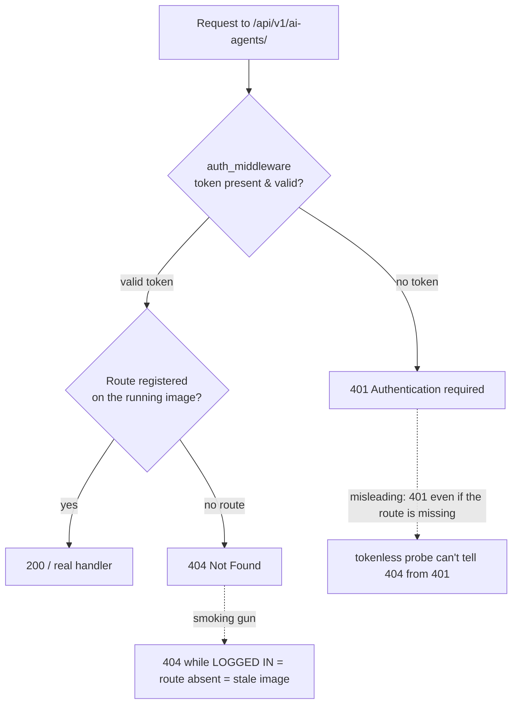
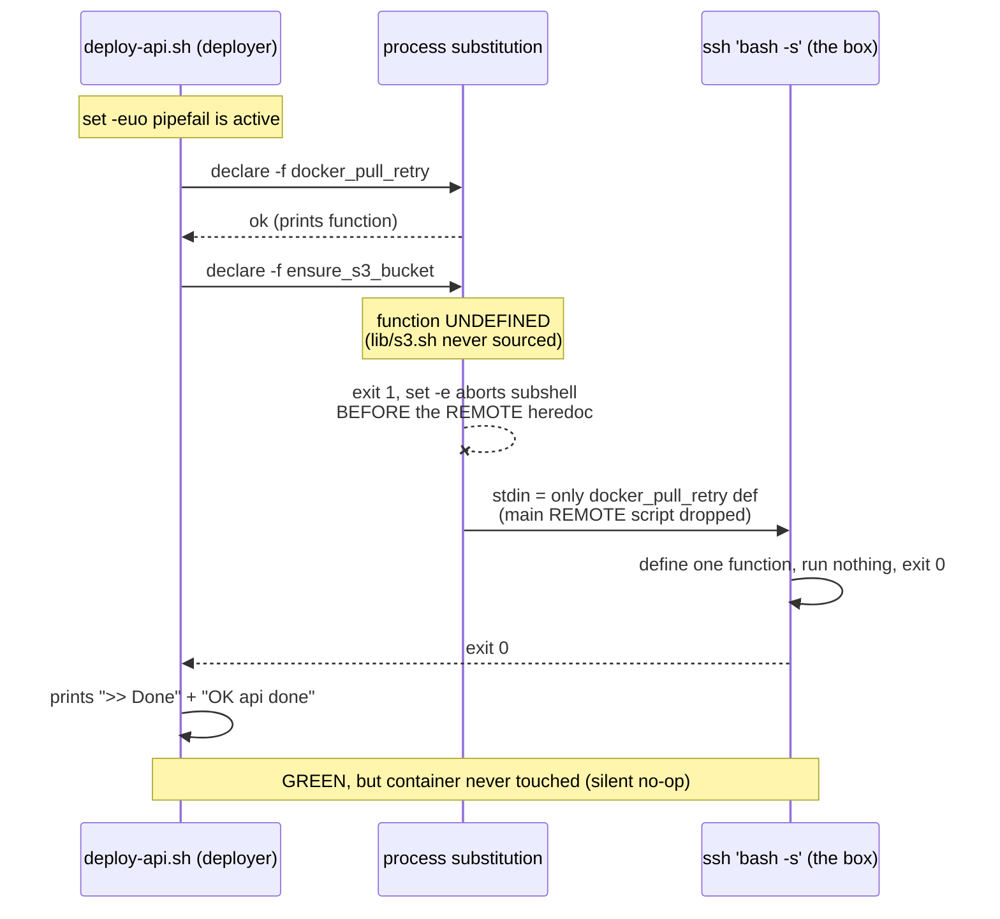
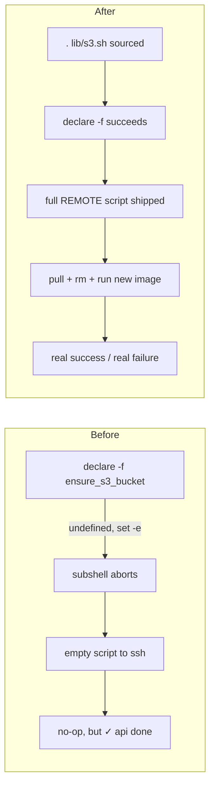

# Beta AI-Agent tab error & login bounce — stale API from a silent deploy no-op

**Date:** 2026-09-24
**Environment:** UAT (`https://beta.leocdp.com`)
**Severity:** High — multiple admin tabs unusable; new API code never reached the box
**Status:** Fixed & verified (API redeployed; two deploy-script bugs fixed on `main`)

---

## 1. Symptoms

Reported by the user while working in the admin UI on beta:

| Tab / action | Browser-reported error |
|---|---|
| Login | "keeps sending me back to the login screen" (intermittent) |
| AI Agents | `HTTP 404 … (loading AI agents). Detail: Not Found` |
| Data Sources | `HTTP 404 … (loading data sources). Detail: Not Found` |
| Attributes | `HTTP 500 … (loading attributes). Internal Server Error` |

All errors surface through the frontend API client
(`customer360-frontend/static/js/common/config.js` → `showApiError`), hitting
`https://beta.leocdp.com/c360api/api/v1`.

---

## 2. Root cause (one sentence)

**Beta's `customer360-api` container was running a stale image** that predated the
`ai-agents` and `data-source` routers, because **`deploy-api.sh` had a silent no-op**:
it never sourced `lib/s3.sh`, so `declare -f ensure_s3_bucket` failed under
`set -euo pipefail`, which aborted the process substitution *before* the remote
script was emitted — so the SSH session pulled/restarted **nothing** yet the step
still printed `✓ api done`. Every "successful" CD run left the old container in place.

---

## 3. How it was diagnosed

### 3.1 The key heuristic: auth runs *before* routing

`customer360-api` applies `auth_middleware` before FastAPI route matching. That makes
the HTTP status a **routing probe**:



- A **tokenless** `curl` returned `401` → looked like the route existed.
- The user's **logged-in** request returned `404` → the route did **not** exist on
  the deployed image. A valid token passes the gate, then routing fails.

### 3.2 Confirming staleness three independent ways

1. Current `main` wires the routers correctly
   (`customer360-api/core/apps/http_api_app.py` `_include_api_routers` applies
   `/api/v1` to `all_ai_agent_routers` + `all_data_source_routers`) — so it is **not**
   a code bug.
2. Live `/c360api/health` returned only `{"status":"ok","database":"reachable","sso_login":true}`
   — **missing** `GIT_COMMIT_HASH`/`BUILD_DATE_TIME`, which HEAD's `/health` adds.
3. Git history: the deployed image predated `f346eed` (AI-agent router), `9e59855`
   (data-source router), and `35e7fb4` (health commit hash).

### 3.3 Finding the silent no-op

Re-dispatching CD (`gh workflow run cd.yml`) reported **success in ~2 min**, yet
`/health` still lacked the commit hash. The `api` deploy step's remote block produced
**zero output** (no "reclaiming disk", no "pulling", no "running: customer360-api") in
~3 seconds, then printed `✓ api done`. That pattern = the remote `bash -s` received an
**empty/truncated script**.



A second bug was hiding behind the first: once `s3.sh` was sourced and the remote
script actually ran, it failed with `srv_ip: command not found` (exit 127) —
`AGENT_IP="$(srv_ip agent fixed_ip)"` was executed **inside** the remote heredoc, but
`srv_ip` is a deployer-local function that was never shipped to the box.

---

## 4. The fixes

Two commits on `main`, both in `deployments/server/deploy-api.sh`:

| Commit | Fix |
|---|---|
| `3053c59` | Source `lib/s3.sh` (like `deploy-backend.sh` / `deploy-tracking.sh` already do) so `declare -f ensure_s3_bucket` succeeds and the full remote script is shipped. |
| `b00e2a0` | Resolve `AGENT_SERVICE_URL` + `AGENT_API_TOKEN` **on the deployer** and pass them through `ARGV_B64` (token base64'd), removing the remote `srv_ip` call. Also fixes `AGENT_API_TOKEN` never reaching the API. |



**Why it was `deploy-api.sh`-specific:** `deploy-backend.sh` and `deploy-tracking.sh`
both already `source lib/s3.sh`, so only the API service silently failed to update —
which is why the frontend (deployed fine) outran the API.

---

## 5. Deployment & verification

1. Landed both fixes on `main` (CD checks out deploy scripts at `github.sha`, i.e.
   main HEAD — decoupled from the image tag).
2. `gh workflow run cd.yml -f environment=uat -f image_tag=sha-35e7fb41df00b02c54307b856be640bd7ed176e9 -f services=api`
   (the existing current-code image; `db-schema` had already re-applied all migrations
   in an earlier run, covering the Attributes 500).
3. **Verified the box, not the green check** — `GET /c360api/health`:

   ```json
   {"status":"ok","database":"reachable","sso_login":true,
    "BUILD_DATE_TIME":"2026-09-24T02:41:42Z",
    "GIT_COMMIT_HASH":"35e7fb41df00b02c54307b856be640bd7ed176e9"}
   ```

   `GIT_COMMIT_HASH` now matches HEAD → the current image is live → `ai-agents` /
   `data-source` routes exist; Attributes schema re-applied.

> ⚠️ **CI/CD gotcha observed:** pushing a deploy-script-only commit to `main` triggers
> an auto-CD for uat that shares the `cd-uat` concurrency group and pins
> `tag=sha-<newSHA>` — a SHA with **no built service images** (CI only builds *changed*
> services). It collides with / cancels a manual dispatch. Wait for any in-flight
> auto-CD to finish, then dispatch the manual run pinned to a SHA whose image exists.

---

## 6. Login redirect loop — RESOLVED by the redeploy

**Update:** after the API redeploy, login works. The loop shared the same root cause —
the stale image's auth path was rejecting the session; running the current image fixed
it. No separate change was needed. (Kept the analysis below for reference.)

The loop is the frontend force-logging-out on **any** `401` and reloading:

```js
// common/config.js — api()
request.fail(function (xhr) {
  if (xhr.status === 401) { C360.config.logout(function(){ window.location.reload(); }); }
});
```

After sign-in, if one protected call returns `401`, the app logs out → back to login.
Candidates (distinguished by the 401 `detail` string):

- `"Tenant context could not be resolved"` — the Keycloak user lacks the `tenant_id`
  attribute. `_resolve_tenant_and_user` in `core/auth.py` **fails closed** without it;
  only the seeded `c360admin` gets the attribute via `bootstrap-realm.py`.
- `"Invalid or expired token"` — introspection/session expiry (feels like periodic
  re-login).
- `"Authentication required"` — no token sent.

**Next step:** with the API now current, re-test login; if it still bounces, capture the
`detail` of the `401` that fires just before the bounce and address that specifically.

---

## 7. Follow-ups / hardening (optional)

- **Post-deploy assertion:** have `deploy-api.sh` (or CD) fail if
  `/health.GIT_COMMIT_HASH` ≠ the deployed SHA — turns any future silent no-op into a
  loud failure. HEAD already exposes the hash; only the check is missing.
- **`declare -f` fragility:** any future undefined function in that `declare -f` list
  re-introduces the same silent truncation. Consider guarding it or asserting non-empty
  stdin to the remote `bash -s`.
- **Deploy-only commits vs auto-CD:** the `tag=sha-<newSHA>` auto-CD on a commit that
  builds no images will now fail loudly on the pull — decide whether to skip CD for
  `deployments/**`-only changes.
