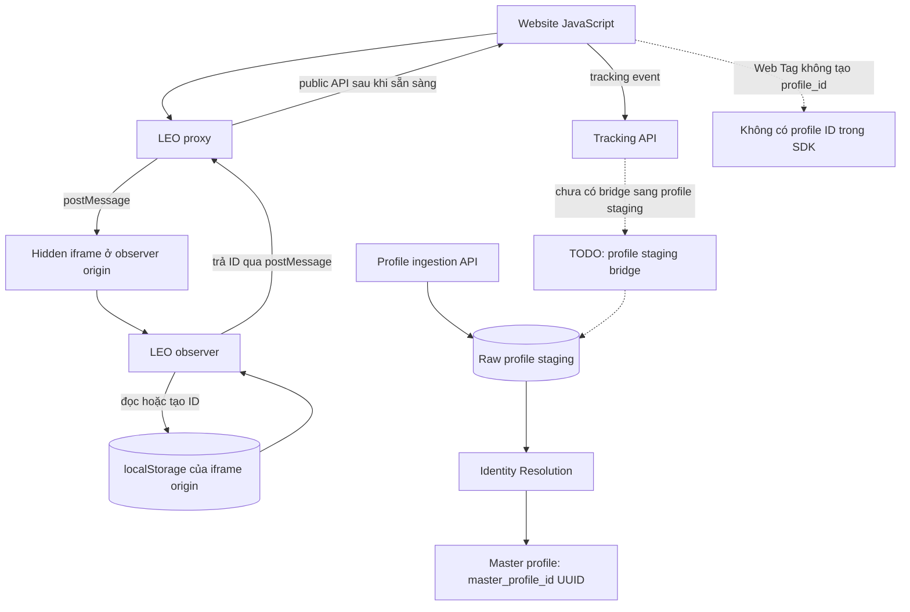
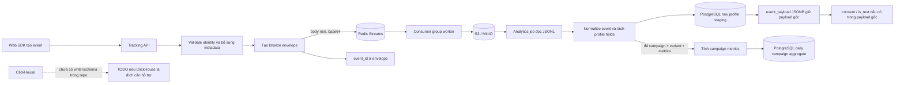
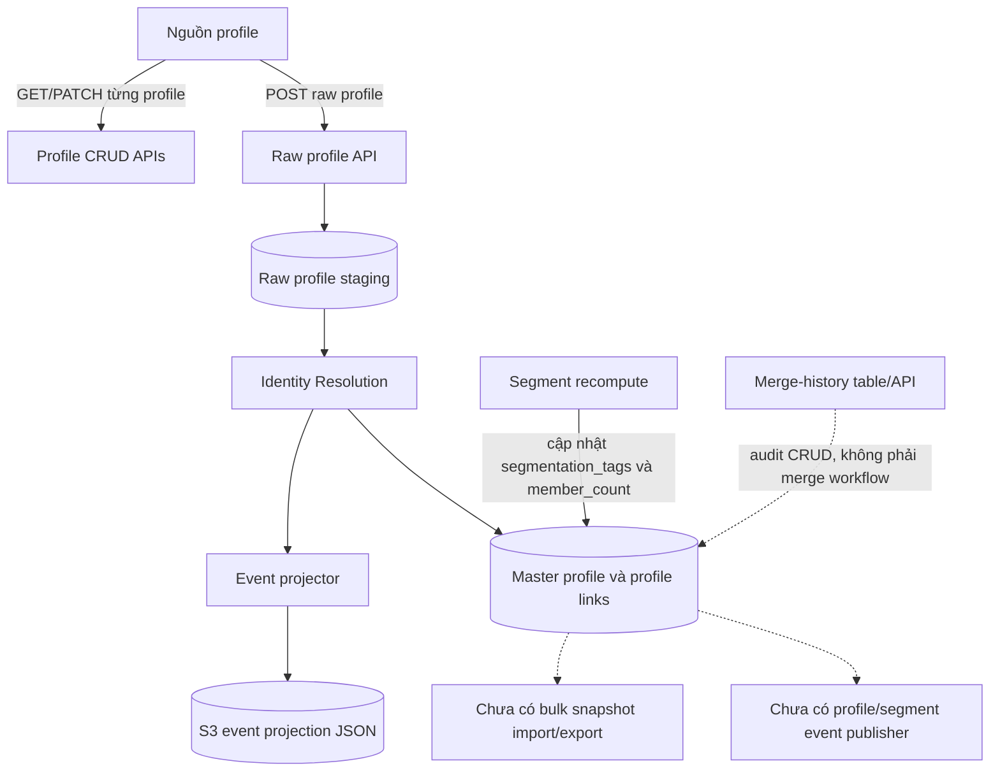
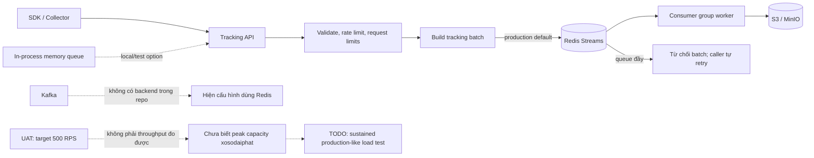
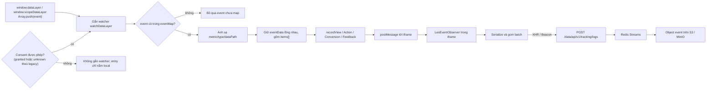
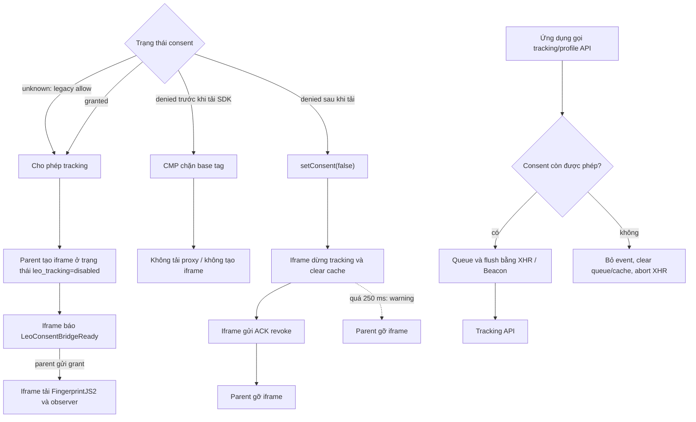

# Câu hỏi và kết quả kiểm tra scope LeoCDP

> Kết luận dưới đây dựa trên source trong repository này. Kết quả benchmark
> là dữ liệu của lần chạy được ghi lại, không phải cam kết cho production.
> Mỗi câu hỏi có sơ đồ, câu trả lời và source; TODO chỉ xuất hiện khi còn
> chức năng chưa được triển khai.

Main source code: [LEO-CDP/leo-customer360](https://github.com/LEO-CDP/leo-customer360)

## Q01. Định dạng và khả năng truy xuất các ID của LeoCDP

### Sơ đồ luồng



### Câu trả lời

- **Visitor ID**: SDK gọi ID này là `anonymous_id`. Nếu không được inject,
  nó tạo 16 byte ngẫu nhiên và biểu diễn thành 32 ký tự hex không dấu gạch
  nối; nếu ứng dụng cung cấp `window.injectedVisitorId` hợp lệ, giá trị đó
  được ưu tiên. Vì vậy, ID inject không nhất thiết có format UUID.
- **Session ID**: SDK gọi nội bộ là `sessionKey` và gửi lên dưới tên
  `session_id`. Nó là UUID v5, tạo từ time bucket, fingerprint thiết bị và
  `anonymous_id`, với UUID của data source làm namespace.
- **Profile ID**: Web Tag không tạo hoặc gửi `profile_id`/`master_profile_id`.
  Backend dùng `master_profile_id` UUID trên bảng
  [`cdp_master_profiles`](https://github.com/LEO-CDP/leo-customer360/blob/main/customer360-database/database-schema.sql#L685).
  SDK có thể gửi profile attributes; việc đưa chúng vào raw profile staging
  và resolve thành master profile là luồng riêng.
- **Đọc bằng JavaScript**: sau khi proxy sẵn sàng, dùng
  `LeoObserverProxy.getAnonymousId()` hoặc `getSessionKey()`. ID nằm trong
  storage của iframe; page không nên cố đọc trực tiếp storage đó.
- **Cookie và subdomain `go.` của Google Analytics**: source không lưu visitor ID trong cookie. SDK dùng
  `localStorage` của hidden iframe tại observer origin: key logic
  `leocdp_vid` (lscache thêm prefix `leocache-`); session key dùng
  `leoctxsk`. `localStorage` chỉ truy cập được từ cùng origin, nên
  JavaScript ở website hoặc subdomain `go.` không thể đọc trực tiếp nếu
  khác origin với iframe. Dùng public API hoặc inject ID để trao đổi.

### TODO cho dev

1. Chốt contract công khai cho `anonymous_id`/`visitor_id`,
   `session_id` và `master_profile_id`, gồm format, lifetime và cách truyền.
2. Nếu cần ID tại `go.` hoặc subdomain khác, thiết kế bridge đồng bộ có
   kiểm soát và đánh giá privacy; không truy cập chéo `localStorage`.
3. Hoàn thiện, kiểm thử bridge profile update từ Web SDK sang raw profile
   staging; hiện API đó chưa được nối trực tiếp với Tracking API.

### Source

- [leo.observer.js](https://github.com/LEO-CDP/leo-customer360/blob/main/customer360-event-api/static/c360-web-sdk/observer/leo.observer.js#L795):
  visitor/session storage key, sinh visitor ID và tạo session UUID v5.
- [leo.proxy.js](https://github.com/LEO-CDP/leo-customer360/blob/main/customer360-event-api/static/c360-web-sdk/observer/leo.proxy.js#L171):
  tạo iframe, nhận ID qua `postMessage` và cung cấp accessor public.
- [identity.py](https://github.com/LEO-CDP/leo-customer360/blob/main/customer360-dao/src/leo_customer360_dao/models/identity.py#L35):
  `master_profile_id` là UUID với default từ PostgreSQL.
- [identity_api.py](https://github.com/LEO-CDP/leo-customer360/blob/main/customer360-api/core/routers/identity_api.py#L522):
  raw profile API; [cdp-web-sdk-tracking.md](https://github.com/LEO-CDP/leo-customer360/blob/main/docs/data-sources/cdp-web-sdk-tracking.md#L75)
  mô tả phần bridge event/profile staging còn là integration task.

## Q02. Bảo toàn thông tin event khi truyền qua hệ thống

### Sơ đồ luồng



### Câu trả lời

- **Luồng hiện tại**: Tracking API xếp batch vào Redis Streams, worker ghi
  object JSONL gzip vào S3/MinIO. Analytics job đọc các object này, chuẩn hóa
  từng event, upsert raw profile vào PostgreSQL và có thể cập nhật bảng
  campaign metrics. S3/MinIO vẫn là nơi giữ raw event stream đầy đủ.
- **Được giữ trong [`cdp_raw_profiles_stage`](https://github.com/LEO-CDP/leo-customer360/blob/main/customer360-database/database-schema.sql#L1222)**:
  - Các cột được map gồm tenant/data source/domain/source/channel; các
    identity và profile fields như email, phone, name, address, device IDs,
    `anonymous_id`, `session_id`, fingerprint; attribution như media source,
    campaign và UTM; `event_name` và `event_time`.
  - Payload gốc của event được giữ trong `event_payload` (JSONB). Vì vậy
    custom/nested properties, gồm `consent` hoặc `is_test` nếu nằm trong
    payload, vẫn có thể còn ở JSONB; chúng không thành cột riêng.
  - `data_source_analytics` lưu số liệu profile/source được tính từ Redis.
- **Được chuẩn hóa trước khi ghi**: tenant và data source lấy từ context của
  analytics job; text identity được trim; `event_id` được chuẩn thành UUID
  (thiếu/sai format thì tạo UUID xác định); `event_time` đổi sang UTC và
  dùng `received_at` làm fallback nếu thiếu; `event_category` được uppercase
  hoặc gán `GENERAL`; `external_customer_id` mặc định lấy từ `anonymous_id`
  nếu không có giá trị riêng. Campaign/variant ID sai UUID làm record lỗi,
  không được âm thầm chấp nhận.
- **Không được giữ đầy đủ như event-level columns trong raw profile table**:
  - `raw_profile_id` thường được tạo theo identity trong tenant/data source
    (nếu không tìm thấy identity thì dùng event ID). Khi event mới hơn hoặc
    cùng thời điểm tới cùng ID, upsert thay `event_name`, `event_time` và
    `event_payload`; PostgreSQL staging không giữ lịch sử mọi event như S3.
  - Các giá trị chỉ có ở envelope như `event_id`, `received_at`,
    `device_type`, `event_category`, `event_dedup_key`, campaign/variant ID
    không được map hết thành cột staging. Chúng chỉ còn trong JSONB nếu cũng
    có trong payload gốc. Riêng `event_id` không có cột riêng; `received_at`
    chỉ làm fallback cho `event_time`, không được giữ riêng.
  - `ip_address` và `user_agent` được tạo trong raw-profile mapping nhưng
    không nằm trong DAO upsert allowlist nên không được ghi thành cột qua
    pipeline này. Nếu chúng cũng có trong payload gốc thì JSONB có thể vẫn
    chứa bản đó.
- **Campaign metrics** được ghi riêng vào
  [`crm_campaign_performance_daily`](https://github.com/LEO-CDP/leo-customer360/blob/main/customer360-database/database-schema.sql#L430):
  chỉ khi event có campaign ID, variant ID,
  event date và metric hợp lệ, đồng thời variant thuộc campaign đó. Bảng này
  lưu tổng hợp spend/impressions/clicks/conversions/revenue theo ngày, không
  lưu từng event. Vì vậy không thể xem nó là bản sao đầy đủ của S3.
- Repository chưa có ClickHouse writer/schema. Nếu cần ClickHouse, cần
  triển khai và kiểm thử pipeline cùng schema; chỉ thêm một connector đơn
  lẻ chưa đủ để bảo đảm giữ đúng dữ liệu.

- **`event_id`**: nếu client gửi ID không rỗng, envelope dùng giá trị đã
  trim; event gốc trong `payload` vẫn được giữ. Nếu thiếu, storage tạo ID
  UUID xác định cho envelope. Tùy dữ liệu identity/metadata đi kèm, service
  cũng có thể thêm ID dẫn xuất vào event trước khi lưu.
- **`consent` và `is_test`**: API không định nghĩa hoặc validate riêng hai
  field này. Nếu được gửi bên trong event JSON, chúng được giữ trong event
  gốc (`payload`); SDK có thể đặt custom attributes bên trong `event_data`.
  Chúng không được chuẩn hóa thành field top-level trong envelope.

### TODO cho dev

1. Nếu cần ClickHouse, triển khai consumer/bridge và schema cho
   `event_id`, `consent`, `is_test`; quy định type, nullability và version.
2. Nếu cần lịch sử đầy đủ trong PostgreSQL, thiết kế event-level table thay
   vì dùng một raw-profile row có `event_payload` được upsert theo identity.
3. Thêm integration tests xác nhận field mapping, các trường bị bỏ khỏi
   staging, và việc giữ `consent`/`is_test` trong JSONB.

### Source

- [schemas.py](https://github.com/LEO-CDP/leo-customer360/blob/main/customer360-event-api/core/schemas.py#L45):
  request chứa danh sách event dạng dynamic JSON.
- [service.py](https://github.com/LEO-CDP/leo-customer360/blob/main/customer360-event-api/core/service.py#L104):
  enrich event và tạo ID khi có thông tin batch cần enrich.
- [storage.py](https://github.com/LEO-CDP/leo-customer360/blob/main/customer360-event-api/core/storage.py#L48):
  tạo event envelope, ID top-level và giữ event gốc trong `payload`.
- [redis_queue.py](https://github.com/LEO-CDP/leo-customer360/blob/main/customer360-event-api/core/redis_queue.py#L89):
  đưa object đã nén vào Redis Streams; [README.md](https://github.com/LEO-CDP/leo-customer360/blob/main/customer360-event-api/README.md#L4)
  mô tả luồng Redis → S3.
- [tracking_log_service.py](https://github.com/LEO-CDP/leo-customer360/blob/main/customer360-backend/analytics/source_analytics/tracking_log_service.py#L318):
  đọc object S3, upsert raw profile và xử lý campaign metrics.
- [event_records.py](https://github.com/LEO-CDP/leo-customer360/blob/main/customer360-backend/analytics/source_analytics/event_records.py#L146)
  chuẩn hóa event; [event_records.py](https://github.com/LEO-CDP/leo-customer360/blob/main/customer360-backend/analytics/source_analytics/event_records.py#L452)
  map event sang raw profile.
- [identity_repository.py](https://github.com/LEO-CDP/leo-customer360/blob/main/customer360-dao/src/leo_customer360_dao/repositories/identity_repository.py#L16)
  định nghĩa DAO allowlist; [identity_repository.py](https://github.com/LEO-CDP/leo-customer360/blob/main/customer360-dao/src/leo_customer360_dao/repositories/identity_repository.py#L192)
  upsert và chỉ cập nhật event payload khi event mới hơn/cùng thời điểm.
- [repositories.py](https://github.com/LEO-CDP/leo-customer360/blob/main/customer360-backend/analytics/source_analytics/repositories.py#L97):
  tổng hợp campaign metrics; schema được định nghĩa tại
  [`cdp_raw_profiles_stage`](https://github.com/LEO-CDP/leo-customer360/blob/main/customer360-database/database-schema.sql#L1222)
  và [`crm_campaign_performance_daily`](https://github.com/LEO-CDP/leo-customer360/blob/main/customer360-database/database-schema.sql#L430).

## Q03. Trao đổi profile snapshot và phát event khi profile thay đổi

### Sơ đồ luồng



### Câu trả lời

- Có API JSON để đọc và thao tác từng master/raw profile cùng profile links,
  domain profiles và timeline. Raw profiles được lưu tại
  [`cdp_raw_profiles_stage`](https://github.com/LEO-CDP/leo-customer360/blob/main/customer360-database/database-schema.sql#L1222).
  Chưa thấy API/file contract chuyên biệt cho **bulk export/import profile snapshot**.
- S3 có JSON **event projection** theo master profile để phục vụ đọc activity
  timeline. Đây là bản chiếu event, không phải profile snapshot export.
- Bảng [`cdp_profile_merge_history`](https://github.com/LEO-CDP/leo-customer360/blob/main/customer360-database/database-schema.sql#L2456)
  có các cột lưu source/target snapshot và có API đọc/tạo bản ghi history.
  Tuy nhiên đây không phải API thực hiện merge:
  source hiện tại không cho thấy workflow master-to-master merge ghi history.
  CIR hiện xử lý raw profile bằng cách link/consolidate vào master profile.
- Segment recompute cập nhật `segmentation_tags`, `member_count` và thời
  điểm tính toán. Không thấy event/outbox/webhook được phát khi profile,
  segment membership hoặc merge thay đổi.

### TODO cho dev

1. Định nghĩa versioned snapshot format, tenant/PII policy, API export/import
   và cơ chế bulk file; có validation, idempotency và dry-run.
2. Nếu cần merge hai master profile, triển khai workflow transactionally,
   ghi merge history/snapshots và hỗ trợ audit hoặc rollback.
3. Thêm transactional outbox/domain events cho profile update, membership
   change và merge; quy định payload, consumer, retry và ordering.

### Source

- [identity_api.py](https://github.com/LEO-CDP/leo-customer360/blob/main/customer360-api/core/routers/identity_api.py#L123):
  master profile API; [identity_api.py](https://github.com/LEO-CDP/leo-customer360/blob/main/customer360-api/core/routers/identity_api.py#L462)
  raw profile API; [identity_api.py](https://github.com/LEO-CDP/leo-customer360/blob/main/customer360-api/core/routers/identity_api.py#L653)
  merge-history API.
- [profile_event_projection.py](https://github.com/LEO-CDP/leo-customer360/blob/main/customer360-backend/identity_resolution/identity_resolution/profile_event_projection.py#L34):
  tạo S3 event projection theo master profile.
- [segmentation.py](https://github.com/LEO-CDP/leo-customer360/blob/main/customer360-dao/src/leo_customer360_dao/crud/segmentation.py#L44):
  recompute membership và cập nhật tags/count.
- [identity.py](https://github.com/LEO-CDP/leo-customer360/blob/main/customer360-dao/src/leo_customer360_dao/models/identity.py#L367):
  merge-history snapshot model; schema table
  [`cdp_profile_merge_history`](https://github.com/LEO-CDP/leo-customer360/blob/main/customer360-database/database-schema.sql#L2456);
  [identity-resolution-paper.md](https://github.com/LEO-CDP/leo-customer360/blob/main/docs/research-papers/identity-resolution-paper.md#L261)
  ghi nhận resolver hiện không ghi bảng này.

## Q04. Cơ chế hàng đợi và năng lực xử lý của LeoCDP Collector

### Sơ đồ luồng



### Câu trả lời

- Tracking API mặc định dùng **Redis Streams** được cấu hình qua
  `REDIS_HOST`, `REDIS_PORT` và `REDIS_PASSWORD`; code không có Kafka
  backend. Không có yêu cầu kỹ thuật trong source hiện tại buộc phải thêm
  Kafka.
- Capacity mặc định là **100.000 batch** trong stream, không phải
  100.000 event/giây. Mỗi request tối đa 1.000 event; batch flush mặc định
  là 200. Khi stream đầy, API từ chối batch để client retry.
- Báo cáo UAT ngày 2026-08-31 chạy 10.000 request theo các step target
  10–500 RPS, với 200 request mỗi step. `ceiling_rps: 500` có nghĩa step
  target cao nhất vượt success threshold, **không chứng minh 500 request/giây
  đã được xử lý**: step target 500 ghi `achieved_rps: 25.2`; giá trị
  `achieved_rps` cao nhất trong report là 105.2 ở target 140 RPS. Đây là
  ramp ngắn, không phải sustained capacity test cho `xosodaiphat`.
  `achieved_rps` của test harness cũng tính thời gian chờ kiểm tra object S3,
  nên không phải phép đo throughput thuần của API.
- Một report UAT khác ghi nhận 16 lỗi `429` ở target 10 RPS; cấu hình mặc
  định rate-limit là 120 request/IP/60 giây. Cần tách throttling ở gateway/IP
  khỏi giới hạn throughput khi benchmark.

### TODO cho dev

1. Benchmark riêng cho peak traffic `xosodaiphat` với payload thật, nhiều
   replica, Redis/S3 production-like, sustained duration, retries và queue
   backlog; báo cáo offered/achieved RPS, event/s, latency và error rate.
2. Dựa trên kết quả đo để đặt capacity/SLO, rate limit, autoscaling và cảnh
   báo queue depth/age; không dùng `ceiling_rps` của ramp report làm SLA.
3. Chỉ thêm Kafka nếu có yêu cầu rõ về retention, partitioning hoặc
   cross-region; khi đó cần thiết kế và kiểm thử migration.

### Source

- [config.py](https://github.com/LEO-CDP/leo-customer360/blob/main/customer360-event-api/core/config.py#L99):
  giới hạn request, backend, stream và capacity mặc định.
- [tracking.py](https://github.com/LEO-CDP/leo-customer360/blob/main/customer360-event-api/core/routers/tracking.py#L45):
  chọn Redis Streams hoặc in-process queue.
- [redis_queue.py](https://github.com/LEO-CDP/leo-customer360/blob/main/customer360-event-api/core/redis_queue.py#L29):
  publish, consumer group, retry và ACK sau khi ghi S3.
- [perf_uat_tracking.py](https://github.com/LEO-CDP/leo-customer360/blob/main/customer360-event-api/tests/perf_uat_tracking.py#L292):
  định nghĩa `ceiling_rps`; [perf_results_ramp.json](https://github.com/LEO-CDP/leo-customer360/blob/main/customer360-event-api/tests/reports/perf_results_ramp.json#L1)
  và [perf_results_10rps.json](https://github.com/LEO-CDP/leo-customer360/blob/main/customer360-event-api/tests/reports/perf_results_10rps.json#L1)
  là các kết quả đã lưu.

## Q05. Khả năng đọc Data Layer và hỗ trợ custom event

### Sơ đồ luồng



### Câu trả lời

- SDK không tự động đọc Data Layer. Có thể gọi
  `LeoObserverProxy.watchDataLayer({ dataLayerName, eventMap })` để theo dõi
  `.push()` của `window.dataLayer` hoặc `window.scopeDataLayer` một cách
  opt-in. Data layer phải tồn tại dưới dạng array trước khi bắt đầu watch;
  nếu thiếu, hàm trả `false` và ghi cảnh báo. `includeExisting: true` tùy
  chọn xử lý các entry đã có; mặc định chỉ theo dõi entry mới.
- **Custom event**: có thể gửi bằng `recordViewEvent`,
  `recordActionEvent`, `recordConversionEvent` hoặc `recordFeedbackEvent`.
  `eventData` được serialize thành JSON; API nhận event dạng dynamic JSON và
  lưu event gốc. Nested objects và arrays như `items[]` được hỗ trợ ở mức
  truyền/lưu dữ liệu, nhưng không có business schema validation riêng.
- `eventMap` chọn tên event và map metric/type/path. Ví dụ `dataPath:
  "ecommerce"` gửi dữ liệu ecommerce lồng nhau; `itemsPath`, `valuePath`,
  `currencyPath` và `transactionIdPath` map các trường conversion. Nested
  arrays được giữ nguyên trong event data.
- Có thể khai báo `window.leoDataLayerConfig` trước khi tải proxy để khởi tạo
  một hoặc nhiều watcher. Watcher chỉ forward event khi consent được phép;
  khi denied, watcher được tháo.
- Hàm `watchDataLayer()` trả về handle có `stop()` để ngừng theo dõi. Mặc định
  chỉ nhận các lần `.push()` mới; `includeExisting: true` bật xử lý các entry
  đã có trong array.

### Ví dụ JavaScript

Ví dụ sau dùng watcher tích hợp sẵn để map purchase event từ Data Layer sang
LEO. Khởi tạo watcher sau khi Data Layer đã được tạo; chỉ push event khi
tracking được phép.

```js
window.dataLayer = window.dataLayer || [];
window.scopeDataLayer = window.scopeDataLayer || [];

window.LeoObserverProxy.watchDataLayer({
  dataLayerName: "scopeDataLayer", // or "dataLayer"
  eventMap: {
    leo_purchase: {
      metricName: "purchase",
      type: "conversion",
      dataPath: "ecommerce",
      transactionIdPath: "ecommerce.transaction_id",
      valuePath: "ecommerce.value",
      currencyPath: "ecommerce.currency",
      itemsPath: "ecommerce.items",
    },
  },
});

window.scopeDataLayer.push({
  event: "leo_purchase",
  ecommerce: {
    transaction_id: "ORDER-2026-1001",
    value: 59.98,
    currency: "USD",
    items: [
      {
        item_id: "SKU-101",
        quantity: 2,
        product: { name: "Mug", tags: ["gift", "kitchen"] },
      },
      { item_id: "SKU-205", quantity: 1 },
    ],
  },
});
```

GTM có thể tiếp tục dùng Custom Event trigger tên `leo_purchase`. Không cấu
hình thêm GTM tag gửi cùng event vào LEO khi SDK watcher đang bật, để tránh
gửi trùng.

### Giới hạn hiện tại

- Event payload là dynamic JSON; SDK không validate business schema hoặc tự
  giới hạn nested depth. Chỉ map event/field cần thiết bằng `eventMap`.
- Khi consent được phép, `watchDataLayer()` chỉ attach vào layer đã tồn tại
  dưới dạng array; nếu chưa có, hàm trả `false` và ghi cảnh báo. Nếu đăng ký
  watcher lúc denied, hãy khởi tạo layer trước khi CMP cấp consent để watcher
  có thể attach lúc đó.

### Source

- [leo.proxy.js](https://github.com/LEO-CDP/leo-customer360/blob/main/customer360-event-api/static/c360-web-sdk/observer/leo.proxy.js#L466)
  và [leo.proxy.js](https://github.com/LEO-CDP/leo-customer360/blob/main/customer360-event-api/static/c360-web-sdk/observer/leo.proxy.js#L534):
  consent gate và Data Layer watcher APIs; [leo.proxy.js](https://github.com/LEO-CDP/leo-customer360/blob/main/customer360-event-api/static/c360-web-sdk/observer/leo.proxy.js#L687)
  serialize custom event data.
- [leo.observer.js](https://github.com/LEO-CDP/leo-customer360/blob/main/customer360-event-api/static/c360-web-sdk/observer/leo.observer.js#L225):
  chuyển event data thành payload; [schemas.py](https://github.com/LEO-CDP/leo-customer360/blob/main/customer360-event-api/core/schemas.py#L45)
  nhận dynamic event dictionaries.
- [README.md](https://github.com/LEO-CDP/leo-customer360/blob/main/customer360-event-api/README.md#L86):
  mô tả dynamic JSON có nested objects và arrays.

## Q06. Request khi người dùng từ chối consent

### Sơ đồ luồng



### Câu trả lời

- Consent contract là `window.leoTrackingConsent`: `false` chặn, `true` cho
  phép; nếu chưa đặt, SDK giữ legacy allow để tương thích. CMP nên đặt giá
  trị trước khi tải proxy script; khi quyết định thay đổi, gọi
  `LeoObserverProxy.setConsent(true|false)`.
- Nếu denied trước khi proxy chạy, proxy script vẫn được tải nếu trang tự
  include nó; nhưng không tạo iframe, không tải FingerprintJS2/observer trong
  iframe, không khởi tạo identity và không gửi tracking/profile/
  personalization request. Nếu consent được cấp, parent tạo iframe ở trạng
  thái disabled; chỉ tải fingerprint/observer sau khi parent nhận
  `LeoConsentBridgeReady` và gửi grant. Để chặn cả request tải proxy JS từ
  CDN, CMP phải chặn tag trước đó.
- Khi bị từ chối sau khi SDK đã khởi tạo, parent chặn event mới, xóa queue và
  dừng watcher, sau đó gửi lệnh revoke cho iframe. Iframe chặn flush, abort
  XHR, xóa visitor/session/fingerprint/profile cache rồi ACK; parent mới tháo
  iframe. Nếu ACK không về trong 250 ms, parent log cảnh báo và tháo iframe,
  nên không thể xác nhận cache đã được xóa. Beacon đã được browser nhận trước
  khi revoke không thể thu hồi.
- `getContextSession()` chỉ tạo context ở client; flow hiện tại không gọi API
  cấu hình/session-init riêng.

### Cách dùng với CMP

Đặt trạng thái ban đầu trước khi thêm script SDK. Thay `cmpDecision` bằng kết
quả từ CMP: `true` là granted, `false` là denied, `null` là chưa có quyết
định. Khi CMP đổi trạng thái, gọi handler tương ứng:

```js
var cmpDecision = null; // Thay bằng trạng thái thực tế từ CMP.

function loadLeoProxy() {
  if (window.LeoObserverProxy) {
    window.LeoObserverProxy.setConsent(true);
    return;
  }
  if (document.querySelector("script[data-leo-observer]")) return;

  var sdkScript = document.createElement("script");
  sdkScript.dataset.leoObserver = "true";
  sdkScript.src = "https://YOUR_CDN_DOMAIN/js/leo-observer/leo.proxy.js";
  document.head.appendChild(sdkScript);
}

function onCmpConsentChanged(granted) {
  window.leoTrackingConsent = granted === true;
  if (window.LeoObserverProxy) {
    window.LeoObserverProxy.setConsent(granted === true);
  } else if (granted === true) {
    loadLeoProxy();
  }
}

if (cmpDecision === false) {
  window.leoTrackingConsent = false;
} else if (cmpDecision === true) {
  window.leoTrackingConsent = true;
} else {
  // Leave unset to retain the legacy allow behavior while consent is unknown.
  delete window.leoTrackingConsent;
}

if (cmpDecision !== false) loadLeoProxy();
```

Nếu chính sách yêu cầu không có request nào tới LEO khi denied, không tải
proxy script ở trạng thái denied. Khi CMP chưa quyết định, ví dụ trên vẫn
allow theo mặc định tương thích; hệ thống cần quyết định rõ có chấp nhận
behavior này hay không. Tracking API hiện không nhận hoặc enforce consent
state ở server.

### Source

- [leo.proxy.js](https://github.com/LEO-CDP/leo-customer360/blob/main/customer360-event-api/static/c360-web-sdk/observer/leo.proxy.js#L176),
  [leo.proxy.js](https://github.com/LEO-CDP/leo-customer360/blob/main/customer360-event-api/static/c360-web-sdk/observer/leo.proxy.js#L279),
  [leo.proxy.js](https://github.com/LEO-CDP/leo-customer360/blob/main/customer360-event-api/static/c360-web-sdk/observer/leo.proxy.js#L466)
  và [leo.proxy.js](https://github.com/LEO-CDP/leo-customer360/blob/main/customer360-event-api/static/c360-web-sdk/observer/leo.proxy.js#L588):
  disabled iframe startup, revoke ACK/fallback và parent consent bridge.
- [cdp-event-proxy.html](https://github.com/LEO-CDP/leo-customer360/blob/main/customer360-event-api/static/c360-web-sdk/html/cdp-event-proxy.html#L30),
  [cdp-event-proxy.html](https://github.com/LEO-CDP/leo-customer360/blob/main/customer360-event-api/static/c360-web-sdk/html/cdp-event-proxy.html#L411),
  [cdp-event-proxy.html](https://github.com/LEO-CDP/leo-customer360/blob/main/customer360-event-api/static/c360-web-sdk/html/cdp-event-proxy.html#L444)
  và [cdp-event-proxy.html](https://github.com/LEO-CDP/leo-customer360/blob/main/customer360-event-api/static/c360-web-sdk/html/cdp-event-proxy.html#L955):
  child consent gate, storage cleanup, revoke ACK và bridge-ready notification.
- [leo.observer.js](https://github.com/LEO-CDP/leo-customer360/blob/main/customer360-event-api/static/c360-web-sdk/observer/leo.observer.js#L53)
  và [leo.observer.js](https://github.com/LEO-CDP/leo-customer360/blob/main/customer360-event-api/static/c360-web-sdk/observer/leo.observer.js#L1460):
  XHR abort, queue/cache clearing và tracking consent guards.
- [cdp-web-sdk-tracking.md](https://github.com/LEO-CDP/leo-customer360/blob/main/docs/data-sources/cdp-web-sdk-tracking.md#L646):
  CMP integration and consent deployment guidance.
