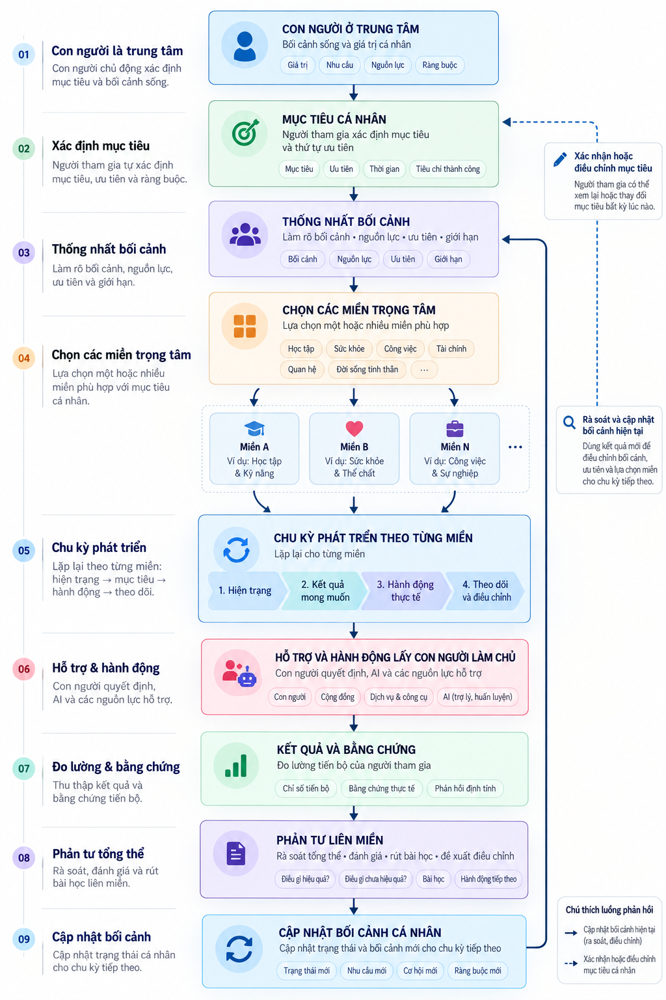
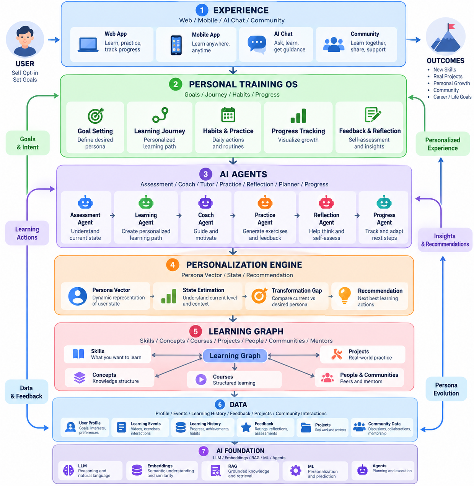

# Lời mở đầu {.unnumbered}

**Bản tiếng Anh:** [English edition](human_persona_as_dynamic_vector_en.md)
([PDF A4](human_persona_as_dynamic_vector_en.pdf)).

Một người không trở thành người học chủ động chỉ vì đã đăng ký khóa học.
Một khách hàng không đạt sự an toàn tài chính chỉ vì mở thêm tài khoản.
Một người mua không hiểu rõ sản phẩm chỉ vì hoàn tất thanh toán. Một người
muốn vận động đều đặn không có thói quen mới chỉ vì sở hữu thẻ phòng tập.
Những giao dịch này có thể hữu ích, nhưng chúng chưa trả lời được câu hỏi
về sự thay đổi có ý nghĩa trong đời sống của người tham gia.

Cuốn sách này bắt đầu từ câu hỏi khác: **trong hành trình do chính mình
chọn, một người đang ở trạng thái nào, muốn tiến tới trạng thái nào và cần
được hỗ trợ như thế nào?** Câu trả lời không thể là một nhãn cố định như
“khách hàng tiềm năng”, “người mới” hay “người thiếu động lực”. Nó cần
một biểu diễn có thời gian, ngữ cảnh, bằng chứng và giới hạn.

*Human Persona as dynamic Vector* phát triển từ bài nghiên cứu
[Persona như một Vector](persona_as_a_vector_marketing_8.0_vi.md).
Đây là bản sách độc lập, không phải bản sao bài báo được dàn trang lớn hơn.
Các khái niệm được tách thành chương; toán học được xây dựng từ phép đo
đến quyết định; bốn lĩnh vực có thiết kế ứng dụng, tình huống thất bại và
cách mở rộng riêng. Bài báo gốc được giữ lại để đối chiếu lịch sử ý tưởng.

“Marketing 8.0” trong sách là khung đề xuất của tác giả về cá nhân hóa hướng
chuyển hóa, không phải một tiêu chuẩn được công nhận hay tên một ấn bản
chính thức của người khác. Các lý thuyết tâm lý được dùng để đặt câu hỏi
và chỉ ra giới hạn, không để tuyên bố rằng học máy có thể đọc toàn bộ
tâm trí. Mọi nhân vật, vector và số liệu tình huống trong sách đều là
**tổng hợp**, trừ khi đoạn văn chỉ rõ đó là kết quả của một công trình
được trích dẫn.

Persona là một mô hình phục vụ hỗ trợ, không phải bản chất của con người.
Điểm thấp không làm một người kém giá trị. Một mục tiêu do khách hàng xác
nhận cũng không trao cho doanh nghiệp quyền quan sát hay tác động vô hạn.
Người tham gia có quyền sửa mục tiêu, sửa dữ liệu, từ chối đề xuất và dừng
chương trình. Những quyền này phải hiện diện trong thiết kế hệ thống,
không chỉ trong lời giới thiệu.

## Cách đọc cuốn sách {.unnumbered}

Người làm sản phẩm và vận hành có thể đọc các chương về mục tiêu, vòng
phản hồi, hành động, quản trị rồi chọn chương lĩnh vực. Người làm dữ liệu
nên đọc chương toán học trước các chương ước lượng, hiệu chuẩn và nhân
quả. Giáo viên và huấn luyện viên có thể bắt đầu từ học, thực hành, phản
tư và hai chương về hỗ trợ con người.

Mỗi chương khái niệm trả lời ba câu hỏi: khái niệm là gì, bằng chứng nào
cho phép sử dụng nó, và sử dụng sai sẽ gây vấn đề gì. Các bài tập không
nhằm tạo thêm điểm số về người tham gia. Chúng giúp người thiết kế tự
kiểm tra giả định trước khi một giả định trở thành quyết định tự động.

## Quy ước và xuất bản {.unnumbered}

Ký hiệu $\mathbf{P}$ chỉ trạng thái giả định trong mô hình; dấu mũ
$\hat{\mathbf{P}}$ chỉ ước lượng từ bằng chứng. $\mathbf{P}^{*}$ là điểm
đặt được người tham gia xác nhận. Tọa độ trong $[0,1]$ là thang biểu diễn,
không tự động là xác suất. Kết quả số được làm tròn; mã thực hành dùng
giá trị chưa làm tròn.

Mục lục đầu sách do Pandoc sinh từ `toc: true`, không phải danh sách chương
viết tay. Từ thư mục gốc dự án, xuất bản bằng:

```bash
pandoc docs/research-papers/human_persona_as_dynamic_vector_vi.md \
  --standalone --toc --number-sections --top-level-division=chapter \
  --resource-path=docs/research-papers \
  --pdf-engine=xelatex \
  -o docs/research-papers/human_persona_as_dynamic_vector_vi.pdf
```

Cấu hình trên dùng A4, chữ 11 pt và lề đọc sách thông thường. Số trang
phải được kiểm tra trên PDF đã biên dịch, không suy ra từ số dòng Markdown.
Phụ lục cuối sách trình bày cách kiểm tra nội dung và kích thước trang.

# Con người, persona và giới hạn của một mô hình {#human-persona}

## Từ nhãn đến trạng thái

Một persona trong thiết kế sản phẩm thường là nhân vật đại diện cho một
nhóm người dùng. Nó giúp nhóm thiết kế nhớ nhu cầu và hoàn cảnh sử dụng.
Trong sách này, persona có nghĩa hẹp hơn: một biểu diễn trạng thái của
một người cụ thể trong một hành trình cụ thể, được ước lượng tại một thời
điểm từ dữ liệu có quyền sử dụng.

Hai nghĩa không thay thế nhau. Nhân vật đại diện hỗ trợ thảo luận thiết
kế; vector trạng thái hỗ trợ thích ứng theo thời gian. Một người có thể
thuộc cùng nhóm khách hàng trong nhiều năm nhưng có trạng thái ý định
mua, nhu cầu hỗ trợ và điều kiện thực hành thay đổi từng tuần.

Ví dụ, Linh xem nhiều bài giảng về phân tích dữ liệu. Nhãn “người học tích
cực” có vẻ hợp lý nếu chỉ nhìn thời gian xem. Nhưng Linh chưa tự xử lý được
một tập dữ liệu. Một biểu diễn đa chiều có thể đồng thời ghi nhận quan tâm
cao, thực hành thấp và nhu cầu hướng dẫn chưa được đáp ứng. Cách nhìn này
mở ra đề xuất khác: một bài thực hành nhỏ, không phải thêm mười video.

## Mô hình không phải con người

Một bản đồ hữu ích vì bỏ bớt chi tiết. Vector persona cũng vậy. Nó không
thể chứa toàn bộ ký ức, phẩm giá, văn hóa, quan hệ, ý nghĩa và sự mâu thuẫn
nội tâm của một người. Tọa độ chỉ có nghĩa trong bộ tiêu chí cụ thể. Không
thể lấy điểm của hành trình tập luyện để kết luận về năng lực nghề nghiệp.

Hệ thống phải phân biệt bốn lớp:

| Lớp | Ví dụ | Điều không được suy ra |
|---|---|---|
| Sự kiện | Linh nộp hai bài thực hành | Linh đã thành thạo |
| Đặc trưng | Hai bài trong cửa sổ 30 ngày | Một tính cách cố định |
| Ước lượng | Hành vi thực hành còn hạn chế | Linh “lười” |
| Quyết định | Đề xuất bài nhỏ có hỗ trợ | Ép Linh đăng ký thêm |

Sự phân biệt này tạo khả năng giải thích và sửa sai. Khi người tham gia
nói rằng hai bài nộp bị thiếu vì hệ thống ghi nhận lỗi, hệ thống cần sửa
sự kiện và tính lại đặc trưng, không chỉ thay nhãn để làm người đó hài lòng.

## Không có persona phổ quát

Một người có thể có nhiều persona theo miền: học tập, tài chính, tiêu dùng
và vận động. Chúng có thể liên quan nhưng không được tự động hợp nhất.
Thông tin từ một chương trình học không đương nhiên được phép dùng để bán
tín dụng. Ngay cả khi cùng một doanh nghiệp có nhiều dịch vụ, mục đích sử
dụng và quyền truy cập vẫn cần tách biệt.

Chất lượng mô hình không chỉ nằm ở dự đoán tốt hơn. Mô hình cần làm rõ nó
không biết gì, khi nào đã cũ, ai có thể sửa và quyết định nào bị cấm. Một
biểu diễn ít chiều nhưng có nguồn bằng chứng và quyền sửa thường đáng
tin hơn một embedding rất lớn mà không ai giải thích được.

**Bài tập.** Chọn một nhãn đang dùng trong tổ chức. Viết lại nó thành ba
quan sát có thời gian và một giả thuyết có thể bác bỏ. Xác định một quyết
định mà nhãn cũ có thể gây ra sai, rồi thiết kế cách người tham gia phản
bác giả thuyết đó.

# Nền tảng tâm lý: bản sắc, môi trường và sự tự quyết {#psychology}

## Những tiền lệ cần phân biệt

Jung dùng persona để nói về gương mặt xã hội, không phải toàn bộ tâm lý
con người. Điểm hữu ích cho thiết kế ở đây là sự khiêm tốn: dấu vết nhìn
thấy được không đồng nhất với trạng thái sâu bên trong. Sách không dùng
Jung như phương pháp chẩn đoán hay như bằng chứng cho bảy tọa độ.

Lewin đặt con người trong mối quan hệ với môi trường. Trực giác này giải
thích tại sao cùng một đề xuất có thể hữu ích hôm nay nhưng gây phiền
ngày mai. Một người có thời gian thực hành cuối tuần có thể không còn
điều kiện đó khi lịch làm việc thay đổi. Nếu mô hình chỉ quy mọi thay đổi
cho động lực cá nhân, nó sẽ bỏ qua nguyên nhân nằm ngoài người tham gia.

Higgins nghiên cứu chênh lệch giữa hình ảnh thực tế, lý tưởng và điều
mình nghĩ phải trở thành. Markus và Nurius bàn về những bản ngã khả dĩ.
Những ý tưởng này giúp hiểu vai trò của mục tiêu tương lai, nhưng không
chứng minh rằng khoảng cách Euclid là phép đo phù hợp cho mọi loại bản
sắc. Chọn metric vẫn là quyết định đo lường cần kiểm định.

## Động lực không phải một nút bấm

Lý thuyết tự quyết của Deci và Ryan nhấn mạnh tự chủ, năng lực và gắn kết.
Trong một sản phẩm hỗ trợ, điều này gợi ý ba yêu cầu thực dụng: người
tham gia được chọn; hoạt động cần vừa sức và tạo bằng chứng về năng lực;
quan hệ hỗ trợ không nên trở thành áp lực tuân thủ.

Các giai đoạn thay đổi của Prochaska và DiClemente cung cấp cách suy nghĩ
về sự sẵn sàng, nhưng không nên dùng như dây chuyền cứng mà mọi người
phải đi qua đúng thứ tự. Một người có thể bắt đầu, dừng, quay lại hoặc
đổi mục tiêu. Đó là thông tin để điều chỉnh chương trình, không phải
lỗi của người tham gia.

## Phép so sánh không phải định luật

Ngôn ngữ “không gian”, “quỹ đạo” và “trường” có thể giúp diễn đạt quan hệ.
Tuy nhiên, thuyết tương đối rộng không cung cấp phương trình marketing
hay quy luật phát triển cá nhân. Sách không cần dùng vật lý như nguồn
thẩm quyền để biện minh cho một thuật toán.

Điểm đặt trong sách đến từ điều khiển phản hồi: nó là giá trị tham chiếu.
Muốn gọi một trạng thái là điểm hút của hệ động lực, phải chứng minh thêm
tính bất biến và sự hội tụ trong điều kiện được nêu rõ. Một mong muốn
của người tham gia chưa đủ tạo ra tính chất đó.

## Chuyển lý thuyết thành câu hỏi kiểm định

| Trực giác | Câu hỏi thiết kế | Cách kiểm tra |
|---|---|---|
| Tự chủ | Người tham gia có lựa chọn thật không? | Quan sát từ chối và rút lui |
| Năng lực | Bài tập tạo năng lực hay chỉ hoàn tất? | Bài chuyển giao độc lập |
| Gắn kết | Cộng đồng hỗ trợ hay gây áp lực? | Phản hồi riêng và quyền rời nhóm |
| Ngữ cảnh | Có nhầm thiếu điều kiện với thiếu động lực? | Phỏng vấn và dữ liệu lịch |

**Bài tập.** Viết một giả thuyết dựa trên mỗi hàng. Nêu kết quả nào sẽ
khiến nhóm thiết kế bỏ giả thuyết đó. Không dùng câu “người dùng thích”
nếu chưa có định nghĩa về cách quan sát sự thích và cách thu nhận phản
hồi trái chiều.

# Self Opt-in: sự đồng ý như điều kiện vận hành {#opt-in}

## Tham gia trước, suy luận sau

Self Opt-in là việc một người tự nguyện tham gia chương trình hỗ trợ
với mục đích và phạm vi hiểu được. Nó không phải điểm persona, cũng không
đồng nghĩa với chấp nhận mọi phương thức thu dữ liệu trong tương lai.
Người đồng ý nhận bài học chưa chắc đồng ý cho phép phân tích hội thoại
để suy luận cảm xúc.

Thiết kế cần tách ít nhất ba lựa chọn: tham gia hành trình, sử dụng từng
nguồn dữ liệu và nhận từng loại tương tác. Các lựa chọn phải có thể thay
đổi. Việc từ chối một nguồn dữ liệu không nên tự động khiến người tham
gia mất quyền tiếp cận dịch vụ cơ bản nếu dịch vụ đó không cần nguồn ấy.

## Một bản ghi có thể kiểm toán

Một bản ghi đồng ý hữu ích gồm người tham gia, tổ chức chịu trách nhiệm,
mục đích, phạm vi dữ liệu, kênh tương tác, phiên bản thông báo, thời điểm
có hiệu lực và trạng thái rút lại. Điều kiện sử dụng dữ liệu phải được
kiểm tra lúc thực hiện hành động, không chỉ lúc tạo kế hoạch.

Ví dụ, Minh đồng ý nhận nhắc lịch vào thứ Hai. Tác tử tạo đề xuất vào
Chủ nhật. Minh rút lại vào sáng thứ Hai. Nếu hệ thống chỉ dựa vào bản
ghi Chủ nhật, nó sẽ gửi một thông điệp không còn được phép. Vì vậy,
hàng đợi thực thi cần kiểm tra quyền hiện hành trước khi gửi.

| Tình huống | Hành vi cần thiết |
|---|---|
| Chưa tham gia | Không khởi động hành trình cá nhân |
| Đồng ý một phần | Chỉ dùng nguồn và kênh được phép |
| Rút lại | Dừng các hành động tương ứng đang chờ |
| Đổi mục đích | Xin xác nhận mới khi cần |
| Không xác định được quyền | Chặn và ghi rõ lý do |

## Rút lại không chỉ là một nút giao diện

Rút lại cần truyền đến lớp suy luận, tác tử, chiến dịch và bên nhận dữ
liệu liên quan. Việc xử lý dữ liệu đã lưu còn phụ thuộc mục đích, nghĩa
vụ lưu giữ và pháp luật áp dụng; không nên hứa xóa mọi thứ tức thì nếu
không thể thực hiện. Điều phải rõ là dữ liệu nào ngừng được dùng, dữ liệu
nào bị xóa, dữ liệu nào còn phải lưu và vì sao.

Các nhật ký kiểm toán không nên giữ lại nguyên văn thông tin nhạy cảm chỉ
để chứng minh rằng hệ thống đã xóa thông tin nhạy cảm. Có thể ghi mã hành
động, phiên bản chính sách và thời điểm xử lý thay cho toàn bộ nội dung.

## Thiết kế để từ chối không bị trừng phạt

Hệ thống học từ quyền từ chối bằng cách ghi nhận giới hạn tương tác, không
đánh tụt “điểm khách hàng”. Không phản hồi cũng không tự động là đồng ý.
Trong miền rủi ro cao, việc không có bằng chứng phù hợp là lý do để hỏi
thêm hoặc chuyển người duyệt, không phải lý do mở rộng quan sát.

**Bài tập.** Vẽ đường đi của một yêu cầu rút lại qua giao diện, kho đồng
ý, tác tử, hàng đợi và nhà cung cấp kênh. Đặt tình huống rút lại xảy ra
giữa lúc đề xuất và lúc gửi. Chỉ ra nơi kiểm tra cuối cùng và bằng chứng
để xác nhận không có thông điệp trái phép.

# Personal Goal: biến khát vọng thành mục tiêu có thể hỗ trợ {#personal-goal}

## Mục tiêu của ai?

Mục tiêu cá nhân phải do người tham gia chọn hoặc đồng tạo rồi xác nhận.
“Tăng tỷ lệ gia hạn” là mục tiêu doanh nghiệp. “Tự phân tích một bộ dữ
liệu và giải thích kết quả” là mục tiêu người học. Hai mục tiêu có thể
cùng đạt, nhưng hệ thống không được thay mục tiêu thứ hai bằng mục tiêu
thứ nhất khi tối ưu.

Một mục tiêu tốt không nhất thiết tối đa hóa một đại lượng. Minh có thể
muốn duy trì vận động phù hợp lịch làm việc, không muốn tập càng nhiều
càng tốt. Trong bán lẻ, kết quả tốt có thể là không mua sản phẩm chưa
phù hợp. Trong ngân hàng, giữ khả năng chi trả có thể quan trọng hơn
tăng số lần chuyển tiền sang tài khoản tiết kiệm.

## Hợp đồng mục tiêu

Hợp đồng mục tiêu là mô tả ngắn, dễ sửa, gồm kết quả có ý nghĩa, chân trời
thời gian, tiêu chí bằng chứng, giới hạn và lịch rà soát. Nó không phải
hợp đồng bảo đảm kết quả. Các tiêu chí là thỏa thuận để cùng quan sát,
không phải công cụ phạt khi người tham gia có thay đổi trong đời sống.

| Thành phần | Ca học tập minh họa |
|---|---|
| Kết quả | Tự làm một dự án phân tích nhỏ |
| Bằng chứng | Bài làm và giải thích độc lập |
| Thời gian | Rà soát sau bốn tuần |
| Giới hạn | Không để AI làm thay toàn bộ |
| Điều kiện | Có máy tính và thời gian thực hành |
| Quyền sửa | Đổi phạm vi dự án khi cần |

## Nhiều mục tiêu và xung đột

Một người có thể muốn học nhanh và giảm thời gian dùng màn hình. Hai
mục tiêu không hoàn toàn đồng hướng. Hệ thống nên đưa đánh đổi ra thảo
luận, không tự chọn trọng số chỉ vì một lựa chọn tạo nhiều tương tác hơn.
Có thể chọn mục tiêu chính, đặt giới hạn cho mục tiêu phụ hoặc tìm phương
án không làm xấu đi mục tiêu quan trọng.

Đổi mục tiêu cần tạo phiên bản mới. Khi Linh chuyển từ dự án lớn sang bài
nhỏ hơn, khoảng cách có thể giảm ngay dù năng lực chưa thay đổi. Dashboard
phải ghi “đổi điểm đặt”, không ghi toàn bộ mức giảm là tiến bộ.

## Mục tiêu không suy ra từ nhấp chuột

Một lần xem trang giá chỉ cho thấy tương tác với trang giá. Nó không xác
nhận rằng khách muốn mua, vay hay giảm cân. Suy luận thụ động có thể là
giả thuyết để hỏi rõ nhu cầu, nhưng không là giấy phép triển khai hành
trình chuyển hóa.

**Bài tập.** Chuyển câu “muốn giỏi tiếng Anh” thành hai hợp đồng mục tiêu
khác nhau: một cho giao tiếp công việc, một cho đọc tài liệu. Nêu cách
thu bằng chứng, thời gian rà soát và quyền đổi mục tiêu. Giải thích tại
sao hai người không nên được đánh giá bằng cùng một số phút học mỗi ngày.

# Vector persona: cấu trúc, từ điển và ý nghĩa tọa độ {#persona-vector}

## Danh sách có thứ tự và có nghĩa

Vector là danh sách tọa độ có thứ tự. Khung minh họa dùng:

$$
\hat{\mathbf{P}}_t=
[\hat V_t,\hat B_t,\hat N_t,\hat I_t,\hat E_t,\hat A_t,\hat R_t].
$$

Bảy chiều là một lựa chọn diễn đạt, không phải bộ đo tâm lý đã được xác
nhận. Chúng lần lượt mô tả sự phù hợp giá trị, hành vi, mức đáp ứng nhu
cầu, ý định, tự tin tự cảm nhận, khát vọng và hỗ trợ quan hệ. Mỗi chiều
cần một từ điển riêng theo miền.

Không chỉ lưu một mảng số. Bản ghi cần có thứ tự chiều, định nghĩa, đơn
vị gốc, quy tắc chuẩn hóa, phiên bản, thời điểm, bằng chứng và độ bất
định. Đổi thứ tự $B$ và $N$ mà không đổi phiên bản có thể làm thuật toán
chọn sai hành động dù tất cả giá trị vẫn nằm trong khoảng hợp lệ.

## Chuẩn hóa không tạo ra tính khách quan

Giả sử $B$ được tính từ số buổi thực hành so với kế hoạch cá nhân. Tỷ lệ
hai trên bốn có thể biểu diễn bằng $0.5$. Nhưng bốn buổi do ai chọn? Hai
buổi có chất lượng thế nào? Có buổi không ghi nhận không? Thang số chỉ
tóm tắt câu trả lời đã chọn; nó không loại bỏ câu hỏi đo lường.

Giá trị cao hơn trong một chiều được định nghĩa là gần tiêu chí đang xét
hơn, không phải tốt hơn vô điều kiện. Không cần đặt mọi mục tiêu bằng
$1$. Một mức thực hành vừa sức có thể là điểm đặt phù hợp hơn mức tối đa.
Với biến có khoảng chấp nhận, có thể dùng khoảng đích thay vì một điểm.

## Biểu diễn lai

Một triển khai có thể giữ phần diễn giải được để trao đổi với người tham
gia và phần embedding để truy xuất tài nguyên. Hai phần có vai trò khác
nhau. Embedding hỗ trợ quan hệ ngữ nghĩa; nó không đương nhiên là thang
đo năng lực hay cơ sở đánh giá phẩm chất.

| Thành phần | Có thể dùng cho | Không tự đủ cho |
|---|---|---|
| Điểm có rubric | Trao đổi tiến bộ | Kết luận nhân quả |
| Embedding | Tìm nội dung liên quan | Chẩn đoán người dùng |
| Nhãn giai đoạn | Điều phối trải nghiệm | Quyết định vĩnh viễn |
| Bằng chứng gốc | Rà soát và sửa sai | Thu dữ liệu vô hạn |

## Kiểm định bộ chiều

Trước khi mở rộng, hỏi từng chiều: nó có định nghĩa rõ không, người tham
gia có hiểu không, có đo lặp lại hợp lý không, có giúp chọn hỗ trợ tốt
hơn không và có được phép sử dụng không? Một chiều dự đoán tốt nhưng
không hợp pháp hoặc gây thao túng không nên được giữ chỉ vì tăng độ chính
xác. Một chiều không đo được cần được loại hoặc thay bằng câu hỏi trực
tiếp, không điền $0.5$ để làm mảng đủ dài.

**Bài tập.** Thiết kế từ điển cho hai chiều trong một miền. Cho hai người
đánh giá cùng ba bằng chứng. Nếu kết quả khác nhau, xác định đó là khác
nhau trong bằng chứng, rubric hay cách diễn giải trước khi sửa thuật toán.

# Values: giá trị như ràng buộc, không phải đích thao túng {#values}

## “Phù hợp” không có nghĩa “giống doanh nghiệp”

$V$ biểu diễn mức phù hợp giữa mục tiêu đang xét và ưu tiên do người
tham gia xác nhận. Nó không chấm một hệ giá trị là đúng hơn hệ khác.
Một khách ưu tiên tiết kiệm, một khách ưu tiên thời gian và một khách
ưu tiên khả năng sửa chữa đều có thể đưa ra lựa chọn hợp lý.

Nguồn tốt nhất thường là lời khai báo có ngữ cảnh. Ví dụ, một người
mua nói: “Tôi ưu tiên máy dễ sửa, không cần mẫu mới nhất.” Hệ thống có
thể dùng thông tin này để lọc đề xuất. Không cần suy ra một tính cách
rộng từ một quyết định tiêu dùng.

## Đưa giá trị vào quyết định

Giá trị có thể trở thành ràng buộc hay thứ tự ưu tiên. Nếu Linh coi trọng
khả năng tự làm, tác tử phải tránh cung cấp lời giải hoàn chỉnh trước
khi Linh thử. Nếu khách hàng coi trọng khả năng chi trả, lựa chọn có giá
cao hơn nhưng “chuyển đổi tốt hơn” có thể không đủ điều kiện.

Thay vì hỏi “làm sao tăng $V$?”, hỏi “hành động này có phù hợp với ưu tiên
đã xác nhận không?”. Quy tắc này giúp phân biệt hỗ trợ mục tiêu với thay
đổi giá trị để phục vụ bán hàng.

| Tình huống | Cách xử lý |
|---|---|
| Ưu tiên đã xác nhận | Dùng để giải thích và lọc |
| Ưu tiên chưa rõ | Hỏi, không suy diễn mạnh |
| Hai ưu tiên xung đột | Trình bày đánh đổi |
| Người tham gia sửa ưu tiên | Tạo phiên bản mới |
| Hành động nhắm thay giá trị cốt lõi | Chặn |

## Giới hạn thu nhận dữ liệu

Không cần hỏi về chính trị, tôn giáo hay đời sống riêng chỉ để tư vấn
một chiếc máy tính. Nguyên tắc tối thiểu hóa yêu cầu giữ câu hỏi trong
phạm vi quyết định cần hỗ trợ. Trường tự do cũng có thể chứa thông tin
nhạy cảm không cần thiết; thiết kế nên hướng người dùng vào ưu tiên cụ
thể thay vì thu một tự truyện dài.

Trong mô hình bảy chiều, $V$ thường được loại khỏi tập chiều hệ thống
nhắm tác động trực tiếp. Tuy nhiên, mặt nạ số không đủ bảo vệ giá trị.
Một thông điệp vẫn có thể tạo áp lực thay ưu tiên dù trường `targets`
không có $V$. Nội dung và cơ chế phân phối cũng cần rà soát.

**Bài tập.** Viết hai lời giải thích cho cùng đề xuất: một minh bạch về
đánh đổi, một tạo cảm giác người dùng “sai” nếu không mua. Chỉ ra từ ngữ
và cấu trúc khiến lời giải thích thứ hai trở thành áp lực. Sau đó sửa
lại mà không thay ưu tiên của khách hàng.

# Behavior: từ sự kiện đến bằng chứng hành vi {#behavior}

## Hành vi phải gắn với kết quả

$B$ mô tả mức hình thành hành vi liên quan đến mục tiêu. Sự kiện nào
được tính phải phụ thuộc mục tiêu. Nếu mục tiêu là tự làm dự án, xem
video là bằng chứng tiếp cận nội dung; bài thực hành và giải thích độc
lập mới gần bằng chứng năng lực hơn.

Một sự kiện tốt cần đối tượng, thời điểm, loại hành động, nguồn và
mã nhận dạng để loại trùng. Số lần nhấp không được cộng như số bài
hoàn thành. Thời gian mở một trang cũng không chứng minh người dùng
đang đọc hay hiểu trang đó.

## Cửa sổ thời gian và cơ hội hành động

Hai người hoàn thành hai buổi trong một tuần không nhất thiết có cùng
mức duy trì: một người đã chọn hai buổi, người kia chọn năm. Tỷ lệ theo
kế hoạch có thể hữu ích, nhưng kế hoạch phải khả thi và không bị chỉnh
để làm đẹp điểm. Cần báo cả mẫu số và cơ hội thực hiện.

Một người không có máy tính trong tuần đó có thể không thể làm bài.
Ghi $B=0$ mà không ghi điều kiện sẽ khiến thuật toán nhầm thiếu cơ hội
với thiếu động lực. Vì vậy, hành vi và ngữ cảnh phải được đọc cùng nhau.

## Chất lượng trước số lượng

| Mục tiêu | Bằng chứng yếu | Bằng chứng gần hơn |
|---|---|---|
| Học phân tích | Xem bài giảng | Tự xử lý và giải thích |
| Tiết kiệm phù hợp | Mở ứng dụng | Hành động đã chọn, không gây thiếu hụt |
| Mua hiểu biết | Thêm vào giỏ | Nêu được đánh đổi và mức phù hợp |
| Vận động đều | Đọc bài tập | Hoạt động đã xác nhận theo kế hoạch |

Không có bảng sự kiện nào tự đủ để kết luận chuyển hóa. Một người có
thể thực hiện hành động vì nhắc liên tục, chưa hình thành khả năng tự
duy trì. Cần quan sát sau khi giảm hỗ trợ và trong hoàn cảnh mới.

## Tránh tối ưu điểm đo

Khi một chỉ số trở thành mục tiêu duy nhất, sản phẩm có thể khuyến
khích hành vi dễ ghi nhận thay vì hành vi có giá trị. Một nền tảng học
có thể chia bài thành nhiều nhấp để tăng hoạt động. Điều đó làm $B$
tăng trên dashboard mà năng lực không tăng.

Thiết kế nên giữ một bộ bằng chứng độc lập với cơ chế tạo tương tác:
bài chuyển giao, sản phẩm thực tế, phản hồi chuyên môn hoặc đánh giá
duy trì. Người tham gia cần biết điều gì được tính và có quyền sửa
sự kiện bị thiếu.

**Bài tập.** Tạo một bảng với thời điểm, hành động, cơ hội và chất lượng.
Tính tỷ lệ hoàn thành theo hai mẫu số khác nhau. Giải thích trường hợp
nào mỗi tỷ lệ hữu ích và trường hợp nào có thể làm sai quyết định hỗ trợ.

# Need Fulfillment: nhu cầu được đáp ứng và rào cản thực tế {#needs}

## Vì sao dùng mức đáp ứng nhu cầu?

$N$ trong sách là mức đáp ứng nhu cầu liên quan đến mục tiêu, không phải
cường độ thiếu thốn. Quy ước này tránh nhầm rằng số cao luôn là thiếu
nhiều hơn. Một người có đủ công cụ, thông tin và điều kiện thực hiện có
thể có $N$ cao; một người thiếu thời gian hay hướng dẫn có thể có $N$ thấp.

Nhu cầu không được suy ra chắc chắn từ việc chưa hành động. Minh chưa
đặt buổi thử có thể vì lịch không phù hợp, chưa hiểu quy trình, không
thích môi trường hoặc chưa muốn tham gia. Mỗi nguyên nhân cần một hỗ trợ
khác. Giảm giá không giải quyết được tất cả.

## Phân loại rào cản để chọn công cụ

Có thể bắt đầu từ bốn nhóm: thiếu thông tin, thiếu khả năng, thiếu điều
kiện và thiếu hỗ trợ. Đây là khung hỏi, không phải phân loại cứng.
Một rào cản có thể thuộc nhiều nhóm và thay đổi theo thời gian.

| Rào cản minh họa | Hỗ trợ có thể phù hợp |
|---|---|
| Chưa biết bắt đầu | Hướng dẫn ngắn, có bước rõ |
| Bài quá khó | Chia nhỏ và phản hồi |
| Lịch không phù hợp | Đổi thời điểm hoặc tạm dừng |
| Không có công cụ | Tìm phương án thay thế phù hợp |
| Thiếu người trao đổi | Mời hỗ trợ tự chọn |

Tác tử cần hỏi ít nhưng đúng. Thay vì “vì sao bạn thất bại?”, hỏi “điều
gì làm bước này khó thực hiện trong tuần vừa rồi?”. Câu hỏi tập trung
vào điều kiện và trải nghiệm, không gắn nhãn bản thân.

## Từ nhu cầu đến can thiệp

Can thiệp nên nêu rõ nó giải quyết nhu cầu nào và bằng chứng nào cho
thấy nhu cầu đã được đáp ứng hơn. Nếu bài học ngắn nhằm giảm thiếu
thông tin, chỉ đo mở bài là chưa đủ; có thể cần câu hỏi kiểm tra hiểu
hoặc khả năng thực hiện bước tiếp theo.

Một nhu cầu ngoài phạm vi sản phẩm không nên bị biến thành cơ hội bán.
Nếu khách đang gặp khó khăn tài chính, hệ thống cần giới hạn áp lực
thương mại và đưa lựa chọn hỗ trợ phù hợp phạm vi, không dùng khó khăn
làm tín hiệu để tăng cường tiếp xúc với sản phẩm rủi ro.

## Không đồng nhất nhu cầu với sản phẩm

Người tham gia cần điều kiện để thực hiện mục tiêu, không nhất thiết
cần một sản phẩm mới. Có thể câu trả lời đúng là dùng tài nguyên sẵn có,
đổi kế hoạch hoặc không hành động. Đây là phép thử quan trọng cho tính
độc lập của động cơ chuyển hóa với động cơ doanh thu.

**Bài tập.** Với một hành động chưa hoàn tất, viết ba giả thuyết về rào
cản. Nêu một câu hỏi có thể phân biệt chúng và một can thiệp cho từng
giả thuyết. Không chọn hành động trước khi có bằng chứng phân biệt.

# Intent: ý định, mức sẵn sàng và quyền không hành động {#intent}

## Ý định là giả thuyết có thời hạn

$I$ mô tả ý định đối với một hành động cụ thể trong thời gian cụ thể.
“Muốn học” quá rộng để chọn đề xuất. “Muốn thử bài thực hành vào cuối
tuần” gần quyết định hơn. Một người có thể quan tâm một sản phẩm nhưng
không có ý định mua trong tháng này.

Ý định tự khai báo cũng có thể đổi. Cần thời điểm và ngữ cảnh, không
lưu một lời xác nhận như sự thật vĩnh viễn. Một lịch nhắc đã được chọn
có thể hết phù hợp sau khi công việc thay đổi.

## Thang ý định không phải xác suất

Giá trị $I=0.8$ trong ví dụ có nghĩa mức sẵn sàng cao theo rubric đã
chọn. Nó không tự động là xác suất $80\%$ thực hiện hành động. Muốn đưa
ra xác suất phải định nghĩa kết quả, cửa sổ dự đoán và kiểm tra hiệu
chuẩn trên dữ liệu tách biệt.

Các dấu hiệu hành vi có thể bổ sung lời khai báo nhưng không thay thế
quyền xác nhận. Xem trang giá, đọc so sánh hay bắt đầu thanh toán đều
có ý nghĩa khác nhau. Chúng có thể phản ánh nghiên cứu, kiểm tra chi
phí hay thao tác thử.

## Những loại từ chối khác nhau

| Phản hồi | Diễn giải thận trọng | Phản ứng phù hợp |
|---|---|---|
| “Không lúc này” | Thời điểm chưa phù hợp | Hỏi lịch nếu được phép |
| “Không quan tâm” | Đề xuất không phù hợp | Dừng loại đề xuất |
| “Quá khó” | Có rào cản | Điều chỉnh hoặc người hỗ trợ |
| Không phản hồi | Không đủ bằng chứng | Không tăng áp lực |
| Rút lại đồng ý | Không còn quyền tác động | Dừng thực thi |

Không nên biến mọi từ chối thành bài toán “vượt phản đối”. Trong hỗ trợ
chuyển hóa, từ chối là một lựa chọn hợp lệ. Nếu người tham gia đã rõ
rằng không muốn hành động, việc tiếp tục tìm cách thuyết phục mạnh hơn
có thể đi ngược mục tiêu tự chủ.

## Tách ý định khỏi năng lực và cơ hội

Linh có thể rất muốn làm bài nhưng thiếu kiến thức nền. Minh có thể
muốn tập nhưng không có thời gian phù hợp. Ý định cao không tự tạo khả
năng thực hiện. Khi $I$ cao mà $B$ thấp, cần kiểm tra $N$ và ngữ cảnh
trước khi kết luận rằng người tham gia thiếu cam kết.

**Bài tập.** Viết bốn câu hỏi về ý định cho cùng một hành động, mỗi câu
với chân trời thời gian khác nhau. Nêu cách sử dụng câu trả lời và thời
điểm chúng hết hiệu lực. Thiết kế phản hồi “không” không dẫn tới mất
quyền sử dụng dịch vụ.

# Emotional Confidence: tự tin, bất định và chống khai thác điểm yếu {#confidence}

## Không phải chẩn đoán

$E$ là biểu diễn có giới hạn về tự tin hoặc trải nghiệm cảm xúc liên
quan đến hành trình. Nó không phải thang chẩn đoán sức khỏe tâm thần.
Không nên kết luận lo âu, trầm cảm hay một tình trạng lâm sàng từ tần
suất mở ứng dụng, nhịp gõ hoặc nội dung một câu hỏi.

Nếu tự tin có ích cho điều chỉnh hỗ trợ, có thể hỏi trực tiếp bằng câu
ngắn và cho phép bỏ qua. Ví dụ, “bạn thấy mình có thể tự làm bước này
đến mức nào?” hữu ích hơn suy diễn cảm xúc từ việc Linh mở bài vào đêm.
Ngay cả câu trả lời trực tiếp cũng chỉ có ý nghĩa trong thời điểm đó.

## Hỗ trợ khác với khai thác

Thiếu tự tin có thể gợi ý cần lời giải thích, môi trường ít áp lực hoặc
người hướng dẫn. Nó không nên gợi ý cần thông điệp khan hiếm, so sánh
với người khác hoặc gia tăng nỗi sợ để thúc đẩy mua.

| Hỗ trợ có trách nhiệm | Cách dùng sai |
|---|---|
| Giải thích bước đầu | Tạo cảm giác bị bỏ lại |
| Cho phép thử và dừng | Ép cam kết ngay |
| Mời người hỗ trợ | Gây phụ thuộc vào tác tử |
| Trình bày giới hạn | Hứa chắc chắn thành công |
| Hỏi khi cần | Suy luận tâm lý liên tục |

Mặt nạ tác động trong mô hình minh họa loại $E$ khỏi đích can thiệp
trực tiếp. Điều này không có nghĩa cảm xúc không thể thay đổi khi trải
nghiệm tốt hơn. Nó có nghĩa hệ thống không chọn hành động để khai thác
trạng thái dễ tổn thương cho lợi ích thương mại.

## Bất định cần được hiển thị

Một giá trị tự tin suy luận phải đi kèm nguồn và mức không chắc chắn.
Nếu chỉ có hai tương tác, hiển thị số với hai chữ số thập phân có thể
tạo cảm giác chính xác giả. Có thể dùng mô tả “chưa đủ bằng chứng” thay
cho một số được điền mặc định.

Khi thông tin có tính nhạy cảm không cần thiết, lựa chọn tốt nhất có
thể là không thu, không suy luận và không giữ chiều đó. Không phải mọi
khái niệm trong khung đều phải thành trường dữ liệu trong sản phẩm.

## Khi nào chuyển cho con người?

Nếu người tham gia biểu đạt nhu cầu vượt phạm vi của chương trình,
tác tử phải nói rõ giới hạn và chuyển tới kênh phù hợp theo quy trình
đã được tổ chức phê duyệt. Nó không được tự đóng vai chuyên gia lâm
sàng hoặc tạo lời khuyên cá nhân ngoài chuyên môn.

**Bài tập.** Rà soát một thông điệp cá nhân hóa. Loại mọi từ ngữ dùng
xấu hổ, sợ hãi hoặc so sánh xã hội để ép quyết định. Kiểm tra lại liệu
thông điệp còn giúp người dùng hiểu lựa chọn hay chỉ mất đi cơ chế gây
áp lực vốn là mục đích chính.

# Aspiration: khát vọng và khoảng cách giữa muốn với làm {#aspiration}

## Khát vọng chỉ ra hướng, không bảo đảm hành động

$A$ mô tả mức rõ ràng và mạnh của trạng thái tương lai người tham gia
mong muốn. Minh có thể thật sự muốn trở thành người vận động đều đặn
nhưng chưa biết cách bắt đầu. Điều đó không mâu thuẫn: khát vọng, ý
định cho bước tới và hành vi hiện tại là ba thứ khác nhau.

Nếu $A$ cao và $B$ thấp, tăng cường nội dung truyền cảm hứng chưa chắc
hữu ích. Rào cản có thể nằm ở kỹ năng, thời gian, điều kiện hoặc hỗ trợ.
Khung đa chiều giúp không quy mọi vấn đề về “động lực”.

## Khát vọng cần cách diễn đạt riêng

Một người muốn tự tin hơn khi đọc tài liệu; người khác muốn dùng kỹ năng
để đổi công việc. Cùng học một môn nhưng trạng thái mong muốn có thể
khác nhau. Hệ thống cần giữ ngôn ngữ của người tham gia, rồi cùng họ
chuyển thành tiêu chí quan sát, không chỉ chọn một nhãn mẫu có sẵn.

Không cần yêu cầu người dùng luôn tăng khát vọng. Một mục tiêu vừa sức
có thể bền vững hơn một lời hứa quá lớn. Khi đời sống thay đổi, giảm
phạm vi mục tiêu có thể là quyết định có trách nhiệm.

## Gắn khát vọng với bước nhỏ

| Khát vọng | Bước thực hành minh họa | Bằng chứng cần thu |
|---|---|---|
| Tự làm dự án | Xử lý một cột dữ liệu | Bài làm và giải thích |
| Có kế hoạch tài chính | Viết lại khoản chi dự kiến | Bản kế hoạch tự xác nhận |
| Mua hiểu biết | So sánh hai lựa chọn | Nêu đánh đổi chính |
| Vận động đều | Chọn hoạt động phù hợp | Phản hồi về khả năng duy trì |

Bước nhỏ không phải mẹo để làm người tham gia cam kết vào một phễu bán.
Nó phải có giá trị riêng và có quyền dừng. Một người hoàn thành bước
đầu không bị mặc định đồng ý với toàn bộ chuỗi tương tác tiếp theo.

## Đổi khát vọng không phải thất bại

Linh có thể nhận ra rằng mình muốn đọc báo cáo tốt hơn thay vì trở
thành nhà phân tích chuyên nghiệp. Tác tử cần cập nhật mục tiêu sau xác
nhận, giữ lịch sử và không đánh dấu lựa chọn mới là giảm giá trị.
So sánh tiến bộ chỉ thực hiện trong cùng phiên bản mục tiêu.

**Bài tập.** Viết một tình huống $A$ cao nhưng $I$ thấp và một tình
huống $I$ cao nhưng $B$ thấp. Với mỗi tình huống, nêu bằng chứng để phân
biệt rào cản và hành động hỗ trợ. Không dùng cùng thông điệp truyền cảm
hứng cho cả hai.

# Relational Support: quan hệ như tài nguyên tự chọn {#relations}

## Hỗ trợ không đồng nghĩa nhiều liên hệ

$R$ mô tả mức hỗ trợ mà người tham gia nhận thấy hữu ích cho mục tiêu.
Nhiều bạn, nhiều bình luận hay nhiều lượt thích không đương nhiên là
hỗ trợ tốt. Một người có thể thích học một mình nhưng vẫn có một giáo
viên sẵn sàng phản hồi khi cần.

Nguồn bằng chứng có thể là tự khai báo, lựa chọn tham gia nhóm và
trải nghiệm về hỗ trợ đã nhận. Không cần thu danh bạ hoặc suy luận toàn
bộ mạng quan hệ chỉ để biết người học có muốn được ghép bạn thực hành.

## Các dạng hỗ trợ khác nhau

Có thể phân biệt hỗ trợ thông tin, hỗ trợ thực hành, hỗ trợ tổ chức và
cảm giác được thuộc về. Một bạn đồng hành giúp giữ lịch không thay thế
người có chuyên môn đánh giá bài làm. Một diễn đàn sôi nổi không tự đủ
để kiểm chứng một lời khuyên.

| Loại | Ví dụ | Giới hạn |
|---|---|---|
| Thông tin | Chia sẻ tài nguyên | Cần kiểm tra chất lượng |
| Thực hành | Làm cùng một bài nhỏ | Không làm thay |
| Tổ chức | Nhắc lịch đã chọn | Không gây áp lực |
| Chuyên môn | Giáo viên phản hồi | Không tự động có sẵn |
| Gắn kết | Nhóm trao đổi tự nguyện | Quyền rời nhóm |

## Không công khai persona

Ghép nhóm không yêu cầu hiển thị toàn bộ vector. Có thể dùng mục tiêu,
mức kinh nghiệm và lịch do người tham gia cho phép chia sẻ. Các chiều
nhạy cảm hay giả thuyết tâm lý không nên trở thành nhãn công khai.

Một nhóm “người lo âu tài chính” có thể gây tổn hại dù mô hình cho rằng
ghép nhóm giúp hỗ trợ. Cách an toàn hơn là nhóm theo hoạt động đã chọn,
chẳng hạn trao đổi về cách lập kế hoạch chi tiêu, với thông báo rõ và
quyền tham gia tự nguyện.

## Hỗ trợ có thể thay đổi theo thời gian

Một nhóm phù hợp tháng này có thể không còn phù hợp tháng sau. Chất
lượng quan hệ cần phản hồi riêng, cơ chế báo cáo hành vi không phù hợp
và người phụ trách. Tác tử không nên tự động tăng tương tác xã hội nếu
người dùng muốn giảm mức chia sẻ.

Chiều $R$ có thể nằm trong tập hỗ trợ được phép, nhưng điều này chỉ
cho phép mời một tài nguyên đã chọn. Nó không cho phép gây áp lực qua
bạn bè, dùng thông tin của người khác không có quyền hay làm người
tham gia phụ thuộc vào một cộng đồng.

**Bài tập.** Thiết kế một lời mời ghép bạn học chỉ dùng ba trường dữ
liệu. Nêu trường nào hiển thị, trường nào chỉ dùng nội bộ và cách rời
nhóm. Kiểm tra rằng từ chối ghép nhóm không làm mất quyền nhận phản hồi
từ giáo viên.

# Current Persona: trạng thái hiện tại và nguồn bằng chứng {#current-persona}

## Ước lượng, không phải sự thật cuối cùng

Current Persona là $\hat{\mathbf{P}}_t$, ước lượng tại thời điểm $t$.
Nó có thể kết hợp tự khai báo, sản phẩm thực hành, sự kiện và phản hồi
chuyên môn. Các nguồn có độ tin cậy và mục đích khác nhau; không nên
trộn chúng thành một số mà không lưu nguồn.

Một bản ghi cần trả lời: bằng chứng có từ khi nào, thuộc hành trình
nào, có được phép dùng không, tiêu chí nào đã áp dụng và ai có thể sửa?
Chỉ lưu vector mới nhất sẽ làm mất khả năng giải thích thay đổi.

## Quan sát và suy luận

Hệ thống quan sát Linh nộp bài, không quan sát trực tiếp “khả năng tự
học”. Giáo viên có thể đánh giá một sản phẩm theo rubric, nhưng sản
phẩm ấy vẫn chỉ là bằng chứng trong một nhiệm vụ. Một mô hình tốt giữ
sự khác biệt giữa sự kiện, đánh giá và giả thuyết trạng thái.

| Nguồn | Điểm mạnh | Rủi ro |
|---|---|---|
| Tự khai báo | Gần trải nghiệm người dùng | Có thể đổi theo thời điểm |
| Sự kiện | Có dấu thời gian | Có thể thiếu hoặc trùng |
| Sản phẩm thực hành | Gần năng lực thực tế | Có thể có hỗ trợ làm thay |
| Người hướng dẫn | Có phán đoán chuyên môn | Có sai khác đánh giá |
| Mô hình dự đoán | Tổng hợp quy mô lớn | Có thiên lệch và drift |

## Sự im lặng không phải số không

Không có sự kiện mới có thể do không hoạt động, lỗi thiết bị, làm
ngoại tuyến hoặc thiếu quyền thu nhận. Cần ghi trạng thái thiếu dữ liệu,
không tự động điền bằng chứng tiêu cực.

Khi thời gian trôi qua, ước lượng cũ có thể kém chắc chắn. Một bộ lọc
có bước dự đoán tăng bất định giúp phản ánh điều đó. Nhưng bộ lọc cũng
cần mô hình đúng cho việc thiếu dữ liệu; sự im lặng có chủ đích không
giống lỗi ghi nhận ngẫu nhiên.

## Người tham gia có quyền sửa

Giao diện nên nói “hệ thống đang ước lượng…” và nêu bằng chứng chính.
Người dùng có thể sửa sự kiện, phản bác cách diễn giải hoặc không muốn
một chiều được sử dụng. Quy trình sửa phải cập nhật các quyết định
chưa thực thi, không chỉ đổi phần hiển thị.

**Bài tập.** Dựng ba ước lượng từ cùng số sự kiện nhưng nguồn khác nhau:
lỗi ghi nhận, làm ngoại tuyến và thật sự không làm. Chỉ ra cách bất
định và hành động tiếp theo khác nhau. Tạo một màn hình giải thích
không gán tính cách cố định cho bất kỳ trường hợp nào.

# Context: thời gian, điều kiện và miền sử dụng {#context}

## Tách người khỏi hoàn cảnh

Ngữ cảnh $\mathbf{C}_t$ gồm điều kiện ngoài trạng thái persona: lịch
đã chia sẻ, công cụ, kênh, giai đoạn hành trình và những thay đổi liên
quan. Tách ngữ cảnh giúp không diễn giải thiếu cơ hội như thiếu ý chí.

Cùng một bài thực hành có thể vừa sức khi Linh có máy tính và một giờ
rảnh, nhưng không phù hợp khi chỉ có điện thoại và vài phút. Phản ứng
khác nhau không chứng minh persona đã đổi mạnh; có thể đề xuất không
phù hợp với hoàn cảnh.

## Ngữ cảnh cũng cần quyền sử dụng

Không phải vì một dữ liệu có thể giúp dự đoán mà được phép thu. Vị trí,
thông tin tài chính hay lịch cá nhân đều cần mục đích và giới hạn rõ.
Có thể hỏi “thời gian nào phù hợp?” thay vì đọc toàn bộ lịch; hỏi “bạn
có công cụ cần thiết không?” thay vì suy luận từ thiết bị.

Chất lượng ngữ cảnh cần thời hạn. “Rảnh tối thứ Sáu” không nên tồn tại
vĩnh viễn. Mỗi trường có thể cần ngày hết hiệu lực hay lịch xác nhận
lại. Nếu thiếu, lựa chọn đúng có thể là đưa nhiều phương án thay vì
chọn chắc một thời điểm.

## Tương tác giữa hành động và ngữ cảnh

Hiệu quả của $a$ có thể phụ thuộc $\mathbf{C}_t$. Một lời nhắc hữu ích
trước buổi thực hành có thể gây phiền sau khi người dùng đã hoàn tất.
Hệ thống phải kiểm tra trạng thái hiện hành trước thực thi.

| Thay đổi | Rủi ro nếu bỏ qua | Phản ứng |
|---|---|---|
| Đã hoàn tất bước | Nhắc dư thừa | Hủy hành động chờ |
| Lịch đổi | Tăng phiền nhiễu | Hỏi lại khi được phép |
| Công cụ thiếu | Đề xuất bất khả thi | Tìm phương án khác |
| Mục tiêu đổi | Đo sai tiến bộ | Tạo phiên bản đích |
| Đồng ý đổi | Hành động trái phạm vi | Chặn |

## Không trộn ngữ cảnh với bản sắc

Một người đang cân nhắc giá vì chi phí tháng này tăng không nhất thiết
trở thành “khách nhạy giá” vĩnh viễn. Nhãn có thời hạn và bằng chứng
ngữ cảnh giúp tránh kéo theo đề xuất sai nhiều tháng sau.

Trong triển khai nhiều tổ chức, ngữ cảnh còn gồm `tenant_id`, miền,
phiên bản mục tiêu và quyền truy cập. Chúng là điều kiện quản trị, không
phải tọa độ tâm lý. Hai vector trông giống nhau nhưng thuộc hai tenant
không được dùng để truy xuất chéo dữ liệu cá nhân.

**Bài tập.** Với một đề xuất có hiệu quả thấp, viết hai giải thích do
persona và hai giải thích do ngữ cảnh. Nêu cách phân biệt bằng dữ liệu
tối thiểu. Không tự động bổ sung nguồn dữ liệu nhạy cảm chỉ để tăng
khả năng phân biệt.

# Uncertainty: biết điều mình chưa biết {#uncertainty}

## Một tọa độ cần độ tin cậy

Hai ước lượng đều có $\hat B=0.5$ có thể dựa trên bằng chứng rất khác:
một từ nhiều sản phẩm được rà soát, một từ hai nhấp chuột. Nếu thuật
toán chỉ nhìn số, nó sẽ đối xử hai trường hợp như nhau.

Bất định có thể đến từ nhiễu quan sát, thiếu dữ liệu, mô hình không
phù hợp, khác biệt giữa người đánh giá hoặc quần thể mới. Cần phân
biệt bất định do biến thiên vốn có và bất định có thể giảm bằng bằng
chứng thêm. Không phải mọi bất định đều biến mất khi có thêm nhấp.

## Phương sai và hiệp phương sai

Có thể lưu $\mathbf{U}_t$ cho từng chiều, hoặc ma trận hiệp phương sai
$\boldsymbol{\Sigma}_t$ nếu cần mô tả liên hệ. Đường chéo mô tả phương
sai; phần ngoài đường chéo mô tả việc sai số các chiều đi cùng nhau.
Ví dụ, cùng một bài đánh giá có thể ảnh hưởng cả ước lượng hành vi và
mức đáp ứng nhu cầu.

Phương sai nhỏ không tự chứng minh mô hình đúng. Một mô hình có thiên
lệch có thể tự tin sai. Cần kiểm tra độ bao phủ của khoảng dự đoán,
so sánh với đánh giá độc lập và theo dõi trên nhóm chưa thấy.

## Bất định phải thay đổi hành động

| Tình trạng | Lựa chọn có thể phù hợp |
|---|---|
| Bằng chứng mới, nhất quán | Đề xuất trong phạm vi đã duyệt |
| Ít bằng chứng | Hỏi một câu có ích |
| Nguồn mâu thuẫn | Chuyển rà soát |
| Ước lượng đã cũ | Xác nhận lại trước tác động |
| Ngoài miền huấn luyện | Không tự động suy diễn |

Giảm trọng số chiều bất định trong khoảng cách chỉ là một cách tóm
tắt. Nó có thể khiến khoảng cách nhỏ giả vì chiều cần hỗ trợ bị giảm
trọng số. Do đó phải báo cả mức bao phủ và các chiều chưa đủ bằng
chứng. Không biến “không biết” thành “đã gần mục tiêu”.

## Chọn đo thêm có trách nhiệm

Nếu câu hỏi thêm không làm thay đổi lựa chọn hành động, có thể nó
không cần thiết. Giá trị của thông tin phải cân bằng với chi phí,
gánh nặng và quyền riêng tư. Một cuộc rà soát ngắn với người hướng
dẫn đôi khi hữu ích hơn việc thu hàng nghìn sự kiện.

Không nên cố gán một điểm tin cậy tổng hợp duy nhất cho mọi quyết
định. Mức chắc chắn cần thiết cho chọn bài đọc không giống mức cần
cho quyết định tín dụng hay chứng nhận học thuật.

**Bài tập.** Dựng hai trạng thái cùng trung bình nhưng phương sai khác.
Đề xuất hành động khác nhau và giải thích vì sao. Nêu một tình huống
mà mô hình tự tin vẫn cần người duyệt do rủi ro của hành động.

# Toán học từ nguyên lý đầu tiên {#first-principles}

## Bắt đầu từ phép đo

Toán học trong sách không bắt đầu bằng một mô hình học sâu. Nó bắt đầu
bằng câu hỏi: có thể so sánh những quan sát nào, trong đơn vị nào và
để phục vụ quyết định nào? Nếu chưa trả lời được, công thức chỉ làm
giả định trở nên khó nhìn hơn.

Một đại lượng vô hướng là một số với ý nghĩa: số bài hoàn tất, tỷ lệ
theo kế hoạch hay điểm theo rubric. Một vector gom nhiều đại lượng có
thứ tự. Một ma trận mô tả quan hệ giữa nhiều đầu vào và đầu ra. Một
phân phối xác suất mô tả các khả năng chưa biết thay vì giả định một
giá trị chắc chắn.

Nếu đơn vị gốc của hai chiều khác nhau, không cộng trực tiếp. Có thể
chuẩn hóa một quan sát $x$ có khoảng quy ước $[l,u]$, với $u>l$:

$$
s(x)=\frac{x-l}{u-l}.
$$

Khoảng quy ước phải có lý do. Cắt giá trị ra ngoài khoảng về biên có
thể hữu ích nhưng làm mất thông tin. Không được tự động cắt dữ liệu
lỗi để tránh báo lỗi. Thiếu quan sát phải giữ là thiếu, không biến
thành $0$ hay $0.5$.

## Vì sao khoảng cách Euclid có bình phương và căn?

Với hai tọa độ độc lập trong mặt phẳng, định lý Pythagoras cho độ dài
đường chéo từ độ dài hai cạnh vuông góc. Mở rộng sang $n$ chiều:

$$
D_E(\mathbf{x},\mathbf{y})
=\sqrt{\sum_{i=1}^{n}(x_i-y_i)^2}.
$$

Bình phương tránh chênh lệch dương và âm triệt tiêu nhau. Lấy căn
đưa kết quả trở về đơn vị của tọa độ khi các tọa độ cùng đơn vị. Nếu
các chiều có ý nghĩa khác nhau, việc chuẩn hóa và coi chúng như trục
vuông góc đã là một giả định.

Xét hai chiều minh họa hành vi và nhu cầu:
$\mathbf{x}=[0.2,0.3]$, $\mathbf{y}=[0.8,0.7]$.
Chênh lệch là $[0.6,0.4]$, nên:

$$
D_E=\sqrt{0.36+0.16}=\sqrt{0.52}\approx0.7211.
$$

Không thể kết luận “persona kém $72.11\%$”. Kết quả chỉ là độ dài
trong không gian quy ước. Chênh lệch lớn nhất chưa chắc là nguyên
nhân tốt nhất để can thiệp: một chiều khác có thể dễ hỗ trợ hơn.

## Trọng số và mặt nạ

Trọng số không âm $w_i$ biểu diễn mức quan trọng tương đối. Mặt nạ
$m_i\in\{0,1\}$ xác định chiều nằm trong phạm vi đánh giá:

$$
D_{w,\mathcal{K}}(\mathbf{x},\mathbf{y})
=\sqrt{\sum_{i\in\mathcal{K}}w_i(x_i-y_i)^2},
\qquad \mathcal{K}=\{i:m_i=1\}.
$$

Trong miền $[0,1]^n$, mỗi bình phương chênh lệch không vượt quá $1$.
Vì vậy:

$$
D_{\max}=\sqrt{\sum_{i\in\mathcal{K}}w_i}.
$$

Nếu trọng số đều bằng $1$, công thức trở thành $\sqrt{|\mathcal{K}|}$.
Nếu chuẩn hóa trọng số để tổng bằng $1$, khoảng cách tối đa là $1$.
Phải dùng cùng quy ước ở tử và mẫu. Không được đổi sang trọng số mới
mà vẫn dùng $\sqrt n$ chỉ vì đã quen công thức.

Điểm căn chỉnh là:

$$
PAS_{w,\mathcal{K}}=1-\frac{D_{w,\mathcal{K}}}{D_{\max}}.
$$

Nó nằm trong $[0,1]$ dưới các giả định vừa nêu. Nếu mọi trọng số đang
hoạt động bằng $0$, mẫu số bằng $0$: chỉ số **không xác định**, không
phải tự động bằng $1$. PAS cũng không phải xác suất.

## Cosine và Mahalanobis trả lời câu hỏi khác

Cosine đo sự giống nhau về hướng:

$$
\cos(\mathbf{x},\mathbf{y})
=\frac{\mathbf{x}^{\mathsf T}\mathbf{y}}
{\|\mathbf{x}\|\|\mathbf{y}\|}.
$$

Hai vector $[0.2,0.2]$ và $[0.8,0.8]$ có cosine bằng $1$, dù mức độ
khác nhiều. Vì vậy, cosine có thể hợp với truy xuất embedding nhưng
không mặc nhiên hợp với khoảng cách năng lực tuyệt đối. Vector không
có độ dài khác $0$ khiến biểu thức không xác định. $1-\cos$ thường
được gọi khoảng cách cosine nhưng không thỏa mọi tính chất của một
metric, đặc biệt bất đẳng thức tam giác.

Khoảng cách Mahalanobis tính đến tương quan và thang biến thiên:

$$
D_M(\mathbf{x},\mathbf{y})
=\sqrt{(\mathbf{x}-\mathbf{y})^{\mathsf T}
\mathbf{S}^{-1}(\mathbf{x}-\mathbf{y})}.
$$

Ở đây $\mathbf{S}$ phải được xác định rõ: chẳng hạn hiệp phương sai
tham chiếu của quần thể, không tự động là ma trận bất định của một
người. Nếu $\mathbf{S}$ suy biến, cần cách xử lý có cơ sở và kiểm
định. Trong triển khai, giải hệ tuyến tính thường tốt hơn tính nghịch
đảo tường minh. Metric phức tạp không cứu được một rubric sai.

## Xác suất có điều kiện và Bayes

Xác suất mô tả mức không chắc chắn của một biến cố đã định nghĩa.
$P(Y=1\mid X)$ là xác suất kết quả $Y=1$ khi biết $X$. Nó không tự nói
điều gì sẽ xảy ra nếu ta thay đổi $X$ bằng một can thiệp.

Định lý Bayes kết hợp niềm tin trước và bằng chứng:

$$
p(\mathbf{P}\mid z)
=\frac{p(z\mid\mathbf{P})p(\mathbf{P})}{p(z)}.
$$

Tử số gồm mức phù hợp của quan sát với trạng thái và phân phối trước.
Mẫu số chuẩn hóa tổng xác suất. Từ đây có thể hiểu bộ lọc: dự đoán
trạng thái tiếp theo, rồi cập nhật khi có quan sát mới.

Xét một chiều, trung bình trước là $0.4$, phương sai dự đoán $S^-=0.09$,
quan sát $z=0.7$, phương sai quan sát $R=0.04$. Trong mô hình tuyến
tính Gaussian trực tiếp:

$$
K=\frac{S^-}{S^-+R}=\frac{0.09}{0.13}\approx0.6923,
$$

$$
\hat P^+=0.4+K(0.7-0.4)\approx0.6077,\qquad
S^+=(1-K)S^-\approx0.0277.
$$

Quan sát càng nhiễu thì độ lợi $K$ càng nhỏ. Không có quan sát mới thì
không có bước cập nhật; bước dự đoán vẫn có thể tăng phương sai.
Gaussian không bị chặn trong $[0,1]$, nên ví dụ này không tự giải quyết
biên của thang persona. Cần mô hình có biên, biến đổi thích hợp hoặc
phương pháp lọc khác nếu ràng buộc ấy quan trọng.

## Kỳ vọng, quyết định và chi phí

Kỳ vọng là trung bình theo các khả năng, không phải lời bảo đảm cho
từng người:

$$
\mathbb{E}[Y]=\sum_y y\,P(Y=y).
$$

Giả sử một hỗ trợ có xác suất tạo tiến bộ là $0.3$ và chi phí đã
chuẩn hóa là $0.1$. Một mô hình lợi ích đơn giản có thể so sánh
$0.3-0.1=0.2$ với các lựa chọn khác. Nhưng lợi ích, chi phí và tác
hại phải có định nghĩa tương thích; không được cộng điểm chất lượng
sống với đồng doanh thu mà không nói cách quy đổi.

Một thiết kế thường dễ giải thích hơn là tối đa hóa tiến bộ trong
các ràng buộc, thay vì cộng mọi thứ thành một điểm:

$$
\max_{a\in\mathcal{A}_{allowed}}
\mathbb{E}[\text{tiến bộ}(a)],
\quad
\text{chi phí}(a)\le b,\quad
\text{rủi ro}(a)\le r_{\max}.
$$

## Tốc độ thay đổi và điểm đặt

Một đại lượng trạng thái có thể thay đổi theo thời gian. Tốc độ giảm
khoảng cách trong một khoảng đo là:

$$
TV_t=\frac{TG_t-TG_{t+1}}{t_{t+1}-t_t}.
$$

Mẫu số phải dương và có đơn vị. Nếu $TG$ giảm từ $0.9$ xuống $0.7$
trong hai tuần, $TV=0.1$ đơn vị khoảng cách mỗi tuần. Không thể so
sánh trực tiếp với tốc độ đo mỗi ngày nếu chưa đổi đơn vị.

Xét mô hình một chiều không nhiễu:

$$
P_{t+1}=P_t+k(P^*-P_t).
$$

Đặt $e_t=P^*-P_t$, suy ra $e_{t+1}=(1-k)e_t$. Sau $t$ bước,
$e_t=(1-k)^t e_0$. Hội tụ trong mô hình này cần $|1-k|<1$, tức
$0<k<2$. Với $0<k\le1$, tiến gần đích không vượt quá trong từng bước.
Đây là chứng minh cho mô hình tuyến tính giả định, không phải chứng
minh con người sẽ hội tụ. Nhiễu, trễ, thay mục tiêu và hiệu lực khác
nhau đều thay kết luận.

## Nhân quả từ kết quả tiềm năng

Gọi $Y_i(1)$ là kết quả nếu người $i$ nhận hỗ trợ, $Y_i(0)$ là kết quả
nếu không nhận. Hiệu ứng cá nhân là:

$$
\tau_i=Y_i(1)-Y_i(0).
$$

Không quan sát đồng thời hai kết quả trên cùng một người ở cùng điều
kiện. Đó là vấn đề cơ bản của suy luận nhân quả. Phân nhóm ngẫu nhiên
có thể giúp ước lượng hiệu ứng trung bình:

$$
ATE=\mathbb{E}[Y(1)-Y(0)].
$$

Nếu tỷ lệ tiến bộ ở nhóm hỗ trợ là $0.30$, nhóm đối chứng là $0.12$,
chênh lệch là $0.18$, tức **18 điểm phần trăm**, không phải $18\%$
theo cách nói tăng tương đối. Cỡ mẫu, sai số và thiết kế quyết định
độ đáng tin của kết quả.

Muốn diễn giải nhân quả còn cần kết quả được định nghĩa nhất quán,
can thiệp rõ, có khả năng nhận các lựa chọn đang so sánh và kiểm tra
ảnh hưởng chéo giữa người tham gia. Trong cộng đồng, hỗ trợ cho một
người có thể ảnh hưởng người khác, nên ngẫu nhiên cá nhân có thể
không đáp ứng giả định không can nhiễu.

## Điểm số, sigmoid và hiệu chuẩn

Một tổng trọng số:

$$
PCS=\sum_j v_j s_j,\qquad v_j\ge0,\quad \sum_jv_j=1
$$

nằm trong $[0,100]$ nếu mỗi $s_j$ nằm trong $[0,100]$. Điều này chỉ
chứng minh miền giá trị, không chứng minh xác suất. Một ánh xạ logistic
có dạng:

$$
p=\sigma(a\,PCS+b),\qquad
\sigma(z)=\frac{1}{1+\exp(-z)}.
$$

Hệ số $a,b$ phải được học trên tập hiệu chuẩn phù hợp. Ánh xạ nằm
trong $[0,1]$ vẫn có thể sai. Kiểm tra Brier:

$$
BS=\frac1N\sum_{i=1}^{N}(p_i-y_i)^2.
$$

Với $p=[0.2,0.8]$ và $y=[0,1]$, $BS=(0.04+0.04)/2=0.04$.
Brier kết hợp nhiều khía cạnh của chất lượng dự báo; không nên dùng
duy nhất nó để tuyên bố hiệu chuẩn tốt. Cần thêm biểu đồ độ tin cậy
và kiểm tra theo thời gian, nhóm và loại hành động.

## Ma trận chuyển trạng thái

Nếu phân đoạn có $K$ trạng thái, một ma trận chuyển có phần tử:

$$
T_{jk}=P(s_{t+1}=k\mid s_t=j).
$$

Mỗi hàng không âm và tổng bằng $1$ khi có dữ liệu để ước lượng.
Hàng không có quan sát không nên được chia cho $0$ hay mặc định
chuyển về chính nó. Cần báo chưa đủ dữ liệu.

Giả định Markov nói rằng trạng thái hiện tại đủ để dự đoán bước
tiếp theo theo mô hình, không nói rằng con người không có lịch sử.
Nếu lịch sử và ngữ cảnh còn ảnh hưởng, cần mở rộng trạng thái hoặc
mô hình thay vì coi ma trận đơn giản là đầy đủ.

**Bài tập tổng hợp.** Tính $TG$, $PAS$, $TV$ cho ba thời điểm với cùng
metric. Sau đó đổi mục tiêu ở thời điểm thứ ba và giải thích tại sao
không thể nối thẳng tốc độ cũ với tốc độ mới. Tính Brier cho một dự
báo và nêu điều nó không chứng minh. Cuối cùng viết một giả định
đo lường, một giả định xác suất và một giả định nhân quả của bài toán.

# Desired Persona và setpoint: đích do người tham gia xác nhận {#setpoint}

## Từ mục tiêu bằng lời đến tiêu chí

Desired Persona là biểu diễn mục tiêu cá nhân thành trạng thái tham
chiếu $\mathbf{P}^{*}$. Việc chuyển đổi phải được trao đổi với người
tham gia. Không nên lấy một vector “khách lý tưởng” của doanh nghiệp
để thay thế.

Nếu Linh muốn tự làm một dự án nhỏ, điểm đặt có thể dựa trên các
tiêu chí về thực hành, nhu cầu hỗ trợ và khả năng giải thích. Linh
không cần hiểu đại số để xác nhận mục tiêu; giao diện có thể dùng
mô tả dễ hiểu, còn hệ thống giữ ánh xạ vào tọa độ có phiên bản.

## Đích có thể là khoảng

Một điểm duy nhất đôi khi quá cứng. Minh có thể chọn khoảng hoạt
động phù hợp lịch sống thay vì một mức tối đa. Khi đó đích là tập
$\mathcal{G}$ và khoảng cách có thể là:

$$
D(\mathbf{P},\mathcal{G})
=\inf_{\mathbf{g}\in\mathcal{G}}D(\mathbf{P},\mathbf{g}).
$$

Vào khoảng chấp nhận không có nghĩa phải tiếp tục tăng cường tác
động. Có thể chuyển sang duy trì, giảm hỗ trợ hoặc kết thúc chương
trình. Quyết định này cần được thống nhất trước.

## Setpoint không phải attractor

Một giá trị tham chiếu chỉ nói hệ thống đang hướng tới đâu. Nó không
tự tạo ra lực hút. Hiệu quả hành động, điều kiện sống và lựa chọn của
người tham gia quyết định quỹ đạo thực tế.

Mô hình minh họa:

$$
\mathbf{P}_{t+1}
=\mathbf{P}_t+k_t\mathbf{M}\odot
(\mathbf{P}^{*}-\mathbf{P}_t)+\boldsymbol{\varepsilon}_t.
$$

$k_t$ là hệ số hiệu lực giả định, không được diễn giải như tính chất
tâm lý phổ quát. Trong thực tế, tác động có thể âm, có trễ hoặc khác
theo chiều. Không được ép $k_t\ge0$ để mô hình không bao giờ thừa nhận
một hành động gây hại.

## Phiên bản mục tiêu và lịch sử

| Thay đổi | Cách ghi nhận |
|---|---|
| Sửa thời hạn | Phiên bản hợp đồng mục tiêu |
| Sửa mức đích | Điểm đặt mới sau xác nhận |
| Thêm mục tiêu | Tách hoặc mô tả đánh đổi |
| Tạm dừng | Dừng hành động, không đánh tụt phẩm chất |
| Hoàn tất | Đánh giá và chọn duy trì hoặc kết thúc |

Nếu điểm đặt đổi, có thể tính lại trạng thái cũ theo đích mới để
tham khảo, nhưng phải gắn nhãn phân tích lại. Không thay lịch sử
báo cáo để biến chương trình thành thành công.

**Bài tập.** Thiết kế một đích dạng khoảng và một đích dạng điểm cho
cùng hành trình. Nêu khi nào mỗi loại phù hợp. Tạo bản ghi thay mục
tiêu với lý do, sự xác nhận và tác động tới các đề xuất đang chờ.

# Transformation Gap: khoảng cách để hỗ trợ, không để phán xét {#transformation-gap}

## Khoảng cách trả lời điều gì?

Transformation Gap đo sự khác biệt giữa ước lượng hiện tại và điểm
đặt trên các chiều, metric và thang đã chọn:

$$
TG_{\mathcal{K},t}
=D_{\mathcal{K}}(\hat{\mathbf{P}}_t,\mathbf{P}^{*}).
$$

Nó không cho biết nguyên nhân, không đo giá trị con người và không
tự chọn hành động. Một khoảng cách lớn có thể do mục tiêu quá rộng,
thiếu công cụ, dữ liệu sai hoặc chưa có bằng chứng.

Trong ví dụ phòng tập, trạng thái và đích là:

$$
\hat{\mathbf{P}}_0=[0.55,0.20,0.30,0.45,0.40,0.90,0.50],
$$
$$
\mathbf{P}^{*}=[0.75,0.90,0.80,0.85,0.80,0.90,0.70].
$$

Trên bảy chiều, $TG\approx1.068$. Nếu tập đánh giá hỗ trợ là
$\mathcal{K}=\{B,N,I,A,R\}$, $TG_{\mathcal{K}}\approx0.970$.
Hai kết quả khác nhau do phạm vi, không phải do trạng thái đổi.

## Phân rã trước khi hành động

Bình phương khoảng cách giúp thấy đóng góp từng chiều. Trong ví dụ,
chênh lệch $B$ là $0.70$, $N$ là $0.50$, $I$ là $0.40$, $A$ là
$0$ và $R$ là $0.20$. Điều này gợi ý không cần tăng khát vọng;
cần tìm rào cản để biến ý định thành một bước khả thi.

Nhưng chọn chiều lệch nhất không luôn tối ưu. Nếu rào cản chính nằm
ở lịch, giải quyết nhu cầu điều kiện có thể làm hành vi tăng sau đó.
Khoảng cách là bản đồ câu hỏi, không phải chẩn đoán nhân quả.

## So sánh phải giữ cùng chuẩn

| Điều cần giữ | Vì sao |
|---|---|
| Phiên bản bộ chiều | Tọa độ phải cùng nghĩa |
| Metric và trọng số | Độ dài phải cùng quy ước |
| Điểm đặt | Đích đổi làm khoảng cách đổi |
| Tập chiều | Mẫu số PAS phụ thuộc phạm vi |
| Cửa sổ bằng chứng | Tránh nhầm độ bao phủ với tiến bộ |

Không so sánh $TG$ của ngân hàng với $TG$ của giáo dục như bảng xếp
hạng. Cùng tên $B$ không có nghĩa cùng một đại lượng. Thậm chí trong
cùng miền, hai mục tiêu khác nhau cũng có thể không so được.

## Khoảng cách và bất định

Nếu ước lượng là phân phối, có thể báo phân phối của $TG$ bằng mô
phỏng từ các trạng thái có thể có. $D(\mathbb{E}[\mathbf{P}],\mathbf{P}^*)$
không nói hết $\mathbb{E}[D(\mathbf{P},\mathbf{P}^*)]$. Khoảng cách tại
trung bình có thể nhỏ nhưng khả năng trạng thái còn xa đích vẫn lớn.

**Bài tập.** Tìm hai trạng thái cùng $TG$ nhưng chênh lệch nằm ở các
chiều khác nhau. Thiết kế hai hỗ trợ khác nhau. Giải thích vì sao
cùng điểm căn chỉnh không dẫn tới cùng một thông điệp.

# Persona Journey: quỹ đạo, duy trì và đổi hướng {#journey}

## Điểm chạm không phải toàn bộ hành trình

Bản đồ điểm chạm mô tả nơi người dùng gặp sản phẩm. Quỹ đạo persona
mô tả thay đổi trạng thái theo thời gian. Hai bản đồ bổ sung nhau:
một buổi hướng dẫn là điểm chạm; việc Linh tự giải thích được bước
xử lý dữ liệu là một thay đổi cần đánh giá.

Giao dịch có thể xảy ra ở giữa quỹ đạo, không nhất thiết ở cuối.
Mua khóa học trước khi có năng lực hay mua giày trước khi có thói
quen đều có thể hợp lý, nhưng không được dùng giao dịch thay cho
chỉ số năng lực và duy trì.

## Quỹ đạo không luôn tăng

Một tuần gián đoạn, một mục tiêu mới hay một bằng chứng sửa lại
có thể làm khoảng cách tăng. Dashboard không nên ép đường tiến bộ
luôn đi lên. Việc giữ các điểm giảm và lý do có ích cho điều chỉnh.

Phải tách thay đổi thật, thay đổi do ước lượng và thay đổi do mục
tiêu. Nếu giáo viên phát hiện bài trước có AI làm thay, trạng thái
ước lượng có thể giảm; đó là cải thiện chất lượng hiểu biết của hệ
thống, không nhất thiết là người học mất năng lực.

## Duy trì là một giai đoạn riêng

Đạt tiêu chí trong một tuần chưa đủ nói hành vi bền vững. Chương
trình có thể cần quan sát khi giảm nhắc, trong nhiệm vụ mới hoặc
sau một khoảng thời gian. Thời gian và tiêu chí duy trì phải được
thỏa thuận, không giữ người dùng vô hạn vì mục tiêu “thói quen”.

| Pha | Câu hỏi chính |
|---|---|
| Khởi đầu | Bước nào khả thi và được phép? |
| Thử | Bằng chứng cho thấy điều gì? |
| Điều chỉnh | Rào cản hay mục tiêu có đổi không? |
| Duy trì | Có tiếp tục khi hỗ trợ giảm không? |
| Kết thúc | Người tham gia muốn dừng hay chuyển mục tiêu? |

## Quan sát lịch sử mà không giữ mọi dữ liệu

Lịch sử persona cần phiên bản và thời điểm để giải thích. Nhưng
không vì thế phải giữ vô hạn mọi sự kiện thô. Có thể tách thời hạn
lưu bằng chứng, đặc trưng và nhật ký quyết định theo mục đích.

Một đồ thị học tập hay đồ thị tài nguyên mô tả quan hệ giữa kỹ
năng, bài học và cơ hội thực hành. Nó không phải quỹ đạo cá nhân.
Kết nối hai cấu trúc giúp chọn tài nguyên, nhưng sự phù hợp tài
nguyên không chứng minh kết quả học.

**Bài tập.** Vẽ hành trình với hai tuần tiến bộ, một tuần gián đoạn
và một lần đổi mục tiêu. Đánh dấu điểm chạm, trạng thái, độ bất định
và phiên bản đích. Nêu cách báo cáo mà không che tuần gián đoạn
hoặc tính đổi đích thành tác động của chương trình.

# Deep Learning: học biểu diễn mà không nhận mình biết toàn bộ con người {#deep-learning}

## Vai trò chính là ước lượng

Mô hình $f_\theta$ dùng lịch sử được phép sử dụng để tạo trạng thái:

$$
\hat{\mathbf{P}}_t=f_\theta(X_{\le t},\mathbf{C}_t).
$$

Nó có thể là tổng hợp đặc trưng, mô hình chuỗi, transformer hoặc
biểu diễn đồ thị. Không có yêu cầu phải bắt đầu bằng mô hình lớn.
Một baseline có rubric và vài đặc trưng thường cần thiết để biết
mô hình phức tạp thật sự cải thiện điều gì.

## Nhãn và nhiệm vụ học

Muốn học một chiều cần định nghĩa nguồn nhãn. Nếu $B$ lấy từ rubric
thực hành, đầu vào không được chứa kết quả tương lai của chính bài
đang dự đoán. Nếu chỉ huấn luyện bằng chuyển đổi, embedding có thể
giỏi dự đoán mua nhưng không thành thang đo năng lực.

Các nhiệm vụ học có thể gồm dự đoán quan sát tiếp theo, tái tạo
đặc trưng, dự đoán đánh giá độc lập hay học biểu diễn từ chuỗi.
Mỗi nhiệm vụ mang một giả định. Chất lượng trên nhiệm vụ phụ không
tự bảo đảm ý nghĩa của tọa độ persona.

## Tách dữ liệu theo người và thời gian

Chia ngẫu nhiên từng sự kiện có thể đưa lịch sử cùng một người vào
cả huấn luyện và kiểm tra. Kết quả sẽ quá lạc quan. Cần chọn cách
tách phù hợp: theo người, theo thời gian và khi cần theo tổ chức.

| Kiểm tra | Mục đích |
|---|---|
| Baseline đơn giản | Đo lợi ích thật của độ phức tạp |
| Tập thời gian tương lai | Kiểm tra drift |
| Người chưa thấy | Kiểm tra tổng quát hóa |
| Đánh giá độc lập | Kiểm tra ý nghĩa chiều |
| Nhóm thiếu dữ liệu | Kiểm tra độ bao phủ và bất định |

## Không lấy attention làm lời giải thích đủ

Một trọng số attention không tự là nguyên nhân khiến người dùng
hành động. Giải thích sản phẩm cần liên hệ với bằng chứng hiểu
được, phiên bản mô hình và giới hạn. Tác tử không được tự dựng câu
chuyện tâm lý để làm một vector hộp đen nghe hợp lý.

Việc đưa mô hình vào vận hành cần theo dõi độ sai, độ bao phủ,
drift và tác động lên quyết định. Có thể một mô hình dự báo tốt
hơn nhưng làm đề xuất kém công bằng hơn; cần kiểm tra cả hai.

**Bài tập.** Thiết kế baseline không dùng mạng sâu cho một chiều.
Nêu một chỉ số dự đoán, một chỉ số bất định và một chỉ số về chất
lượng quyết định. Xác định kết quả nào khiến tổ chức giữ baseline
thay vì triển khai mô hình phức tạp.

# Bayesian Feedback: dự đoán và cập nhật trạng thái {#bayesian-feedback}

## Hai bước không thể nhập làm một

Bộ lọc duy trì trạng thái cũ, dự đoán trạng thái mới và kết hợp quan
sát. Nếu chỉ cập nhật khi có sự kiện, hệ thống có thể giữ độ tự
tin cũ trong một tháng im lặng. Bước dự đoán phản ánh việc trạng
thái có thể thay đổi ngoài điều đã quan sát.

Trong mô hình tuyến tính:

$$
\hat{\mathbf{P}}^-_t=\mathbf{F}\hat{\mathbf{P}}_{t-1},
\qquad
\boldsymbol{\Sigma}^-_t=
\mathbf{F}\boldsymbol{\Sigma}_{t-1}\mathbf{F}^{\mathsf T}
+\mathbf{Q}_t.
$$

Quan sát có mô hình
$\mathbf{z}_t=\mathbf{H}\mathbf{P}_t+\boldsymbol{\nu}_t$,
với hiệp phương sai nhiễu $\mathbf{R}_t$. Độ lợi:

$$
\mathbf{K}_t=
\boldsymbol{\Sigma}^-_t\mathbf{H}^{\mathsf T}
(\mathbf{H}\boldsymbol{\Sigma}^-_t\mathbf{H}^{\mathsf T}
+\mathbf{R}_t)^{-1}.
$$

## Cập nhật trung bình và bất định

$$
\hat{\mathbf{P}}_t=\hat{\mathbf{P}}^-_t+
\mathbf{K}_t(\mathbf{z}_t-\mathbf{H}\hat{\mathbf{P}}^-_t).
$$

Dạng Joseph cho hiệp phương sai hỗ trợ ổn định số:

$$
\begin{aligned}
\boldsymbol{\Sigma}_t={}&
(\mathbf{I}-\mathbf{K}_t\mathbf{H})
\boldsymbol{\Sigma}^-_t
(\mathbf{I}-\mathbf{K}_t\mathbf{H})^{\mathsf T}\\
&+\mathbf{K}_t\mathbf{R}_t\mathbf{K}_t^{\mathsf T}.
\end{aligned}
$$

Các công thức không có nghĩa phải dùng Kalman trong mọi miền. Nó
phù hợp nhất khi giả định tuyến tính và Gaussian là xấp xỉ đủ tốt.
Quan sát phân loại, tọa độ có biên hoặc động lực phi tuyến có thể
cần cách khác.

## Thời gian không đều

Nếu hai lần quan sát cách nhau một ngày hoặc một tháng, $\mathbf{Q}_t$
không nên mặc định giống nhau. Cần mô hình hóa theo độ dài khoảng
thời gian. Thiếu quan sát một số chiều cần cập nhật theo phần được
quan sát, không tự tạo giá trị cho các chiều còn thiếu.

| Vấn đề | Cách xử lý cần cân nhắc |
|---|---|
| Nguồn có độ nhiễu khác | $\mathbf{R}_t$ theo nguồn |
| Khoảng thời gian dài | Tăng bất định theo mô hình |
| Quan sát bất thường | Kiểm tra nguồn, không âm thầm bỏ |
| Mục tiêu đổi | Không coi là quan sát trạng thái |
| Người phản bác ước lượng | Rà soát bằng chứng và mô hình |

## Phản hồi không luôn xác nhận mô hình

Một hệ thống tin rằng khách sẵn sàng mua có thể gửi ưu đãi, rồi dùng
việc khách mở ưu đãi để củng cố niềm tin. Nó đang học từ dữ liệu
do chính chính sách tạo ra. Cần phân biệt bằng chứng tự nhiên với
bằng chứng chịu ảnh hưởng của hành động.

**Bài tập.** Mô phỏng năm lần dự đoán không có quan sát, rồi một
lần quan sát nhiễu thấp. Nêu thay đổi trung bình và phương sai.
Giải thích vì sao mô hình phải có thể tăng bất định ngay cả khi
không xuất hiện “sự kiện xấu”.

# Persona Conversion Score: điểm sẵn sàng cho hành động cụ thể {#pcs}

## Một điểm kinh doanh có giới hạn

PCS tổng hợp tín hiệu liên quan đến một hành động đã định nghĩa.
Trong ví dụ bài báo, năm thành phần là phù hợp sản phẩm, nội dung,
chiến dịch, kênh và ý định. Trọng số minh họa:

$$
PCS=0.30s_P+0.25s_C+0.15s_K+0.08s_{Ch}+0.22s_I.
$$

Nếu các điểm là $90,80,40,75,86.4$, tổng là $78.008$, làm tròn một
chữ số thập phân thành $78.0$. Không phải xác suất $78\%$.

## Định nghĩa kết quả trước khi chấm

“Chuyển đổi” có thể là bắt đầu một bước tiết kiệm, hoàn tất mua
hoặc đăng ký thành viên. Mỗi kết quả có thời gian và điều kiện
khác nhau. Không dùng một PCS cho mọi hành động chỉ vì cùng khách.

Điểm chiến dịch và kênh còn có thể chịu ảnh hưởng chính sách cũ.
Người đã nhận nhiều tương tác có nhiều cơ hội để tạo tín hiệu.
Hệ thống cần tránh coi thiếu tiếp xúc là thiếu quan tâm.

| Câu hỏi | Ví dụ |
|---|---|
| Hành động nào? | Bắt đầu bước đã xác nhận |
| Trong bao lâu? | Cửa sổ được xác định trước |
| Ai đủ điều kiện? | Người có quyền và điều kiện phù hợp |
| Tín hiệu có trước dự đoán? | Không dùng kết quả tương lai |
| Điểm dùng để làm gì? | Xếp thứ tự rà soát, không tự ép bán |

## PCS không thay thế tiến bộ

Linh có thể có ý định đăng ký cao nhưng không tăng năng lực. Minh
có thể không mua thẻ mới nhưng duy trì hoạt động đã chọn. Vì vậy,
PCS cần nằm cạnh chỉ số mục tiêu, không ở vị trí thước đo duy nhất.

Không nên dùng PCS cao để bỏ qua rủi ro. Một điểm sẵn sàng tốt vẫn
không làm sản phẩm không phù hợp trở nên được phép. Các ràng buộc
được kiểm tra trước tối ưu, không trừ một ít điểm rồi vẫn gửi.

## Chất lượng và bảo trì

Các trọng số minh họa không phải quy tắc triển khai. Muốn sử dụng
thực tế cần dữ liệu phù hợp, kiểm tra ổn định và đánh giá theo nhóm.
Đổi trọng số cần phiên bản để so lịch sử. Thiếu một thành phần phải
được xử lý bằng quy tắc có công bố và kiểm định, không tự coi bằng
không hoặc tự đổi mẫu số mà không thông báo.

**Bài tập.** Tạo hai khách cùng PCS nhưng có thành phần khác nhau.
Đề xuất cách trao đổi khác nhau, rồi nêu lý do không thể suy ra
cùng xác suất hay cùng tác động của một hành động từ điểm tổng.

# Calibration: khi nào một con số có thể gọi là xác suất? {#calibration}

## Miền giá trị chưa đủ

Một số trong $[0,1]$ không tự là xác suất đáng tin. Hiệu chuẩn kiểm
tra sự tương ứng giữa dự báo và tần suất kết quả trong các nhóm
tương tự. Nếu nhóm dự báo khoảng $0.8$ chỉ có tỷ lệ kết quả $0.4$,
mô hình đang quá tự tin.

Tính phân biệt và hiệu chuẩn khác nhau. Mô hình có thể xếp thứ tự
tốt nhưng dự báo xác suất sai. Mô hình luôn dự báo tỷ lệ nền có
thể tương đối hiệu chuẩn nhưng không phân biệt được ai cần hỗ trợ.

## Ba tập dữ liệu

Một quy trình rõ thường gồm tập huấn luyện mô hình, tập hiệu
chuẩn ánh xạ và tập kiểm tra cuối. Nếu chọn ánh xạ tốt nhất bằng
tập kiểm tra rồi báo kết quả trên chính tập đó, đánh giá không
còn độc lập.

Chia theo thời gian thường quan trọng: xác suất đúng tháng trước
có thể sai tháng sau khi chính sách, giá hoặc quần thể đổi. Cần
định nghĩa nhãn hoàn tất trong cửa sổ; người chưa đủ thời gian
quan sát không nên bị tự động gắn $y=0$.

## Các phương pháp

Platt scaling học ánh xạ sigmoid; isotonic học ánh xạ đơn điệu
linh hoạt hơn. Phương pháp linh hoạt cần đủ dữ liệu, nhất là ở
các vùng điểm hiếm. Không có phương pháp luôn tốt nhất.

| Công cụ | Cho biết | Không tự chứng minh |
|---|---|---|
| Brier | Sai số xác suất tổng hợp | Mọi nhóm đều hiệu chuẩn |
| Log loss | Phạt dự báo chắc mà sai | Chính sách tạo giá trị |
| Biểu đồ độ tin cậy | Tần suất theo dải dự báo | Nhân quả |
| Kiểm tra theo nhóm | Khác biệt chất lượng | Không có mọi thiên lệch |
| Kiểm tra tương lai | Độ bền theo thời gian | Đúng vĩnh viễn |

## Xác suất phụ thuộc chính sách

$P(Y=1\mid X)$ ước lượng trên chính sách tương tác cũ có thể không
giữ nguyên khi đổi cách gửi. Nếu kết quả chịu ảnh hưởng hành động,
nên mô tả điều kiện chính sách hoặc mô hình theo hành động phù
hợp. Không dùng xác suất quan sát như hiệu ứng của hỗ trợ.

Hiệu chuẩn tốt cho xác suất đăng ký cũng không cho xác suất hình
thành thói quen. Muốn dự báo kết quả dài hạn phải có nhãn dài hạn
và kiểm định tương ứng.

**Bài tập.** Cho mười dự báo gần $0.7$ và ba kết quả thành công.
Nêu điều dữ liệu gợi ý và điều chưa thể khẳng định vì mẫu nhỏ.
Thiết kế thêm cách kiểm tra trên thời gian tương lai và trên nhóm
ít dữ liệu trước khi dùng dự báo để tự động chọn hành động.

# Generative AI: tạo hỗ trợ có căn cứ và có giới hạn {#generative-ai}

## Tạo nội dung không phải chọn mục tiêu

AI sinh tạo có thể giải thích, tạo câu hỏi, tóm tắt đánh đổi và
soạn bài thực hành. Nó không nên tự quyết định người dùng phải
trở thành ai. Đầu vào gồm mục tiêu đã xác nhận, trạng thái có
bằng chứng, phạm vi được phép và tài nguyên phù hợp.

Một kiến trúc đáng tin tách chọn hành động với diễn đạt hành
động. Bộ chọn quyết định “đề xuất bài thực hành nhỏ”; mô hình
ngôn ngữ diễn đạt hướng dẫn từ tài nguyên được phê duyệt. Không
để lời văn thuyết phục che việc hành động chưa được kiểm tra.

## RAG và đồ thị tài nguyên

RAG truy xuất tài liệu liên quan trước khi sinh câu trả lời.
Đồ thị có thể liên kết kỹ năng, khái niệm, bài học, dự án và người
hướng dẫn. Embedding giúp tìm ứng viên; bộ lọc quyền và miền
phải chạy trước khi tài liệu vào ngữ cảnh mô hình.

Truy xuất đúng không bảo đảm sinh đúng. Cần kiểm tra việc lời
giải thích phản ánh nguồn, không tạo điều kiện sản phẩm hay lời
hứa không tồn tại. Trong miền có quản lý, nội dung và giới hạn
cần được chuyên gia phù hợp phê duyệt.

## Bản hợp đồng đầu ra

| Trường | Mục đích |
|---|---|
| Hành động được chọn | Không đổi ý đồ khi diễn đạt |
| Lý do | Gắn với bằng chứng và mục tiêu |
| Nguồn | Cho phép kiểm tra |
| Giới hạn | Không hứa kết quả chắc chắn |
| Quyền lựa chọn | Có thể từ chối hoặc sửa |
| Chuyển người hỗ trợ | Khi vượt phạm vi |

Mô hình cần trả lỗi rõ khi không có nguồn đủ. Không tạo một câu
trả lời “có vẻ hữu ích” thay cho thông tin chưa biết. Trong
tư vấn sản phẩm, không bịa giá, phí, chính sách hay thông số.

## Đánh giá nội dung và hành vi

Đánh giá gồm tính đúng, phù hợp mục tiêu, mức dễ hiểu, quyền
riêng tư, mức áp lực và kết quả thực tế. Lượt nhấp cao có thể
đến từ lời văn gây lo lắng; nó không đủ làm tiêu chí thành công.

Với học tập, phải tránh làm thay. Có thể cho gợi ý từng mức,
đặt câu hỏi và yêu cầu người học giải thích. Sản phẩm AI tạo
ra không được tính như sản phẩm chứng minh năng lực của người
học nếu không có kiểm tra độc lập.

**Bài tập.** Viết hợp đồng đầu ra cho một bảng so sánh hai sản
phẩm. Thêm tình huống thiếu thông số và yêu cầu người dùng thay
nguồn. Kiểm tra mô hình có nói “chưa đủ dữ liệu” thay vì điền
giá trị hợp lý theo phỏng đoán.

# AI Training Agent: điều phối công cụ và chịu trách nhiệm ở đâu? {#training-agent}

## Tác tử không phải hành động

AI Training Agent điều phối việc thu bằng chứng được phép,
truy xuất tài nguyên, đề xuất hỗ trợ và ghi nhận phản hồi.
NBTA là hành động được chọn. Một tác tử có thể đề xuất nhiều
hành động; một hành động có thể được thực thi không cần tác tử
tự chủ.

“Training” ở đây là hỗ trợ người tham gia rèn luyện, không
huấn luyện con người theo mục tiêu doanh nghiệp. Nó cũng khác
huấn luyện trọng số mô hình. Ngôn ngữ sản phẩm cần làm rõ sự
khác biệt để không tạo kỳ vọng sai.

## Giới hạn quyền công cụ

Tác tử chỉ được truy cập công cụ và dữ liệu theo vai trò. Nó
có thể đọc tài nguyên đã duyệt nhưng không tự mở thêm quyền,
gửi tiền, quyết định tín dụng hay cấp chứng nhận. Những hành
động có hậu quả quan trọng cần quy trình chuyên môn riêng.

| Bước | Đầu ra cần kiểm tra |
|---|---|
| Đọc mục tiêu | Phiên bản đã xác nhận |
| Đọc trạng thái | Nguồn và độ mới |
| Chọn ứng viên | Tập hành động được phép |
| Sinh diễn đạt | Nguồn, giới hạn, quyền từ chối |
| Xin duyệt | Quyết định có lý do |
| Thực thi | Kiểm tra lại quyền và trạng thái |

## Bộ nhớ và lịch sử

Bộ nhớ tác tử không phải nơi giữ tùy ý mọi hội thoại. Cần phân
biệt trạng thái hành trình, lựa chọn đã xác nhận và nội dung
không cần lưu. Mục tiêu cũ không được tiếp tục dùng sau khi đã
bị thay thế.

Tác tử cần nhật ký quyết định: đã dùng phiên bản mô hình nào,
đề xuất gì, qua cổng nào và kết quả thực thi ra sao. Nhật ký
không nên chứa dư dữ liệu nhạy cảm. Không ghi “đã hỗ trợ thành
công” chỉ vì lời gọi công cụ gửi thông điệp không báo lỗi.

## Lỗi và phục hồi

Nếu công cụ truy xuất thất bại, tác tử báo không đủ căn cứ,
không tự bịa tài nguyên. Nếu gửi thất bại, giữ trạng thái
thất bại và quy tắc thử lại có giới hạn. Nếu mục tiêu hay
đồng ý đổi trong lúc chờ, hủy hoặc rà soát lại.

Sự đáng tin nằm ở khả năng nói không và dừng đúng, không chỉ
ở số bước tự động hoàn tất. Một tác tử biết chuyển người
duyệt trong tình huống không rõ thường tốt hơn tác tử luôn
trả về một đề xuất tự tin.

**Bài tập.** Vẽ trạng thái `proposed`, `review_required`,
`approved`, `executed`, `failed`, `cancelled`. Nêu chuyển
trạng thái nào cần kiểm tra quyền và tình huống nào không
được thử lại tự động.

# Learning, Practice, Reflection: ba cơ chế không thể thay thế nhau {#learning-practice-reflection}

## Học để hiểu

Learning cung cấp khái niệm và lời giải thích cần cho một
nhiệm vụ. Nó nên gắn với khoảng cách cụ thể, không thêm
nội dung chỉ vì mô hình thấy người dùng thích xem. Một bài
giải thích ngắn có thể phù hợp hơn một khóa dài nếu rào
cản nằm ở một khái niệm.

Đánh giá học có thể kiểm tra người tham gia giải thích bằng
lời của mình, nhận ra ví dụ sai hoặc áp dụng khái niệm trong
tình huống nhỏ. Thời gian xem không đủ làm bằng chứng hiểu.

## Thực hành để có bằng chứng

Practice yêu cầu người tham gia tự thực hiện bước trong điều
kiện phù hợp. Tác tử có thể gợi ý, nhưng cần biết mức hỗ trợ
đã dùng. Một sản phẩm hoàn tất với nhiều gợi ý không có cùng
ý nghĩa với sản phẩm độc lập.

Trong bán lẻ, thực hành có thể là dùng thử và kiểm tra một
tiêu chí; trong tài chính là tự viết kế hoạch trước quyết
định; trong học tập là xử lý một phần dữ liệu. Không phải
mọi miền đều cần biến hoạt động thành bài tập chấm điểm.

## Phản tư để sửa mô hình

Reflection giúp người tham gia nói điều đã phù hợp, điều
khó và điều muốn đổi. Nó không phải yêu cầu viết dài hay
chia sẻ cảm xúc riêng. Một câu hỏi đúng có thể đủ: “bước
nào cần hỗ trợ thêm?”.

| Cơ chế | Bằng chứng | Sai lầm thường gặp |
|---|---|---|
| Learning | Giải thích và hiểu | Đồng nhất xem với học |
| Practice | Hành động hoặc sản phẩm | AI làm thay |
| Reflection | Rào cản và lựa chọn mới | Ép chia sẻ cá nhân |

## Phối hợp không theo dây chuyền cứng

Người tham gia có thể thực hành trước rồi cần học thêm,
hoặc phản tư khiến mục tiêu thay đổi. Vòng hỗ trợ nên cho
phép quay lại và bỏ qua bước không cần. Không áp lịch cứng
để làm dashboard đủ trạng thái.

Người hướng dẫn có thể can thiệp ở bất kỳ bước nào khi cần
phán đoán. Cộng đồng có thể hỗ trợ tự chọn. Sự hoàn tất
một vòng không tự chứng minh chuyển hóa; cần đối chiếu
với tiêu chí mục tiêu và khả năng duy trì.

**Bài tập.** Chọn một kỹ năng. Thiết kế một hoạt động học,
một thực hành và một câu hỏi phản tư cùng phục vụ mục tiêu.
Nêu bằng chứng nào có thể khiến bạn thay kế hoạch thay vì
yêu cầu người học “cố gắng hơn”.

# Community: học cùng nhau mà không công khai trạng thái riêng {#community}

## Giá trị của học cùng

Cộng đồng có thể tạo cơ hội trao đổi, thực hành và thấy
nhiều cách giải quyết. Nó không nên là điều kiện bắt buộc
để nhận hỗ trợ. Một số người cần riêng tư hoặc thích nhịp
học cá nhân.

Thiết kế cộng đồng bắt đầu từ hoạt động chung, quy tắc
tương tác và người phụ trách. Nhóm “cùng hoàn thành một
bài thực hành” dễ hiểu hơn nhóm được đặt tên theo một
suy luận tâm lý của mô hình.

## Dữ liệu cần chia sẻ

Chỉ chia sẻ thông tin được người tham gia cho phép và
cần cho hoạt động. Không công khai vector, điểm bất định,
khó khăn tài chính hay trạng thái tự tin. Việc ghép nhóm
có thể dùng tiêu chí thô như lịch và mục tiêu mà không
tiết lộ các trường dùng nội bộ.

| Thiết kế | Yêu cầu |
|---|---|
| Tham gia | Tự nguyện và có thể rời |
| Hồ sơ công khai | Tối thiểu, người dùng kiểm soát |
| Phản hồi | Quy tắc tôn trọng, không gán nhãn |
| Kiểm duyệt | Có người chịu trách nhiệm |
| Báo cáo | Kênh riêng và xử lý rõ |
| Đánh giá | Không chỉ đếm bài đăng |

## Chất lượng hỗ trợ

Một lời khuyên phổ biến có thể sai. Cộng đồng cần cơ chế
phân biệt trải nghiệm cá nhân với hướng dẫn chuyên môn.
Trong miền có quản lý, không để lời khuyên từ thành viên
thay thế quy trình chuyên gia.

Các bảng xếp hạng có thể thúc đẩy một số người nhưng gây
áp lực hoặc làm người khác bỏ cuộc. Nếu dùng, cần mục
đích, lựa chọn không tham gia và đánh giá hậu quả. Không
dùng thứ hạng để suy ra giá trị cá nhân.

## Đánh giá tác động cộng đồng

So sánh người tự chọn tham gia với người không tham gia
có thể bị lệch: nhóm tham gia vốn có lịch và động lực
khác. Muốn ước lượng tác động cần thiết kế phù hợp và
cân nhắc ảnh hưởng chéo giữa người dùng.

Trong thử nghiệm, có thể cần ngẫu nhiên theo nhóm thay
vì từng người. Điều này làm giảm số đơn vị độc lập; cỡ
mẫu và phân tích phải phản ánh cấu trúc nhóm.

**Bài tập.** Thiết kế một nhóm thực hành với phương án
tương đương cho người không muốn tham gia. Nêu cách
đánh giá chất lượng hỗ trợ và cách tránh dùng hoạt động
cộng đồng làm bằng chứng năng lực độc lập.

# Human Coach: phán đoán chuyên môn và quyền quyết định {#human-coach}

## Con người không chỉ là cổng xác nhận

Human Coach có thể là giáo viên, người hướng dẫn hay
huấn luyện viên phù hợp miền. Vai trò này không chỉ bấm
“duyệt” cho đề xuất AI. Người hỗ trợ cần xem bằng chứng,
giới hạn, lựa chọn của người tham gia và có quyền đổi
hoặc chặn kế hoạch.

Coach Agent là phần mềm hỗ trợ; Human Coach là người
có trách nhiệm và phạm vi chuyên môn. Không dùng cùng
tên để làm người dùng tưởng rằng mình đang nhận tư vấn
từ một chuyên gia thật.

## Thông tin để rà soát

Người duyệt cần bản tóm tắt ngắn: mục tiêu hiện hành,
bằng chứng chính, độ mới, bất định, hành động ứng viên,
lý do, rủi ro và phương án thay thế. Một màn hình chỉ
có điểm persona và nút duyệt dễ tạo thiên lệch tự động
hóa.

| Người hỗ trợ cần biết | Để làm gì |
|---|---|
| Người dùng đã xác nhận gì | Không thay mục tiêu |
| Bằng chứng nào chưa rõ | Hỏi hoặc kiểm tra |
| AI đã hỗ trợ mức nào | Đánh giá độc lập |
| Hành động bị giới hạn ra sao | Tránh vượt phạm vi |
| Quyền hiện hành | Không duyệt hành động trái phép |

## Chuyên môn và khối lượng công việc

Không thể gọi mọi người vận hành là chuyên gia cho mọi
miền. Quy trình cần vai trò, đào tạo, năng lực và đường
chuyển tiếp. Một người hỗ trợ học tập không tự có chuyên
môn tư vấn tài chính hay sức khỏe.

Hệ thống cũng không nên chuyển mọi đề xuất cho người
duyệt rồi tuyên bố an toàn. Nếu khối lượng quá lớn,
người duyệt có thể chỉ chấp nhận mặc định. Cần phân
tầng rủi ro, hỗ trợ quyết định và thời gian phù hợp.

## Quyết định và phản hồi

Ghi lý do duyệt, sửa hoặc chặn, nhưng không xem mọi
quyết định người duyệt là nhãn đúng tuyệt đối. Có thể
cần kiểm tra độ nhất quán giữa người duyệt và cơ chế
phản bác của người tham gia.

Trong giáo dục, người hướng dẫn có thể yêu cầu giải
thích độc lập; trong phòng tập, chuyên gia phù hợp rà
soát tính phù hợp và giới hạn của chương trình. AI
không tự tạo quyết định cá nhân vượt phạm vi chuyên môn.

**Bài tập.** Viết một phiếu rà soát một trang cho hành
động rủi ro trung bình. Thêm bằng chứng có thể khiến
người duyệt từ chối. Kiểm tra người duyệt có thể chọn
“chưa đủ dữ liệu” mà không bị buộc phải duyệt hay chặn
vĩnh viễn.

# Closed-loop Personalization: vòng phản hồi có điều kiện dừng {#closed-loop}

## Vòng người và vòng kỹ thuật

Vòng người bắt đầu từ tham gia và mục tiêu:

$$
\text{Mục tiêu}\rightarrow\text{Trạng thái}\rightarrow
\text{Hỗ trợ}\rightarrow\text{Trải nghiệm}\rightarrow
\text{Phản hồi}.
$$

Vòng kỹ thuật gồm quan sát, ước lượng, chọn hành động,
kiểm tra, thực thi và cập nhật. Hai vòng phải gắn với
nhau: kết quả mô hình không được tự thay mục tiêu, phản
hồi người dùng phải có đường sửa quyết định.

{height=17cm}

## Dữ liệu do chính sách tạo ra

Khi hệ thống chọn nội dung, dữ liệu sau đó không còn
hoàn toàn độc lập với quyết định. Người nhận nhiều
thông điệp có nhiều cơ hội phản hồi. Nếu chỉ học từ
những người đã được chọn, mô hình có thể củng cố thiên
lệch tiếp cận.

Cần nhật ký hành động, lựa chọn không can thiệp và
cách chọn. Đánh giá không chỉ hỏi ai phản hồi mà còn
ai không được tiếp cận, vì sao và hậu quả ra sao.

## Tần suất và trễ

Một hành động có thể cần thời gian mới tạo kết quả.
Nếu cập nhật mỗi giờ và gửi đề xuất mới trước khi
hành động cũ có cơ hội phát huy, hệ thống sẽ tạo nhiễu.
Cửa sổ phản hồi và tần suất cần phù hợp miền.

| Điều kiện | Hành vi vòng lặp |
|---|---|
| Chưa đủ thời gian kết quả | Chờ, không kết luận thất bại |
| Đã đạt tiêu chí | Chọn duy trì hoặc kết thúc |
| Rút lại đồng ý | Dừng phần tương ứng |
| Rủi ro mới | Chặn và rà soát |
| Mục tiêu đổi | Xác nhận đích mới |

## Điều kiện dừng là tính năng

Một hệ thống hỗ trợ tốt không cố giữ người tham gia
trong vòng tương tác mãi. Khi mục tiêu đạt, khi người
dùng không muốn tiếp tục hoặc khi không có hành động
phù hợp, dừng là kết quả hợp lệ.

**Bài tập.** Viết một chu kỳ gồm quan sát, quyết định,
thực thi và kết quả có trễ. Đặt một lần rút lại ở giữa
chu kỳ. Chỉ ra dữ liệu nào còn được cập nhật, hành động
nào phải hủy và thông báo nào cần gửi cho người dùng.

# Agentic Segmentation: vùng trạng thái, không phải nhãn vĩnh viễn {#segmentation}

## Vì sao vẫn cần phân đoạn?

Vector cá nhân không loại bỏ nhu cầu tổ chức hỗ trợ
theo nhóm. Phân đoạn giúp tìm cấu trúc, phân bổ tài
nguyên và kiểm tra kết quả. Nhưng segment là giả
thuyết về vùng trong không gian, không phải tính
chất bất biến của người thuộc vùng đó.

Một người có thể ở gần nhiều vùng; gán mềm có thể
phù hợp hơn nhãn duy nhất. Nếu bất định lớn, cần
báo chưa đủ bằng chứng thay vì buộc gán một nhãn.

## Tác tử và trách nhiệm

Có thể tách Perception để ước lượng, Segmentation
để đề xuất nhóm, Action để chọn hỗ trợ và Guardrail
để kiểm tra. Đây là vai trò logic; không nhất thiết
phải triển khai bốn mô hình hay bốn dịch vụ riêng.

| Vai trò | Đầu ra |
|---|---|
| Perception | Trạng thái và bất định |
| Segmentation | Cụm, độ ổn định, diễn giải |
| Action | Ứng viên phù hợp |
| Guardrail | Duyệt, chuyển rà soát hoặc chặn |

## Kiểm định segment

Silhouette đo mức tách theo metric; ARI có thể
đánh giá độ giống nhau của hai phân hoạch. Một
cụm đẹp về hình học chưa chắc khác về nhu cầu
hỗ trợ. Cần kiểm tra tính có nghĩa với chuyên gia
và kết quả thực tế.

Khi kiểm tra bootstrap, phải so gán trên một tập
tham chiếu chung; không so nhãn số thô của hai
K-means vì mã cụm có thể hoán đổi. Theo thời gian,
nên phân biệt người di chuyển với tâm cụm đổi.

## Tên nhóm và ma trận chuyển

Tên do mô hình ngôn ngữ tạo cần thận trọng:
“đang tìm hiểu bước đầu” tốt hơn gán một tình
trạng tâm lý chưa được xác nhận. Không dùng tên
cụm để đưa kết luận lâm sàng hay quyết định rủi
ro cao.

Ma trận chuyển cần cùng phiên bản phân đoạn,
cửa sổ thời gian và đối tượng. Chuyển cụm do
mô hình mới không phải tự động là chuyển hóa.
Không có quan sát cho một hàng thì báo thiếu
dữ liệu.

**Bài tập.** Thiết kế ba segment theo nhu cầu
hỗ trợ cho một miền. Nêu cách kiểm tra ổn định,
cách đặt tên không kỳ thị và cách người dùng
được hỗ trợ nếu nằm giữa hai segment.

# NBTA: hành động tiếp theo tốt nhất có thể là không hành động {#nbta}

## Từ khoảng cách đến tập lựa chọn

Next Best Transformation Action chọn hỗ trợ phù
hợp mục tiêu và điều kiện. Tập ứng viên cần có
“không can thiệp”, “hỏi thêm” và “chuyển người
hỗ trợ”, không chỉ gồm các lựa chọn bán hàng.

Một biểu thức khái niệm:

$$
a_t^*=\arg\min_{a\in\mathcal{A}_{allowed}}
\mathbb{E}[D(\mathbf{P}_{t+1}(a),\mathbf{P}^{*})].
$$

Đây chưa là thuật toán vận hành. Cần cách ước
lượng tác động, chi phí, rủi ro, thời gian và
giới hạn tương tác. Bất định về tác động có thể
làm phương án ít tham vọng hơn phù hợp hơn.

## Lọc trước, xếp sau

Trước khi chấm điểm, loại hành động trái quyền,
không phù hợp miền, vượt khả năng chi trả,
nhắm vào chiều bị cấm hoặc thiếu nguồn. Không
nên giữ hành động nguy hiểm rồi trừ điểm rủi
ro để nó vẫn có thể thắng khi lợi ích thương
mại đủ cao.

| Ứng viên | Khi có thể phù hợp |
|---|---|
| Giải thích ngắn | Thiếu thông tin cụ thể |
| Bài thực hành nhỏ | Cần chuyển hiểu sang làm |
| Điều chỉnh lịch | Điều kiện thời gian đổi |
| Người hướng dẫn | Cần phán đoán chuyên môn |
| Không can thiệp | Không có lợi ích rõ hoặc đã đủ hỗ trợ |

## Ngắn hạn và dài hạn

Một hành động tăng hoàn tất hôm nay có thể
giảm khả năng tự làm ngày mai nếu AI làm thay.
Một ưu đãi có thể tăng mua nhưng giảm niềm tin.
Vì vậy, phần thưởng phải gắn với mục tiêu và
chân trời phù hợp, không chỉ phản hồi tức thì.

Contextual bandit phù hợp một số quyết định
ngắn hạn; bài toán có hậu quả kéo dài có thể
cần mô hình tuần tự. Tuy nhiên, học tăng cường
không nên được dùng chỉ vì hành trình có nhiều
bước. Độ phức tạp cần lợi ích và dữ liệu đủ.

## Chọn khi chưa chắc

Khám phá phải trong tập hành động đã được
duyệt. Thompson sampling chọn theo phân phối
niềm tin về hiệu quả; nó không tự giải quyết
an toàn, quyền riêng tư hay nhân quả.

Ví dụ bandit tối đa hóa tỷ lệ tiến bộ thô rồi
so nhóm đối chứng chỉ minh họa học chính sách.
Nó không tự trở thành thuật toán tối ưu uplift
của từng hành động. Muốn làm điều đó cần ước
lượng phản thực tế, baseline và bất định phù
hợp.

**Bài tập.** Chọn ba hỗ trợ và một phương án
không can thiệp. Nêu điều kiện loại từng hỗ
trợ trước chấm điểm. Viết tình huống mà phương
án không can thiệp tốt hơn phương án có xác
suất chuyển đổi cao nhất.

# Causal Uplift và thử nghiệm: tiến bộ có thật sự do hỗ trợ? {#causal-uplift}

## Tương quan không trả lời phản thực tế

Khách sẵn sàng vốn có thể hành động dù không
nhận đề xuất. Nếu chương trình chỉ liên hệ
nhóm đó, tỷ lệ thành công cao không chứng
minh tạo giá trị tăng thêm.

Uplift cho hành động $a$ và ngữ cảnh $x$ là
chênh lệch kết quả kỳ vọng giữa hành động và
baseline:

$$
\tau(a,x)=
\mathbb{E}[Y(a)-Y(0)\mid X=x].
$$

$Y$ cần gần mục tiêu chuyển hóa, không chỉ
nhấp. Trong giáo dục có thể là bài chuyển
giao độc lập; trong phòng tập có thể là khả
năng duy trì hoạt động đã chọn.

## Thử nghiệm trước khi tối ưu rộng

Xác định đối tượng đủ điều kiện, hành động,
baseline, thời gian, chỉ số chính và chỉ số
tác hại trước. Ngẫu nhiên giúp cân bằng yếu
tố không quan sát ở mức kỳ vọng nhưng không
loại mọi vấn đề đo lường, bỏ cuộc hay can
nhiễu giữa người dùng.

| Thành phần | Yêu cầu |
|---|---|
| Baseline | Dịch vụ thông thường có đạo đức |
| Kết quả | Định nghĩa trước, cùng cách đo |
| Phân nhóm | Ghi lại và không đổi tùy kết quả |
| Cỡ mẫu | Dựa trên hiệu ứng cần phát hiện |
| Rủi ro | Theo dõi và có điều kiện dừng |
| Báo cáo | Cả kết quả không thuận lợi |

Không tước hỗ trợ cần thiết để tạo nhóm
đối chứng. Thiết kế phải phù hợp nghĩa vụ
chuyên môn và pháp lý của miền.

## Chính sách thích ứng

Khi bandit thay cách chọn theo thời gian,
so trung bình đơn giản có thể bị lệch.
Nhật ký cần xác suất chọn hành động và
ngữ cảnh có trước hành động. Đánh giá
off-policy cần độ bao phủ: chính sách
mới không thể được đánh giá đáng tin ở
vùng hành động chưa từng có dữ liệu.

Ước lượng inverse propensity hay doubly
robust có thể hỗ trợ khi giả định phù
hợp, nhưng trọng số lớn và thiếu overlap
làm kết quả kém ổn định. Không lấy một
điểm ước lượng dương làm giấy phép mở
rộng; cần khoảng bất định và rà soát.

## Giới hạn diễn giải

Hiệu ứng trung bình dương không nghĩa
mọi người hưởng lợi. Ước lượng tác động
theo nhóm cần dữ liệu đủ và tránh chọn
nhóm sau khi nhìn kết quả. Tác động
dài hạn cần quan sát dài hạn; không
suy từ một tuần tương tác.

**Bài tập.** Thiết kế thử nghiệm hai
nhóm cho bài thực hành có hướng dẫn.
Đặt chỉ số năng lực độc lập và chỉ số
gánh nặng. Nêu cách xử lý người rút
lui và cách báo hiệu ứng mà không
gọi chênh lệch quan sát là hiệu ứng
cá nhân của mọi người.

# Guardrails: cổng kiểm soát không chỉ là một ngưỡng điểm {#guardrails}

## Ràng buộc cứng và rà soát

Một hành động bị cấm không được cho
phép chỉ vì người duyệt thấy xác
suất thành công cao. Cổng nên tách
chặn cứng, chuyển rà soát và đủ
điều kiện tự động.

Chặn cứng có thể gồm thiếu quyền,
truy cập sai tenant, mục tiêu chưa
xác nhận và hành động nhắm khai
thác điểm yếu. Rà soát áp dụng khi
rủi ro hoặc bằng chứng cần phán
đoán chuyên môn.

| Điều kiện | Kết quả |
|---|---|
| Không có quyền hiện hành | Chặn |
| Sai miền hay sai tenant | Chặn |
| Đích tác động bị cấm | Chặn |
| Bằng chứng chưa đủ | Hỏi thêm hoặc rà soát |
| Rủi ro cần chuyên môn | Rà soát |
| Tất cả điều kiện đã duyệt | Có thể tự động trong phạm vi |

## Mặt nạ không chứng minh không có tác động

Trong mô phỏng, đặt $m_V=m_E=0$
nghĩa thành phần điều khiển trực
tiếp không cập nhật hai tọa độ.
Trong đời thực, một trải nghiệm
có thể ảnh hưởng nhiều chiều.
Không thể kết luận rằng thông
điệp không ảnh hưởng cảm xúc chỉ
vì mảng `targets` không có $E$.

Cần kiểm tra nội dung, cách
nhắm mục tiêu, tần suất và
phản hồi về tác hại. Phòng
ngừa thao túng là yêu cầu
xuyên suốt.

## Công bằng và truy cập

Không dùng thuộc tính được
bảo vệ làm đầu vào không
đảm bảo công bằng. Những
biến khác có thể là proxy.
Cần kiểm tra cơ hội nhận
hỗ trợ, chất lượng dự báo,
kết quả và tác hại theo
nhóm phù hợp quy định.

Một nhóm thiếu dữ liệu
không nên bị bỏ mặc chỉ
vì mô hình kém chắc. Có
thể cần con đường hỗ trợ
không phụ thuộc mô hình.

## Kiểm tra lại lúc thực thi

Quyền, trạng thái và mục
tiêu có thể đổi sau duyệt.
Lớp thực thi phải kiểm
tra lại. Nhật ký ghi
điều kiện nào không đạt,
không chỉ ghi “guardrail
failed” mà không có
khả năng xử lý.

**Bài tập.** Thiết kế
bộ ca kiểm tra cho
thiếu quyền, dữ liệu
cũ, nội dung gây áp
lực, sai tenant và
thay mục tiêu. Nêu
ca nào bị chặn cứng
và ca nào được chuyển
cho người duyệt.

# Customer 360 và dữ liệu: kiến trúc để giữ đúng phạm vi {#customer360}

## Bảy năng lực liên kết

Kiến trúc đề xuất nối nguồn dữ
liệu, hợp nhất danh tính, hồ sơ
Customer 360, persona và segment,
hành trình, kích hoạt và kết quả.
Đó là năng lực logic, không phải
bằng chứng một hệ thống cụ thể
đã triển khai đầy đủ.

Customer 360 không chỉ là kho
hồ sơ cuối. Nó cần giữ liên kết
giữa bằng chứng, mục tiêu,
đồng ý, phiên bản trạng thái
và quyết định. Business logic
thuộc lớp dịch vụ; giao diện
và controller chỉ điều phối
đầu vào, đầu ra.

## Thu nhận bất đồng bộ

Tracking endpoint phải giới hạn
kích thước thân yêu cầu, xác
thực phạm vi, kiểm tra schema
và làm sạch dữ liệu trước khi
ghi S3 hoặc hàng đợi. Endpoint
theo dõi không kết nối trực
tiếp cơ sở dữ liệu. Worker
bất đồng bộ xử lý bước lưu
và tạo đặc trưng.

| Giai đoạn | Kiểm tra chính |
|---|---|
| Thu nhận | Body limit, schema, quyền |
| Hàng đợi | Tenant và mã sự kiện |
| Xử lý | Loại trùng, thời gian, lỗi |
| Đặc trưng | Cửa sổ và phiên bản |
| Trạng thái | Bằng chứng và bất định |
| Kích hoạt | Quyền hiện hành và guardrails |

## Danh tính và lịch sử

Hợp nhất danh tính có thể sai.
Không gộp chỉ vì tên giống
nhau. Cần lưu bằng chứng
liên kết, lịch sử merge và
khả năng xử lý lại khi sai.
Lịch sử danh tính phải được
bảo toàn; không thay khóa
cũ mà mất khả năng truy
nguồn quyết định.

Tất cả truy xuất cần
`tenant_id` và kiểm tra
quyền. UUID không tự tạo
an toàn nếu truy vấn vẫn
có thể đọc chéo tenant.
PostgreSQL 16 có thể dùng
UUID, khóa ngoại, index
và JSONB phù hợp, nhưng
schema phải được thiết
kế theo đường truy vấn
và mục đích lưu.

## Thời gian và tính tái lập

Tách thời điểm sự kiện
với thời điểm nhận.
Sự kiện đến trễ cần
quy tắc cập nhật và
tính lại; không âm
thầm sửa báo cáo lịch
sử. Khi tái phát
sự kiện, mã nhận dạng
giúp tránh gửi cùng
hỗ trợ hai lần.

Kho trạng thái và
nhật ký cần phiên
bản schema, mô hình,
metric và mục tiêu.
Chỉ giữ “vector hiện
tại” không đủ để
giải thích tại sao
tác tử đã hành động.

**Bài tập.** Vẽ đường
đi của một sự kiện
đến trễ và một yêu
cầu sửa danh tính.
Nêu bước nào tính
lại persona, bước
nào hủy đề xuất và
điều kiện ngăn dữ
liệu đi sang tenant
khác.

# Transformation Metrics: trạng thái, chuyển động và giá trị {#metrics}

## Sáu chỉ số bổ sung nhau

PAS đo căn chỉnh; TG đo khoảng
cách; TV đo tốc độ giảm khoảng
cách; CP đo xác suất kết quả
được hiệu chuẩn; PD đo thay
đổi trạng thái; TVa mô tả giá
trị. Chúng trả lời những câu
hỏi khác nhau.

$$
PAS=1-\frac{TG}{D_{\max}},
\qquad
TV_t=\frac{TG_t-TG_{t+1}}{\Delta t},
$$
$$
PD_t=D(\hat{\mathbf{P}}_t,
\hat{\mathbf{P}}_{t-1}).
$$

PD lớn không tự là tốt.
Người tham gia có thể
đang đi xa mục tiêu,
đổi ngữ cảnh hoặc được
đo chính xác hơn.

## Kết quả có ý nghĩa

CP cần hành động và
chân trời thời gian.
Không dùng xác suất
đăng ký để gọi xác
suất chuyển hóa. TV
cần cùng đích, metric
và đơn vị thời gian.
Không so trước và
sau đổi đích như
một chuỗi liền.

| Góc nhìn | Ví dụ chỉ số |
|---|---|
| Người tham gia | Năng lực, duy trì, quyền lựa chọn |
| Doanh nghiệp | Chi phí, giữ chân, quan hệ |
| Xã hội | Tiếp cận, tác hại, sử dụng tài nguyên |
| Chất lượng hệ thống | Bất định, lỗi, phản bác |

## Giá trị đa mục tiêu

Một tổng có trọng số:

$$
TVa=w_cV_c+w_bV_b+w_sV_s
$$

chỉ có nghĩa khi các
thành phần có đơn vị
và quy tắc chuẩn hóa
đã công bố. Trọng số
là lựa chọn quản trị,
không phải hằng số
tự nhiên.

Trong nhiều trường
hợp, giữ bảng chỉ
số riêng và ràng
buộc cứng rõ hơn
một điểm tổng.
Không cho doanh
thu tăng bù một
vi phạm quyền.

## Báo cáo không tạo ảo giác tiến bộ

Dashboard cần độ
bao phủ bằng chứng,
số người rút lui,
thay mục tiêu,
kết quả đối chứng
và tác hại. Chỉ
báo người còn
hoạt động có thể
che thất bại của
chương trình.

Giảm TG quan sát
không bằng tác
động nhân quả.
Nhãn “do chương
trình tạo ra”
chỉ dùng khi
thiết kế đánh
giá cho phép.

**Bài tập.** Thiết
kế dashboard tối
đa tám chỉ số cho
một chương trình.
Phải có một chỉ
số mục tiêu, một
chỉ số tác hại,
một chỉ số quyền
và một chỉ số
chất lượng dữ
liệu. Nêu chỉ
số nào không
được tối ưu đơn
độc.

# Giáo dục và học tập cá nhân: từ xem nội dung đến năng lực {#education}

## Mục tiêu và trạng thái minh họa

Linh là người học trưởng thành hư cấu, thường xem bài
giảng nhưng ít hoàn tất thực hành. Mục tiêu được xác
nhận là tự phân tích một bộ dữ liệu và trình bày
kết quả bằng dự án nhỏ. Nó khác mục tiêu đăng ký
thêm khóa học hay tăng thời gian dùng nền tảng.

Vector minh họa:

$$
\hat{\mathbf{P}}_0=[0.65,0.25,0.35,0.55,0.40,0.85,0.45],
$$
$$
\mathbf{P}^{*}=[0.75,0.80,0.80,0.85,0.75,0.90,0.75].
$$

Trên bảy chiều, $TG\approx0.906$, $PAS\approx0.658$.
Trên $\{B,N,I,A,R\}$, $TG\approx0.829$ và
$PAS\approx0.629$. Đây là phép tính trên số đặt,
không phải đánh giá năng lực thật.

## Bằng chứng và từ điển theo miền

$B$ có thể dựa trên thực hành; $N$ mô tả điều
kiện và hướng dẫn; $I$ là ý định cho bước tới;
$A$ là mục tiêu tự chọn; $R$ là hỗ trợ tự
nguyện. Không dùng số lượt xem để thay toàn
bộ các chiều.

| Bằng chứng trong 30 ngày, tổng hợp | Số lượng |
|---|---|
| Xem bài giảng | 18 |
| Bắt đầu thực hành | 6 |
| Hoàn tất thực hành | 2 |
| Nhận phản hồi chuyên môn | 1 |
| Nộp dự án độc lập | 0 |

Các số gợi ý cần chuyển từ tiếp cận nội dung
sang thực hành có phản hồi. Nhưng trước đó
phải hỏi liệu bài quá khó, lịch không phù
hợp hay thiếu công cụ.

## Thiết kế NBTA

Một ứng viên là bài nhỏ xử lý một phần dữ
liệu, với tiêu chí được giáo viên duyệt.
Learning giải thích khái niệm còn thiếu;
Practice yêu cầu Linh tự làm; Reflection
hỏi bước nào khó và điều gì cần thay.

AI cung cấp gợi ý theo mức, không làm
toàn bộ rồi ghi “hoàn thành”. Hệ thống
lưu mức hỗ trợ và nguồn phản hồi. Người
học có thể xin người hướng dẫn hoặc
chọn thực hành một mình.

## Kiến trúc học tập

{width=95%}

Experience cung cấp giao diện; lớp điều
phối giữ mục tiêu và hành trình; tác
tử hỗ trợ nhiệm vụ; personalization
engine giữ trạng thái và chọn ứng
viên; learning graph liên kết khái
niệm, tài nguyên và dự án; data
giữ bằng chứng; AI foundation cung
cấp truy xuất và sinh giải thích.
Quản trị, đồng ý và giáo viên
xuyên các tầng.

Learning graph không phải vector
persona. Tìm được bài học gần về
ngữ nghĩa không chứng minh Linh
cần bài đó hay đã có kỹ năng sau
khi xem.

## Đo tác động và thất bại

Chỉ số chính có thể là chất lượng
bài chuyển giao độc lập theo
rubric đã thống nhất. Chỉ số phụ
gồm duy trì thực hành, khả năng
giải thích và gánh nặng. Nhóm
đối chứng nhận hỗ trợ thông
thường phù hợp đạo đức.

Thất bại thường gặp gồm AI làm
thay, tối ưu thời gian xem,
đánh giá người học bằng proxy
và không cho người học phản
bác rubric. Chứng nhận học
thuật không được cấp chỉ từ
vector suy luận.

## Mở rộng: học tiếng Anh

Với mục tiêu đọc tài liệu công
việc, thêm chiều kỹ năng theo
rubric: hiểu ý chính, từ vựng
trong miền và giải thích lại.
Chọn tài liệu gần nhu cầu
công việc, thực hành tóm tắt,
rồi kiểm tra trên đoạn chưa
gặp. Không dùng độ trôi chảy
của câu AI viết làm bằng
chứng người học có năng lực.

Với giao tiếp, tiêu chí và
bằng chứng khác: nhiệm vụ
đối thoại phù hợp, độ hiểu
được và khả năng xử lý tình
huống. Không mang nguyên
metric của đọc sang nói.

**Bài tập lĩnh vực.** Thiết
kế hành trình bốn tuần với
hai mức gợi ý, một bài
chuyển giao và một lần rà
soát mục tiêu. Nêu cách
nhận diện hỗ trợ làm thay
và cách cung cấp con
đường riêng cho người
không tham gia cộng đồng.

# Ngân hàng bán lẻ: hỗ trợ năng lực tài chính, không khai thác bất an {#banking}

## Mục tiêu cá nhân và phạm vi

Nhân vật hư cấu An muốn lập kế hoạch chi tiêu và
hình thành bước tiết kiệm phù hợp khả năng chi
trả. Đây là ví dụ thiết kế hỗ trợ, không phải
tư vấn tài chính cá nhân hay quy tắc lựa chọn
sản phẩm.

Vector minh họa:

$$
\hat{\mathbf{P}}_0=[0.50,0.10,0.20,0.50,0.30,0.80,0.40],
$$
$$
\mathbf{P}^{*}=[0.80,0.80,0.80,0.80,0.80,0.90,0.50].
$$

Trên bảy chiều, $TG\approx1.140$ và
$PAS\approx0.569$. Điểm này không chấm tín
dụng và không cho phép suy ra khách có
lo âu lâm sàng.

## Dữ liệu được phép và cách diễn giải

Giao dịch có thể cung cấp bằng chứng về
dòng tiền khi quyền và mục đích cho
phép. Nhưng tần suất kiểm tra số dư
không tự chứng minh khó khăn hay ý
định vay. Cần hỏi mục tiêu và điều
kiện trước đề xuất.

| Tín hiệu | Cách đọc thận trọng |
|---|---|
| Xem số dư thường xuyên | Có nhu cầu theo dõi, chưa rõ lý do |
| Đọc nội dung ngân sách | Quan tâm thông tin |
| Chọn lịch rà soát | Ý định cho hoạt động cụ thể |
| Thực hiện bước đã xác nhận | Bằng chứng hành vi |
| Bỏ qua đề xuất | Chưa rõ, không tăng áp lực |

## NBTA và giới hạn chuyên môn

Ứng viên có thể là lời giải thích về
các khoản dự kiến, bản kế hoạch tự
điền hoặc cuộc trao đổi với nhân
viên phù hợp. Một bước tự động
chuyển tiền chỉ được xem xét khi
người dùng xác nhận, đủ điều kiện
và quy trình ngân hàng cho phép.

AI không bịa phí, lãi suất, điều
kiện hay hứa kết quả. Nội dung
sản phẩm cần nguồn có phiên bản.
Nếu thông tin không đủ, tác tử
nói rõ và chuyển kênh chính
thức, không đưa lời khuyên
“gần đúng”.

Chỉ số tiết kiệm tăng phải đọc
cùng khả năng đáp ứng nghĩa
vụ. Tăng số tiền dành dụm
nhưng gây thiếu hụt chi tiêu
cần thiết không phải kết quả
chuyển hóa tốt.

## Đánh giá có trách nhiệm

Có thể đo mức thực hiện kế
hoạch tự chọn, độ hiểu các
đánh đổi và trải nghiệm
kiểm soát. Doanh thu hay
số sản phẩm chỉ là góc
nhìn doanh nghiệp.

Thử nghiệm cần baseline
không tước hỗ trợ thiết
yếu. Chỉ số tác hại gồm
đề xuất không phù hợp,
phàn nàn về áp lực và
các hậu quả cần tổ chức
theo dõi theo chuyên môn.
Không dùng persona để
quyết định tín dụng ngoài
hệ thống quản lý rủi ro
và pháp lý riêng.

## Mở rộng: thay đổi dòng tiền

Khi thu nhập hoặc lịch chi
đổi, cập nhật ngữ cảnh và
xác nhận lại kế hoạch.
Không đánh giảm phẩm chất
hay cam kết vì người dùng
tạm dừng tiết kiệm.

Một mở rộng có thể thêm
chiều hiểu biết tài chính
theo nhiệm vụ cụ thể. Cần
rubric, bằng chứng và
quyền sử dụng riêng.
Không nhập dữ liệu học
tập hoặc mua sắm từ
tenant khác để “làm
giàu” hồ sơ.

## Khi chương trình nên dừng

Nếu người dùng rút lại,
mục tiêu không còn phù
hợp hoặc đề xuất có nguy
cơ vượt phạm vi, dừng
và giải thích. Hệ thống
không được dùng bất an
để tăng tần suất chào
mời sản phẩm.

**Bài tập lĩnh vực.** Thiết
kế một hợp đồng mục tiêu
không dùng tên sản phẩm.
Nêu nguồn thông tin cần
thiết, điều kiện chặn
và cách đo tiến bộ mà
không coi số sản phẩm
mua thêm là thành công.

# Bán lẻ: quyết định hiểu biết, kể cả lựa chọn không mua {#retail}

## Từ do dự đến hiểu đánh đổi

Nhân vật hư cấu Hà đang so sánh một sản phẩm
gia dụng. Mục tiêu là lựa chọn phù hợp nhu
cầu và ngân sách, không phải hoàn tất
thanh toán bằng mọi giá.

Vector minh họa:

$$
\hat{\mathbf{P}}_0=[0.60,0.60,0.50,0.75,0.50,0.80,0.70],
$$
$$
\mathbf{P}^{*}=[0.75,0.85,0.80,0.90,0.80,0.90,0.75].
$$

Trên bảy chiều, $TG\approx0.548$ và
$PAS\approx0.793$. Không được nói Hà
“chuyển hóa tốt hơn An” vì thang
đo của hai miền khác nhau.

## Bằng chứng về cân nhắc

| Sự kiện tổng hợp | Số lượng |
|---|---|
| Xem sản phẩm | 24 |
| Tìm kiếm | 9 |
| So sánh | 7 |
| Đọc đánh giá | 15 |
| Thêm giỏ | 3 |
| Bắt đầu thanh toán | 2 |

Các sự kiện cho thấy khám phá
và cân nhắc, chưa cho biết
nguyên nhân không mua. Hà có
thể chưa hiểu đánh đổi, chưa
có đủ ngân sách hoặc chưa
cần sản phẩm lúc này.

## NBTA không mặc định giảm giá

Nếu thiếu thông tin, ứng viên
là bảng so sánh ngắn theo
ưu tiên đã xác nhận. AI
truy xuất thông số chính
thức, nêu thiếu dữ liệu
và giải thích điểm mạnh,
điểm yếu.

Nếu sản phẩm không phù hợp,
có thể đề xuất dùng lựa
chọn hiện tại, chờ hoặc
không mua. Đây là phép
thử xem động cơ thật sự
hỗ trợ quyết định hay
chỉ tìm lời văn để bán.

## Chống cá nhân hóa gây áp lực

Không dùng trạng thái thiếu
tự tin để gửi thông điệp
khan hiếm giả, đánh giá
giả hay so sánh xã hội
gây xấu hổ. Nội dung
cần phân biệt lời quảng
bá với bằng chứng.

Đề xuất do lợi ích thương
mại ảnh hưởng cần minh
bạch. Nếu một sản phẩm
có tài trợ, không diễn
đạt như thể đó là kết
luận độc lập hoàn toàn.

## Kết quả sau mua và sau không mua

Đo mức phù hợp tự đánh
giá, hiểu đánh đổi, lý
do đổi trả và khả năng
sử dụng. Tỷ lệ mua
cao hơn nhưng đổi trả
và phàn nàn tăng không
đủ làm thành công.

Không mua có thể là
kết quả đúng. Cần
thiết kế khảo sát tự
nguyện không chỉ dành
cho khách đã thanh
toán, tránh bỏ qua
nhóm được hỗ trợ
để quyết định không
mua.

## Mở rộng: tiêu dùng bền vững và hậu mãi

Nếu người dùng chọn
ưu tiên khả năng sửa
chữa hay tuổi thọ,
thêm tiêu chí có
nguồn kiểm chứng.
Không tuyên bố tác
động môi trường chỉ
từ một nhãn quảng
cáo.

Sau mua, hành trình
có thể chuyển sang
hiểu cách dùng và
bảo trì. Mục tiêu
mới cần xác nhận
và phạm vi dữ
liệu rõ; mua hàng
không tự động
đồng ý bị theo
dõi sử dụng.

**Bài tập lĩnh vực.** Thiết
kế bảng so sánh có
một trường chưa đủ
dữ liệu, một lựa
chọn rẻ hơn và
một phương án không
mua. Chọn chỉ số
chất lượng quyết
định không đồng
nhất với doanh thu.

# Phòng tập và thể hình: khát vọng, thói quen và chuyên môn {#fitness}

## Mục tiêu của Minh

Minh là nhân vật hư cấu muốn duy trì vận động
phù hợp lịch sống. Đây không phải chương
trình luyện tập cá nhân hay tư vấn y tế.
Hoạt động cụ thể cần chuyên gia phù hợp
rà soát khi có yêu cầu chuyên môn.

Vector dùng lại ví dụ khoảng cách:

$$
\hat{\mathbf{P}}_0=[0.55,0.20,0.30,0.45,0.40,0.90,0.50],
$$
$$
\mathbf{P}^{*}=[0.75,0.90,0.80,0.85,0.80,0.90,0.70].
$$

Khát vọng cao và hành vi thấp cho
thấy cần tìm bước khả thi, không
nhất thiết cần thêm quảng cáo
truyền cảm hứng.

## Bằng chứng và điều kiện

| Sự kiện tổng hợp | Số lượng |
|---|---|
| Xem bài viết | 17 |
| Xem video | 12 |
| Tìm địa điểm | 5 |
| Xem giá | 3 |
| Đặt buổi thử | 0 |

Không đặt thử có nhiều giải thích:
lịch, khả năng tiếp cận, chưa rõ
quy trình, thiếu sự phù hợp hay
không muốn. Không gán “lười”
từ số không.

## Thiết kế hỗ trợ

NBTA có thể là giải thích quy
trình buổi đầu, hỏi lịch phù
hợp hoặc mời trao đổi với
huấn luyện viên. Cộng đồng
là lựa chọn, không bắt buộc.
Các hoạt động cụ thể phải
trong phạm vi đã được duyệt.

Learning giúp hiểu bước; Practice
là thực hiện kế hoạch phù hợp;
Reflection hỏi về khả năng duy
trì và điều cần thay. Không
dùng hình thể hay so sánh
ngoại hình để gây áp lực.

## Tính tiến bộ minh họa

Trên $\mathcal{K}=\{B,N,I,A,R\}$,
khoảng cách đầu là khoảng
$0.970$. Giả sử bằng chứng
tổng hợp tuần sau cho trạng
thái:

$$
\hat{\mathbf{P}}_1=
[0.55,0.40,0.45,0.60,0.40,0.90,0.60].
$$

Khoảng cách mới khoảng
$0.667$, PAS khoảng
$0.702$, tốc độ giảm
khoảng cách khoảng
$0.302$ mỗi tuần.
Không có nhóm đối
chứng thì không được
nói AI tạo ra mức
tiến bộ này.

## Đánh giá dài hơn giao dịch

Thẻ thành viên không
chứng minh thói quen.
Kết quả cần quan sát
là hoạt động theo
kế hoạch tự chọn,
khả năng duy trì
và phản hồi về
tính phù hợp.

Chỉ số tác hại và
quy trình chuyển
chuyên gia phải
được tổ chức xác
định theo miền.
Tác tử không tự
chẩn đoán từ dữ
liệu cảm biến hay
tự điều chỉnh
hướng dẫn chuyên
môn cá nhân.

## Mở rộng: duy trì khi lịch đổi

Khi Minh đổi ca
làm, hệ thống
xác nhận ngữ
cảnh và có thể
tạm dừng hoặc
chọn hình thức
hỗ trợ khác.
Không tính việc
đổi mục tiêu
nhẹ hơn như
tiến bộ hành
vi.

Tài nguyên,
huấn luyện viên
và nhóm có thể
được liên kết
trong đồ thị
để tìm hỗ trợ.
Không mang
nguyên rubric
học tập hay
metric mua
hàng sang
thói quen.

**Bài tập lĩnh vực.** Thiết
kế một hành trình
hỗ trợ không
chứa chỉ dẫn
tập cá nhân.
Nêu điểm cần
chuyên gia,
cách phản hồi
lịch đổi và
cách đánh giá
khi người
tham gia giảm
hỗ trợ.

# Mở rộng sang miền mới: giữ nguyên nguyên tắc, thay đổi phép đo {#domain-extension}

## Không sao chép vector rồi đổi tên

Một miền mới cần mục tiêu, bằng chứng, quyền
và rủi ro riêng. Việc giữ bảy tên chiều có
thể hỗ trợ giao tiếp, nhưng không chứng
minh phép đo giống nhau. Đổi từ “buổi
tập” sang “buổi học” không đủ tạo mô
hình mới.

Ví dụ phát triển kỹ năng nghề nghiệp có
thể đặt mục tiêu tự thực hiện một nhiệm
vụ công việc. Dữ liệu gồm sản phẩm được
phép chia sẻ và phản hồi, không tự lấy
toàn bộ thư điện tử hay lịch nhân viên.
Persona không được trở thành điểm bí
mật dùng cho tuyển dụng hoặc xử lý
nhân sự.

## Quy trình mở rộng

| Bước | Câu hỏi bắt buộc |
|---|---|
| Mục tiêu | Ai chọn, có thể sửa không? |
| Miền | Quyết định nào thuộc phạm vi? |
| Bộ chiều | Có định nghĩa và bằng chứng? |
| Metric | Khoảng cách có ý nghĩa gì? |
| Hành động | Có lựa chọn không can thiệp? |
| Quản trị | Ai chịu trách nhiệm? |
| Đánh giá | Điều gì chứng minh hoặc bác bỏ lợi ích? |

Bắt đầu bằng một mục tiêu hẹp. Không
cần tạo nền tảng tổng quát trước khi
biết hỗ trợ có ích. Một thử nghiệm
nhỏ với người hướng dẫn có thể kiểm
tra bộ tiêu chí trước tự động hóa.

## Ví dụ: sử dụng dịch vụ số

Mục tiêu có thể là tự hoàn tất một
thao tác cần thiết, không phải
tăng thời gian dùng. Bằng chứng
là thực hiện độc lập và hiểu
quyền lựa chọn. NBTA có thể là
hướng dẫn ngắn, cách dùng dễ
tiếp cận hoặc hỗ trợ con người.

Nếu người dùng không cần thao
tác thường xuyên, tần suất
thấp không là thất bại.
Điều này cho thấy metric
phải phục vụ mục tiêu
chứ không mục tiêu phục
vụ metric.

## Điểm không nên mở rộng

Khung không tự cung cấp cơ sở
cho chẩn đoán sức khỏe tâm
thần, quyết định tín dụng,
chứng nhận học thuật hay
đánh giá nhân sự có hậu quả
quan trọng. Các ứng dụng
đó cần tiêu chuẩn, chuyên
môn và pháp lý riêng.

Một miền có dữ liệu nhiều
nhưng thiếu quyền hoặc
tiêu chí không nên được
ưu tiên chỉ vì dễ huấn
luyện mô hình.

**Bài tập.** Chọn miền mới
và viết một trang đề
cương. Phải có một
quyết định bị cấm,
một nguồn dữ liệu
không thu và một
điều kiện khiến
tổ chức không
triển khai.

# Đạo đức, pháp lý và quản trị quyền tự chủ {#ethics}

## Đạo đức nằm trong cơ chế

Một tuyên bố “lấy con người làm trung
tâm” không đủ nếu bộ tối ưu vẫn chỉ
tăng chuyển đổi. Quyền tự chủ cần
thành ràng buộc, giao diện, kiểm
tra thực thi và cách báo cáo.

Các nguyên tắc chính gồm mục tiêu
tự chọn, minh bạch, tối thiểu hóa
dữ liệu, không khai thác điểm yếu,
quyền sửa và quyền dừng. Mục tiêu
thương mại phải được giữ riêng để
có thể nhận diện xung đột.

## Pháp lý theo trường hợp sử dụng

GDPR và EU AI Act là ví dụ về
khung có thể liên quan tới dữ
liệu cá nhân và một số hệ thống
AI. Phạm vi áp dụng phụ thuộc
khu vực, vai trò, mục đích và
loại quyết định. Không suy
rằng mọi persona đều thuộc
cùng mức rủi ro hay rằng
mọi lập hồ sơ tự động đều
bị điều chỉnh giống nhau.

Sách không cung cấp tư vấn
pháp lý. Tổ chức cần chuyên
gia rà soát trường hợp sử
dụng và văn bản hiện hành
trước triển khai.

## Trách nhiệm xuyên vòng đời

| Vai trò | Trách nhiệm |
|---|---|
| Chủ chương trình | Mục tiêu và giới hạn |
| Người tham gia | Chọn, sửa, từ chối |
| Chuyên gia miền | Tiêu chí và rủi ro |
| Nhóm dữ liệu | Chất lượng, drift, bất định |
| Nhóm vận hành | Quyền, thực thi, lỗi |
| Nhóm kiểm toán | Bằng chứng và tuân thủ |

Không để trách nhiệm rơi vào
“AI quyết định”. Mô hình,
chính sách và quyền công
cụ đều do tổ chức thiết
kế và vận hành.

## Giải thích và phản bác

Người dùng cần biết mục
đích, dữ liệu chính,
lý do đề xuất và cách
sửa. Giải thích không
phải tiết lộ mọi tham
số, nhưng phải đủ để
họ nhận ra dữ liệu
sai hoặc hành động
không phù hợp.

Phản bác cần kênh có
người chịu trách nhiệm.
Không gửi một câu trả
lời AI tự bảo vệ mô
hình như kết luận
cuối cùng.

## Ngăn thương mại hóa điểm yếu

Một tín hiệu về bất
lợi nên kích hoạt
giới hạn áp lực,
không tăng khả
năng bán. Kiểm
tra cả nội dung
và phân phối:
một câu văn trung
tính vẫn có thể
gây áp lực nếu
gửi quá nhiều.

**Bài tập.** Viết một
quy tắc chặn, một
quy tắc minh bạch
và một quyền sửa.
Nêu bằng chứng
kiểm toán cho
mỗi quy tắc.
Không dùng câu
“đã có người
duyệt” thay cho
bằng chứng thực
thi.

# Từ giả thuyết đến nghiên cứu và triển khai {#research-deployment}

## Khung đề xuất cần khả năng bị bác bỏ

Persona động có thể hữu ích, nhưng đó là
giả thuyết phải kiểm tra. Nếu một mô hình
đơn giản hỗ trợ tốt hơn, tổ chức nên
chọn nó. Giá trị của nghiên cứu nằm
ở kết quả đáng tin, không ở việc mọi
thử nghiệm xác nhận khung.

Các giả thuyết từ bài báo có thể
chuyển thành câu hỏi: trạng thái
động dự đoán tốt hơn nhãn tĩnh
không; chiều có đo lặp lại được
không; nội dung theo mục tiêu
có lợi ích tăng thêm không;
quyền sửa có tăng niềm tin
không; chuyển hóa có tạo giá
trị dài hạn không?

## Một thiết kế nghiên cứu tối thiểu

| Hạng mục | Nội dung |
|---|---|
| Giả thuyết | Một tuyên bố có thể bác bỏ |
| Baseline | Phương pháp hiện hành phù hợp |
| Đo lường | Rubric và nguồn độc lập |
| Thử nghiệm | Phân nhóm, thời gian, rủi ro |
| Phân tích | Hiệu ứng và bất định |
| Báo cáo | Cả lợi ích, tác hại và giới hạn |

Không đặt đầu vào và kết quả
trùng nhau rồi gọi đó là
kiểm định. Nếu PAS dùng số
bài hoàn tất, tương quan
PAS với cùng số bài không
chứng minh mô hình hiểu
chuyển hóa.

## Triển khai từng giai đoạn

Bắt đầu bằng thiết kế mục
tiêu và bộ đo với chuyên
gia. Tiếp theo chạy hồi
cứu để kiểm tra dữ liệu.
Chế độ shadow tạo đề xuất
nhưng chưa gửi; nó giúp
kiểm tra quyền và lỗi
không tạo tác động thật.

Sau đó thử nghiệm hạn
chế với hành động đã
duyệt, theo dõi tác
hại và khả năng dừng.
Chỉ mở rộng khi bằng
chứng đủ và vận hành
có thể xử lý lỗi.

Shadow không chứng minh
hiệu quả can thiệp.
Đánh giá off-policy
không thay mọi thử
nghiệm trực tiếp.
Kết quả dương trên
dữ liệu tổng hợp
chỉ kiểm tra hành
vi thuật toán.

## Điều kiện không triển khai

Không triển khai khi
mục tiêu chưa được
xác nhận, quyền dữ
liệu chưa rõ, metric
không có ý nghĩa,
không có đường sửa
hoặc không thể chặn
hành động sau rút
lại. Không mở rộng
khi lợi ích chưa
vượt baseline hay
tác hại chưa được
kiểm soát.

**Bài tập.** Viết một
đề cương có chỉ
số chính duy nhất,
hai chỉ số tác
hại và điều kiện
dừng. Nêu kết
quả nào dẫn tới
giữ baseline
thay vì phát
triển thêm AI.

# Thực hành tái lập: kiểm tra công thức và hành vi chương trình {#reproducible-practice}

## Mục đích của mã

Mã dưới đây dùng thư viện chuẩn Python, không
cần thêm phụ thuộc. Nó kiểm tra khoảng cách,
chuẩn hóa, tốc độ và một bước lọc vô hướng.
Nó không mô phỏng người thật và không xác
nhận hiệu quả của khung.

Lưu khối mã vào một tệp rồi chạy với Python
3.10 trở lên. Các hàm báo lỗi rõ với đầu
vào không hợp lệ. Không cắt sai số, không
điền giá trị mặc định và không trả về điểm
“thành công” khi tập chiều rỗng.

```python
from math import isclose, isfinite, sqrt
from collections.abc import Callable, Sequence


def gap_and_alignment(
    current: Sequence[float],
    desired: Sequence[float],
    weights: Sequence[float],
) -> tuple[float, float]:
    """Return weighted gap and alignment on selected dimensions."""
    if not current or not (
        len(current) == len(desired) == len(weights)
    ):
        raise ValueError("Vectors must have equal nonzero length")
    for vector in (current, desired):
        if any(not isfinite(x) or not 0 <= x <= 1 for x in vector):
            raise ValueError("Coordinates must be finite in [0, 1]")
    if any(not isfinite(w) or w < 0 for w in weights):
        raise ValueError("Weights must be finite and nonnegative")
    total = sum(weights)
    if not isfinite(total) or total <= 0:
        raise ValueError("At least one weight must be positive")
    squared = sum(
        w * (x - y) ** 2
        for x, y, w in zip(current, desired, weights)
    )
    gap = sqrt(squared)
    return gap, 1 - gap / sqrt(total)


def velocity(before: float, after: float, elapsed: float) -> float:
    """Return gap reduction per positive unit of elapsed time."""
    if any(not isfinite(x) for x in (before, after, elapsed)):
        raise ValueError("Values must be finite")
    if before < 0 or after < 0 or elapsed <= 0:
        raise ValueError("Gaps must be nonnegative; elapsed positive")
    return (before - after) / elapsed


def scalar_update(
    mean: float, predicted_variance: float,
    observed: float, observation_variance: float,
) -> tuple[float, float]:
    """Apply one direct-observation Gaussian update without clipping."""
    values = (mean, predicted_variance, observed, observation_variance)
    if any(not isfinite(x) for x in values):
        raise ValueError("Values must be finite")
    if predicted_variance < 0 or observation_variance <= 0:
        raise ValueError("Invalid variances")
    gain = predicted_variance / (
        predicted_variance + observation_variance
    )
    updated_mean = mean + gain * (observed - mean)
    updated_variance = (1 - gain) * predicted_variance
    return updated_mean, updated_variance


def expect_invalid(call: Callable[[], object]) -> None:
    """Assert that an invalid-input case raises ValueError."""
    try:
        call()
    except ValueError:
        return
    raise AssertionError("Invalid input was accepted")


current = [0.55, 0.20, 0.30, 0.45, 0.40, 0.90, 0.50]
desired = [0.75, 0.90, 0.80, 0.85, 0.80, 0.90, 0.70]
following = [0.55, 0.40, 0.45, 0.60, 0.40, 0.90, 0.60]
mask = [0, 1, 1, 1, 0, 1, 1]

gap0, alignment0 = gap_and_alignment(current, desired, mask)
gap1, alignment1 = gap_and_alignment(following, desired, mask)
assert isclose(gap0, sqrt(0.94))
assert isclose(gap1, sqrt(0.445))
assert isclose(alignment0, 1 - sqrt(0.94 / 5))
assert isclose(alignment1, 1 - sqrt(0.445 / 5))
assert isclose(velocity(gap0, gap1, 1), gap0 - gap1)
assert gap_and_alignment([0, 0], [1, 1], [2, 3])[1] == 0
assert gap_and_alignment([1, 1], [1, 1], [2, 3])[1] == 1
assert gap_and_alignment(current, desired, mask) == (
    gap_and_alignment(
        [0.99, *current[1:4], 0.01, *current[5:]],
        desired,
        mask,
    )
)

mean, variance = scalar_update(0.4, 0.09, 0.7, 0.04)
assert isclose(mean, 0.6076923076923076)
assert isclose(variance, 0.027692307692307697)
assert isclose(sum([0.3, 0.25, 0.15, 0.08, 0.22]), 1)
pcs = sum(
    w * score
    for w, score in zip(
        [0.3, 0.25, 0.15, 0.08, 0.22],
        [90, 80, 40, 75, 86.4],
    )
)
assert isclose(pcs, 78.008)
brier = sum((p - y) ** 2 for p, y in [(0.2, 0), (0.8, 1)]) / 2
assert isclose(brier, 0.04)

expect_invalid(lambda: gap_and_alignment([], [], []))
expect_invalid(lambda: gap_and_alignment([0], [0, 1], [1]))
expect_invalid(lambda: gap_and_alignment([2], [0], [1]))
expect_invalid(lambda: gap_and_alignment([0], [0], [-1]))
expect_invalid(lambda: gap_and_alignment([0], [0], [0]))
expect_invalid(lambda: gap_and_alignment([float("nan")], [0], [1]))
expect_invalid(lambda: gap_and_alignment([0], [0], [float("inf")]))
expect_invalid(lambda: velocity(1, 0, 0))
expect_invalid(lambda: scalar_update(0.4, -1, 0.7, 0.04))

print(f"TG0={gap0:.3f}; PAS0={alignment0:.3f}")
print(f"TG1={gap1:.3f}; PAS1={alignment1:.3f}")
print(f"TV={velocity(gap0, gap1, 1):.3f} per week")
print(f"Posterior mean={mean:.4f}; variance={variance:.4f}")
print(f"PCS={pcs:.3f}; Brier={brier:.3f}")
print("All checks passed")
```

## Kết quả mong đợi

```text
TG0=0.970; PAS0=0.566
TG1=0.667; PAS1=0.702
TV=0.302 per week
Posterior mean=0.6077; variance=0.0277
PCS=78.008; Brier=0.040
All checks passed
```

Mặt nạ chỉ kiểm tra thành phần toán học.
Việc thay $V,E$ không đổi khoảng cách
được kiểm tra, nhưng điều này không
chứng minh một thông điệp đời thực
không ảnh hưởng hai chiều.

## Mở rộng kiểm thử

Có thể thêm ca sự kiện đến trễ, thiếu
quan sát, mục tiêu đổi, quyền rút
lại và hành động bị chặn. Các ca
đó cần mô hình trạng thái rõ, không
chỉ phép tính vector.

Để kiểm tra bộ lọc thiếu quan sát,
thêm bước dự đoán $S^-=S+Q\Delta t$
với $Q$ đã được mô hình hóa phù hợp.
Không cập nhật bằng quan sát giả.
Để kiểm tra nhân quả, cần thiết
kế dữ liệu và thử nghiệm riêng;
không dùng assert trên số tổng
hợp để tuyên bố tác động.

**Bài tập.** Thêm một ca trọng số
đổi và chứng minh PAS vẫn dùng
đúng mẫu số. Thêm một ca mọi
chiều bị che và xác nhận nó
báo lỗi. Sau đó giải thích
phần nào của ứng dụng thật
chưa được các kiểm tra này
bao phủ.

# Kết luận: mô hình tốt hơn phải trả lại quyền cho con người {#conclusion}

Persona như vector động là cách tổ chức
câu hỏi, bằng chứng và hỗ trợ. Nó giúp
nhìn đồng thời hành vi, nhu cầu, ý
định và điều kiện thay vì một nhãn
tĩnh. Nhưng sức mạnh mô hình không
được biến thành quyền định nghĩa
con người.

Điểm xuất phát là tham gia tự nguyện
và mục tiêu đã xác nhận. Trạng thái
hiện tại luôn là ước lượng có
giới hạn. Khoảng cách chỉ có
nghĩa trong bộ tiêu chí và
metric cụ thể. Hành động cần
quyền, bằng chứng, giới hạn
và lựa chọn không can thiệp.

AI học biểu diễn, cập nhật
niềm tin và tạo lời giải
thích; cộng đồng và người
hướng dẫn cung cấp các
nguồn hỗ trợ khác nhau.
Không thành phần nào tự
chứng minh chuyển hóa.
Kết quả phải được đo
bằng tiêu chí có ý nghĩa
và được đánh giá nhân
quả khi muốn quy gán
tác động.

Bốn miền cho thấy cùng
nguyên tắc nhưng khác
phép đo. Giáo dục cần
năng lực độc lập; ngân
hàng cần sự phù hợp
và giới hạn chuyên
môn; bán lẻ cần quyết
định hiểu biết; thể
hình cần khả năng
duy trì và chuyên
gia phù hợp. Không
có một metric chung
để xếp hạng phẩm
chất giữa các miền.

Một hệ thống đáng tin
có thể nói chưa biết,
hỏi ít hơn, dừng đúng
lúc và chấp nhận khi
người tham gia đổi
hướng. Nó không tối
ưu bằng cách biến
mọi từ chối thành
vấn đề cần vượt qua.

**Thông điệp cuối.**
Hãy dùng vector để
hỗ trợ đối thoại,
không dùng đối thoại
để ép con người vừa
với vector. Nếu mô
hình tăng chuyển đổi
nhưng làm giảm quyền
lựa chọn, nó chưa
đạt mục đích của
cuốn sách này.

# Thuật ngữ và bản đồ đọc {.unnumbered #glossary}

| Thuật ngữ | Nghĩa sử dụng trong sách |
|---|---|
| Persona | Biểu diễn trạng thái giới hạn theo miền và thời điểm |
| Self Opt-in | Tham gia tự nguyện trong phạm vi hiểu được |
| Personal Goal | Mục tiêu người tham gia chọn hoặc xác nhận |
| Current Persona | Ước lượng trạng thái hiện hành |
| Desired Persona | Biểu diễn trạng thái mong muốn |
| Setpoint | Giá trị tham chiếu, không tự là điểm hút |
| Transformation Gap | Khoảng cách theo metric và tập chiều cụ thể |
| PAS | Mức căn chỉnh chuẩn hóa, không phải xác suất |
| TV | Tốc độ giảm khoảng cách theo đơn vị thời gian |
| PD | Mức thay đổi trạng thái, không tự là tiến bộ |
| PCS | Điểm sẵn sàng cho hành động đã định nghĩa |
| CP | Xác suất kết quả có cửa sổ và kiểm định |
| NBTA | Hỗ trợ tiếp theo trong tập được phép |
| Uplift | Tác động tăng thêm so với baseline |
| Guardrail | Kiểm tra quyền, rủi ro và phạm vi trước thực thi |
| Learning Graph | Quan hệ giữa kỹ năng, tài nguyên và cơ hội thực hành |
| RAG | Truy xuất tài liệu làm căn cứ trước sinh nội dung |
| Human Coach | Người hỗ trợ có trách nhiệm và chuyên môn phù hợp |

## Quan hệ giữa các khái niệm {.unnumbered}

Mục tiêu và đồng ý xác định điều được phép.
Vector, ngữ cảnh và bất định xác định điều
đang biết. Khoảng cách xác định câu hỏi
cần hỗ trợ. NBTA và guardrails xác định
điều có thể làm. Học, thực hành, phản
tư và hỗ trợ con người tạo trải
nghiệm. Feedback cập nhật mô hình;
thử nghiệm kiểm tra tác động.

Đọc [toán học](#first-principles) khi
cần biết một chỉ số được tạo ra
thế nào; đọc [nhân quả](#causal-uplift)
khi cần biết nó cho phép kết luận
gì; đọc [quản trị](#ethics) khi cần
biết có nên sử dụng hay không.
Ba câu hỏi đó không thay nhau.

# Phụ lục: kiểm tra bản xuất bản {.unnumbered #publishing-checks}

## Kiểm tra cấu trúc {.unnumbered}

Markdown dùng YAML metadata, tiêu đề
chương cấp một, mục cấp hai, công
thức LaTeX và liên kết tương đối.
Pandoc sinh số chương và mục lục.
Không đánh số chương bằng tay,
không gõ số trang giả.

Có thể tạo HTML để rà soát nhanh:

```bash
pandoc docs/research-papers/human_persona_as_dynamic_vector_vi.md \
  --standalone --toc --number-sections \
  --resource-path=docs/research-papers \
  --mathjax \
  -o /tmp/human-persona-book.html
```

HTML có cấu trúc đọc và công thức,
nhưng không dùng để xác nhận số
trang A4. Kiểm tra PDF đã xuất:

```bash
pdfinfo docs/research-papers/human_persona_as_dynamic_vector_vi.pdf
pdftotext -layout \
  docs/research-papers/human_persona_as_dynamic_vector_vi.pdf \
  /tmp/human-persona-book.txt
```

Chỉ chấp nhận yêu cầu độ dài khi
trường `Pages` lớn hơn $50$ và
kích thước trang là A4. Đồng
thời rà soát mục lục ở đầu,
các chương lĩnh vực, công
thức và ví dụ. Một bản
nhiều trang trống không
đạt chất lượng sách.

## Kiểm tra nội dung {.unnumbered}

Danh sách kiểm tra gồm các
khái niệm có chương riêng,
định nghĩa bảy chiều, giả
định toán học, nguồn tài
liệu, dữ liệu tổng hợp,
quyền người tham gia,
thử nghiệm và đường dừng.

Mã thực hành cần chạy
thành công, bao gồm
ca đầu vào không hợp
lệ. Số hiển thị trong
chương lĩnh vực phải
khớp công thức cùng
mask và phiên bản
đích.

Các tệp tạm phục vụ
rà soát nên được xóa
sau khi kiểm tra.
Giữ Markdown và PDF
làm bản xuất bản;
không đưa log hay
tệp trung gian vào
kho tài liệu.

# Tài liệu tham khảo và nguồn phát triển {.unnumbered #references}

Các công trình sau là nền cho khái niệm và phương pháp,
không phải bằng chứng trực tiếp rằng khung tổng hợp
trong sách đã có hiệu quả thực nghiệm.

## Nguồn phát triển {.unnumbered}

Nguyen, T. (2026). *Persona như một Vector: Lý thuyết
điểm đặt về bản sắc con người, cá nhân hóa và chuyển hóa
trong Marketing 8.0*. Bản nghiên cứu của tác giả.
[Bản tiếng Việt](persona_as_a_vector_marketing_8.0_vi.md).

## Tâm lý và thiết kế {.unnumbered}

Cooper, A. (1999). *The Inmates Are Running the Asylum*.
Sams Publishing. Nền đối chiếu cho persona đại diện
trong thiết kế, khác nghĩa trạng thái cá nhân trong sách.

Deci, E. L., & Ryan, R. M. (2000). The “what” and “why”
of goal pursuits: Human needs and the self-determination
of behavior. *Psychological Inquiry*, 11(4), 227–268.
<https://doi.org/10.1207/S15327965PLI1104_01>

Higgins, E. T. (1987). Self-discrepancy: A theory relating
self and affect. *Psychological Review*, 94(3), 319–340.
<https://doi.org/10.1037/0033-295X.94.3.319>

Jung, C. G. (1959). *The Archetypes and the Collective
Unconscious*. Collected Works, Vol. 9, Part 1.
Princeton University Press.

Lewin, K. (1951). *Field Theory in Social Science:
Selected Theoretical Papers*. Harper & Brothers.

Markus, H., & Nurius, P. (1986). Possible selves.
*American Psychologist*, 41(9), 954–969.
<https://doi.org/10.1037/0003-066X.41.9.954>

Prochaska, J. O., & DiClemente, C. C. (1983). Stages
and processes of self-change of smoking: Toward an
integrative model of change. *Journal of Consulting
and Clinical Psychology*, 51(3), 390–395.
<https://doi.org/10.1037/0022-006X.51.3.390>

## Dữ liệu, biểu diễn và phân cụm {.unnumbered}

Christen, P. (2012). *Data Matching: Concepts and
Techniques for Record Linkage, Entity Resolution,
and Duplicate Detection*. Springer.
<https://doi.org/10.1007/978-3-642-31164-2>

Hochreiter, S., & Schmidhuber, J. (1997). Long
short-term memory. *Neural Computation*, 9(8),
1735–1780. <https://doi.org/10.1162/neco.1997.9.8.1735>

Hubert, L., & Arabie, P. (1985). Comparing
partitions. *Journal of Classification*, 2,
193–218. <https://doi.org/10.1007/BF01908075>

Rousseeuw, P. J. (1987). Silhouettes: A graphical
aid to the interpretation and validation of
cluster analysis. *Journal of Computational
and Applied Mathematics*, 20, 53–65.
<https://doi.org/10.1016/0377-0427(87)90125-7>

Vaswani, A., et al. (2017). Attention is all
you need. *Advances in Neural Information
Processing Systems*, 30.
<https://arxiv.org/abs/1706.03762>

## Ước lượng, hiệu chuẩn và quyết định {.unnumbered}

Kalman, R. E. (1960). A new approach to linear
filtering and prediction problems. *Journal
of Basic Engineering*, 82(1), 35–45.
<https://doi.org/10.1115/1.3662552>

Platt, J. C. (1999). Probabilistic outputs
for support vector machines and comparisons
to regularized likelihood methods. In
*Advances in Large Margin Classifiers*,
61–74. MIT Press.

Niculescu-Mizil, A., & Caruana, R. (2005).
Predicting good probabilities with
supervised learning. *Proceedings of ICML*,
625–632. <https://doi.org/10.1145/1102351.1102430>

Thompson, W. R. (1933). On the likelihood
that one unknown probability exceeds another
in view of the evidence of two samples.
*Biometrika*, 25(3–4), 285–294.
<https://doi.org/10.1093/biomet/25.3-4.285>

Russo, D. J., Van Roy, B., Kazerouni, A.,
Osband, I., & Wen, Z. (2018). A tutorial
on Thompson sampling. *Foundations and
Trends in Machine Learning*, 11(1), 1–96.
<https://doi.org/10.1561/2200000070>

## Nhân quả và đánh giá chính sách {.unnumbered}

Dudík, M., Langford, J., & Li, L. (2011).
Doubly robust policy evaluation and learning.
*Proceedings of ICML*, 1097–1104.
<https://arxiv.org/abs/1103.4601>

Künzel, S. R., Sekhon, J. S., Bickel, P. J.,
& Yu, B. (2019). Metalearners for estimating
heterogeneous treatment effects using
machine learning. *PNAS*, 116(10), 4156–4165.
<https://doi.org/10.1073/pnas.1804597116>

Wager, S., & Athey, S. (2018). Estimation
and inference of heterogeneous treatment
effects using random forests. *Journal of
the American Statistical Association*,
113(523), 1228–1242.
<https://doi.org/10.1080/01621459.2017.1319839>

Thomas, P., & Brunskill, E. (2016).
Data-efficient off-policy policy evaluation
for reinforcement learning. *Proceedings
of ICML*, 2139–2148.
<https://proceedings.mlr.press/v48/thomasa16.html>

## Quy định và công cụ xuất bản {.unnumbered}

Regulation (EU) 2016/679. General Data
Protection Regulation.
<https://eur-lex.europa.eu/eli/reg/2016/679/oj>

Regulation (EU) 2024/1689. Artificial
Intelligence Act.
<https://eur-lex.europa.eu/eli/reg/2024/1689/oj>

Pandoc. *User’s Guide*: metadata, table of
contents, section numbering and PDF creation.
<https://pandoc.org/MANUAL.html>

## Ghi chú biên tập {.unnumbered}

Bản sách mở rộng và tổ chức lại ý tưởng
của bài nghiên cứu gốc với sự hỗ trợ
biên tập của AI. Các hình được dùng
lại từ tài sản đi kèm bài báo. Tác
giả chịu trách nhiệm rà soát nội
dung, quyền sử dụng tài sản và
diễn giải cuối cùng trước phát
hành chính thức.
