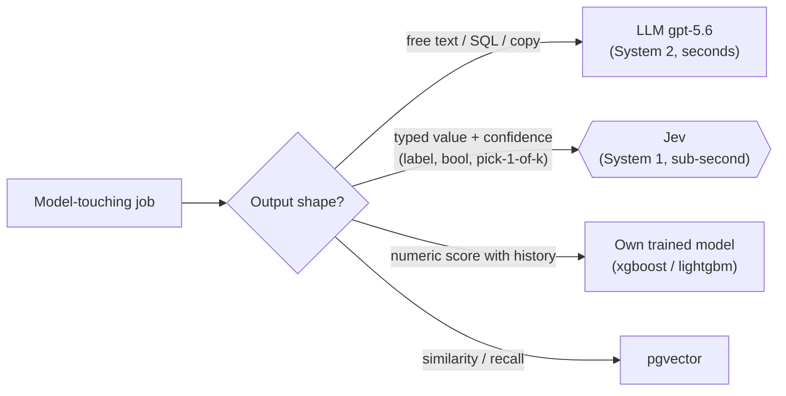
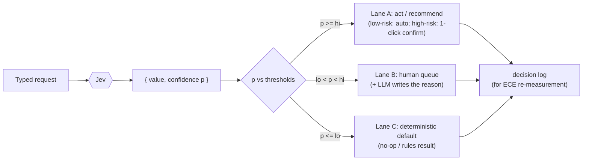
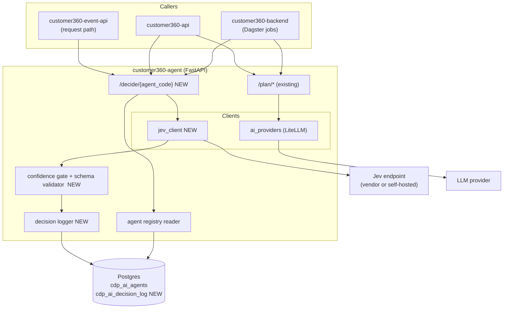
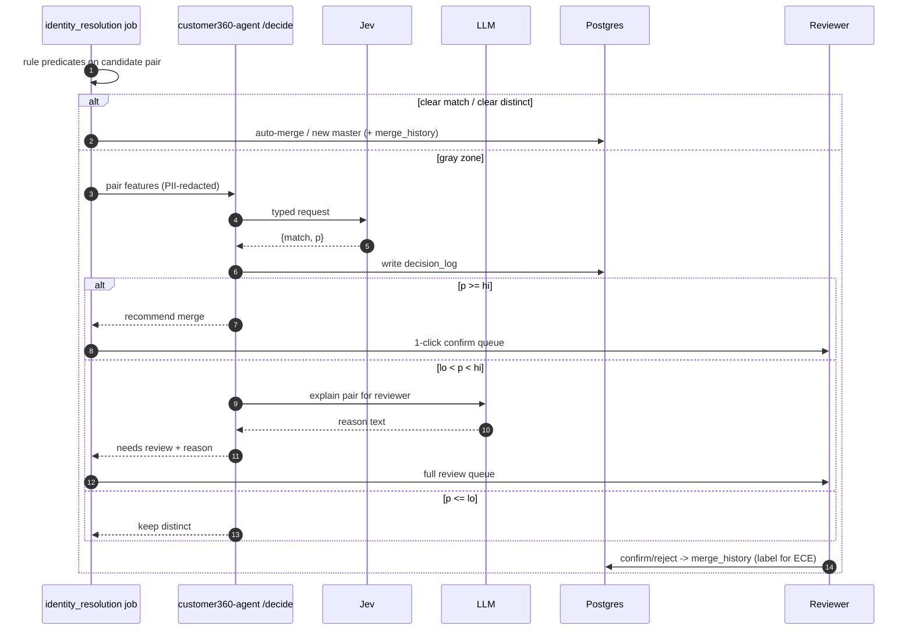
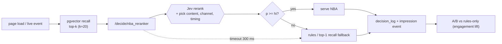
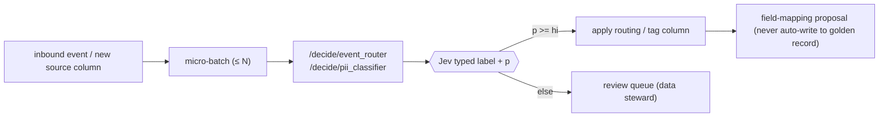
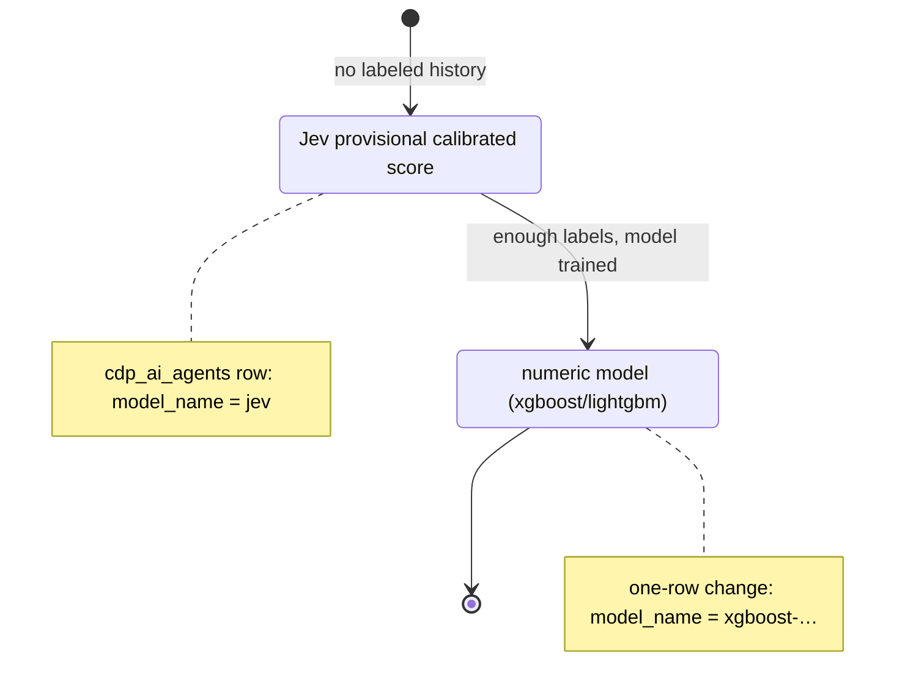
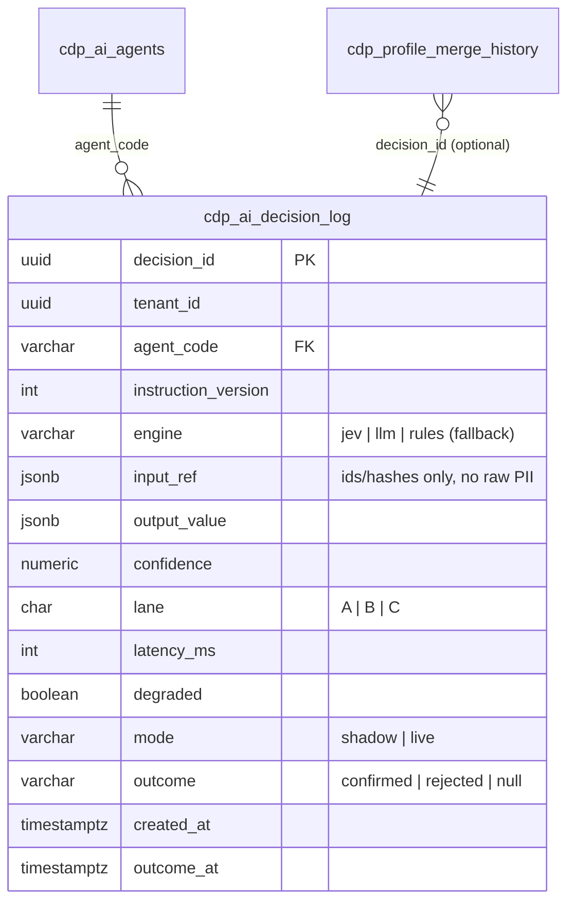
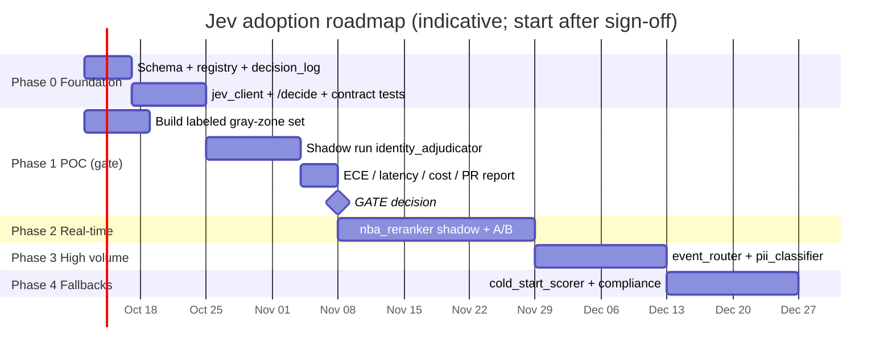
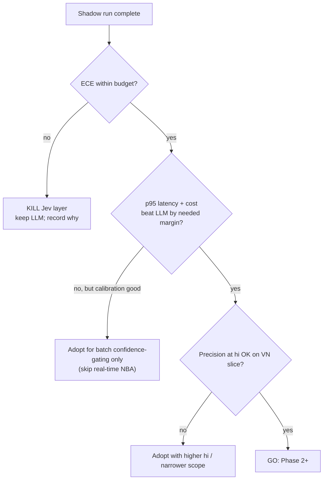

# Applying Jev (System One Decision Model) to LEO Customer 360

### Detailed design: concept, flows, rollout, and comparisons

> Design report · LEO CDP `leo-customer360` · 2026-10-03
> Builds on `the-customer360-model-layer.md` (§1.2, §2.5, §2.6, §7), which argued
> *why* a System One / Jev layer belongs beside the LLM. This document specifies
> *how* to wire it in.
>
> ⚠️ **Provenance caveat.** Every Jev performance, cost, and calibration figure
> (70–500 ms, `$0.042/M`, "output free", "calibrated", "zero type errors") is a
> **single-source vendor claim** (TypeSafe.ai) and is marked **[unverified]**.
> This design is therefore **gated**: nothing in Phase 2+ ships before the
> Phase 1 calibration POC passes (§9).
>
> **Assumption.** "JEV (decision model)" is read as *System One / Jev* as used in
> the model-layer paper. Interface details of the vendor API are assumed
> (typed function call returning `{value, confidence}`); confirm against the real
> API before Phase 0 completes.

## 1. Executive summary

| Item | Decision |
|---|---|
| What Jev is for | Fast, **typed** decisions with a **calibrated confidence** (classify, route, match, rerank) |
| What Jev is *not* for | Free text: SQL, copy, narratives, transliteration stay on the LLM |
| Where it plugs in | A new `structured_decision` engine family in `cdp_ai_agents`, called via a thin client inside `customer360-agent` |
| First use case | Identity-resolution **gray-zone adjudication** (labels already exist, fully human-gated) |
| Killer use case | Real-time **next-best-action** rerank in the request path |
| Gate | Calibration (ECE), latency p95, cost / 1k decisions, precision/recall at the gate |
| Fallback | Keep the LLM structured-output path; Jev is behind a feature flag per agent row |

---

## 2. Concept

### 2.1 Two reasoning modes, one decision rule

An LLM deliberates in prose (seconds, per-token cost, uncalibrated "I'm 90% sure").
A System One model decides in one pass and returns a typed value plus a
confidence that is *claimed* to be calibrated. The whole design reduces to one
routing rule: **route by output shape.**



### 2.2 The confidence gate (the load-bearing idea)

Jev's value is not the answer, it is that `p` can be thresholded. Two thresholds
`lo < hi` split every decision into three lanes. Thresholds come from the
POC reliability curve (§9), never from the vendor.



### 2.3 Engine comparison

| Dimension | LLM (`gpt-5.6`) | Jev (System One) | Numeric ML (`lead/churn/clv/cx`) | pgvector |
|---|---|---|---|---|
| Output | Free text | Typed value + confidence | Number | Ranked ids |
| Latency | 3–329 s (observed in paper) | 70–500 ms **[unverified]** | ms (batch) | ms |
| Cost shape | Per output token | Near-zero output **[unverified]** | Fixed infra | Fixed infra |
| Confidence | Self-reported, uncalibrated | Calibrated **[unverified]** | Model-specific, calibrated by us | Distance, not probability |
| Needs training data | No | No (zero-shot) | Yes | No |
| Explains itself | Yes (prose) | Weakly (one-liner) | Via reason codes (LLM) | No |
| Best at | SQL, copy, narrative | Match, route, classify, rerank | Scoring at scale | Recall |
| Risk | Parse failures, drift | Vendor lock-in, unproven calibration | Stale model | Poor semantics on short text |

---

## 3. Target architecture

### 3.1 Where Jev sits

`customer360-agent` today exposes `/plan/email`, `/plan/segment`, `/plan/zalo`
over LiteLLM (`ai_providers/provider.py`). LiteLLM is chat-shaped; a Jev call is
a typed function call. So Jev gets a **sibling client**, not a LiteLLM route.



### 3.2 Components and change footprint

| Component | Change | Type | Size |
|---|---|---|---|
| `customer360-database/database-schema.sql` | Add `'structured_decision'` to `model_type` CHECK; add `cdp_ai_decision_log` | Modify + new table | S |
| `customer360-database/init-cdp-ai-agents.sql` | Seed Jev agent rows (§5) | Seed | S |
| `customer360-agent/src/jev_client/` | Typed client, timeout, retry, circuit breaker | New package | M |
| `customer360-agent/src/app.py` | `POST /decide/{agent_code}` | New route | S |
| `customer360-agent/src/decision/` | Per-agent request/response Pydantic schemas, gate, logger | New package | M |
| `customer360-agent/src/leo_customer360_agent/client.py` | `decide()` method for callers | Modify | S |
| `customer360-dao` | `AiDecisionLog` model | New model | S |
| `customer360-backend/identity_resolution` | Gray-zone hook (Phase 1) | Modify | M |
| `customer360-backend/personalization` | NBA job (Phase 2) | Fill placeholder | M |
| `customer360-agent/tests/` | Contract tests with recorded Jev fixtures | New | M |

### 3.3 Request contract (`POST /decide/{agent_code}`)

```jsonc
// request
{
  "tenant_id": "…",                    // overwritten server-side from auth, never trusted
  "input": { /* agent-specific, schema-validated, PII-redacted */ },
  "options": { "timeout_ms": 800, "mode": "shadow|live" }
}
// response
{
  "decision_id": "uuid",
  "agent_code": "identity_adjudicator",
  "instruction_version": 3,
  "value": { "match": true },          // typed per agent
  "confidence": 0.93,
  "lane": "A|B|C",                     // computed by gate, thresholds from registry row
  "engine": "jev",
  "latency_ms": 212,
  "degraded": false                    // true if fallback (LLM/rules) answered
}
```

### 3.4 Registry extension

| Column / value | Before | After |
|---|---|---|
| `model_type` CHECK | `classification, regression, clustering, rules_engine, generative_llm` | `+ structured_decision` |
| `model_name` | `openai/gpt-5.6-…`, `xgboost-…` | `+ jev` (or self-hosted tag) |
| thresholds `lo`/`hi` | n/a | stored per agent (reuse the existing config/variables column of the row; confirm column during Phase 0 — no new column unless none fits) |
| `instruction_version` | per prompt revision | reused as the schema/threshold revision for Jev agents |

---

## 4. Use-case flows

### 4.1 Identity gray-zone adjudication (Phase 1, first)

Rules stay in the driver's seat. Jev only sees pairs the deterministic matcher
cannot settle. Jev **never merges**; merges stay reversible via
`cdp_profile_merge_history`.



Human decisions flow back as labels, so the reliability curve keeps updating for free.

### 4.2 Real-time next-best-action (Phase 2)



Hard rule: the request path **always** has a deterministic fallback; Jev can only
improve a response, never block it.

### 4.3 Event routing and PII / data-quality classification (Phase 3)



### 4.4 Cold-start scoring (Phase 4)



### 4.5 Use-case comparison: LLM-only (today) vs Jev-assisted

| Use case | Today / LLM-only | With Jev | Expected gain **[unverified]** | Risk if Jev is wrong |
|---|---|---|---|---|
| Identity gray zone | Not wired; would need an LLM call with self-reported confidence | Calibrated `p` drives 3 lanes | Trustable threshold; lower reviewer load | Mis-triage → human still decides; merge reversible |
| Next-best-action | Impossible in request path (seconds) | Sync rerank on top-k | Personalize on page load | Falls back to rules; no outage |
| Event routing | Rules only | Typed label for ambiguous events | Fewer mis-routed events | Wrong route → reprocess; low blast radius |
| PII classification | Manual / regex | Typed label + `p` | Faster source onboarding | Missed PII → mitigated by steward review + regex floor |
| Cold-start scoring | No score until model trained | Provisional score | Score on day 1 | Poor score → flagged `provisional`, not used for sends |
| Compliance pre-flight | Manual | Typed checks + LLM narrative | Faster review | Human sign-off retained |

---

## 5. Agent catalog (registry rows to add)

| `agent_code` | `model_type` | `model_name` | Input (typed) | Output (typed) | Mode | Phase |
|---|---|---|---|---|---|---|
| `identity_adjudicator` | structured_decision | jev | pair feature vector (names, phones, emails, addr, DOB — redacted/tokenized) | `{match: bool}` + p | batch, human-gated | 1 |
| `nba_reranker` | structured_decision | jev | profile/persona features + top-k candidate ids | `{content_id, channel, send_window}` + p | sync, ≤300 ms | 2 |
| `event_router` | structured_decision | jev | event envelope (type, source, props keys) | `{route: enum}` + p | micro-batch | 3 |
| `pii_classifier` | structured_decision | jev | column name + sample stats (no raw values) | `{pii_class: enum}` + p | batch | 3 |
| `cold_start_scorer` | structured_decision | jev | profile features | `{tier: enum}` + p | batch | 4 |
| `compliance_checker` | structured_decision | jev | template + segment + consent flags | `{check→pass/fail}` + p | on-demand | 4 |

---

## 6. Data model additions



`cdp_ai_decision_log` is the single table behind every eval in §9. `outcome` is
back-filled from reviewer action or downstream event. Apply the same tenant RLS
policy pattern as `migrations/001_harden_tenant_rls_policies.sql`.

---

## 7. Guardrails (specific to Jev)

| # | Guardrail | Mechanism |
|---|---|---|
| 1 | Tenant isolation | `tenant_id` injected from auth server-side; ignored if present in `input` |
| 2 | Jev proposes, code disposes | `lane` computed by our gate; Jev never writes golden-record tables |
| 3 | PII minimization | Features are tokenized/hashed or derived (e.g. similarity scores) before leaving; prefer self-hosted Jev for identity |
| 4 | Prompt/input injection | Record text only in typed fields, length-capped, enum-validated outputs; reject out-of-schema responses |
| 5 | Timeout + circuit breaker | Per-agent `timeout_ms`; N consecutive failures → open breaker → fallback |
| 6 | Deterministic fallback | Every agent defines a rules/LLM fallback; `degraded=true` is logged |
| 7 | Shadow mode first | `mode=shadow` records Jev's answer but acts on the fallback |
| 8 | Kill switch | Flip `model_name` back to LLM/rules in the registry row — no deploy |
| 9 | Calibration drift | Nightly ECE job on labeled outcomes; alert when ECE exceeds budget; thresholds revert to conservative |
| 10 | Vendor claims unverified | No SLA, cost, or accuracy figure in this doc is design input until measured |

---

## 8. Rollout plan and progress tracking

### 8.1 Roadmap



### 8.2 Phase table

| Phase | Goal | Deliverables | Exit criteria | Gated by |
|---|---|---|---|---|
| 0 Foundation | Plumbing, no behavior change | CHECK + table + seed rows, `jev_client`, `/decide`, fixtures | Contract tests green; `/decide` returns fallback when Jev is off | — |
| 1 POC | Prove or kill calibration | Labeled gray-zone set, shadow run, report | §9 thresholds met | Phase 0 |
| 2 Real-time | NBA in request path | `nba_reranker`, A/B harness | p95 ≤ 300 ms and engagement lift > 0 vs rules | **Phase 1 pass** |
| 3 High volume | Routing + PII | two agents live | Precision ≥ target; steward queue load acceptable | Phase 1 pass |
| 4 Fallbacks | Cold-start + compliance | two agents live | Provisional score flagged; human sign-off kept | Phase 1 pass |

### 8.3 Progress tracker (update in-place as work lands)

| Workstream | Status | Owner | Notes |
|---|---|---|---|
| Vendor API confirmed (typed call, auth, self-host option) | ⬜ not started | — | blocks Phase 0 `jev_client` |
| Schema: `structured_decision` + `cdp_ai_decision_log` | ⬜ | — | |
| Seed rows for Jev agents | ⬜ | — | |
| `jev_client` + breaker + fixtures | ⬜ | — | |
| `/decide/{agent_code}` + gate + logger | ⬜ | — | |
| Labeled gray-zone dataset from `cdp_profile_merge_history` | ⬜ | — | check label quality / class balance |
| Shadow run + POC report | ⬜ | — | |
| Go / no-go decision | ⬜ | — | |

Legend: ⬜ not started · 🟨 in progress · 🟩 done · 🟥 blocked.

---

## 9. Evaluation and the adoption gate

### 9.1 Metrics

| Question | Metric | Method | Pass threshold (proposed, tune with stakeholders) |
|---|---|---|---|
| Calibrated on *our* data? | ECE + reliability diagram | Bin `p` vs observed accuracy on labeled gray-zone pairs | ECE ≤ 0.05 and monotone curve |
| Fast enough for request path? | Latency p50 / p95, warm + cold | End-to-end from `customer360-agent` | p95 ≤ 300 ms (NBA budget) |
| Cheaper than the LLM path? | Cost / 1k decisions | Same batch through LLM structured call | ≥ 5× cheaper, else benefit is calibration only |
| Good enough at the gate? | Precision / recall at `hi`, `lo` | Against human labels, gray-zone slice only | Precision ≥ 0.95 at `hi` with useful coverage |
| Robust to our language? | Same metrics on VN-name/address slice | Slice by script/diacritics | No slice worse than overall by > 2× ECE |

### 9.2 Go / no-go



### 9.3 Success scorecard per use case

| Use case | Primary KPI | Baseline | Target | Source |
|---|---|---|---|---|
| Identity adjudication | Reviewer minutes per 100 pairs | measured in POC | down, with equal merge precision | decision_log + merge_history |
| NBA | Click/engagement lift | rules-only | positive, significant | tracking events A/B |
| Event routing | Mis-route rate | current | down | decision_log outcome |
| PII classification | Recall of true PII columns | regex baseline | ≥ baseline + steward-validated | steward confirmations |
| Cold-start | Days to first usable score | model-train lead time | → ~0 | scoring job |

---

## 10. Risks and alternatives

| Risk | Likelihood | Impact | Mitigation |
|---|---|---|---|
| Calibration does not hold on VN data | Medium | High (kills premise) | POC gate; keep LLM path |
| Vendor lock-in / pricing change | Medium | Medium | Registry swap (`model_name`); fallback always defined; self-host preference |
| PII exposure to external vendor | Medium | High | Tokenized features only; self-host for identity |
| Latency claims miss in our network | Medium | Medium | Measure p95 in POC; NBA falls back to rules |
| Over-rotation of generation work onto Jev | Low | Medium | Route-by-output-shape rule (§2.1) enforced in review |
| Label leakage / bias in gray-zone set | Medium | Medium | Hold-out by time; audit class balance |

### Alternatives considered

| Option | Pros | Cons | Verdict |
|---|---|---|---|
| **A. Jev behind `/decide` (this design)** | Calibrated gate, fast, reversible per-row | Vendor claims unproven | **Chosen, gated** |
| B. LLM structured output only | Zero new infra | Uncalibrated confidence; seconds of latency; per-token cost | Fallback / baseline |
| C. Train own classifier for each decision | Full control, calibratable | Needs labels per task; not zero-shot; ML ops cost | Use where labels already exist (scoring) |
| D. Small open-source local model + calibration layer (e.g. temperature scaling) | Self-hosted, no PII leaves | We own calibration + serving | **Viable alternative if Jev fails the vendor/PII bar**; same `/decide` contract |
| E. Do nothing | No risk | Real-time NBA and trusted gating stay out of reach | Rejected |

Because the contract is `/decide/{agent_code}` with a registry-selected engine,
options B and D drop in without caller changes — which is the main reason the
design is cheap to reverse.

---

## 11. Open questions

1. Vendor API shape: is it a typed function call with schema upload, and does it return a probability or a score?
2. Self-hosted Jev (or equivalent) availability and licensing for PII-heavy agents.
3. Which existing registry column holds per-agent config (`lo`/`hi`, `timeout_ms`)? Confirm against `database-schema.sql` before adding any column.
4. Size and class balance of labeled gray-zone pairs in `cdp_profile_merge_history`.
5. Who owns the reviewer queue UI for lanes A/B (`customer360-frontend`)?

## 12. Conclusion

Jev is a narrow, optional engine: it earns a seat only for typed, confidence-gated,
latency- or cost-sensitive decisions. The design keeps its blast radius small — a
new `structured_decision` registry family, one `/decide` endpoint, one decision-log
table — and makes the whole bet falsifiable by one POC (identity gray zone) before
anything real-time depends on it. If it passes, LEO gains a fast calibrated decision
layer at the marginal cost of a schema and a row per job; if it fails, the same
contract hosts an LLM or self-calibrated local model with no caller changes.
