# One Model, Many Jobs: Where a Single Foundation Model Adds Value Across LEO Customer 360

> Research note · LEO CDP `leo-customer360` · 2026-09-22

## Abstract

LEO Customer 360 is not an "AI product" bolted onto a database; it is a
composable CDP whose schema and services were already shaped for a language
model to plug into. `database-init/data-view-for-llm.sql` builds materialized
views "optimized for LLM-based text-to-SQL"; `customer360.cdp_segments` already
carries a `processed_by` flag whose legal values are `('human', 'ai_agent')`;
`customer360.crm_campaign` already reserves `ai_plan JSONB`, `strategy_summary`,
and a `vector(1536)` embedding column; and `customer360-agent/` already exposes
**one** unified model endpoint (via LiteLLM, provider-agnostic across
Gemini / OpenAI / Anthropic / local). As of `d325bd0`, the schema even carries a
`customer360.cdp_ai_agents` registry that seeds every ML/rules/LLM agent as a
row — and the three `generative_llm` agents in it all name the *same*
`model_name = 'gpt-5.6'`. "One model, many jobs" is no longer just an argument;
it is a table.

This paper answers a single question: **if we have exactly one foundation model
available, where across the whole platform does it earn its keep?** The thesis
is that the model should be a *horizontal reasoning layer* — wired once through
`customer360-agent`, reused by every subsystem — rather than a feature glued
into one screen. We enumerate concrete, table-grounded use cases per subsystem,
separate what already exists from what is designed-but-empty from what is
net-new, and give a value/effort ranking, guardrails, and an evaluation plan.

---

## 1. Scope and framing

### 1.1 What "one AI model" means here

The platform already routes all model calls through a single service
(`customer360-agent`, port 8009) built on a unified LiteLLM client. That service
is the natural home for **one** model that many callers share. Concretely, "one
model" gives the platform three primitive capabilities:

| Primitive | What it does | Already available? |
|---|---|---|
| **Generate** | Free text out (copy, summaries, narratives, reason codes) | Yes — `campaign_planner/{email,zalo}.py` |
| **Structure** | Text/records in → validated JSON/SQL out | Partial — planners emit `ai_plan`; segment/SQL generation designed, not wired |
| **Embed & match** | Text → `vector(768/1536)` for semantic search | Yes — `persona_embedding vector(768)`, `crm_campaign.embedding vector(1536)`, pgvector installed |

Every use case below is one of those three primitives pointed at a different
subsystem's data. That is the whole point: **the marginal cost of the tenth use
case is a prompt template, not a new model.**

### 1.2 Subsystem map

The Dagster workspace (`customer360-backend/`) has nine code locations; three are
implemented, six are runnable placeholders. Those placeholders — `scoring`,
`data_synch`, `email_engine`, `notification_engine`, `campaign_activation`,
`personalization` — are exactly where the model's structured/generative output
belongs.

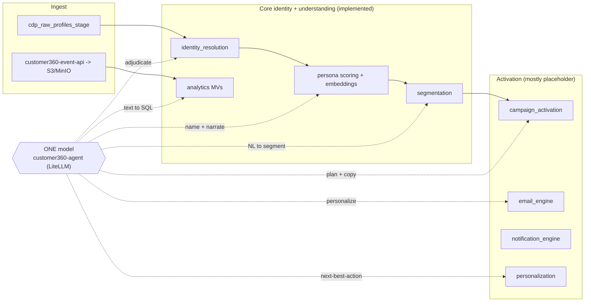

### 1.3 The registry that makes this literal (new — `d325bd0`)

The `customer360.cdp_ai_agents` table is a **single catalog** for every model
the platform runs — ML scorers, rule engines, and generative agents — keyed by a
stable `agent_code`, with a `model_type` CHECK of
`(classification, regression, clustering, rules_engine, generative_llm)` and the
actual `model_name` per row. The seed loads **11 agents**. The shape of that
seed *is* the thesis of this paper:

- The **three `generative_llm` agents** — `persona_summary_generator`,
  `campaign_planner`, `zns_campaign_planner` — all carry the same
  `model_name = 'gpt-5.6'`. One model, three jobs, one row each.
- The **eight ML / rules agents** (`lead_scoring`, `churn_scoring`,
  `clv_scoring`, `cx_scoring`, `persona_risk_score`, `persona_loyalty_score`,
  `data_quality`, `lifecycle_stage`) keep their **own** `model_name`
  (`lead-scoring-model`, `churn-scoring-model`, …). The registry encodes §2.7's
  rule structurally: a calibrated numeric model is *not* swapped for the LLM.
- Task-oriented agents store their live `system_instructions`,
  `required_variables`, and an integer `instruction_version` on the row.
  Prompt *history* is deliberately **not** in Postgres (schema comment:
  *"Historical prompt versions are intentionally NOT stored in PostgreSQL"*) — it
  lives in the `customer360-agent` prompt store; the row holds only the current
  revision.

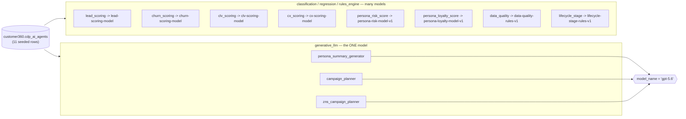

*Read the diagram left-to-right: every generative job funnels into the single
`gpt-5.6`; every numeric/rules job keeps its purpose-built model. That is exactly
the split this paper argues for — now enforced by a table, not a convention.*

---

## 2. Use cases, grounded per subsystem

Each use case names the **real tables/files** it reads and writes, the model
**primitive** it uses, and its **status** (🟢 built · 🟡 designed, not wired ·
🔵 net-new).

### 2.1 Segmentation — Natural-language → segment (🟡 designed, not wired)

**The flagship case, because the schema already asks for it.**
`cdp_segments` stores `json_rules` (jQuery QueryBuilder tree), `sql_rules`
(WHERE fragment), `final_generated_sql` (full SELECT), and a `processed_by`
column whose CHECK constraint literally allows `'ai_agent'`. The seat is
reserved; nothing is sitting in it.

- **Flow:** marketer types *"Gen Z shoppers in HCMC who purchased in the last 30
  days but didn't open the last 3 emails."* → model (Structure) emits a
  QueryBuilder `json_rules` tree → deterministic translator produces
  `sql_rules`/`final_generated_sql` → segmentation job (already implemented)
  computes membership and writes `segmentation_tags` back onto
  `cdp_master_profiles`.
- **Why the model, not a form:** the QueryBuilder UI already covers the
  point-and-click path. The model covers the *long tail* of intent that
  marketers can say but not click, and it turns a 5-minute rule-build into one
  sentence.
- **Guardrail:** never let the model emit raw SQL that runs. It emits the
  `json_rules` tree; the existing deterministic translator produces the SQL, and
  `tenant_id` is injected server-side. Set `processed_by='ai_agent'` so every
  AI-authored segment is auditable and reversible.

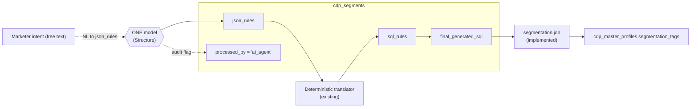

*Guardrail visible above: the model writes only `json_rules`; SQL is produced by
the existing translator with `tenant_id` injected server-side.*

### 2.2 Analytics — Text-to-SQL over the LLM materialized views (🟡 designed, not wired)

`database-init/data-view-for-llm.sql` already flattens AI/ML scores + behavioral
summaries into `mv_customer_transactions` (and an engagement MV) with the
comment *"optimized for LLM-based text-to-SQL"* and keeps `persona_embedding`
alongside for semantic search. The denormalization work — the hard part — is
done.

- **Flow:** *"What's the average predictive CLV of churn-risk-tier = high
  customers who bought in Q2?"* → model (Structure) → SQL against the MV →
  execute read-only → model (Generate) narrates the number.
- **Why here:** answering ad-hoc analyst questions is the single highest-frequency,
  lowest-stakes use of a model in any CDP. The MV boundary keeps the blast radius
  tiny (no joins across the live OLTP graph).
- **Guardrails:** a dedicated **read-only** DB role; mandatory `tenant_id`
  predicate injected after generation; statement timeout; reject anything that
  isn't a single `SELECT`. (See §4.)

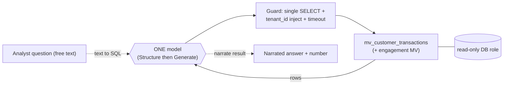

*The MV boundary keeps the blast radius tiny — no joins across the live OLTP graph.*

### 2.3 Persona — name, summary, and *reason codes* (🟢 built + 🔵 extend)

Persona name synthesis and summary generation are **already** LLM-native
(see `persona-resolution-paper.md` §5) and lookalike discovery already uses the
`vector(768)` `persona_embedding` (§6). The gap is *explanation*.

- **Net-new (🔵):** the 6-component persona score (Behavior, Engagement,
  Financial, Loyalty, Relationship, Risk — `cdp_persona_score_details`) is
  numeric and opaque to a marketer. Feed the component breakdown to the model
  (Generate) to produce a plain-language **reason code**: *"High Value / Medium
  Risk — driven by strong 12-month spend but two recent support escalations."*
  Store it next to `cdp_customer_personas`. This makes the existing math
  trustable without changing the math.
- **Net-new (🔵):** **archetype discovery.** Cluster `persona_embedding`, then
  have the model name and describe each cluster to propose new rows for
  `cdp_persona_archetypes` — human-approved before activation.

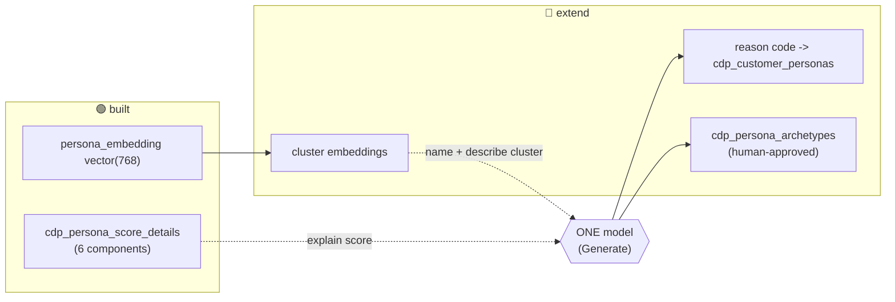

*The math is unchanged; the model only makes it legible and proposes archetypes.*

### 2.4 Campaign activation & messaging — plan, copy, personalize (🟢 built + 🔵 extend)

`customer360-agent/src/campaign_planner/{email,zalo}.py` already turns a
segment + objective into an `ai_plan` and message template. `crm_campaign` holds
`ai_plan`, `strategy_summary`, approval columns, and a `vector(1536)` embedding.
The activation/email/notification engines are placeholders — the model's output
has somewhere to land but nothing yet lands it.

- **Extend (🔵) subject/copy variants:** generate N subject-line and body
  variants per campaign for A/B testing; store as `crm_campaign_content_items`.
- **Extend (🔵) per-persona parameter fill:** Zalo ZNS is template-based (params,
  not free text). The model doesn't author the message — it selects the approved
  `crm_message_templates` row and fills params per recipient persona. This
  respects the existing "ZNS is pre-approved templates" constraint exactly.
- **Extend (🔵) strategy narrative:** populate `strategy_summary` from
  segment characteristics + objective, so a reviewer reads *why* before approving
  (`crm_campaign_reviews`).

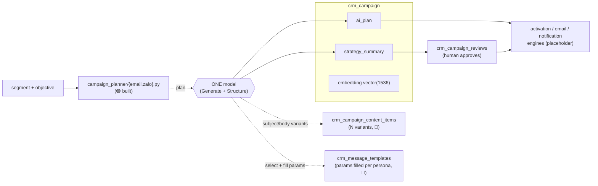

*Zalo path stays template-based: the model selects an approved row and fills
params — it never authors ZNS copy.*

### 2.5 Personalization & next-best-action (🔵 net-new, placeholder job exists)

`cdp_content_items` (news/video/product/article, each tagged with `segment_tags`
+ CTA) and profile/persona embeddings are the two halves of a recommender.

- **Flow:** for a profile, retrieve candidate `cdp_content_items` by embedding
  similarity, then have the model (Structure) **rerank** with a one-line reason
  and pick the next-best-action (which content, which channel, when). Lands in
  the `personalization` placeholder job.
- **Why hybrid, not pure-LLM:** embeddings do the cheap recall over thousands of
  items; the model only reranks the top-k. Cost scales with k, not catalog size.

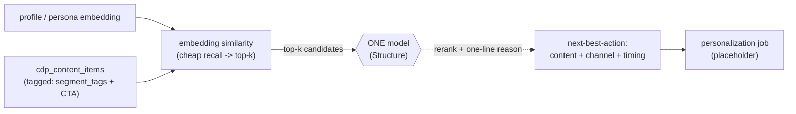

*Hybrid by design: embeddings recall over the whole catalog; the model reasons
only over the top-k, so cost scales with k.*

### 2.6 Identity resolution — gray-zone adjudication + field normalization (🔵 net-new)

Identity resolution is deterministic today (rule predicates → auto-merge or new
master; see `identity-resolution-paper.md`). Rules are right to stay in the
driver's seat. But two narrow places benefit from a model:

- **Gray-zone adjudication:** for candidate pairs that fall *between* auto-merge
  and clearly-distinct, present both `cdp_raw_profiles_stage`/`cdp_master_profiles`
  records to the model (Structure) → `{match, confidence, reason}`. Route only
  low-confidence cases to a human queue. The model never silently merges; it
  triages. Merges remain reversible via `cdp_profile_merge_history`.
- **Field normalization at ingest:** Vietnamese name/address variants,
  transliteration, and messy source fields are a classic LLM strength — normalize
  *before* the rule predicates run, so the existing matcher sees cleaner keys.

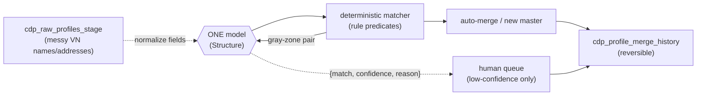

*Rules stay in the driver's seat; the model normalizes at ingest and triages
gray-zone pairs — it never silently merges.*

### 2.7 Scoring — reason codes, not a replacement model (🔵 net-new, placeholder job)

`cdp_master_profiles` already carries `predictive_clv`, `churn_probability`,
`churn_risk_tier`, `engagement_score`. The `scoring` Dagster job is a
placeholder, but the **scorers themselves are now registered**: `d325bd0` seeds
`lead_scoring`, `churn_scoring`, `clv_scoring`, and `cx_scoring` into
`cdp_ai_agents` — each `classification`/`regression`, each with its own
`model_name` and a cron `schedule_definition`, *not* pointed at the LLM. **Do
not** replace a calibrated numeric model with an LLM. Instead use the model to
(a) generate human-readable **reason codes** for each score and (b) draft/validate
`cdp_scoring_models` configs from a plain-language spec.

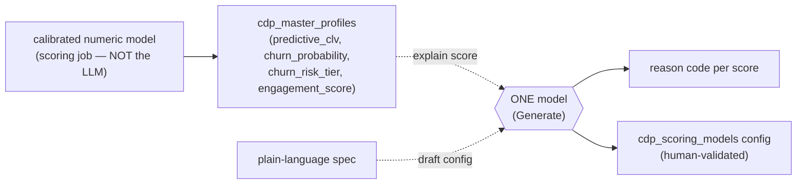

*The model never computes the score — it explains the number and drafts the config.*

### 2.8 Data quality / `data_synch` (🔵 net-new, placeholder job)

At ingest, the model (Structure) can suggest **source→schema field mappings**
for a new `sys_data_source`, flag likely PII columns, and explain anomalies the
analytics job surfaces. Suggestions are proposals a human confirms — never an
automatic write to the golden record.

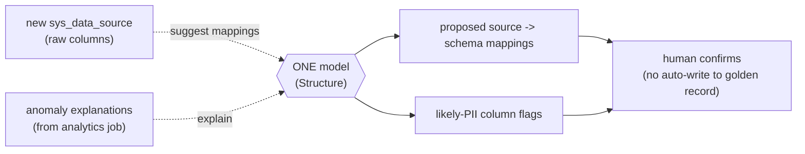

*Every suggestion is a proposal; the golden record is written only after a human confirms.*

### 2.9 Governance, review & support (🔵 net-new, cross-cutting)

- Summarize `sys_audit_log` bursts into an incident-style narrative.
- Pre-flight **compliance check** on message templates: does the copy risk PII
  leakage, does the target segment intersect `crm_suppression_list`, is the
  channel consent present? The model drafts the reviewer's checklist for
  `crm_campaign_reviews`.

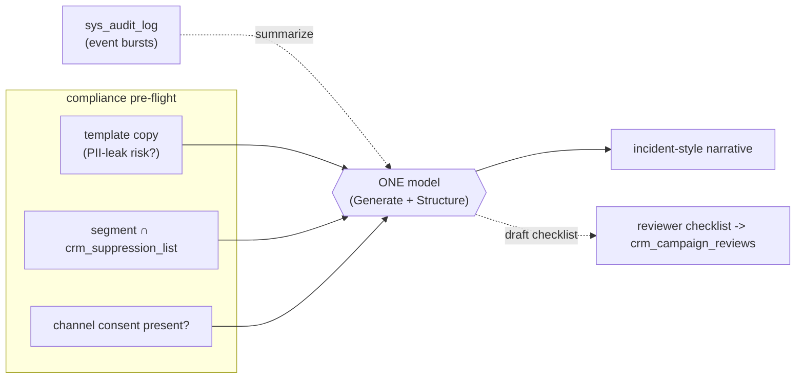

*Cross-cutting: the model drafts the narrative and the checklist; a human still signs off.*

---

## 3. What already exists vs. the opportunity (honest inventory)

| Subsystem | Model use | Status | Effort to first value |
|---|---|---|---|
| Persona name + summary | Generate | 🟢 built | — |
| Lookalike (embeddings) | Embed & match | 🟢 built | — |
| Campaign plan + template | Structure/Generate | 🟢 built | — |
| **NL → segment** | Structure | 🟡 schema ready | **Low** (translator + prompt) |
| **Text-to-SQL analytics** | Structure | 🟡 MVs ready | **Low** (read-only role + prompt) |
| Persona reason codes | Generate | 🔵 new | Low |
| Campaign copy variants / param fill | Generate/Structure | 🔵 new | Low–Med |
| Content reco / next-best-action | Embed + Structure | 🔵 new | Medium |
| Identity gray-zone adjudication | Structure | 🔵 new | Medium |
| Scoring reason codes | Generate | 🔵 new | Low |
| Field normalization / schema mapping | Structure | 🔵 new | Medium |
| Governance summaries / compliance | Generate | 🔵 new | Low |

**The two 🟡 items are the headline:** they are the highest-value cases *and* the
lowest-effort, because the platform already did the schema/MV work and is just
waiting for a prompt + a thin translator/guard. Start there.

The three 🟢 rows are no longer just running code — `d325bd0` registers them as
first-class rows in `cdp_ai_agents` (`persona_summary_generator`,
`campaign_planner`, `zns_campaign_planner`, all `generative_llm` / `gpt-5.6`),
each with its `system_instructions` and `required_variables` seeded. New use
cases from this table are a new `agent_code` row, not new infrastructure.

---

## 4. Guardrails (the part that makes it shippable)

One shared model touching every subsystem concentrates risk. Non-negotiables:

1. **Tenant isolation is server-side, always.** The model may *suggest* a query
   or rule tree; `tenant_id` is injected by the API after generation, never
   trusted from model output. This mirrors the existing tenant-aware middleware.
2. **The model proposes, deterministic code disposes.** NL→segment emits a
   `json_rules` tree (validated), not runnable SQL. Text-to-SQL runs under a
   **read-only role** with a statement timeout and a single-`SELECT` allow-list.
   Identity adjudication triages; it never merges.
3. **PII minimization in prompts.** Redact/tokenize direct identifiers before
   they enter a prompt, especially for external providers. LiteLLM's provider
   switch means "local model for PII-heavy calls, hosted for the rest" is a
   config, not a rewrite.
4. **Prompt-injection defense.** Profile fields, campaign text, and source data
   are attacker-influenceable. Treat all record content as untrusted data inside
   a fenced section of the prompt; never let record text change the instruction.
5. **Auditability is already modeled.** `cdp_ai_agents.instruction_version`
   (with `instruction_updated_by`/`instruction_note`) pins the *current* revision
   per agent — it replaces `prompt_template.current_version`. Full prompt
   *history* is intentionally kept out of Postgres and lives in the
   `customer360-agent` prompt store, so pin production calls to a store version
   for reproducible/diffable outputs. `processed_by='ai_agent'`, `ai_plan`, and
   the review tables give a full paper trail for every AI-authored artifact.
6. **Human-in-the-loop on writes to the golden record.** Anything that mutates
   `cdp_master_profiles`, activates a segment, or sends a campaign passes an
   approval gate. Reads and drafts are cheap and safe; writes are gated.

---

## 5. Evaluation

| Use case | Metric | How |
|---|---|---|
| NL → segment | Rule-tree correctness | Golden set of NL→`json_rules` pairs; exact/again-executes-to-same-members |
| Text-to-SQL | Execution accuracy | Golden Q→A set over MVs; result-set match, not string match |
| Persona reason codes | Faithfulness | Do stated reasons match the actual dominant score components? |
| Campaign plan/copy | Human approval rate | % of `ai_plan`/drafts approved without edit in `crm_campaign_reviews` |
| Identity adjudication | Precision/recall vs. human labels | Only measured on the gray-zone queue |
| Content reco | Engagement lift | A/B vs. rules-only recommendations via tracking events |

Because everything routes through `customer360-agent`, evaluation is centralized:
log `(prompt_version, inputs, output, downstream outcome)` once and it covers all
use cases.

---

## 6. Recommended sequence

1. **NL → segment** and **text-to-SQL analytics** — schema + MVs are ready;
   ship a translator + read-only role + versioned prompt. Highest value/effort
   ratio in the platform.
2. **Reason codes** for persona and scoring — pure Generate, no new writes,
   immediately makes existing numbers trustable.
3. **Campaign copy variants + per-persona param fill** — extends the working
   planner into the placeholder email/notification engines.
4. **Content reco / next-best-action** — fills the `personalization` job;
   embeddings already exist.
5. **Identity gray-zone adjudication** and **field normalization** — narrow,
   high-care, human-gated.

---

## 7. Conclusion

The most useful thing "one AI model" can do for LEO Customer 360 is **not** a new
feature — it is to become a shared reasoning layer that the platform was already
built to accept. The schema reserved the seats (`processed_by='ai_agent'`,
`ai_plan`, LLM-optimized MVs, embedding columns), and `customer360-agent` already
provides the single, provider-agnostic endpoint. The work ahead is mostly
prompts, thin deterministic translators, and guardrails — not model research.
Wire the model once, gate every write, inject every tenant filter, version every
prompt, and the same model that already names personas can also build segments
from a sentence, answer analysts in SQL, explain a churn score, and draft a
campaign — across the whole system, at the marginal cost of a prompt.
