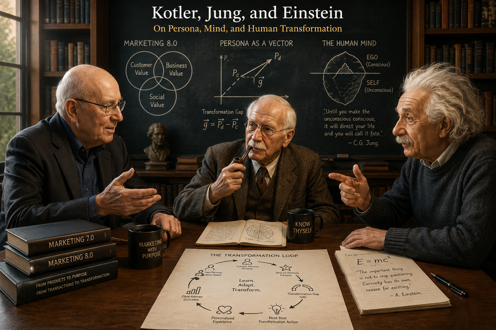
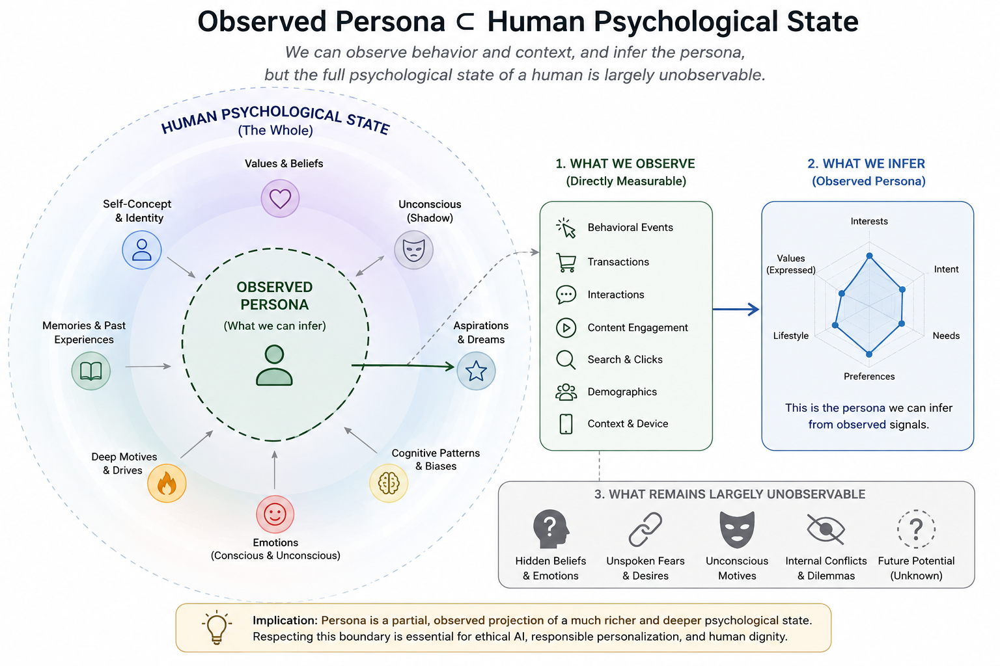
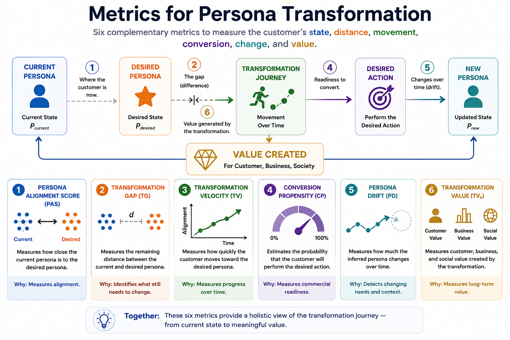
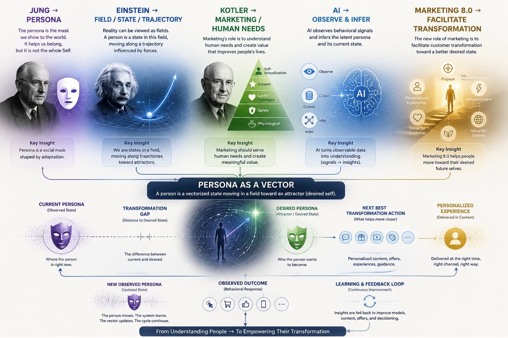

## Abstract

Marketing has progressively moved from mass communication toward segmentation, targeting, personalization, automation, and artificial intelligence. The AI era now makes it possible to infer latent customer states from large volumes of behavioral data, generate personalized interactions at scale, and continuously optimize customer experiences. Yet a central problem remains: most marketing systems still treat the customer primarily as a target, a profile, or a conversion opportunity.

{width=95%}

This paper proposes **Persona as a Vector**, an attractor-based theory for a more human-centric form of personalization. The framework models a customer's current persona as a multidimensional state vector rather than a static label. A desired future identity is represented as a Desired Persona Vector. The difference between the two states defines a **Transformation Gap**. The desired state acts as a conceptual attractor: not a literal physical force, but a meaningful state toward which behavior, motivation, identity, and experience may evolve.

The framework integrates three AI capabilities. **Deep Learning** estimates a latent persona state from observable behavioral events. **Persona Conversion Scoring** measures the strength of behavioral signals associated with readiness for a desired action. **Generative AI** creates personalized content, recommendations, dialogue, offers, and experiences intended to support movement toward a desired state. The resulting system is a closed loop:

$$
\begin{aligned}
\text{Current Persona}
&\rightarrow
\text{Desired Persona}
\\[4pt]
&\rightarrow
\text{Transformation Gap}
\\[4pt]
&\rightarrow
\text{Next Best Transformation Action}
\\[4pt]
&\rightarrow
\text{Personalized Experience}
\\[4pt]
&\rightarrow
\text{Observed Outcome}
\\[4pt]
&\rightarrow
\text{New Persona}
\end{aligned}
$$

Three illustrative marketing applications are developed for retail banking, retail commerce, and gym and fitness services. The examples use synthetic sample data to demonstrate vector encoding, Persona Conversion Score calculation, calibration, next-best-action selection, and transformation measurement. The paper argues that the future of personalization should not optimize only for short-term conversion. It should optimize for the joint creation of **customer value, business value, and social value**, while preserving customer autonomy and transparency.

This framework is proposed as a conceptual contribution to the author's Marketing 8.0 book. It extends the mind-centric direction associated with Marketing 7.0 toward a transformation-centric view of marketing in which products and services become instruments within a customer's journey toward a desired state.

**Keywords:** Persona, Customer 360, Personalization, Deep Learning, Generative AI, Conversion Propensity, Customer Transformation, Attractor, Marketing 8.0, Customer Journey, Next Best Action

---

# 1. Introduction

Marketing has always been concerned with a basic question: why does a person choose one offering over another? Early mass marketing approached this question primarily through product, price, promotion, and distribution. Later approaches introduced segmentation, targeting, customer relationship management, digital behavior, and data-driven personalization. Contemporary AI systems extend this progression by predicting preferences, generating content, and optimizing interactions at individual scale.

Kotler, Kartajaya, and Setiawan's *Marketing 7.0: A Guide for Thinking Marketers in the Age of AI* places explicit emphasis on a mind-centric view of marketing and on understanding how people think, connect, and buy in the AI era (Kotler et al., 2026). The present paper takes that direction one step further and asks a more fundamental question:

> **How can marketing understand not only what a customer is likely to buy, but who the customer is now, who the customer wants to become, and how a brand can responsibly support that transformation?**

This question changes the unit of analysis.

$$
\text{Customer as Target}
\rightarrow
\text{Customer as Profile}
\rightarrow
\text{Customer as Dynamic Persona}
$$

Traditional segmentation remains useful, but static labels do not fully capture the fact that people change. Needs change. Intent changes. Values change. Context changes. Behavior changes. A customer who is currently inactive may aspire to become fit. A financially anxious customer may aspire to become financially confident. A novice shopper may aspire to become a knowledgeable and deliberate consumer.

Therefore, the central premise of this paper is:

$$
\boxed{\text{Persona is not merely a label. Persona is a state in transition.}}
$$

The second premise concerns consumer choice itself. A purchase is often not the beginning of the process. It is frequently a consequence of an underlying state involving identity, aspiration, need, intent, and context.

$$
\text{Identity / Need / Aspiration / Context}
\rightarrow
\text{Intent}
\rightarrow
\text{Behavior}
\rightarrow
\text{Choice}
\rightarrow
\text{Purchase}
$$

This suggests a change in personalization logic. Rather than beginning with a product recommendation, a transformation-oriented system begins with the current persona and desired persona and asks which experience best supports the next step.

The proposed core logic is therefore:

$$
\boxed{\text{Current Persona}\rightarrow\text{Desired Persona}\rightarrow\text{Transformation Journey}\rightarrow\text{Product / Experience}}
$$

Marketing 8.0, as used in this paper and the author's book, is a **proposed future-oriented framework**, not a claim about an officially published Marketing 8.0 edition. Its distinctive premise is that AI should be used not only to improve prediction and conversion, but to support meaningful customer transformation.

# 2. Theoretical Foundations

## 2.1 Jung: Persona, Self, and Individuation

Carl Jung introduced the concept of the **Persona** as the social face through which an individual interacts with the external world. Jung's Persona should not be equated with the entire human self. A person's visible social identity is only one layer of a deeper psychological totality.

Jung's broader concept of the **Self** refers to psychological wholeness, while **individuation** describes a developmental process through which conscious and unconscious aspects of personality become more integrated (Jung, 1959). The significance for marketing is conceptual rather than clinical: a customer-facing identity may be observed while the deeper structure that produces preferences, aspirations, and behavior remains only partially observable.

Thus:

{width=95%}

A marketing system never observes the whole person. It observes traces: clicks, searches, purchases, conversations, location, content engagement, transactions, preferences, and declared information. Persona is therefore an **inferred representation**, not a complete description of the individual.

This leads to the first theoretical assumption:

> **A customer persona is an observable and modelable approximation of a deeper, continuously changing human state.**

The framework intentionally avoids claiming that machine learning can recover the totality of a human being. Instead, the objective is practical: construct a useful state representation for better customer understanding and more responsible personalization.

## 2.2 Einstein: From Force to Field

Einstein's General Theory of Relativity reframed gravity as a geometric relationship between matter-energy and spacetime rather than simply as a classical force acting at a distance (Einstein, 1915, 1916). This paper does **not** claim that human psychology follows General Relativity, nor does it attempt to turn Jungian psychology into physics.

Instead, Einstein provides a useful conceptual analogy: a system can be understood through **states, trajectories, and fields** rather than only through isolated objects and events.

In the present framework, a person is represented as a state in a multidimensional persona space, and a meaningful future identity is treated as a conceptual attractor.

$$
P(t_0)\rightarrow P(t_1)\rightarrow P(t_2)\rightarrow\cdots
$$

This trajectory-based view provides the mathematical intuition for **Persona as a Vector**.

## 2.3 Consumer Choice as Consequence, Not Starting Point

Traditional marketing dashboards often begin with outcomes: impressions, clicks, conversions, transactions, revenue. These are essential business metrics, but they are downstream events.

A deeper behavioral chain can be expressed as:

$$
\text{Identity}
\rightarrow
\text{Aspiration}
\rightarrow
\text{Need}
\rightarrow
\text{Intent}
\rightarrow
\text{Behavior}
\rightarrow
\text{Choice}
\rightarrow
\text{Purchase}
$$

The proposition is not deterministic. Not every aspiration becomes an intention, and not every intention becomes a purchase. Rather, purchase is often an **observable consequence of an upstream state**.

For marketing intelligence, this means the transaction is only one point in a much larger process. The deeper analytic question is not merely "What did the customer buy?" but "What state of the customer made this choice meaningful?"

# 3. Persona as a Dynamic State Vector

Let the customer's current Persona State Vector be:

$$
\mathbf{P}(t) =
\begin{bmatrix}
V,B,N,I,E,A,C,R
\end{bmatrix}
$$

where:

* $V$ = Values
* $B$ = Behavioral patterns
* $N$ = Needs
* $I$ = Intent
* $E$ = Emotional state
* $A$ = Aspirations
* $C$ = Context
* $R$ = Relationships and social influence

These dimensions are illustrative. A production system may use more dimensions, fewer dimensions, latent embeddings, or a hybrid of interpretable features and learned representations.

The central property is dynamism:

$$
\mathbf{P}(t_1)\neq\mathbf{P}(t_2)
$$

A static label such as "Premium Customer, Age 35--44" is therefore only one projection of the full state. A vectorized persona can instead express that the same customer currently has high product interest, medium purchase intent, high content engagement, low price confidence, and a strong aspiration toward financial security.

The dimensions need not be interpreted as direct psychological measurements. They can be model outputs normalized to a common range, for example $[0,1]$, with confidence intervals or uncertainty estimates where available.

## 3.1 Observable and Latent Variables

The model separates what is directly observed from what is inferred.

**Observable signals** may include:

* website and mobile events;
* search queries;
* product views;
* content engagement;
* campaign responses;
* purchases and transactions;
* CRM attributes;
* customer service interactions;
* app activity;
* contextual and location signals, where permitted;
* declared preferences and goals.

**Latent persona variables** may include:

* motivation;
* aspiration;
* confidence;
* changing needs;
* inferred intent;
* behavioral tendencies;
* identity-related patterns.

The causal interpretation must remain cautious. The system is estimating a latent state from evidence; it is not reading the customer's mind.

# 4. Current Persona and Desired Persona

We define two primary vectors:

$$
\mathbf{P}_c(t)=\text{Current Persona}
$$

and

$$
\mathbf{P}_d=\text{Desired Persona}
$$

The Current Persona represents the customer's estimated state at time $t$. The Desired Persona represents a state that the customer values, intends to approach, or has explicitly expressed as a goal.

Examples include:

$$
\text{Financially Anxious}\rightarrow\text{Financially Confident}
$$

$$
\text{Sedentary}\rightarrow\text{Active}
$$

$$
\text{Novice}\rightarrow\text{Knowledgeable Consumer}
$$

$$
\text{Occasional User}\rightarrow\text{Habitual User}
$$

$$
\text{Convenience-Driven Consumer}\rightarrow\text{More Sustainable Consumer}
$$

The **Transformation Gap** is defined as:

$$
TG(t)=D(\mathbf{P}_c(t),\mathbf{P}_d)
$$

where $D$ is a chosen distance or dissimilarity function.

For normalized interpretable vectors, Euclidean distance is a simple starting point:

$$
D_E(\mathbf{x},\mathbf{y})
=
\sqrt{\sum_{i=1}^{n}(x_i-y_i)^2}
$$

However, production systems may prefer cosine distance, Mahalanobis distance, learned metric spaces, or domain-specific distances. The choice of metric is itself a research question because psychological and behavioral dimensions may not have equal scale, independence, or meaning.

# 5. The Persona Attractor

The desired persona can be treated as a conceptual **attractor state** in a dynamic system.

$$
\mathbf{A}=\mathbf{P}_d
$$

The customer's transformation can then be described as:

$$
\mathbf{P}(t)\rightarrow\mathbf{A}
$$

The term "attractor" should be interpreted carefully. It does not mean that a desired identity creates a literal gravitational force. It is a modeling metaphor describing a state toward which the customer's trajectory may converge.

A simple conceptual dynamic is:

$$
\mathbf{P}_{t+1}
=
\mathbf{P}_t
+
\alpha_t\mathbf{u}_t
+
\varepsilon_t
$$

where:

* $\mathbf{u}_t$ represents the direction of change induced by experience and context;
* $\alpha_t$ represents the magnitude of the step;
* $\varepsilon_t$ represents unexplained variation, noise, or external influence.

A transformation-supporting intervention attempts to make the resulting trajectory more aligned with the desired state, subject to uncertainty and constraints.

The central marketing question therefore becomes:

> **What experiences can responsibly reduce the distance between the current persona and the desired persona?**

# 6. Persona Transformation as a Journey

The customer journey is traditionally represented as:

$$
\text{Awareness}
\rightarrow
\text{Consideration}
\rightarrow
\text{Purchase}
\rightarrow
\text{Loyalty}
$$

The proposed theory adds a second and deeper representation:

$$
\mathbf{P}_0
\rightarrow
\mathbf{P}_1
\rightarrow
\mathbf{P}_2
\rightarrow
\mathbf{P}_3
\rightarrow
\mathbf{P}^{*}
$$

Thus:

> **A customer journey can be modeled as a trajectory through persona space.**

Consider a fitness example:

$$
\begin{aligned}
\text{"I do not exercise"}
&\rightarrow \text{"I am interested in fitness"}
\\[6pt]
&\rightarrow \text{"I exercise occasionally"}
&\rightarrow \text{"I exercise regularly"}
\\[6pt]
&\rightarrow \text{"I identify as a runner"}
\end{aligned}
$$

The commercial transaction may happen anywhere along the journey. A shoe purchase might occur in the middle, rather than at the end. The deeper process is the transformation of behavior and identity.

This changes the meaning of Customer Journey Mapping. Instead of mapping only touchpoints, a Marketing 8.0 system can ask which touchpoints correspond to measurable state transitions.

# 7. Deep Learning as Persona Perception

A large event stream provides evidence of customer behavior, but the underlying persona is not directly observable.

Let:

$$
X_{1:t}=\{x_1,x_2,\dots,x_t\}
$$

represent the behavioral history of a customer.

A Deep Learning model estimates a latent persona representation:

$$
\hat{\mathbf{P}}(t)=f_\theta(X_{1:t})
$$

where $f_\theta$ is a learned model with parameters $\theta$.

The model may combine sequence models, transformers, embeddings, behavioral aggregation, graph features, or multimodal inputs. The objective is not necessarily to predict a single outcome. It can estimate a multidimensional latent state that supports downstream personalization.

The conceptual pipeline is:

$$
\text{Behavioral Events}
\rightarrow
\text{Representation Learning}
\rightarrow
\text{Latent Persona}
$$

Deep Learning therefore plays the role of **persona perception**:

> **Deep Learning estimates who the customer appears to be now from the behavioral traces available to the system.**

A mature implementation should also output uncertainty. A persona vector should be treated as an estimate with confidence rather than as an unquestionable truth.

# 8. Persona Conversion Scoring

The proposed **Persona Conversion Score (PCS)** measures the strength of signals indicating readiness for a desired action.

A weighted model can be defined as:

$$
PCS=\sum_{i=1}^{n}w_iD_i
$$

where:

* $D_i$ = score of dimension $i$;
* $w_i$ = weight of dimension $i$;
* $\sum_iw_i=1$.

A practical example is:

$$
PCS=
0.30P
+
0.25C
+
0.15K
+
0.08Ch
+
0.22I
$$

where:

* $P$ = Product Fit;
* $C$ = Content Engagement;
* $K$ = Campaign Effectiveness;
* $Ch$ = Channel Performance;
* $I$ = Purchase Intent.

\newpage

### Example Calculation

Suppose a customer has:

| Dimension | Weight | Score | Contribution |
|:--|--:|--:|--:|
| Product Fit | 30\% | 90 | 27.0 |
| Content Engagement | 25\% | 80 | 20.0 |
| Campaign Effectiveness | 15\% | 40 | 6.0 |
| Channel Performance | 8\% | 75 | 6.0 |
| Purchase Intent | 22\% | 86.4 | 19.0 |
| **Total** | **100\%** | -- | **84.0** |

Thus:

$$
PCS=84.0/100
$$

An 84 score indicates a **very strong set of conversion signals**. It does **not** automatically mean an 84\% probability of conversion.

The distinction is:

$$
\boxed{\text{Conversion Score}\neq\text{Conversion Probability}}
$$

To interpret the value as a probability, the score or the underlying model must be evaluated against historical outcomes and calibrated.

## 8.1 Calibration

Calibration asks whether predicted probabilities correspond to observed frequencies. If a model assigns approximately 80\% conversion probability to a group of 100 similar customers, a well-calibrated model should see conversion in roughly 80 of them over the defined prediction window, subject to sampling variation.

The transformation is conceptually:

$$
\text{Behavioral Features}
\rightarrow
\text{Raw Score / Probability}
\rightarrow
\text{Calibration}
\rightarrow
\text{Reliable Probability}
$$

Common calibration approaches include Platt scaling and isotonic regression. The appropriate method depends on the base model, sample size, monotonicity assumptions, and validation results.

# 9. Generative AI as the Transformation Engine

If Deep Learning answers:

> **"Who is this customer now?"**

Generative AI answers:

> **"What should we create for this customer next?"**

The system can generate:

* personalized content;
* explanations;
* recommendations;
* offers;
* conversational assistance;
* learning materials;
* product combinations;
* journey interventions;
* service experiences.

The conceptual transformation is:

$$
\text{Persona State}
+
\text{Desired State}
\rightarrow
\text{Generative AI}
\rightarrow
\text{Personalized Intervention}
$$

The generated experience should not merely maximize clicks or time spent. Its intended purpose is to support a meaningful customer objective while respecting constraints such as affordability, consent, suitability, and privacy.

Generative AI therefore plays the role of **transformation generation**: turning model outputs into concrete experiences that can influence the next step of a journey.

# 10. Personalization as a Closed-Loop Control System

The theory defines personalization as a continuous feedback process:

$$
\boxed{
\text{Current Persona}
\rightarrow
\text{Desired Persona}
\rightarrow
\text{Intervention}
\rightarrow
\text{Experience}
\rightarrow
\text{New Persona}
}
$$

A simplified architecture is:

$$
\begin{array}{c}
\boxed{\text{Customer}}
\\[6pt]
\downarrow
\\[6pt]
\boxed{\text{Behavioral Events}}
\\[6pt]
\downarrow
\\[6pt]
\boxed{\text{Deep Learning}}
\\[6pt]
\downarrow
\\[6pt]
\boxed{\text{Current Persona}}
\\[6pt]
\downarrow
\\[6pt]
\boxed{\text{Transformation Gap}}
\\[6pt]
\downarrow
\\[6pt]
\boxed{\text{Persona Conversion Scoring}}
\\[6pt]
\downarrow
\\[6pt]
\boxed{\text{Next Best Transformation Action}}
\\[6pt]
\downarrow
\\[6pt]
\boxed{\text{Generative AI}}
\\[6pt]
\downarrow
\\[6pt]
\boxed{\text{Personalized Experience}}
\\[6pt]
\downarrow
\\[6pt]
\boxed{\text{Observed Outcome}}
\\[6pt]
\downarrow
\\[6pt]
\boxed{\text{New Persona}}
\\[6pt]
\downarrow
\\[6pt]
\boxed{\text{Feedback Loop}}
\end{array}
$$

**The system therefore learns not only from historical labels, but also from the consequences of its own decisions.** A personalization engine is never perfectly correct. A customer may ignore an offer, reject a recommendation, change their goal, or enter a new life context that was not represented in the original training data. Each response becomes new behavioral evidence that can update the customer's inferred Persona State and reshape the next intervention.

For example, in **banking**, a model may infer that a customer is ready for a credit product based on recent financial activity. If the customer repeatedly ignores the offer but begins interacting with budgeting and savings content, the system should revise its interpretation: the customer may be moving from a **borrowing-oriented Persona** toward a **financial-security Persona**. In **retail**, a customer may repeatedly view premium products but never purchase them. If subsequent behavior shows increasing price sensitivity and engagement with discount content, the system should reduce its original assumption of premium purchase intent. In a **gym or fitness context**, a customer may initially show strong interest in running equipment but fail to respond to product promotions. Later behavior may reveal that the real barrier is lack of confidence or consistency rather than lack of product interest. The system should then shift from product recommendation toward beginner content, coaching, or community support.

In this way, **rejection, non-response, and unexpected behavior are not failures of the system; they are new observations about the customer**. The personalization loop therefore becomes:

\text{Inference}
 \rightarrow
 \text{Intervention}
 \rightarrow
 \text{Observed Consequence}
 \rightarrow
 \text{Persona Update}
 \rightarrow
 \text{Next Intervention}

This creates a fundamental property of the proposed framework: **the customer is not only the object of personalization; the customer's response continuously teaches the system how to personalize better.**

# 11. Next Best Action as Persona Transformation

Traditional marketing optimization often asks:

> "What action will maximize conversion?"

The proposed framework asks:

> **"What action will most effectively and responsibly move the customer toward the desired state?"**

Let $a$ represent a candidate marketing intervention. A conceptual objective is:

$$
a_t^{*}=\arg\min_aD(\mathbf{P}_{t+1}(a),\mathbf{P}_d)
$$

subject to business, ethical, and customer-experience constraints.

The result is a new concept:

> **Next Best Transformation Action (NBTA).**

Examples include:

| Current Persona | Desired Persona | Next Best Transformation Action |
|:--|:--|:--|
| Financially anxious | Financially confident | Budget coaching and micro-saving plan |
| Product curious | Informed buyer | Comparison and suitability explanation |
| Sedentary | Active | Beginner training challenge |
| Occasional user | Habitual user | Personalized routine and progress feedback |
| Uncertain customer | Confident decision maker | AI consultation with transparent trade-offs |

The product remains important, but it becomes an **instrument within a transformation system**.

# 12. Product and Experience as Transformation Infrastructure

Traditional marketing often assumes:

$$
\text{Need}\rightarrow\text{Product}\rightarrow\text{Purchase}
$$

The proposed model is:

$$
\text{Aspiration}\rightarrow\text{Transformation}\rightarrow\text{Experience}\rightarrow\text{Product}
$$

The product is therefore not always the destination. It can be:

* a tool;
* an enabler;
* a symbol;
* an experience;
* a learning mechanism;
* a social identity marker;
* a component of a larger transformation.

For example:

$$
\text{Running Shoe}
+
\text{Coaching}
+
\text{Community}
+
\text{Content}
+
\text{Progress}
\rightarrow
\text{Runner Identity}
$$

The same logic applies to financial services. A savings account is not only a product. It can be an instrument inside a transformation from financial anxiety toward confidence and control. In retail, a product can be part of a transformation from uncertainty toward expertise or from convenience toward more deliberate consumption.

This creates a new role for brands:

> **Brands become facilitators of transformation.**

# 13. Data and Modeling Method

The proposed framework can be implemented using a Customer 360 architecture in which behavioral events are unified with transactions, content signals, campaign interactions, and customer-provided preferences.

## 13.1 Seven-Stage Marketing 8.0 Flow

The operational pipeline is:

$$
\begin{array}{c}
\boxed{\text{Data Sources}}\\[6pt]
\downarrow\\[6pt]
\boxed{\text{Identity Resolution}}\\[6pt]
\downarrow\\[6pt]
\boxed{\text{Customer 360}}\\[6pt]
\downarrow\\[6pt]
\boxed{\text{Persona / Segment}}\\[6pt]
\downarrow\\[6pt]
\boxed{\text{Customer Journey}}\\[6pt]
\downarrow\\[6pt]
\boxed{\text{Campaign \& Activation}}\\[6pt]
\downarrow\\[6pt]
\boxed{\text{Business Outcome}}
\end{array}
$$

Each stage has a distinct purpose.

| Stage | Purpose | Typical Inputs | Typical Outputs |
|:--|:--|:--|:--|
| Data Sources | Capture signals | Web, app, CRM, POS, ads, service | Raw events |
| Identity Resolution | Unify identities | IDs, device IDs, emails, phones | Unified customer ID |
| Customer 360 | Build customer state | Profile, transactions, events | Unified profile |
| Persona / Segment | Infer state | Behavioral and contextual features | Persona vector, segment, scores |
| Customer Journey | Model trajectory | Events over time | Journey states and gaps |
| Campaign & Activation | Deliver intervention | Channels, content, offers | Personalized experience |
| Business Outcome | Measure impact | Conversion, revenue, value | Outcome labels and feedback |

The critical addition is the feedback arrow from **Business Outcome** back to **Data Sources**. The system is designed to learn continuously.

## 13.2 Feature and Vector Construction

A practical pipeline may first aggregate event data into interpretable features and then encode these features into a vector representation. For example:

$$
\mathbf{z}_t=
[\text{recency},\text{frequency},\text{engagement},\text{intent},\text{context},\ldots]
$$

A representation-learning model transforms these features into a persona state:

$$
\mathbf{P}_t=f_\theta(\mathbf{z}_{1:t})
$$

The result can combine interpretable scores with latent embeddings. This hybrid representation is preferable to treating the vector as either purely symbolic or purely black-box.

## 13.3 Synthetic Sample Data

The following dataset is intentionally **synthetic and illustrative**. It is designed to show how the theory can be operationalized, not to claim results from a real bank, retailer, or gym.

| Customer | Domain | Product Fit | Content | Campaign | Channel | Intent | PCS | Desired Outcome |
|:--|:--|--:|--:|--:|--:|--:|--:|:--|
| B001 | Banking | 70 | 88 | 55 | 80 | 72 | 73.5 | Start automated savings |
| R001 | Retail | 86 | 75 | 82 | 90 | 78 | 81.2 | Complete purchase |
| G001 | Gym | 62 | 92 | 60 | 85 | 65 | 71.7 | Start membership |

For the three examples, PCS is calculated using the same weighted formula from Section 8. The scores illustrate that a single scalar score can be comparable across domains while the meaning of the desired action remains domain-specific.

# 14. Illustrative Case I: Banking

## 14.1 Current Persona

Consider a retail banking customer with the following normalized current vector:

$$
\mathbf{P}_c^{bank}
=
[0.30,0.10,0.90,0.50,0.20,0.80,0.40,0.30]
$$

The vector is illustrative. It can be interpreted as high financial need, low saving behavior, moderate intent, high aspiration for stability, and low confidence.

The desired persona is:

$$
\mathbf{P}_d^{bank}
=
[0.80,0.80,0.20,0.80,0.90,0.90,0.80,0.50]
$$

The desired state is a **Financially Confident Saver**.

## 14.2 Behavioral Events

A synthetic 30-day event history might include:

| Event | Count | Interpretation |
|:--|--:|:--|
| Balance checks | 18 | High financial attention |
| Savings calculator sessions | 6 | Strong educational intent |
| Budget content views | 11 | Strong content engagement |
| Automated savings page views | 4 | Product interest |
| Transfer failures | 2 | Friction in current behavior |
| Campaign clicks | 3 | Moderate campaign response |

A conventional system might react to frequent balance checks by promoting credit products. A transformation-oriented system interprets the pattern differently: the customer appears to have a high need for stability and a strong aspiration to save, but weak behavioral confidence.

## 14.3 Next Best Transformation Action

The system can choose a low-friction intervention:

1. explain a simple savings plan;
2. offer an automatic micro-saving rule;
3. provide a weekly financial progress summary;
4. use Generative AI to answer questions about trade-offs;
5. reduce unnecessary product pressure.

The desired trajectory is:

$$
\text{Financial Anxiety}
\rightarrow
\text{Understanding}
\rightarrow
\text{Small Saving Behavior}
\rightarrow
\text{Habit}
\rightarrow
\text{Financial Confidence}
$$

The commercial outcome may include deposits, card usage, or product adoption, but the deeper objective is improved financial capability and relationship quality.

## 14.4 Marketing 8.0 Interpretation

The bank does not merely sell another financial product. It becomes a facilitator of financial transformation. This is a stronger form of personalization because the intervention is derived from the customer's state and aspiration rather than from campaign inventory alone.

# 15. Illustrative Case II: Retail

## 15.1 Current Persona

Consider a retail customer with this synthetic vector:

$$
\mathbf{P}_c^{retail}
=
[0.70,0.60,0.55,0.75,0.60,0.80,0.90,0.40]
$$

The customer frequently explores products, compares alternatives, and engages with editorial content but shows some uncertainty before purchase.

The desired persona is:

$$
\mathbf{P}_d^{retail}
=
[0.75,0.85,0.30,0.90,0.80,0.90,0.85,0.60]
$$

This can be interpreted as a **Confident and Deliberate Consumer**.

## 15.2 Behavioral Events

| Event | Count | Interpretation |
|:--|--:|:--|
| Product views | 24 | High exploration |
| Search actions | 9 | Active evaluation |
| Product comparisons | 7 | High consideration |
| Reviews read | 15 | Social proof seeking |
| Add-to-cart | 3 | Emerging purchase intent |
| Checkout starts | 2 | Strong conversion signal |

The customer's PCS is 81.2, which places the customer in a **very high conversion propensity** band under the illustrative scoring rules.

## 15.3 Conventional vs. Transformation Approach

A conventional system might simply issue a discount.

The transformation approach asks why the customer has not yet completed the purchase. If the main gap is confidence rather than price, a discount is not necessarily the best intervention.

Generative AI can create:

* a concise comparison of shortlisted products;
* an explanation of trade-offs;
* a recommendation based on the customer's stated priorities;
* a summary of reviews grouped by common concerns;
* a post-purchase usage guide.

The product is therefore embedded within an **experience of becoming a more informed consumer**.

## 15.4 Retail Transformation Path

$$
\text{Curious}
\rightarrow
\text{Exploring}
\rightarrow
\text{Comparing}
\rightarrow
\text{Confident}
\rightarrow
\text{Purchasing}
\rightarrow
\text{Advocating}
$$

The purchase remains important, but it is one milestone in a larger trajectory.

# 16. Illustrative Case III: Gym and Fitness

## 16.1 Current Persona

Consider a customer with:

$$
\mathbf{P}_c^{gym}
=
[0.55,0.20,0.70,0.45,0.40,0.90,0.75,0.35]
$$

The customer has strong aspiration but weak exercise behavior.

The desired persona is:

$$
\mathbf{P}_d^{gym}
=
[0.75,0.90,0.30,0.85,0.80,0.90,0.80,0.70]
$$

This represents an **Active and Habitual Fitness Persona**.

## 16.2 Behavioral Events

| Event | Count | Interpretation |
|:--|--:|:--|
| Fitness article views | 17 | Strong content interest |
| Workout-video plays | 12 | High learning engagement |
| Gym-location searches | 5 | Local intent |
| Pricing-page visits | 3 | Commercial interest |
| Trial booking | 0 | Conversion barrier remains |
| Product page views | 8 | Equipment curiosity |

The customer is an important example of why **aspiration is not equivalent to behavior**. The person may strongly desire an active identity but still lack routine, confidence, time, or social support.

## 16.3 Next Best Transformation Action

A pure conversion system may display a membership discount.

A transformation system may instead generate:

* a beginner four-week plan;
* a low-intensity first session;
* a reminder designed around the user's schedule;
* a coach or group introduction;
* visible progress tracking;
* equipment advice only when it becomes relevant.

The journey becomes:

$$
\text{Aspirational}
\rightarrow
\text{First Action}
\rightarrow
\text{Routine}
\rightarrow
\text{Progress}
\rightarrow
\text{Identity}
$$

In this context, a gym membership is not simply a transaction. It is infrastructure for building a new behavioral identity.

\newpage

# 17. From Conversion Marketing to Transformation Marketing

The distinction can be summarized as follows:

| Traditional Marketing | Persona Transformation Marketing |
|:--|:--|
| Customer as target | Customer as evolving person |
| Static segment | Dynamic persona state |
| Campaign | Intervention |
| Funnel | Trajectory |
| Product | Transformation instrument |
| Conversion | Behavioral milestone |
| Personalization | State-aware adaptation |
| Recommendation | Next Best Transformation |
| Customer value | Customer + business + social value |
| Optimization | Continuous learning |

The conceptual movement is:

$$
\boxed{\text{Targeting}\rightarrow\text{Personalization}\rightarrow\text{Transformation}}
$$

This is not a rejection of traditional marketing. Rather, it is an extension of it. Segmentation still provides useful structure. Campaigns still matter. Products still matter. Conversion still matters. The difference is that all of these activities are embedded within a model of human change.

# 18. Metrics for Persona Transformation

The framework proposes six complementary metrics to measure the customer's **state, distance, movement, conversion, change, and value**.

| Metric | Meaning | Why |
|---|---|---|
| **Persona Alignment Score (PAS)** | Measures how close the current persona is to the desired persona. | Measures alignment. |
| **Transformation Gap (TG)** | Measures the remaining distance between the current and desired persona. | Identifies what still needs to change. |
| **Transformation Velocity (TV)** | Measures how quickly the customer moves toward the desired persona. | Measures progress over time. |
| **Conversion Propensity (CP)** | Estimates the probability that the customer will perform the desired action. | Measures commercial readiness. |
| **Persona Drift (PD)** | Measures how much the inferred persona changes over time. | Detects changing needs and context. |
| **Transformation Value (TVa)** | Measures customer, business, and social value created by the transformation. | Measures long-term value. |

## 18.1 Persona Alignment Score

$$
PAS = 1 - \frac{D(\mathbf{P}_c,\mathbf{P}_d)}{D_{\max}}
$$

A higher PAS indicates that the customer's current persona is closer to the desired persona.

## 18.2 Transformation Gap

$$
TG = D(\mathbf{P}_c,\mathbf{P}_d)
$$

A larger TG indicates that more transformation is required.

## 18.3 Transformation Velocity

$$
TV_t =
\frac{
D(\mathbf{P}_t,\mathbf{P}_d)
-
D(\mathbf{P}_{t+1},\mathbf{P}_d)
}{
\Delta t
}
$$

A positive value indicates movement toward the desired persona.

## 18.4 Conversion Propensity

$$
CP = P(\text{Conversion} \mid X)
$$

Conversion probability should be calibrated using historical outcomes over a defined time horizon.

## 18.5 Persona Drift

$$
PD_t = D(\mathbf{P}_t,\mathbf{P}_{t-1})
$$

A higher value indicates a larger change in the inferred persona.

## 18.6 Transformation Value

$$
TVa = w_c V_c + w_b V_b + w_s V_s
$$

where:

- \(V_c\) = Customer Value
- \(V_b\) = Business Value
- \(V_s\) = Social Value
- \(w_c, w_b, w_s\) = strategic weights

The weights can be adapted by domain and strategy. The important principle is that value should not be reduced to short-term revenue.

{width=95%}

\newpage

# 19. Ethical Persona Alignment

AI-driven personalization creates a serious ethical risk. If the system learns only:

> "What can make this person buy?"

it can become a sophisticated manipulation engine.

The present framework introduces a different principle:

> **The desired persona should primarily represent a meaningful customer objective, not merely a commercial objective imposed by the company.**

Let:

$$
P_d^{customer}
$$

represent the customer's desired state and:

$$
P_d^{company}
$$

represent the company's commercial objective.

These may overlap, but they are not automatically identical.

The system should therefore distinguish between:

$$
\text{Customer Goal}
\neq
\text{Company Goal}
$$

and optimize within a constrained objective such as:

$$
\max
\left(
\text{Customer Value}
+
\text{Business Value}
+
\text{Social Value}
\right)
$$

rather than:

$$
\max(\text{Conversion})
$$

Marketing 8.0 should therefore require at least four principles:

1. **Customer agency:** the person should be able to accept, reject, or modify recommendations.
2. **Transparency:** material personalization logic should not be intentionally deceptive.
3. **Data minimization:** only relevant and authorized signals should be used.
4. **Non-manipulation:** optimization should not deliberately exploit vulnerabilities merely to increase conversion.

The ethical purpose is not to eliminate commercial value, but to align commercial value with meaningful customer outcomes.

\newpage

# 20. Research Propositions

The framework generates several propositions for future empirical research.

### Proposition 1 -- Dynamic Persona

**P1:** Customer personas modeled as dynamic state vectors provide a richer representation of customer behavior than static demographic segmentation.

### Proposition 2 -- Behavioral Inference

**P2:** Deep Learning models can improve estimation of latent customer persona states when sufficient longitudinal behavioral data are available.

### Proposition 3 -- Persona Alignment

**P3:** Greater alignment between a customer's current and desired persona is associated with a higher probability of completing the desired transformation, controlling for context and opportunity.

### Proposition 4 -- Conversion Readiness

**P4:** Persona Conversion Score provides a useful intermediate signal for estimating conversion propensity when derived from relevant behavioral signals.

### Proposition 5 -- Calibration

**P5:** Calibration against historical outcomes improves the reliability of probabilities derived from Persona Conversion Scores.

### Proposition 6 -- Generative Personalization

**P6:** Generative AI can improve the relevance of personalized interventions when generation is conditioned on current persona, desired persona, context, and constraints.

### Proposition 7 -- Closed-Loop Personalization

**P7:** Continuous feedback between behavioral observation, persona estimation, intervention, and subsequent behavior produces more adaptive personalization than one-time segmentation.

### Proposition 8 -- Transformation-Oriented Marketing

**P8:** Marketing systems optimized for meaningful customer transformation can create higher long-term customer value than systems optimized exclusively for short-term conversion.

### Proposition 9 -- Transformation Velocity

**P9:** Positive transformation velocity is associated with stronger retention and downstream value, controlling for baseline customer propensity.

### Proposition 10 -- Ethical Alignment

**P10:** Personalization strategies that align customer goals with business outcomes can produce stronger long-term trust than strategies optimized primarily for immediate conversion.

\newpage

# 21. Implications for Marketing 8.0

The proposed framework can be understood as an evolution in the object of marketing attention:

$$
\boxed{\text{Product}}\rightarrow\boxed{\text{Customer}}\rightarrow\boxed{\text{Behavior}}\rightarrow\boxed{\text{Prediction}}\rightarrow\boxed{\text{Mind}}\rightarrow\boxed{\text{Transformation}}
$$

This sequence is conceptual, not an official historical taxonomy. It is a way to express the argument of the present paper.

The proposed Marketing 8.0 equation is:

$$
\boxed{
\text{Marketing 8.0}
=
\text{Human Understanding}
+
\text{AI}
+
\text{Personalization}
+
\text{Transformation}
+
\text{Purpose}
}
$$

The central question changes from:

> **What should we sell to this customer?**

to:

> **Who is this customer now, who do they want to become, and what experience can we responsibly provide to help them move toward that state?**

This shift has several managerial implications.

First, the Customer 360 model becomes more than a database. It becomes a continuously updated representation of customer state.

Second, segmentation becomes a starting abstraction rather than the final representation of the customer.

Third, Campaign Management becomes one component of a broader transformation engine.

Fourth, Generative AI becomes more valuable when it is grounded in longitudinal customer context rather than isolated prompts.

Fifth, business metrics expand beyond conversion to include alignment, transformation velocity, retention, customer value, and trust.

Finally, product strategy and customer experience become connected. A product is part of a journey rather than an isolated object in a catalog.

# 22. Limitations and Research Agenda

This framework is a **proposed theoretical model**. It should not be interpreted as an established psychological, physical, or marketing law.

### 22.1 Limitations

**1. Human identity is difficult to represent numerically.**

A Persona Vector is necessarily a simplification. Human personality, consciousness, culture, meaning, and social identity cannot be fully represented by numerical coordinates.

**2. The "attractor" is a conceptual model.**

The idea of an attractor is borrowed from dynamical-systems thinking. It provides a useful way to describe movement toward a desired state, but it does not imply that human development follows physical laws.

**3. Jung provides a conceptual, not empirical, foundation.**

Jung's theory is historically influential, but it is not equivalent to contemporary empirical personality science. In this framework, Jung is used primarily to explain **Persona, Self, identity, and transformation**.

**4. Persona dimensions require empirical validation.**

The dimensions proposed for the Persona State Vector are illustrative. Future research must determine which dimensions are measurable, stable, predictive, and ethically appropriate.

**5. Conversion Score is not automatically probability.**

Persona Conversion Score is a business scoring construct.

For example:

> **A score of 84/100 does not mean an 84% probability of conversion.**

To interpret the score as probability, the model must be calibrated and validated against historical outcomes.

**6. Correlation does not establish causation.**

A customer's Persona may change because of factors outside marketing, such as life events, economic conditions, relationships, health, or changes in personal goals.

Therefore:

> **Observed transformation does not necessarily mean that marketing caused the transformation.**

**7. Desired Personas can change.**

Customers may have multiple goals, conflicting identities, or changing aspirations. The Desired Persona should therefore be treated as a **dynamic state**, rather than a permanent target.

**8. AI introduces new risks.**

Deep Learning and Generative AI can introduce bias, hallucinations, inappropriate recommendations, privacy risks, or unwanted persuasion.

Responsible deployment therefore requires:

- clear objectives;
- data governance;
- model evaluation;
- transparency;
- human oversight in higher-risk contexts;
- mechanisms for customer control and rejection.

### 22.2 Research Agenda

The framework creates several directions for future research.

| Priority | Research Question |
|---|---|
| **1. Persona Dimensions** | Which dimensions provide a reliable representation of a customer's Persona State? |
| **2. Persona Distance** | Which distance metrics best represent meaningful differences between personas? |
| **3. Longitudinal Learning** | Can Deep Learning reliably detect Persona changes over time? |
| **4. Transformation Effects** | Do transformation-oriented interventions produce better long-term outcomes than conversion-only strategies? |
| **5. Ethics and Governance** | How can AI personalization support transformation without manipulating customer autonomy? |

Future research should therefore move from **conceptual modeling** toward **empirical validation**:

$$
\text{Theory}
\rightarrow
\text{Measurement}
\rightarrow
\text{Experiment}
\rightarrow
\text{Validation}
\rightarrow
\text{Application}
$$

The ultimate research challenge is not simply to predict **what customers will do**, but to determine whether AI can reliably understand **who customers are, how they are changing, and which interventions create meaningful value without compromising human autonomy**.

# 23. Conclusion

This paper proposes a fundamental shift in how personalization understands the customer.

The customer should not be treated simply as:

> **a segment, profile, or conversion opportunity.**

Instead, the customer can be understood as:

> **a dynamic Persona moving through a space of possible states.**

{width=95%}

The proposed framework can be summarized as:

$$
\begin{aligned}
\text{Current Persona}
&\rightarrow \text{Desired Persona}
\rightarrow \text{Transformation Gap}
\\[6pt]
&\rightarrow \text{Next Best Transformation Action}
\rightarrow \text{Experience}
\rightarrow \text{New Persona}
\end{aligned}
$$

Within this framework, each technology has a distinct role.

**Deep Learning** provides the mechanism for **understanding the current Persona state** from observable behavioral signals.

**Persona Conversion Scoring** provides the mechanism for **estimating readiness for action**.

**Generative AI** provides the mechanism for **creating adaptive and contextual interventions**.

**Personalization** provides the mechanism for **delivering those interventions to the individual**.

**Customer Journey** provides the mechanism for **observing how the Persona changes over time**.

The **Desired Persona** functions as a conceptual **attractor**: a state toward which the customer may move through a sequence of experiences, decisions, and behavioral changes.

The system therefore becomes a continuous learning loop:

$$
\text{Observe}
\rightarrow
\text{Infer}
\rightarrow
\text{Act}
\rightarrow
\text{Experience}
\rightarrow
\text{Observe Again}
$$

The deeper implication is that a consumer decision should not be viewed as an isolated event.

A purchase, click, subscription, renewal, or rejection is often the visible consequence of a deeper chain involving:

$$
\text{Identity}
\rightarrow
\text{Aspiration}
\rightarrow
\text{Need}
\rightarrow
\text{Intent}
\rightarrow
\text{Context}
\rightarrow
\text{Behavior}
\rightarrow
\text{Choice}
$$

Therefore:

$$
\boxed{
\text{Consumer Choice is often a consequence of who the person is becoming.}
}
$$

This changes the fundamental question of personalization.

Instead of asking:

> **"What should we sell to this customer?"**

the system asks:

> **"Who is this person now, who do they want to become, and what experience could responsibly help them move toward that state?"**

This distinction is critical for the future of AI-driven marketing. A more powerful personalization engine should not simply become better at predicting and manipulating customer behavior. It should become better at **understanding human context, respecting customer agency, and creating meaningful value through transformation**.

In this sense, the future of personalization is not merely about giving every person a different message.

It is about:

> **understanding the current Persona, recognizing the Desired Persona, reducing the Transformation Gap, and creating experiences that help the person move from one state to another.**

The ultimate object of Marketing 8.0 is therefore not simply the transaction.

$$
\boxed{
\text{Marketing}
\neq
\text{Optimization of Transactions}
}
$$

Rather:

$$
\boxed{
\text{Marketing 8.0}
=
\text{Understanding}
+
\text{Personalization}
+
\text{Transformation}
+
\text{Value}
}
$$

The transaction remains important. But it becomes **a consequence within a larger human journey**.

> **The future of marketing is not only about influencing what people buy. It is about helping people become who they aspire to be.**

---

## References

Einstein, A. (1915). *The Field Equations of Gravitation*. 
*Sitzungsberichte der Preussischen Akademie der Wissenschaften*, 844–847.

Einstein, A. (1916). *Die Grundlage der allgemeinen Relativitätstheorie*. 
*Annalen der Physik*, 49, 769–822. 
https://doi.org/10.1002/andp.19163540702

Jung, C. G. (1921). *Psychologische Typen*. 
Zürich: Rascher & Cie.

Jung, C. G. (1959). *The Archetypes and the Collective Unconscious*. 
In *The Collected Works of C. G. Jung, Vol. 9, Part 1*. 
Princeton University Press.

Kotler, P., Kartajaya, H., & Setiawan, I. (2026). 
*Marketing 7.0: A Guide for Thinking Marketers in the Age of AI*. 
John Wiley & Sons.

Christen, P. (2012). 
*Data Matching: Concepts and Techniques for Record Linkage, 
Entity Resolution, and Duplicate Detection*. 
Springer. 
https://doi.org/10.1007/978-3-642-31164-2

Elmagarmid, A. K., Ipeirotis, P. G., & Verykios, V. S. (2007). 
Duplicate record detection: A survey. 
*IEEE Transactions on Knowledge and Data Engineering*, 19(1), 1–16.

Library of Congress. 
*The Red Book of Carl Jung: The Red Book and Beyond*. 
U.S. Library of Congress.

American Psychological Association. 
*APA Dictionary of Psychology*. 
Entries on self and individuation.

--- 

## Acknowledgment

The author used ChatGPT as an AI-assisted research and writing tool for
ideation, conceptual development, language refinement, and document
formatting. The theoretical framework, arguments, interpretations, and
final content remain the responsibility of the author.